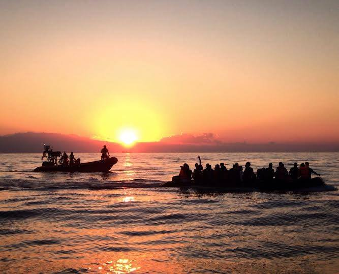
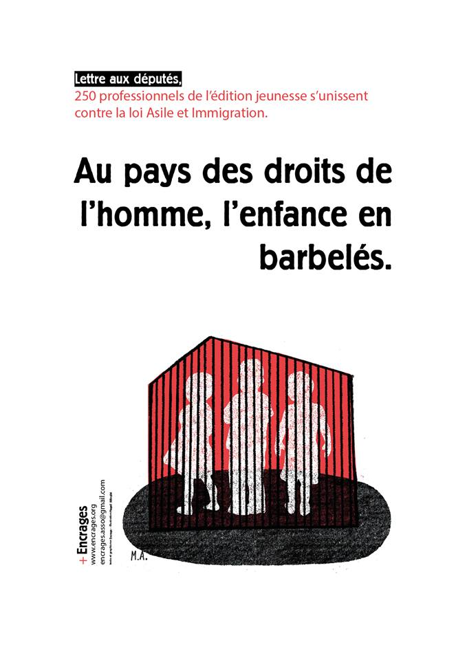

### AYS Daily Digest 29/03/18: **19 boats tried to reach Lesvos on Wednesday**

_Refugees forced to sleep outside / Dangerous situation at the Greek border with Turkey due to flooding / Protests against the French immigration and asylum law continue / Aquarius boat rescues 122 people off the coast of Libya / And more news…_

Photo by Matt Llewellin
### GREECE
#### Boats try to reach Lesvos and people forced to sleep outside

19 boats tried to reach Lesvos on Wednesday, with eight managing to arrive and the others stopped by the Turkish coast guard\. 472 people were stopped while 294 got to the island\. In March alone, 916 people arrived while only 505 left for the mainland\. MSF says that due to overcrowding, new people arriving on the island—including children—had to sleep outside\.

New initiatives have started on the island to make life a little bit easier and support is needed as always\. Refugees 4 Refugees was founded by Omar Alshakal who swam to Greece and went to Germany, before returning to Lesvos to address the needs and concerns of refugees\. Their new initiative “Habibi Land” is a community centre that will provide activities and promote a feeling of community\. You can donate [in kind](https://needslist.co/refugee4refugees) or help them out [financially](https://needslist.co/refugee4refugees) \.

On Lesvos, the trial of Salam Aldeen from Team Humanity as well as four other rescuers will start in less than one month\. They are charged with human smuggling after looking for a boat in distress\. You can donate to support the legal fees via this [link](https://startsomegood.com/danish-lifeguard-fighting-a-battle-of-injustice) \.

On Kos, one speedboat with eleven people was picked up by the Greek coast guard\.
#### Golden Dawn linked to attack in Athens

The [Greek Observer](http://thegreekobserver.com/greece/article/39990/police-identified-two-golden-dawn-members-as-perpetrators-of-attack-at-favela/) says two individuals were identified as perpetrators of the attack against the “Free Social Centre Favela”, in which three persons were injured\. The two individuals are alleged to be high\-ranking members of the extreme right party Golden Dawn\.
#### Volunteers needed in Athens \(and elsewhere\! \)

Volunteers are needed at the [2nd School](https://www.facebook.com/2ndschoolrefugeesshelter/) to teach language classes for children and adults\. Volunteers are especially needed as the school hopes to open their classrooms to members of other squats\.

Other volunteers are needed across Europe and the Middle\-East\. In Serbia for example, Borderfree is looking for volunteers, speaking english and at least 20 years old willing to work in Presevo \(contact i [nfo@border\-free\.ch](mailto:nfo@border-free.ch) \) while in Bekaa Valley, Lebanon, Salam needs a [Volunteer Coordinator/Field Officer](https://www.facebook.com/notes/salam-ladc-%D8%B3%D9%84%D8%A7%D9%85/we-need-a-international-volunteer-coordinatorfield-officer/1922313857780873/) \.

Other volunteer needs can be found on Greecevol as always\.
#### Dangerous situation at the border with Turkey due to flooding

With the flooding of the Evros river at the border with Turkey, volunteers have warned to avoid the border region near the river\. [Greek Reporter](http://greece.greekreporter.com/2018/03/28/greek-crews-search-for-15-missing-migrants-near-evros/) says local officials have called upon the government to declare the region in a state of emergency and warned that the level of water in the river has been above dangerous levels for four consecutive days\. Rescue crews are still searching for 15 refugees who tried to cross the river\.
### FRANCE
#### Eritrean minor dies in Lille

A 16\-year\-old Eritrean was found injured along the road in Calais and died in the hospital on Wednesday\. [Passeurs d’Hospitalités](https://passeursdhospitalites.wordpress.com/2018/03/29/encore-un-mort-de-la-frontiere/) notes this is the 5th death this year due to the border with the UK\.
#### **Care4Calais in need of donations**

Care4Calais says it desperately need baby wipes and spray deodorant\. It says refugees have little access to showers, in addition to having to sleep rough and having little access to facilities to wash their clothes, meaning that skin conditions are rampant among refugees\. To help you can either collect donations and drop them off at collection points or donate money [directly](https://goo.gl/jmkx7A) \.
#### Protests against the immigration and asylum law on the 15th of April in Paris

On the 15th of April, BAAM will organize a [new protest](https://www.facebook.com/events/155896078422563/) against the draft immigration and asylum law\. It points out that the law reduces the time to submit an asylum application from 120 days to 90 days\. The law also reduces the appeal period from one month to 15 days and increases the maximum period of confinement in a detention centre from 45 days to 135 days\. Meanwhile, the appeals before the National Asylum Court is becoming non\-suspensive for some, meaning that they could be deported before a decision is taken about their appeal\. [Encrages](https://encrages.org/une-tribune-criee-par-encrages/) has also sent a letter to French MPs against the law, signed by more than 250 authors and artists involved in children’s books\. The letter notes that children continue being retained in France because of their family’s immigration status\. It says that 1 out of 3 migrants is a child and adds that 350 children have been detained in France last year\.
### SPAIN
#### Illegal pushbacks from Spain to Morocco

The [Commissioner for Human Rights](https://www.coe.int/en/web/commissioner/-/the-commissioner-intervenes-before-the-european-court-of-human-rights-on-cases-concerning-alleged-pushbacks-of-migrants-at-spain-s-border) has submitted observations to the European Court of Human Rights over the returns of people from the Spanish city of Melilla to Morocco\. It points out the established practice by Spain’s border guards to summarily return to Morocco migrants who attempt to enter Melilla by climbing the fence which surrounds the city\.
### SEA
#### Aquarius saves 122 people

The _Aquarius_ boat rescued 122 people, including 15 women and 30 unaccompanied minors, from a rubber boat off the coast of Libya\. The rescued people come from 21 countries, including Ivory Coast, Somalia, Morocco, Algeria, Libya, Egypt, and Bangladesh\. The Sea\-Eye rescue ship has started its new mission yesterday\. Founder Michael Buschheuer said “the threats by the Libyan coast guard and attempts by the Italian judiciary to stop private rescue at sea cannot prevent us from fulfilling our humanitarian duty”\. The ship is in addition to _Aquarius_ , the only rescue ship in this part of the Mediterranean\.

The Atlantic Pacific International Rescue Boat Project is organizing its [courses on Search and Rescue at sea for a third year](https://docs.google.com/forms/d/e/1FAIpQLSeMulT6emTvgv19UiYYUEU489Nryb1fsbb1GrD9_nMpd9zwdg/viewform) \. The summer school trains volunteers to work on lifeboats with a view to volunteering in the ongoing crisis at sea\. Advanced courses will take place from the 17th to 24th June
and beginner courses from the 24th June to 1st July\. The deadline to apply is today\!
### SWEDEN
#### Updated country report on Sweden

Aida has updated its [country report on Sweden](http://www.asylumineurope.org/news/28-03-2018/aida-2017-update-sweden) \. It notes that “age assessment remains an area of serious concern” due to the introduction of a new medical age assessment method, based on an examination of wisdom teeth and knee joints\. Out of 9,617 forensic opinions issued in 2017, 8,007 found the person to be aged 18 or over\. In 2017, a total of 4,379 persons were detained, including 78 children\.
### NETHERLANDS
#### Iraqi refugee detained in squat

[Enough is Enough](https://enoughisenough14.org/2018/03/29/the-hague-netherlands-ind-raids-squat-in-schilderswijk/) says immigration police \(IND\) raided a squat in The Hague this morning to arrest an Iraqi refugee, Ali\. According to his lawyer, authories had been deporting refugees back to Iraq for a short time\. Luckily, he was released late the same day\.

**We strive to echo correct news from the ground through collaboration and fairness\.**

**Every effort has been made to credit organizations and individuals with regard to the supply of information, video, and photo material \(in cases where the source wanted to be accredited\) \. Please notify us regarding corrections\.**

**If there’s anything you want to share or comment, contact us through Facebook or write to: [areyousyrious@gmail\.com](mailto:areyousyrious@gmail.com) \.**

_Converted [Medium Post](https://medium.com/are-you-syrious/ays-daily-digest-29-03-18-19-boats-tried-to-reach-lesvos-on-wednesday-8b6beb2d8379) by [ZMediumToMarkdown](https://github.com/ZhgChgLi/ZMediumToMarkdown)._
