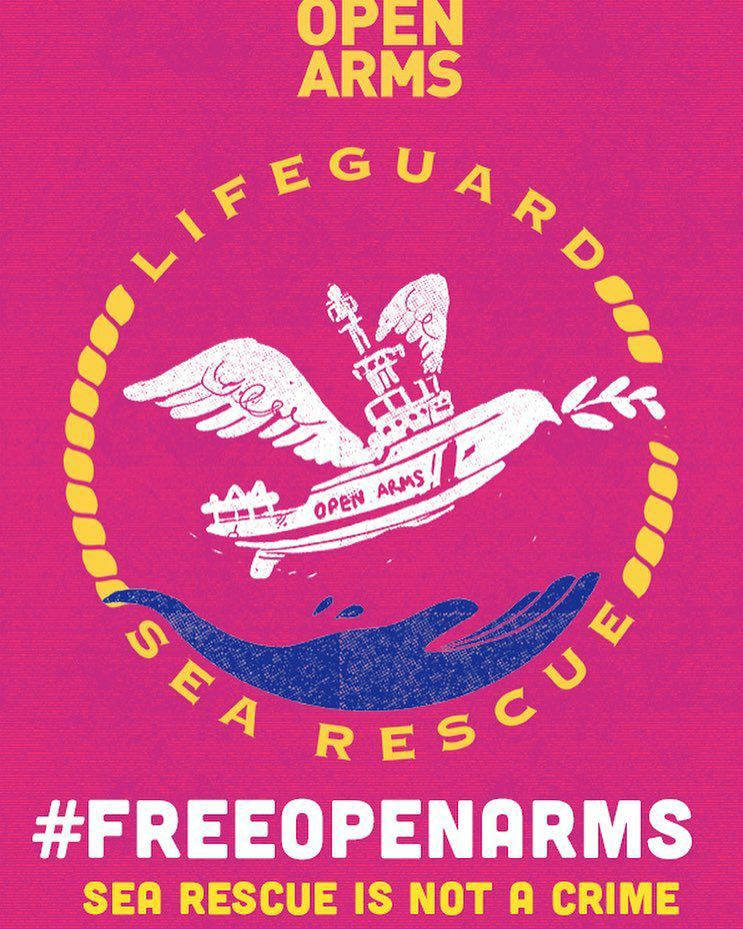
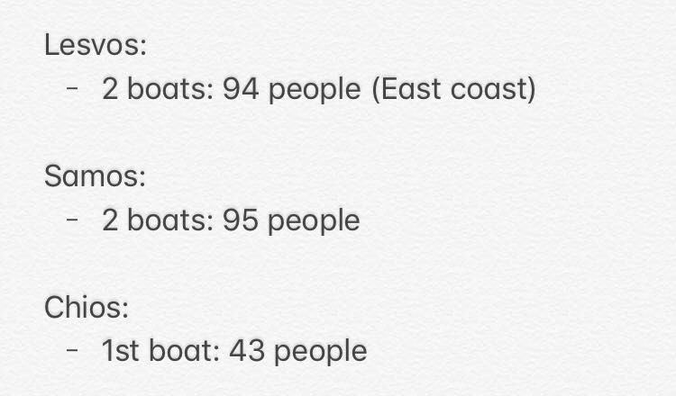
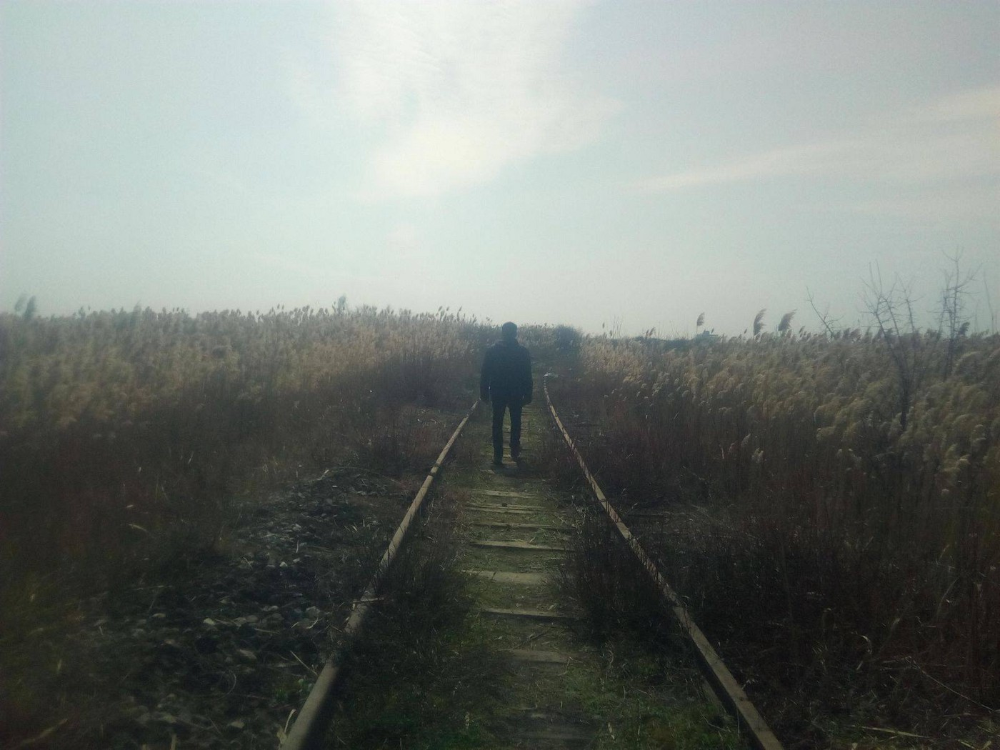

### AYS DAILY DIGEST 30/1/2018: Open letter to UNHCR in Bosnia

_What kind of help is provided in Bosnia by UNHCR // Hundreds saved from the sea // Criminalization of solidarity continues all over Europe // Reports from Bulgaria, Serbia, Italy, France, Greece…_

](assets/16a9b4af8e07/1*mGv-BiKYPI6WaLLhrKWD_Q.jpeg)

View from Moria\. Photo by [Advocates Abroad](https://www.facebook.com/advocatesabroad/?fref=mentions)
### Feature

After an AYS team visited [Velika Kladuš](ays-daily-news-digest-27-3-18-another-limbo-in-front-of-the-entrance-to-the-eu-830fa3dc0d76) a, a town close to the Croatian border in the north of Bosnia, concerned about the situation of the refugees and migrants we met, we reached out to the UNCHR in Bosnia and Herzegovina\. Our main concern was that people in Kladuša, but also in many other towns and cities in Bosnia, \(including Sarajevo, Trebinje, Višegrad…\) are left in a very difficult situation, depending on help mostly provided by the local population and a small number of international volunteers\.

We asked the UNHCR:

1\. What kind of support is UNHCR Bosnia and Herzegovina providing to the people in a\) the area of Velika Kladuša and b\) in the area of Sarajevo?

2\. What type of accommodation is provided by the UNHCR in Kladuša and Sarajevo?

3\. What are the organisations the UNHCR is working with on helping refugees?

4\. Please, can you send us a link to your reports about the situation with refugees in Bosnia and Herzegovina, bearing in mind that you provide regular reports for other countries on the route?

5\. How many pushbacks from Croatia have you registered and do you keep records about pushbacks from Croatia to Bosnia in the same way as UNHCR Serbia?

6\. Can you describe for us, in short, the procedure for access to international assistance in that country, or tell us what is the role of the UNHCR in Bosnia in this regard?

7\. What kind of registration for refugees is provided by the UNHCR in Bosnia and Herzegovina?

We received a reply almost immediately, but we did not get answers to our questions\. This is the reply we got from the Public Information Officer in Sarajevo:

“The link to the regular report of the UN team in Bosnia about the increase in the number of refugees and migrants is at [https://data2\.unhcr\.org/en/situations/mediterranean](https://data2.unhcr.org/en/situations/mediterranean) in the section Situation Reports / Updates\. There you will find the answers to most of your questions\. The next issue should be available at the end of the next week\.”

As you can see, hardly any answers can be found under the link provided\.

Meantime, our team in Sarajevo reports about the further increase in the number of people who are arriving\. Part of them is sleeping rough, including minors traveling alone, women, families and people with different health issues\. All of them went to the UNHCR asking for help, and got little or nothing\. Since Friday, the UNHCR office in Sarajevo has been closed due to holidays\.

Some people, around 170, are accommodated in different hostels in the city, which is the responsibility given to one local NGO \(BH Women’s Initiative\) by the UNHCR\. Nevertheless, the work of that NGO is hardly familiar to the civil society in Bosnia, and it is not clear what is their field of work\. People accommodated in this way are complaining about being left alone, not given enough food, and provided with almost no information about their status\.

At the same time, local people and volunteers are accommodating over 300 asylum seekers, providing them with food, medical help and any other support they can\. Some are living with people from Sarajevo in their homes\.

Additionally, health care is provided by an MSF team which regularly comes over from Serbia\. Local hospitals take people in, but have limited resources as that health system in Bosnia is collapsing\.

Volunteers are supported by the local charity [Pomozi\.ba](http://pomozi.ba) , which needs help in order to keep supporting hundreds of people in Sarajevo alone\. \(If you are considering donating, please add the remark “For Refugees”\) \.

Moreover, the process of registration is not clear to most of the people who are arriving, and they do not understand why no kind of official help is being provided\. The UNHCR is working with one local legal NGO — Vasa prava — in this area, but the help provided is often not what people expect\. The same organization has been working in this field for some time and so far they have not come out with any info about what is happening or about possible violations of the basic human rights of asylum seekers\.

The state provides accommodation in one and the only asylum centre where capacity is around 150 places\.

Once again, UNHCR is not doing enough to help people who are entitled to international help, and we can only hope that it will change in the future and that more transparency about their work in this country will be provided to the public\.

Since the beginning of this year, according to official sources, over 1,500 people have been registered as entering Bosnia\.
### Sea

Thanks to activists and NGOs, hundreds of persons were saved today from the sea\.

The Aquarius crew alone rescued 131 people\.

■■■■■■■■■■■■■■ 
> **[MSF Sea](https://twitter.com/MSF_Sea) @ Twitter Says:** 

> > BREAKING: The #Aquarius  has just finished a rescue of 131 people from a packed rubber boat in int'l waters. With yesterday’s rescue we now have over 250 people safely on board. The Aquarius will continue patrolling today in case of anymore boats in distress. Photos: Yann Levy https://t.co/aflBNAuhUM 

> **Tweeted at [2018-03-30 10:07:22](https://twitter.com/msf_sea/status/979661351512657920).** 

■■■■■■■■■■■■■■ 

In the meantime, the German NGO Sea\-Eye has announced its second migrant search\-and\-rescue \(SAR\) mission in the Mediterranean\. But after they announced their new mission, they received a [number of violent messages](http://www.infomigrants.net/.../sea-eye-launches-new...) and threats on social networks\.

The organization has saved 13,284 lives since it launched operations in April 2016\.

Instead of saving lives, the ship operated by the Spanish NGO Proactiva Open Arms is still under sequester at the Sicilian port of Pozzallo\.

They have been prevented from going on rescue missions since March 18, after they saved 218 people in the southern Mediterranean\.

**\#FreeOpenArms**

### Greece

Once again, the Greek islands are becoming overcrowded, while more people are coming every day\.

On Friday night, [a boat was picked up](https://www.facebook.com/AegeanBoatReport/posts/32607313458246 4) on the border outside Skala Mistegnon, Lesvos carrying 48 people: 3 children, 18 women, and 27 men\. A second boat was picked up in the same area with 46 people\.

More people arrived during the day, including one boat in Chios with 18 children on it\.

For all those needing assistance from Greek Asylum Office, good news\. Their employees have returned to work after the strike, the [Mobile Info Team reports](https://www.facebook.com/mobileinfoteam/photos/a.1800063030222418.1073741830.1796286800600041/2147146048847446/?type=3) \.

The AIDA issued the Country Reports on Greece and Turkey tracking key developments in asylum procedures, reception conditions, detention and content of protection throughout 2017\.
 
According to their report, pushbacks are occurring more often at the Greek\-Turkish land border of Evros\.

“According to these allegations, the Greek authorities follow a pattern of arbitrary arrest, de facto detention in police stations close to the borders, and transfer to the border, accompanied by the police, where the pushbacks occur\.”

During 2017, access to asylum on the mainland continues to be problematic while a registration appointment is scheduled within 81 days on average, although there have been cases where the full registration took place more than 6 months after pre\-registration\.

At the same time, unlawful pushbacks along the Turkey\-Syria border, as well as allegations of unlawful returns at other land borders, have continued\.

Read the full report [here](http://www.asylumineurope.org/news/30-03-2018/aida-2017-update-greece-turkey) \.

[Habibi Works](https://www.facebook.com/HabibiWorks/photos/a.940572176088207.1073741828.940393209439437/1389885984490155/?type=3) helped residents of the camp Katsikas to start their own community\-based school\.

“As long as the government can’t provide education for our children, we will do it ourselves,” residents are saying\.

The classes started on Monday, following a schedule that offers 12 different subjects for all children from age 8 to 16\.
### Bulgaria

[Bulgaria Border Monitoring](http://bulgaria.bordermonitoring.eu/2018/03/30/the-death-of-rebin-mitran/) reports about the death of Rebin Mitran, a young Iraqi Kurd who got refugee status in Bulgaria\. Apparently, he died on the 1st of March in Sofia, “very likely because of the low temperatures, which were minus 18 degrees during that time\.”

Apparently, he was found lying at Botevgradsko Shose Blvd\. in very bad condition\. According to some reports, an ambulance was dispatched to the street where Rebin was found but did not take him to an emergency room\. The police are still investigating the case\.

“Rebin was one of many refugees in Bulgaria who could not cope with the harsh situation there\. Without social money or the lack of health care, his condition got worse day by day\. Rebin said he had relatives in Germany and he thought about living there\. Besides that, he had a mother in Iraq, who died a few months ago\. His story shows very clearly that having refugee status means not much in Bulgaria\.”
### Serbia

[Refugee Aid Serbia](https://refugeeaidserbia.org/wp-content/uploads/2018/03/RAS_Field_Report_20022018-3.pdf) group reports there were 73 new arrivals during the first two weeks of March\. Most of the people are from Pakistan \(41%\), Afghanistan \(18%\), Iraq \(14%\) and Syria \(11%\) \.

So far, people are mainly accommodated in different camps, while about 20 are sleeping rough in Belgrade\.

Šid, Serbia\. Border area with Croatia\. Photo by No Name Kitchen\.

The same group noticed a rise in the number of people who are arriving from Iran\. They have been arriving mostly by plane after a visa liberalization system was put in place between the two countries which enables Iranian citizens to stay in the country legally for 30 days\.
### France

[Help Refugees](https://www.facebook.com/HelpRefugeesUK/photos/a.123267671367248.1073741830.111893659171316/588147158212628/?type=3) team reports once and again about the large\-scale dismantlement at the largest distribution point in Calais\.

“The police formed a wide perimeter and recovery of personal belongings, sleeping bags and tents was very limited, almost everyone lost everything once again, including vital medication\. Last week, our team responded quickly to a large scale clearance, replacing tents and sleeping bags for over 150 people in the area\. This was followed by a few volunteers receiving fines and having to present themselves at the police station under suspicion of installing people on the land\. We are waiting to hear whether they will be charged with the offence of solidarity, for giving refugees shelter\. Clearances like this happen almost every morning in Calais, where people lose their belongings over and over again\. The weather is already taking a turn for the worse, heavy rain has started, with storms and continuous rains expected for the next week\.”

Despite promises from the French President Macron to get people “off the streets, out of the woods” by the end of 2017 and the continued eviction of makeshift settlements, new [research by Refugee Rights Europe](https://www.ecre.org/op-ed-situation-for-asylum-seekers.../) reveals that the situation remains critical for refugees and displaced people sleeping rough on the streets of Paris\.

[L’Auberge des Migrants](https://www.facebook.com/AubergeMigrants/photos/a.10152514841565339.1073741825.358496450338/10155937663260339/?type=3) needs donations to continue their work\.
### Italy

[Baobab reports](https://www.facebook.com/BaobabExperience/photos/a.840628946013859.1073741828.840615826015171/1630186877058058/?type=3) about “a racist act and abuse of power in a public hospital in the capital of Italy”, when they accompanied a migrant in need of health care\. Apparently, doctors refused help a person in need\. Read more in their report\.

**We strive to echo correct news from the ground through collaboration and fairness\.**

**Every effort has been made to credit organizations and individuals with regard to the supply of information, video, and photo material \(in cases where the source wanted to be accredited\) \. Please notify us regarding corrections\.**

**If there’s anything you want to share or comment, contact us through Facebook or write to: areyousyrious@gmail\.com**

_Converted [Medium Post](https://medium.com/are-you-syrious/ays-daily-digest-30-1-2018-open-letter-to-unhcr-in-bosnia-16a9b4af8e07) by [ZMediumToMarkdown](https://github.com/ZhgChgLi/ZMediumToMarkdown)._
