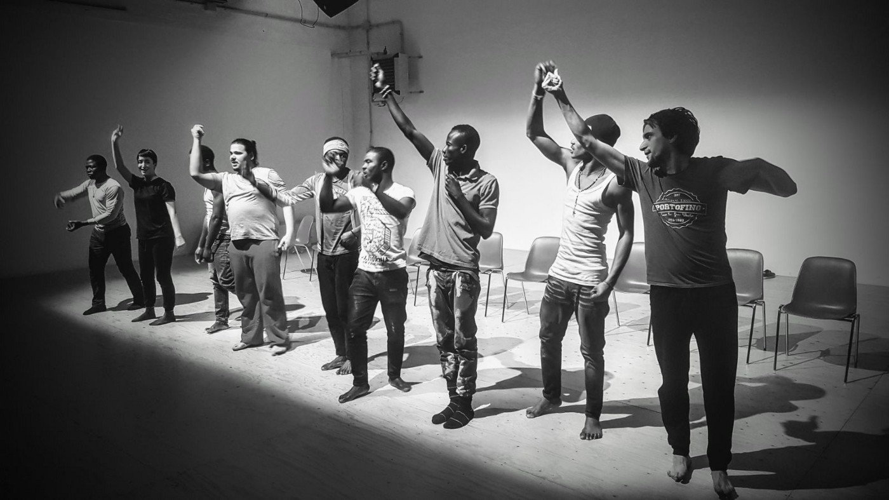

### AYS SPECIAL: I will come to you, river
#### How dance theatre could help asylum seekers to get back in touch with their personal journeys, boost self\-expression and create togetherness\. AYS volunteer went to see “Transitanze”, a dance theatre project, created in collaboration between Caritas Tarvisina and Art\(h\)emigra Satellite and talked with some of participants

Credit: Luca Antonello

“ _Come to your river_ 
_I will come to your river I will come to your river Come to your river \(Wash my soul\)_ 
_I will come to your river \(Wash my soul\)_ 
_I will come to your river Wash my soul again_

_Carry away my dead leaves_ 
_Let me baptize my soul with the help of your waters Sink my pains and complains_ 
_Let the river take them, river drown them_ 
_My ego and my blame_ 
_Let me baptize my soul with the help of your waters Those all means are so ashamed_ 
_Let the river take them, river drown them…_ ”

\(Ibeyi, River, 2014\)

“ _What’s your favourite place_ ?”

This is the starting point of the journey, knowing where you come from\. Some people prefer the river, the forest, the market, the Palace of the King, all places deeply connected to the origins, where art and culture and a sense of togetherness can be created and flourish\.

The importance of the places you visit everyday or the importance of the places you are forced to stay in, when you have no choice but to trust people you have never met before\. The journey as a metaphor of life, the physical and internal journey as starting points to express yourself, reconnect to your body and create community\.

Immediately I felt the necessity to expose such work, give it resonance as much as I could, as it represents a real human to human experience; through the means of dance, barriers drop and what you see is just a man, with the same struggles, dreams and necessities that we all share\.

These are the pillars of “Transitanze”, a dance theatre project, created in collaboration between _Caritas Tarvisina_ and _Art\(h\)emigra Satellite_ , that I had the chance to see in mid\-February\.

I had a chat with the Caritas operators, the guys on stage and the dance teacher in order to collect more information on why and how the project was born and developed, what complexities the participants had to face and, more importantly, how they felt throughout the project and now that it has come to an end\.

Credit: Caritas Tarvisina

**Transitanze**

is a [dance theatre project](https://www.facebook.com/transitanze/) , whose main topic is the journey, physical and metaphorical\. It was developed throughout 14 meetings, between September\-October 2017 \(even though the first rehearsal was in November\) and February 2018, when the 3 performances, open to the public, took place\.

The main actors were six asylum seekers, hosted in _Ca’ Florens_ and three Italian dancers, already members of [_Art\(h\)emigra PhT_](http://spaziozephiro.it/teatro-studio/ART-H-EMIGRA-SATELLITE) \.

The idea was born with the main goal of overcoming physical barriers, getting back in touch with your inner self and reclaiming self perception\. Incredible was the enthusiasm the guys always had, throughout the path and their ability to never lose the focus of the project, even after a long day of classes and other activities\.

Another key word that emerged from the chat I had with the Caritas operators is “respect”: respect of their times and bodies, respect for the others, for the group, for the other residents of the centre\.

The possibility to take part to _Transitanze_ was initially given to all the guys hosted in the centre \(24 in total\), but the group defined itself with the time, as some people decided to drop out for non interest or other personal reasons\.
They immediately showed a big courage to just take part to a new project, to trust the decisions made by the operators and the dance teacher\.

The guys felt this need to share, to be together, to take part to a project that could allow them to express and discover themselves\.

Credit: Luca Antonello

**Ca’ Florens**

is a CAS, a centre for extra\-ordinary reception, which functions as first level reception centre, located in the province of Treviso, North\-East of Italy\. It is managed by Caritas Tarvisina and is designed to host 25 people, at the moment 24 people live there\. The residents are all young male, between 18 and 35 years of age, coming from different African countries and Pakistan\.

An average time of stay, depending on bureaucratic procedures and the number of arrivals, is around 18 months for each person \(even though now, 30 more territorial commissions have been established, boosting the bureaucratic machine and making the procedures a little bit faster to manage\) \.

Ca’ Florens offers 3 main services, a part from room and board, which are: assistance with the asylum procedure and legal assistance, given by lawyers and professionals, medical assistance through regular general practitioners and social inclusion activities, like Italian classes \(every morning, from Monday to Thursday\), carpentry workshops, sport activities, bike repairing laboratory, vegetable gardens creation and care and artistic projects, like Transitanze\.

Recently, the guys could also take part to an HACCP course \(Hazard analysis and critical control points\), which is mandatory to all those who are working with food, to have a solid background when dealing with food safety\. As for now, this certificate will allow them to volunteer in the Caritas canteen, but is definitely a plus and a step forward when it comes to look for employment\.

Ca’ Florens collaborates with other associations and Caritas centres for external workshops, to which those interested can take part in specific time frames during the day\. In terms of fundings received for the activities, Caritas relies on ministerial fundings and internal fundings for specific extra\-curricula projects, like Transitanze, which was implemented through discussions at the “Tavolo operativo profughi”\.

Among the operators, I find extremely important to underline the presence of a cultural mediator who was an asylum seeker himself, who knows the struggles of the procedures and who lives in constant touch with the people hosted in the structure\. He was also very kind and helped with the translation to French of some of the questions I made to the guys\.

**The dancers**

were six asylum seekers from Nigeria, Gambia and Burkina Faso \(in Italy since 2017\) and three Italians\.

One of the guys was targeted by some bullies in the centre and felt he couldn’t be part of the project anymore\. This is a risk that could happen in every structure and raises the question of how to deal with these acts of abuse related to a different culture, a different age, a different ethnical background\. Having seen the centre myself, I can easily say that these guys are lucky, as they have a safe space, professional operators who care for them and offer them inputs to improve and learn, but what can happen in places where these conditions are absent?

I had a chat with four of the guys involved in the project, A\., B\., N\., D\. and what emerged from it, is the absolute positive environment they felt they had created with the help of their fellows\.

N\. told me that for him it was a privilege to take part to Transitanze, he felt he got to know the people he lives with and created stronger friendships with the people in the group\. There were challenges, like the linguistic barrier, but he felt good, being able to express himself even without sharing the same language\.

D\., who was a dance teacher for children back home, said that the rhythm helped him to soften the communication obstacles; he feels happy and “brave” because he took the chance\.

All of them were proud of the work done and the relationships they built with the dance teacher and the Italian dance mates\. B\. said “ _There were good moments with them, it was beautiful to talk together, live together and even when there were difficulties, we said to each other “Don’t worry, together we can make it_ ”\. They were all very open about their feelings and also found a “mum” in the dance teacher who encouraged them not to be shy on stage and “ _face the crowds,_ ” also as a metaphorical lesson to face adversities in life\.

These guys felt home also because a certain importance was given to _the ritual, the prayer_ , a specific sacred moment to share with the group, to “ _come together_ ” before the beginning of the performance\.

Most of them now feel they would like to continue a similar artistic path and continue expressing themselves through art\.

But now, the big challenge for them as well is to understand fully the experience and what practical benefits they could gain from it\.

_A side note\. During the show various props were used, one of them was a pretty big and resistant table that was assembled by C\., hosted at the centre, during the carpentry workshop at Ca’ Florens\. So also other residents had the chance to collaborate in other forms, with their skills\._

Credit: Luca Antonello

**Art\(h\)emigra Satellite**

is a dance theatre company with previous experience of working with vulnerable groups, such as elderly people or disabled, therefore there was a sensitive approach throughout the journey\.

What the dance teacher underlined is the importance for the guys to understand the benefit of the whole project, the practical side\. That’s why the company released a certificate of attendance for the length of the project in order for the guys to show that during their asylum procedure they were open to new experiences and they were actually involved in some activities external of the centre, more in contact with the local community\.

The dance teacher told me that the last show, on 10th March in Treviso, was an extremely positive experience, when they were sold out \(380 seats\! \), not only for the company but for the guys as well as they felt their path reached a concrete goal, facing the audience, the public, the possible future reality where they would have to integrate\.

The only “difficulty” was the language barrier, that was easily overcome thanks to the physical body and personal expression\.

L\., the dance teacher, also re marked the importance of the ritual of the white sage before each show, as the guys are still attached to the culture of rituals, building community, creating togetherness and believing in the spirituality of the elements of Nature\.

That is why it is painful in a way for her to receive messages from the guys, “ _What are we going to do now? Are we going to see you again?_ ” and, as she tries to talk and find ways to keep up the work done until now and involve more people, new ideas come up on how to fight cliches and prejudices through art, art that becomes social and political activism; art that helps create awareness and consciousness, on stage and in life, art that destroys personal and social roles and shows people as people\.

The show starts from the guys and their personal desires, from the will to understand who we are as people, to stand proud of the cultural heritage we have\. That’s why it all started from the simple question “ _What’s your favourite place?_ ”, where do you come? and proceeds with the human desires, the explicit and untold, the right to privacy\.

I asked L\. how the guys felt the cliches our society normally has of migrants and she replies that that was a crucial topic in the developing as it led to the question “What do we want to say with this project?” Obviously there is a will to fight the social prejudice and to claim back the uniqueness of the individual, the fact that “I descend from ancient kings and by remembering this I will be able to find a way to defend my dignity as a human being, even in such a fragile situation”\.

These guys are descendants of kings, they identify with their personal armour, which is also the reason why they are here, they made it through\. Thanks to their inner and external strengths they reached safety and are aware of the incredible potential of such background\.

“ _The show it’s not a punch in the face, it’s an open hand_ ”

Credit: Luca Antonello

**The local community**

The first and most immediate reactions of the public were a sense of gratitude and as if, in a way, distances were shortened, as if now they had been given the keys to get a sense of empathy with those on stage and realise we are all human beings\.

As one of the Caritas operators underlined, there is also this strong image of the “ _migrant who creates culture,_ ” which is an image the rich European countries tend to neglect too much and too often, as coming from a different culture doesn’t mean having no culture at all\.

Definitely a lot to ponder and reflect upon; what is needed though is also to act, act on a local level, to strengthen the mindset of welcoming those we don’t know, act to destroy stereotypes and superficial prejudices\.

**And now?**

The show had high costs, according to Caritas, so it would be difficult to perform it multiple times, but one option is surely to make the audience pay a small amount at the entrance to cover the expenses and allow maybe to save some money for the asylum seekers in order for them also to receive some cash, they earned through their work, once out of the structure\.

It would be also ideal to work with guys hosted in second level reception centres, those who already received a positive answer from the asylum commission and that are sure to be stable in the area for a prolonged time\.

Definitely, it is a valid project that can be reproduced in other structures but the target needs to be well identified in those who are legally sure to stay in a certain territory, also because their mindset would be different\. Also, it would be extremely interesting to give the chance to participate to different people hosted in different centres in the same area, in order to create another group where people don’t necessarily live together but can find a safe space to express themselves\. _Art\(h\)emigra_ did offer to continue this path with weekly regular open classes, where the number of Italians present equals the number of migrants, which is also a challenge as on how to communicate with someone that has different physical codes\.

Nevertheless, taking into consideration all the different aspects touched, allowing asylum seekers to have a way to express themselves through their art, reflection of their personality, is a much needed possibility\.

Credit: Caritas Tarvisina

_Side note: even though some dance theatre projects were presented in the past years in the same region, there was no specific analyses of how much they influenced the participants or what kind of benefits, if any, the asylum seekers received from the artistic path\. Moreover, they were all implemented in second level reception centres and mostly with only women involved\._

By Cristina Guglielmini

> **We strive to echo correct news from the ground through collaboration and fairness\.** 

> **Every effort has been made to credit organizations and individuals with regard to the supply of information, video, and photo material \(in cases where the source wanted to be accredited\) \. Please notify us regarding corrections\.** 

> **If there’s anything you want to share or comment, contact us through Facebook or write to: areyousyrious@gmail\.com** 

_Converted [Medium Post](https://medium.com/are-you-syrious/ays-special-i-will-come-to-you-river-e59076959829) by [ZMediumToMarkdown](https://github.com/ZhgChgLi/ZMediumToMarkdown)._
