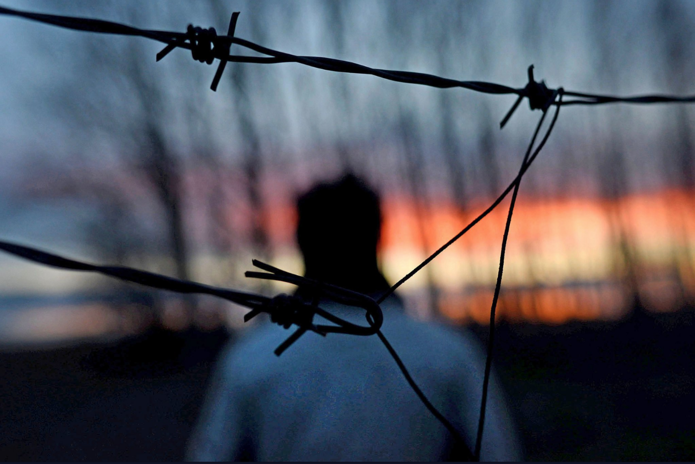
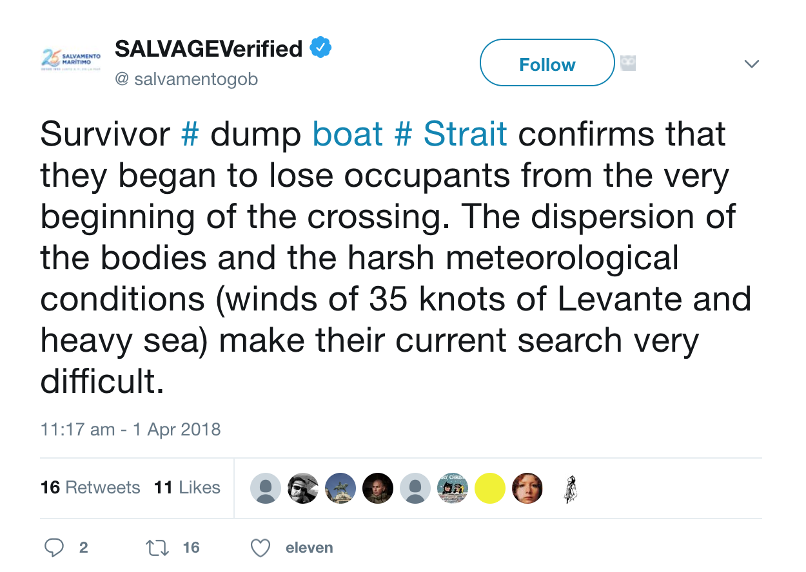
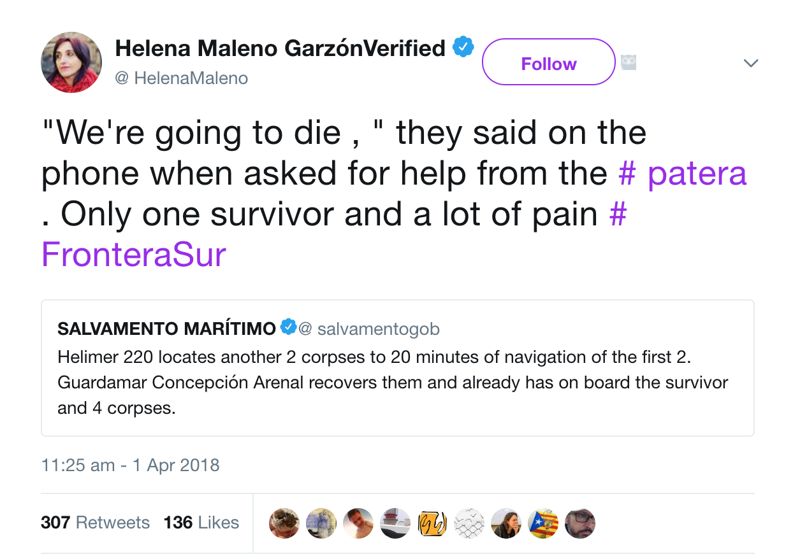
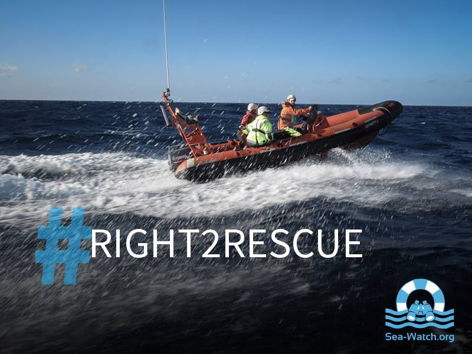
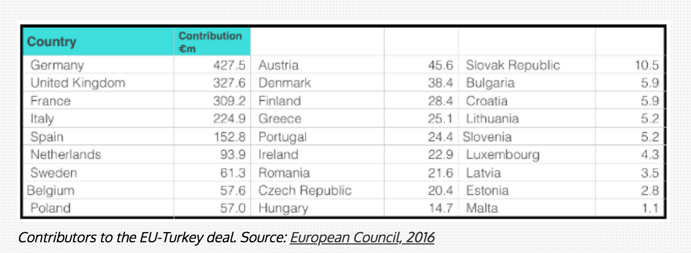

### AYS Daily Digest 01/04/2018: Calls to review the framework underpinning Libyan Coast Guard intervention in international waters

MSF and SOS MEDITERRANEE call on European and international authorities to clarify the framework underpinning Libyan Coast Guard \(LCG\) intervention in international waters after Aquarius was forced to stand down a rescue operation// Two boats intercepted by Turkish Coast Guard// Proactiva Open Arms moored for two weeks// Four dead and 11 missing trying to reach Spain// 264 people arrive in Greece// More news from Greece// France and the UK

A young refugee in the forest where he lives very close to the Serbo\-Hungarian border\. Source: Gabriel Tizon
### FEATURE:

In the last three days, 292 people in distress in international waters off the coast of Libya were saved by Aquarius, a search and rescue vessel chartered through a partnership between MSF and SOS MEDITERRANEE\.

After receiving authorisation, in its latest rescue, from Rome to engage in a rescue mission of a rubber boat in distress carrying approximately 122 people, the Aquarius, was ordered to stand down and give priority to the Libyan coast guard which was yet to arrive on the scene\. Following this incident, [MSF and SOS MEDITERRANEE have called on](http://sosmediterranee.org/three-days-of-complex-operations-in-the-central-mediterranean-sos-mediterranee-calls-on-european-and-international-authorities-to-urgently-clarify-framework-underlying-libyan-coast-guard-intervention/?lang=en) European and international authorities urgently to review and clarify the framework underpinning Libyan Coast Guard \(LCG\) intervention in international waters\.

■■■■■■■■■■■■■■ 
> **[Paolo Biondi](https://twitter.com/PaoloBiondi82) @ Twitter Says:** 

> > On Saturday the MRCC, by putting on standby the Aquarius while the latter was the first rescue unit arriving at the scene of action and responsible to assume automatically the duties and responsibilities of the rescue, didn't act consistently with its international obligations. [twitter.com/MSF_Sea/status…](https://twitter.com/MSF_Sea/status/980499672627400706) 

> **Tweeted at [2018-04-01 17:49:19](https://twitter.com/paolobiondi82/status/980502383355682816).** 

■■■■■■■■■■■■■■ 

#### A review of the incident:

At 10:32 a\.m\. on Saturday, both the Aquarius and the LCG were alerted about a rubber boat in distress carrying 122 people in international waters, 23–24 nautical miles from the Libyan coast by the Italian Rescue Maritime Coordination Centre \(IMRCC\) \.

The Aquarius arrived first on the scene at around 11:00 a\.m\. Despite initially being instructed to undertake the rescue operation, once on the scene they were instructed by the IMRCC that the LCG would be in charge of the rescue operation and that the Aquarius should remain on standby and not engage\.

While on standby waiting for the LCG to arrive, the situation of the seriously overcrowded vessel began to deteriorate as water began to seep in\. MSF and SOS MEDITERRANEE were able to negotiate with the IMRC and the LBG to allow the Aquarius to stabilise the situation by providing lifejackets and assessing the medical conditions of all the people on board\. Thirty\-nine medical and vulnerable cases were determined and given permission to board the Aquarius, including one newborn, pregnant women, children and families\. The Aquarius was prohibited from rescuing the remaining passengers\.

At 1:52 p\.m\. the Aquarius was ordered to move away from the scene, leaving dozens of people on the rubber boat\. The remaining people were picked up by the LCG and taken back to Libya\.

Following this incident MSF and SOS MEDITERRANEE have released a statement denouncing the current conditions of rescue operations at sea as unacceptable\.
#### Statement from MSF:

> MSF reiterates again that Libya is not a place of safety and under no circumstances should refugees and migrants be returned there\. MSF continues to call on European governments to prioritise the safety of refugees and migrants rather than actively enforcing policies of deterrence and containment in Libya\. MSF refers to the Dutch minister of foreign affairs who after her visit just last week stated that the situation in the detention centres is inhumane and they should be closed as soon as possible\. 

#### Statement from Sophie Beau, vice president of SOS MEDITERRANEE International:

> **_“The conditions of rescue operations at sea are ever more fraught with complications, as well as confusing and risky transfers of responsibility, which is unacceptable_** _\. Rescue vessels are forced to negotiate the evacuation of people in distress, the sick, injured and exhausted to a safe place on an arbitrary case\-by\-case basis, and in a tense and dangerous emergency situation on the high seas **\. Life\-saving assets at sea are becoming increasingly scarce and operations,at the same time, are being delayed, human lives are put at risk and rather than prioritizing their safety, people in distress are being returned to Libya,”**_ 

> _“We are neither lawyers nor political decision\-makers\. We are a European civil association of sea rescuers aboard an ambulance ship, which helps where people are in danger of death\. Since the very beginning of our mission in March 2016, we have consistently respected international maritime law, the maritime authorities, and worked while respecting the principles of humanity and solidarity on which Europe was founded, the DNA of seafarers\. **In the absence of a clear, public and transparent protocol governing the intervention of the Libyan Coast Guard in international waters off Libya, we urge the relevant European and international bodies to clarify the framework governing the actions of the various actors in this maritime area, which is the deadliest in the world\.** If this framework has recently changed and no longer allows us to save all lives in danger, if we can no longer carry out our mission safely, we believe that we and all other European citizens should be the first to be informed\.”_ 

#### SYRIA:

A video has surfaced showing the belongings of Ghouta residents being sold on the roadside by Syrian regime forces in parts of Damascus\.

#### TURKEY:

The Turkish Coast Guard intercepted two boats in the Aegean and Mediterranean sea yesterday\. One boat was carrying 84 people trying to reach the Greek Island of Lesvos\. The other boat was carrying 113 Syrian refugees\.

■■■■■■■■■■■■■■ 
> **[SARwatchMED](https://twitter.com/SARwatchMED) @ Twitter Says:** 

> > #TurkishCoastGuard update: almost 200 people were intercepted yesterday in the #AegeanSea (2 boats with 84 ppl trying to reach the Greek islands of #Lesvos and #Farmakonisi) and in the Eastern #Mediterranean (1 boat carrying 113 Syrians) https://t.co/SdNbCtshNR 

> **Tweeted at [2018-04-01 21:00:08](https://twitter.com/sarwatchmed/status/980550402289602561).** 

■■■■■■■■■■■■■■ 

#### SEA:
#### Proactiva Open Arms has been moored for two weeks
#### They released this statement:

> Good evening, 
 

> Two weeks moored, kidnapped by those who prevent us from protecting these lives that do not count by condemning them to return to the hell they flee from\. [\#Libia](https://www.facebook.com/hashtag/libia) 

> They do not want witnesses on the most lethal border of the planet\. 
 

> [\#FreeOpenArms](https://www.facebook.com/hashtag/freeopenarms) 

[Four people were found dead](https://www.afp.com/en/news/826/four-migrants-found-dead-spain-others-missing-rescuers-doc-13k0jj1) off the coast of Spain yesterday, with eight others still missing after embarking across the sea on a make\-shift boat\. The bodies were recovered in the waters of the Strait of Gibraltar between Morocco and southern Spain\. Only one person has been rescued\. The nationalities of the deceased are not yet known\.

> Guardamar Concepción Arenal returns to port with only one survivor, [\# patera](https://twitter.com/hashtag/patera?src=hash) overturned [\# Estrecho](https://twitter.com/hashtag/Estrecho?src=hash) and four lifeless bodies recovered\. Reaches [\# Algeciras](https://twitter.com/hashtag/Algeciras?src=hash) about 10:00 p\.m\. 

#### An Easter message from Sea Watch:

> Easter weekend a year ago became a symbol of the failure of European Union assistance, as two civilian lifeboats had to make an emergency call themselves because no support came, although thousands were in distress\. The captain of the IUVENTA had to decide to let people drown or overload their ship\. Meanwhile, from omission, sabotage\. Today rescue vessels are seized for doing their duty under international law: to rescue people in distress and bring them to safety\. We urge the European states to respect fundamental human rights, including the _non refoulement_ principle, there is a right to salvation\! [\# Right2rescue](https://www.facebook.com/hashtag/right2rescue?source=feed_text) [\# Freeopenarms](https://www.facebook.com/hashtag/freeopenarms?source=feed_text) , [\# freeiuventa](https://www.facebook.com/hashtag/freeiuventa?source=feed_text) 

Training of the SAR Crew, Easter 2018
### EU:

[In leaked documents, it has been revealed](https://m.theblacksea.eu/billions-for-borders/article/en/eu-turkey-meeting-leak) that major European Union member states have expressed dismay at having to pay their share of the six billion Euro Deal to Turkey to maintain the EU\-TURKEY agreement\. Instead of financing the EU\-Turkey agreement from their national coffers, they have requested the option of using pre\-accession funds or diverting cash from the EU budget to pay for the deal\. Originally negotiations were being made for the EU to pay three billion dollars to Turkey, however Erdogan insisted that the sum be raised to six billion euros\.

> The ‘agreement’ approved two tranches of funding at three billion euros each, as financial aid to the Syrians\. The first was to be spent by the end of March 2018, when a second three billion Euro would be available for a further two years\. 

> Pleased with the situation in Turkey, the EU announced this month that it is ready to release the further three billion Euro of its taxpayers’ money, the majority of which was due to come from EU member states’ individual budgets\. 

#### GREECE:
#### 264 people arrived in Greece yesterday

One boat carrying 64 people arrived on the south coast of Lesvos, while four boats carrying 200 people arrived on Samos\.

[Kurdish people, along with locals and support from the city council, celebrate Newroz](http://www.taxiarxos.gr/?section=303037&language=el_GR&itemid730=397298&detail730=1) , welcoming spring, in the central square of Trikala, Greece\.

DocMobile is in need of donations to continue their vital work\.

> To be able to do this work, we are dependent on your help\! Help us to continue operating our vehicles\. Help us buy important medicines to care for babies, children, pregnant women, and people in general\! 

To find out more please follow [this link\.](https://www.facebook.com/docmobile.org/photos/a.1115077615231588.1073741829.1112468405492509/1908511199221555/?type=3&theater)

According to Aegean Boat Report, 4977 people attempted to cross the sea from Turkey to the Greek Islands in March of 2018\.

59 boats made the trip = 2526 people

57 boats were intersected by the Turkish Coast Guard = 2451

#### FRANCE:
#### More cases of police violence against asylum seekers in Calais:

The French police have been accused of forcibly and violently ripping out a man’s hair as they took him out of the truck he had managed to jump in to try & reach the UK\.

**Faces Before Numbers warn:** “we can all imagine the degree of force that was used by the police to reach that result\. Direct & disproportionate use of force\. There IS violence in Calais & it is NOT an isolated incident\. It happens daily & it also happens across France as a whole \(Paris, French/Italian border…\) and our government, by refusing to denounce & condemn it, is allowing it to continue\.”

L’Auberge des Migrants reports that the number of refugees and displaced people in Northern France is steadily increasing\. In addition, emergency centres that were opened over the colder months are no longer accepting people and are planning to close\. This is pushing those who found shelter there over the winter onto the streets or into the woodlands\.

Furthermore they report that during the evacuation that occurred in March 31, the police had two water tanks removed from the street\. This means that refugees are forced to come to the state distribution of meals to access water which is far from the places where people are living\.

L’Auberge des Migrants are asking for your help to continue their vital work and replenish the stocks that were depleted throughout the winter\. To find out more please [follow this link\.](https://www.justgiving.com/crowdfunding/MRSspringappeal)

> Every day we are met with new arrivals who have travelled unimaginable distances in their search for something better, and with the ongoing developments in the Middle East and North\-East Africa, this mass movement of people shows no sign of slowing\. 

**Protests in response to the March 31 evacuation:**

On Saturday many people gathered collectively to march together in a festive and determined atmosphere to [protest all the evictions](https://www.facebook.com/Nantes.Revoltee/videos/vb.294803323889181/1645397945496372/?type=2&theater) \. Nearly 2000 people participated\. Despite attempts to remain peaceful, tension was created by the state with use of a helicopter, water cannons, the deployment of several hundred police officers, blocked transport and misleading advertisements in the press\.
### UK:

Calais Action — Brighton are collecting donations of clothing for refugees in Northern France on various dates and locations throughout the month of April\. To find out how to get involved [please follow this link\.](https://www.facebook.com/photo.php?fbid=1725049014226030&set=gm.1890537851020953&type=3&theater&ifg=1)

> **We strive to echo correct news from the ground through collaboration and fairness\.** 

> **If there’s anything you want to share or comment, contact us through Facebook or write to: areyousyrious@gmail\.com** 

_Converted [Medium Post](https://medium.com/are-you-syrious/ays-daily-digest-01-04-2018-calls-to-review-of-framework-underpinning-libyan-coast-guard-f303e25bad32) by [ZMediumToMarkdown](https://github.com/ZhgChgLi/ZMediumToMarkdown)._
