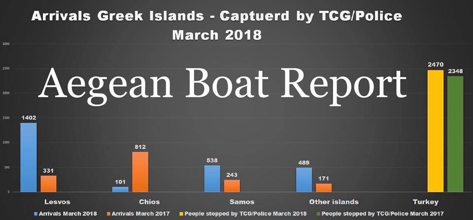
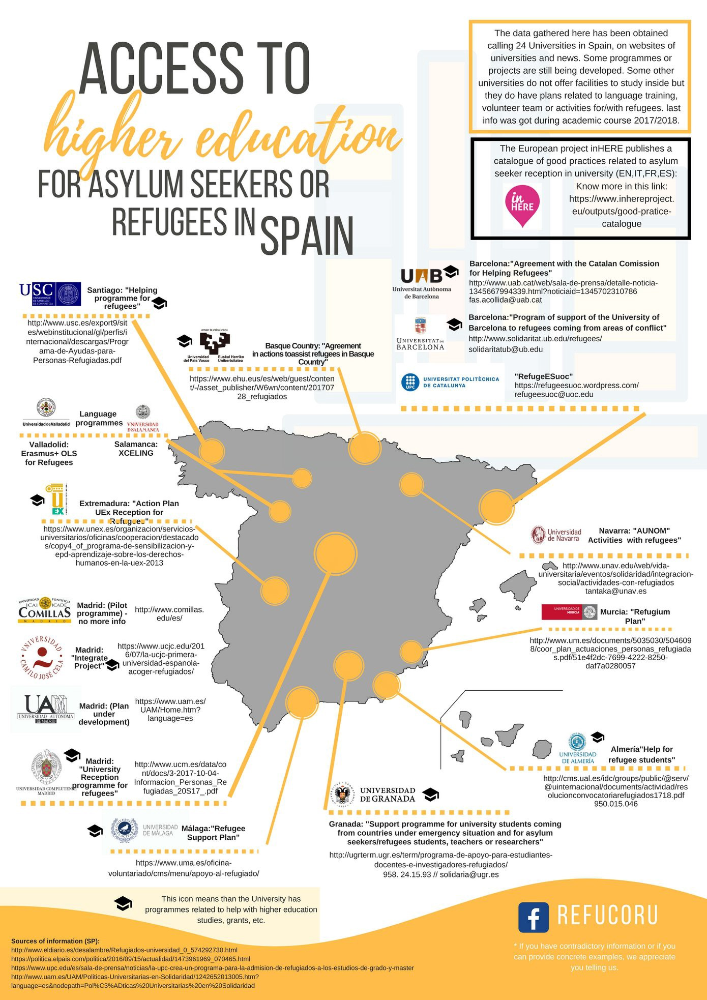

### AYS DAILY DIGEST 2/4/2018: 5323 people arrived in Greek island in March on 127 boats

_More funding for walls and fortification of borders // Help needed in Greece // Kosovo deported six people to Turkey // New system of registration in Paris // Israel reached deal about relocation of asylum seekers to Western countries_

](assets/ca1735c23486/1*lCkW0NNBsW5y-gLP_LgJ2Q.jpeg)

Phoot by [Gabriel Tizon](https://www.facebook.com/gabrieltizonfotografo/photos/pcb.1691354184243730/1691345147577967/?type=3&theater)
### Feature

With the spring, the number of people who are arriving at Greek islands, but also people who are trying to reach Italy and Spain over the sea, increased again\. Finding for walls and obstacles for people who are looking for safety, also increased\.

Spanish authorities will dedicate 2\.5 million Euros for the maintenance and reinforcement of barriers to Melilla and Ceuta\.

In the meantime, more people died at the sea\.

In 2018, more than 120 people died while trying to reach Spain\. Yesterday, in a shipwreck, 5 people died\.

■■■■■■■■■■■■■■ 
> **[Sergio Rodrigo](https://twitter.com/SRodrigoruiz) @ Twitter Says:** 

> > #MEDITERRANEO Desde las 19:30 hora de #España buscan una balsa con numerosas paresonas. Aún sin localizar. Ayer naufragó una balsa con 12 personas, ya han sido recuperados 5 cadáveres #FronteraSUR https://t.co/cjnGLAsWFL 

> **Tweeted at [2018-04-02 21:21:00](https://twitter.com/srodrigoruiz/status/980918043244187648).** 

■■■■■■■■■■■■■■ 

Monday morning at Samos started with rescue operations\. Two boats with over 100 people were saved from the water\.

[Aegean Boat Report](https://www.facebook.com/AegeanBoatReport/) published a short overview of this year developments stating that so far 278 boats have tried to reach the Greek islands, with a total of 11\.631 people\.

Only 127 boats made it, only in March 60, with a total of 5323\. The rest, 151 boats, with a total of 6308 people were arrested by the Turkish Coast Guard or police\.

[Greek authorities](http://www.ekathimerini.com/227319/article/ekathimerini/news/dozens-of-migrants-rescued-off-aegean-island-of-samos) claim more than 350 people had arrived on three Greek islands between Friday and Monday morning\.

Just to compare, in March 2016, 8,604 people reached the islands \(3,277 to Lesvos, 3,614 to Chios and 1,713 to Samos\) \.

People who reached the islands are living in overcrowded camps, in humiliating conditions, endlessly waiting to move to the mainland and for the possibility to continue their journeys\. At the moment, according to the official numbers, 14\.386 people are stranded on islands\.
### Spain

Infographic showing the universities offering some kind of service for asylum seekers or refugees in Spain by [RefuCoru](https://www.facebook.com/Refucoru/posts/777626779098501) \.

### Greece

The [European Commission](http://europa.eu/rapid/press-release_IP-18-2604_en.htm) announced that €180 million will be given to Greece as an emergency support, which is kind of absurd after three years\. The money will be used “to scale up the flagship ‘Emergency Support to Integration & Accommodation’ \(ESTIA\) programme”\. Apparently, this program is meant to help “get refugees into urban accommodation and out of camps and provides them with regular cash assistance”\.

Additionally, the Danish Refugee Council, Arbeiter\-Samariter\-Bund, Médecins du Monde, the Spanish Red Cross, as well as Greek NGOs METAdrasi and Smile of the Child will get part of this money to provide “shelter, primary health care, psycho\-social support, improved hygiene conditions, non\-formal education, the provision of interpretation for health and protection”\.

For more, read their press statement, or even better, check what is happening in the field to get a real picture of how money is spent and for what\. And let us know\. We will share with everybody\.

While big NGOs get even more money, as well as governments, volunteers and activist working in the field, are struggling to continue with their valuable work\.

[Mano Aperta](https://www.facebook.com/manoaperta1/posts/1625221297571907) , a group of young people who “believe in solidarity and self\-management in practice,” continue, after two years, to offer hot, quality food to everybody who has a real need, refugees, homeless and those in need\.

> “We started in February 2016 and we have managed to operate independently and silently wherever we have been asked or needed, without any compensation\. Anyone who wants to participate in our effort \(with financial support, material support, or physical presence\) can send us a message\.” 

Help is needed for the [Open Cultural Center in Polykastro](https://m.facebook.com/story.php?story_fbid=2086135734748167&id=1302471973114551) , too\. They are looking for volunteers to work with them during May and June\.

Requirements:
\- Being more than 23 — Having some experience in the education field — English level intermediate

If you are interested send an email to [hhrr@openculturalcenter\.org](mailto:hhrr@openculturalcenter.org)

Samos Volunteers [need list](https://needslist.co/samos-volunteers) has been updated\.

> “If you can support us with filling our needs, please EITHER buy some spring/summer socks below OR see the list of other items we need that you can send to Samos\. Our Needslist has been updated for our spring/summer new arrival pack needs so that what you donate goes directly into our emergency packs distributed to new arrivals on Samos\.” 

Ellinikon warehouse in Athens needs help, too\.

The warehouse is run by the [Pampiraiki Group](https://www.facebook.com/groups/PAMPIRAIKI/?ref=br_rs) and it is the main central storage for donations and aid in Athens\. They distribute dry foods and essential non\-food items to more than 5000 people in shelters, squats, day centres, private apartments\.

Currently, most groups in Athens have run out of food and hygiene items to distribute\. They also need long\-term and short\-term volunteers to help with the sorting and distribution of donations\.

Please email and register at [Pampiraiki@gmail\.com](mailto:Pampiraiki@gmail.com) if you are able to help\.
### Kosovo

We almost never have info about the situation with migrants and refugees in Kosovo\. However, [recent deportation](http://m.ensonhaber.com/mitin-kosovadaki-feto-uyelerini...) of six people to Turkey caused public protests and a lot of criticism by civil society in the country\.

At the moment, Kosovo authorities are investigating the arrest and extradition which happened last week\. People who were arrested and deported were employees at the high school which is, apparently, financed by the Gulen movement\.

Human Rights Watch criticised the Kosovo authorities over the arrests\. Kosovo prime minister sacked the interior minister and secret service chief for failing to inform him about the arrests\. Turkish President Tayyip Erdogan told that the six men had been captured by Turkish intelligence officers and brought to Turkey\.

Ankara claims that a network run by the U\.S\. \-based cleric Fethullah Gulen is guilty of the coup attempt in 2016, which Gulen denies\.

As [Reuters reports](https://af.reuters.com/article/worldNews/idAFKBN1H70C8) , Kosovo has been under pressure from Turkey in recent weeks to take action against schools funded by the Gulen organisation\.
### France

[InfoMigrant reports](http://www.infomigrants.net/en/post/8342/new-system-to-start-asylum-process-in-france) that starting in May, people in the region around Paris who want to apply for asylum will need to make the first appointment through a telephone helpline run by OFII \(The French Office for Immigration and Integration\) \. Many are concerned the system is too complicated\.

“This doesn’t make things simpler,” director Pierre Henry said to into migrants\. “I don’t think that this helpline is a good model for helping asylum seekers access their rights\. I fear that at least some migrants will struggle to understand this service”\.

Help is needed in Calais\. This is n [eed](https://www.facebook.com/groups/www.fast.eu/permalink/2070193209927185/) list for Calais\.
### Israel

Interesting development in Israel where the government, apparently, reached an deal with the UNHCR according to which refugees from South African countries will not be deported back but relocated to Canada, Germany and Italy and other Western countries\.

[Haaretz](https://www.haaretz.com/israel-news/israel-cancels-forced-asylum-seeker-deportations-after-deal-with-un-1.5973475) reports that the Interior Minister Arye Dery said that Israel had agreed to resettle one asylum seeker in a Western country for every asylum seeker awarded temporary residency status in Israel\. In a statement, the Prime Minister’s Office gave these numbers as 16,250 each\.

Currently more than 38,000 asylum seekers from Sudan and Eritrea live in Israel\.

> **We strive to echo correct news from the ground through collaboration and fairness\.** 

> **If there’s anything you want to share or comment, contact us through Facebook or write to: areyousyrious@gmail\.com** 

_Converted [Medium Post](https://medium.com/are-you-syrious/ays-daily-digest-2-4-2018-5323-people-arrived-in-greek-island-in-march-on-127-boats-ca1735c23486) by [ZMediumToMarkdown](https://github.com/ZhgChgLi/ZMediumToMarkdown)._
