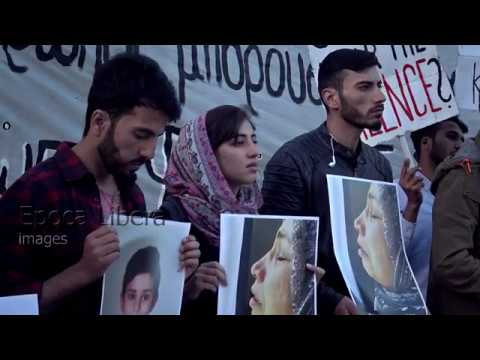
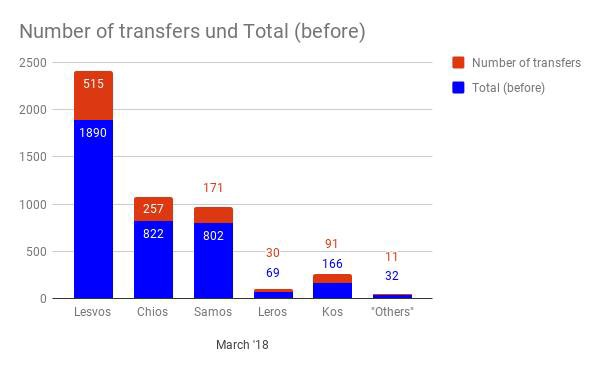
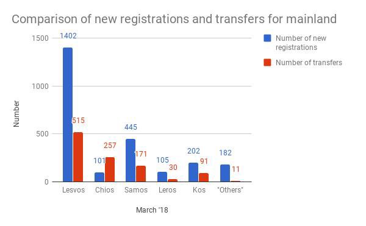
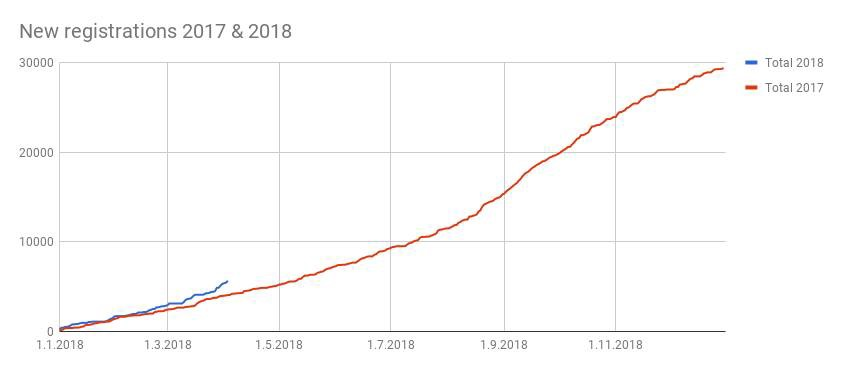
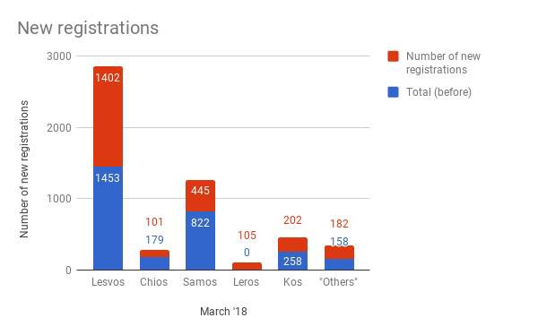
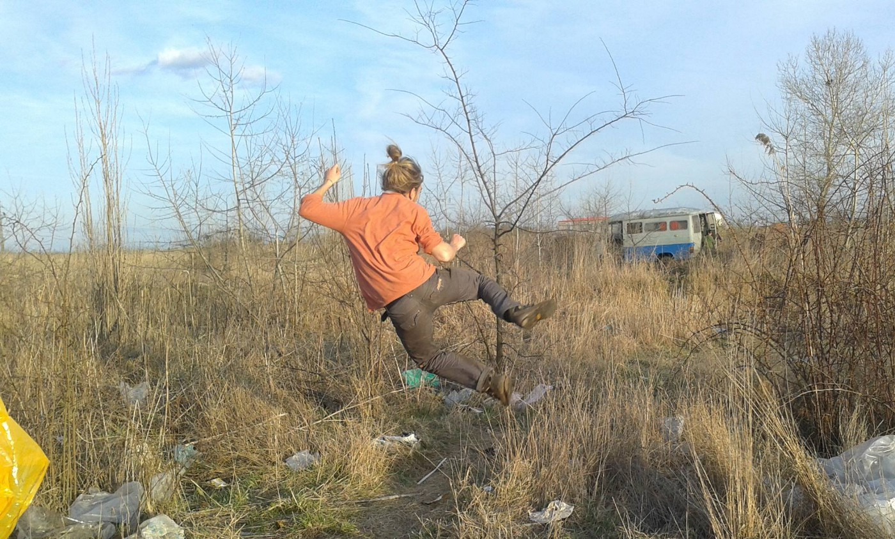
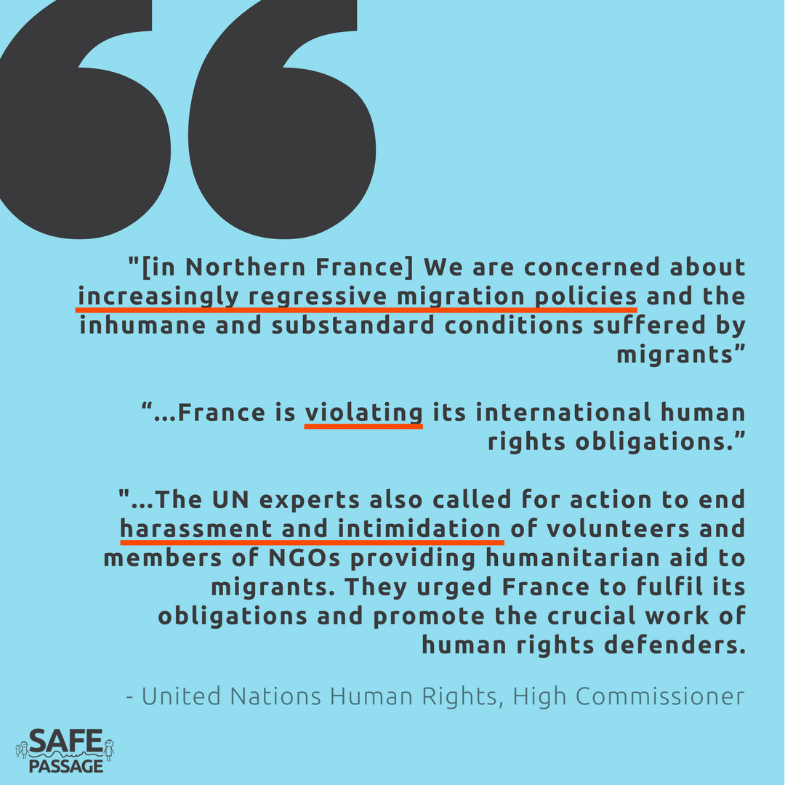

### AYS DAILY DIGEST 04/04/2018: “In Memory of a Child Who Should Have Been Saved\.”

Protestors demand accountability in horrific shipwreck // Arrivals have increased, transfers have decreased…we’ve heard this story before // Call for volunteers in Greece and Serbia // Police targeting refugees for restrictions or deportations in Austria and Bulgaria // After the “winter truce”, refugees under attack again in France // And more…

](assets/99f8feafa138/1*x6duxROhfiFmyoAQyL9NDw.jpeg)

Photo Credit: [Marios Lolos](https://www.facebook.com/marios.lolos.1)
### FEATURE: Right to Answers\!

A group of protestors have called for an investigation into possible negligence on behalf of the Greek coast guard in connection with the death of sixteen people who drowned when their boat capsized in mid\-March\. The three survivors were present, and two of them spoke\. One of the survivors, who was aboard and lost his father, two brothers, and a sister, demanded answers on behalf of him and his remaining family members\.

> “Why was there only a search operation 24 hours later? Why? They had everything, they had the location, they had the information\. It wasn’t one call; there was at least eight telephone calls\!” 

Testimony of another survivor

> “Why they didn’t save my seven year old brother? People who are coming to save their lives? We came here to save our lives? Why did no one come to rescue them?” 

See footage of the protest here:

The boat was carrying a total of 21 people, many of them children\. Five individuals survived, but two disappeared, suspected of being the smugglers who organized the trip\. Two weeks ago, two ministers who possibly bear political responsibility for the disaster and negligence, arrived on Samos and met with the survivors, but a formal investigation seems yet to be launched\.

■■■■■■■■■■■■■■ 
> **[Savvas Karmaniolas](https://twitter.com/savvaskarma) @ Twitter Says:** 

> > Relatives of victims and other demonstrators gather in Athens for the 16 people who drowned in #Agathonisi, #Greece, #EU last month: 
[spiegel.de/panorama/griec…](http://www.spiegel.de/panorama/griechenland-ueberlebende-fluechtlinge-erheben-schwere-vorwuerfe-a-1199713.html)

#refugeesGr https://t.co/Cj0tdkBdik 

> **Tweeted at [2018-04-04 16:47:25](https://twitter.com/savvaskarma/status/981573969366134784).** 

■■■■■■■■■■■■■■ 

A family member of some of those on the boat who had previously been living on Samos received notice that their boat was in distress\. Subsequently there were multiple calls and locations sent to Greek authorities; however, a formal rescue operation did not commence until twenty\-four hours after the initial notice of distress had been relayed\. By that point, the ship had already capsized\. It is hoped that this protest will yield some move towards accountability, although this remains as yet uncertain\.

For more information on the shipwreck, available in German, go [here](http://www.spiegel.de/panorama/griechenland-ueberlebende-fluechtlinge-erheben-schwere-vorwuerfe-a-1199713.html) \.

The extent to which children are bearing the heavy cost for the European commitment to security has been shown time and time again\. Much of the grassroots involvement in the refugee crisis was first spurred on by the dissemination of the tragedy of the young boy Alan Kurdi, who died nearly three years ago\. Why are the lives of these children any different? What does this say about society?
### GREECE
#### Islands: Samos

A volunteer from Samos reports as follows:

> With over three hundred refugees arriving over only three days this week, the situation in the Samos camp has gone from bad to worse\. The island has not seen this many arrivals in a short period in months, and the authorities on the camp are unprepared as usual\. Families are being given pop tents and are forced to find a place to set them up\. People are being transferred from the island now, but not as fast as people are arriving\. There has been an increase in people arriving from the Idlib region and many from Afrin\. Many of these people are fleeing Turkish attacks in Afrin\. And still, the EU is trying to send them back to Turkey\. 

All of these arrivals come with the backdrop of a meeting between the [presidents of Iran, Russia, and Turkey](https://www.rferl.org/a/russia-iran-turkey-talks-ankara-putin-rohani-erdogan/29145415.html) , all of whom are deeply involved in the conflict in Syria\. The three powers have committed to “speeding up efforts to bring calm” in Syria; however, considering that in many cases “pacification” results in more destruction and forcible relocations of people on the ground, it is unlikely that this will significantly detract from the push factors forcing people to move to ostensibly safer territory\.

Sadly, the European sphere of the refugee crisis seems largely cut off from following these developments, and resistant to understanding how these decisions affect people’s lives, instead prioritizing the “safety and security” of Europe\. Indeed, in a statement the Jens Spahn, the German minister of health from Christian Democratic Union advocated for a massive expansion of Frontex in order to [“properly protect the border”](https://euobserver.com/tickers/141502) even stating that a “partial surrender of sovereignty” would be acceptable in favor of “security\.” In the larger context of the excuse many countries are offering in order to resist fulfilling their agreed\-upon quotas for refugee relocation, i\.e\. “we must protect our sovereignty and not let Merkel dictate our migration policy”, this pivot reveals the true instincts and priorities\. Surrender of sovereignty is acceptable, provided it means keeping people out\.
#### Islands: Lesvos

The Kempsons have posted a call for spotters and shore support\. The volunteer needs to be self funded, over 21, able to drive, among other things\.

“The watch runs 24 hours a day and shifts are set according to immediate need and changes in situation or weather conditions\. 
 Volunteers work in pairs and on a shift\-rotation system\. 
 Volunteers will be fully briefed and inducted before going on their first spotting shift and, as stated above, the shifts will be covered by two volunteers on each shift\.”

For more information on how to get involved, go [here](https://www.facebook.com/thekempsons/posts/2014181868829716?hc_location=ufi) \.

[Arash Hampay](https://www.facebook.com/arashampay?hc_ref=ARSFhWSFwOf6DnJ7MWjUwJjM9pR8WXyp00njTHUFqMFUAcCMa5yFuApP4QLzAvqU_TY) posts about the Moria 15 — how they were harrassed by police in the middle of the night\!

_“Monday night around 2 am when all the prisoners were sleeping with all their problems and nervous situations that they have, even some of them have specific sicknesses, police attacked them\. They went to every single room and scared all the prisoners\. They searched everywhere and without any reason two prisoners got beaten by police\.”_

This activity demonstrates the callous and sadistic contempt the authorities have towards people daring to speak up on their own behalf\.
#### Islands: Chios

The Aegean Boat Report notes that 177 people arrived yesterday to Chios\.
#### Greek Asylum Service regional offices and all Greek public services will be closed on Friday April 6 and on Monday April 9 for Easter holidays
#### On Thursday April 5 GAS will be operating until 2 pm
#### GAS confirmed to Refugee\.Info that all appointments made for Thursday April 5 will take place\.

For March, there were a total of 2437 newly registered people and only 1075 transfers to mainland\. There have been large increases on Lesvos and Samos\. Greek authorities counted 356 people who were registered as new arrivals between 30 March and 2 April on Samos\. See the statistics below for more\!

#### Mainland: Athens

URGENT CALL FOR COORDINATORS FOR MOBILE LIBRARY PROJECT IN ATHENS

Hi all, ECHO Refugee Library is in urgent need of coordinators to continue the running of the mobile library project\. You can find a job description here:

“If you or anyone you know is interested, please email at contact@echo\-greece\.org\. If you are not ready to commit to a coordinator position but would like to volunteer as a driver for the mobile library, please contact\!”
### BULGARIA

Refugee\.Info posted an update for Bulgaria about increased restrictions on freedom of movement\.

“ If you leave your zone without permission twice, the authorities will put you in a closed center\.

You won’t be able to leave until your asylum procedure is over\.”

For more detailed information, go [here](https://www.facebook.com/refugee.info/posts/1718525081540965) \.
### SERBIA

Volunteers have put together an immensely helpful pinned post on how to volunteer in Serbia, covering logistics, information, basic humanitarian principles, and more\. It is available in multiple languages, click [here](https://www.facebook.com/refugeesserbiavolunteering/posts/285409605228470) \.

Rigardu e\.v\. is looking for volunteers to support their project in Subotica\!

Photo credit: Rigardu e\.v\.

> We are looking for volunteers who can start as soon as possible to support our team in Subotica, Serbia for at least a month, preferably longer\. We provide showers and hygienic care for refugees outside the camps\. You can expect diverse challenges, enriching encounters and an interesting work field at one of the EU’s outer borders\.
 

>  If you’re interested or just need more information please contact us here on Facebook or write a mail to projekte@rigardu\.de\!
 

>  Please note that the work can be recognized as an internship or acknowledged for credits at university or else\. 

### AUSTRIA

[Refugee Protest Camp Vienna](https://www.facebook.com/RefugeeCampVienna/?hc_ref=ARSQSpm-4J0mSh_7bPVsbGilMhKu1bVBmtqyyJwECu90znREuD2IM_OgxhjlkD_tdog&fref=nf&hc_location=group) has posted an important alert for people in Austria\. Police are targeting those without a ticket on public transit and some people are being collected for deportation in this way\!

> Who may be concerned by a mass deportation flight:
 

>  \-Generally persons who have had a definite negative result of their asylum case\.
 

>  \-People living in Austria under undocumented, irregular conditions\.
 

>  \-The risk is generally higher if someone is already under severe pressure from the authorithies to leave Austria\.
 

>  Trouble with Austrian law enforcement authorities and having a criminal case on one’s record can increase the risk of deportation, but people who have never had any such problems are also concerned\.” 

> IMPORTANT:
 

>  Always buy a ticket for public transport\!
 

>  Avoid places that are regularly sites of racial profiling \(Meidling, Westbahnhof, Praterstern…\) 

### FRANCE

After the so\-called “winter truce” wherein some emergency shelters were opened up in Paris, well…spring has arrived\. These emergency measures have ended, and people dumped out on the streets again\. Although an emergency shelter in Dunkirk will remain open, it is far from adequate, with many sleeping outside\. Read more in this comprehensive update [here](https://medium.com/thedigitalwarehouse/calais-update-4-4-2018-130152da54b9) \.

[SALAM Nord/Pas\-de\-Calais](https://www.facebook.com/salamnordpasdecalais/?hc_ref=ARRJwZkc-y3m0YOZbOpU8Qqfq1GbhmmfVMezgUiavpcLvEhx1T96NiFDzxgMvltisNI) provided an update on the new clearings of Calais which occurred on the 3rd and the 4th\. Not a single tent was able to be recovered, and many belongings were lost\.

](assets/99f8feafa138/1*WnpRIolyhztrpN6npLXe7g.jpeg)

Photo credit: [SALAM Nord/Pas\-de\-Calais](https://www.facebook.com/salamnordpasdecalais/)

UN Human Rights representatives issued a statement calling on the French government to do more to secure safe drinking water and protection for refugees along the [northern coast of France](http://www.ohchr.org/EN/NewsEvents/Pages/DisplayNews.aspx?NewsID=22917&LangID=E) \. The office decried the inhumane and increasingly violent and horrible treatment of refugees and asylum seekers, many of whom are force to clean themselves and drink from polluted water sources\. Recall earlier reports of chemical burns on refugees who had to wash in a polluted stream\.

Photo Credit: Safe Passage

See the horrific conditions in Calais for yourself\.

**We strive to echo correct news from the ground through collaboration and fairness\.**

**Every effort has been made to credit organizations and individuals with regard to the supply of information, video, and photo material \(in cases where the source wanted to be accredited\) \. Please notify us regarding corrections\.**

**If there’s anything you want to share or comment, contact us through Facebook or write to: areyousyrious@gmail\.com**

_Converted [Medium Post](https://medium.com/are-you-syrious/ays-daily-digest-04-04-2018-in-memory-of-a-child-who-should-have-been-saved-99f8feafa138) by [ZMediumToMarkdown](https://github.com/ZhgChgLi/ZMediumToMarkdown)._
