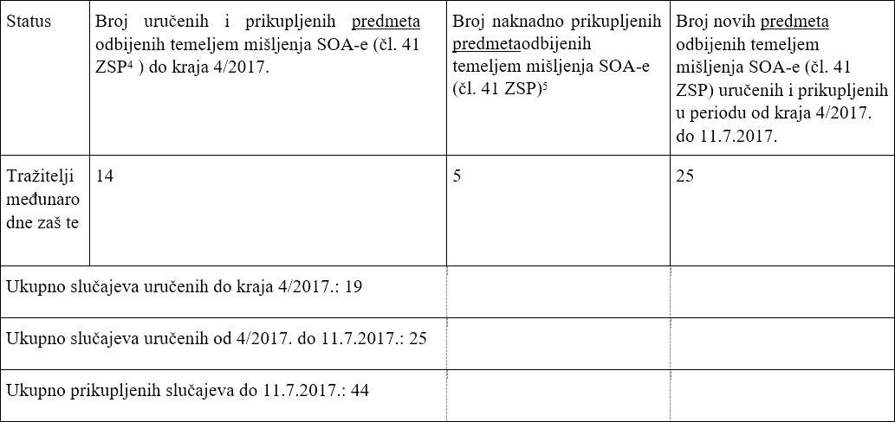
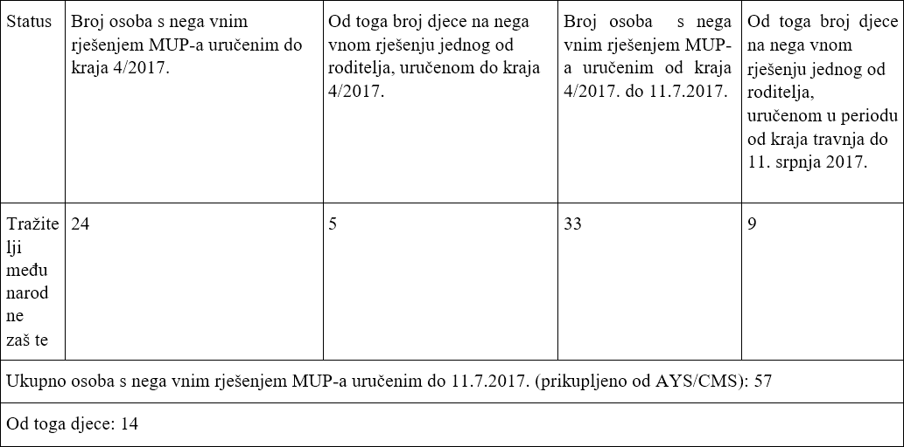

### AYS Special — Drugi izvještaj o arbitrarnim i nezakonitim praksama Ministarstva unutarnjih poslova \(MUP\-a\) i Sigurnosno\-obavještajne agencije \(SOA\-e\)

**Ovaj članak je originalno objavljen 26\. srpnja 2017\.**

Opis konteksta:

Krajem travnja 2017\., organizacije civilnoga društva “Are You Syrious?” \(AYS\) i “Centar za mirovne studije” \(CMS\) upu le su relevantnim ins tucijama i medijima izvješće o arbitrarnom i nezakonitom postupanju Siguronosno\-obavještajne agencije \(SOA\-e\) i Ministarstva unutarnjih poslova \(MUP\-a\) prema tražiteljima međunarodne zaš te\. [\[1\]](#_ftn1)

Organizacije civilnoga društva izvijes le su o iznenadnom porastu broja odbijenih zahtjeva za međunarodnom zaš tom koje su podnijeli tražitelji iz Sirije i Iraka, kao i odbijanja zahtjeva za reguliranje statusa stranca u Hrvatskoj \(državljanstvo, privremeni ili stalni boravak\) \. Ono što je poveznica svih gore navedenih odbijenica jest MUP\-ovo pozivanje na članak 41\. Zakona o sigurnosnim provjerama, odnosno odbijanje zahtjeva zbog navodnog postojanja takozvane “\(sigurnosne\) zapreke”, temeljem mišljenja SOA\-e\.

Sukladno članku 42\. Zakona o sigurnosno\-obavještajnom sustavu i članku 5\. Zakona o strancima,

SOA provodi provjeru osoba koje su primljene ili se primaju u hrvatsko državljanstvo i stranaca u Republici Hrvatskoj čije je prebivalište važno za sigurnost države, tj\. provodi provjere radi iden ficiranja potencijalne prijetnje nacionalnoj sigurnos \. U skladu s člankom 41\. Zakona o sigurnosnim provjerama, SOA “podnosi podnositelju zahtjeva samo mišljenje o postojanju ili nepostojanju sigurnosne prepreke” za strance koji borave ili će boravi u Republici Hrvatskoj i za osobe koje se primaju u hrvatsko državljanstvo\. MUP donosi odluku o statusu stranca temeljem SOA\-inog mišljenja, koje može i ne mora uze u obzir\.

U praksi, MUP, nakon zaprimanja zahtjeva za međunarodnu zaš tu ili reguliranje statusa, gotovo redovito podnosi zahtjev SOA\-i, koja tada provodi takozvanu “sigurnosnu provjeru”\. U većini slučajeva obuhvaćenih ovim izvješćem, nakon navodne provjere sigurnos , SOA je dostavila mišljenje koje navodi samo sljedeće:

“Na temelju klasificiranih podataka označenih stupnjem tajnos „OGRANIČENO“, utvrđuje da postoje zapreke za pozi vnim rješavanjem zahtjeva \(…\)”

SOA djelatnicima MUP\-a ne dostavlja obrazloženje razloga “\(sigurnosne\) zapreke”, a o razlozima nisu obavještene, ni stranke, ni njihovi odvjetnici\. Temeljem tog mišljenja, MUP odbija zahtjev stranke i upućuje stranku na podnošenje upravne tužbe upravnom sudu u roku od 30 dana, no zbog neimanja uvida u relevantni spis SOA\-e, odvjetnici tužitelja \(tražitelja međunarodne zaš te\) ne mogu efikasno zastupa tražitelje međunarodne zaš te, koji slijedom toga nemaju jednako pravo sudjelovanja u pravnom postupku te im je uskraćeno pravo na pravedno suđenje\.

Prethodni izvještaj AYS\-a i CMS\-a također navodi kako se SOA oglušuje na presudu Visokog upravnog suda Republike Hrvatske\) kojom je u sličnom slučaju poniš o MUP\-ovo rješenje [\[2\]](#_ftn2) doneseno temeljem neobrazloženog SOA\-inog mišljenja u kojemu se SOA pozivala na tajne podatke klasificirane najnižim stupnjem tajnos \(‘OGRANIČENO’\) \.

Ovakvo postupanje dovodi do niza nezakonitos i arbitrarnos koja rezul raju povredama ljudskih prava izbjeglica i stranca u RH\.

U ovom dokumentu izvješćujemo o razvoju situacije do 26\. srpnja 2017\., koju AYS i CMS pomno prate od početka travnja 2017\. godine\.

Situacija krajem srpnja 2017\. godine:

1\. Nema odgovora državnih i javnih jela u zakonskom roku od 30 dana [\[3\]](#_ftn3)

Krajem travnja 2017\. godine, AYS i CMS poslali su izvješće sa zahtjevom za hitnom reakcijom svim relevantnim ins tucijama i jelima\- Predsjednici Republike Hrvatske; Predsjedniku Vlade Republike Hrvatske; Predsjedniku Hrvatskoga sabora; Saborskom Odboru za unutarnje poslove i nacionalnu sigurnost; Saborskom Odboru za ljudska prava i prava nacionalnih manjina; Pučkoj pravobraniteljici;

Pravobraniteljici za djecu; Pravobraniteljici za osobe s invaliditetom; Ministarstvu vanjskih poslova; Sigurnosno\-obavještajnoj agenciji; Vijeću za građanski nadzor sigurnosno obavještajnih službi; Državnom odvjetništvu\.

Do današnjeg dana organizacije nisu primile nikakav odgovor, kao ni pojašnjenje razloga kašnjenja od strane bilo kojeg jela, s izuzetkom pojašnjenja Saborskog Odbora za unutarnje poslove i nacionalnu sigurnost upućen 15\. srpnja 2017\., u kojemu Odbor navodi da “\(…\) će održa sastanak u SOA\-i jekom jesenskog zasjedanja, na kojemu će nadležne osobe Agencije odgovara na sva pitanja vezana uz unutarnju poli ku i nacionalnu sigurnost, pa tako i na pitanja vezana za ovu temu

\(… \)”\.

Osim toga, Pučka pravobraniteljica je primila predstavnike CMS\-a i najavila pokretanje istrage u sklopu njenih ovlas , među m nemamo daljnjih informacija o istrazi\.

Također, pokušaj dogovora sastanka sa Službom za strance i azil se nije ostvario, jer se službenici MUP\-a nisu povratno javili s prijedlogom termina\.

Neke međunarodne organizacije poput Isusovačke službe za izbjeglice \(Jesuit Refugee Service — JRS\) reagirale su na opisanu situaciju [\[4\]](#_ftn4) , iako još uvijek čekamo reakciju Hrvatskog Crvenog križa, te UN\-ovih agencija u Hrvatskoj — UNHCR\-a, UNICEF\-a, IOM\-a te dijela civilnoga društva u Hrvatskoj u čijem je mandatu zaš ta prava odraslih i djece izbjeglica\.

Iz ovog je vidljivo kako ins tucije ne reagiraju na nalaze iznesenog izvješća te posvećuju slabu pozornost kršenju ljudskih prava izbjeglica u Hrvatskoj\.

2\. Više nego 100%\-tno povećanje broja eviden ranih odbijenica temeljenih na neobrazloženom mišljenju SOA\-e u dvostruko kraćem periodu vremena \(30\. travnja — 11\. srpnja 2017\. \)

Iako se podaci MUP\-a odnose na predmet, odnosno na broj izdanih nega vnih rješenja, broj stvarnih osoba — tražitelja međunarodne zaš te na koje se odnose te odluke daleko je veći, iz razloga što se na zahtjevu za međunarodnu zaš tu mogu i nalazi djeca tražitelja azila \(obično majki\) \. Iz toga smo razloga odlučili prikaza podatke i o broju slučaja, i o broju stvarnih osoba — tražitelja međunarodne zaš te na koje utječu ove odluke\. To je osobito važno, jer se radi o najranjivijoj skupini među tražiteljima međunarodne zaš te — djeci i maloljetnicima\.

Tablica 1 — Prikupljene informacije o broju odbijenih slučajeva \(prema broju izdanih i uručenih rješenja MUP\-a\) u kojima se SOA poziva na članak 41 Zakona o sigurnosnim provjerama

Tablica 2 — Prikupljene informacije o broju odbijenih osoba — tražitelja međunarodne zaš te, uključujući djece koja se vode na rješenjima roditelja u kojima se SOA poziva na članak 41\. Zakona o sigurnosnim provjerama

U vrijeme prvog izvješća, AYS i CMS prikupili su 14 rješenja/predmeta \(19 osoba, jer je u rješenjima bilo uključeno i 5\-tero djece\) u kojima je bilo potrebno odobri međunarodnu zaš tu, temeljem mer uma slučaja, no svi su odbijeni temeljem neobjavljenog mišljenja SOA\-e\. Naknadno smo prikupili još 5 rješenja/predmeta državljana Irana \(ukupno 6 osoba, jer je na jednom rješenju bila uključena i jedna beba\), koja su bila uručena tražiteljima međunarodne zaš te do kraja travnja 2017\.

Od kraja travnja do kraja srpnja 2017\. broj takvih predmeta povećao se na 44 \(uručeno je 25 rješenja\), što znači povećanje od preko 100% \(132%\) \. Ukoliko računamo prema broju stvarnih osoba, tada je povećanje još veće — u prethodnom razdoblju radilo se o 24 osobe, uključujući 5tero djece, dok smo za naredni period \(malo više od 2 mjeseca\) eviden rali 33 osobe, odnosno 9ero djece kojima je uručena takva odbijenica, što je povećanje od 138%\.

Dakle, od početka praćenja početkom travnja 2017\. pa do 11\. srpnja eviden rali smo ukupno 57 osoba \(44 predmeta\), od kojih je 14\-tero djece, kojima je uručeno nega vno rješenje MUP\-a u kojemu se bez obrazloženja tvrdi kako predstavljaju \(sigurnosnu\) prijetnju\.

Ako uzmemo u obzir da su jekom ovog 3\-mjesečnog razdoblja naše organizacije dokumen rale samo 8 pozi vnih rješenja [\[7\]](#_ftn7) , broj nega vnih odluka temeljen na neobjavljenom mišljenju SOA\-e čak je 7 puta veći od broja pozi vnih\.

Novi slučajevi uključuju obitelji s vrlo malom djecom \(2\-godišnjake\) iz Iraka \(Irački Suni , 25 slučaja ili 44%\) i Sirije \(21 slučaj ili 37%\) \.

Posljednja nega vna odluka temeljena na neobjavljenom mišljenju SOA\-e da rana je 26\. lipnja 2017\.

U međuvremenu su naše organizacije uspjele doći i do nekih prethodno nedostupnih predmeta te smo, uvidom u njih, došli do informacija kako je osim državljanima Iraka i Sirije, is p nega vnih odluka dodjeljivan i državljanima Pales ne i Irana \(ukupno 5 slučajeva\) \.

3\. Nedostaje jasna sta s ka MUP\-a o odobrenoj i odbijenoj međunarodnoj zaš u razdoblju od travnja do srpnja 2017\. godine

Sta s ka na službenim stranicama MUP\-a dostupna je samo do kraja ožujka 2017\.

\(h ps://mup\.hr/ministarstvo/dokumen /sta s ka \) — i samo za pozi vne odluke o supsidijarnoj zaš ili azilu \(ukupno 23 jekom prva tri mjeseca 2017\. \), ali ne i za broj nega vnih odluka\. Isto tako, posljednji podaci UNHCR\-a Hrvatska dostupni su samo za 2016\. godinu \(www\.unhcr\.hr\) \.

Dana 25\. srpnja 2017\. godine dobili smo sljedeće informacije od MUP\-a:

“U 2017\. godini pokrenuto je 33 upravnih sporova pro v rješenja o odbijanju zahtjeva za međunarodnu zaš tu na temelju odredbi o isključenju [\[8\]](#_ftn8) \. Za 24 predmeta upravni spor je u jeku, u 5 je odbijen tužbeni zahtjev, a u 4 slučaja poništeno je rješenje MUP\-a\.”

Naglašavamo kako smo u našem zahtjevu za informacijama inzis rali na razdoblju od 1\. travnja do 11\. srpnja 2017\., jer je porast broja nega vnih odluka temeljenih na neobjavljenom mišljenju SOAe zabilježen upravo u tom razdoblju\.

Također, u navedenih 5 slučajeva u kojima je Upravni sud u Zagrebu odbio tužbeni zahtjev, tužitelji su pobjegli iz zemlje prije samog ročišta\.

Nadalje, navedena se 33 slučaja odnose samo na one tražitelje azila koji su uložili tužbeni zahtjev pro v rješenja MUP\-a \(mnogi su pobjegli prije nego što su započeli proces\), dok sta s ka AYS\-a i CMS\-a do 11\. srpnja 2017\. bilježi ukupno 57 takvih slučajeva\. No, potonje je vjerojatno minimalni broj, jer je naša pretpostavka kako nismo uspjeli prikupi sva uručena nega vna rješenja temeljem mišljenja SOA\-e\.

26\. srpnja 2017\. poslali smo još jedan zahtjev za informacijama, u kojemu smo tražili broj nega vnih i pozi vnih odluka u razdoblju od početka travnja do 11\. srpnja 2017\. kako bismo utvrdili omjer pozi vnih i nega vnih odluka\.

4\. U slučaju poništavanja nega vne odluke MOI / SOA, Upravni sud u Zagrebu vraća predmet MUP\-u na odlučivanje

Prema službenom odgovoru MUP\-a od 25\. srpnja 2017\. godine bilo je samo 9 sudskih rasprava u slučaju nega vnih odluka temeljenih na neobjavljenom mišljenju SOA\-e\.

U 5 slučajeva, tužitelji su pobjegli u druge zemlje EU, a Upravni je sud u Zagrebu u m je slučajevima odbacio tužbu\.

U 2 se slučaja službeni prevoditelj nije pojavio na ročištu i ročište je odgođeno\.

U 4 slučaja tužitelji su se pojavili na sudskoj raspravi, a u m je slučajevima Upravni sud poniš o rješenje MUP\-a\.

Upravni sud ima zakonsku ovlast samostalno utvrdi činjenično stanje, samostalno izvodi dokaze te odobri međunarodnu zaš tu [\[9\]](#_ftn9) , Ipak, u navedenim slučajevima u kojima je poniš o rješenje MUP\-a, Upravni sud nije dodijelio međunarodnu zaš tu tužitelju, unatoč tome što su ispunjeni uvje za to, nego je vra o slučaj MUP\-u i SOA\-i radi još jednog “kruga” procjene\.

Ovakvo ponašanje jasno pokazuje da ni sustav međunarodne zaš te, ni sudska praksa u Hrvatskoj ne osiguravaju zakonito i transparentno postupanje prema tražiteljima međunarodne zaš te poštujući njihova ljudska prava\.

Također, ovakva praksa predstavlja nepotrebno odugovlačenje postupka te je pro vna načelu efikasnos suda\.

5\. Nema podataka o bilo kakvoj istrazi nad osobama za koje se procjenjuje da su “sigurnosna prijetnja”

Do sada, AYS i CMS nisu prikupili informacije ni o kakvoj istrazi u slučajevima u kojima je MUP donio nega vnu odluku temeljenu na SOA\-inom mišljenju\. Napro v, više od polovice ljudi s popisa pobjeglo je u zemlje zapadne Europe\. Dodajmo kako neke od osoba, koje su slično rješenje dobile kao odgovor na svoje zahtjev o državljanstvu \(ne o međunarodnoj zaš \), s takvom klasifikacijom i dalje obavljaju honorarne poslove za MUP\.

6\. Tražitelji azila, često s vrlo malom djecom, bježe u zemlje zapadne EU, zbog straha od nega vnih odluka

Iako je broj tražitelja međunarodne zaš te u Hrvatskoj u zadnja 3 mjeseca \(travanj — srpanj 2017\. \) prilično stabilan — između 700 i 800 ljudi, struktura ljudi to nije\. Naime, tražitelji međunarodne zaš te često bježe u druge zemlje Europske unije zbog nega vnih odluka u kojima se tvrdi da predstavljaju “sigurnosnu prijetnju”\.

Broj tražitelja u RH ostaje stabilan zbog novih dolazaka ljudi iz Srbije, Crne Gore i Bosne i Hercegovine, te deportacija temeljem Dublinskog sporazuma\.

Organizacije civilnog društva primjećuju da kada se nega vna odluka, koja je iz objek vnih percipirana kao nepravedna i nepravična, uruči jednoj osobi ili obitelji, mnoge druge osobe i obitelji bježe u strahu da će bi sljedeći\. Naime, sasvim je razumljivo da, zbog opisanih arbitrarnih i protuzakoni h praksi, ljudi ne vjeruju u pravičnost hrvatskog sustava\.

Prema procjeni AYS\-a za Porin, najveće prihva lište u Hrvatskoj koje broji oko 500 tražitelja, od 6\.

srpnja 2017\. godine \(u posljednjih 20 dana\) najmanje 70 osoba napus lo je prihva lište, uključujući najmanje 20 maloljetnika i male djece — od njih je 50\-tero nestalo u samo jednoj noći\. Prema informacijama iz sekundarnih izvora, o šli su u zemlje Zapadne Europe\. U istom je periodu 10 nega vnih odluka dostavljeno iračkim i sirijskim tražiteljima međunarodne zaš te\.

7\. Pokušaji samoubojstva i “dobrovoljni” povratak u ratom pogođene i nesigurne države zbog straha od nega vnih odluka i dugih razdoblja čekanja

Iako dugo razdoblje čekanja na rješenje nije ništa novo za tražitelje azila u Hrvatskoj \(primjerice, dvije su obitelji iz Afganistana čekale su na odluku jednu godinu i tri mjeseca, koja je na kraju bila

nega vna\), preduga čekanja praćena nega vnim rješenja temeljenim na neobjavljenim mišljenjima SOA\-e šire strah, neizvjesnost i ekstremnu frustraciju u prihvatnim centrima u Hrvatskoj:

• 14\. srpnja 2017\. tražitelj međunarodne zaš te u zagrebačkom prihva lištu Porin pokušao je samoubojstvo zbog dugog razdoblja čekanja i nedavnog vala nega vnih rješenja temeljenih na mišljenju SOA\-e;

• Iz istog razloga, jedna iračka obitelj s četvero djece, od kojih je jedno staro samo godinu dana, odlučila se vra u Irak, dok se jedna sirijska obitelj iz Alepa sa svoje četvero djece \(uključujući i jednu bebu\) odlučila vra u Tursku, i to o vlas tom trošku\.

• U noći 26\. srpnja 2017\. jedan je tražitelj pokušao samoubojstvo u prihva lištu Porin, skočivši s prozora\.

8\. Zahtjev za prethodni postupak upućuje se Sudu pravde Europske unije

Jedan od odvjetnika koji predstavljaju tužitelje u slučajevima nega vnih rješenja MUP\-a temeljem neobjavljenih mišljenja SOA\-e, g\. Zoran Bauer, priprema zahtjev za prethodni postupak koji će bi poslan Sudu pravde Europske Unije \(CJEU\) \. Njime će zatraži od Suda da dade jasno tumačenje pravnih odredbi EU, u pogledu postupanja u navedenim slučajevima, a u vezi s pravom na jednako sudjelovanje u sudskom postupku, pravom na jednakost pravnih oružja, kao i pravom na pošteno suđenje\.

Zaključak i zahtjev:

Na temelju prikazanih činjenica, AYS i CMS smatraju da postoji vidljiva i planirana poli ka obeshrabrivanja prema tražiteljima azila koju provodi država i koja se očituje u nezakoni m praksama MUP\-a i SOA\-e, opisanoj u našim izvješćima\. Izraz ‘obeshrabrivanje’ pritom je samo eufemizam za nasilja na granici, onemogućavanje pristupa teritoriju, odnosno sustavu međunarodne zaš te, neutemeljeno odbijanje zahtjeva za međunarodnom zaš tom, nepostojanje ili samo formalno postojanje integracijskih poli ka i uopće svih praksi koje onemogućavaju osobama zaš tu prava, sigurnost i dostojanstven život\.

Te nezakonite i arbitrarne prakse jasno predstavljaju kršenje ljudskih prava tražitelja azila i prava izbjeglica te ukazuju na nužnost hitnih reakcija nacionalnih i međunarodnih jela\. Dobra je vijest da je Upravni sud u nekoliko slučaja uvidio tu nezakonitost i istu poniš o\. No, istovremeno je zabrinjavajuće da je te slučajeve, bez obzira na svoju ovlast za dodjeljivanje međunarodne zaš te i bez obzira na to što su svi uvje za međunarodnu zaš tu zadovoljeni, Upravni sud vra o is m ins tucijama koje provode ove nezakonite prakse\.

Nadalje, ta se situacija treba promatra u svjetlu odluke Suda EU od 26\. srpnja 2017\. godine u predmetima C490/16 i C\-646/16, kojim je utvrđena odgovornost Hrvatske za ispi vanje zahtjeva za međunarodnu zaš tu od strane osoba koje su prešle njezinu granicu en masse jekom izbjegličke krize 2015\. \-2016\., kao i u svjetlu prijavljenih organiziranih nasilnih vraćanja izbjeglica koje na hrvatsko\-srpskoj granici i u ostalim dijelovima Hrvatske provodi hrvatska policija [\[10\]](#_ftn10) \.

Pozivamo nacionalne i međunarodne ins tucije i organizacije da odmah reagiraju na predstavljeni AYS / CPS izvještaj i njegovo praćenje\.
### Upućivanje

### Bilješka

[\[1\]](#_ftnref1) [https://cms\.hr/system/article\_document/doc/402/Izvje\_taj\_o\_arbitrarnom\_i\_nezakonitom\_postupanju\_Ministarstva\_unutarnjih\_poslova\_ \_MUP\_ \_i\_Sigurnosno\_obavje\_tajne\_agencije\_ \_SOA\_ \_u\_postupcima\_ \_ne\_odobravanja\_me\_unarodne\_za\_tite\_ili\_statusa\_stranaca\_u\_Hrvatskoj\.pdf](https://cms.hr/system/article_document/doc/402/Izvje_taj_o_arbitrarnom_i_nezakonitom_postupanju_Ministarstva_unutarnjih_poslova__MUP__i_Sigurnosno_obavje_tajne_agencije__SOA__u_postupcima__ne_odobravanja_me_unarodne_za_tite_ili_statusa_stranaca_u_Hrvatskoj.pdf)

[\[2\]](#_ftnref2) Radi se o presudi Visokog upravnog suda RH pod brojem Us\-10359/2011–7 od 12 \. lipnja 2014\. kojom se poništava MUP\-ovo rješenje o odbijanju primitka strankinje u hrvatsko državljanstvo temeljem neobrazloženog SOA\-inog mišljenja\. U tom slučaju SOA je također tvrdila da dotična osoba ne poštuje hrvatski pravni poredak, pozivajući se na podatke klasificirane stupnjem tajnosti ‘OGRANIČENO’\.

[\[3\]](#_ftnref3) Zakon o pravu na pristup informacijama, NN 25/13

[\[4\]](#_ftnref4) [http://www\.jrs\.hr/2017/04/26/reagiranje\-isusovacke\-sluzbe\-za\-izbjeglice\-povodom\-brojnih\-prituzbi\-izbjeglica\-na\-proceduru\-odlucivanja\-ozahjevima\-za\-medunarodnom\-zastitom\-u\-rh/](http://www.jrs.hr/2017/04/26/reagiranje-isusovacke-sluzbe-za-izbjeglice-povodom-brojnih-prituzbi-izbjeglica-na-proceduru-odlucivanja-ozahjevima-za-medunarodnom-zastitom-u-rh/)

[\[5\]](#_ftnref5) ZSP — Zakon o sigurnosnim provjerama

[\[6\]](#_ftnref6) Slučajevi koji su AYS\-u i CMS\-u bili nedostupni do kraja travnja 2017\.

[\[7\]](#_ftnref7) Službene i potpune statistike MUP\-a u ovom razdoblju nisu dostupne\. Više o tome pojašnjeno je u točki 3\. ovog dokumenta\.

[\[8\]](#_ftnref8) ‘Odredba o isključenju’ ovdje se odnosi na navodno postojanje tzv\. ‘sigurnosne zapreke’\.

[\[9\]](#_ftnref9) Zakon o upravnim sporovima \(NN 20/10, 143/12, 152/14, 94/16, 29/17\), čl\. 3\., čl\. 33\., čl\. 58\.

[\[10\]](#_ftnref10) Za više informacija vidi izvještaj AYS\-a i CMS\-a \(siječanj 2017 i svibanj 2017\) — [https://medium\.com/@AreYouSyrious/report\-on\-illegal\-andforced\-push\-backs\-of\-refugees\-from\-the\-republic\-of\-croatia\-3f8c50ca10c1,](https://medium.com/@AreYouSyrious/report-on-illegal-andforced-push-backs-of-refugees-from-the-republic-of-croatia-3f8c50ca10c1,) te UNHCR Srbija \(srpanj 2017\) \.

> **We strive to echo correct news from the ground through collaboration and fairness\.** 

> **Every effort has been made to credit organizations and individuals with regard to the supply of information, video, and photo material \(in cases where the source wanted to be accredited\) \. Please notify us regarding corrections\.** 

> **If there’s anything you want to share or comment, contact us through Facebook or write to: areyousyrious@gmail\.com** 

_Converted [Medium Post](https://medium.com/are-you-syrious/ays-special-drugi-izvje%C5%A1taj-o-arbitrarnim-i-nezakonitim-praksama-ministarstva-unutarnjih-poslova-c77a3e9e3c29) by [ZMediumToMarkdown](https://github.com/ZhgChgLi/ZMediumToMarkdown)._
