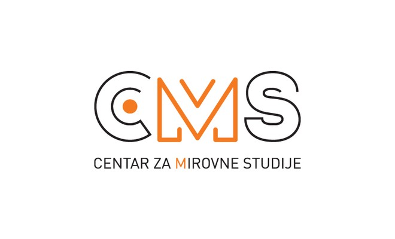

### AYS Special — **Zweiter Bericht über willkürliche und rechtswidrige Praktiken des kroatischen Innenministeriums \(MOI\) und des nationalen Sicherheits\- und Nachrichtendiensts \(SOA\) \***

**Dieser Artikel wurde ursprünglich am 26\. Juli 2017 veröffentlicht\.**

**Dies ist die deutsche Arbeitsübersetzung des kroatischen Originalberichtes „ [Drugi izvještaj o arbitrarnim i nezakonitim praksama Ministarstva unutarnjih poslova \(MUP\-a\) i Sigurnosno\-obavještajne agencije \(SOA\-e\)](ays-special-drugi-izvje%C5%A1taj-o-arbitrarnim-i-nezakonitim-praksama-ministarstva-unutarnjih-poslova-c77a3e9e3c29) “\.** 
**This article is also available in [English](ays-special-second-report-on-arbitrary-and-unlawful-practices-by-the-croatian-ministry-of-6bd82c8a0baf) \.**

**Hintergrund**

Ende 2017 haben die beiden zivilgesellschaftlichen Organisationen „Are You Syrious?“ \(AYS\) und das „Center for Peace Studies“ \(CMS\) ihren **Bericht über willkürliche und rechtswidrige Praktiken des kroatischen Innenministeriums \(MOI\) und des nationalen Sicherheits\- und Nachrichtendienstes \(SOA\)¹** an Asylbewerber und mit dem Thema betraute Institutionen sowie Medien verschickt\.

Beide Organisationen haben über den **schlagartigen Anstieg** der Zahlen von **abgelehnten** Anträgen auf internationalen Schutz von Antragstellern aus **Syrien und dem Irak** berichtet\. Gleiches war bei den Ablehnungen von Anträgen den fremdenrechtlichen Status in Kroatien betreffend \(Staatsbürgerschaft, temporärer oder dauerhafter Aufenthaltsstatus\) festzustellen\. Was allen oben genannten Ablehnungen gemein ist, ist die Berufung auf Artikel 41 des Sicherheitsüberprüfungsgesetzes² durch das MOI, das heißt **Ablehnung des Antrags wegen sogenannter „\(Sicherheits\- \) Vorbehalte“** basierend auf der Stellungnahme des SOA\.

Gemäß Artikel 42 des Sicherheitsüberprüfungsgesetzes³ und Artikel 5 des Fremdengesetzes⁴, führt der SOA Sicherheitsüberprüfungen bei Personen, denen die kroatische Staatsbürgerschaft zuerkannt werden soll, und Ausländern in der Republik Kroatiens, deren

Aufenthalt wichtig für die Sicherheit des Staates ist, durch\. Beispielsweise führt der SOA Überprüfungen durch, die das Ziel haben, potenzielle Bedrohungen für die Staatssicherheit zu erkennen\. Im Einklang mit Artikel 41 des Sicherheitsüberprüfungsgesetzes, teilt der SOA bei Ausländern, die in Kroatien wohnen oder wohnen sollen, und für Personen, denen die kroatische Staatsbürgerschaft zuerkannt werden soll, „dem Antragsteller nur die Einschätzung über das Vorhanden\- oder Nichtvorhandensein einer Sicherheitsbedrohung mit“\. Das MOI trifft seine Entscheidungen betreffend des Status eines Ausländers basierend auf der Stellungnahme der SOA, die berücksichtigt werden kann, aber nicht muss\.

In der Praxis reicht das MOI beim Erhalt eines Antrags auf internationalen Schutz oder Statusbestimmung nahezu regelmäßig eine Anfrage bei der SOA ein\. Die SOA führt dann die sogenannte „Sicherheitsüberprüfung“ durch\. In den meisten Fällen, die in diesem Bericht behandelt werden, hat die SOA, nachdem die angebliche Sicherheitsüberprüfung durchgeführt worden ist, eine Stellungnahme abgegeben, die nur das Folgende beinhaltet:

> _„Basierend auf der mit einem dem Sicherheitsvermerk „GEHEIM“ versehenen Verschlusssache, stellt \[die SOA\] fest, dass bezüglich des Antrags Hindernisse betreffend einer positiven Bescheidung des Antrags bestehen \[…\] \.“_ 

**Die SOA erläutert dem MOI, den Antragstellern und ihren Anwälten gegenüber die Begründung für die „Sicherheitsbedenken“ nicht näher\.** Basierend auf der Stellungnahme der SOA weist das MOI die Anträge der Antragsteller ab und weist sie an, innerhalb von 30 Tagen eine Administrativbeschwerde beim kroatischen Verwaltungsgericht einzureichen\. **Allerdings können die Anwälte der Kläger \(der Asylbewerber\) ihre Mandanten wegen des unzureichenden Zugangs zu den entsprechenden SOA\-Akten nicht effizient vertreten\. Das führt** folgerichtig zu einer Behinderung der aktiven Teilnahme am Verfahren und zu einer **Verletzung des Rechts auf einen fairen Prozess\.**

[Im ersten Bericht](ays-special-negative-decisions-based-on-unexplained-security-grounds-to-dublin-deportees-332e4adf2518) führten AYS und CPS auch aus, dass die SOA nicht der Entscheidung des Obersten Verwaltungsgerichts der Republik Kroatien folgt\. Das Gericht hat die Entscheidungen des MOI, basierend auf der geheim gehaltenen Stellungnahme der SOA in einem ähnlichen Fall, für unrechtmäßig erklärt⁵\. Dies betrifft die angeblich geheimen Informationen mit dem niedrigsten Geheimhaltungsgrad „RESTRICTED“ \(deutsche Geheimhaltungsstufe VS\-Nur für den Dienstgebrauch\) \.

Diese Praxis führt zu einer **Reihe von Irregularitäten und Willkürlichkeiten** , aus denen sich Verletzungen der Menschenrechte von Flüchtenden und Ausländern in der Republik Kroatien ergeben\.

In diesem Folgebericht berichten wir über die Entwicklungen der Situation, die AYS und CPS seit Anfang April 2017 genau beobachten, bis zum 26\. Juli 2017\.
### **Die Situation Ende Juli 2017**
#### **1\. Keine Antwort des Staates und der öffentlichen Verwaltung innerhalb der gesetzlichen Frist von 30 Tagen⁶**

Ende April 2017 haben AYS und CPS den Bericht mit der Aufforderung zu unverzüglicher Reaktion an alle einschlägigen Institutionen und Gremien geschickt\. Namentlich sind das: der Präsident der Republik Kroatien, die Staatspräsidentin der Republik Kroatien, der Sprecher des kroatischen Parlaments, das parlamentarische Komitee für innere Angelegenheiten und nationale Sicherheit, das parlamentarischen Komitee für Menschen\- und nationale Minderheitenrechte, der Sicherheits\- und Nachrichtendienst, das Komitee für die Bürgerüberwachung der Sicherheits\- und Nachrichtendienste, das Büro des Staatsanwalts\.

Keines der Gremien gab bislang eine Antwort oder eine Erklärung für die Verzögerung\. Lediglich das parlamentarische Komitee für innere Angelegenheiten und nationale Sicherheit hat am 15\. Juli 2017 \(auf unsere Eilnotiz\) eine Antwort gesendet, in der das Komitee uns informiert, dass:

> „\(…\) das Komitee in der Herbstsitzung ein Treffen in der SOA abhalten wird, in dem die mit dem Thema vertrauten Personen des Dienstes Antworten auf alle Fragen bezüglich der inneren Politik und nationalen Sicherheit, ebenso zu mit diesem Thema zusammenhängenden Fragen geben werden \(…\)“\. 

Des Weiteren hat sich die Ombudsperson Kroatiens mit Vertretern des CPS getroffen und eine Untersuchung im Rahmen ihrer Befugnisse angekündigt, allerdings verfügen wir über keine weiteren Informationen über diese Untersuchung\.

Darüber hinaus wurde die Vereinbarung über ein Treffen mit Vertretern der MOI\-Abteilung für Ausländer und Asyl nicht erfüllt, da die MOI\-Vertreter nicht mit einem Terminvorschlag auf uns zurückkamen\.

Einige der internationalen Organisationen, wie der Jesuiten\-Flüchtlingsdienst \(JRS\), haben auf die beschriebene Situation reagiert⁷, jedoch warten wir noch immer auf eine Reaktion der UN\-Organisationen \(UNHCR, UNICEF und IOM\) in Kroatien\.

Folglich ist erkennbar, dass die Institutionen nicht auf die Ergebnisse des vorgestellten Berichts reagiert haben und dass Verletzungen der Menschenrechte von Flüchtenden in Kroatien nur wenig Aufmerksamkeit erregen\.
#### **2\. Mehr als 100\-prozentiger Anstieg der Zahl dokumentierter negativer Entscheidungen aus Basis geheim gehaltener SOA\-Stellungnahmen innerhalb einer signifikant kürzeren Zeitspanne \(30\. April — 11\. Juli 2017\)**

**Obwohl die Informationen des MOI immer auf die _Fälle_ verweisen, das heißt auf die Zahl der Beschlüsse, ist die Zahl der tatsächlich betroffenen Personen, d\.h\. der Asylbewerber, deutlich höher\. Das liegt daran, dass minderjährige Kinder im Asylantrag eines Elternteils mitgeführt werden \(meistens in jenem der Mutter\) \. Aus diesem Grund haben wir entschieden, beide Zahlen anzugeben: die Zahl der Fälle und die Zahl der betroffenen Personen, d\.h\. Asylbewerber, deren Leben von den Entscheidungen betroffen ist\. Dies ist besonders wichtig, da dies auch die Rechte der verwundbarsten Gruppe unter den Asylbewerbern betrifft: Kinder und Minderjährige\.**

**Tabelle 1:** Erfasste Informationen über die Zahl der negativen Entscheidungen durch das MOI \(entsprechend der Zahl getroffener und zugestellter MOI\-Entscheidungen\), **basierend auf geheim gehaltenen SOAStellungnahmen \(Art\. 41 SVA\)**

**Tabelle 2:** Erfasste Informationen über die Zahl der **Personen: Asylbewerber mit negativer Entscheidung durch das MOI, basierend auf geheim gehaltenen SOA\-Stellungnahmen \(Art\. 41 SVA\), inklusive Kinder der Asylbewerber, die in den Anträgen/Entscheidungen eines Elternteils aufgeführt sind\.**

Zum Zeitpunkt des ersten Berichts hatten AYS und CPS 14 Fälle/Entscheidungen \(19 Personen, da von den Entscheidungen fünf Kinder betroffen waren\) zusammengetragen, bei denen rechtmäßig internationaler Schutz gewährt werden sollte\. Dennoch wurden sie basierend auf der SOA\-Stellungnahme abgelehnt\. Wir haben danach noch fünf weitere Entscheidungen erfasst, \(sechs Personen insgesamt, da eine Entscheidung auch ein Kind betraf\), die den Asylbewerbern bis Ende April 2017 zugestellt wurden\.

Von Ende April bis Ende Juli 2017 hat sich die Zahl solcher Fälle auf 44 erhöht \(mindestens 25 Entscheidungen wurden zugestellt\) \. Das bedeutet einen **Anstieg von mehr als 100% \(132%\) \.** Wenn man die **Personen** \(und nicht die Fälle\) zählt, ist der Anstieg noch größer — im ersten Zeitraum haben wir 24 Personen, inklusive fünf Kinder, gezählt\. Im nächsten Zeitraum \(etwas mehr als zwei Monate\) haben wir bereits 33 Personen, inklusive neun Kinder mit diesem „Typ“ negativer Entscheidung, dokumentiert\. Das bedeutet einen Anstieg von **138%\.**

Wenn man berücksichtigt, dass unsere beiden Organisationen innerhalb dieses \(nicht einmal\) dreimonatigen Zeitraums nur **acht positive Entscheidungen¹⁰** dokumentiert haben, ist die Zahl der auf geheimen SOA\-Stellungnahme basierenden negativen Entscheidungen **sieben Mal höher** als die Zahl der positiven Entscheidungen\.

Die neuen Fälle beinhalten Familien mit minderjährigen und **sehr jungen \(teilweise zwei Jahre alt\) Kindern aus dem Irak \(irakische Sunniten: 25 Fälle oder 42%\) und Syrien \(21 Fälle oder 37%\) \.**

Die letzte auf einer geheimen SOA\-Stellungnahme basierende negative Entscheidung datiert vom **26\. Juni 2017** \.

In der Zwischenzeit ist es AYS und CPS gelungen, negative Entscheidungen älteren Datums¹¹ zu erfassen, die uns vorher unzugänglich waren\. Dadurch haben wir erfahren, dass derselbe Typ negativer Entscheidungen auch Staatsbürgern aus Palästina und Iran gegeben wurde\.
#### **3\. Eindeutige Statistiken des MOI zu gewährtem und abgelehntem internationalen Schutz im Zeitraum April bis Juli 2017 sind nicht vorhanden\.**

Die Statistiken auf der offiziellen Homepage des MOI sind **nur bis Ende März 2017 verfügbar** [\(https://mup\.hr/ministarstvo/dokumenti/statistika\)](https://mup.hr/ministarstvo/dokumenti/statistika) — und das nur für **positive Entscheidungen** zu subsidiärem Schutz oder Asyl \(insgesamt 23 während der ersten drei Monate dieses Jahres\) und nicht für die Zahl negativer Entscheidungen\. Auch die jüngsten Zahlen des UNHCR sind nur für 2016 verfügbar \( [www\.unhcr\.hr\)](http://www.unhcr.hr/) \. Am 25\. Juli haben wir vom MOI die folgende Information erhalten:

„Im Jahr 2017 wurden 33 Administrativbeschwerden gegen negative Entscheidungen, von Anträgen auf internationalen Schutz auf Basis von Artikel 2 eingebracht\. In 24 Fällen ist die Administrativbeschwerde noch laufend, in fünf Fällen wurden die Einsprüche abgelehnt und in vier Fällen wurde die MOI\-Entscheidung aufgehoben\.“

Wir müssen an dieser Stelle betonen, dass wir in unserer Auskunftsanfrage auf dem Zeitraum von 1\. April 2017 bis 11\. Juli 2017 bestanden haben, weil die meisten auf geheim gehaltener SOA\-Stellungnahme basierenden negativen Entscheidungen in diesem Zeitraum beobachtet wurden\.

Auch stellen wir fest, dass sich die genannten **fünf Fälle** , in denen der Einspruch vom Verwaltungsgericht in Zagreb abgelehnt wurde, auf Kläger beziehen, die **vor der Gerichtsanhörung das Land eigenständig verlassen haben** \. Darüber hinaus beziehen sich **33 Fälle** lediglich auf die Asylbewerber, die **einen Gerichtsprozess angestrengt haben \(viele haben das Land verlassen, bevor der Prozess begonnen hat\) — in AYS/CPS\-Statistiken sind bis 11\. Juli 2017 61 solcher Fälle dokumentiert\.**

Wir haben am 26\. Juli ein weiteres Auskunftsersuchen übermittelt, in dem wir nach Zahlen für sowohl positive als auch negative Entscheidungen innerhalb des Zeitraums zwischen April bis 11\. Juli 2017 gefragt haben, um ein Verhältnis zwischen positiven und negativen Entscheidungen zu ermitteln\.
#### **4\. Im Falle der Aufhebung der negativen Entscheidung durch das MOI/die SOA, verweist das Verwaltungsgericht in Zagreb den Fall zurück an das MOI/die SOA**

Laut der offiziellen Antwort des MOI am 25\. Juli 2017 haben **neun gerichtlichen Verhandlungen** in Fällen von auf geheim gehaltenen SOA\-Stellungnahmen basierenden negativen Entscheidungen stattgefunden\. In fünf Fällen sind die Kläger bereits in andere EULänder geflohen und das Verwaltungsgericht in Zagreb hat ihren Einspruch deswegen abgelehnt\.

**In zwei Fällen \(Gerichtsverhandlungen\) ist der offizielle Übersetzer nicht zur Anhörung erschienen, weshalb diese verschoben wurde\.**

In vier Fällen sind die Kläger zur Gerichtsanhörung erschienen und in jedem dieser Fälle hat das Verwaltungsgericht die MOI\-Entscheidung aufgehoben\.

Das Verwaltungsgericht hat ein gesetzliches Mandat, die Fakten unabhängig zu beurteilen, die Beweise unabhängig vorzutragen und basierend auf der Sache Asyl zu gewähren\.¹² Trotzdem **gewährte das Verwaltungsgericht in diesen vier Fällen den Klägern keinen internationalen Schutz** , obwohl die Bedingungen dafür erfüllt gewesen wären\. Stattdessen hat es **den Fall an das MOI und den SOA für eine weitere „Runde“ der Beurteilung zurückverwiesen\.**

Dieses Verhalten deutet klar darauf hin, dass weder das Asylverfahren noch die richterliche Praxis eine rechtmäßige und transparente Behandlung von Asylbewerbern unter Berücksichtigung ihrer Menschen\- und Flüchtlingsrechte sicherstellen\.

Des Weiteren verkörpert diese Praxis eine unnötige Verzögerung im Verfahren und steht im Widerspruch zum Effizienzgebot des Gerichts\.

Zum Zeitpunkt der Endredaktion dieses Berichtes gelangten AYS und CPS in den Besitz des jüngsten Urteils des Verwaltungsgerichtshofs in Zagreb13 \(USL\-3410/16–15 vom 21\. Juli 2017\) zu einem der “41er\-Fälle”, in denen das Gericht ebenfalls die Entscheidung des MOI, die auf der geheim gehaltenen SOA\-Stellungnahme basierte, wieder außer Kraft gesetzt hat und in seinem Urteil auf eine Reihe von Versäumnissen des MOI anlässlich des Erstverfahrens hinweist, wie etwa die unzureichende Prüfung und Fehlinterpretationen vorhandener Beweise\.

Der Bescheid zeigt drei wichtige Elemente:

A\) **Das Gericht nahm Einsicht in den SAO\-Akt und war nicht in der Lage, auf dessen Basis eine Begründung für einen Ausschluss gemäß Artikel 3014 und 3115 des Gesetzes zum internationalen und vorübergehenden Schutz auszusprechen\.**

“Im Zusammenhang mit der Berufung, hat das Gericht den Bericht des SAO begutachtet, in dem sich allerdings keine klaren Gründe finden lasse, welche den Schluss zuließen, **dass es ein Hindernis gibt** , welches einer positiven Bescheidung des Antrags entgegenstünde und dass der Beschwerdeführer die Bedingungen unter Artikel 30 oder 31 des Gesetzes \(über internationalen und vorübergehenden Schutz AITP, Amtsblatt 70/15\) erfüllt\.

Nachdem das anzuwendende Gesetz, dem der Beschwerdeführer unter Artikel 30 und 31 unterliegt, die Gründe eines spezifischen Ausschlusses von internationalem Schutz, Asyl oder subsidiärem Schutz **explizit anführt** , sollte das Gericht in der Lage sein, **auf Basis der vorgelegten Akte mit Sicherheit festzustellen, welcher gesetzliche Grund für diesen Ausschluss vorliegt, was in dem vorliegenden Fall nicht möglich ist\.”** 16

B\) **Das Gericht stellt fest, dass das Vorenthalten der Gründe, warum dem Antragsteller der internationale Schutz gemäß Artikel 30 und 31 des AITP\-Gesetzes verwehrt wurde, einen Rechtsbruch darstellt\.**

“Allerdings **wurde dem Antragsteller keine Möglichkeit gegeben** , **Informationen über die bestehenden Gründe zu erhalten** , **welche nach Artikel 30 und 31** des Gesetzes vorliegen und die **gesetzlichen** **Gründe, aus denen der beantragte Schutz nicht gewährt wurde** , was nach Ansicht des Gerichts einen **Bruch des Artikels 30 \(1\) des**

**Verwaltungsverfahrensgesetzes** \(Amtsblatt 47/09\) darstellt, in welchem festgelegt ist, dass im Laufe des Verfahrens den Parteien die Möglichkeit gegeben werden muss, sich zu allen Umständen, Fakten und rechtlich relevanten Fakten äußern zu können, welche im Zusammenhang mit der Lösung des Falles von Bedeutung sind\. Gemäß § 2 desselben Artikels dieses Gesetzes können Verfahren durchgeführt werden, **ohne dem Antragssteller die Möglichkeit zur umfassenden Stellungnahme zu geben** , **wenn dem Antrag stattgegeben** wird oder wenn die **Entscheidung im Verfahren keinerlei negative Auswirkung** auf die rechtlichen Interessen der Partei hat, oder **wenn das Gesetz dies vorsieht, was im gegenständlichen Fall nicht zutrifft** \.”¹³

C\) **Das Gericht kommt zu dem Schluss, dass die Entscheidung des MOI ohne klare Angabe von Ausschlussgründen und ohne dem Antragsteller die Möglichkeit einzuräumen, Gründe seines Ausschlusses zu erfahren, einen Rechtsbruch zum Schaden des Beschwerdeführers darstellt\.**

“Somit, nachdem die Erläuterung der strittigen Entscheidung keinerlei klare Gründe enthält, welche zu dem Schluss führen könnten, dass der Beschwerdeführer von den Bedingungen der Artikel 30 und 31 des Gesetzes ausgeschlossen werde sollte, nachdem die Ausschlussgründe, die für diese Fälle vorgesehen sind, nicht spezifiziert werden, entscheidet das Gericht, dass die strittige Entscheidung und deren Begründung einen Gesetzesbruch zum Schaden des Beschwerdeführers darstellt\.”¹⁴

**Es muss allerdings nochmals festgestellt werden, dass trotz dieser Entscheidung des Verwaltungsgerichts in Zagreb, trotz der eigenen Erklärungen und trotz des bestehenden eigenen Mandates, dieser dem betroffenen Asylwerber keinen Schutz zugesprochen hat, sondern den Fall wieder an MOI und SOA zurückverwiesen hat\.**
#### **5\.** **Keinerlei Information über jegliche Ermittlungen zu den als „Sicherheitsrisiko“ eingestuften Menschen**

Bis jetzt haben AYS und CPS noch keine Erkenntnisse über jegliche Ermittlungen zu den Fällen, in denen das MOI basierend auf der SOA\-Meinung negative Entscheidungen getroffen hat\. Im Gegenteil sind **mehr als die Hälfte der Menschen auf der Liste in westeuropäische Länder weitergezogen** \.

Manche der Menschen, die eine ähnliche Entscheidung als Antwort auf ihren Einbürgerungsantrag \(nicht internationalen Schutz\) erhalten haben, üben trotz ihrer Einstufung als „Sicherheitsrisiko“ weiterhin ihre Teilzeitbeschäftigung im MOI aus\.
#### **6\.** **Asylbewerber, oft mit sehr jungen Kindern, ziehen aus Angst vor negativen Entscheidungen in westeuropäische Länder weiter**

Obwohl die Zahl von Asylbewerbern in Kroatien in den vergangenen drei Monaten \(April bis Juli 2017\) — **trotz Veränderungen in der Zusammensetzung** — eher gleichbleibend war — zwischen 700 und 800 Menschen,–, ziehen Asylbewerber, die in Kroatien internationalen Schutz beantragt haben, aus Angst vor negativen Entscheidungen, in denen sie als

„Sicherheitsrisiko“ eingestuft werden, oft weiter in andere Länder der Europäischen Union\. Die Zahl der Asylbewerber ist gleichbleibend, weil aus Serbien, Montenegro sowie BosnienHerzegowina ebenso wie durch **Dublin\-Rückführungen** neue Menschen ankommen\.

Die zivilgesellschaftlichen Organisationen stellen fest, dass dann wenn an eine Person oder eine Familie ein **negativer Asylbescheid zugestellt wird** , der aus objektiven Gründen als ungerecht erscheint, in der Folge **viele andere Personen und Familien das Land verlassen aus Angst, die Nächsten zu sein** \. Es ist vollkommen verständlich, dass Asylbewerber wegen der oben beschriebenen willkürlichen und rechtswidrigen Praktiken nicht an die Gerechtigkeit des Systems glauben\.

Nach Schätzungen von AYS zu Porin, der größten Aufnahmeeinrichtung in Kroatien mit rund 500 Asylbewerbern, **haben mindestens 70 Menschen, inklusive mindestens 20 Minderjährige und junge Kinder seit 6\. Juli 2017 \(dem Zeitraum der vergangenen 20 Tage\)** **die Einrichtung verlassen** — 50 von ihnen sind in einer einzigen Nacht verschwunden\. Innerhalb desselben Zeitraums wurden zehn negative Entscheidungen an irakische und syrische Asylbewerber zugestellt\. Laut Informationen aus zweiter Hand haben sie ihr Verfahren abgebrochen und sind in Länder Westeuropas weitergeflüchtet\.
#### **7\.** **Suizidversuche und „freiwillige“ Rückkehren in vom Krieg zerrüttete und unsichere Länder aus Angst vor negativen Entscheidungen und langen Wartezeiten**

Obwohl die langen Wartezeiten in Kroatien nichts Neues für Asylbewerber sind \(so haben zwei Familien aus Afghanistan ein Jahr und drei Monate auf ihre Entscheidung gewartet, die am Ende negativ ausfiel\), **verbreiten die langen Wartezeiten, begleitet von den jüngsten auf geheimen SOA\-Stellungnahmen basierenden negativen Entscheidungen, Angst, Unsicherheit und extreme Frustration in den Aufnahmezentren in Kroatien:**

\- Am 14\. Juli 2017 versuchte ein Asylbewerber im Aufnahmezentrum in Zagreb, sich wegen der langen Wartezeit und der jüngsten Welle von auf geheim gehaltenen SOAStellungnahmen basierenden negativen Entscheidungen umzubringen;

\- Aus gleichem Grund entschied eine irakische Familie mit vier Kindern, eines davon gerade einmal ein Jahr alt, zurück in den Irak zu gehen, während eine syrische Familie mit ihren vier Kindern \(inklusive eines jungen Babys\) entschied, auf eigene Kosten zurück in die Türkei zu gehen;

\- In der Nacht zum 26\. Juli 2017 versucht ein Asylbewerber in Zagreb, Selbstmord zu begehen, indem er sich aus einem Fenster des Aufnahmezentrums Porin stürzte\.
#### **8\.** **Vorabentscheidungsersuchen an den Europäischen Gerichtshof \(EuGH\)**

Ein Anwalt, der die Kläger in Fällen auf geheimen SOA\-Stellungnahmen basierenden negativen Entscheidungen vertritt, Herr Zoran Bauer, bereitet derzeit ein **Vorabentscheidungsersuchen an den Europäischen Gerichtshof \(EuGH\)** vor\. In der Anfrage wird der Gerichtshof gebeten, eine klare Interpretation des europäischen Rechts bezüglich der Behandlung der oben genannten Fälle in Bezug auf das Recht auf aktive Teilnahme am Verfahren, das Recht auf „Waffengleichheit“ und wie dem Recht auf einen fairen Prozess zu geben\.
### **Schlussfolgerung und Anfrage**

Basierend auf den dargelegten Fakten sind AYS und CPS der Ansicht, dass es eine sichtbare und geplante **Entmutigungspolitik gegenüber Asylbewerbern** gibt, die vom Staat umgesetzt und in rechtswidrigen Praktiken des MOI und der SOA, wie in unseren Berichten beschrieben, ihren Ausdruck findet\. Der Begriff **„Entmutigung“** ist lediglich ein Euphemismus für Gewalt an der Grenze, um Menschen den Zutritt zum Staatsgebiet und zum System internationalen Schutzes zu verweigern\. Dazu zählen auch unbegründete Ablehnungen von Anträgen auf internationalen Schutz, die Abwesenheit oder rein formelle Existenz von Integrationspolitik und alle Praktiken, die es den Menschen erschweren, ihre Rechte zu kennen und ein Leben in Sicherheit und Würde zu leben\.

Diese rechtswidrigen und willkürlichen Praktiken stellen eine klare Verletzung der Menschen\- und Flüchtlingsrechte dar und zeigen die Notwendigkeit sofortiger Reaktionen der nationalen und internationalen Gremien\. Die gute Nachricht ist, dass das Verwaltungsgericht die rechtswidrigen Praktiken in zahlreichen Fällen erkannt und diese aufgehoben hat\. Dennoch bleibt es besorgniserregend, dass das Verwaltungsgericht diese Fälle, trotz seines Mandats, internationalen Schutz zu gewähren und ungeachtet der Tatsache, dass alle Voraussetzungen für internationalen Schutz gegeben waren, an eben jene Institutionen zurückverwiesen hat, die diese rechtswidrigen Praktiken ausüben\.

Des Weiteren **sollte diese Situation im Lichte der Entscheidung des Europäischen Gerichtshofs vom 26\. Juli 2017 in den Fällen C490–16 und C\-646/16 gesehen werden: In dieser entschieden die Richter über die Verantwortung Kroatiens, Anträge auf internationalen Schutz von Personen zu überprüfen, die im Rahmen der Massenbewegung während der Flüchtlingskrise 2015–2016 seine Grenze e überquert haben\. Ebenso sollte die Situation unter dem Aspekt organisierter und den Berichten nach gewaltsamer**

**Zurückweisungen von Flüchtenden an der kroatisch\-serbischen Grenze und anderen Teilen Kroatiens durch die kroatische Polizei betrachtet werden\.¹⁵**

**Wir fordern die nationalen und internationalen Institutionen und Organisationen auf, unmittelbar auf den bereits publizierten AYS/CPS\-Bericht und diesen Nachfolgebericht zu reagieren\.**

[\[1\]](#_ftnref1) [http://cms\.hr/system/article\_document/doc/403/CPS\_and\_AYS\_ \- \_Report\_on\_arbitrary\_and\_unlawful\_practices\_by\_the\_Ministry\_of\_Interior\_and\_the\_Security\_and\_Intelligence\_Agency\_ \_related\_to\_ \_no n\_approval\_of\_international\_protection\_or\_status\_of\_foreigners\_in\_Croatia\.pdf](http://cms.hr/system/article_document/doc/403/CPS_and_AYS_-_Report_on_arbitrary_and_unlawful_practices_by_the_Ministry_of_Interior_and_the_Security_and_Intelligence_Agency__related_to__non_approval_of_international_protection_or_status_of_foreigners_in_Croatia.pdf)

[\[2\]](#_ftnref2) [http://www\.uvns\.hr/UserDocsImages/en/dokumenti/info\-security/Security\-Vetting\-Act\-ispravak\.pdf](http://www.uvns.hr/UserDocsImages/en/dokumenti/info-security/Security-Vetting-Act-ispravak.pdf) \(Seite 10\)

[\[3\]](#_ftnref3) [http://www\.uvns\.hr/UserDocsImages/en/dokumenti/info\-security/Security\-Vetting\-Act\-ispravak\.pdf](http://www.uvns.hr/UserDocsImages/en/dokumenti/info-security/Security-Vetting-Act-ispravak.pdf) \(Seite 11\)

[\[4\]](#_ftnref4) [https://www\.mup\.hr/UserDocsImages/Dokumenti/stranci/2013/Zakon\_o\_strancima\_2011\. \_engl\.pdf](https://www.mup.hr/UserDocsImages/Dokumenti/stranci/2013/Zakon_o_strancima_2011._engl.pdf) \(Seite 4\)

[\[5\]](#_ftnref5) Entscheidung des Oberen Verwaltungsgerichtshofs der Republik Kroatien \(No\. Us\-10359/2011–7, vom 12\. Juni 2014\) in der das Gericht die negative Entscheidung des MOI über den Antrag auf Staatsbürgerschaft eines Ausländers auf Basis einer geheim gehaltenen SOAStellungnahme aufgehoben hat\. In diesem Fall hatte die SOA angeführt, dass die Person die Staatliche Ordnung nicht respektiere und berief sich auf eine als „restricted“ klassifizierte Information\.

[\[6\]](#_ftnref6) Wie im nationalen Informationsfreiheitsgesetz geregelt \(Amtsblatt 25/13 und 85/15\)

[\[7\]](#_ftnref7) [http://www\.jrs\.hr/2017/04/26/reagiranje\-isusovacke\-sluzbe\-za\-izbjeglice\-povodom\-brojnih\-prituzbi\-izbjeglica\-na\-proceduru\-odlucivanja\-o\-zahjevima\-za\-medunarodnom\-zastitom\-u\-rh/](http://www.jrs.hr/2017/04/26/reagiranje-isusovacke-sluzbe-za-izbjeglice-povodom-brojnih-prituzbi-izbjeglica-na-proceduru-odlucivanja-o-zahjevima-za-medunarodnom-zastitom-u-rh/)

[\[8\]](#_ftnref8) SVA: National Security Vetting Act \(Nationales Sicherheitsüberprüfungsgesetz\)

[\[9\]](#_ftnref9) Die Fälle waren AYS bis Ende April 2017 nicht zugänglich

[\[10\]](#_ftnref10) Offizielle und vollständige Statistiken des MOI während des Zeitraums sind nicht verfügbar\. Mehr unter Punkt 3 dieses Berichts\.

[\[11\]](#_ftnref11) Diese negativen Entscheidungen datieren von September 2016

[\[12\]](#_ftnref12) Verwaltungsverfahrensgesetz \(Amtsblatt 20/10, 143/12, 152/14, 94/16, 29/17, Artikel 3\., 33\., 58\. \)

\[13\] Die Verhandlung fand am 10\. Juli 2017 statt und ist daher in der Zählung der 4 Fälle, in denen die MOI\-Entscheidung aufgehoben wurde, nicht enthalten, die im Schreiben an das MOI erwähnt sind\. Das AYS befindet sich im Besitz des gesamten Textes dieser Entscheidung und hat diesen mit Zustimmung des Beschwerdeführers erhalten\.

\[14\] Der erwähnte Gesetzes Artikel des Gesetzes über internationalen und vorübergehenden Schutz AITP enthält, wie eine Reihe von Anwälten und Organisationen schon angemerkt haben, keine Erwähnung der Staatsgefährdung als Ausschließungsgrund: “Ausschluss vom Asyl — Artikel 30
- Asyl soll einem Antragsteller, der die Bedingungen nach Artikel 20 des Gesetzes erfüllt, nicht gewährt werden, wenn:

1. er/sie unter dem Schutz einer Organisation oder Agentur der Vereinten Nationen untersteht oder von diesen Unterstützung erhält, mit Ausnahme der UNHCR;
2. er/sie bereits ein Aufenthaltsrecht in einem Staat besitzt und auf Basis dieses Rechtes dieselben Rechte und Pflichten hat wie die Staatsbürger dieses Staates;
3. es schwerwiegende Gründe gibt anzunehmen, dass er oder sie eine der folgenden Tatbestände begeht oder daran teilnimmt:

- Ein Vergehen gegen den Frieden, Kriegsverbrechen oder Verbrechen gegen die Menschlichkeit gemäß den betreffenden internationalen Instrumenten;
- Ein schweres nichtpolitisches Verbrechen außerhalb der Republik Kroatien vor der Ankunft in der Republik Kroatien, inclusive besonders grausame Taten, auch wenn diese mit angeblich politischen Zielen begangen wurden;
- Taten gegen den Zweck und die Prinzipien der Vereinten Nationen gemäß deren Präambel und den Artikeln 1 und 2 der Charta der Vereinten Nationen\.

2\. Sollte der Schutz bzw\. die Unterstützung wie in Par 1 \(1\) erwähnt ausgelaufen sein aus einem Grund, der außerhalb des Einflussbereich des Antragstellers liegt und diese Angelegenheit nicht endgültig gemäß den betreffenden Resolutionen der Vollversammlung der Vereinten Nationen bereinigt sein, so soll dem Antragsteller Asyl gewährt werden\.”

\[15\] Dieser Artikel des AITP enthält, im Gegensatz zu dem vorhergehenden, eine Erwähnung des nationalen Sicherheitsrisikos bzw\. Gefährdung der öffentlichen Ordnung als mögliches Hindernis, das der Gewährung internationalen Schutzes entgegenstehen könnte: “Ausschluss von vorübergehendem Schutz — Artikel 31

\(1\) Subsidiärer Schutz soll einem Antragsteller, die die Bedingungen unter Artikel 21 dieses Gesetzes erfüllt, nicht gewährt werden, wenn:
1. es schwerwiegende Gründe gibt anzunehmen, dass er/sie eines der folgenden Vergehen/Verbrechen begangen hat, dazu angestiftet hat oder daran aktiv beteiligt war:

- Ein Vergehen gegen den Frieden, Kriegsverbrechen oder Verbrechen gegen die Menschlichkeit gemäß den betreffenden internationalen Instrumenten;
- ein schweres Verbrechen;
- Taten gegen den Zweck und die Prinzipien der Vereinten Nationen gemäß deren Präambel und den Artikeln 1 und 2 der Charta der Vereinten Nationen; oder

**2\. falls er/sie ein nationales Sicherheitsrisiko darstellt oder die öffentliche Ordnung der Republik Kroatien gefährdet\.**

\(2\) Als schweres Verbrechen, wie es unter par 1 \(1,2\) angeführt wird, gilt ein Verbrechen, welches gemäß den Gesetzen der Republik Kroatien mit einer Gefängnisstrafe von fünf Jahren oder mehr zu bestrafen ist\.”

\[16\] Originaltext der Entscheidung\.

[\[17\]](#_ftnref13) Ibid\.

[\[18\]](#_ftnref14) Ibid\.

[\[19\]](#_ftnref15) Weitere Informationen dazu haben AYS und CPS in ihrem ersten Bericht im Januar 2017 veröffentlicht: [https://medium\.com/@AreYouSyrious/report\-on\-illegal\-and\-forced\-push\-backs\-of\-refugees\-from\-the\-republic\-of\-croatia\-3f8c50ca10c1,](report-on-illegal-and-forced-push-backs-of-refugees-from-the-republic-of-croatia-3f8c50ca10c1) und UNHCR Serbien \(Juli 2017\) [: http://reliefweb\.int/report/serbia/unhcr\-serbia\-update\-17\-23\-july\-2017](http://reliefweb.int/report/serbia/unhcr-serbia-update-17-23-july-2017)

> **We strive to echo correct news from the ground through collaboration and fairness\.** 

> **Every effort has been made to credit organizations and individuals with regard to the supply of information, video, and photo material \(in cases where the source wanted to be accredited\) \. Please notify us regarding corrections\.** 

> **If there’s anything you want to share or comment, contact us through Facebook or write to: areyousyrious@gmail\.com** 

_Converted [Medium Post](https://medium.com/are-you-syrious/ays-special-zweiter-bericht-%C3%BCber-willk%C3%BCrliche-und-rechtswidrige-praktiken-des-kroatischen-52c332fddc40) by [ZMediumToMarkdown](https://github.com/ZhgChgLi/ZMediumToMarkdown)._
