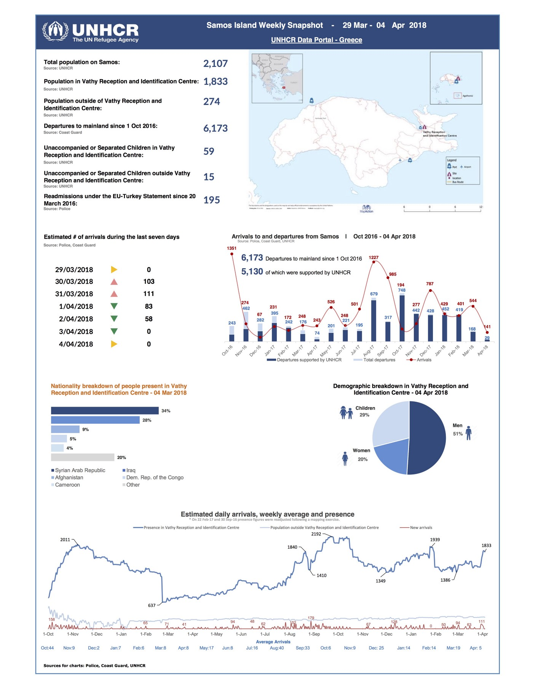
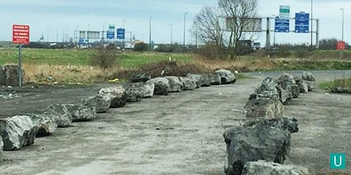

### AYS Daily Digest 05/04/18: What is Prompting the Surge of Refugees Arriving on the Aegean Islands?

_New Arrivals in Greece//Rescue Groups under attack//Updates from Lesvos and Samos//Deaths on the Evros river//Journalist released in Serbia//French authorities prevent aid to refugees//Wolf Attack in Albania//Deportations from Denmark//and more…_

](assets/d992521aed02/1*NdabwL65sCnaxrsiNQ8t9Q.jpeg)

Photo Credit: [**NoBorders**](https://www.facebook.com/nobordersnetwork/)
### Feature: People, not Numbers\.

[**Samos Volunteers**](https://www.facebook.com/samosvolunteers/?hc_ref=ARRu4_J4oXJ4irLm-b_PaHQjbQC7UNeycXFNUj-B3NPf2rzodQlbe3XmWgWWU1zK5_U&fref=nf) released a small update today ont he incredibly high numbers of refugees reaching the island in the past week:

> 538 people made the treacherous journey across the Aegean in March to Samos, more than double the number from last year\. 

> Already in the first 5 days of April we’ve seen 217 arrivals\. 

> While the mainstream media neglects to report on the escalating numbers the fact remains that as the water gets calmer and the weather gets warmer, increasingly more people will continue to risk their lives making the crossing\. 

](assets/d992521aed02/1*8NZaoNJuFHNigJ8a8unfQw.jpeg)

A Turkish Coast Guard interception, 05\.04\.18\. Photo Credit: [**Aegean Boat Report**](https://www.facebook.com/AegeanBoatReport/)
#### Transfers to Mainland 05\.04

[Lesvos](https://twitter.com/hashtag/Lesvos?src=hash) : 20 [Chios](https://twitter.com/hashtag/Chios?src=hash) : 14 [Samos](https://twitter.com/hashtag/Samos?src=hash) : 27 [Leros](https://twitter.com/hashtag/Leros?src=hash) : 2 [Kos](https://twitter.com/hashtag/Kos?src=hash) : 2 [Rhodes](https://twitter.com/hashtag/Rhodos?src=hash) : 3

Once again this week, there have been far more new arrivals to the Aegean Islands than the amount of people who are being transferred out of them\. This means even worse and overcrowded conditions on the island detention centers\. According to Greek journalist [Apostolis Fotiadis](https://twitter.com/search?q=Apostolis%20Fotiadis&src=typd) there are now more than 14,000 refugees and migrants stranded on the Aegean island camps\. There are another 3,000\+ being detained at pre removal centers or police stations\.

Some have speculated that the sharp increase in arrivals to the Aegean islands is the result of political arguments between the EU, Greece, and Turkey\. Essentially, the Turkish authorities allow large numbers of refugees to cross over to Greece as a threat to the EU\. There have been tensions between the EU and Turkey following their summit in Varna this month, when EU officials balked at demands for higher payments to Turkey\. As well, the Turkish government is angry at Greece for not yet sending back two Turkish soldiers who defected to Greece during the coup attempt\. Either of these events could have an effect on new arrivals, as the Turkish authorities have been known to use refugees as a bargaining chip in the past\.

The EU has no one else to blame for being in a position where it is caving to the demands of an authoritarian government\. This is a direct result of the EU\-Turkey deal\.
### Sea

[33 men and 3 women](http://www.europapress.es/andalucia/) were rescued from a boat approximately ten miles North of the island of Alboran\.

The Sea Watch 3 Vessel departed today for another rescue mission int he central Mediterranean sea, despite increasing restrictive measures on rescue organizations, including the detention of ships and the prosecution of rescue workers\. The [Sea\-Watch](https://sea-watch.org/en/sea-watch-mission-starts-despite-impediment-of-sea-rescue/) organization released a [statement](https://sea-watch.org/en/sea-watch-mission-starts-despite-impediment-of-sea-rescue/) today on their new mission:

> Sea\-Watch is increasingly concerned about recent developments at sea, where the new role attributed to the Libyan Coast Guard results in increasing push\-backs and distressing circumstances during operations, for both the people rescued and the NGOs’ rescuers\. 

> It remains clear that anyone found in distress at sea must be saved and brought to a place of safety \(article 98 UNCLOS\) \. The grave violations of human rights repeatedly reported against migrants in Libya blatantly show that people rescued cannot be returned and disembarked therein , in compliance with international human rights law, refugee law and maritime law\. 

> Italy has been abandoned by the other EU member states in sharing the responsibility towards migration through the Central Mediterranean and is now resorting to restrictive measures, including the the seizure of two civilian rescue vessels, which both fulfilled maritime and humanitarian obligations in the Mediterranean\. 

> 29 leading academics and lawyers accuse Italy of encouraging returns to Libya in violation of international law and had therefore called for an urgency meeting of the UN Security Council and demanded to open investigations against Italy for complicity in crimes against humanity\. 

■■■■■■■■■■■■■■ 
> **[Sea-Watch](https://twitter.com/seawatchcrew) @ Twitter Says:** 

> > As long as the EU lets people die at Europe's maritime border, we keep going: Despite all headwind, we left the port today to save people from drowning! Help us save lives: [sea-watch.org/spenden](http://sea-watch.org/spenden) #FreeOpenArms #FreeIuventa #Right2Rescue https://t.co/AnjH54RlDu 

> **Tweeted at [2018-04-05 15:52:30](https://twitter.com/seawatchcrew/status/981922534747754496).** 

■■■■■■■■■■■■■■ 

### Greece

ECRE reported today that the number of people arriving by sea has increased this year\. The number of refugees arriving on the Greek islands is not representative

■■■■■■■■■■■■■■ 
> **[ECRE](https://twitter.com/ecre) @ Twitter Says:** 

> > 🇬🇷: Sea arrivals on the Greek Aegean islands in the 1st quarter of 2018 are up by 33% from 2017. Arrivals in March 2018 were 59% higher than in March 2017. Data via @[Refugees_EU](https://twitter.com/Refugees_EU) [bit.ly/2FeVNpy](http://bit.ly/2FeVNpy) https://t.co/R9P8wdvs7W 

> **Tweeted at [2018-04-05 10:24:04](https://twitter.com/ecre/status/981839882313191429).** 

■■■■■■■■■■■■■■ 

The UNHCR released reports on Lesvos and Samos this week, revealing drastically overcrowded conditions on the islands\. One interesting thing about these reports, as revealed by [**Aegean Boat Report**](https://www.facebook.com/AegeanBoatReport/?hc_ref=ARSB2itYX0ThToH0UNUDukyDewcP7BmNRyiVMok2kZNOJsz7USBwrxfUd0hNf-aWUKo&fref=nf) **,** is that they are not made public, and only shared with a small number of actors on the island\. Why is this the case?

](assets/d992521aed02/1*zNok0xjfhQZp8ayEO_IHYA.jpeg)

Photo Credit: [**Aegean Boat Report**](https://www.facebook.com/AegeanBoatReport/?hc_ref=ARSB2itYX0ThToH0UNUDukyDewcP7BmNRyiVMok2kZNOJsz7USBwrxfUd0hNf-aWUKo&fref=nf)

Photo Credit: UNHCR

New Arrivals

At least 76 people arrived on the island of Samos today\. According to the [**Aegean Boat Report**](https://www.facebook.com/AegeanBoatReport/?hc_ref=ARSB2itYX0ThToH0UNUDukyDewcP7BmNRyiVMok2kZNOJsz7USBwrxfUd0hNf-aWUKo&fref=nf) **:**

> First boat landed in Kokkari, Samos 06\.00\.
 

> 45 people\.
 

> No breakdown so far\. 

> Second boat picked up by HCG outside Samos around 12\.00\.
 

> 31 people\.
 

> No breakdown so far\. 

While some sources reported a number a closer to 100 arriving on Samos, the lower number of 76 is accurate according to those on the ground\. The confusion in numbers may have arose because fo the large number of boats headed towards the Aegean islands\. 9 boats were stopped headed to the islands, carrying around 340 people, according to AYS contact Erik Gerhardsson\. The [**Aegean Boat Report**](https://www.facebook.com/AegeanBoatReport/?hc_ref=ARQTqbVxG8GUFl7KCCmx3ROEd22FNUQ78tLJd9J12LcW-6YymNJuK1NaSvnM_yC70aE&fref=nf) stated a lower number of Turkish Coast Guard interceptions, at 6 boats carrying around 200 people\.

More than 1,100 refugees were deported from Greece in March, and returned to their countries of origin, according to police data\. We do not have the break\-downs for how many of these were “forced” returns and how many were “voluntary”\. These terms should never be accpeted at face value, because what the IOM cynically calls “voluntary” returns are really anything but\. They are often the result of people becoming tired of waiting in hellish conditions on the Aegean islands for indefinite periods, and facing the threat or reality of prison\.

According to greek Police numbers, 1,191 third\-country nationals were issued with return and expulsion decisions for illegal entry into the country\. The returns were made through the “voluntary” repatriation programs of the IOM, as well as forced returns and voluntary departures from the Greek Police\. The largest number of returns was for Albania \(668 people\), Pakistan \(138\), Iraq \(134\), Georgia \(55\), Algeria \(28\), Turkey \(23\), Bulgaria \), Iran \(16\) and Afghanistan \(15\) \. It was noted that in 2017, 20,255 people returned to their countries of origin and a total of 3,504 people have been returned since the beginning of the year\.

The Showers for Sisters space will be opening soon for refugee women living in Moria camp on Lesvos\. It will be a space for women to shower, wash their clothes, and relax in a peaceful environment\. The project, run by women for women, will soon be providing clean towels, hot running water and a private place to simply be still\. You can learn more about the initiative and donate [here](https://www.facebook.com/Donate4Refugees.org.uk/videos/2036246239999019/?hc_location=ufi) \.

The [Pikpa Solidarity Space](https://lesvossolidarity.org/en/donate-en/financial-donations) , which provides activities and accomodation for refugees on Lesvos, put out a call for donations today\. Support them [here](https://lesvossolidarity.org/en/donate-en/financial-donations) \.

> Life as a child refugee can be tough\. Stress, uncertainty and discomfort are often a daily reality\. 

> At Pikpa we try hard to lessen these feelings by creating a sense of normality, safety and community — and a whole load of fun\! 

](assets/d992521aed02/1*fdf9NQ1mMUOOVO4BVBlLGA.jpeg)

Weekend activities on Lesvos, 05/04/18\. Photo Credit: [Pikpa](https://lesvossolidarity.org/en/donate-en/financial-donations)

The [**One Happy Family**](https://www.facebook.com/OHFLesvos/?hc_ref=ARShuNM1L5C-d7ZJ2-JJhrlpVlrk1XftqUv04mG47EUdaZ8RUOYfDfTChd2ALG7cHCA&fref=nf) community center on Lesvos is looking for a full time volunteer coordinator\. Click [here](https://www.facebook.com/groups/1652972374920129/permalink/1981674675383229/?comment_id=1981844842032879&notif_id=1522957546619707&notif_t=group_comment_reply&ref=notif) to learn more\.

The [Mobile Info team for Greece](https://twitter.com/mobileinfoteam/status/981835838614134784?s=21) released some [information](https://twitter.com/mobileinfoteam/status/981835838614134784?s=21) on services being closed this Friday and Monday for Greek holidays\. Refugees living on the Aegean islands should also be warned that there may be loud fireworks on Saturday night\.
#### Mainland

The [**NoBorders**](https://www.facebook.com/nobordersnetwork/?hc_ref=ARQbtOEsTQUa3pxlzO4DRfEllNyuQuwGoXScEWmMPjRDeCK67vCCaMXHQm1TK9ymsQU&fref=nf) network rpeorted today that over 100 refugees have been transferred from the Evros border region to Thessaloniki, because police stations had become so overcrowded in the Evros area\. There will be a need for support and legal aid for them in Thessaloniki\. Mnay of the refugees who were transferred are from Afrin, Syria\.

Refugee activist [**Arash Hampay**](https://www.facebook.com/arashampay?fref=gs&hc_ref=ARTYy-djqWoktLNKN-S80dx4Nj0KqWIqKyot1Bcms938cfDeId0WGFu_Pw6adOYdZpc&dti=772888396188658&hc_location=group) described being arrested today and threatened over his poltical activities:

> Today again police arrested me\. Why? 
 

> Because I don’t look like european people\. 
 

> They handcuffed me like they got a terrorist\. 
 

> They put me in a small dark room where some people before used like toilet\. 
 

> They took out all my clothes, even my underwear\! 
 

> After one hour they called me and guide me to a room where a man and a woman were there\. 
 

> Their questions :
 

> Do you have [\#Facebook](https://www.facebook.com/hashtag/facebook?source=feed_text) and [\#Instagram](https://www.facebook.com/hashtag/instagram?source=feed_text) ? 
 

> What is your [\#religion](https://www.facebook.com/hashtag/religion?source=feed_text) ? 
 

> What was your role in the protest in [\#lesbos](https://www.facebook.com/hashtag/lesbos?source=feed_text) ?
 

> How long have you been in [\#Turkey](https://www.facebook.com/hashtag/turkey?source=feed_text) and which city? 
 

> Open your phone, we wanna see what do you have in there\! 
 

> And some other things that happens just with refugees, not with you [\#European](https://www.facebook.com/hashtag/european?source=feed_text) people\! 
 

> I don’t wanna say that they are [\#fascist](https://www.facebook.com/hashtag/fascist?source=feed_text) , but They are really Fascist\! 

According to thrakinea\.gr, refugees who arrived in Greece from Sofikos area saw that a mother with her three children had not crossed the river\. They were reported drowned in Evros\.
A large group of refugees managed to cross the river that day\.
### Serbia

Journalist Mauro Donato has been released from imprisonment in Serbia\. He was arbitrarily arrested while reporting on refugees in the country, in what many viewed as an attack on journalists\.

](assets/d992521aed02/1*yZRrcY6tumIt6kj8rj-Lqw.jpeg)

Photo Credit: [**One Bridge To Idomeni**](https://www.facebook.com/1Bridge2Idomeni/?hc_location=group_dialog)
### Croatia

There will be a demonstration against the war in Syria in [Park Zrinjevac Zagreb](https://www.facebook.com/pages/Park-Zrinjevac-Zagreb/213540359182815?hc_location=group) on the 6th of April this Friday\.

> While so many people and countries are benefiting from this war, we as human beings will stand with each other in this hard times to show to the world and to the people in Syria that there is someone who is hearing their suffering, and we will stand against the war and against oppression\. 

 ‎](assets/d992521aed02/1*eoWF2t4LRdUBb4mcYYQEZA.jpeg)

Photo Credit: [**Dear refugees: Welcome to Croatia**](https://www.facebook.com/dobrodosli.dragi.imigranti/) ‎
### Albania

We have received a report that a herd of wolves attacked four refugees, three Syrians and one Iraqi, who were trying to cross through Albania\. The four people,who are currently hosted at the Katerini Refugee Hospitality Center, started on foot through Albania to reach Northern Europe\. However, they chose to move through wooded areas to avoid detenction, and in the area of ​​Ieromis Ioannina they were attacked by a wolf herd, according to voria\.gr \. In the attack at least one of the four was injured in the leg\. They immediately alerted the European Emergency Number \(112\), and the EMMA team and the fire brigade stepped in and took the wounded to the hospital\.
### France

[**Utopia 56**](https://www.facebook.com/asso.utopia56/?hc_ref=ARR-lmSVfB2nlhGhrGZ6pS-TotfjHSBWCTdpho7Wv7szMxF9sBBHRQpNtKCJzvhUVq8&hc_location=group) reported from Calais today that the local government has built a series of stone walls across roads leading to refugee encampments in order to prevent the distribution of clothing and food\. The walls started to be buit on February 28, and more have been built since then\. The volunteer group noted that this is happening at a time when the state has promised to improve food distribution to refugees\. How long can the state maintain these hypocrisies?

Photos: Utopia 56

The [**Mobile Refugee Support**](https://www.facebook.com/MobileRefugeeSupport/?hc_ref=ARRBkeL71zjz7YtE06IWgxzPkl4aB79dap0dTneDly9oLHbnGnISx_bObcy5pzF8ZPY) team reported another cruel clearance of a refugee encampment in Calais\. As they stated, this incident is part fo a much larger trend:

> We arrived on\-site today to find that, once again, a clearance had been conducted\. Once again, those forced to sleep outside in the Dunkirk area had their makeshift shelters and tents destroyed, sleeping bags stolen and possessions confiscated\. The demand for these materials has already been growing due to the recent increase in population, but now even refugees who have been sleeping here for months must start again from scratch\. 

> During an eviction, in the early hours of the morning, vans of CRS \(riot police\) will drive up as close as possible to those camping in the woodland before insisting the occupants of any tents immediately leave the area\. Those who are not intimidated into leaving immediately will be forcibly removed before their tents are slashed and rendered unusable by the police\. After this, over the course of the day, large diggers will gather the ruined tents before loading them into a skip and taking them to a landfill\. We often receive complaints that those caught in an eviction sometimes do not have time to even grab their mobile phones, power banks, or other easily carried possessions\. 

Due to refugees constantly having their possessions stolen by the authorities, the stocks of [**Mobile Refugee Support**](https://www.facebook.com/MobileRefugeeSupport/?hc_ref=ARRBkeL71zjz7YtE06IWgxzPkl4aB79dap0dTneDly9oLHbnGnISx_bObcy5pzF8ZPY) are running dangerously low\. You can support them [here](https://www.justgiving.com/crowdfunding/mrsspringappeal) \.

](assets/d992521aed02/1*hUeeVJk20_dBQYn7BDkolw.jpeg)

Port of Calais\. Photo Credit: [**Taranis News**](https://www.facebook.com/taranisnews/?hc_location=group_dialog)

There will be a demonstration in solidarity with refugees and against the harsh new asylum laws at the Place de la Chapelle metro station in Paris on 7 April\. Click [here](https://www.facebook.com/events/962225790608318/) for more information\.

The [**Solidarité migrants Wilson**](https://www.facebook.com/Solidarit%C3%A9-migrants-Wilson-598228360377940/?hc_ref=ARQbuXsAwdXgGdRNxM8c2NCiPY7fgmGlarPWxgYDC1CQhVnRlk1DflwMjAEU0VoEH-k&fref=nf) team has been doing food and clothes distribution for refugees in Paris, and these days they are getting around 400 people per distribution\. They could use volunteers and support, you can sign up for their schedule [here](https://docs.google.com/spreadsheets/d/1CDTu2aZcuhldwhfPfrch75FxfsIFTbe97SN17bq2MQc/edit?ts=5849bb00#gid=0) \.
### Austria

[**Refugees Welcome International**](https://www.facebook.com/refugeeswelcomeinternational/?hc_ref=ARRKw_KQA6eyr5x_R8Z9vPOYc02OGSkK6L3AOWO8U5FtrnIfBL3sc2kvS2LGgrUjm3M&fref=nf&hc_location=group) is happy to announce that it has supported over 500 flat shares for refugees in Austria\! You can learn more about this project and support them [here](https://www.betterplace.org/en/projects/45603-refugees-welcome-international-support-the-international-network) \.
### Sweden

[**European Citizens Against Deportation to Afghanistan**](https://www.facebook.com/ecada2017/?hc_ref=ARTtqhSkZJxz2hE77cIbsZhI_r1sS5gyA1spiDooURstN8n6A9ALOZXrU_UwgIJzFVQ) announced a mass deportation happening this monday\. From their statement:

> [\#Sweden](https://www.facebook.com/hashtag/sweden?source=feed_text) is going to deport a large group of Afghans this coming Monday\. 
 

> Arrests have been made and are apparently still going on\. 

> As a protest to deportation, many have gone into hunger\-strike\. 
 

> A demonstration will take place in Kållered on Monday\. Be there and support, if you can\. Please share with friends who may be affected\. 

Learn about the demonstration agains the deportation [here\.](https://www.facebook.com/events/1674634859287531/)
### Germany

The Asylum Information database has been updated for Germany, it contains information on legislation, reception centers, and more\. You can access it [here](http://www.asylumineurope.org/news/31-03-2018/aida-2017-update-germany) \.
### Switzerland

Amnesty International criticized Swiss authorities this weekend for their cooperation with the Ethiopian government to return rejected asylum seekers\. Noting that Ethiopia is an “extremely oppressive state, Amnesty warned that forcibly returning people there could result in their detention, torture, and even killing\.

The AsyLex Legal Support team has put out a warning for refugees in Switzerland\. Click [here](https://www.facebook.com/AsyLex.ch/posts/400120057121298) for more information\.

> If you have an F permit and you get a letter by SEM asking you to make a statement on why you could not return to Eritrea, please contact a lawyer, a legal aid center or AsyLex as soon as possible\! 

### Denmark

Activists from the [**Close Kærshovedgård Deportation Camp**](https://www.facebook.com/CLOSEKGH/?hc_ref=ARSq6ZdxbKal8lDAAK45177wPcOSJnCWjaaFlHHiiRc7BXPh5YjJl10mGPxX-dJQ5Hk&fref=nf&hc_location=group) in Denmark announced the arrests and tranfers of eight people from Kærshovedgård this week\. The group also announced a protest that will occir this friday\.

> Yesterday early morning, Danish police arrested 8 comrades in Kærshovedgård, and put them in Ellebæk prison\. Tomorrow, they will be taken to court in Hillerød to have their imprisonment prolongued\. Now the minister of immigration states that the purpose of the imprisonment is to bring the 8 people to the Iranian embassy to “establish their identity” and attempt to deport them soon\. She further states that its likely there will be more imprisonments like this in the future\. 

> There is obviously no need to bring people who have been in the Danish asylum system for years to an embassy to “establish their identity”, and as long as there is no deportation agreement with Iran, these people can not be deported unless they cooperate, which they will not\. Let us be clear: These violent incarceration tactiques are an attempt to scare people and break their spirits\. 

> As long as there is racist state violence against our comrades, it will be met with resistance\. Activists inside and outside Kærshovedgård see through the lies of the state and stand together in solidarity\. When the state escalates its incarceration and surveillance, we continue the struggle to abolish borders, prisons and camps, and to fight for our freedom of movement\! Join us in front of the court in Hillerød tomorrow morning at 9\.20 to protest the imprisonment of our comrades\! 

In repsonse to criticism of migration policy in Denmark, and the treatment of people in Kærshovedgård, the Danish migration minister said that the country will countinue to use detentions and arrests to remove refugees\. He was [quoted](https://www.dr.dk/nyheder/regionale/midtvest/politiet-har-frihedsberoevet-beboere-fra-udrejsecenter-kaershovedgaard) as saying “if you don’t have the right to be in Denmark we will throw you out with force”\.
### Ireland

The Asylum Information Database has been updated for Ireland, [access here\.](http://www.asylumineurope.org/news/03-04-2018/aida-2017-update-ireland)

**We strive to echo correct news from the ground through collaboration and fairness\.**

**Every effort has been made to credit organizations and individuals with regard to the supply of information, video, and photo material \(in cases where the source wanted to be accredited\) \. Please notify us regarding corrections\.**

**If there’s anything you want to share or comment, contact us through Facebook or write to: areyousyrious@gmail\.com**

_Converted [Medium Post](https://medium.com/are-you-syrious/ays-daily-digest-05-04-18-what-is-prompting-the-surge-of-refugees-arriving-on-the-aegean-islands-d992521aed02) by [ZMediumToMarkdown](https://github.com/ZhgChgLi/ZMediumToMarkdown)._
