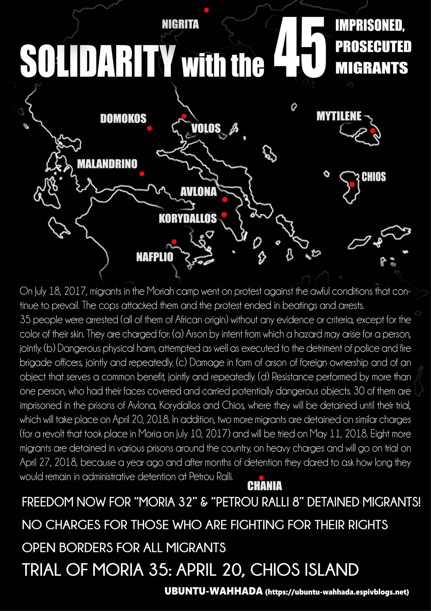
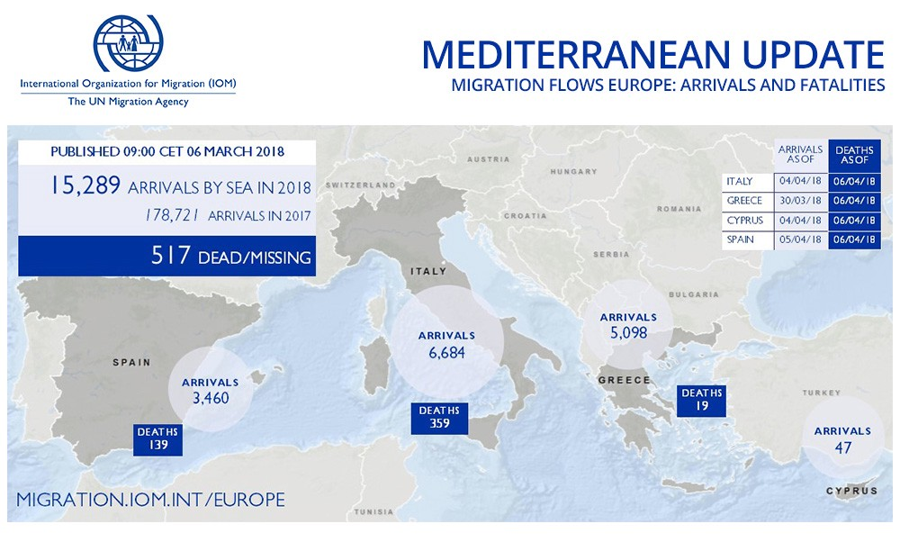
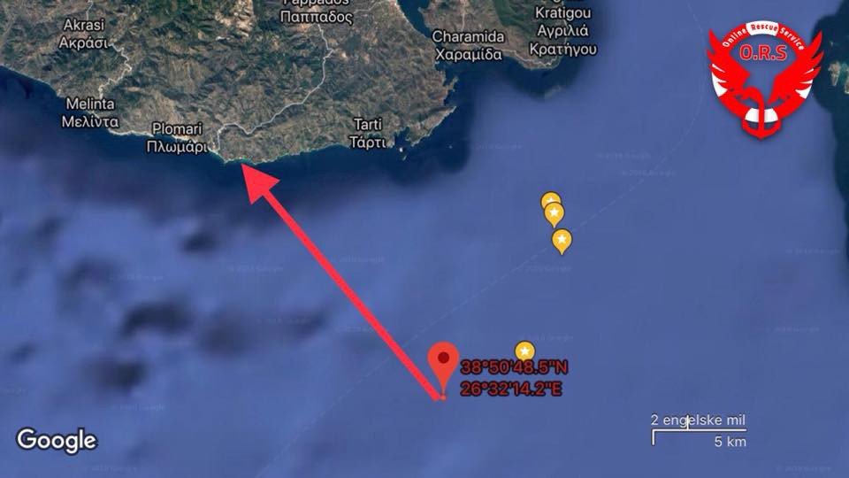
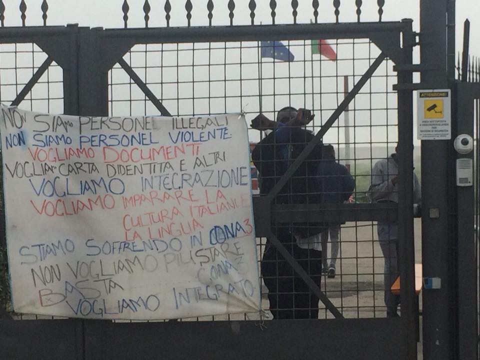
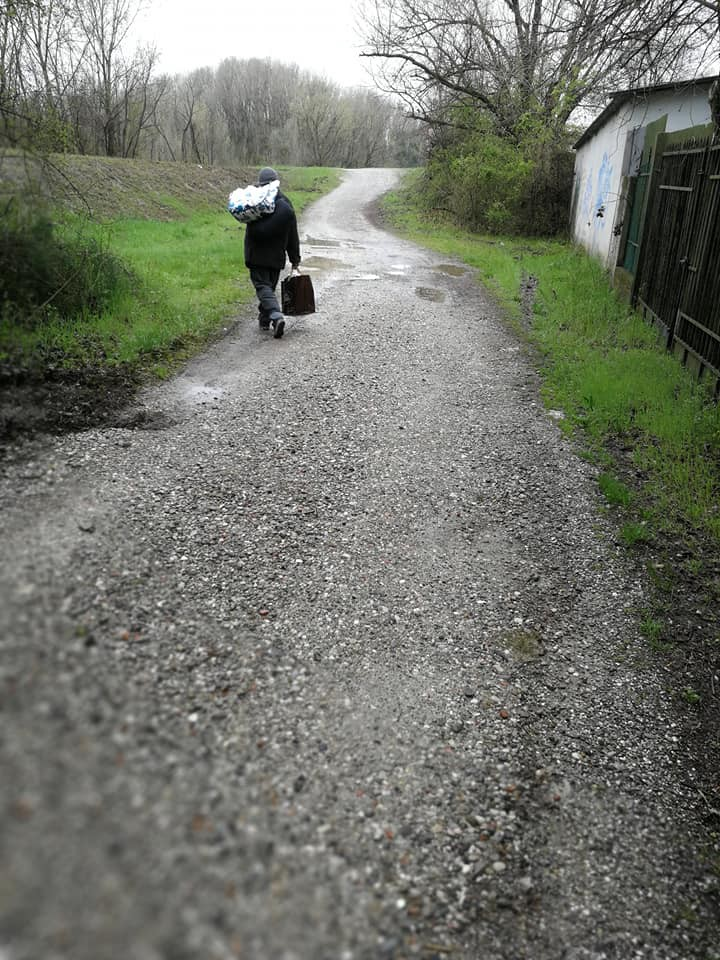
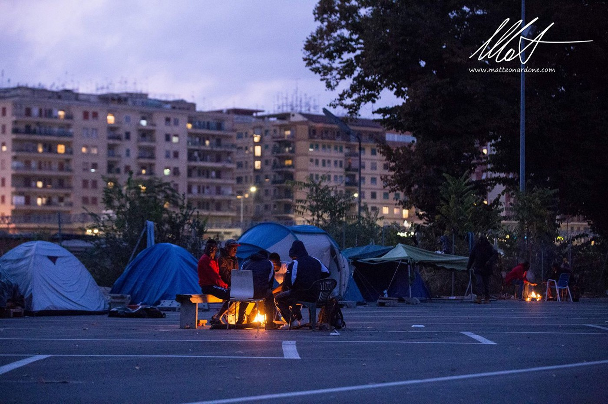

### AYS Daily Digest 06/04/18: Solidarity text from the Balkanroute Network Meeting
#### Twice as many suspected people smugglers in Interpol’s database than three years ago / A woman and her children drowned in Evros river / Arrivals in Greece continue to increase, at the same time as the total number of arrivals drops / Situation harsh on several locations in Italy / Deportation from Austria to Croatia / And a lot of other news and stories\!

](assets/6f1e481a5f7e/1*FUlcRFZO1pfTkdMonb2U6g.jpeg)

Photo: [**Open Borders**](https://www.facebook.com/openeuborders/?hc_ref=ARTkpGZn1jpu26yEt6dgW6s3n-8Md78h4qnhsf9BppreuNp6PCKz-OkX4usVQkhexfI&fref=nf)
#### Feature

In March, the _Balkanroute Network Meeting_ took place in Zagreb\. On the agenda were the riots, or protests agains inhuman treatment, _Moria 35_ and _Petrou Ralli 8_ \. At the meeting, a solidarity text was written with the victims of these events in mind\.

In the text, it says that Greece is a community built upon “borders within borders” and long\-term detention\. The Greek camps are militarized and operated under the same rules as prisons\.

The result of this method is a situation where refugees and migrants are kept in closed facilities without any real freedom of movement\. Some are free to move within Greece, whereas some are kept in closed detention and pre\-removal facilities\. The other side of this is that it creates a comfortable situation for the Greek authorities, when “help” equals “detention”\. Not much else has to be done but building walls and borders\.

> But, since all humans have dreams bigger than a cage, this treatment and the militarized management of people with hopes and dreams is not always met with silence and acceptance\. 

Another issue, caused by the vague framework for migrant detention, is that no one, including the migrants and the staff in command, really knows exactly for how long this detention can last\. By avoiding clear rules, it is easier to claim they have not been broken\.

At the _Balkanroute Network Meeting_ , two of the riots, caused by the unfair treatment and lack of framework, were in focus: _Moria 35_ and _Petrou Ralli 8_ \. Both took place in Greece 2017\.

During what is now called _Petrou Ralli 8_ , police beat up migrants in their cells at the infamous Petrou Ralli pre\-removal detention center\. After the incident, the police said that the escalation before the riot, or protest, had been ongoing for 40 minutes\. Furthermore, it was said that the wounded migrants had been injured on their own when they tried to escape\. At this point, they had all been kept in detention for 8–10 months\. _Moria 35_ , the 18th July 2017, is similar to _Petrou Ralli 8_ \. Fabricated evidence and 35 people detained on the exact same grounds as one another\.

The people arrested in Moria35 were picked randomly\. How can more than 30 people be responsible for exactly the same actions in a so\-called riot?

The solidarity text with the above\-mentioned information was written at the meeting in Zagreb\. Seeing all the pieces of information together, as is done in this text, makes it easy to distinguish a filthy pattern\. These trials are all built on a will to silence people\. Silence those who claim their rights\. The right to be free, and the right to regain power over one’s life\.

> What happened to freedom of speech for everyone? 

Five of the _Moria35_ wrote a statement today, published by Enough is enough\. Read their arguments and important side of the story [here\.](https://enoughisenough14.org/2018/04/06/refugeesgr-statement-by-5-of-the-accussed-of-the-moria-35-take-action/) We stand with them\. The trial will be held on 20th April\.

This is a map of the 45 people who are unlawfully detained in Greece at the moment\. Photo from the Balkanroute Network Meeting\.
#### General

[Interpol is tracking 65,000 migrant smugglers](http://www.manilatimes.net/eu-tracking-65000-migrants-smugglers-europol/390604/) , which is twice as many as at the height of the migration crisis three years ago\. The illegal trade is booming in the shadow of several migrant deals and closed borders\. From 30,000 suspected smugglers in the databases by 2015, the number jumped to 55,000 in 2016\. In 2017, another 10,000 suspected criminals were added\.

The statistics speak for themselves\. Claiming that the current policy of detention, as featured in today’s digest, and different “exchange programs” with safe third countries, works, is not really accurate\. Twice as many migrant smugglers as there were three years ago\. That is a huge increase\.

Bearing in mind the horrible conditions on the Greek islands and the lack of help everywhere, it is clearly more a situation of push\-factors somewhere else, than pull\-factors in the glorious Fortress Europe\.
#### Sea

15,289 migrants and refugees entered Europe by sea in the first 95 days of 2018, with about 44 per cent arriving in Italy and the rest divided between Greece \(33%\) Spain \(23%\) and Cyprus \(less than 1%\), [according to numbers from IOM\.](https://www.iom.int/news/mediterranean-migrant-arrivals-reach-15289-2018-deaths-reach-517)

At this point in 2017, a total of 31,060 had arrived, and in 2016 the number was 172,089\.

Photo: IOM

[Missing Migrants Project](http://missingmigrants.iom.int/region/mediterranean) counts 517 deaths at sea from 1st January to 6th April\. In line with the numbers of arrivals, that is a decrease from last year, when 804 people lost their lives the same period\. [According to RefuComm](https://www.facebook.com/watchthemed.alarmphone/posts/2090745954532970?hc_location=ufi) , most of the lives are lost in the Central Mediterranean\.

But according to the report from Interpol, the number of human smugglers has doubled in the past three years\. Despite the decrease in arrivals and deaths at sea\.

](assets/6f1e481a5f7e/1*X8F0tFHEIOO36eD_Ihaq-g.png)

Photo: [**Watch The Med — Alarmphone**](https://www.facebook.com/watchthemed.alarmphone/?hc_ref=ARRmcwSDkBx2rkMvzT9nUcQNuiDhQu5430WXSqS2QyzEsoXS72Cc0T6dhm7vx8THYGU&fref=nf)
#### Afghanistan and Pakistan

There has been an increase the past week in the number of Afghan returnees from Pakistan\. This week the number doubled: up to 337 registered Afghans returned between 18th and 24th March\. The number of undocumented Afghan refugees also increased by 37 percent: last week’s number was 720 people\. Aid and cash assistance is provided, according to this report\. But, that is for all the documented and \(documented\) undocumented people\. It is likely that the dark areas are big\.

For more details, se the map below or [read more here\.](https://www.humanitarianresponse.info/sites/www.humanitarianresponse.info/files/documents/files/afghan_returns_20180331.pdf)

](assets/6f1e481a5f7e/1*nj-n8_QPQ0jaM0h2xFZsCQ.jpeg)

Photo and statistics: [Humanitarian Response](https://www.humanitarianresponse.info/sites/www.humanitarianresponse.info/files/documents/files/afghan_returns_20180331.pdf)
#### Greece

ECRE \(European Council on Refugees and Exiles\) said in a report that they have noticed an increase in arrivals on the islands from Turkey\. The new Greek Minister of Migration Policy, Dimitris Vitsas, said that 33% more people arrived up until this period this year compared to last year\. In March there was a 59% increase in arrivals compared to March 2017\.

It may sound contradictory: there is both an increase and a drop in arrivals at the same time, but it all depends on which years and numbers one counts\. While the general number is lower this year than last year \(as mentioned under “ **Sea** ”\), the main reason is the decrease in arrivals in Italy due to agreements the Italian government has made with individual states\.

In addition to this, [Ekathimerini reported](http://www.ekathimerini.com/227476/article/ekathimerini/news/turkey-seizes-203-illegal-migrants-heading-for-greek-islands) that 203 refugees had been intercepted by the Turkish Coast Guard in the previous 24 hours along the Aegean shore\. The Coast Guard said that the migrants attempted to “sneak in to the Greek islands”\. The migrants tried to enter Greece by boat, 39 on one and 55 on another, and 111 migrants remained at land when they were caught, accused of trying to do the same\. They were found in three different locations in Izmir, the Turkish coastal city well\-known for being an exit point for those moving towards Europe\.

So far this year, a total of 4,451 migrants have attempted to reach the Greek islands via Turkey, up from 3,781 over the same period in 2017\. Numbers according to the Turkish Coast Guard\.

**Mainland**

Newly arrived in Greece, just after crossing the Evros river, a group of refugees in the Sofikos area saw saw that a mother with her three children had not managed to cross it with them\. According to the information we have so far, the mother and her children drowned on the doorstep of the EU\.
At the same time, a large group of refugees managed to cross the river\.

Currently, big groups are making the crossing every day\. It is **NOT SAFE** to cross the river\. We recommend everyone to [read this](http://www.euronews.com/2018/04/03/watch-how-the-evros-river-floods-parts-of-greece-and-turkey) before risking your life\.

A cause of the crossing is heavily over\-crowded camps, police stations and lack of proper housing solutions\. A total of 106 refugees arrived from the Evros borders in Thessaloniki, transferred to Diavata and Lagadikia camps\.

**Islands**

At the same time, arrivals on the islands continue\. This morning three boats arrived on Lesvos, with a total of 139 people\. For more information about the different boats, follow [this link](https://www.facebook.com/AegeanBoatReport/posts/329500944239683) to [**Aegean Boat Report**](https://www.facebook.com/AegeanBoatReport/?hc_ref=ART0uU7cRGjUFK7vjDOkHTNODret4hy2u3OfkYEg8vaFo2biuPFHL_FzjpNY71jy-28) **’s** update\.

](assets/6f1e481a5f7e/1*jtuN3AgLKMvK1ug2EWrqUg.jpeg)

Photo: [**Aegean Boat Report**](https://www.facebook.com/AegeanBoatReport/?hc_ref=ARSq3_Ow7LiI4_sEQHwku9QomoCFAgJBoGUJAXVlv4BV_O5Pa6yTVwvv7Qom3Q1akLE&fref=nf)
#### Italy

**Cona, Venice**

This morning a group of people went to the centre in solidarity, to talk with some of the guys hosted there and monitor the situation, as they are used to doing, but found the entry patrolled by police who impeded any contact with the residents\. Also, banners expressing solidarity were torn up and there were personal threats\. Again, it is obvious that humanity is seen as a criminal or offensive act instead of the other way around\.

More than 500 people live here and in November they marched to protest against their living conditions\. The Prefetto agreed to move some of the residents to other structures but that has never happened, hence the solidarity and protest walk this morning\.

](assets/6f1e481a5f7e/1*0Kr8vgoy1ZfkEi0SCJvoqQ.jpeg)

Images from the entry where police was patrolling\. Photo: [**Sconfinamenti Padova**](https://www.facebook.com/SconfinamentiPadova/?hc_ref=ARTMnANiekGjir8jk9xfjnltg12zqG-UyE9e3wz9hOoW_HGy31I8a0G17FNzUSvfHdQ&fref=nf)

[Also in Italy](https://www.facebook.com/groups/611865802341602/permalink/809894299205417/) , in Gradisca close to Gorizia at the Slovenian border, a local volunteer reported that they recently found six people living in the forest\. The volunteers brought blankets and sleeping bags\.

](assets/6f1e481a5f7e/1*UxWcDsAu6JRYnnAu9ZZF1A.jpeg)

Photos: [**Mauro Chiarabba**](https://www.facebook.com/mauro.chiarabba?hc_ref=ARQemVHMeB-FOg9UOl-x1GLsvVAlEt6GAP_zUQDBu8ejpDGUaSf0T6UbmUSxCGaVuyo&fref=nf)

In Rome, [**Baobab Experience**](https://www.facebook.com/BaobabExperience/?hc_ref=ARQA9aOCb02Pkqs1iG6F7Iv0O9X1-d828CZ1cok4YbE5pwfowU73WG6zRVZlLwvvYDE&fref=nf) published an urgent needslist\. [Read it here and contribute in any way you can\.](https://www.facebook.com/BaobabExperience/posts/1637075066369239?hc_location=ufi)

Photo: Baobab Experience
#### Serbia

Refugee Aid Serbia released their monthly letter today\. For more information, [click here](https://refugeeaidserbia.org/wp-content/uploads/2018/04/RAS-newsletter-March.pdf) \. One popular thing they will continue with is football, and a tournament will be held\.
#### Austria

A new deportation from Austria to Croatia is scheduled, according to a [**Border Crossing Spielfeld**](https://www.facebook.com/RefugeesSpielfeld/?hc_ref=ARS9Y46AZtipB4fgo8PiJ3Zq2VzzzxeLaoB3yMGk2ob19rj5Vg2ihX6fGQYI2yQuIRE&fref=nf&hc_location=group) update\. This time it is two young Syrians who are held in custody in Vienna\. The list of unlawful deportations from Austria to Croatia is long, and can be read in [this post\.](https://www.facebook.com/RefugeesSpielfeld/posts/2015665842027228)

](assets/6f1e481a5f7e/1*Q-xMLrMDVivBxTo_VwPygg.jpeg)

This is where the two young Syrias are being held\. Photo: [**Border Crossing Spielfeld**](https://www.facebook.com/RefugeesSpielfeld/?hc_ref=ARS9Y46AZtipB4fgo8PiJ3Zq2VzzzxeLaoB3yMGk2ob19rj5Vg2ihX6fGQYI2yQuIRE&fref=nf&hc_location=group)
#### Germany

In Germany, family reunification remains a toxic issue\. A new draft of the law regulating the right to family reunification would not affect anyone but the people who are deemed to be potential threats to Germany\. The current legislation says that people with subsidiary protection status are excluded from the right to reunite with their family\. [More information here\.](http://www.dw.com/en/refugee-rift-in-angela-merkel-government-sparks-war-of-words/a-43285146)
#### Sweden

Socialstyrelsen \(translated from Swedish: the National Board of Health and Welfare\) has made several errors regarding age assessment\.

[The Swedish authority](https://www.svd.se/socialstyrelsen-backar--flera-fel-om-aldersbedomningar) , whose mission it is to make sure that welfare, both regarding healthcare and other kinds of social justice, is available to everyone, now admits serious shortcomings in the report that underlies medical age assessments of asylum seekers\. The message comes after the daily paper SvD’s review and hard criticism from statistical professors\. The numbers the method is based on are wrong, which makes it uncertain\. People can be judged to be older, or younger, than they really are\. This has a huge impact on people’s lives\.

Representatives from Socialstyrelsen claimed that there is a need to make changes in the framework, but despite the big faults pointed out by the professors of statistics, the representative claimed that overall the tests work\. The professors, on the other hand, hope that there will be a change\.

**We strive to echo correct news from the ground through collaboration and fairness\.**

**Every effort has been made to credit organizations and individuals with regard to the supply of information, video, and photo material \(in cases where the source wanted to be accredited\) \. Please notify us regarding corrections\.**

**If there’s anything you want to share or comment, contact us through Facebook or write to: areyousyrious@gmail\.com**

_Converted [Medium Post](https://medium.com/are-you-syrious/ays-daily-digest-06-04-18-solidarity-text-from-the-balkanroute-network-meeting-6f1e481a5f7e) by [ZMediumToMarkdown](https://github.com/ZhgChgLi/ZMediumToMarkdown)._
