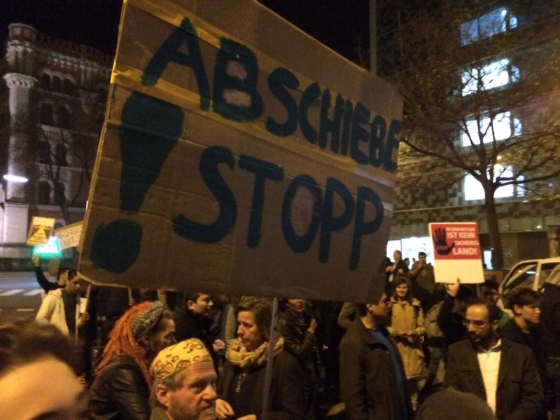

### AYS Daily Digest 07/04/18: Deportations from Austria

_People to be deported from Sweden and Austria on Monday//Volunteers intimidated in Calais//Boats continue to arrive in Greece//_

Photo by Arye Wachsmuth
#### Austria

Many people have been arrested over the last few days, with up to 400 arrest warrents being issued against Afghans\. The Platform Refugees Welcome says several Afghans will be deported from Sweden and Austria with a flight leaving from Sweden at 10PM on Monday with Titan Airways\.

This acceleration of deportations comes despite a flaring up of violence in Afghanistan\. In [France](ays-daily-digest-23-03-2018-state-destroys-tents-while-providing-food-e58c01a2e321) , the Cour nationale du droit d’asile \(CNDA\), which reviews asylum appeals, has said subsidiary protection can be granted to a resident of Kaboul, given the “high intensity violence resulting from an internal armed conflict” in the city\.

A [protest](https://www.facebook.com/events/2026721800878805/) will take place in Vienna starting 6PM against deportations and cuts to education for refugees\. Refugee Protest Camp Vienna calls on people at risk of deportation to always buy a ticket for public transportation and to avoid places that are regularly sites of racial profiling, including Meidling, Westbahnhof and Praterstern\. In Sweden, 30 Afghans at the Kållered detention centre have started a hunger strike\. Organisations have called on people [to protest in front of the detention centre today](https://www.facebook.com/events/1674634859287531/) \.
#### France

Associations in Calais have started a campaign condemning the criminalisation and intimidation of volunteers\.

On the 23rd of March, volunteers from L’Auberge des Migrants distributed tents and sleeping bags after the destruction of tents by police the same day\. Two of them got their ID checked and were later asked to go to the Calais police station where they were faced agressive questioning\. L’Auberge des Migrants says it has been repeatedly intimidated and fined by police\.
#### Greece

A boat with twelve children, three women and two men arrived at 4AM this morning on Chios\. 60 people arrived on Lesvos\.

Intervolve needs a [free shop and warehouse manager](https://docs.google.com/document/d/1CwpYH9AMPuGSXgKJis_8MIPuIEM2abtX_B2kAvrIxNk/edit) \. Other volunteering needs can be found [Greecevol](https://www.greecevol.info/) \.

**We strive to echo correct news from the ground through collaboration and fairness\.**

**Every effort has been made to credit organizations and individuals with regard to the supply of information, video, and photo material \(in cases where the source wanted to be accredited\) \. Please notify us regarding corrections\.**

**If there’s anything you want to share or comment, contact us through Facebook or write to: areyousyrious@gmail\.com**

_Converted [Medium Post](https://medium.com/are-you-syrious/ays-daily-digest-07-04-18-deportations-from-austria-dc3bfc1e09d3) by [ZMediumToMarkdown](https://github.com/ZhgChgLi/ZMediumToMarkdown)._
