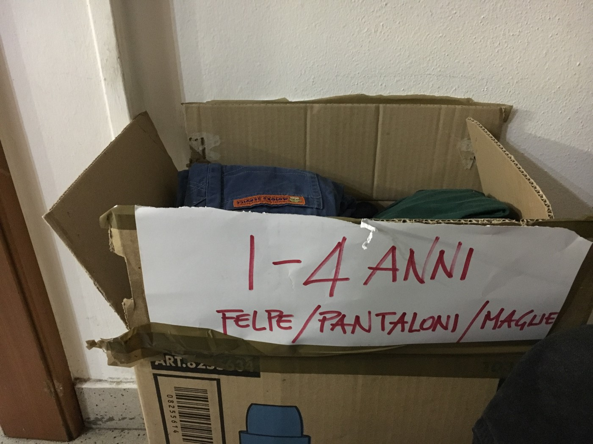
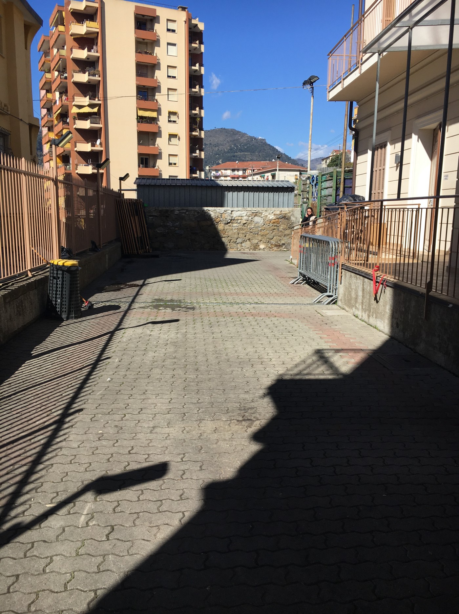

### **AYS Special from Ventimiglia: The sea is raging today**
#### How life goes on in Ventimiglia, three years after the so called “emergency”\.

Credit: Andrea Panico

I arrive in Ventimiglia on a sunny Monday afternoon, I have never been here but read a lot of stories and articles on how disastrous the situation is\.

I am aware of the fact that just the previous weekend, a massive fight between the Sudanese and the Afghan communities living under the bridge broke out \(because of a stolen phone\) but was sedated by police and armed forces\. The local population, exhausted by the situation, took the streets and very violently demonstrated against the ongoing presence of migrants sleeping under the bridge along the Roja, few metres away from the bustling central streets of the town, which counts around 24\.000 inhabitants\.

Migrants have been sleeping rough for few years now, since 2015 the presence was constant and has been increasing or decreasing according to the weather, the forced pushbacks to Taranto, fights and consequent political actions\. It reached the peak in the summer 2016, when around 600 people were sleeping rough and around 1000 were transiting per day, reaching now a stable presence of 150–200 people \(around 25% from Eritrea\) \.

Just outside the train station, I see 5 guys hanging around in the sun, probably recently arrived from other Italian cities and 3 members of police forces patrolling the platforms\.

I decide to start walking around and end up to the sea front\.

“ _The sea is raging today,_ ” says an elderly woman passing me by “ _…rightly so_ ” I reply, staring at the stone benches in front of me\.

Credit: Emanuela Zampa

**Mamma Delia**

When I enter Bar Hobbit, I see a family with a small baby and another young child assisted by some volunteers trying to convince them to go to the Red Cross camp, few kilometres away from the town, hidden in the mountains, but where they could receive some assistance and at least a roof to protect the children\.

Few tables from them, 4–5 guys are hanging around, talking to each other while waiting for their phone to charge\.

One of them is talking directly with Delia, the owner of the cafè, a small, middle\-aged lady with a kind smile and honest eyes\.

“ _Mamma Delia,_ ” he says “ _I love you_ ”\. We all smile and she replies “ _I love you too but stay away eh\!_ ” and we all laugh\. I am drinking my coffee and I ask her how the situation is\.

She sighs “ _It’s not good,_ ” and tells me about the fight and the reasons why it broke out, plus the dynamics of the nationalities living under the bridge\. I ask her about the reaction of the locals and what is their point of view and, scrolling her head, she replies that there is a general indifference, people don’t care and are tired, rightly so in a way, especially those living in direct contact with the migrants, those people whose houses are right in front of the bridge\.

She tells me that under the bridge there are women and children as well, even though the Red Cross camp is half empty, people don’t want to go there, they are afraid that they will never be able to go out, they are afraid of the fact that they will be fingerprinted and maybe sent back to Taranto\.

I asked Delia about the local people visiting her cafè, she says it’s been ages her fellow citizens are not coming, since she opened the doors to migrants\. She adds that some places don’t even allow them to sit outside\. Even though that didn’t surprise me, I was a little saddened, can’t believe these behaviours are still alive today\.

“ _What is the job of the administration? What are they doing?_ ” I ask\. She smiles, “ _They do nothing_ ”\. They did not even put portable toilets\. In 2016, they put a ban to distribute food to migrants, not even packed food\! But that was removed after a year, in 2017, as the big INGOs \(Unicef, Save the Children etc\. \) raised their voices against the stupidity of the ban, organising a demo, basically making the local administration look terrible\.

NGOs in solidarity run by foreigners \(mainly Kesha Niya\) were distributing food throughout the period of the ban, but for the Italians working there were at the risk of having legal actions taking against them\.

Bar Hobbit is the only cafè in town where migrants are welcome to sit and just relax, they can charge their phones and met with volunteers who can give them infos or talk with them, human to human\.

Credit: AYS

Delia is always up to help families in need, she offers storage place, clothes and equipment needed to take care of the babies and represents a main meeting point and headquarter for volunteers, people on the move and NGOs\. A cornerstone for solidarity\.

She is very open and talks sincerely with no need of presentations\.

Credit: AYS

In the cafè, I also briefly speak to some guys living under the bridge and we all laugh to the nicknames they give to each other to understand who they are referring to, “Italia 1” \(like a TV channel\) or Paki \(a super original nickname for a person from Pakistan\) and, as we say goodbye, I meet an independent volunteer, and Delia asks him to take me to Progetto Eufemia to have a chat with the guys there for more info\.

**Progetto Eufemia \(Info point\) and Progetto 20K**

[Progetto Eufemia](https://www.facebook.com/EufemiaVentimiglia/) \(PE\) was born in July 2017, mainly from the activist involved with [Progetto 20K](https://www.facebook.com/progetto20k/) and it’s the reality that is coordinating the volunteers and independent NGOs in Ventimiglia\. The services and activities carried out by PE are:
- giving free access to internet and charging stations;
- legal support \(one volunteer is available during the weekend\);
- logistic support and material distribution of tents, sleeping bags, blankets, wood for fires;
- screenings of football matches;
- organisation of games and other activities for the guys under the bridge;
- monitoring actions at night, in collaboration with the volunteers of Kesha Niya, at the train station, offering advice and information to newly arrived people on where to go, in order to avoid these people to become victims of the prostitution or drug rackets\. They used to monitor the situation at the border too but now it’s become difficult due to lack of volunteers, so the information gathered are used for internal information\. Monitoring actions were carried on in order to know with which criteria people were deported back to Taranto \(numbers, nationality, procedure, what armed forces were mobilised, how frequent deportations were etc\. \) and the network of people in solidarity was so well established that activists in Taranto would wait for the people pushed back in order to report on the time taken, the conditions of arrival etc\.;
- since January 2018, once a week they have established the “Women’s day,” a day a week dedicated exclusively to women, for them to feel listened to\. Around 20 women was the max number of presences reached, but, due to bad weather conditions and extreme cold, the number reduced; it varies though depending on different factors\.

Credit: AYS

A major victory of the PE \(and other NGOs that signed the petition\) was to achieve the suspension of fingerprinting of women and minors to enter the Red Cross camp\. The fingerprints are taken just for security reasons, not to identify the people, but many migrants are afraid of this procedure as they feel they could be deported once inside the camp\. The suspension of the measure facilitates the entrance and stay at the camp, which guarantees at least a roof and showers\.

At the moment, they are not able to offer language classes as there is a lack of human resources, but some volunteers do their best to have conversation with the guys either in Italian or French\.

The volunteers told me that the relationship with the police is ok, even though, few months back, they used to be targets of identification procedures\.

They are now setting up a crowdfunding campaign which will last for a year circa, so keep your eyes open to support the much needed activities of these volunteers :\)

**Stories from under the bridge**

A\., 17, from Eritrea is super open and smiles constantly\. We’ve just met and he doesn’t know anything about me but he shares with me the story of his past journey to reach Italy\. He fled the dictatorship in Eritrea, he fled for freedom, as every young man is also forced to join the military service there, with very dark future perspectives\.

Once in Libya, he was closed in one of these “ _magazzino_ ” he keeps saying, literally “ _warehouse_ ”, a jail most probably, with other hundreds of people, they were sleeping one of the top of the other as there was no space\. Food is scarce\. “ _People die in the magazzino_ ”\. “ _They always ask for money_ ” he says, “ _if you don’t have money, they beat you\. Police beats you for money\. Money to cross_ ”\.

Credit: Andrea Panico

H\. comes from South Sudan\. He must be in his late thirties and has just arrived in Ventimiglia from Lampedusa\. His smile is something I cannot understand as a Westerner, how can you be happy sleeping in a tent, in the mud, far from your family who live in a war torn country, after spending time in Libyan jails, after crossing the high deadly route of the Mediterranean? I know, the answer is probably “ _hope_ ”, but still is something I cannot grasp fully\.

He worked for 7 years with UNHCR in South Sudan, from 2008 till 2015 as part of the peace convoys, working as a cultural mediator\. The contrast is too much for my brain, how can someone who worked for 7 years with the UN Agency for Refugees not be granted immediate protection? He proudly shows me all the pictures he has of the certificates that witness the hard work he has done in his country\. \.

**Caritas**

[Caritas Intemelia](https://www.facebook.com/caritasventimiglia/) is open every day, except Sunday, and is able to guarantee breakfast and an early lunch between 9 and 12 AM, with great voluntary chefs who prepare delicious meals for the people on the move who come to the canteen\.

There is also an organised clothes distribution \(always inside the building\), available for men, women and children\. Women and children also can use a space on the second floor to feel more “protected”\.

Around 200 people \(varying on the periods, there were also peaks of 600 in summer 2017\) are using these services every day, with a total of 50 volunteers who run them from Italy and France and who take turns and shifts\.

Moreover, at Caritas’ a doctor is available daily and also there’s a possibility, for those interested, to benefit from psychological assistance but, as the requests are high in numbers, it’s not always that easy to access the service\.

Credit: AYS

**Anafè**

By chance, I am introduced to a French lawyer working with [Anafè](https://www.facebook.com/Anafé-603082679832319/) , an NGO based in Paris that is composed by solidarity lawyers\. The team, together with Italian lawyers, members of ASGI, are in Ventimiglia to carry on a second action to monitor illegal pushbacks of minors happening at the border\. The first joint action was taken in February and it lead to the court in Nice admitting that those pushbacks were illegal and that minors should never by victims of refoulement\.

From the first action \(17/18February 2018\) :

“ **_Mobilized_** _:_
- _14 lawyers practicing in France \(Nice, Lyon, Paris, Toulouse and Montpellier\) \._
- _6 lawyers practicing in Italy \(Milan, Genova and Torino\) \._
- _Around 10 members \(employees or volunteers\) from 6 associations having activities in Ventimiglia, who have observed practices in Ventimiglia and advised pushed back people \(associations Intersos, We World, Eufemia, Caritas, Oxfam and Diaconia Valdese\) \._
- _20 volunteers from 6 French associations of Alpes\-Maritimes, who have observed practices in Menton Garavan and at the land border of Ponte San Luigi \(associations Amnesty International France, DTC\-Défends ta citoyenneté, La Cimade, Secours Catholique, AdN, MRAP\) \._
- _7 translators \(employees from associations or volunteers\) \._
- _A driving on the ground by members of Anafé, Cimade and CAFFIM coordination\._

**_Have been observed_** _, during the week\-end \(from Saturday 17 February 2\.20pm to Sunday 18 February 6pm, excepted on Sunday from midnight to 5\.20 am, i\.e\. 22\.20 hours of observations\) :_
- _97 arrests from the station Menton Garavan of persons coming from Ventimiglia, and as many push backs \(by train or by foot — 2 hours of walk until Ventimiglia\), without the compliance with French legal requirements of denials of entry \(‘refus d’entrée’\), for unaccompanied minors and asylum seekers\._
- _46 push backs \(majority of unaccompanied minors\) by train directly from Menton to Ventimiglia, without being transferred through the Italian border post\._
- _36 persons illegally detained all the night at Ponte San Luigi border post \(Menton\) \._
- _Bad conditions of detention of persons in Ponte San Luigi border post during all night long \(according to the observations, interviews with the detained persons and some policemen\):_

1. _From 8 to 12 hours of detention, in violation of French legal provisions and decision of Conseil d’Etat of July 5, 2017, without an access to a lawyer,_
2. _Small room without heat or mattress,_
3. _No food,_
4. _No information except that they will spend the night in the room before, being sending back to Italia the day after,_
5. _No access to a doctor whereas detained persons have requested it,_
6. _Brutal behaviour of policemen \(physical or verbal\) \._

_20 appeals \(‘référés\-libertés’\) have been done by lawyers, against denials of entry received by 20 unaccompanied minors\.”_

From the second action \(17/18 March 2018\):

_“ **The organization on the ground was the following :**_
- _Members of associations were monitoring on Friday 16/03 from 10h to 00h and on Saturday 17/03 from 5h to 19h, at police station in Ponte San Luigi in Menton and station of Menton Garavan \(except the Friday evening where there were only monitoring at the police station Ponte San Luigi\) \._
- _Members of Italian associations and lawyers were organized as “mobile teams” in order to follow pushed\-back minors\. They have notably intervened on Ponte San Luigi to accompany minors to Italian police\._
- _French lawyers have been on Ponte San Luigi in Italy to meet the pushed\-back persons and also in Caritas \(Ventimiglia\) in case of litigation’s possibility\._

**_What we have observed :_**
- _Still a high number of arrests and push\-backs of migrants \(114 persons\), mainly coming from Menton Garavan station but also from other places which we don’t know\._
- _Push\-backs in Italy still so fast : generally the persons wait in front of the police station for 5 minutes before receiving their “refus d’entrée” and being pushed\-back to Italy, without, therefore, having the possibility to benefit of an individual assessment \(and to seek asylum\) \._
- _Detention during all night of many persons: 34 have been detained between 4 and 13 hours in the police station\._
- _No return of unaccompanied minors by train to Italy:_

1. _Either some minors have been taken over by Paje association \(French childhood protection\) in some cases \(notably when Italian police bring them back to the French police which has just pushed them back\);_
2. _Either some minors have been pushed back, being considered by French police as adults\._

_The first conclusion is, therefore, that the practices have been modified since the February action, with a small part of minors taken over by childhood protection but also still violations of asylum seekers’ right and unaccompanied minors for which the declarations are not taken into account\._

_We are currently assessing the next steps further this action and we will get back to you soon on this\._ ”

Credit: Andrea Panico

**Menton**

I decided to take the train from Ventimiglia to Menton Garavan \(first French station, after the border\) around 8 PM to monitor which police forces are at work in the train stations\. Few minutes before the departure from Ventimiglia, 5 policemen were checking the departure platform and they stopped 2 migrants at the top of the stairs\. I could hear they were warning them of the risk to meet the French police on the train\. Another 4 policemen were patrolling the first platform \(immediately after the doors to enter the station from the platforms\), while another 2–3 were inspecting the train from the inside\. Just before entering the station I could notice 3 migrants with their backpacks on, probably ready to leave\.

The train ride is about 10 minute long and, once in Menton Garavan, 3 members of the CRS \(French police, present also in Calais and famous for the abuse of force\) enter my coach and search through it\. I could not count the total number of policemen present as it was too dark, but I guess the numbers were similar to what observed on the other side of the Alps\.

**Yves and the wooden games**

Yves is a French guy and every now and then he comes to Ventimiglia with his van and wooden games \(that he built\) and set them up for the guys living under the bridge, obviously playing with them too\.

Credit: AYS

**Red Cross camp — the infinite odyssey**

I officially sent a request to the local Prefecture to enter the Red Cross camp \(located 5 km outside Ventimiglia, in the mountains, no bus line running in the proximity\) a month before my arrival to the area\. By calling everyday for the 2 weeks before my arrival and during my stay, I manage to get a positive answer to enter the camp, the day before the one agreed\.

The responsible of the Red Cross Camp, Gabriella Salvioni, then contacted me and told me I could not enter the camp as the notice was too little and Red Cross was already busy “supporting the migrants living under the bridge” the following day\.

From testimonies gathered from volunteers and migrants, a migrant with a broken ankle \(who was living under the bridge\) was turned away and denied medical care at the entrance of the camp, because “no doctor was present that day”\.

The camp has officially opened in 2016 \(but in January\-February 2017, it had to close down momentarily due to a fire\) and, as for now, it can host around 400 people\. At the moment it is half empty, due to the law number of people present in the area and for the fingerprinting policy at the entrance\.

Families, women, children and men are all accepted in the centre but, even though, they should be separated, the situation is promiscuous\.

People should receive not only food and shelter, but also medical and legal assistance, together with the possibility to take showers regularly\.

Testimonies gathered though say there are only around 2 showers available so, in some cases, people can queue for long time before having the chance to wash\.

Legal assistance is mainly given by external NGOs as the Red Cross legal expert is just one and overload with work\.

[**Kesha Niya**](https://www.facebook.com/KeshaNiyaProject/)

has been working in the area since April 2017 and initially was cooking 2–3 times a week; now, they are serving dinner every day, except from Sundays when they distribute breakfast\. What they normally serve consist of salads, rice or soup made with freshly cooked ingredients, always vegan, so everybody can eat their portion\. Plus, water, tea, bread and fruit\.

Kesha Niya, at the moment, receive donations of food and money from a French NGO, called La Roya, but they are setting up their own crowdfunding campaign as well\.

The average number of portion Kesha Niya prepares everyday is around 3/400 but they are aware that people may need more than one portion as it might be their only meal of the day\. So, support these guys\!

Also, they provide food for babies\.

They work mainly in coordination with Info point and are, obviously, aware of the service Caritas is offering so they aim at filling the gaps left by the system\.

Volunteers have undergone passport checks and personal searches that definitely did not facilitate their work\. A volunteer states that: “ _We’ve been undergoing those checks \[…\] without doing anything “illegal”; they meticulously build a database on volunteers working in Ventimiglia and seem to be very tactical about it\. Now they don’t do it so much or wait til after_ 
_distribution, but before, they even went in right during distribution to_ 
_demand volunteers’ passports, filming and taking pictures\._ 
_Still, there exists a ban on giving out food or water outside the_ 
_parking lot where we distribute\. We did distribute for a while small_ 
_amounts at the beach and train station, for new arrivals or people_ 
_socially separated from the bridge population, but the municipality_ 
_threatened that if we continued this, they would ban food distribution_ 
_again altogether\._ ”

Credit: AYS

**NGOs in solidarity, legal assistance and medical care**

[Oxfam](https://www.oxfamitalia.org) and [Diaconia Valdese](https://www.diaconiavaldese.org) are offering legal assistance to adults\. [Intersos](https://www.intersos.org/en/what-we-do/italy/) , which collaborates with Unicef, is responsible for legal assistance to unaccompanied minors and vulnerable people, [Terre des Hommes](https://terredeshommes.it) for legal assistance to unaccompanied minors both in Red Cross Camp and under the bridge \(they all have cultural mediators employed for Arabic and Tigrinya mainly\) \. A volunteer at Progetto Eufemia is available once a week to support migrants with legal procedures and one legal assistance is present inside the Red Cross Camp \(for all the residents\! \) \. All the above do a monitoring and advocacy work; Intersos published a [report](https://www.intersos.org/en/new-report-uasc-along-italys-northern-border/) of the situation of unaccompanied minors in the border zones of the country, few months ago\. To be underlined also the presence of UNHCR, whose tasks are also related to advocacy and monitoring\.

Medical care is offered inside the Red Cross camp, at Caritas’ and by medics volunteers during the weekend \(every 2 weeks\) \. Psychological support was offered by MSF and Intersos \(assessing whether to make a psychological referral, through simple modules during the visit\), in the past\. At the moment, a psychologist offers assistance once a week to residents at the Red Cross camp\.

Since November 2016 till mid 2017, Intersos had a specific mobile clinic project in town and in other frontier\-realities and a Child Protection project running at the same time, aimed at offering legal assistance to minors\.

With the evacuation in 2015 of the Balzi Rossi area and, later, of the Gianchette centre in 2017 \(see below\), it became more difficult to offer a stable medical care, in terms of timing and safe places\. In the period of activity of the mobile clinic project, Intersos carried out 1480 first visits \(small traumas due to cuts and wounds\) and collaborated with a medical centre in Bordighera for X\-rays\.

Other causes of health problems were related to skin diseases like scabies and abundant use of polluted river water to wash and breathing issues\.

What is lacking the most, according to a medic volunteer, is the orientation of the person, both migrants and volunteers don’t know how to navigate the medical system nor to ask for help in ER; misinformation creates false hopes\.

In regards to assistance to women, an “anti\-trafficking” service managed by IOM is available, even though it is very difficult to carry on constant work with the same women due to the living circumstances\.

For minors, a paediatrician is present by Caritas and inside the Red Cross camp, where, though, the young migrant has to undergo the painful process of age checks\.

MSF helps indirectly by donating blankets, but has officially left Ventimiglia at the end of 2017, as their project there had come to an end\.

Save the Children left when the Red Cross camp opened \(2016\), but now they’re back and work inside the governmental camp, not full time\.

[SolidariTea](https://www.facebook.com/refugeesolidaritea/) has been operating in Ventimiglia for months as well\.

Moreover, the French NGO “Un geste pour tous” has been active since the beginning of the crisis\. At the moment, it distributes dinner once a week in coordination with volunteers of the Valleè della Roja and local authoritoes\.

Others independent volunteers and NGOs are taking turns in Ventimiglia to bring their help and raise awareness, monitor constant human rights violations and abuses and to them and those that have been active since 2015 go our biggest thank you\.

**Don Rito**

is a priest, responsible for the parish of Sant’Antonio \(Gianchette\), close to the area where the migrants sleep\. His main focus, since the closure of the border, has been to keep women and children safe\. Don Rito has been hosting them in his parish from July 2016 until August 2017, when the centre was officially closed\. From May 2016 until July 2016, also men were hosted in the centre\.

Now that the Red Cross camp is officially running, the priest is not hosting migrants regularly or in big numbers, but his main focus remain the assistance to families, children and women \(who are, in some cases, victims of trafficking and need a lot of time to trust and share personal stories\) \. He mentions the role of Caritas in terms of giving assistance inside the camp \(where the mainly do activities for children\) and in the office in Ventimiglia \(see above\) \.

During our chat, he is very critical of the local authorities and their absence in the management of the situation and very clearly states that both himself and the mayor received death threats\. Don Rito not only offers assistance to migrants, but also to volunteers who can count on him for a free place to camp or refill tanks of water\.

What is missing, according to him is a safe place for families, women and children also given that inside the Red Cross camp they all live in a very promiscuous condition\.

I asked him what are the actions he would take to protect these vulnerable people and he replies that he had already proposed to buy a building, with a maximum capacity of 100 places, and turn it into a safe place for women and children but the authorities didn’t allow him to bring the project any further\.

In terms of help from abroad, he receives requests from volunteers but, at the moment, the situation is too unstable to guarantee work if they come to Italy\. He does, though, organise Italian and French classes and represent a key figure for the people on the move in the area\.

We conclude our chat with an interesting image: the Cimetière du Trabuquet, around Menton, a graveyard where there is a monument dedicated to all those African soldiers who died for France during the World Wars, “the black force”\. This is the gratitude France has towards all those migrants that gave their lives to save the country\.

Yes, the sea of humankind is raging today\.

**Updates**

Under the bridge now, a restaurant is open so what will be the future of this informal settlement? Will it become a proper village? Will it be evacuated soon? Volunteers state that police has been harassing migrants also outside the places they consider “safe” like Caritas, causing them to start fearing even to go around the town\.

Push backs have changed their final destination, which is not Taranto anymore, but Crotone \(Calabria\) \. They are regularly happening every week and an average number is difficult to establish; of these, many reach Ventimiglia again after few days\.

The eternal goose game\.

_By Cristina Guglielmini , AYS info team\._

> **We strive to echo correct news from the ground through collaboration and fairness\.** 

> **Every effort has been made to credit organizations and individuals with regard to the supply of information, video, and photo material \(in cases where the source wanted to be accredited\) \. Please notify us regarding corrections\.** 

> **If there’s anything you want to share or comment, contact us through Facebook or write to: areyousyrious@gmail\.com** 

_Converted [Medium Post](https://medium.com/are-you-syrious/ays-special-the-sea-is-raging-today-23b571d918f0) by [ZMediumToMarkdown](https://github.com/ZhgChgLi/ZMediumToMarkdown)._
