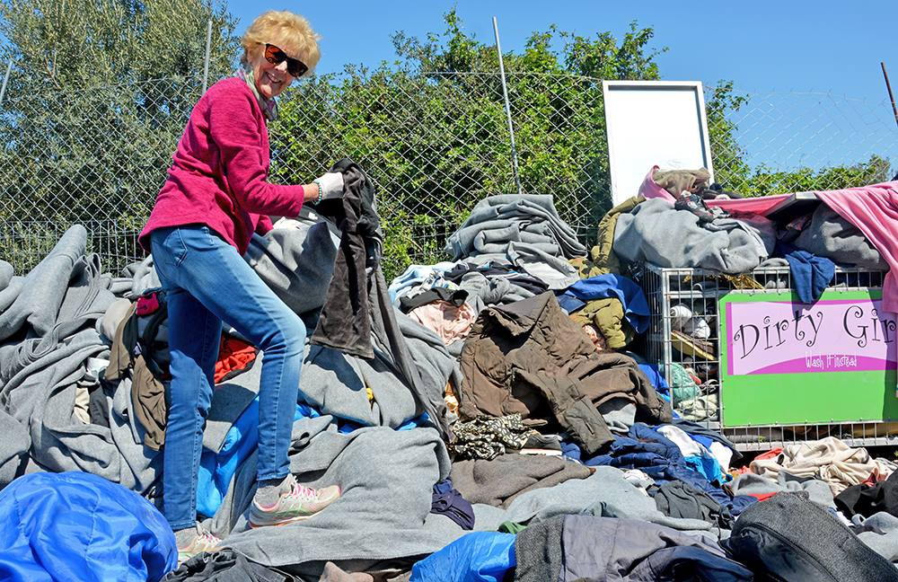

### AYS Daily Digest 08/04/18: Chemical attack kills at least 70 people in Douma

Feature: The death toll from the latest chemical attack by the Syrian regime and pro\-Syrian forces continues to rise\. Many people struggle for life in barely equipped hospitals\. Most of the deceased are women and children who were hiding from bombardment underground\. Activists are calling on the international community to break silence on regime war crimes // Evacuation from Eastern Ghouta to Al\-Bab// Sea\-Watch has new vessel// One hundred people rescued in the Aegean// News from Greece// News from Hungary// News from France

Source: Anadolu Agency/Getty Images
#### FEATURE: Chemical Attack in Douma

[Over 70 people have been reported dead](https://www.aljazeera.com/news/2018/04/suspected-chemical-attack-kills-dozens-syria-douma-180407202906316.html) in a chemical attack in Douma, the last rebel stronghold in Eastern Ghouta, near Damascus\. The actual number of fatalities is estimated by the white helmets to be closer to 100\. The death toll is expected to continue to increase as many people remain in critical condition in understaffed and undersupplied medical facilities\.

> “We are currently dealing with more than 1,000 cases of people struggling to breathe after the chlorine barrel bomb was dropped on the city\. The number of dead will probably rise even further\.” — Moayed al\-Dayrani, a resident of Douma and medical volunteer 

Most of the deceased were women and children, who at the time of the attack were hiding in basements and cellars from air bombardment, where poisonous gases are readily able to seep in\. Bombardment by Syrian and Russian forces increased in intensity last Friday after 10 days of relative calm\. The Syrian government has said they increased the offensive in response to shelling by Jaish al\-Islam on residential areas in Damascus\. However this claim has been denied by the Jaish al\-Islam rebel group, currently in control of Douma\. Douma is the last rebel held area in Eastern Ghouta\. Other neighbourhoods in the region have been evacuated after agreements were reached between rebel groups and Russia\. Just last week over 19,000 people became internally displaced and were evacuated to Idlib\.

> At 8:30 p\.m\. on Saturday, 7 April 2018
 

> A helicopter with the code \(Dika 427\) took off from Domeir airport and headed towards [\#Douma](https://www.facebook.com/hashtag/douma?source=feed_text) in [\#eastern\_Ghouta](https://www.facebook.com/hashtag/eastern_ghouta?source=feed_text) , carrying Sarin gas, and had been preceded by three helicopters\. It began to circle until the other three helicopters dropped all their weapons and entered the area of ​​Douma and dropped their load, which was sarin gas at 9:00 p\.m\. on Saturday 7 April 2018 

> It was a crime against our people from Douma, where about 100 children, women and men were killed and the number of injuries was close to 1,000 persons — Mahmous Bwedany, Ghouta resident 

The US government has warned of a global response against Syria if reports of the chemical attack are confirmed\. The Syrian Government has dismissed allegations of the chemical attack\.

[Negotiations regarding Douma](https://www.aljazeera.com/news/2018/04/syria-chemical-attack-lungs-shutting-180408123716663.html) were said to be underway on Sunday between Russian forces and Jaish al\-Islam, as reported by thestate media and pro\-Syrian opposition Orient TV\. Currently over 100,000 people are estimated to be trapped there as bombardment continues\.

Syrian activists from Douma as well as activists from other parts of Syria are urging people to amplify their voices and break the silence on attacks against civilians by Syrian and Russian forces\. With very restricted access to the internet and no journalists present in Douma, it is very difficult to bring attention to these war crimes\. The only evidence available currently is coming from videos and photos taken by residents\.

Source: Abdulazez dukhan

> \+70 people, most of them children, have died and hundreds are wounded in a chemical attack in Syria today\. 

> They died silently\. 

> The world watched silently\. 

> Global teams who are responsible to make sure that this doesn’t happen, watched silently\. 

> When a terrorist attack happens in Europe or America, it is covered by all media\.
 

> They talk about it for many days, but you’ll not see this\. 

> Can you imagine if your child, brother or sister was one of the dead? — Abdulazez Dukhan 

Photos of Douma — By Firas Abdullah
### Syria:

Many people arrive in Al\-Bab, Aleppo after forced evacuation from Eastern Ghouta\.

Photograph by Bakr Alkasem
### Sea

The vessel, Sea\-Watch 3, has just begun to operate\. Sea\-Watch need donations to keep the ship operating\. To find out more please [follow this link\.](https://www.facebook.com/seawatchprojekt/photos/a.1579563625595046.1073741828.1578640155687393/2006870752864329/?type=3&theater)

### Greece
#### Arrivals

A boat was picked up by Frontex south of Lesvos carrying approximately 56 people\. A second boat was picked up outside Samos carrying 41 people\. Breakdown unconfirmed\.

[One hundred refugees and migrants were rescued by the Greek coast guard](http://www.ekathimerini.com/227495/article/ekathimerini/news/one-hundred-refugees-and-migrants-rescued-in-the-aegean) in the eastern Aegean yesterday\. One boat was rescued off the coast of Lesvos while another carrying 44 people was rescued by the Greek coast guard east of Agathonisi, a few miles from the coast of Turkey\.
#### Intervolve is looking for a field coordinator

> We are looking for a new field coordinator for our team at Koutsochero Camp, Larissa\. 

> In this position you will be one of two field coordinators, leading a team of about 12 volunteers and overseeing all activities and premises on and off site\. You will specifically be responsible for volunteer recruitment\. 

To find out more/ view a full role description please [follow this link](https://docs.google.com/document/d/1gh4LZvXVKqhXRYssi748E7r1DbQ-0aKF-4sEgxDM7gI/edit) \. If you have any questions write an email to operations@intervolvegr\.com\. This vacancy will close on 18 April\.
#### Advocates Abroad reports lack of sensitivity in asylum interviews by EASO

Advocates Abroad is calling for oversight to keep EASO officers in line, who, they claim, bully asylum seekers during interviews by asking difficult and disturbing questions with complete lack of empathy\.

> Welcome to [\#Moria](https://www.facebook.com/hashtag/moria?source=feed_text) [\#EASO](https://www.facebook.com/hashtag/easo?source=feed_text) interviews where interviews defy the norm of all humane, reasonable, and necessary questions:
 

> “Did he stab you with the knife in that wound or did he press the knife against the wound?”
 

> This applicant is a rape and torture victim, and sobbing throughout the interview, according to the transcript\. Who wouldn’t be? 

> Another stunning display of insensitivity: “Before you told me that the guard was ripping of \(sic\) your clothes when he forced himself onto you\. Were you allowed to put them on again? how can I imagine it?… What happened after the first guard got off of you?” 

#### Dirty Girls Update

Dirty Girls have been washing clothes, blankets and sleeping bags for two and a half years\. They are reliant on donations to continue providing this necessary and sustainable service\. To find out more please [follow this link\.](http://www.dirtygirlsoflesvos.com)

#### Zataar Weekly Schedule

### Hungary

Yesterday was election day in Hungary\.

> [“If Jobbik gets into the government](https://budapestbeacon.com/gabor-vona-under-jobbik-the-border-fence-will-stay-and-a-border-guard-service-will-be-set-up/) , it will immediately inform Brussels about its position on migration: the border fence will stay and a border\-guard service will be set up; also, Jobbik rejects both the global migrant allocation quota suggested by Orbán and the mandatory quota of Brussels\.“ 

This morning it was announced that Viktor Orbán, who is widely known to be anti\-immigration, was elected for a fourth time\.
### France
#### **Strengthening protection for LGBT asylum seekers**

The [French parliament has voted in favour of strengthening protection for LGBT asylum seekers](https://www.pinknews.co.uk/2018/04/06/french-parliament-votes-to-protect-lgbt-asylum-seekers-from-persecution/) \. With the new rules, 16 countries today considered as “safe”, won’t be seen as such for those seeking protection due to their sexual orientation\. In many of the 16 countries, it’s criminal to be identified as a LGBT person\. This will increase people’s chances to escape persecution\.

The new legislation is still a proposal, and has gained criticism for not being adequate for the protection of LGBT asylum seekers\. In some countries it may not be illegal or officially lead to a punishment, but may still be dangerous for the person\.
#### Waterproof shoes needed in Calais

Over the last two weeks Care4Calais has distributed 150 pairs of waterproof walking boots, but more are desperately needed\.

> Decent shoes are the prized possession of many refugees\. They live outdoors, they walk long distances every day, and having a sturdy pair of shoes makes an incredible difference to their quality of life\. They all desperately want good shoes but so many don’t have them\. 

To find out more about how you can help please [follow this link\.](http://---  https://www.facebook.com/care4calais/photos/a.1047087828657507.1073741832.1046117708754519/1880631561969792/?type=3&theater   ---)

#### Protest against the Loi Asile Immigration Project

Protesters demanded:
\- the withdrawal of the Asylum\-Immigration Bill\.
\- freedom of movement and installation\.
\- the regularization of all the undocumented\.

](assets/9e27f567cd40/1*eybVu2y8ogcgytUnT6fckQ.jpeg)

Source: [Les habitant\.e\.s de P 8](https://www.facebook.com/ExileesOccupP8/?hc_ref=ARRWwk8iaZyzRTGz1eH6ac8LRpF81QR_FRwGFSKjkDiQH26TmsnaEfo_3aMtWUJ5Qu4)
#### [Dunkirk / Dunkerque Refugee Women’s Centre](https://www.facebook.com/refugeewomenscentre/) to begin regular English lessons

> Education is paramount to empowerment\! \! We are excited to be collaborating with an accredited psychologist and English teacher over the next few months for regular English lessons and support\! We hope to focus the lessons on vital information such as rights, nutrition, and day\-to\-day transactions; to encourage agency, improve well\-being and help prepare for their future\. 

To find out more about you can help please [follow this link\.](https://l.facebook.com/l.php?u=https%3A%2F%2Fwww.gofundme.com%2Fwomenscentre&h=ATNPEaUqmuWRrJcZEggiYphNC5OGmKwHw5O3rEWfnzsZzCLdnhE7UNPh-Egyv9MbflRF7Jm2iJwHsxYDznT8pTQeKNzx4QcAOG9s-99MUMW9qkDgnCdjH4e2qJfiGuh3eNVmF_lYaSM)

**We strive to echo correct news from the ground through collaboration and fairness\.**

**Every effort has been made to credit organizations and individuals with regard to the supply of information, video, and photo material \(in cases where the source wanted to be accredited\) \. Please notify us regarding corrections\.**

**If there’s anything you want to share or comment, contact us through Facebook or write to: areyousyrious@gmail\.com**

_Converted [Medium Post](https://medium.com/are-you-syrious/ays-daily-digest-08-04-2018-chemical-attack-kills-at-least-70-people-in-douma-9e27f567cd40) by [ZMediumToMarkdown](https://github.com/ZhgChgLi/ZMediumToMarkdown)._
