### AYS Special from Turkey — Abandoned in the fields
#### With nothing to live on, many Syrians are living on their own in the province of Izmir and have arranged a silent deal with Turkey\.

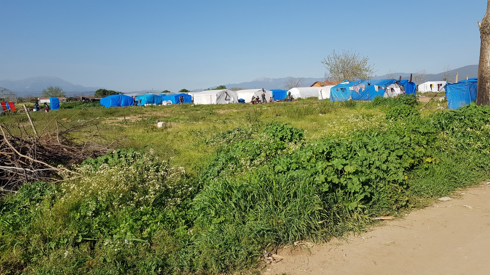

Many field camps are located far from the villages\.

If you are living in the fields in Turkey, you are left to yourself — or the camp community around you\. It can happen that no one comes to see you for months and you rarely have the chance to go into more socialized areas away from the olive trees and fields that surround your tents\.

The village closest to one of the sites is a few kilometers away on dirt tracks, and if you walk over the field in the opposite direction you will find only a country road\. Maybe, from time to time, a mobile shop will stop at the side of the country road and sell you overpriced items\. After it rains, the dirt roads are inaccessible by car\.

What sounds like the scene of a slum in a third world country is still reality for thousands of people in the province of Izmir\. With the third biggest city in the country, bearing the same name, the province of Izmir is also [one of the wealthiest](http://www.izto.org.tr/en/izmir-ekonomisi) in Turkey\. With a population of more than 135,000 displaced Syrians, the province with its four million citizens belongs to the top ten provinces to host Syrians in the country\.

_>Read also the first report from Turkey:_

Of course, some of them are able to afford a flat and have found better work\. But many, including some of the poorest and most vulnerable groups, are living in these field camps\. The camps are neither official nor completely makeshift, as the landowners take rent\. Often they are located near poor Turkish districts or villages\. Officials tolerate them because there is not enough space to accommodate all the people elsewhere\. They just do not want to have too much attention focused on them\.

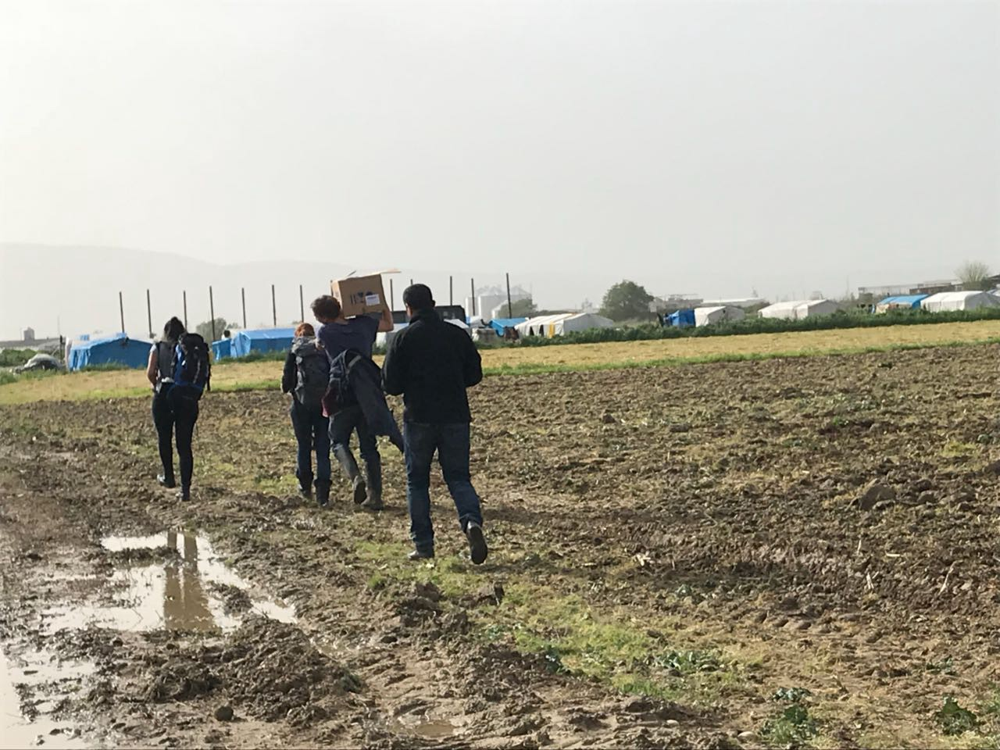

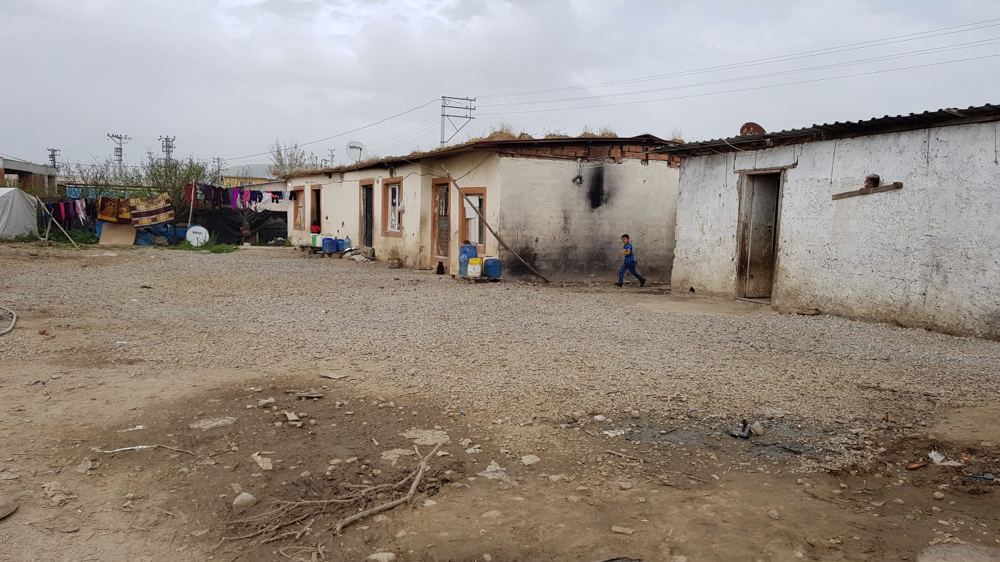

On the right: One of the solid shelters\. Inside, they look as poor as the tents\.

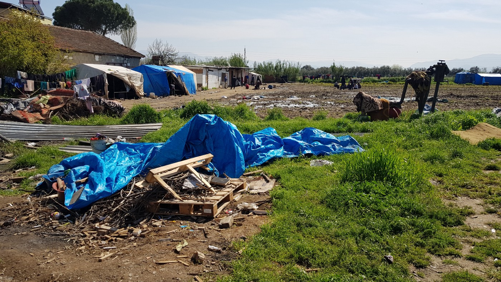

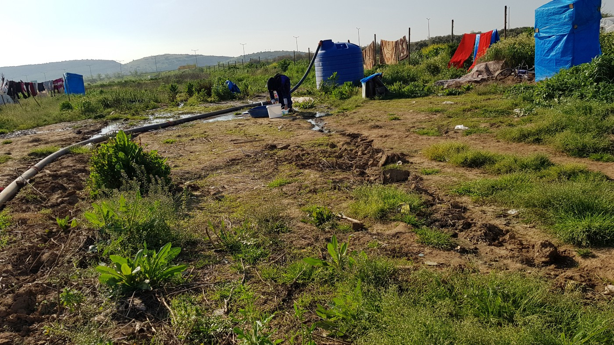

While there are scholarships and support programmes run by international and local NGOs, people living in the fields are abandoned\. Whether they are women or men\. Children or adult\. Vulnerable or not\. To clarify: they are registered, they have their Kimlik \(residence permit\) \. They are not hiding, they are trying to survive\. Some of them have been living like this for years — even though they escaped the bombings and violence in their home country\.

They share a tent with up to ten people because the rent of up to 90 Euros a month, which they pay the landlord, is not affordable for them alone\. Especially since the daily pay for working in the very same fields dropped down to one to four Euro\.

Three months ago, the last time the German Refugees Foundation together with an AYS volunteer went to the province of Izmir, the pay for this work was around ten Euro a day\. In some camps, the last visit of the team was the last the community had had until the team came back at the end of March\.

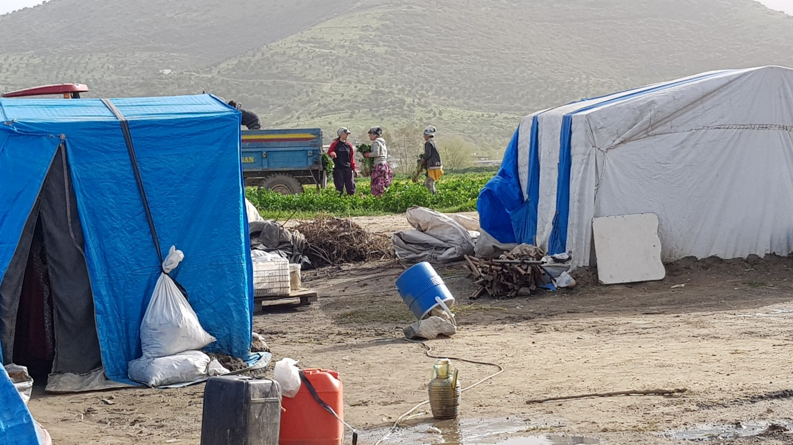

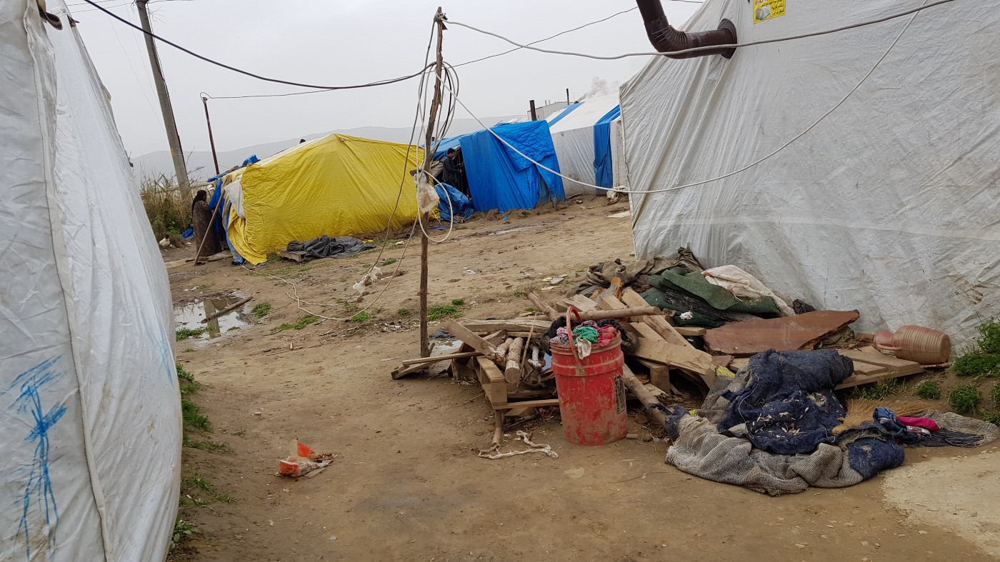

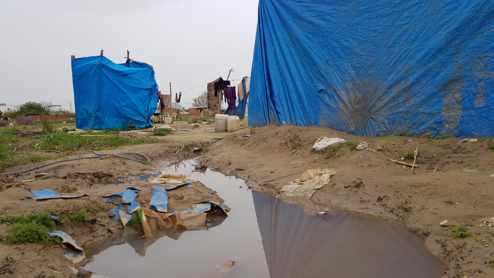

Left: People working in the field, middle: Electric cables, right: A dug channel for the water\.

Not all the camps visited had running water, and the lucky ones were provided with one water pipe\. To have drier floors, people have dug channels\. This also enables them to clean their tents and to take care of personal hygiene\. But at the same time, this creates another problem which will cause further problems, especially when the temperatures rise in the summer: the channels with dirty water are open, children jump into them, bugs will gather there\. Infections are easy to get there\. Most of these makeshift camps are already struggling with lice, some with scabies\.

In these permanently dire conditions, even normal virus infections can cause serious problems\. People do not have a safe, stable and clean environment where they can be cured\.

Additionally, some cannot afford to be sick and take a day off from work \(if they can have work\) \. In the worst case, no money means no food\. Lack of money makes it harder to have regular meals and feed all family members appropriately\. Mothers have problems with breastfeeding their babies and many children face malnutrition\.

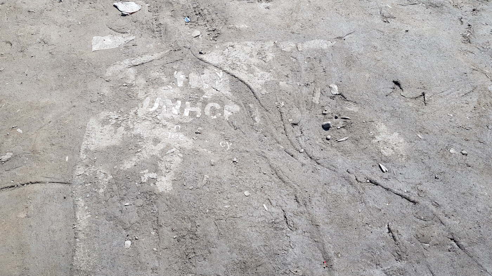

Hints of the big NGOs in the province of Izmir\.

The seclusion and lack of support cause more than just malnutrition and disease\. The volunteers found — again — several medical emergencies that needed immediate help\. In three cases they paid for operations in a private clinic\. One 12–14 year old girl was in danger of suffocating on her big tonsils, which needed to be excised\. She was released very early, after just one night in hospital\. Two babies suffered from penis problems, one of them because the “circumcisior” \(if he really was one\) did a terrible job while doing the circumcision in the camp\. It should also be noted how important this was to the families\. The day they went to the hospital, the wore their best, all clean clothes, and appeared in the nicest way they could\. A scene that can not always be seen in the camps amid all the mud and dirt\.

Even though everything was legal, the volunteer team faced trouble with the local authorities\. During the operations of two of the people, civilian police came to the hospital and harrassed the parents, who were waiting for their children, as well as the volunteers\.

They checked the Kimliks of the parents and checked their phones\. Thanks to helpful doctors, everyone calmed down and nothing more happened\. Also, before entering the country, one of the volunteers was checked by a police officer\. He took a photo of the passport and sent it via WhatsApp to someone\. In the same chat the volunteer had to give his private phone number\. “For a query,” the officer explained, before he said there was no problem and the volunteer could go to the regular passport control\. These intimidations are one of the reasons why the international response in Turkey has fallen off after the failed coup attempt\.

However, back to the health situation\. While in these three cases help was possible and the Refugees Foundation is now on two more cases, for some help comes too late\. For a child of around seven years with a hydrocephalus it is almost impossible to get medical treatment, as such disabilities need to be treated immediately after birth\. A blind\-deaf baby found by the team on their last mission could not be found this time\. It is not clear whether it has died or whether the parents have left the camp\. As mentioned in a [previous report](ays-special-turkey-the-only-hope-is-to-return-one-day-1df83003a89b) , most of these people struggle to get regular medical treatment in public facilities, altough it is provided for by law\. It is hard for them to get there, they are sent away if it is not a case of life or death, they struggle with the language barrier \(only some have learned Turkish so far\) or get insufficent treatment\.

Another aspect is the education of the children\. Only a few can attend regular classes due to high restrictions\. Some camps have managed to create their own schools with the support of international volunteers to educate children in Arabic\. The rest of the children are left on their own in their community and have almost no contacts with locals\. Especially if their camp is far from the next village\. This means they play with each other or the mud\. As soon as they are old enough, which here means maybe eleven, twelve years old, they start to work in the fields\. There are hardly any toys available for them\. This became obvious when the volunteers distributed toy cars, ponies and marbles\. Just the fact that they had a selection overstrained most of the children\.

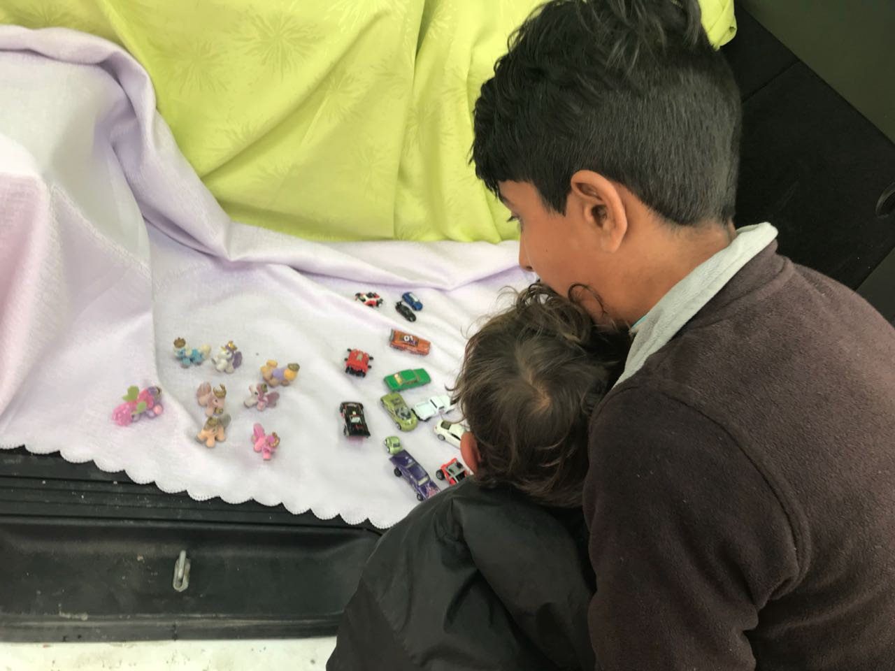

Many children were overwhelmed by the selection of the toys\.

If you look inside the tents, you mostly see carpets on the floor so people have something over the bare ground\. Most of the tents have an oven and a fridge, both provided once by international NGOs\. With an unstable electricity supply, the fridge is used as storage rather than a real fridge\. Still, it can help to store food and protect it from bugs, especially in summer\. Occasionaly there are other items in the tents as well, such as a TV set\.

>Read our researches, what the EU funded NGOs do in Izmir:

In order to support the people, the Refugees Foundation distributed 2800 liters of sunflower oil in the camps\. A five liter bottle lasts a family or community of up to eight people for some weeks\. But the 25 Lira \(~5 Euro\) are a lot for them\. Additionally, they provided medical aid together with a doctor\.

This time the volunteer team experienced that people do not always stay in the same camp all the time but move around, going wherever they find work\. Some have gone to other provinces, where the weather is already better and more field workers are needed, or have just moved elsewhere within the province\. Because the authorities do not want the camps to become too big, they sometimes force people to leave\. This has caused more smaller camps to spring up in the region now\. Some people even lose their residence permit for the province and are being re\-distributed to another one\.

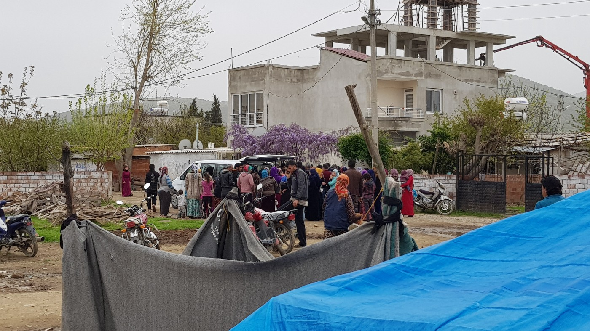

The crowd during an oil distribution\.

All in all, the situation leaves people in a permanent limbo\. They have lost their homes and are now in a country where they do not want to be and that does not really want to host but tolerates them\. Like a pact of silence and coexistence\. They are not welcome, but as long as they stay calm they are not threatened\. Being nobody\. Invisible\. A cheap worker\.

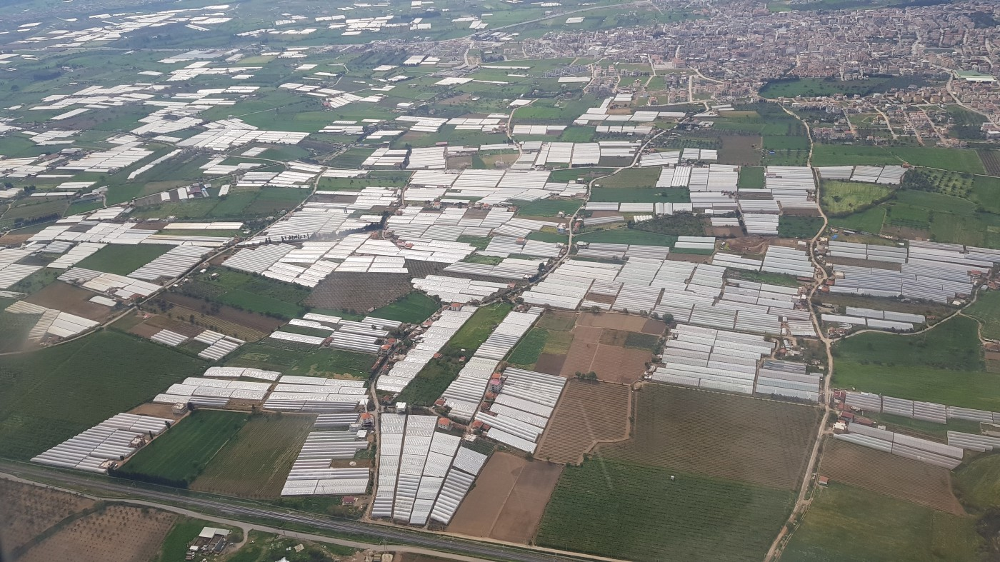

Air view: Agriculture is one of the biggest economy sectors in the province of Izmir\.

They have not found a new home\. Rather a temporarily solution\. It seems that somehow both sides, these people and Turkey, accept this\. Turkey will not become their new home, and most of them intend to return to Syria one day\. Until then, they have to put up with life in tents, in mud, in the fields\. Sometimes far from any society\. What they will find when they return to what they call home now, will be another story\.

**Written by an AYS volunteer in cooperation with the [Refugees Foundation](https://www.facebook.com/RefugeesFoundationSfRotR/)**

> **We strive to echo correct news from the ground through collaboration and fairness\.** 

> **Every effort has been made to credit organizations and individuals with regard to the supply of information, video, and photo material \(in cases where the source wanted to be accredited\) \. Please notify us regarding corrections\.** 

> **If there’s anything you want to share or comment, contact us through Facebook or write to: areyousyrious@gmail\.com** 

_Converted [Medium Post](https://medium.com/are-you-syrious/ays-special-from-turkey-abandoned-in-the-fields-654d3f925141) by [ZMediumToMarkdown](https://github.com/ZhgChgLi/ZMediumToMarkdown)._
