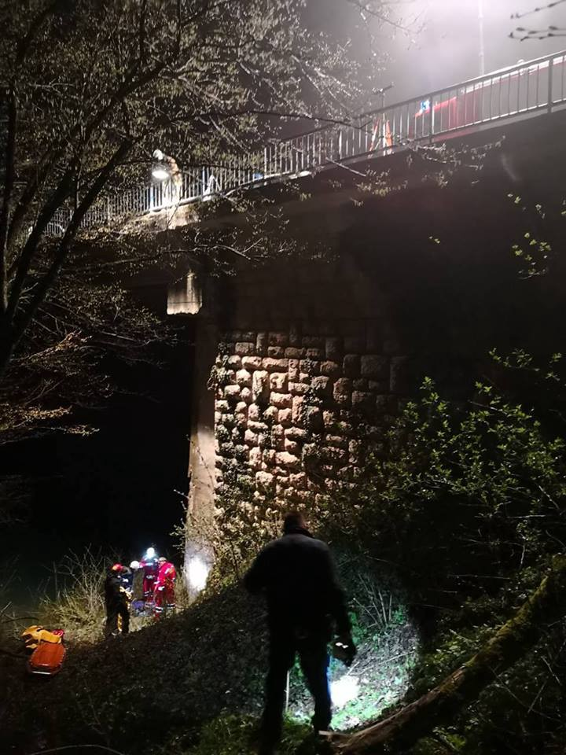

### AYS Daily Digest 10/4/18: Another riot in Moria
#### New fights erupt, as the Lesvos hotspot gets more and more overcrowded / Trial of the Moria 35 begins soon / Aftermaths of a xenophobic attack in Serbia / Three people rescued in a river in Croatia / Bad conditions for vulnerable groups in Dutch reception centres / New deportations from Denmark

](assets/bd5622988e5d/1*Sqj8x3lTVmfDUikUP3BxDw.jpeg)

The situation on the Greek islands gets more tense\. Credits: [NoBorders/Arash Hampay](https://www.facebook.com/nobordersnetwork/photos/a.660787423989153.1073741828.657905327610696/1713093958758489/?type=3&theater)
### Riot in Moria

Another fight broke out in the hotspot of Moria, Lesvos, among the camp residents on Monday, [Lesvosnet](https://www.facebook.com/groups/1652972374920129/permalink/1983598251857538/) and independent volunteers confirmed\. The riot resulted in the destruction of the camp’s medical centre near the northern gate of the area, when some entered it to protect themselves and others attacked them\.

It should be noted that the situation due to the increasing flows in the camp is explosive since in it there are about 6,300 residents in an infrastructure for 3,000 people\.

A total of 607 people arrived on the islands of the Northern Aegean and were registered at the reception and identification centers during the \(Greek\) Easter days\. Specifically from the morning of the holy Thursday to today in the morning, 418 disembarked on Lesvos, 69 on Chios and 120 on Samos\. In total, 1173 people, 630 on Lesvos, 281 on Chios and 262 on Samos, arrived on the islands between 1st April and this morning\.

### Syria

The Women and Health Alliance [reports](https://www.facebook.com/wahainternational/posts/10155582911892153?hc_location=ufi) , that their psychiatric team supported the arrival of 13 buses with a total of 650 displaced people from Eastern Ghouta at the evacuation point in Azaz\. They assisted in cases of depression, anxiety, and Post\-Traumatic Stress Disorder\.

### Greece
#### Solidarity with the Moria 35

](assets/bd5622988e5d/1*0LaGpI7-n4D_gZyTJaDFWg.jpeg)

Credits: [Lesvos Solidarity — Pikpa](https://www.facebook.com/pikpalesvos/photos/pcb.2066728616935892/2066727736935980/?type=3&theater)

Lesvos Solidarity [raises awareness](https://www.facebook.com/pikpalesvos/posts/2066728616935892) , that in ten days, on 20th April, the trial of the so called Moria 35 will start\. “On 18 July 2017, 35 people were arbitrarily arrested during a violent police raid in the “African Section” of Moria camp after a peaceful protest”, the volunteers remember\. Still, the policed crashed it using tear gas and arrested 35 people, who were not involved in the following clashed\. They highlight: “There seems to be no individual evidence against them\. They now risk up to 10 years in prison and could be excluded from the right to international protection\. There is evidence of police violence during the arrests, and in the police station\.”

Four of the defendants receive assistance from Lesvos Solidarity, including the payment of lawyers and court fees\. To support them, you can donate on this [fundraiser](https://lesvossolidarity.org/en/donate-en/financial-donations) \. There are also several possibilities to show solidarity by taking action\. Read the following [guide](https://freethemoria35.wordpress.com/campaign-material-and-reports/) to check, how you can contribute\.

Dental health care is a tough topic, especially in dire conditions like in Moria or other hotspots\. No wonder, that the Health\-Point Foundation experiences busy days at the moment\.

But luckily, there is not only pain, frustration and discrimination on the islands — mostly thanks to volunteer efforts\. The Flying Seagull Project [came](https://www.facebook.com/samosvolunteers/posts/958527444325416) a second time to Samos to entertain the children and draw some smiles in their faces\.

](assets/bd5622988e5d/1*lyk9NyVSuTmVVu-Padyvsw.jpeg)

Entertainment for the kids on Samos\. Credits: [Samos Volunteers](https://www.facebook.com/samosvolunteers/photos/pcb.958527444325416/958534424324718/?type=3&theater)

The asylum system in Greece \(and any other country, to be fair\) can be complicated and nerve\-racking\. Hence, the Mobile Info Team [reminds](https://www.facebook.com/mobileinfoteam/posts/2152995044929213:0?hc_location=ufi) , that they established a hotline to answer quastions about seeking asylum, family reunions or whatever information is needed\. The team is available from Monday to Friday between 10\.30 and 12\.30 by phone or WhatsApp\. The number is \+30 695 538 8283, contact can be either made in Arabic or English on both ways\. For Farsi and Urdu they ask to only send written messages as they only have access to remote translators\.
### Serbia

Escuela Con Alma reports, that in the end of March a xenophobic attack on a group of refugees in Northers Serbia\. No one was injured during this attack, but it was the distribution point of the volunteers, which is now unusable\. In the following post, they show the results of the burned out building\.

Volunteers of the [Refugees Foundation Serbia](https://www.facebook.com/izbegliceusrbiji/posts/2125423214135311) used the last day of the spring holydays, to hike in the mountains with residents of a camp close to Belgrade: “For one day they were able to forget their worries, and that they live in the camp for far too long now\. Spending day in nature, hiking, volleyball, card games, and eating on the grass field brought smiles to the faces of our friends and warmth to our heart\.”

](assets/bd5622988e5d/1*kyMijsN7tc0YZqhwBdmlVw.jpeg)

Forgetting the everyday worries in the nature\. Credits: [Refugees Foundation Serbia](https://www.facebook.com/izbegliceusrbiji/)
### Croatia

Three refugees got serously injured when jumping in the river Mrežnica near Generalski stol on Monday\. According to [Vecernji](https://www.vecernji.hr/vijesti/trojica-migranata-skocili-s-mosta-i-tesko-se-ozlijedili-1238152) , they were probably running away from police officers\. The three people were hospitalized in Karlovac and Ogulin\. One of them was in life danger, the two others have serious injuries as well\. The police said, it will give a report about the incident today\.

](assets/bd5622988e5d/1*onSkY96Tee2LJvQrb60v0A.jpeg)

HGSS Karlovac rescued the three people\. Credits: [HGSS Karlovac](https://www.facebook.com/HrvatskaGSSKarlovac/posts/1852188461740769)
### Austria

[It was feared for days](ays-daily-digest-9-4-18-individuals-and-communities-abandoned-and-deceived-by-the-system-2c9ad7af1f2b) , now it became reality\. Yesterday night, the next flight with deportees to Afghanistan departed from Sweden with six men\. On a stop in Vienna, the Titan Airways machine took another 19 people on board\. Overall, 25 people were forced to go back to Kabul\.

Volunteers in Austria are [invited](https://www.facebook.com/RefugeesSpielfeld/photos/pcb.2017401288520350/2017400638520415/?type=3&theater) to a conference next Saturday and Sunday to a conference in Marktgemeinde Wildon\. Together they want to exchange experiences and discuss solutions for refugees living in Austria\.
### France

L’Auberge des Migrants faces logistic problems as two of their vans broke and another already had collapsed\. To buy a new van for their distributions, transfers and logistic operations, they are now calling for 15,000 Euro\. A donor already promised them 10,000 Euro, so they need additional 5,000 Euro funding\. So far, only 380 Euro have been raised\. If you want to contribute, check their [fundraiser](https://www.helloasso.com/associations/l-auberge-des-migrants/collectes/recherche-de-fonds-pour-les-vehicules-de-l-auberge) \.

](assets/bd5622988e5d/1*te3xgqkIIxhY-yCv0FgjYA.jpeg)

L’Auberge des Migrants needs a new van\. Credits: [L’Auberge des Migrants](https://www.facebook.com/AubergeMigrants/)

The Refugee Women’s Centre in Dunkirk did their regular distribution today in the \(new\) jungle “packed full of hygeine products, an array of coloured and beautifully patterned jeans and soft, silky headscarfs”\. Additionally, they did manicures for some ladies and sat down to eat together\.

### The Netherlands
#### Bad conditions for children with illnesses or disabilities in AZC’s \(asylum seeker centres\)

Asylum seekers’ children with serious illnesses or disabilities are seriously affected by the living conditions in asylum seekers’ centres according to health professionals, doctors and trusted persons/counsellors\.

RTL Nieuws [has researched](https://www.rtlnieuws.nl/nederland/slechte-omstandigheden-in-azc-voor-kinderen-met-ziekte-of-handicap) two harrowing cases in Amersfoort: One about 6 year old Zuzu suffering from down syndrome and 15 year old Qiyas suffering from epilepsy\. Both boys live in AZC’s which are not appropiate to treat their conditions\. According to Defense for Children, these are not incidents because dozens of sick and disabled children are living in these conditions in AZC’s\. The organization has seen an increase of similar cases from 40 in 2016 to 57 in 2017 and has started an investigation\.

However the AZC in Amersfoort is not the only place where sick and disabled asylum seekers children have to live in inadequate conditions, it happens everywhere in the Netherlands\. The situation sometimes gets so bad, that children are transferred to the hospital immediately\.
### Denmark

New deportations took also place from Denmark, activistis demonstrated at the airport to prevent it\. So far, there are no further information available\. We will give updates, as soon as we have access to\. If you have them, please get in touch with us\.

> **_We strive to echo correct news from the ground through collaboration and fairness\._** 

> **_Every effort has been made to credit organizations and individuals with regard to the supply of information, video, and photo material \(in cases where the source wanted to be accredited\) \. Please notify us regarding corrections\._** 

> **_If there’s anything you want to share or comment, contact us through Facebook or write to: areyousyrious@gmail\.com_** 

_Converted [Medium Post](https://medium.com/are-you-syrious/ays-daily-digest-10-4-18-another-riot-in-moria-bd5622988e5d) by [ZMediumToMarkdown](https://github.com/ZhgChgLi/ZMediumToMarkdown)._
