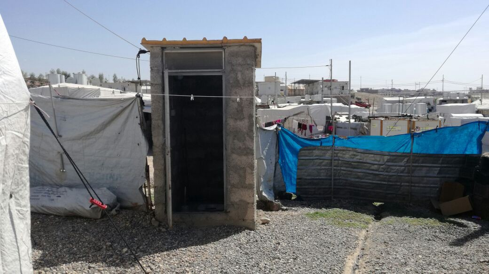
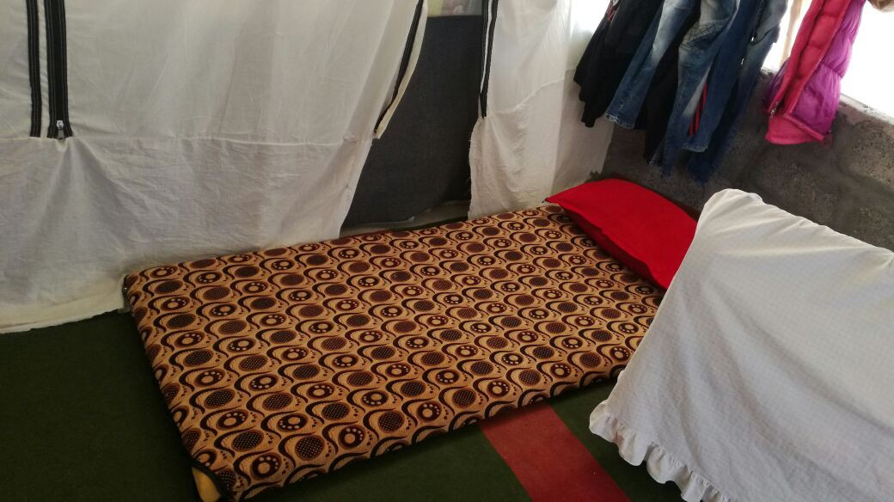

### AYS SPECIAL: Escaping Sinjar and living in refugee camp in Iraqi Kurdistan

_AYS friend Michael K\. from the Oasis Rhodes solidarity group, visited Khanke camp in Iraqi Kurdistan and brings his impressions and the story of “Jack”, a men who survived genocide in Sinjar_

Khanke camp is one of the 27 camps organized by BRHA \(Board of Relief and Humanitarian Affairs\) in Iraqi Kurdistan since 2011\. The camp was established in mid\-August 2014 for internally displaced persons \(IDPs\) fleeing conflict in Sinjar district, Ninevah Governorate of Iraq\. The first 153 families moved in on 28 August 2014\. Now it is a home for almost 3,000 families \(about 16,500 people\) \.

We visited Khanke in April 6, 2018 and talked with many refugees, mostly of Kurdish and Yezidi origin, including Jack, a young Yezidi man from Sinjar\.

Among people we met, we could feel unrest and fear about the future\. Most of the them have been living here for three years, and there is no hope there will be any change in their life any time soon\. The water quality is bad, there is a food shortage and there are no jobs for people to even try to start a life\. Education opportunities are few, and only for very small children\.

Recently, BRHA announced that they will be ready to accept another wave of displaced Yezidis from Sinjar, being afraid that Turkey could attack that area soon\. The camp will be placed in Bardarash district and will host 3000 families\.

> What is BRHA? It is a governmental organization based in Duhok, which runs all the camps in the area, in direct coordination with the governorate\. By the law, five percent of all NGOs and INGOs budget, goes to it every month\. This is actually a compulsory process, and any action without BRHA acknowledgement is illegal\. 

**_\(by Michael K\. , the Oasis Rhodes solidarity group\)_**
### Story of Jack

I would like to share with you, what has happened to me and my family and how we escaped from ISIS\.

**How we escaped from ISIS\!**

We left our home at 7:30 AM on Sunday in 3/ AUGUST/ 2014\.

We left our home when ISIS attacked us, and we went on foot, heading to the mountain\. We walked about 2 hours until we had reached there\. My grandmother was 94 years old; her leg was broken, and she could not keep walking with us in the mountain\. We carried her on our backs until we reached the mountain; when we reached it, we could not carry her any more on the mountain The group left her at the bottom of the mountain, while me and my cousin stayed with her, giving what we still had of water until ISIS had reached there\. We then had to run and hide ourselves behind a big stone, not to be seen by ISIS or they would kill us also\. Believe me, we were watching her behind the stone when she was shot\. After that, we ran away, and our eyes were full of tears and crying because no one was offering us any helping hand\.

My Grandmother, one of the ISIS victims in Sinjar August / 2014\- Was shot by ISIS while we were forced to witness her death behind a big rock\.

**The second day on the mountain**

Everybody was tired; the kids were hungry and crying; there was no food and water to give them, that’s why they were crying\. We were 23 people: my family was twelve members, and my father was working in SULAIMANIYAH; my cousin’s family six members, and he was in Germany; and my uncle’s family was seven members, and he was also unable to walk because he was sick and old — he was 68 years old\. Me and one of my cousins were the oldest among all, I was 22 and he, 17; the rest all were under 15\. Only me and my cousin were going to bring them some water from the bottom of the mountain, which was dirty to drink\. It was very dangerous to come down from the mountain, but if we did not, everyone would die\.

**Third day on the mountain**

We went to the other side of the mountain looking for food and water to survive, but there ISIS was shelling us with mortars; my brother and uncle got injured\. We carried them and again we went to the top of the mountain, they were bleeding as the other little kids and women were crying from fear\.

**Fourth day on the mountain**

Some people have passed by our sides and helped our injured people, gave them and the children some dry thick bread and some of the water they had\. They helped bandage their wounds with some clothes\! If these people had not, the injured would have died\.

**Fifth day on the mountain**

As we were walking along the top of the mountain, looking for where to find water suddenly my uncle fell down and could not walk anymore because of thirst and hunger\. So me and my cousin carried him to the bottom of the mountain to give him some water\. We had left the rest of the family at the top of the mountain, and we told them “don’t move while we got get some water\.” We went down the mountain carrying my uncle on our backs; we were walking about three hours until we have seen some water which was dirty to drink, but after three hours, we thought our families were waiting for us, so I told my cousin to stay with his father while I would go to take a look for the others and bring them some water\. When I arrived there, I did not see any one of them\. I came again down the mountain walking to my cousin and uncle, we spent our night waiting for them, but we did see any one of them\!

**Sixth day on the mountain**

As we woke up in the morning, but believe me we did not sleep much at all that night waiting for them; we were separated from them three days, and we were looking for them but without any success\. We thought everybody died up in the mountains\. I could not stop myself from crying three days looking for them and I could not sleep all that time as I was looking for them\. I was barefoot, hungry and thirsty\.

**Eighth day in the mountain**

When we have reached to the SHARFADEEN area, which is a sacred place for Yazidi people, we were thinking every one of the family had died because of the hunger and thirst\. But suddenly, once when I opened my eyes and raised my head, I could seen them from far away, but I couldn’t believe that it was my family\. I started crying, and ran to them and hugged them\. And then we all walked together, going on bare feet to the Syrian border which took about 5 hours for us to reach , from there we rode on trucks, and by trucks we came to Kurdistan…

**Our life in camps**

We are living in Khanke camp which is near to Dohuk city, but the situation is worse than bad\. There is no humanitarian assistance; believe me, no one is helping us, neither the organizations\. I don’t ever believe in them\. I hope that if you could visit our camps once and visit us here in Iraq, to see the situations of our innocent people\.

We are 14 people living in two tents which are not fit for 4 people\. They are treating us as strangers and not human beings\. The government of this country is too bad, and both the governments of Kurdistan and Iraq, each one of them is worse than the other\. There are no job opportunities for us because we are not Muslims and the government issaying you are citizens of the third rank in Iraq because you are a minority\. I am unemployed even though I am speaking four languages; I have held a degree in petroleum for almost three years; you see that we are above the sea of the oil, and I am unemployed\.

We really can’t live here in Iraq anymore\. We are homeless since 3/Aug/2014, As ISIS and other involved political and armed parties destroyed everything in Sinjar and nothing is left to return to\. Now more than a political party controls over the area \(Sinjar\) which has been a scared area for Yezidi people\. Our only choice is to find away and get rid of this hellfire and nightmare in camps under insane situations\.

It has been almost six months since Hashed Alsha’aby and other armed parties retook Sinjar from Peshmerga forces, and now the people are getting food rarely in Sinjar and are suffering from a shortage of Medication and accommodation\. The sick people have to go to Tela’afar and Mosul city for treatment and medications due to the unavailability of medications in hospitals in Sinjar\. There is also an unavailability of education centers for children\.

Sinjar is the only place without services, the most destroyed area in the entirety of Iraq and most persecuted people are its people\. Iraqi government started to rebuild other Iraqi destroyed areas and left Sinjar behind without any help and all the roads going there are blocked\. Continual horrific assaults are going against these indigenous peoples\.

**_\(By Jack, 25 years\. Last Address: Sinjar \( Shingal\) Current Address: Khanke Camp\)_**

> **We strive to echo correct news from the ground through collaboration and fairness\.** 

> **Every effort has been made to credit organizations and individuals with regard to the supply of information, video, and photo material \(in cases where the source wanted to be accredited\) \. Please notify us regarding corrections\.** 

> **If there’s anything you want to share or comment, contact us through Facebook or write to: areyousyrious@gmail\.com** 

_Converted [Medium Post](https://medium.com/are-you-syrious/ays-special-escaping-sinjar-and-living-in-refugee-camp-in-iraqi-kurdistan-35018918c0f3) by [ZMediumToMarkdown](https://github.com/ZhgChgLi/ZMediumToMarkdown)._
