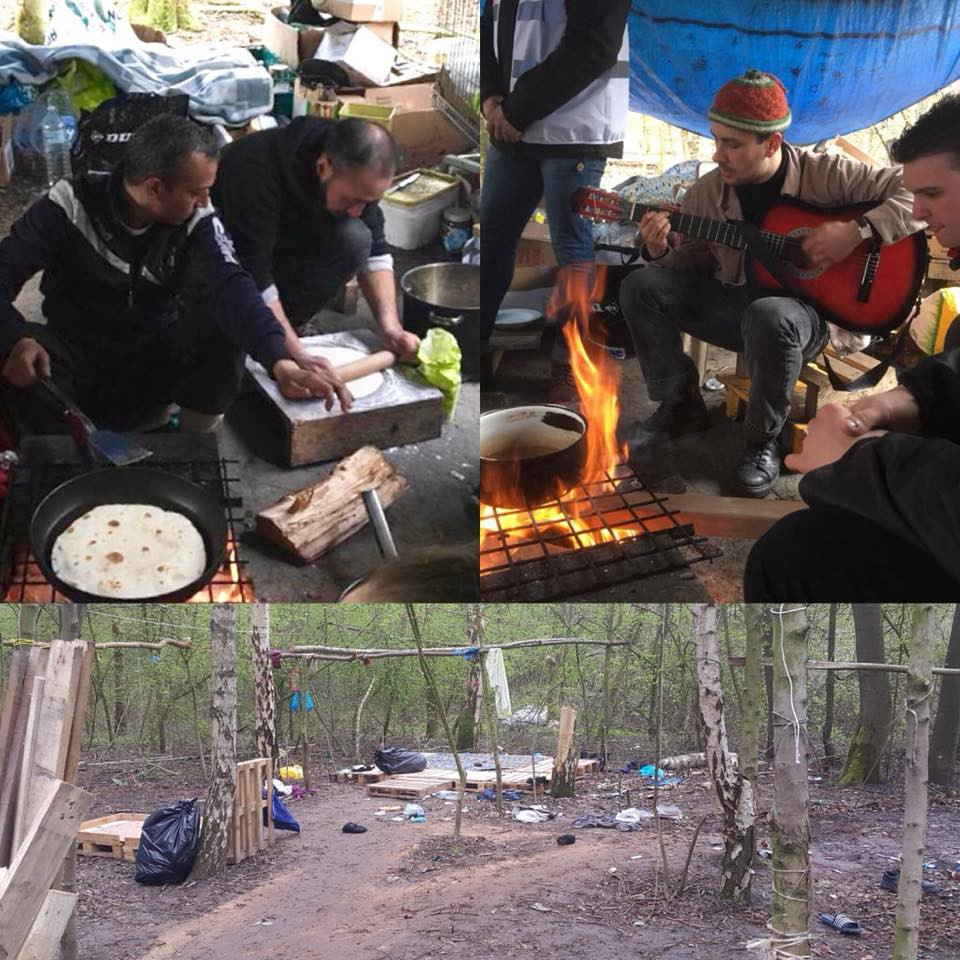

### AYS Daily Digest 12/04/18: Mismanagement as justification for cruelty — the European way

_Reflections and actions in France / New arrivals in Greece and important information / Madina Husseny’s family sees their request to asylum REJECTED by Croatian authorities / At least three have drowned in Slovenian\-Croatian river / Lampedusa centre effectively not closed / Horrific violation and betrayal of Afghan woman deported from Norway / And more news…_

Photo by BAAM
### FEATURE: How the fires of Dunkirk have not burned out

In a heartfelt message, a long\-term volunteer in the Grande\-Synthe refugee camp near Dunkirk reflects upon the complicated situation and events that precipitated the horrific fires in the camp, [effectively destroyed it last year](https://medium.com/thedigitalwarehouse/why-are-not-talking-about-dunkirk-e4e1cd8999f8) \. The volunteer highlights that the area had been comparatively less brutal than, for example, the repeated targeting and evictions at Calais \(the brutality of which still continues to today\) \. Due both to mismanagement and a campaign to maintain an aura of calm and the idea that the government welcomes refugees, however, neglect reigned\. Corruption followed\.

This neglect only contributed to strengthening illicit support structures, feeding the power of infiltrating criminal gangs\. Eventually, these power games resulted in the destruction of the camp and 1,500 people being left to the cold\. Today, around 400 people remain—still with desperately inadequate services\.

Indeed, it seems the Grande\-Synthe camp—which held some promise—has been cruelly leveraged into a justification for the efficacy and necessity of repression and violence against refugees elsewhere\. In another report of cruelty against a peaceful community in France, we see the fingerprints of oppression:

> “I received distressed phone calls from several sources telling me what had happened\. The police arrived early to woodlands in Dunkirk where they woke up a large number of Pakistani refugees and made them leave their tents, allowing them to grab only a few emergency things, and proceeded to destroy everything left\. 
 

>  
 

>  These men had nothing, yet had managed to build a little community hidden in woodland that they were able to call home for the last two months\. They had a communal cooking area, with a fire where they made parathas and dishes from their homeland\. They had areas for storing food, washing and drying clothes\. They had a toilet tent and even a prayer area\. 

Photo by Care 4 Calais

> They invited us to join them last week and we shared dinner sat around the fire, with our hosts happy to be with friends and distract themselves from their harsh existence\.
 

>  
 

>  Sadly no more\. Their home has been entirely flattened, the few personal belongings destroyed\. My friend cried as he told me the photos of his family, which he carried with him on his terrible journey, were now gone\.” 

The author then points out that this is nothing new in France\. Indeed, these calls of distress are a regular occurrence\. The attitude projected by “European values” is that if people would just wish to work in peace and, indeed, be collaborative, that everything would be fine\. Yet, the system does all it can to block people out, starve them, freeze them, wake them in the night, and then demonize them for not wishing to collaborate\. If this is not sick and sadistic gaslighting, then what is?

We can only help those we meet along the way\. For all who are available, please consider going to a protest against the newly introduced French asylum bill this upcoming Sunday, April 15th\!

The recently introduced asylum bill would:

> Introduce fines of €3,750 \($4,620\) or a 1\-year jail term for people who illegally cross borders within the EU 

> Triple the time asylum\-seekers can be held in detention for 135 days
 

>  Halve the number of times an asylum\-seeker has to appeal if their refugee status is denied 

> Hasten the deportation of those asylum\-seekers deemed to be economic migrants\. 

France is ready to fight, and we must show our solidarity with those who need our support\!
### GREECE
#### New arrivals

The [Aegean Boat Report](https://www.facebook.com/AegeanBoatReport/posts/332063340650110) noted 139 arrivals to Lesvos on April 11th\.

Additionally, [Marianna Karakoulaki](https://twitter.com/Faloulah/status/984406690480230400) notes that 50 people have been registered in Thessaloniki after being left by smugglers near the police station\. They all had crossed the Greek\-Turkey land border\.
#### Preparing for an asylum interview

Advocates Abroad posted a long series of helpful tips for preparing for an asylum interview\. You can read the entire series [here](https://www.facebook.com/advocatesabroad/posts/577407929286279) , [here](https://www.facebook.com/advocatesabroad/posts/577408005952938) , and [here](https://www.facebook.com/advocatesabroad/posts/577409829286089) \.

[The Mobile Info Team for Refugees in Greece](https://www.facebook.com/mobileinfoteam/photos/a.1800063030222418.1073741830.1796286800600041/2154096438152407/?type=3&theater) writes that although Germany has made around 2,800 requests for Greece to take refugees back under the Dublin Regulation, only 90 of these requests have been fulfilled\. Since the beginning of 2017, only five of these requests had been fulfilled\. This push and pull and pointing of fingers is becoming a regular occurrence as some countries refuse to accept their refugee quota from Greece, and others frantically find every case relevant to the Dublin invocation, justifying their return\. All of this push and pull only further destabilizes the chances that the PEOPLE behind the numbers get the opportunity to build roots in their new host community\. The priority of legislation over people only weakens faith in the system, encouraging people to seek other means of finding a new life\.
#### Donations needed on Lesvos

This happy change in the weather does not mean that people do not need support\! Think ahead for summer will soon be upon us all\! As we have seen now for two or more years, summers are spent in more misery as structures continue to erode and tensions continue to escalate\.

The Hamburg Help Convoy posted a needs list for Lesvos where, as we all know, living conditions continue to deteriorate \(as if there were good conditions there before\) \. Go to their page to see the [full needs list](https://www.facebook.com/Hamburger.Hilfskonvois/posts/1779547075400310?hc_location=ufi) and help where you can\!
### BULGARIA

Due to the foreigners act introduced in 2017, a man of Armenian origin \(who has lived in Bulgaria most of his life\) is being detained and faces possible deportation to Armenia\. His mother came to Bulgaria when he was still a small child\. She attempted to secure papers for him, but due to a variety of systemic issues, was unable to secure consistent documentation for him, leaving him without an identity card after he turned 18\. He was stopped at a routine stop around Easter holidays\. There is now an effort to regularlize his immigration status, but there is still a good likelihood that he could be deported to Armenia, where he knows no one\. Additionally, due to the unique circumstances of his arrival in Bulgaria, establishing his identity in Armenia would also pose a problem\. For more on the issue, go [here](http://bnr.bg/horizont/post/100957531/balgarin-ot-armenski-proizhod-e-nastanen-v-busmanci-zashtoto-namal-dokumenti-koito-ot-23-godini-ne-moje-da-izkara) \(in Bulgarian\) \.
### CROATIA

Has the family of Madina Hussiny not yet suffered enough? By now, most are aware of the tragic story of the Hussiny family\. In Late 2017, Madina, a six\-year\-old girl from Afghanistan, was hit and killed by a train after her family was pushed back from Croatia, reportedly having been told to follow train tracks back to Serbia\.

Her death, although widely publicized, remains a contentious question of responsibility, with Croatian officials denying the role of the police in contributing to the circumstances leading to her death\. The Croatian government still regularly denies the practice of systematic pushbacks, in spite of overwhelming evidence to the contrary\. In fact, Madina’s family was pushed back several more times throughout early 2018, finally successfully being allowed to exercise their right to request asylum in the last several weeks\. This access to filing request was begrudgingly bestowed after further dehumanizing treatment such as detention near the Serbian border\. For a brief period, it was unclear whether this right would even be granted at all\.

In the latest sick twist for this family, their asylum request “has not been accepted” on the basis that they have come from a “safe third country\.” Fortunately, there is an appeal being filed and the family is pushing forward in exercising their right to having their application being fairly reviewed \(a process that can often take up to several months\) \. This whole tragic chain of events raises the question: if the Croatian government is completely absolved of all wrongdoing, why are they so ardently intent upon refusing this family to be in their country? Is it, perhaps, rooted in a desire to keep them from testifying about the unlawful treatment experienced at the hands of members of the Croatian authority? Who knows\. The more urgent issue is that the family experiences some kind of legal and humane treatment after the horrors inflicted upon them by a toxic system\.
### SLOVENIA

At least three people have drowned in the river between Slovenia and Croatia this year\. Due to spring flows, the river is very high and locals report that truly, it’s impossible to know how many people have drowned\.

There have been occasional false reports, but it is also difficult to assess as sometimes residents make a statement based on unverifiable “gut hunches” about a person — that they have a beard or look “darker”, meaning they are foreign\. However, many residents are deeply disturbed by the pervasive attitude of apathy\. The full analysis is available [here](https://www.vecer.com/vse-bolj-smrtonosne-notranje-meje-eu-7-mrtvih-ali-pogresanih-tudi-na-slovenski-meji-6444117) \.
### ITALY

Italian officials deny that the Lampedeusa centre will be closed in the aftermath of the fire that affected it in March\. Although it had been announced that the hotspot would be closed, according to sources:

> “The Prefecture has replied to the lawyer, and for knowledge to the Ministry of the Interior, stating that ‘ no change of destination for use of the Lampedusa structure has been made, this office is not entitled to decide on the matter nor has it issued related documentation\.’” The request had been made because, after the announcement of the closure, migrants arrived on the island were still conducted in the centre\. 

For more information, go [here](https://www.facebook.com/252231521632595/photos/a.254305491425198.1073741828.252231521632595/818231405032601/?type=3) \.
### SWEDEN

According to [the EU Observer](https://euobserver.com/tickers/141580) , Sweden claims that there remains a need to regulate and restrict travel flow into Sweden, and therefore will be implementing new temporary border controls towards Denmark and Germany\.
### NORWAY

Abdul Ghafoor writes of a viscerally horrifying incident wherein a woman severely beaten by her husband was “saved” by one of the officers who was assigned to oversee their deportation several days ago—only to be redeported in another incident two days later\.

The entire family is Afghan, but the woman at least grew up in Iran\. Their asylum claim in Norway was rejected after they came in 2015, and, fearing deportation, fled to Germany\. Her husband during this time was showing increasing signs of violence against himself and his family, attempting suicide twice\. After their return to Norway under the Dublin Regulation, she converted to Christianity, which opened her up to severe abuse by her husband who did not approve\.

They were scheduled for deportation on April 8th, however, in a fit of rage, the husband began to beat her badly at the airport once they had arrived in Kabul, in full view of the public, confident no one would intervene\. A police officer from Norway did\. She and her children were taken to Dubai, but it did little to save her as no more than two days later, she was returned to Kabul\. They are kept in separate apartments, but the woman still fears for her life as many people are now aware of her conversion, which opens her up to dire threat\. Her fear is even more intensified as she is completely unfamiliar with Afghanistan, having been raised in Iran\. For the full story \(not for the faint of heart\), go [here](https://kabulblogs.wordpress.com/2018/04/12/afghan-woman-beaten-by-her-husband-at-kabul-airport-rescued-by-the-norwegian-police-deporting-her-only-to-be-re-deported-two-days-later/) \.

**We strive to echo correct news from the ground through collaboration and fairness\.**

**Every effort has been made to credit organizations and individuals with regard to the supply of information, video, and photo material \(in cases where the source wanted to be accredited\) \. Please notify us regarding corrections\.**

**If there’s anything you want to share or comment, contact us through Facebook or write to: areyousyrious@gmail\.com**

_Converted [Medium Post](https://medium.com/are-you-syrious/ays-daily-digest-13-04-2018-mismanagement-as-justification-for-cruelty-the-european-way-754a90a50836) by [ZMediumToMarkdown](https://github.com/ZhgChgLi/ZMediumToMarkdown)._
