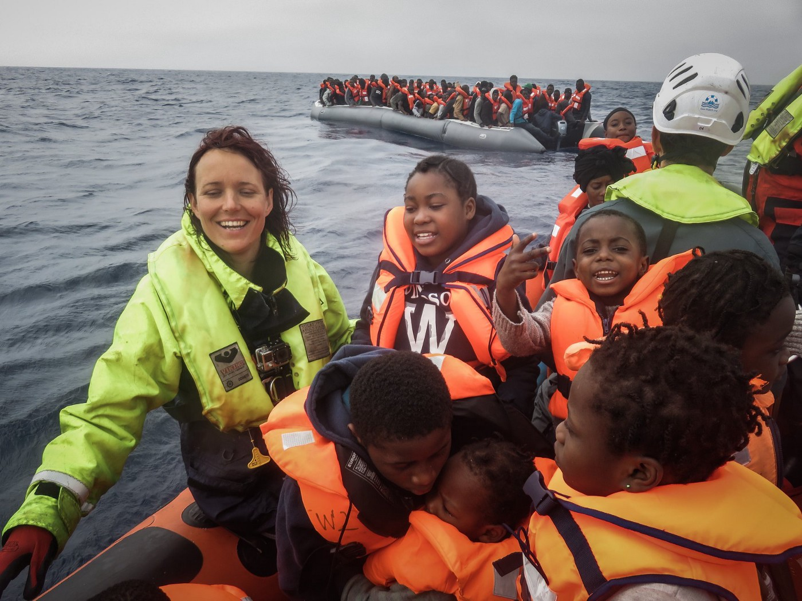

### AYS DAILY DIGEST 13/4/2018: Western hypocrisies over Syria

_The US, UK and France have launched military action in Syria pretending they are concerned for the safety of the people // In 2016, the U\.S\. resettled 15,479 Syrian refugees // in 2017, the country let in 3,024 people from Syria // So far this year, that number is just 11 // 16,847 people have entered Europe by sea so far this year // In the same period of time, 933 people died or disappeared while trying to cross the sea // Solidarity travels to Bosnia // Propaganda tricks by Aleksandar Vučić in Serbia_

 \.](assets/e2f6559ecfa3/1*doY_jrKdxpnFVWzFNTsmrQ.jpeg)

Photo by [The Welcome Tent](https://www.facebook.com/thewelcometent/photos/a.134005983834712.1073741828.103007650267879/243058319596144/?type=3) \.
### Feature

“This is about humanity,” [said US president](https://www.npr.org/sections/parallels/2018/04/12/602022877/the-u-s-has-welcomed-only-11-syrian-refugees-this-year) Donald Trump announcing military action against Syria\. The attack started after a suspected chemical weapons strike by Assad forces, and more than seven years after the beginning of the war in this country and millions of refugees who are humiliated in the worst possible ways while trying to find a safe place to live\.

Many people will be forced to leave their homes again and they will start their journey toward the West\. What they will find are closed borders and inhumane living conditions in refugee camps, and they will often be deprived of basic freedoms and human dignity\.

From what is available so far about the air strikes, the first targets were in Damascus and in Homs\. Apparently, the sites under attack are regarded as linked to the storage or testing of chemical weapons\. French president Emmanuel Macron said the use of chemical weapons by the Syrian regime posed an “immediate danger to the Syrian people and our collective security\.” The British Prime Minister, Theresa May, said she had authorized strikes to “degrade the Syrian regime’s chemical weapons capability and deter their use”\.

Secretary\-General Jens Stoltenberg, the head of NATO, expressed his support for the US\-led attacks saying that they will “reduce the regime’s ability to further attack the people of Syria with chemical weapons”\.

After the strikes were launched, Russia reacted by threatening that “such actions will not be left without consequences”, as Anatoly Antonov, the Russian ambassador to the US, said\. Iran also warned of “regional consequences” following the attacks\.

At the same time, the UN Secretary\-General Antonio Gurres [called](https://www.aljazeera.com/news/2018/04/allies-strike-Syria-chemical-weapons-sites-180414011901735.html) for restraint and for countries to avoid any acts that could escalate the situation in Syria further\.

In the meantime, several hundred refugees and migrants, including many from Syria, have [gathered outside](https://www.apnews.com/69ab7b1d9c994554938a0e4728c9bbd9) a police station in Thessaloniki waiting for hours to be formally arrested in order to gain temporary residence in the European Union country\.

According to recent reports, more people have been arriving this year from Syria to Greece, and the number has increased with the possibility of Western military intervention\. Several thousand Syrians who are already in Greece gathered on Friday outside the U\.S\. Embassy in Athens to protest against strikes in Syria\.

In Syria, the Stop the War coalition has condemned the airstrikes\. A statement released by the group said:

> “We strongly condemn the missile attacks on Syria last night which will have only brought the Syrians more misery and destruction\. They will have done nothing to end the war or alleviate their suffering… The overwhelming majority of people in this country oppose this action just as they have opposed the series of wars of the last seventeen years\.” 

What we have learned so far is that the voices of people are often left unheard\. The masters of war are stronger\.
### EU

Meanwhile, the EU wants us to celebrate when they amend legislation to bring it into line with respect for basic human rights\.

The latest instance is the decision issued by the European Court of Justice saying that refugees who turn 18 during their asylum procedure must still be granted the right to family reunification as though they were minors\.

The decision was issued after the case of a young unaccompanied woman from Eritrea, who had applied for family reunification after being granted asylum in the Netherlands\.

The court also ruled that it is not at the discretion of individual EU member countries to decide on a young refugee’s right to be reunited with his or her family\. Read the decision [here](https://curia.europa.eu/jcms/upload/docs/application/pdf/2018-04/cp180040en.pdf) \.

The Asylum Information Database published the [2017 Dublin Update](https://www.ecre.org/push-for-transfers-at-any-cost-the-dublin-system-in-2017/) , related to the situation in 18 European countries\. The report reveals an increase in transfers in the aftermath of European Union and domestic political commitments to a stricter enforcement of the Dublin system\.

According to this report, Germany has a record high of 64,267 outgoing requests to other countries, followed by France with 41,500 requests, Austria with 10,490 and Greece with 9,784\.

“Most states overwhelmingly rely on the irregular entry criterion and applications previously made by asylum seekers in other countries,” the report concludes\.

Nevertheless, the number of people transferred is much lower: 7,102 for Germany, 4,268 for Greece, 4,201 for Sweden and 3,760 for Austria\. Read more here\.
### Sea

While warlords are raging, the number of people who are forced to take the dangerous journey in order to find refuge is increasing every day\.

Last night, the [Sea\-Watch](https://sea-watch.org/en/donate/) 3 rescued approximately 300 people out of two rubber boats in distress\.

Photo by Sea Watch

IOM, the UN Migration Agency, reports that **16,847 people have come to Europe by sea this year** \. Most of them arrived in Italy and the rest in Spain, Greece, and Cyprus\.

At the same time, **933 people died or disappeared while trying to cross the sea** \. Most recently, 36 people died in the Western Mediterranean\. At the same time, at least two people died while trying to cross from Croatia to Slovenia across the river Kolpa\.

Proactiva Open Arms

“In the sea, there are only lives in danger of death\. They’re not migrants, not numbers, not legal or illegal\. We are guilty of protecting those lives, no matter their colour, their beliefs or their origin\. Guilty of witnessing this immense crime\.”

### \#FreeOpenArms
### Turkey

Turkey continues with its oppressive policy towards refugees from Afghanistan\. According to the official statistics, around 20,000 people from this country have arrived within the last three months, while 17,847 have been captured by security forces\.

But, based on the agreement the two countries have reached, **over 200 people were deported back** , while **between 600 and 700 are expected to be deported this week** \.

In this “safe country”, at least according to some EU governments, a total of 10,453 civilians were killed or injured in 2017\.
### Greece

According to the [Aegean Boat Report](https://www.facebook.com/AegeanBoatReport/posts/332631553926622) , no arrivals were registered last night or this morning\. However, there were people who tried — a total of 219 people — but were apprehended by the TCG\. Three of the boats were headed to Lesvos south with 181 people on board and one was on its way towards Agathonisi carrying 38 people\.

More trouble for volunteers in Greece\. The local registration commission has decided to immediately [inform all NGOs](http://www.lesvosnews.net/articles/news-categories/politiki/10-imeres-prothesmia-se-mko-poy-drastiriopoioyntai-sti-lesvos) who are active in Lesvos, whether they are registered with the Coordinating Committee or not, to submit the following within 10 days:
1. A copy of the approval decision for their activation in Greece, which has been issued to them by the Ministry of Immigration Policy
2. A report detailing the buildings or spaces they use for their activities and any other structure they have created on the island \(with copies of the relevant licenses\) as well as the number of persons housed or operating in the above areas\.

> “What is happening in Greece since 2015 has been characterised as a refugee crisis, and remains so, with us as witnesses on the ground — in view of what the numbers suggest and what our leaders are narrating\. But enough with those statistics\! Just ask yourselves: Would you pay 500–700USD to put yourself or your family in this unworthy piece of junk and cross the sea? This photo is a powerful answer to common claims that asylum seekers are moving for economic reasons, or because they just feel like it\.” 

[Cares of Hope](https://cars-of-hope.org/spenden/) group reports about families that were allowed to leave Lesvos on Friday and to go to Athens, only to be housed in a building without any privacy, where 30–40 persons would share one room, without walls…

The families have protested and are refusing to enter the building\.

We have received a story from the same place from another source, too\.

_“Elefsina’s camp was closed on 26/10/2017 due to the continous problems regarding safety matters, lack of privacy and in general the bad conditions of holding people in a very bad structure\. Yesterday 13/04/2018, 203 people, mostly fron Vial Chios and Moria Lesvos, arived in 4 buses\. They were promised apartments but this turned out to be lies\. So they protested by closing the road in front of the camp, demanding to be transferred somewhere with dignity\. [After 6–7](https://www.facebook.com/areyousyrious/messages/?threadid=730491719&timestamp=1523698069695#) hours most of them decided to go in and registered\. A few of them remain outside, still demanding to move to a better place and probably they’ve spent the night outside in the cold\. Among the people who entered the camp are over 70 children and many single\-parent families headed by women\. Practically, for the next few weeks they will have just a doctor and food provision from catering companies \[the camp due to its structure cannot hold cooking places, which means that most of the people might have to cook illegally inside their rooms as the previous residents had to do in the past in order not to accept the bad catering food\] \.”_

Al Khair Hellas announced the beginning of the Greek Language Classes for Adults that will be taking place on the premises of Hestia Hellas \(Charilaou Trikoupi 5, Athens — Metro Station: Panepistimio\)

Our goal is to fulfil the Basic Level of Greek Language in three months\. The classes will be held in the morning, 10:00–12:00 and is a be prerequisite for the National Language Certificate\. Those interested can apply by email: [christina\.kousouni@alkhair\.org](mailto:christina.kousouni@alkhair.org) ”

Medical volunteers needed in May and June in [Moria camp](https://www.facebook.com/stichtingbootvluchteling/posts/1957613731235331) \.
### Bosnia

Since February this year, with the increase in the number of people coming to Bosnia and Herzegovina, a small group of local and international volunteers, with help from the local charity [pomozi\.ba](http://pomozi.ba) , have been working in the field\.

Part of the team [Souls of Sarajevo](https://www.facebook.com/soulsofsarajevo/) , which includes some AYS volunteers, visited the Bihać and Velika Kladuša areas in north Bosnia, close to the border with Croatia\.

In Bihać, over 100 refugees are living in the town, in rented apartments or hostels\. Some people had been sleeping in the mosques, but recently the police kicked everyone out\. Nevertheless, help is needed: food, clothes, medical supplies… Locals provide help for some of these people, but they cannot cover all of them\.

According to people who are currently in Bihać, UNHCR/IOM came recently to check papers and get people’s names, asking for needs, and for whoever would like to get repatriated\.

In Velika Kladuša there are currently around 200 people, but the numbers are changing all the time\. People sleep in the park and town centre, in some hotels, abandoned houses, etc\.

The little support they have comes from the people of the town, where a restaurant gives free meals once a day, doctors give free consultations and even barbers give free haircuts\. Some other locals also distribute food on the streets within their possibilities but it is not enough to cover everyone\. Even the police are benevolent, sometimes even buying food for refugees\.

Nevertheless, this is not enough for the growing numbers of refugees coming to the town and the ones coming back from Croatia, sometimes hurt due to the difficult passage or violent pushbacks\.

The town needs coordinated help from the institutions to provide food, healthcare and other support for these people\.

At the same time, in Sarajevo, refugees and volunteers, together with friends who came from Tuzla, organized a lunch\.

Dylan Longman [writes](https://www.facebook.com/dylan.longman/posts/10155154620651249) :

_“Today was a special day for our homeless brothers on the refugee road in Sarajevo and our families in our house of all …\. with our brothers and sisters from Tuzla who come and help with the refugees every couple of weeks, a mad bunch of Protestants, communists, anarchists, atheists and Muslims who come with big hearts and donations we created a situation of normality for our brothers bearing the constant uncertainty of cold nights on the streets\. \. Our families who have a house served and fed the homeless brothers…”_

If you can help locals and volunteers in Bosnia, please donate to pomozi\.ba

Bank name: Intesa Sanpaolo Banka BiH; 
SWIFT CODE: UPBKBA22; 
IBAN: BA39 1541802008533048 
Udruženje “Pomozi”, Dr\. Fetaha Bećirbegovića br\. 8, 71000 Sarajevo; 
Svrha: for refugees

Paypal: [paypal1@POMOZI\.BA](mailto:paypal1@POMOZI.BA)
### Serbia

In Serbia, apparently, the government will give citizenship to the family of a [little boy from Afghanistan](https://www.rferl.org/a/balkans-without-borders-serbia-little-picasso-migrant-treatment/28729566.html) who is considered by some a very talented painter\. The propaganda machinery of the president, Aleksandar Vučić, wants to present this as a huge success\.

_These days, a few NGO’s are excitedly reporting the granting of asylum in Serbia to a young artist named Farhad and his family\. While anyone finding a place of safety is welcome news to us, we reject the way this story is being reported and framed\. Do only the “talented” deserve safety and peace?_

_To celebrate this story is to accept the idea that asylum can be viewed as a gift rather than a right\. This story can also be seen as a PR campaign for the Serbian government, a government that has been extremely violent and abusive towards refugees\. Serbian President Vučić is a master of propaganda and is using this story to cast his government in a humanitarian light\. When these kinds of stories are the only ones that make it into the mainstream media, people become deceived about the real situation for refugees in the Balkans\._

At the moment, **3,866 new refugees, asylum\-seekers and migrants are living in Serbia** \. Out of this number, around 400 are sleeping rough in Belgrade and close to the borders with Croatia or Hungary\.

During 2017, according to the Belgrade Law Center, 236 persons filed asylum requests, and 106 were interviewed as a part of the procedure\. **Only 14 requests were taken into consideration, and only in three cases was protection granted, while 11 were given subsidiary protection\.**

Most of the rejected cases in Serbia are people from Afghanistan\.

In March, Serbia adopted a new act on asylum and temporary protection as part of its EU accession negotiation commitments\.

However, a number of organizations are concerned about the list of measures to restrict freedom of movement\.

“The prohibition on leaving the Asylum Centre, regular reporting to the police, assigned residence in the Asylum Centre under strict police supervision, assigned residence in a social protection institution for children under strict control, temporary confiscation of travel documents and detention in the Shelter for Foreigners that may be ordered if the asylum seeker does not comply with the prohibition on leaving the Asylum Centre or regular reporting obligations\. The prohibition on leaving the reception centre amounts to the deprivation of liberty regardless of its designation in the ATPA, in line with European Court of Human Rights case law,” the AIDA report observes\.
### Switzerland

AIDA also reports that 3,200 Eritrean nationals are facing possible deportation from Switzerland\. According to a court ruling from August 2017, the return of Eritrean nationals is lawful provided they have completed their military service\.

On that basis, the cases of 3,200 people will be analyzed, out of a total of 9,400 who are currently residing in this country\.

According to Eurostat the recognition rate for Eritrean asylum seekers in the 28 EU member states was 90% in 2017\. With 3,375 claims, Eritrean nationals were the largest group of asylum seekers in Switzerland in 2017, although the number decreased by 35% compared to 2016\.
### Germany

Germany followed Sweden on Thursday in requesting [permission from the European Commission](https://euobserver.com/tickers/141592) to prolong border controls for another six months\.
### France

Doctors of the World are looking for volunteers in France:

Meantime, criminalization of humanitarian aid continues in France, as well as all over Europe\.

> “The reality is that our volunteers must be prepared to be questioned, intimidated and arrested if they want to serve/support people in need in northern France \(not in the kitchen of course\) \. We condemn the Europe\-wide criminalization and intimidation of civilian aid workers\. Humanitarian aid is not a crime\.” 

### Sweden

A total of 14 people escaped from a deportation facility last night\. This is the biggest mass escape since 2011\.

**We strive to echo correct news from the ground through collaboration and fairness\.**

**Every effort has been made to credit organizations and individuals with regard to the supply of information, video, and photo material \(in cases where the source wanted to be accredited\) \. Please notify us regarding corrections\.**

**If there’s anything you want to share or comment, contact us through Facebook or write to: areyousyrious@gmail\.com**

_Converted [Medium Post](https://medium.com/are-you-syrious/ays-daily-digest-13-4-2018-western-hypocrisies-over-syria-e2f6559ecfa3) by [ZMediumToMarkdown](https://github.com/ZhgChgLi/ZMediumToMarkdown)._
