### AYS Daily Digest 15/04/2018: Protests in Paris against new Immigration Bill

French Immigration bill to be presented at National Assembly tomorrow// Thousands of rebel fighters and civilians leave Douma// Hospital caring for displaced civilians from Eastern Ghouta under severe strain// Four rubber boats arrive on Lesvos over the weekend// Demo in solidarity with Moria 35 and more actions planned over the coming weeks// More news from Greece// Officers in Serbia set alight refugee living space// Help needed in Bosnia

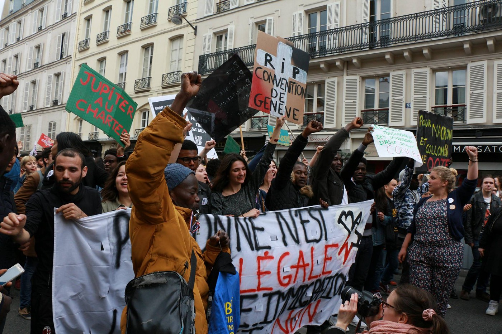

Photo by Abdul Saboor
### Feature: Hundreds of people join together to protests in Paris against the new immigration bill

A large protest was held in Paris a day before the new immigration bill will be presented at the National Assembly\. The new bill would see accelerated processing of asylum applications and increased deportations\.

The Bill has received [widespread criticism from organisations working with refugees in the country\.](https://www.aljazeera.com/indepth/features/france-parliament-debate-tough-immigration-reform-180415065206789.html)

> La Cimade, an organisation that works with undocumented immigrants in France, is one of the NGOs leading the battle against the bill\. 

> “The objective is; grant fewer rights, expel more people, migrants and rejected asylum seekers,” Rafael Flichman, communications officer at La Cimade, told Al Jazeera\. 

#### What the bill proposes:

A shortened timeframe for people who arrive in France to apply for asylum from 120 to 90 days

The legal detention period for those who have been refused asylum to be prolonged from 95 to 135 days while awaiting deportation

Anyone who has been denied asylum will no longer be able to apply for a residence permit

The appeal period for rejection to be reduced to 15 days

Financial assistance will be offered to rejected applicants who are willing to undertake voluntary deportation
#### Statement from Protest organisers:

> Tomorrow the text of the law will be presented to the National Assembly; 

> Because we reject the FRONTEX system, EURODAC and Dublin\.
 

> Because we refuse the daily violence against the migrants in the Calais, in Paris and in the south of France\.
 

> Because we refuse the competition created between asylum seekers and undocumented migrants\.
 

> Because we refuse to be passive witnesses of a government policy that is detrimental to the freedoms of migrants\.
 

> Because we reject this political practice of dividing political struggles to better weaken them\.
 

> Because we are much stronger in our numbers and our combined wishes\. 

> We, for whom solidarity is not merely a word but a principle\. 

> We call you on you to join our major demonstration on April 15, the day before the legislation will be presented to the National Assembly, from the National Assembly to the Senate\. Only our collective determination will push back the government\. 

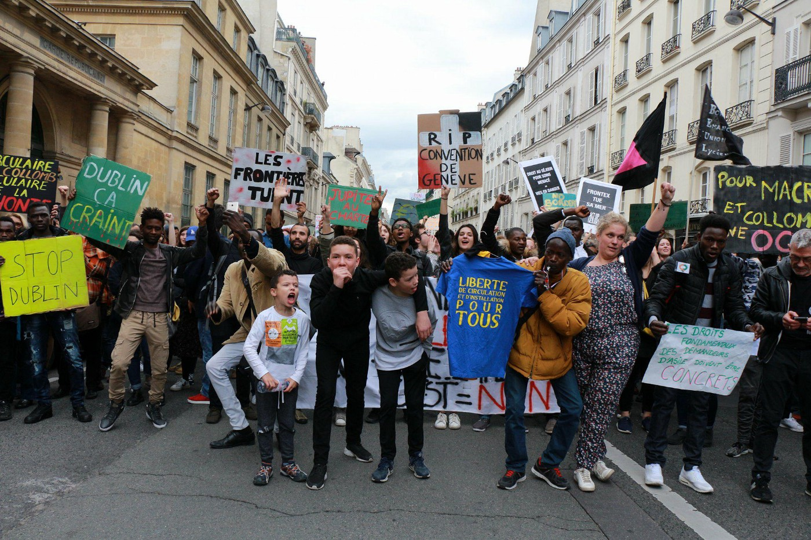

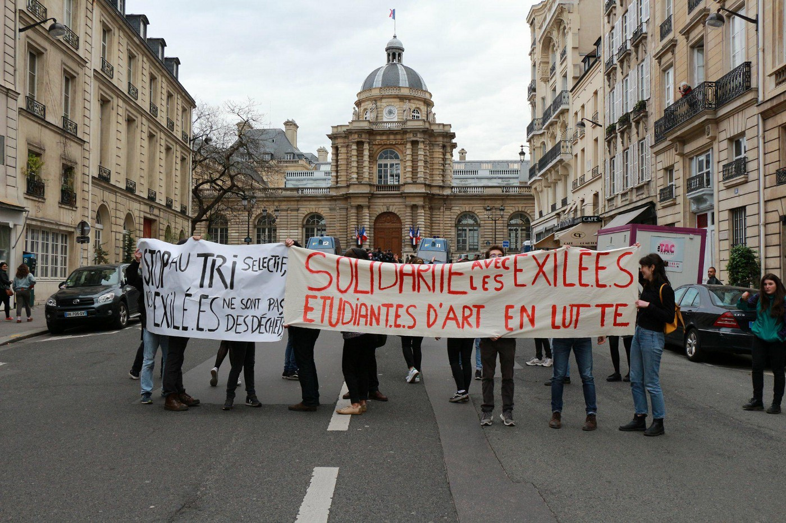

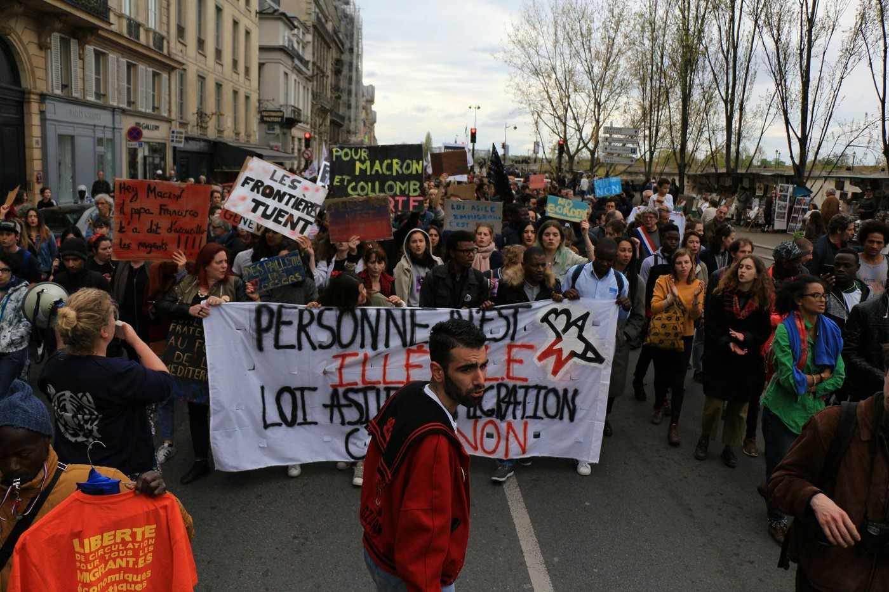

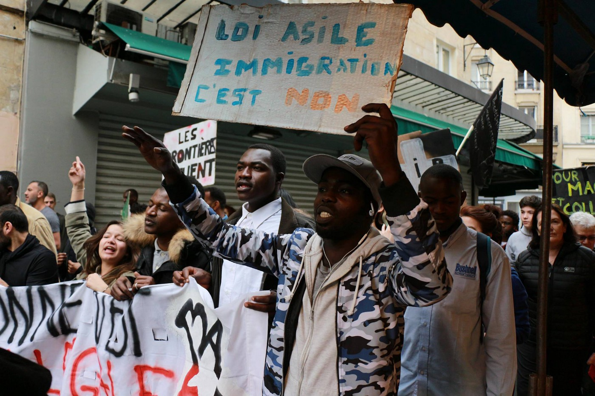

Photos by Abdul Saboor

### Syria:

According to Syria’s army command, following the departure of the last rebel fighters from the city of Douma, [the region of Eastern Ghouta has been declared free of militants\.](https://www.middleeastmonitor.com/20180415-syrian-army-announces-eastern-ghouta-free-of-militants/)

This followed an agreement made between Russia and the Jaish al\-Islam rebel group, who—until the recent alleged chemical attack which prompted a joint military operation by the United States, Britain and France—maintained control of Douma\. Jaish al\-Islam agreed to leave the region shortly after the chemical attack that killed dozens of civilians\. Approximately 21,000 people from Douma who do not wish to remain under Assad’s rule have left to opposition\-held areas in Northern Syria over the last few days\.

The government offensive in Eastern Ghouta, supported by Russian forces, was launched in February 2018\. According to the Syrian Observatory of Human rights, the campaign has killed more than 1,600 civilians\.

Following the displacement of Jaish al\-Islam from Douma, [the Syrian regime has begun to prepare for a military operation against ISIS](http://www.syriahr.com/en/?p=89554) \-held areas south of Damascus\.

Since the operation by the regime on Eastern Ghouta, approximately 60,000 people have been displaced from the region in one month\. [MSF reports that a a large percentage of these adults and children are in need of urgent medical care](http://---  http://www.msf.org/en/article/syria-zero-point-displaced-east-ghouta-and-need-treatment   ---) \. MSF supports the main hospital in charge of attending to this population “zero point” where people arrive from from the buses\.

The facility scrambled to meet demand as 5,000 patients were dropped off at the facility following the displacement of Eastern Ghouta, despite their efforts to prepare for the influx\.

> Our hospital is right on the front lines between areas controlled by the government of Syria and by armed opposition groups\. In practice, this means that usually, when a reconciliation deal happens between belligerents in different parts of the country, and when people are transferred to Idlib, they first transit here, in Qalaat Al Madiq 

> Every time internally displaced people arrive in our area, we face the same sort of challenges and difficulties\. But this time around, the number of people coming was just much greater than what we had expected\. 

> Our facility is relatively small and we have just one operating theatre, so we simply couldn’t handle this influx of patients on our own\. For instance, at some point, one of the convoys was shot at on its way to northwest Syria and we had eight patients with fresh gunshot wounds arriving all at once, straight from the bus\. We would have needed two to three operating theatres to handle such an influx of patients — _Refaat Al Obed, the hospital’s Medical Director, describes the situation\._ 

### Sea:

> On April 15, 1912, the Titanic was one of the most famous ships of all time\. Since then, books have been written, films have been made and many stories have been told of this tragic sinking in which 1,513 people lost their lives\. 

> But, in the 21st century, we have had the equivalent of the wrecks of some 27 Titanics in the Mediterranean, many of them with no headlines\. What will they say in the future? 

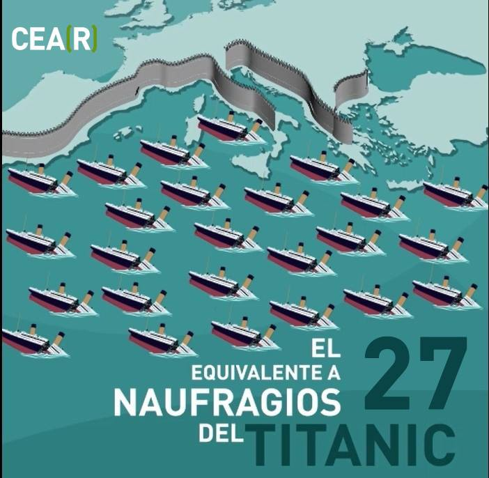

### Greece:
#### Arrivals:

A rubber boat which was heading towards Lesvos carrying approximately 50 refugees ran out of fuel and was rescued by the Turkish coast guard off the shore of Phokaia, Turkey at 9:30 a\.m\. on Saturday\.

Four rubber boats arrived in Lesvos over the weekend\.

The first was carrying 62 refugees and was picked up by the Greek coast guard at 2:15 a\.m\. on Saturday morning\.

A second rubber boat with 25 people aboard \(10 men, four women, 11 minors\) landed at Tsonia, at the north\-east end of Lesvos, Greece, on Saturday at 7:15 a\.m\.

The third rubber boat carrying 44 refugees \(17 men, 12 women, 16 minors\) arrived on Lesvos at 12:10 a\.m\. on Sunday morning\. It was picked up by Frontex\.

A fourth boat was picked up early this morning off the south coast of lesvos by Frontex, with 53 people on board: 18 children, 16 women, 19 men\.
#### Demonstration for Moria 35 and Petrou Ralli 8:

[A Solidarity demonstration](https://ssaekk.espivblogs.net/) for the Moria 35 and Petrou Ralli 8 persecuted migrants took place this Saturday\. Over 500 people joined the protest that set out from Monastiraki, proceeded along Omonia, Acharnon, Aristotelous streets and ended up in Victoria Square\. The protest was organised by the Coordination of Collectives and Individuals against Detention Centers\.

**Further actions have been called:**

■■■■■■■■■■■■■■ 
> **[NoBorders](https://twitter.com/Refugees_Gr) @ Twitter Says:** 

> > Next actions
#refugeesgr #antireport #freetheMoria35 #FreeThePetrouRalli8
Next actions
CHIOS
Friday 20/04 09:00 CHIOS court

ATHENS
Saturday 21/4 12:00 Motorcycle demo Pedion Areos &amp; gathering outside Petrou Ralli  detention
Friday 27/04 09:00 gathering
Athens court Loukareos str [twitter.com/Refugees_Gr/st…](https://twitter.com/Refugees_Gr/status/985533789500686336) 

> **Tweeted at [2018-04-15 15:07:23](https://twitter.com/refugees_gr/status/985535060681150464).** 

■■■■■■■■■■■■■■ 

One is to be held on Friday 20 April at 09:00 a\.m\. outside Chios court\.

Another on Saturday 21 April at 12:00, a motorcycle demonstration starting from Pedion Areos \(Victoria metro station\) and gathering outside Petrou Ralli detention centre in Athens\.

A third demonstration will be held on Friday 27 April at 09:00 a\.m\. gathering in front of the court in Athens, at Alexandras Avenue and Loukareos Street \(Ampelokipoi metro station\) \.

#### People rescued from the sea off the coast of Lesvos

Mo Chara found an empty dinghy floating in the sea during a training session\. The boat remained afloat, but the team was concerned and alerted all landing teams as well as UNHCR\. A group of four women, 10 men and 11 children was located who had been scattered across the shoreline near Tsonia

> The people were brought to the transit camp where our land crew, Lighthouse Relief, and IsraAid ensured that everybody received medical aid, blankets, dry clothes and tea\. This weekend has been as busy one in the North of Lesvos, with two boats arriving yesterday, and one more group of arrivals transferred from the South today\. A big thanks to all organisations involved for their fast response\! 

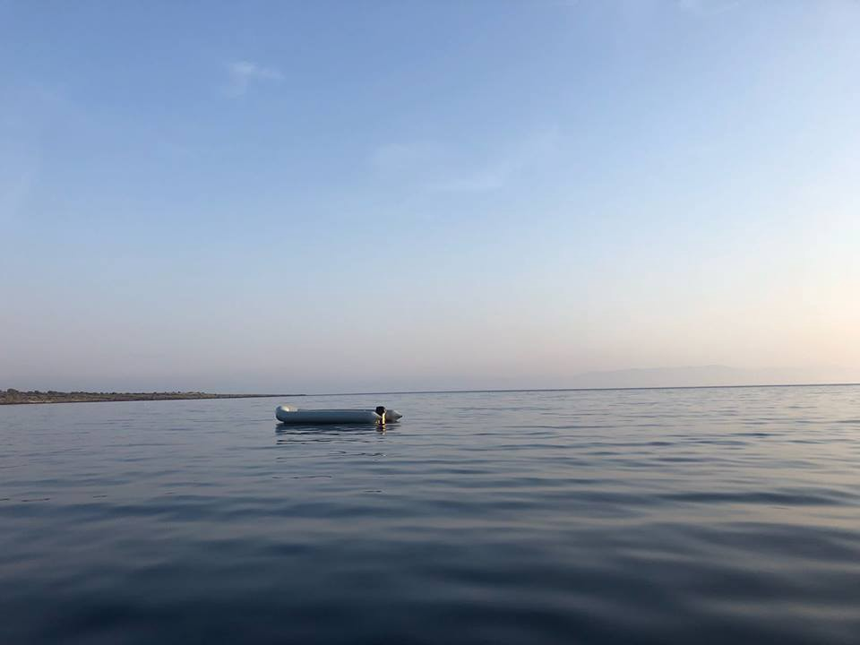

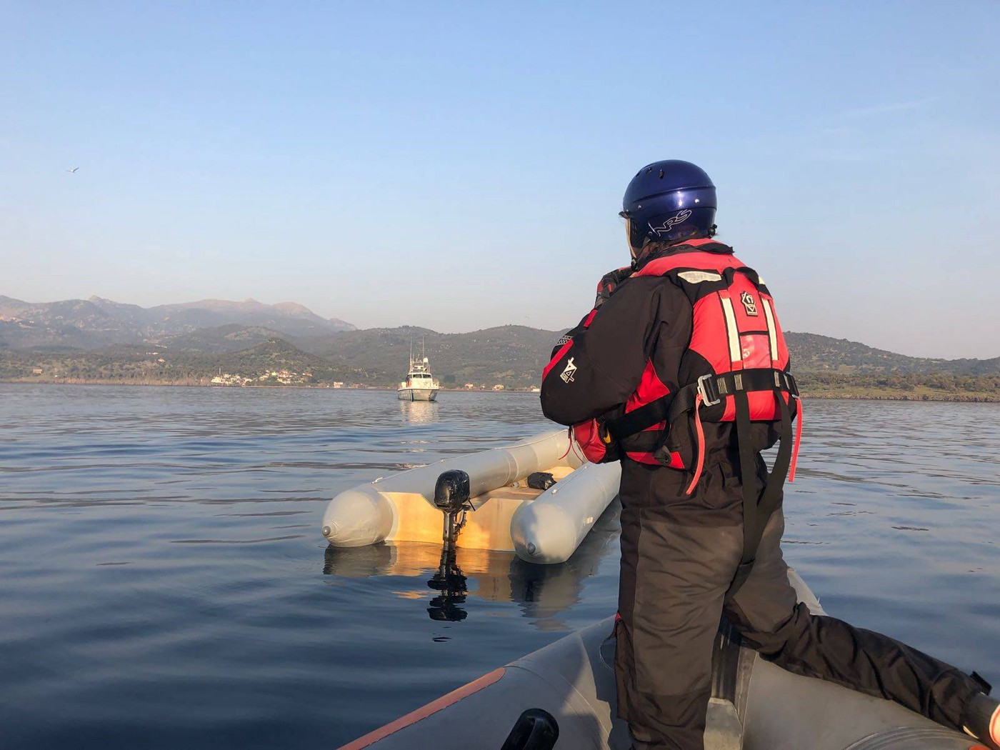

Source: Giannis Skenderoglou
#### Refugees4Refugees update

At the end of January, Refugee4Refugees moved from Skala Sikamineas \(north\) to Mytilini \(south\) \. There they continue SAR operations in collaboration with [ERCI — Emergency Response Centre International](https://www.facebook.com/ercintl/?fref=mentions) , [A Drop In The Ocean](https://www.facebook.com/adropintheoceandocumentary/?fref=mentions) and Campfire\.

In addition, due to the huge amount of waste on the beaches they have begun doing beach clean\-ups\.

> We will try to do a beach clean\-up at least once a month to make sure all the plastics don’t pollute the beautiful beaches of Lesvos\. And we’re also aware of the fact that we’re guests on the island of Lesvos, so this is why we try to help the local people in every way we can\. We want to make sure the tourists visiting the island over the next couple of months can enjoy the pristine beaches of the island\. 

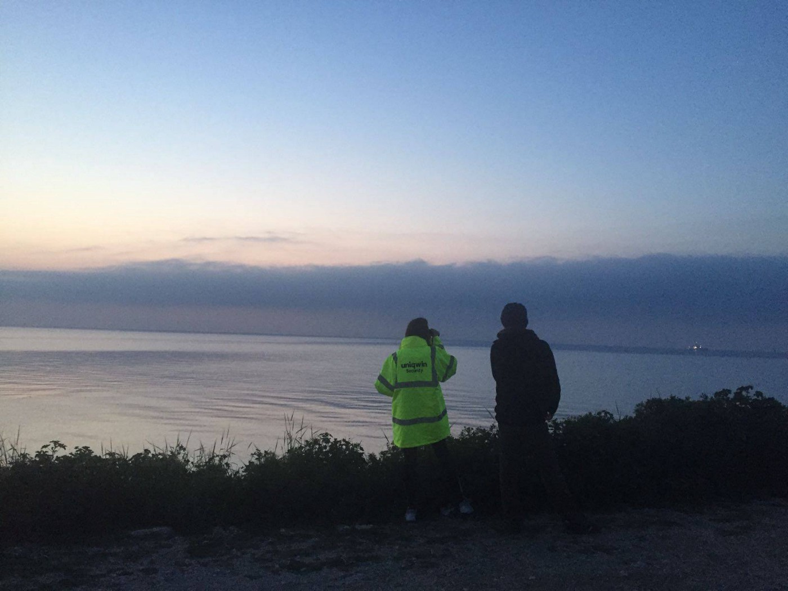

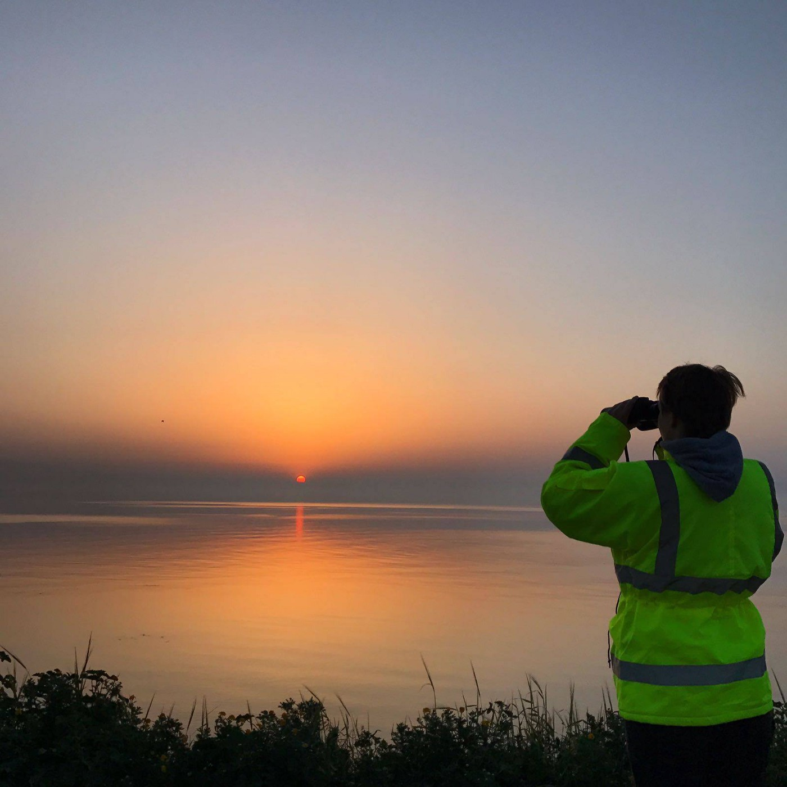

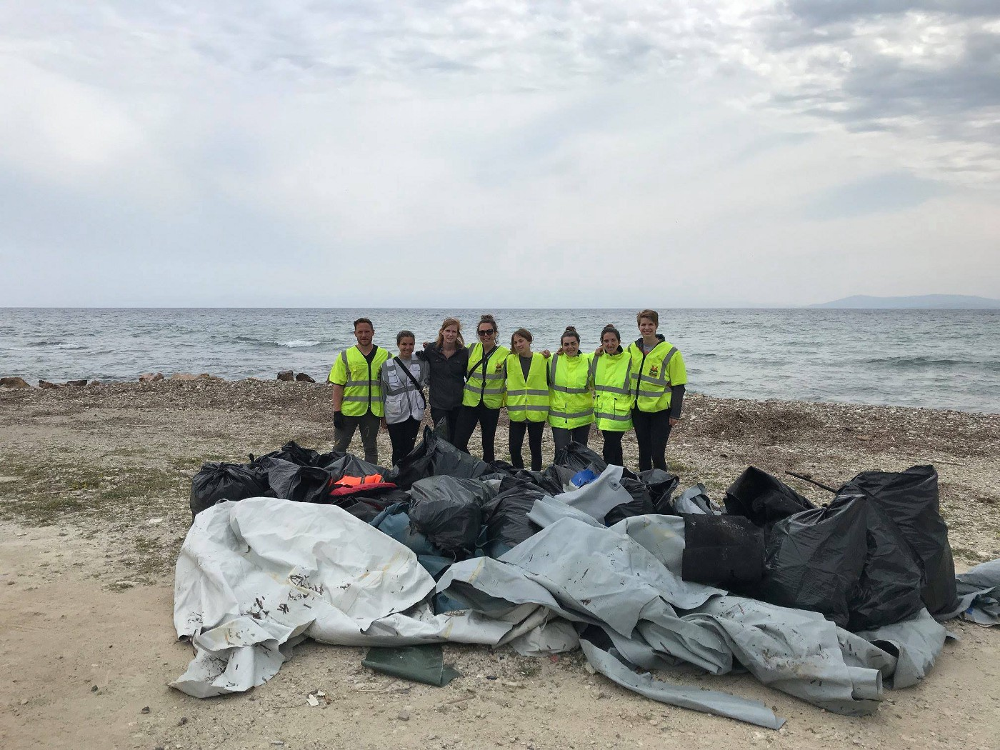

Source: Refugees 4 Refugees
#### FRONTEX reports a 30% rise in arrivals to Europe

New data has emerged from the EU’s border protection agency which claims [7,900 people entered Europe in the first quarter of 2018](http://greece.greekreporter.com/2018/04/15/eastern-med-sees-30-rise-in-migrant-arrivals-frontex/) \. These statistics are 30% higher than the same period in 2017\.

The increase has been predominantly due to the number of people crossing from Turkey, the majority of whom are Syrian and Iraqi nationals\.

■■■■■■■■■■■■■■ 
> **[NoBorders](https://twitter.com/Refugees_Gr) @ Twitter Says:** 

> > 30 percent of arrivals more in nothern islands of Greece through sea, more than aprox 700 at Lesvos this week. 
Also hundreds cross the Evros border (no official numbers) 
#refugeesgr #antireport 

> **Tweeted at [2018-04-15 15:21:24](https://twitter.com/refugees_gr/status/985538588296216577).** 

■■■■■■■■■■■■■■ 

### Serbia:
#### Serbian officers set fire to refugee squat

According to [Rigardu E\.V](https://www.facebook.com/rigardu/?hc_ref=ARQXyFZaVWpW9Httn56lqmcE2ExojcZsWGivnns4VrjS69hP0s30y0ba_vaAsEohUx0&fref=gs&dti=1652972374920129&hc_location=group) , Serbian officers set two houses alight which were housing refugees\. The police treated the men with violence, hitting them with sticks and kicking them in an attempt to stop the men from talking to the firemen\.

> This incident, which was reported close to the location of our project, shows in a cruel manner how people on the move are subject to violations of police conduct, not just at the border but also within Serbia itself\. Exactly one month ago, on 15 March 2018, two Serbian police officers set two abandoned houses on fire\. At the time, 33 people were living there; 22 of them stayed during the incident and four were minors\. Threatening to deport the men to Macedonia, then beating them with sticks and kicking them, the police forced them to leave the place before they set the two buildings on fire and burned all their belongings\. When they tried to stop them, the people on the move were again abused with violence\. 

Rigardu aims to bring attention to this incident and insists the authorities of the Serbian Interior ministry stop using unnecessary force and violence against people in search of protection\.

To read the full report please follow [this link](https://www.borderviolence.eu/violence-reports/march-15-2018-1100-close-to-the-serbian-hungarian-border/) \.

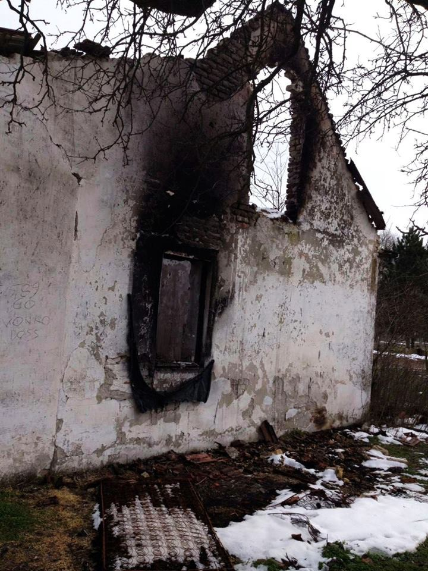

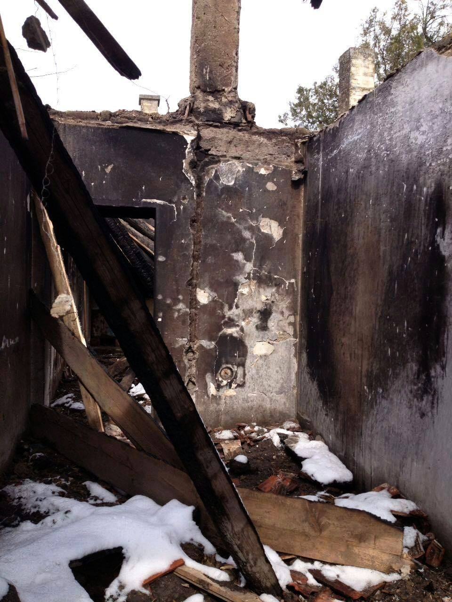

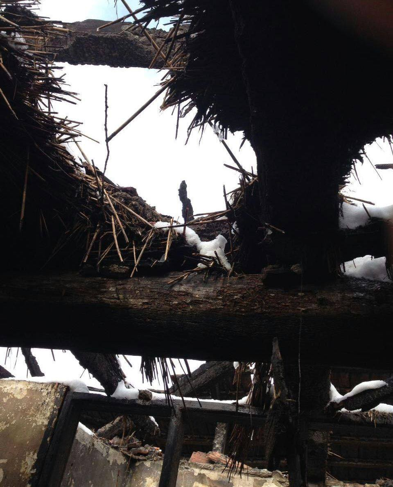

### Bosnia:
#### Men found sleeping in a park in Sarajevo

Approximately nine people, all young men, were found in a Sarajevo park Sarajevo tonight\. Among them, there were three Pakistanis who earlier this evening were seen at the main bus station\. Apparently they had just arrived and were given blankets because they lacked any sleeping equipment\.
#### 350 people remain in Velika Kladuša

Approximately 350 people were in Velika Kladuša today, some of them single men but also many families\. Every day in this small city in north Bosnia, close to the Croatian border, there are between 100 and 300 people, or as was the case today, even more\. So far the only help is coming from the local population who are providing them with accommodation and food, but also friendly conversation and are spending time with them\. Some of them eat for free at a local restaurant where people from the city prepare food for them together\. Local barbers are offering haircuts for free for all the people on their journey\. Medical help is provided by the local doctors and the MSF that comes once a week from Serbia\. The local people need help if they are to continue assisting\. The Sarajevo\-based charity pomozi\.ba provides support to volunteers in the field\.

If you can help, please donate: Bank name: Intesa Sanpaolo Banka BiH; SWIFT CODE: UPBKBA22; IBAN: BA39 1541802008533048 Udruženje “Pomozi”, Dr\. Fetaha Bećirbegovića br\. 8, 71000 Sarajevo; Svrha \(Purpose\): for refugees; Paypal: paypal1@POMOZI\.BA\. If you can offer other types of help, or if you would like to come and volunteer, let us know\.

[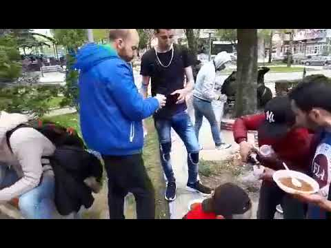](http://www.youtube.com/watch?v=qlYVMK1EpyY)

> **We strive to echo correct news from the ground through collaboration and fairness\.** 

> **Every effort has been made to credit organisations and individuals with regard to the supply of information, video, and photo material \(in cases where the source wanted to be accredited\) \. Please notify us regarding corrections\.** 

> **If there’s anything you want to share or comment, contact us through Facebook or write to: areyousyrious@gmail\.com** 

_Converted [Medium Post](https://medium.com/are-you-syrious/ays-daily-digest-15-04-2018-protests-in-paris-against-new-immigration-bill-ff87c77c4485) by [ZMediumToMarkdown](https://github.com/ZhgChgLi/ZMediumToMarkdown)._
