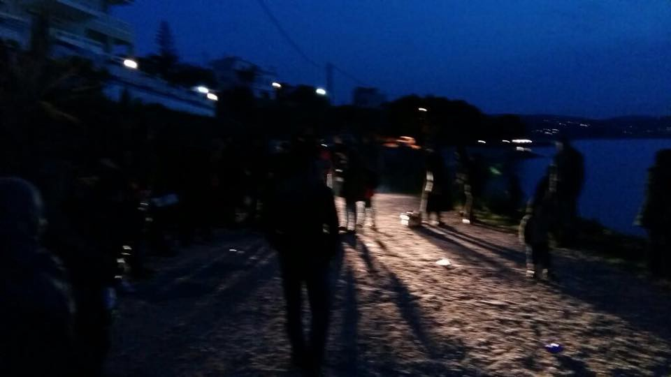
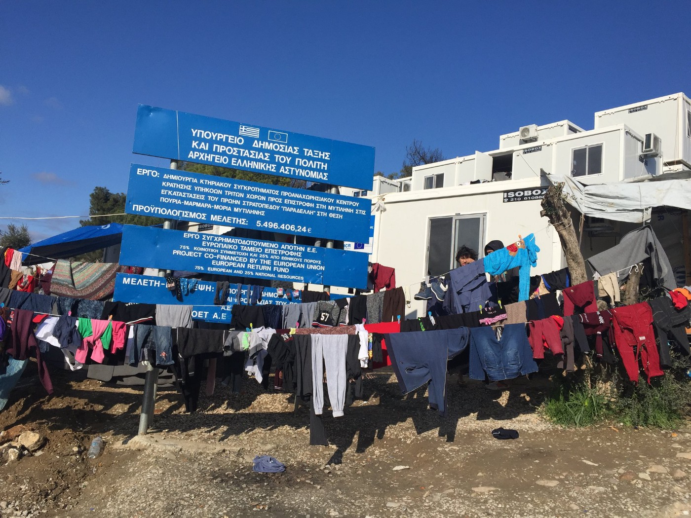
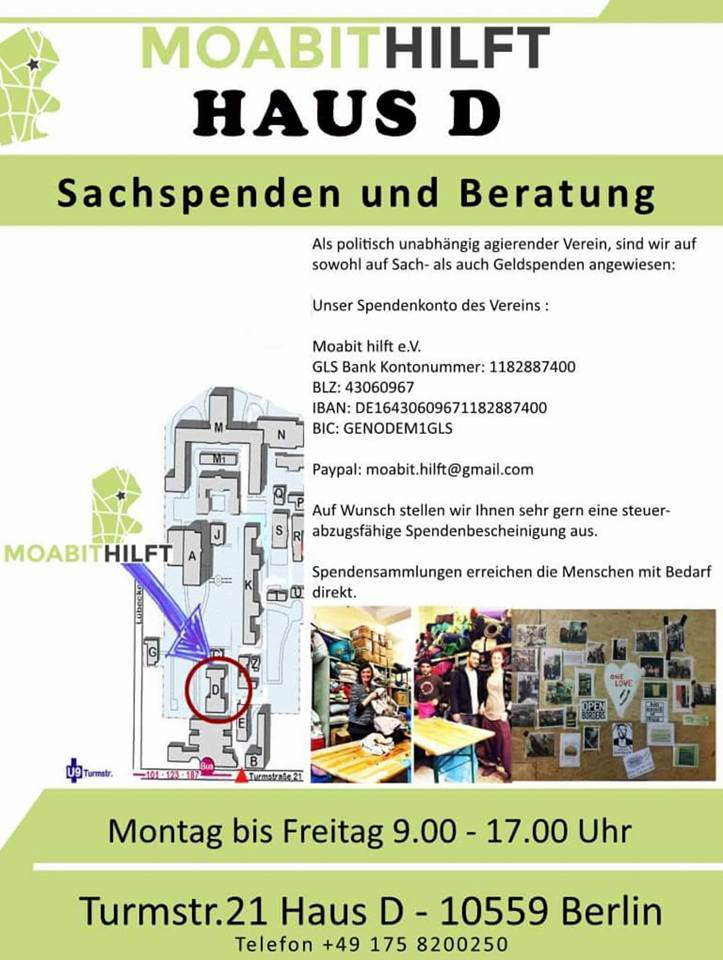
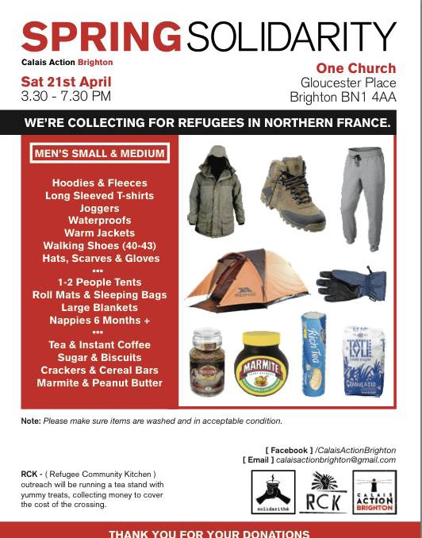

### AYS Daily Digest 17/4/18: Going public about the Croatian police pressure and false charges against an AYS volunteer
#### Protest was held on Lesvos to stand up against the mistreatment and denial of rights of the people held in Moria / The Council of State in Greece annulled geographical restrictions on asylum seekers’ freedom of movement in the Greek islands / AYS and CMS coming out with stories of ongoing intimidation from the police / More boats intercepted by the Libyan Coast Guard / …

 \)](assets/b4ac9af94009/1*pv-A0ahyKQqQjn7K6S8wKw.jpeg)

Lesvos protest \(Photo: [NoBorders](https://www.facebook.com/nobordersnetwork/?hc_location=group_dialog) \)
#### FEATURE

As we announced the press conference to address the systematic attempts of the Ministry of Interior and Croatian police to intimidate our volunteers and criminalize our work \(announced for 10AM Wednesday\), a few hours later, police officers started coming to the private apartments of our and the volunteers of the Centre for peace Studies parents, telling them they must come for questioning at 10AM on Wednesday — the same time they were scheduled to speak about this pressure publically\. The press conference is not being rescheduled nevertheless\.

It must be noted that we always respect Croatian and international laws, even when the state itself fails to do so\. For example, when people come to Croatian soil, they often contact us asking for help\. As it is our civil duty, we always forward such calls to the Ministry of Interior, because only they can start the official asylum procedure, and the only way to stay in the country legally is to ask for asylum\. However, people who try to regulate their status in Croatia very often get pushed back to Serbia, Bosnia or Montenegro\.

An illegal push\-back is what happened to the family of little Madina Hussiny, who died in the cold night on 21st November 2017, moments after her family was told to follow the train tracks back to Serbia\. AYS was first to inform the public about this\. In cooperation with Center for peace studies \(Croatia\) and Asylum Protection Center \(Serbia\), we’ve visited the grieving family in Serbia soon after the tragedy and explained their legal rights to them\. Soon afterwards they’ve signed the power of attorney to the very well known and respected Croatian lawyer Sanja Bezbradica Jelavić, with whom we collaborate on refugee\-related cases\. The criminal complaint was filed on 21st of December 2017, at the Croatian State Attorney’s Office\. This complaint states that unknown police officers from the Interior Ministry caused Madina’s death because of neglect, that they grossly violated the rights of the child, abused their position and power and caused, by inhuman treatment, severe mental pain and suffering to the family\.

Three months later, on 8th of March 2018, we were again contacted by little Madina’s family\. In the middle of the night, they’ve called us to say they are on Croatian soil, freezing and frightened, and asked for legal and medical assistance\. Being far away from the border area where the family arrived, we contacted the local police three times during the night, and then again in the morning, urging them to provide assistance to the family, especially for its most vulnerable members\. Despite all our long\-distance efforts and repeated attempts of the family to ask for asylum on site, they were denied the right to international protection and were once again illegally pushed back to Serbia\.

On 20th of March 2018, we were again contacted by the family\. They said they are in Croatia again and they still want to ask for asylum\. This time we sent a volunteer to the field in order to ensure their right to ask for international protection was respected\. Upon coming to the field, our volunteer approached police officers and told them we were contacted by the family\. Only then did our volunteer, together with the police officers, approach the family who immediately expressed their wish to stay in Croatia and ask for asylum\. After ensuring they were safe, he went to the police station to give a detailed statement about how they’ve contacted us and how and why he came to meet them\.

At that moment we were just happy they were finally safe\. We didn’t know Madina’s family would be transferred to the detention in Tovarnik, a Croatian town near the border, where they are still being held\. They have been locked up there for over a month, without any contact with the outside world\. During this time in detention, they’ve somehow managed to briefly contact our volunteers, begging for help, saying they’re being held separated in locked rooms\. A similar message was sent to our colleagues at the Center for Peace Studies, whom the family asked to speak to their lawyer\. However, the lawyer is not allowed to contact them in any way\. Why? The police first said the power of attorney is not valid because it was signed in Serbia \( \! \) \. This absurd claim was soon changed with even more bizarre claim: That Madina’s mother’s signature on the power of attorney is false\! This is despite the fact it was given in the presence of five witnesses, including our own volunteers\.

Madina’s family is still in detention with no contact with the outside world\. Another family is being held in the same detention facility — another family whose push\-back was prevented by the physical presence of our volunteers\. In this case the same protocol was followed — upon arriving to the area, we first contacted police officers, and then stayed present until the family’s right to ask for international protection was granted\. One female minor from this family was rushed to the ER and the doctor ordered hospitalization and surgery for a tumor that she has\. Nevertheless, they were sent to the detention center in Tovarnik, where they are held together with Madina’s family\.

We’ve recently learned that Madina’s family’s claim for asylum was declined on the grounds of Serbia being a safe country\. We have the reason to believe the other family was also rejected, but they are still being held in Tovarnik\. Upon the urgent request of our lawyers, the European Court for Human Rights has ordered Croatia to provide humane accomodation to them\. This order is currently being ignored\. Their lawyer is still not allowed to contact them, but she is now called for questioning and being investigated for the alleged falsification of the signature on the power of attorney document\.

The AYS volunteer who managed to prevent the push\-back of Madina’s family was recently called to the police station and forced to sign a document saying he will be charged for “assistance in illegal border crossing”, despite the fact he was with police the entire time\. No explanation was provided on this paper, so we still don’t understand why he is being charged\.

Instead of investigating their own misdeeds, the police are now expanding their investigation to our other volunteers, as well as the attorneys and volunteers of Center for peace studies\. We are called in for questioning without apparent reason\. Our parents are being harassed in their homes\. The lawyer is getting intimidating phone calls from a hidden number\.

We can live with that, no problem\.

But we won’t allow the unjust detention and the psychological abuse of vulnerable families\. 
And we cannot accept the criminalization of our legal work for the protection of refugees’ human rights in Croatia\.
#### GREECE
### Newly arrived people
#### Sea

](assets/b4ac9af94009/1*sECBn3nfaBAarPDL4KSXVw.jpeg)

Landing at Katarakis beach [— Salvamento Marítimo Humanitario](https://www.facebook.com/smhumanitario/)

[Aegean Boat Report](https://www.facebook.com/AegeanBoatReport/?hc_ref=ARRvnRvqpALkziW56yeqBtKS-vOxjBFc6xH1FdqTfxsTbw_Mi_ked5DE5RqHIhaXBdA) says three boats arrived on the Greek islands during the night from Monday to Tuesday, with 121 people in total\.

The first boat landed on Oceanis Beach, east Kos, with 18 people on board, though the numbers were not confirmed at the time\.
The second boat was picked up near Mirsinia, outside Tsilia, Lesvos South, by Frontex\. The vessel had 58 people on board\.
Third boat landed on Katarraktis Beach on Chios, with 45 people on board:
21 children, 10 women and 14 men\.

](assets/b4ac9af94009/1*MAwh1mHzwSmYbAHxxsdLPA.png)

“The Greek islands are deeply unprepared for the expected annual surge in refugee numbers arriving this spring and summer\. “— [**Safe Passage**](https://www.facebook.com/SafePassageInt/)
#### Land

Greek authorities [reportedly](http://www.ekathimerini.com/227739/article/ekathimerini/news/hundreds-of-refugees-migrants-cross-into-northern-greece) said that hundreds of refugees have crossed the land border with Turkey in the area of Evros, in the past two days\. These illegal crossings in the area we wrote about a number of times are increasing significantly following Turkey’s military operation in northern Syria and taking into consideration the conditions, long waiting and detention on the Greek islands\.

> Authorities have noted a surge in arrivals across the Evros, with 1,658 people detained in March compared to 586 in February and 262 in March 2017\. 

### Lesvos

A demonstration of about 400 people \(according to the [local media](http://www.lesvosnews.net/articles/news-categories/koinonia/diadilosi-prosfygon-sti-mytilini-9000-o-synolikos-arithmos-poy) \) heading to the Sappho Square, including many women and children from Syria, Iraq, Afghanistan and Pakistan began around 1 in the morning from Moria\. The rumour about a death of man whose cardiac health issues were supposedly not looked after was also denounced\. Still, his condition remains llife\-threatening as he is reportedly artificially being kept alive\.

](assets/b4ac9af94009/1*dGJwo9AlMqJXkwSF69KOng.jpeg)

Photos: [Greek Forum of Refugees](https://www.facebook.com/Greekforumofrefugees/?hc_ref=ARTrSKD1PsUkMZ2mLHb4161cgCz2vr8GziitxdwoPktbM6oZudAGSoj_oYT5FOPhcmg)
### Freedom of movement for the newly arrived

Greek Council of State voted by a majority of four votes against the geographical restrictions for asylum seekers on the Aegean islands, which was imposed by the Director of the Greek Asylum Service since 2016\.

**This will not apply for people who have arrived on the islands, retrospectively\.** However, soon, **new arrivals should be able to travel to mainland Greece\.**

Referring to the EU Directive 2013/33, the decision came as a sign of hope for a change in the procedure, but also of the treatment of people who fear arriving to Greece is just another chapter of detainment on the islands — and nothing much different was awaiting elsewhere, but now we hope this is a _game changer_ in the policies, as in the treatment, and not instrumentalization of the EU Directive to fit the time of the year\.
### Family reunification update

Certain approved **family reunification applicants can exceptionally book their ticket on their own expenses\.** [Mobile Info Team](https://www.facebook.com/mobileinfoteam/?hc_ref=ARSQG-VZsMn2gMraxFG8_85ZhfiKevZeyLxk3YB8A63dQmWiaNg5ALYn_Pl-6UCvBCs&fref=nf) explains that it means that applicants who have received an approval for Germany in April or May 2017 and applicants who have received an approval for any other country than Germany in October and November 2017 can go to any travel agency they want and try to book their ticket\. Please be aware, that the travel agency needs to get in contact with the Greek Dublin Unit as they would need to make arrangements to finalize the booking\. We have written a letter in English which you can bring to the travel agency, where it is stated what the travel agency needs to do\. 
You can find the letter here: [www\.mobileinfoteam\.org/fr1](http://www.mobileinfoteam.org/fr1) 
You should bring to the travel agency you and your family’s asylum seeker cards and your approval document\. Please also try to bring a translator with you, as the employees of the travel agency most likely will only speak English or Greek\. Only pay for your ticket if it is clear that the Greek Dublin Unit has confirmed to the travel agency that you are allowed to fly\. Applicants for other countries than Germany that have had their approval from October or the beginning of November should seriously consider paying for their tickets on their own\. If your destination is not Germany it might cause troubles to pass the 6 month deadline from the approval date for transfer\. Everybody else can choose, if he or she wants to pay for the ticket now or wait if you can get a ticket which is paid by the state later\.

**Why these two groups?** According to the Asylum Service, those approved for Family Reunification to Germany in April and May 2017 have been waiting for a year\. Those approved for Family Reunification to other European countries have to get there before 6 months passes, or they lose their right to Family Reunification\.
#### FRANCE

 ” — [EDAL European Database of Asylum Law](https://www.facebook.com/asylumlawdatabase.eu/?hc_location=group_dialog)](assets/b4ac9af94009/1*uiaYGNuW8u9AhqC4wcW8MA.png)

“For the latest English summaries of French case law on Afghanistan and the situation throughout the country amounting to an internal armed conflict see here: [https://bit\.ly/2H66fAX](https://bit.ly/2H66fAX) ” — [EDAL European Database of Asylum Law](https://www.facebook.com/asylumlawdatabase.eu/?hc_location=group_dialog)
#### GERMANY

](assets/b4ac9af94009/1*sBLIXZiSZQUcVYrB8VTMgA.jpeg)

There are persistant rumours that the next charter from Germany will leave next Tuesday, April 24th\. 
Please stay aware and consult a lawyer immediately if you might be affected\. — [ECADA — European Citizens Against Deportation to Afghanistan](https://www.facebook.com/ecada2017/?hc_ref=ARR86-WpY4z-aGQVeP-cS0vEN5mRBB6hk2HlynDSIFmxnwl1MkqyPkWsibq7t3-d7H4&fref=nf)

**Berlin** — [Moabit hilft e\.V\.](https://www.facebook.com/Moabithilft/?hc_location=group_dialog) needs support in aid and donations in order to continue help and support activities with asylum seekers in Berlin\.
They urgently need:

\* clothing and footwear for men
\* toys
\* Household utensils such as: mugs, plates, glasses, tablecloth, pillows etc\.
\* handbags, backpacks

For questions and more detailed info, please contact the organization or write directly to [Christiane Beckmann](https://www.facebook.com/trallali.trallala?hc_location=group) \.

#### UK

Aid collection in Brighton is coming up this Saturday\.
They are sending a van over to Calais on Sunday 22nd and seem to have more room so we are spreading the word in order to let people know who may want to send items with the group\.

ONE CHUCRH, Gloucester Place
Sat, 21st from 3\.30 to 7\.30pm

#### SEA

■■■■■■■■■■■■■■ 
> **[Matteo de Bellis](https://twitter.com/matteodebellis) @ Twitter Says:** 

> > Yet again a group of refugees &amp; migrants has been intercepted at sea and returned to #Libya by the EU-assisted Libyan Coast Guard. Why are they being detained? In which detention centre are they being taken? With which guarantee that tonight men won't be beaten and women raped? [twitter.com/IOM_Libya/stat…](https://twitter.com/IOM_Libya/status/986264344848674816) 

> **Tweeted at [2018-04-17 17:22:37](https://twitter.com/matteodebellis/status/986293870727258112).** 

■■■■■■■■■■■■■■ 

■■■■■■■■■■■■■■ 
> **[MSF Sea](https://twitter.com/MSF_Sea) @ Twitter Says:** 

> > FOLLOW UP: The #Aquarius has been informed that today two rubber boats that were in distress were taken by the Libyan coastguard back to #Libya. #MSF continues to reiterate that #Libya is not a safe place and no #refugee, asylum seeker or migrant should be returned there. https://t.co/pvcGyUnfwh 

> **Tweeted at [2018-04-17 17:29:04](https://twitter.com/msf_sea/status/986295491058110464).** 

■■■■■■■■■■■■■■ 

■■■■■■■■■■■■■■ 
> **[SOS MEDITERRANEE](https://twitter.com/SOSMedIntl) @ Twitter Says:** 

> > UPDATE while searching for the boat in distress, the #Aquarius was informed the Libyan coastguard took coordination over 2 boats in distress today. This means more people were taken back to a place where their safety is not guaranteed. Photo: @[totasprod](https://twitter.com/totasprod) https://t.co/DDcagGuG3Z 

> **Tweeted at [2018-04-17 17:25:27](https://twitter.com/sosmedintl/status/986294580097224705).** 

■■■■■■■■■■■■■■ 

■■■■■■■■■■■■■■ 
> **[Jugend RETTET - IUVENTA](https://twitter.com/jugendrettet) @ Twitter Says:** 

> > On April 23rd, the decision over the release of our IUVENTA will take place in Rome. 973 people have died on the Central Mediterranean route since the day of the seizure on August 2nd 2017. #freeiuventa https://t.co/nCQjefxiNM 

> **Tweeted at [2018-04-17 12:44:37](https://twitter.com/jugendrettet/status/986223907664474112).** 

■■■■■■■■■■■■■■ 

**We strive to echo correct news from the ground through collaboration and fairness\.**

**Every effort has been made to credit organisations and individuals with regard to the supply of information, video, and photo material \(in cases where the source wanted to be accredited\) \. Please notify us regarding corrections\.**

**If there’s anything you want to share or comment, contact us through Facebook or write to: areyousyrious@gmail\.com**

_Converted [Medium Post](https://medium.com/are-you-syrious/ays-daily-digest-17-4-18-going-public-about-the-croatian-police-pressure-and-false-charges-against-b4ac9af94009) by [ZMediumToMarkdown](https://github.com/ZhgChgLi/ZMediumToMarkdown)._
