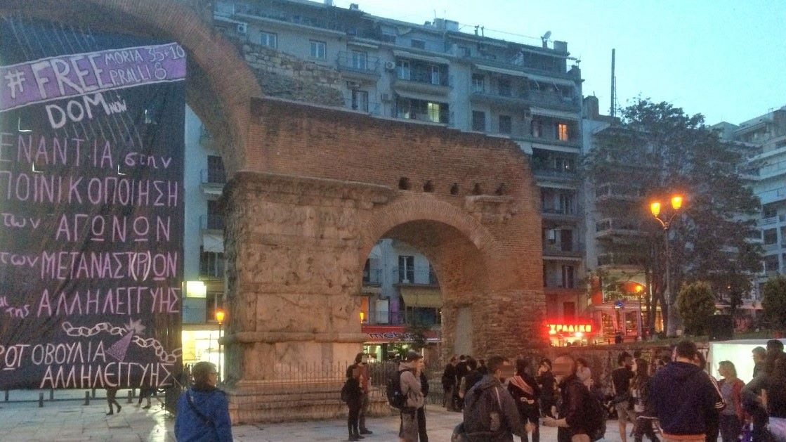
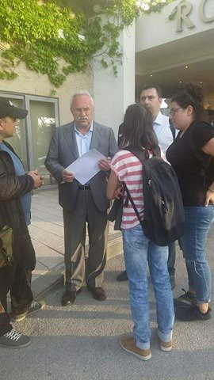
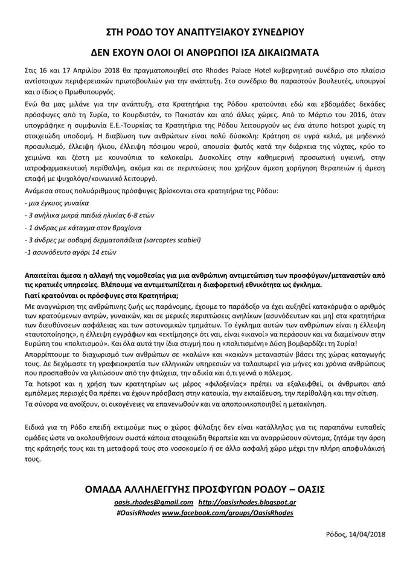
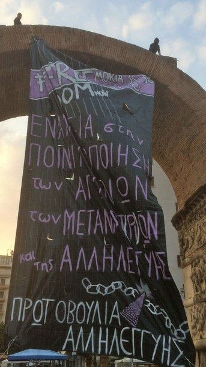
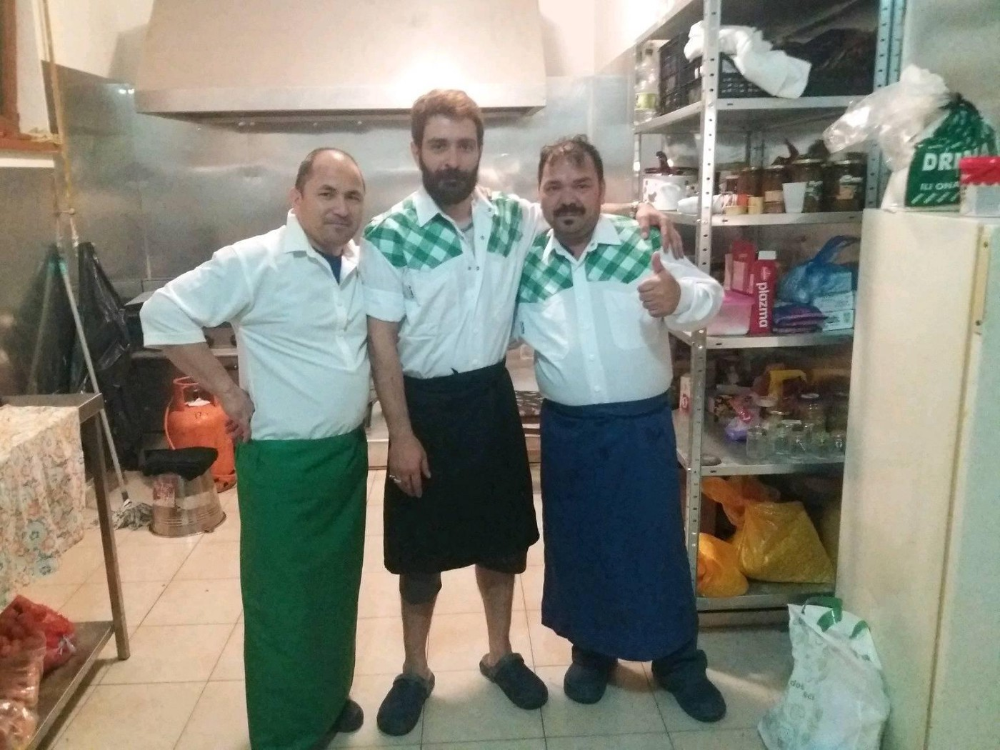

### AYS Daily Digest 18/4/18: ‘Give us the migrants or we will kill you,’ The front lines of Criminalized Solidarity\.
#### _AYS talks to Proactiva — what happened and what’s next? / Morocco: Police expelling volunteers from Nador / Greece: Volunteers attacked on Chios; Solidarity with the Moria 35 and Petrou 8 ahead of court / Hungary: Ilias and Ahmed vs\. Hungary at the ECHR / Italy: dismantling of Ventimiglia camp / Germany: no more systematic checks for arrivals from Greece / more news_

Action in Thessaloniki\. photo credit: NoBorders
### FEATURE
#### AYS today had the chance to talk to Proactiva about the release of the Open Arms on Monday\.

“We expected the ship to be released because we are sure that we didn’t do anything illegal\. But not so fast, it happened within a month\. We thought that it might even take years\. So we were quite surprised”, Gerard Canals Bartolomé, head of operations, said\. But what happened for the Open Arms to be seized? “It was a messy day with the messages,” Mr\. Bartolomé remembers the day, that can be divided in three chapters\.
#### Chapter 1: No response

In its first rescue mission, the Open Arms was called to a boat in distress some 25 nautical miles away from the Libyan coast\. Mr\. Bartolomé explains: “When we arrived at the boat, it was more or less okay\. While we were waiting, water came into the boat\. So some people jumped into the water and it got messy in a short time\.” The crew tried to contact the Libyan Coast Guard but did not get any answer and they did not show up\. As the people were about to drown, the Proactiva team took them on board\.

Some 45 minutes after the rescue, Proactiva was contacted by the LCG and requested to hand over the rescued people to bring them back to Libya\. “We said, ‘Look, everyone has been rescued already and is on our ship\. If you want anything, you talk to Rome, because we’re not going to transfer these people to you as long as we do not have an order from Rome\.’,” Proactiva’s head of operations states\. Further he underlines, that the Italian Maritime Rescue Coordination Centre \(MRCC\), which is coordinating rescue operations in the central Mediterranean, would “never tell a European flagged ship directly to give people back to Libya because they would be acting against the Geneva Refugee Convention”\. This is one of the reasons why the people should get on board as fast as possible before Libyan forces can intervene\. And, as far as he is informed, this is also the key point, why the Open Arms was released now: “They say, in the operation of Frontex they will never disembark people there, Italy will never ask any organisation to disembark there\. That Libya is not a safe port\.”

A while after this rescue, Proactiva received another emergency call by the MRCC, which caused all the trouble for them\.
#### Chapter 2: Two case numbers, one case

Actually, the MRCC sent two messages with two case numbers: 164 and 167\. Mr Bartolomé recalls: “When they sent the message with case number 164, shortly afterwards they sent a message saying that Libya would take care of this event\.” So Proactiva headed to case number 167 to rescue the people some 70 nautic miles off the shore of Libya\.
Because the Rigid Inflatable Boats \(RIBs\) are faster than the mother ship, Proactiva sent them to the scene\. “The boat was in very good condition, so we provided only life jackets at first \(from the RIBs\)”, Mr\. Bartolomé says\. But as the mother ship, the Open Arms, headed to the rescue area, they were approached by a Libyan Coast Guard ship with the number 648, cut some hundred meters away and told to stay away\. Proactiva’s head of operations concludes: “But our RIBs were already there, and we could not stay away, we were already there providing life jackets\. 
The Libyan ship arrived before the Open Arms ship, but not before the RIBs\.

> They threatened us and the migrants, saying, ‘Give us the migrants or we will kill you\.’ All of this is recorded\.” 

But the RIBs are the key to this situation: They are registered as independent, Spanish flagged ships\. Hence, Proactiva was on scene, before the Libyan Coast Guard arrived — even if their mother ship arrived later\. It seems, that the Libyan forces did not want to accept this\. “After some hours of conflict, the Libyans launched a small dinghy and they took our RIB alongside their ship\. Like a sandwich\. It was not aggressive”, Mr\. Bartolomé says\. The situation became more critical, when a Libyan officer came on board without any permission or the authorization of the RIB’s captain\. 
To highlight: in international waters\. 
For Proactiva this is just a side note, but it was “an act of piracy\. But it’s okay, that’s not the point\.”

However, the Libyan Coast Guard urged the Proactiva crew to hand over the people\. “We said, if they want to do this, they have to do it by themselves\. But it was absolutely impossible for them to push the people up\. You know how difficult it is to make a transfer from a RIB to a mother ship when the people are willing to help? So you can imagine how difficult it is when the people don’t want to help at all\. They just sit down, hold each other\. It was absolutely impossible for the Libyans to take the people and put them on board\. In the end they just got pissed and angry and decided to leave”, Mr\. Bartolomé says\. In the end, they were told to rescue the people and to go north\.

Only later they found out that both case numbers actually referred to the same case\. Mr\. Bartolomé expresses: “We had the command of the Italian MRCC to make the rescue\. So, we should finish all the operations from the rescue until the disembarkation\.” Plus, in the end also the Libyans told them to finish the rescue and leave\. Proactiva assumes that the Italian authorities “got mad, because they made their own mess with this communication\. For them it was case number 164, but for us it was 167\. We are both right, but if they make mistakes, we cannot take responsibility for them\.” 
But the MRCC insisted, that the Proactiva crew operated in case number 164, without request, and therefore would have to bring them on their own responsibility to Malta as it is the closest port of safety\.
#### Chapter 3: Disembarking and prosecution

As Proactiva headed to operate in case number 167, under the coordination of the MRCC, they transferred the people to Italy\. This is also in accordance with the Code of Conduct that Proactiva signed last year\. “If they provide the case, they have to provide the disembarkation,” Mr\. Bartolomé explains\.

This action not only lead to the accusation of aiding illegal migration\. As head of coordination, Mr\. Bartolomé is under investigation, but also the captain and the head of mission\.

> Even though the Open Arms is released, the trial will continue\. 

“The Italians have also checked previous cases with the information they have\. Now they are trying to build a bigger case, where we deal with traffickers all the time,” he explains\. He expects, that the Open Arms can operate in four to six weeks again, if it is not damaged\. A visit in the dry dock was already scheduled for early April but now had to be postponed\.

But because of the seizure, Proactiva already reactivated their old sail yacht Astral that they first used in 2016\. Nowadays it is visiting Spanish ports to raise awareness on the situation in the central Mediterranean\. The Astral is now on its way to Malta and probably will depart to the SAR zone on Friday\.

■■■■■■■■■■■■■■ 
> **[Jordi Évole](https://twitter.com/jordievole) @ Twitter Says:** 

> > Después de retener en Italia al Open Arms, los de Salvados volvemos al Astral. Nunca nos hemos bajado de ese barco.
Gracias @[openarms_fund](https://twitter.com/openarms_fund). https://t.co/19pMhFO8WZ 

> **Tweeted at [2018-04-16 20:26:12](https://twitter.com/jordievole/status/985977681698344962).** 

■■■■■■■■■■■■■■ 

Additionally, Proactiva is looking for a second rescue ship at the moment, as they did not expect the Open Arms to be released at this stage\. Mr\. Bartolomé at first saw it as a replacement, but now considers it is an opportunity: “This was not the idea\. We wanted to have one operational ship, because one had been seized, and we thought it would be for a long time\. Anyway, we are still looking\. If we can do it, we will have a second ship and operate both\. Why not?”

■■■■■■■■■■■■■■ 
> **[Oscar Camps](https://twitter.com/campsoscar) @ Twitter Says:** 

> > @[openarms_fund](https://twitter.com/openarms_fund)  ya son 31 meses, 31 meses bajando al infierno, sintiendo el sufrimiento, el dolor ajeno y demasiado amenudo, la muerte, 31 meses viendo lo peor y lo mejor del ser humano, 31 meses recibiendo vuestro apoyo. Tenemos que seguir juntos os necesitamos màs que nunca. https://t.co/X0u8SIRq28 

> **Tweeted at [2018-04-18 10:12:18](https://twitter.com/campsoscar/status/986547962439454720).** 

■■■■■■■■■■■■■■ 

#### MOROCCO
### Police pressure on volunteers in Morocco

On Monday, the police in Nador came to a house that is rented by the members of an NGO Bare Life in Nador that works supporting the refugees and migrants, the [Association Marocaine des Droits Humains — Section Nador](https://www.facebook.com/AmdhNador/?hc_ref=ARQOuq7bhSD4t3fkxQatUZv2EHfBu2BUWxa80YlE5OIQAmtgjmvgwP_IwbFSIkNXCZk&fref=nf) reports\. The officers, Muni militari, ordered the 6 activists to leave the city immediately, without any written order or a document\. 
The volunteers in question come from the Netherlands, Spain and Greece\.
On the same day, the police stopped a young Algerian who was together with the activists and he was expelled to Algeria\. 
Unfortunately the city of Nador seems to be forbidden for all nationalities, the volunteers say, adding:

> The topic of migration is a taboo that the authorities wish to keep a secret by all means\. 

At the same time, they warn about the abuse of migrants by the smugglers and traffickers who use extortion, threats, theft and physical ways to pressure the people, and AMDH helps with filing complaints to the authorities\.
#### GREECE
#### **_Newly arrived people to the islands_**

According to the Aegean Boat Report, there were a total of approximately 144 arrivals on the 17th\. 50 people were taken to **Lesvos** , Approximately 34 people were taken to **Leros** \(unconfirmed\), and 60 people landed in **Chios** \. Another boat was intercepted by the Turkish coast guard, which carried 36 people, most of them children\. The Aegean Boat Report published a video of the interception\.

### Attack on the volunteers on Chios

According to a member of the Spanish NGO, SMH, there was an attack on the volunteers during their attempt to support refugees and immigrants on the 18th\. Two groups of volunteers went to help 60 people who had landed on the beach, the [Greek media](https://astraparis.gr/trampoykiki-epithesi-kata-ethelonton-ston-katarrakti/) reported\.

> The second group, was attacked by a local businessman who was very upset, spoke inappropriately, and physically attacked a volunteer\. He threatened that he has a gun in his house and warned them not to come back to the area\. This incident, though extremely serious, does not appear to have been reported to the police…\.It is, however, a concern because that area is often affected by refugee flows, and this incident comes after other two racist and xenophobic behaviors, one at the 11th Kindergarten in Chios and the other with the rise of obstacles to the registration of a child refugee in the elementary school of Thimiana area\. 

### Rhodes

Activists in Rhodes were prevented from having a press release by police for more than one hour\. The individuals were from Rhodes solidarity group and the press release detailed criticism of the detention of refugees\. The press release was to be released at the same time of the Prime Minister’s speech at the Regional Development Conference\.

Photo credit: NoBorders

The press release is available below in Greek\.

### Athens
#### The 8 Algerian men facing trial next week in Athens 
Released video confirms police abuse

An intensive campaign is taking place in Athens and around Greece for the last weeks to promote the upcoming trial of 8 Algerian men, the story we reported on previously\. Eight Algerian men \(most of them in their 20s\) have, for almost a year, been awaiting trial as defendants in the police attack that took place on 31st of May 2017 in the detention facility Petrou Ralli in Athens\.

Ten days ago, a group “Coordination of the collectives and individuals against detention” published a video taken in the cells during the attack\. The video evidence is shocking\. Police officers are mocking hopeless detained migrants, clearly talking to them offensively\. At one point they enter the cells with force using batons escorted with someone that could be a director of the facility\. 
**The video proves the police beating of detained migrants took long 5 minutes\.** 
It’s worth mentioning that despite the obvious video evidence Athens prosecutor continued with the prosecution of the migrants\. The trial will take place next week on 27th of April in Athens\. A huge solidarity campaign is promoted specially by the “Coordination of the collectives and individuals against detention” \(shortcuts in Greek SSAEK\), which also raised the issue in the first place\.
The campaign of prosecution of 8 Algerian men was joined with the trial against 35 refugees in Moria, in another similar case\. The trial against the 35 is about to start on Chios island this Friday on the 20th\.
### Thessaloniki

People in Thessaloniki spoke out in solidarity with the Moria 35 and Petrou Ralli 8\. A large banner was draped from an arch in view of the public, informing them of the plight of these individuals\.

Thessaloniki Photo Credit: NoBorders

Also in Thessaloniki, the program Football for All will be taking place again on the 22nd of April\! Who is welcome? EVERYBODY\!

> _Who_ : Aniko, with partners Oli Mazi; RTI/Ethos; and Indigo Volunteers
 

> _When_ : Sunday 22nd April, 17:00–20:00 EET
 

> _Where_ : Top Fitness All\-star, \(Iraklis stadium\) Agiou Dimitriou, Thessaloniki, Greece: [Here](https://www.google.gr/maps/place/Topfitness+All-Star/@40.6289624,22.9615609,17z/data=!4m5!3m4!1s0x0:0x58334d9e82b90e4a!8m2!3d40.6291965!4d22.963594) \.
 

> _Why_ : Thousands of displaced people are settling in Thessaloniki, having fled war, terror and persecution in their home countries\. They need a way to connect with the local population, to form friendships and become active members of their new community\. Aniko is facilitating that, using football as a tool to promote social inclusion\. 

> For more information, contact usat: jess@weareaniko\.com
 

> Or visit: [https://www\.weareaniko\.com/](https://www.weareaniko.com/) 

For more information about the project, check out their previous event [page](https://www.facebook.com/events/434625546994101/) \.
#### BOSNIA AND HERZEGOVINA
### Sarajevo

The volunteers in Sarajevo continue working with the refugees in and around the city and are in a need of a local apartment or a house to rent for a reasonable price, so if any friends from Sarajevo are reading this, please turn to [Souls of Sarajevo](https://www.facebook.com/soulsofsarajevo/?hc_ref=ARSTl3wN__CLqEZzcs5N5CywmHEf4KFBKhZKg14wJApLHHbfvlWFvxI47WaOl3VaSO8&fref=nf) page to contact them directly\.

> “Meet our refugee chefs who cook for our family house and for the refugees on the street we shall soon be cooking 2400 meals a week” 

— [Souls of Sarajevo](https://www.facebook.com/soulsofsarajevo/) international team
### Bihać

The mayor of Bihać has expressed worry regarding the recent surge of arrivals in the city\. He said to [the media](https://www.klix.ba/vijesti/bih/raste-broj-migranata-u-bihacu-gradske-vlasti-u-strahu-od-eskalacije-problema/180418131) that he had spoken to the Solidarnost Association, among the rare NGOs in Bosnia and Herzegovina who are collecting food, clothes and shoes for the migrants in Bihać\.

> “These women are so far the only ones taking care of these people, they help them and carry food\. This is currently a humanitarian problem and it is a disgrace that people are sleeping around in parks\. I cannot see a mother with a child without a place to sleep and staying in a park therefore\. So, this is firstly a humanitarian problem, but it can lead to a security issue as well, so Bihać could end up being overflown by refugees\. We cannot deal with that in this way\. 

> There must be a state policy when this issue is concerned,” _he said_ \. 

#### HUNGARY

A significant case is being argued by the lawyers of the Hungarian Helsinki Committee on the rights of refugees not to be arbitrarily detained\.
For a better understanding and more background information on the case, please read [**this**](https://www.helsinki.hu/kerdezz-felelek-a-tranzitzonas-strasbourgi-perrol/) \.

■■■■■■■■■■■■■■ 
> **[HunHelsinkiCommittee](https://twitter.com/hhc_helsinki) @ Twitter Says:** 

> > Right now: European Court of Human Rights #ECtHR Grand Chamber hearing in Ilias and Ahmed v Hungary. @[hhc_helsinki](https://twitter.com/hhc_helsinki) attorney represents the applicants in this landmark case on detention in the transit zones at the border. [hudoc.echr.coe.int/eng-press?i=00…](http://hudoc.echr.coe.int/eng-press?i=003-6062857-7802253) https://t.co/IE1cx14ZRt 

> **Tweeted at [2018-04-18 07:51:06](https://twitter.com/hhc_helsinki/status/986512428820295680).** 

■■■■■■■■■■■■■■ 

#### ITALY

Authorities have dismantled the informal camp in Ventimiglia\. 
They started early in the morning with construction workers and vehicles, cleaning up the area\. Approximately 200 people were on the ground and in the meantime, before they would figure out where to go, they all gathered at the bus station\. The would have probably been transferred to the camp in Taranto and that of the Red Cross\. This information came from the volunteers onsite at the time\.

Some people tried to cross, other went towards Bardonecchia\. High tensions were also on the French side, as obviously everyone had their documents checked and they were prevented from entering the area under the bridge\.
#### GERMANY
### No more systematic checks for travels from Greece

Border checks that were introduced by Germany in September 2015 expire on 12 May\. In November 2017, then Interior Minister Thomas De Maiziere commanded the extension of checks on flights from Greece was in order to prevent illegal entries into the country, but now Germany is removing systematic controls\. Still, some sampling checks at German airports would be reintroduced in consultation with Greece\.
#### SEA

On 18 April 2015, a wooden barge sank in the Mediterranean\. There were over 800 people on board and only very few survived\. A tragedy that should not be forgotten: even today, after 3 years, there are still many migrants who continue to die at sea\.

> In recent days and weeks, events came thick and fast on Europe’s deadliest sea border in terms of civil rescue at sea, and a number of landmark decisions are imminent\. — Sea Watch 

That’s why the Sea Watch team compiles a [**summary of recent developments in the Mediterranean** \.](https://sea-watch.org/en/updates-on-the-situation-in-the-mediterranean/)

 y [SOS MEDITERRANEE France](https://www.facebook.com/sosmedfrance/?fref=mentions&hc_location=group) \.](assets/4a84d6762437/1*CUO3y_h16KU9H0UVHispsA.jpeg)

164 people were rescued on Wednesday afternoon in the central Mediterranean sea\. The warning of the endangered boat came from MRCC Roma and they were rescued by the teams [sea\-eye\.org Italiano](https://www.facebook.com/seaeyeorgit/?fref=mentions&hc_location=group) y [SOS MEDITERRANEE France](https://www.facebook.com/sosmedfrance/?fref=mentions&hc_location=group) \.

■■■■■■■■■■■■■■ 
> **[Jugend RETTET - IUVENTA](https://twitter.com/jugendrettet) @ Twitter Says:** 

> > On April 23rd, the decision over the release of our IUVENTA will take place in Rome. 973 people have died on the Central Mediterranean route since the day of the seizure on August 2nd 2017. #freeiuventa https://t.co/nCQjefxiNM 

> **Tweeted at [2018-04-17 12:44:37](https://twitter.com/jugendrettet/status/986223907664474112).** 

■■■■■■■■■■■■■■ 

■■■■■■■■■■■■■■ 
> **[SALVAMENTO MARÍTIMO](https://twitter.com/salvamentogob) @ Twitter Says:** 

> > Guardamar Polimnia ha rescatado dos pateras en el Mar de Alboran localizadas por avión CUCO @[guardiacivil](https://twitter.com/guardiacivil) con un total de 109 personas (53+56). Dejará a 56 en #Almeria (20:30h) y a 53 en #Motril https://t.co/WoAD965FXZ 

> **Tweeted at [2018-04-18 17:07:34](https://twitter.com/salvamentogob/status/986652469131431938).** 

■■■■■■■■■■■■■■ 

■■■■■■■■■■■■■■ 
> **[SALVAMENTO MARÍTIMO](https://twitter.com/salvamentogob) @ Twitter Says:** 

> > Ayer por la noche Salvamar Alnitak rescató patera con 53 personas a bordo 42 millas al SE de Málaga. Localizada por avión SASEMAR 102. Llegaron a Málaga a las 00:10h 

> **Tweeted at [2018-04-18 10:49:39](https://twitter.com/salvamentogob/status/986557365041459200).** 

■■■■■■■■■■■■■■ 

**We strive to echo correct news from the ground through collaboration and fairness\.**

**Every effort has been made to credit organisations and individuals with regard to the supply of information, video, and photo material \(in cases where the source wanted to be accredited\) \. Please notify us regarding corrections\.**

**If there’s anything you want to share or comment, contact us through Facebook or write to: areyousyrious@gmail\.com**

_Converted [Medium Post](https://medium.com/are-you-syrious/ays-daily-digest-18-4-18-give-us-the-migrants-or-we-will-kill-you-the-front-lines-of-4a84d6762437) by [ZMediumToMarkdown](https://github.com/ZhgChgLi/ZMediumToMarkdown)._
