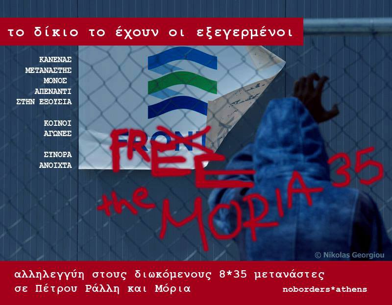

### AYS Daily Digest 19/04/18: How many more people will die on the Aegean islands?

_Rescues at sea / Protest in Turin / Aftermath of the destruction of Ventimiglia camp / Afghani man dies on Lesvos / Moria 35 and Petrou 8 trials start / Refugees forced to live on streets in Athens / Deportations from Austria / And more news…_

 \)](assets/3ec1132f00aa/1*vPbLJGos76XJzrvmt_yv1g.jpeg)

Refugees look on as the Ventimiglia camp in Italy is destroyed \(Photo by [Holes in the Borders](https://www.facebook.com/RefugiadosenAtenas/?hc_ref=ART8J7jaO2nSwNe2T43VhVU6bQwA8z2rmSgvQBDM1y9b11xUKLEHo4f-p77CxZ4ZN5g&fref=nf) \)
### FEATURE: Afghani refugee dies on Lesvos

It has been confirmed today by Greek outlets and from medical volunteers working in the Moria camp that Ali Khoshe, an Afghani refugee who was taken to the hospital earlier this week, died there\. The cause of his death has been reported as chronic cardiac illness\. However, it has also been reported that his health was made worse by the unacceptable living conditions in the camp and his constant exposure to the elements\. Given the state of the Moria camp, this comes as no surprise\. As is the case with many refugees living on the Aegean islands, he did not get adequate medical care in time\.

](assets/3ec1132f00aa/1*WbIFDkGYWEU7QyFKWInyZQ.jpeg)

Photo by [Greek Forum of Refugees](https://www.facebook.com/Greekforumofrefugees/?hc_ref=ARSUOzuCaOCwHMmiTr3NrE6P1VR-DR9L4eCc2grKzJwVKIpj09L1-GLWtO6PSVRBa-8&fref=nf)

A volunteer with the MMS medical team working in Moria confirmed that they examined the man and called an ambulance for him this past Sunday\. Following his hospitalization, a group of refugees moved to Mytilene, and camped out in the town there, demanding adequate medical treamtent and an end to their detention\.

](assets/3ec1132f00aa/1*GsYyFpSxCfXJNJFlcTiwsw.jpeg)

Photo by [Greek Forum of Refugees](https://www.facebook.com/Greekforumofrefugees/?hc_ref=ARSUOzuCaOCwHMmiTr3NrE6P1VR-DR9L4eCc2grKzJwVKIpj09L1-GLWtO6PSVRBa-8&fref=nf)

The protestors have been there for three days now, and were today visited by the Mayor of Lesvos, Spyros Galinos\. [Galinos called](http://www.lesvosnews.net/articles/news-categories/koinonia/entasi-stin-plateia-sapfoys-pethane-afganos-prosfygas-sto) the refugees’ encampment a “provocative action” that undermined relations between refugees and the Greek residents of the island\. He demanded that the group leave immediately, and threateningly warned that their protest “risks triggering dangerous social reflexes\.”

The [Greek Forum of Refugees](https://www.facebook.com/Greekforumofrefugees/?hc_ref=ARScd24TvE_2Tb0Yy0H-uD6sjwvQRvQip90sMLW6Nn_dOFI8dYsvYvzKXPQVjpTZDwQ&fref=nf) issued a statement today in support of the demonstrators on Lesvos:

> The protests in Lesvos continue after the death of a man who didn’t receive the medical care he needed\. This tragic event is another display of the suffering on the islands and the urgency for transferring the vulnerable people to the mainland\. 

> After the statement of the Council of the State, we remind that there are thousands of people still trapped under these inhumane conditions and we demand the freedom of movement to the mainland\. 

> People trapped in the islands did nothing to be detained and forced to live in these appalling conditions\. People in Moria are dying because of it\. 

> We ask for the accountability of the authorities\. We ask for the right to a dignified life\. We ask for justice\. 

](assets/3ec1132f00aa/1*4R9fVrp-tUV0iVBiDYuK3Q.jpeg)

Photo by [Greek Forum of Refugees](https://www.facebook.com/Greekforumofrefugees/?hc_ref=ARSUOzuCaOCwHMmiTr3NrE6P1VR-DR9L4eCc2grKzJwVKIpj09L1-GLWtO6PSVRBa-8&fref=nf)
### SEA

■■■■■■■■■■■■■■ 
> **[Missing Migrants Project](https://twitter.com/MissingMigrants) @ Twitter Says:** 

> > Nearly 16,000 people have died in the Mediterranean trying to cross into Europe since January 2014, and only a fraction have ever been identified. #Italy #Greece #Malta #Cyprus to launch project w/ @[TheICMP](https://twitter.com/TheICMP) to try to fix this:    @[OIMItalia](https://twitter.com/OIMItalia) @[IOMGREECE](https://twitter.com/IOMGREECE)
[afp.com/en/news/826/it…](https://www.afp.com/en/news/826/italy-greece-launch-plan-identify-missing-migrants-doc-1450j51) 

> **Tweeted at [2018-04-19 10:53:04](https://twitter.com/missingmigrants/status/986920610260496384).** 

■■■■■■■■■■■■■■ 

#### Sea\-Eye asking for donations

The [Sea\-Eye](https://www.facebook.com/seaeyeorg/) rescue organization is fundraising for their life\-saving operations in the Mediterranean\. They released some photos from yesterday’s rescues, a vivid reminder of the importance of their work\.

](assets/3ec1132f00aa/1*tUuyTpcXes-Ebxl7HTVNHg.jpeg)

Photo by S [ea\-Eye](https://www.facebook.com/seaeyeorg/)

> Our missions can only work if you continue to support us\. We are needed\. We were able to help 164 people yesterday during the hardest hours of their lives\. We could do that because you support us\. 

> Help us with an online donation here on Facebook or on our website \-> [https://sea\-eye\.org/spenden/](https://sea-eye.org/spenden/) 

> For 30 € we can buy a childrens lifejacket,
 

> for 35 € a rescue ship can drive one hour,
 

> for 100 € our lifeboat can operate for a whole day and for 500 € a crew member can be completely equipped with life\-saving equipment\. 

](assets/3ec1132f00aa/1*aaAjgKcvI8KPVWL-t4RBmQ.jpeg)

Photo by S [ea\-Eye](https://www.facebook.com/seaeyeorg/)

■■■■■■■■■■■■■■ 
> **[Sea-Watch](https://twitter.com/seawatchcrew) @ Twitter Says:** 

> > "A crew of volunteers: mission 44
A sailing boat: #Astral
And one objective above all: to protect human lives in the deadliest place on the planet, the central Mediterranean.
Because if saving lives is a crime, we're guilty." 💙 #right2rescue [twitter.com/openarms_fund/…](https://twitter.com/openarms_fund/status/986985241393983489) 

> **Tweeted at [2018-04-19 15:36:17](https://twitter.com/seawatchcrew/status/986991885133762560).** 

■■■■■■■■■■■■■■ 

#### Frontex sea rescue operation

A Portugese Frontex vessel reported “rescuing” 46 people in the Central Mediterranean today\.
### ITALY

The [Break The Borders](https://www.facebook.com/Break-The-Borders-165181757634384/?hc_ref=ARRZEyk58zBcc8Vh2ZuOeOG9JGiDh-zC7QHeFc2_TE3nc5F2HmPhV-CdRP2bk4t3_JY&fref=nf&hc_location=group) group led a protest at the Turin train station today\. They were trying to call attention to what is an invisible issue to many travellers — the harassment and arrest of refugees trying to reach France from Italy\.

As the group stated:

> A lot of these people don’t even get on that train\. Others are arrested because they are without documents\. At the departure of each train to Bardonecchia at least two cops will patrol the track accompanied by soldiers with machine guns, who almost always climb up and search wagon cars\. Every visibly black person traveling is asked for documents\. They often don’t even get a ticket\. It doesn’t matter\. If you’re black, they’ll ask you for documents, and if you don’t have them, you get thrown off the train\. 

](assets/3ec1132f00aa/1*bX7GCvGTF3dwvGOIblAahQ.jpeg)

Photo by [Break the Borders](http://Break The Borders)

Today the [Holes in the Borders](https://www.facebook.com/RefugiadosenAtenas/?hc_ref=ART8J7jaO2nSwNe2T43VhVU6bQwA8z2rmSgvQBDM1y9b11xUKLEHo4f-p77CxZ4ZN5g&fref=nf) group reported on the catastrophic results of the mass evictions that occurred recently in Ventimiglia:

> Some 200 people were left last night sleeping on the banks of the river, the beaches, and the streets of the city\. 

> The volunteers present there claim that the red cross has said that it has sufficient capacity to welcome them all but is being managed very slowly despite the fact that the news of the eviction arrived during the afternoon of the day before yesterday\. \(Source: André Naddeo\) 

 \)](assets/3ec1132f00aa/1*pFs3o3etbRNnbZOs_428Tw.jpeg)

Photos taken during the destruction of the Ventimiglia camp \(Photos by [Holes in the Borders](https://www.facebook.com/RefugiadosenAtenas/?hc_ref=ART8J7jaO2nSwNe2T43VhVU6bQwA8z2rmSgvQBDM1y9b11xUKLEHo4f-p77CxZ4ZN5g&fref=nf) \)
### GREECE
#### Recent arrivals

[Aegean Boat Report](https://www.facebook.com/AegeanBoatReport/?hc_ref=ARSDdWjPsdy7uNs1jyXN-ur53BNrKoDJcrBBxafxVW8riNHaAJs4iaeUPT4SqjC4jT0&fref=nf) announced a landing of one boat on the north shore of Lesvos at noon today\. There were 24 people on board, with 15 of them children\.
#### UNHCR Samos weekly snapshot

#### Demonstration in Athens against the Moria 35 and Petrou 8 trials

[Solidarity Space City Plaza](https://www.facebook.com/sol2refugeesen/) announced a demonstration in Athens this Friday against the trials of the Moria 35 and Petrou 8, which are beginning that day on Chios\. Both cases involve the imprisonment of refugees for protesting and demanding their human rights\. The Moria 35 are a group of refugees from Lesvos who are being tried with “rioting” after a peaceful protest occured on the island\. From [City Plaza’s announcement](https://www.facebook.com/events/380571802422943/) :

> The senseless punishment of refugees by the Police and Judicial Authorities stem from the inhumanity of the “deterrence” policies, a central part of the racist EU\-Turkey deal\. In both cases, the Ministry of Citizen Protection is responsible for the abuse of desperate people who dared to ask for their human rights, and for their asylum cases to be sped up after an imprisonment of many months\. 

> We express our deep solidarity and demand the refugees’ acquittal\. 

The demonstration is happening on April 20th at noon, click [here](https://www.facebook.com/events/380571802422943/) for more information\.
#### NoBorders to organize solidarity demonstration

The [NoBorders](https://www.facebook.com/nobordersnetwork/) network announced a solidarity demonstration to occur outside the courthouse on Chios, more information [here](https://www.facebook.com/nobordersnetwork/photos/a.660787423989153.1073741828.657905327610696/1722251014509450/?type=3&theater) \.

“We call all our friends in Chios to be present tomorrow at Chios Court at in solidarity with the 35 refugees of Moria, Lesvos\.”

The long\-time Athens volunteer [Sotiris Alexopoulos](https://www.facebook.com/sotiris.alexopoulos1?hc_ref=ARSoRJeyG20n5OuCuNyaGB9QX2-4WuEst9gr9xsX6EOUZwiP1yVzlmDjzlVS2atPEoM) described the increasingly dire situation for refugees in the city and the need for immediate housing options today:

> Along with Thessaloniki, the streets of Athens are overflowing with newly arrived refugees from Evros and the islands who are in vain looking for temporary shelter\. Camps are overcrowded and the squats — which usually solve the problem — have also overflowed and are looking for other unused large buildings\. \. 

> Is it time for the State to give up some of the many empty public buildings to those who have the possibility to run them as temporary shelter for refugees eg\. in Municipalities, Solidarity Structures, Voluntary Organizations, Associations, NGOs etc? 

■■■■■■■■■■■■■■ 
> **[Marianna Karakoulaki](https://twitter.com/Faloulah) @ Twitter Says:** 

> > Approximately 50 #refugeesGR families, mostly from Kurdish areas in #Syria, are staying in #Thessaloniki's centre as the camps in Northern #Greece are over capacity. Most of them arrived from the Greek-Turkish land border https://t.co/Xjr9K28Ol1 

> **Tweeted at [2018-04-19 17:25:31](https://twitter.com/faloulah/status/987019375004782593).** 

■■■■■■■■■■■■■■ 

Greek journalist [Daphne Tolis reported today](http://Law professor Dr. Markos Karavias has been appointed as the next Director of the @GreekAsylum Service. He has in the past served as a Special Advisor to the Greek Minister for Environment, Energy & Climate Change and has acted as counsel before the European Court of Human Rights.) a new director of the greek Asylum Service: “Law professor Dr\. Markos Karavias has been appointed as the next Director of the [@GreekAsylum](https://twitter.com/GreekAsylum) Service\. He has in the past served as a Special Advisor to the Greek Minister for Environment, Energy & Climate Change and has acted as counsel before the European Court of Human Rights\.”
### SERBIA

The [NorthStar](https://www.facebook.com/NorthStarSerbia/?hc_ref=ARTrSJZq44iXR1jzWi3mrIadBXm-CUDwa99DS4adnf9zd2jNAxN_mZ8q2ryymtCbkZY&fref=nf&hc_location=group) volunteer group in Serbia is fundraising for [The Workshop: Belgrade](https://www.facebook.com/theworkshopbelgrade/?fref=mentions&hc_location=group) group which provides activities and educational programs for refugee children in the city\. You can donate [here](https://www.gofundme.com/educating-refugees-at-the-workshop?u=18297500) \.
### BULGARIA

According to statistics released from the Eurostat agency today, over 90% of people who were granted asylum in Bulgaria were Syrian\. The country gave asylum to 1,530 Syrian people, 110 Iraqis, and 25 people who were categorized as stateless\. Last month AYS reported on the death of a Kurdish man with refugee status in the country, who died of exposure while living on the streets\. Clearly, having refugee status in Bulgaria does not mean one is living in safety\.
### FRANCE

The [Cuisine des migrants](https://www.facebook.com/lacuisinedesmigrant/?hc_ref=ARSHTV-BRpt7Pm19Ny05eGoSk7N4QQCYjZSTTBjzQlUeqsDzXpZ22woG3iryBsUTwBk&fref=nf) volunteer group reported another action taken by the Calais local government in to make the lives of refugees more miserable\. Shortly after erecting a number of stone barriers to prevent the distribution of aid in the area, local authorities saw fit to remove a bus shelter because refugees were seeking shelter under it\. A volunteer from [cuisine des migrants](https://www.facebook.com/lacuisinedesmigrant/?hc_ref=ARSHTV-BRpt7Pm19Ny05eGoSk7N4QQCYjZSTTBjzQlUeqsDzXpZ22woG3iryBsUTwBk&fref=nf) contacted the local operator of the bus to find out more, and only received evasive answers\. She then contacted the inter\-city authorities and the school bus service, who confirmed that the stop was removed because people were seeking shelter under it\.

Are the bus shelters of Calais only made for white citizens?
#### Utopia 56 releases call to action

The [Utopia 56](https://www.facebook.com/asso.utopia56/) volunteer group along with [L’Auberge des Migrants](https://www.facebook.com/AubergeMigrants/) put out a call to action for French citizens to resist the draconian new immigration laws\.

You can read the full text in French [here](https://www.facebook.com/asso.utopia56/photos/a.1086224878075970.1073741829.1059730054058786/1870272726337844/?type=3&theater) \.

](assets/3ec1132f00aa/1*1GZrwyN8PmH6AZBr5KkwiQ.jpeg)

Photo by [Esperance SP](http://Espérance SP‎)
#### Roots calls for donations

The [Roots](https://www.facebook.com/charitableroots/?hc_location=group_dialog) aid group is looking for people to help them collect old laptop batteries so they can turn them into power banks for refugees in Calais\. You can contact them on their page [here](https://www.facebook.com/pg/charitableroots/about/?ref=page_internal) \.

> The situation in Dunkirk is as dire as ever\. With new refugees arriving everyday and the makeshift centre closing soon, ROOTS have been working tirelessly to create power banks, enabling the refugees to stay in contact with groups on the ground as well as family and friends back home\. 

> If you’d like to help the situation from home, print and stick this poster in your local library, town hall, or office and collect old laptop batteries for us\. 

> Donate here: [https://www\.justgiving\.com/crowdfunding/power\-in\-a\-refugees\-hands](https://www.justgiving.com/crowdfunding/power-in-a-refugees-hands) \. 

### AUSTRIA

The right\-wing Austrian ruling party proposed harsh new legislation this week that would make it harder for refugees to become citizens\. Among other measures, the proposed bill also allows for government theft of refugees’ money and the seizure of their phones\. While the seizure of refugees’ money and property has been previously documented in the country, it has not yet been policy\.

The idea that the government has the right to steal the possessions of outcast people has disturbing historical parallels\. It is shameful that a European government would propose a law like this in the 21st century\.

The [Refugees Welcome](https://www.facebook.com/plattform.refugees.welcome/?hc_ref=ARQuHFaav62E1sAKFNNPUldS-JXwQJYUSlrWY2yCHDHYqFR0Ibjjg-7Cqereeqk4hNM&fref=nf) platform released a statement on a forced deportation flight that took off from the Vienna airport this Thursday\.

> Charter deportation Vienna — Ghana/Nigeria/Gambia\! 

> On the 19th of April 2018, people shall be deported by FRONTEX charter flight from Vienna to Ghana, Nigeria and the Gambia\! 

> Vienna airport is an international turning point for charter flight deportations to many countries\. The rightwing extremist government is determined to defend Austria’s position as European “deportation champion” — a shameful and sad distinction\! 

> The deportation to three African countries at once is organised by the European border\- and deportation agency “FRONTEX”\. 

> African countries are put under massive pressure by EU\-states to collaborate with the deportation of their own citizens\. 

> It is high time to organise resistance against the inhumane and racist deportation business\! Stop the charters of shame\! 

### GERMANY

Approximately 200 people who are living in the Fürstenfeldbruck air base protested today agains the unacceptable conditions in the facility, and the cancellation of their cash cards\. Police have been conducting arrests in the facility on a regular basis to deport people, and many are living in constant fear\.
### EU

■■■■■■■■■■■■■■ 
> **[EU_Eurostat](https://twitter.com/EU_Eurostat) @ Twitter Says:** 

> > Almost one-third of the beneficiaries of protection status in the EU were Syrians in 2017 #Eurostat [ec.europa.eu/eurostat/en/we…](http://ec.europa.eu/eurostat/en/web/products-press-releases/-/3-19042018-AP) #asylum https://t.co/8jfD99RvTZ 

> **Tweeted at [2018-04-19 09:00:00](https://twitter.com/eu_eurostat/status/986892156609712128).** 

■■■■■■■■■■■■■■ 

**We strive to echo correct news from the ground through collaboration and fairness\.**

**Every effort has been made to credit organisations and individuals with regard to the supply of information, video, and photo material \(in cases where the source wanted to be accredited\) \. Please notify us regarding corrections\.**

**If there’s anything you want to share or comment, contact us through Facebook or write to: areyousyrious@gmail\.com**

_Converted [Medium Post](https://medium.com/are-you-syrious/ays-daily-digest-19-04-18-how-many-more-people-will-die-on-the-aegean-islands-3ec1132f00aa) by [ZMediumToMarkdown](https://github.com/ZhgChgLi/ZMediumToMarkdown)._
