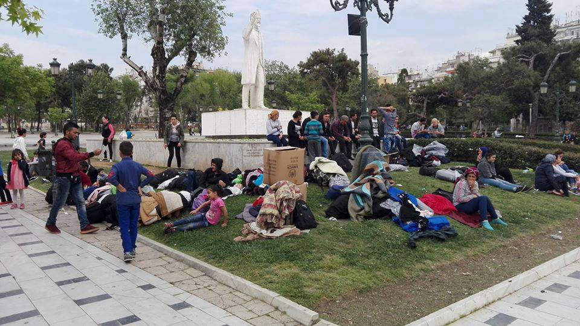
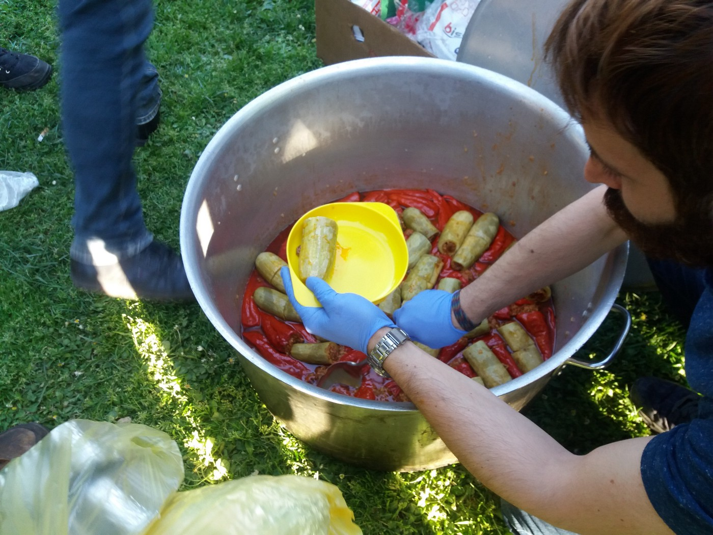
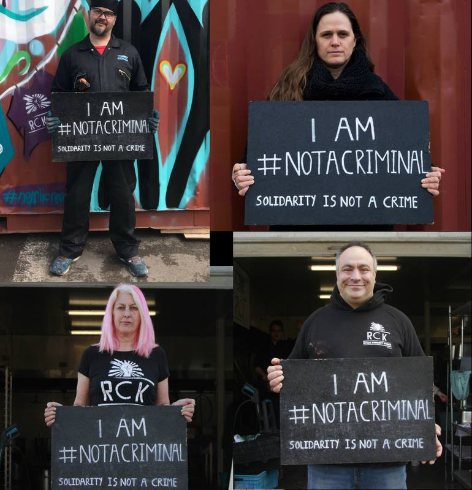

### AYS DAILY DIGEST 20/04/2018: Are we heading back in 2015?

_Number of people all over the Balkan route increases daily // Many people who have just arrived from war torn areas are forced to sleep rough in Greece, Serbia, Bosnia and Hercegovina, Montenegro… // Criminalization of volunteers’ work continues all over Europe, including Croatia and Bosnia //_

Thessaloniki, Thursday 19 April\. Photo by NoBorder Greece\.
### Feature

During the last year, 538,000 people were granted protection status in the European Union, according to Eurostat, mostly people from Syria \(175,800, or 33 percent of the total number granted protection status\), Afghanistan \(100,700 or 19 percent\) and Iraq \(64,300 or 12 percent\) \.

In 2017, as in previous years, the highest number of protection statuses was registered in Germany \(325,400\), ahead of France \(40,600\), Italy \(35,100\), Austria \(34,000\) and Sweden \(31,200\) \.

Nevertheless, people keep arriving in Europe by sea and land, many due to the fact that the war in Syria has not stopped, but the situation is not getting better in any of the countries from which the majority of migrants and refugees are coming\.

According to the UNHCR, in March, over **4,400 people entered Europe via Italy, Greece and Spain** \. Arrivals in Greece increased by almost 100 percent\. The persons who arrived in Greece mainly originated from Syria \(43 percent\), Iraq \(26 percent \) and Afghanistan \(9 percent\) \. At the land border, there were over **1,480 recorded arrivals in Evros** in March, more than double the arrivals of February\.

In the first three months of this year, some **16,640 people arrived in Europe** \. In the same period, over **480 people died or went missing while trying to reach Europe\.** At least **15 refugees or migrants died along land routes** in Europe or at Europe’s borders\.

This trend of new arrivals is very obvious in Greece, not only on the islands\. Some sources are even ready to compare this situation with 2015\. Especially in Thessaloniki, where hundreds are sleeping rough\.

Many are coming from Turkey through the river Evros\. On Thursday, according to the media [report](http://www.keeptalkinggreece.com/2018/04/20/refugees-flock-thessaloniki/) s, a group of 60 people from Afrin, Syria, including women and chilrden, slept at the main square — Aristotelous Square\. The day after, they were taken to camps in Diavata and Lagadikia\.
### Greece

More people arrived on the Greek islands on Friday\. On Lesvos alone, one boat was picked up off the east coast with 59 people on board, including 11 children\. A family of three were transported to hospital\.

In the last five days, 244 people have arrived on Lesvos\. At the same time, 60 people have come to Chios\.

Officially, from April 1 until today, a total of 2,006 peole have arrived on the northern Aegean islands\. On Lesvos alone, 1100\.

Most of the people who are arriving are coming to Lesvos\. The Pikpa community reports that the situation on this island is escalating again\. Among those who are arriving, 40 percent are children\. The majority of those who have just arrived are from Syria, followed by Iraq and Afghanistan\.

“Moria camp is bursting at the seams\. The numbers vary depending on the source\. It is likely that over 6,500 people now live in Moria camp and the olive grove\. More tents are popping up everywhere, in the olive grove and inside the camp\. The list of problems is endless, varying from a lack of interpreters \(including for medical services\) to general security\. An Afghan man, who had a serious medical condition when he arrived on Lesvos with his family, died in the hospital on Wednesday, 18 April\. Some months ago we mourned the death of a 6\-year\-old girl from Syria with a serious medical condition, who died in a cold tent in Moria\. This situation is a direct consequence of the EU\-Turkey deal, which traps people on the islands in inhumane conditions with inadequate access to basic services\.”

However, a new decision has been passed annulling the impact of the Council of State decision to open the islands for new arrivals\. Under the new decision, the asylum procedure has been made more restrictive\.

Samos is still overcrowded and more people are arriving\. Currently, over 2,100 people are living in Vhaty, the city where the camp is located\.

](assets/c12bad1cb654/1*5MJeN7fyDk0x1tZd90AMXA.jpeg)

Photo by [Orestis Seferoglou](https://www.facebook.com/orestissef)

[Eva Avdeliodi](https://www.facebook.com/852369adb?fref=mentions) reports on her FB page about the first day of the Moria35 trial\.

> “A few words about the things I saw\. 

> 1\) The picture of 30 black people as defendants and the rest around them white, is like a punch in the stomach\. 

> 2\) The translators were translating into many different languages and that was very tough\. 

> 3\) The counts of the indictment were translated summarily to the defendants, because the judge asked it be done that way\. 

> 4\) A female juror demanded to be excluded from the trial because of “ideological reasons”\. \(We all know what that means\. \) 

> 5\) There were too many cops, as if the defendants were the worst people on Earth\. Lots of undercover ones too\. 

> 6\) Body search of everyone who wanted to enter the court\. 

> 7\) Prohibition of cameras\. Videos or photos not allowed to be taken\. 

> 8 \) The judge was vixenish and aggressive sometimes\. Seems like she couldn’t organize the whole thing\. Also, we know her from previous refugee trials and… We don’t think that she’s very fair\. She also repeatedly asked the translators to translate that the charges are that the defendants “destroyed property of the Greek state and attacked policemen\.” 

The tial continues on Monday\.

 published letter by one of the 35 people arbitrarily arrested in [\#Moria](https://www.facebook.com/hashtag/moria) the day the police violently raided the camp\. Here he shares a little bit about himself and his life before that day\.](assets/c12bad1cb654/1*0_G0D3tQ_AuMr1f1Mw7t6w.jpeg)

[Lesvos Voices](https://www.facebook.com/NBKLesvos/posts/1122079537931834) published letter by one of the 35 people arbitrarily arrested in [\#Moria](https://www.facebook.com/hashtag/moria) the day the police violently raided the camp\. Here he shares a little bit about himself and his life before that day\.

One year ago, [Aitima Grece](http://refugees.gr/wp-content/uploads/2018/04/Aitima.persisting-probems-in-the-asylum-procedure.pdf) , released the report “Asylum Seekers ON HOLD” highlighting serious problems in the asylum procedure\. Almost all of the problems still persist, while some new ones have emerged:

1\. There are long delays in the first\-instance examination of the asylum applications, given that:
- \- the asylum interviews are scheduled a year after the applicants’ registration and, in the case of postponement, even if this is the responsibility of the Asylum Service, the new appointment is scheduled after another year
- \- the Asylum Service’s decisions are issued with long delays as well

2\. Many cases of vulnerable asylum seekers are not prioritized

3\. Fewer asylum seekers benefit from free of charge legal aid at the second instance\.

4\. There are long delays in the asylum seekers’ transfers to Germany under the Dublin III Regulation\. The transfers take place 11 months after Germany’s acceptance of responsibility for the examination of these cases, in violation of the six months transfer deadline of the Regulation\.

5\. Payments to the Asylum Service’s contract staff are not duly made, resulting in the Asylum Service’s limited operability due to their retention of work\.

The ticket for family reunification has changed\. More info from [Greek Forum of Refugees](http://refugees.gr/family-reunification-s-o-s/) \.

Help needed

As more people arive in Athens, [needs](https://www.facebook.com/groups/AthensVolunteersInformation/permalink/1354513621347598/) at Ellinikon warehouse are increasing\.

The Boat Refugee Foundation is looking for volunteers who can interpret in French, Arabic or Farsi for our medical mission and psychosocial support mission in Greece\. More information and [application form](https://bootvluchteling.nl/en/volunteering/interpreter/) \.
### Bosnia

The number of people who are arriving is increasing every day\. Today, only in one location in Sarajevo, over 200 people were at the distribution point\. Refugees and migrants who are already in Bosnia, together with local and international volunteers, prepared and shared a meal\. Lunch, dolma, was cooked by a professional chief from Iran who came to Bosnia with with 14\-year\-old son\.

Photo by AYS

At the same time, in Velika Kladusa, a city in the north of the country, over 250 people are on the streets\. In Bihac, the city council asked for help from the state institutions due to the incrase of people on the streets who need help\. Help is provided by locals and volunteers from [Souls of Sarajevo](https://www.facebook.com/soulsofsarajevo/) group, but more is needed in both cities\.

Meanwhile, the local police is putting pressure on volunteers and one has been called in for an interview at the Office for Foreigners on Monday\.

The people who are arriving are not provided with accommodation, food, medical care or any kind of support from the state\. Most of those who asked for help from the UNHCR are complaining, too\. IOM is taking care of medical cases and even accommodation for a number of people, but the biggest burden remains on the local population and volunteers who are trying to provide all the help they can\.

If you are considering coming to help in Bosnia, please get in touch with AYS or Souls of Sarajevo\.

**France**

[Refugee Community Kitchen](https://www.facebook.com/refugeeCkitchen/?hc_ref=ARSANfevhklEGQkRMxMfDwLRDi33BvB4JO4rJqOrb1UF1M5Deys9rd9B8t2dOkvsNAQ) , despite almost constant harassment by the authorities, has served over 2 million meals in the last two years\. And they will continue doing so\.

We join this group and all the others in condemning the Europe\-wide criminalisation and intimidation of civilian aid workers\.

**Humanitarian aid is not a crime and we are not criminals\!**

[\#notacriminal](https://www.facebook.com/hashtag/notacriminal?source=feed_text)

By Refugee Community Kitchen

[Collectif des Olieux — Lille](https://www.facebook.com/CollectifdesOlieux/?hc_ref=ARSS2xsKTOX6bPeFW_Dr-VEnId-hBT-_Q0NqIph6u_WGyYc-Ekm6vTexEK_Q1cbnvfQ&fref=nf) invites everybody to join them in the march initiated by the Committee of Undocumented Persons 59 on Saturday, 21 April\. The march is against the new asylum immigration law and it will take place from the Republic of Lille at 14 h30 \(Metro Fine Arts\) \. Visit their FB for more info\.

**We strive to echo correct news from the ground through collaboration and fairness\.**

**Every effort has been made to credit organisations and individuals with regard to the supply of information, video, and photo material \(in cases where the source wanted to be accredited\) \. Please notify us regarding corrections\.**

**If there’s anything you want to share or comment, contact us through Facebook or write to: areyousyrious@gmail\.com**

_Converted [Medium Post](https://medium.com/are-you-syrious/ays-daily-digest-20-04-2018-are-we-heading-back-in-2015-c12bad1cb654) by [ZMediumToMarkdown](https://github.com/ZhgChgLi/ZMediumToMarkdown)._
