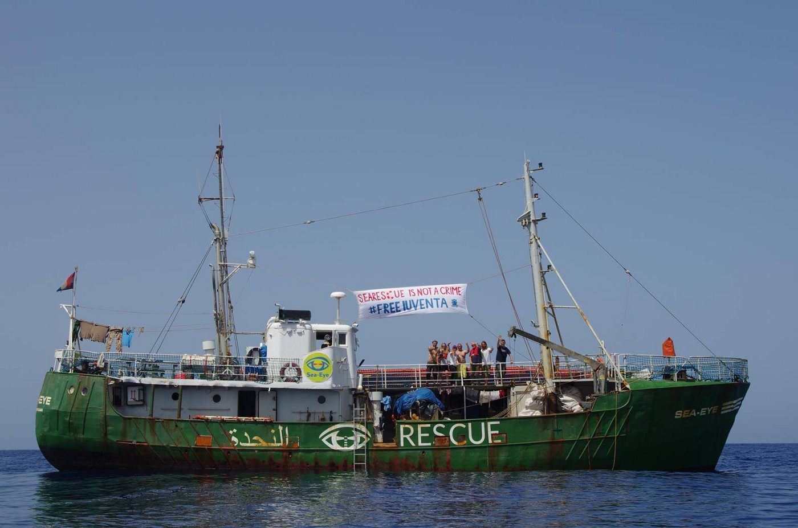
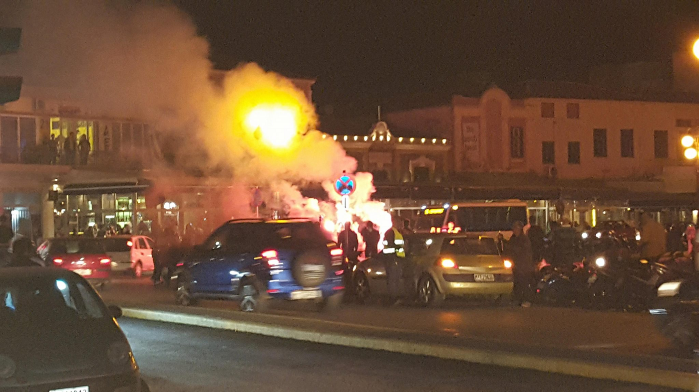
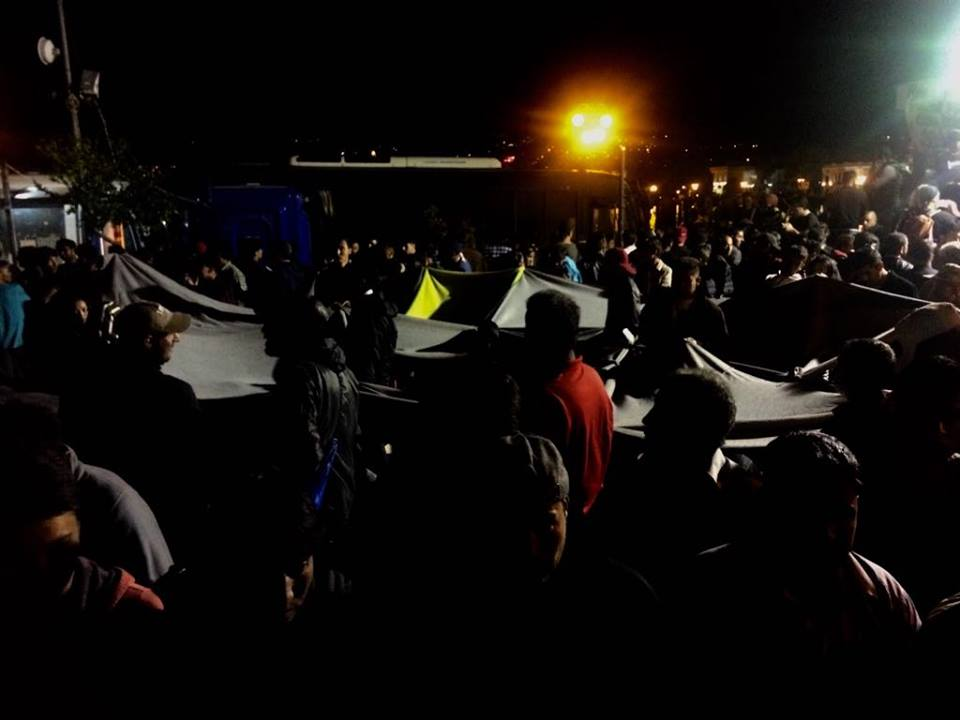
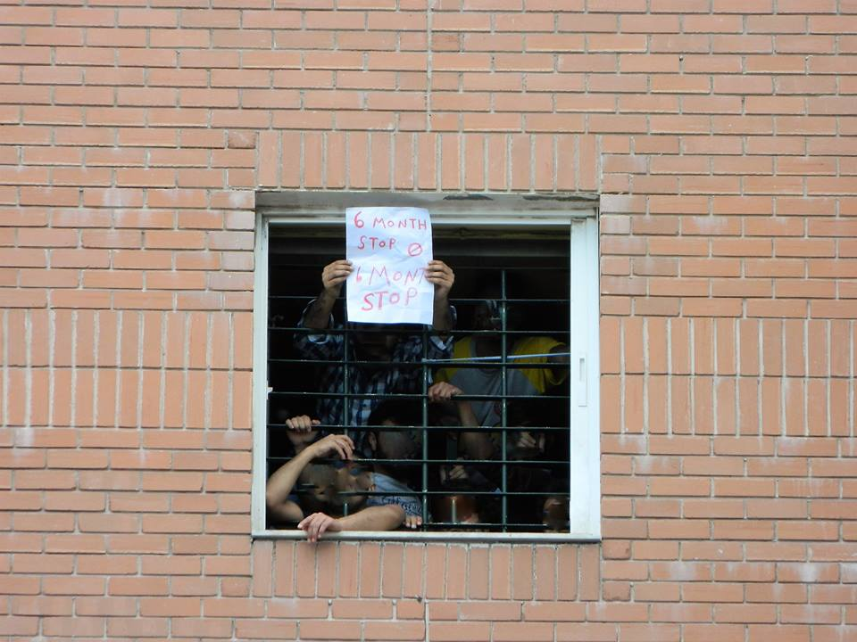
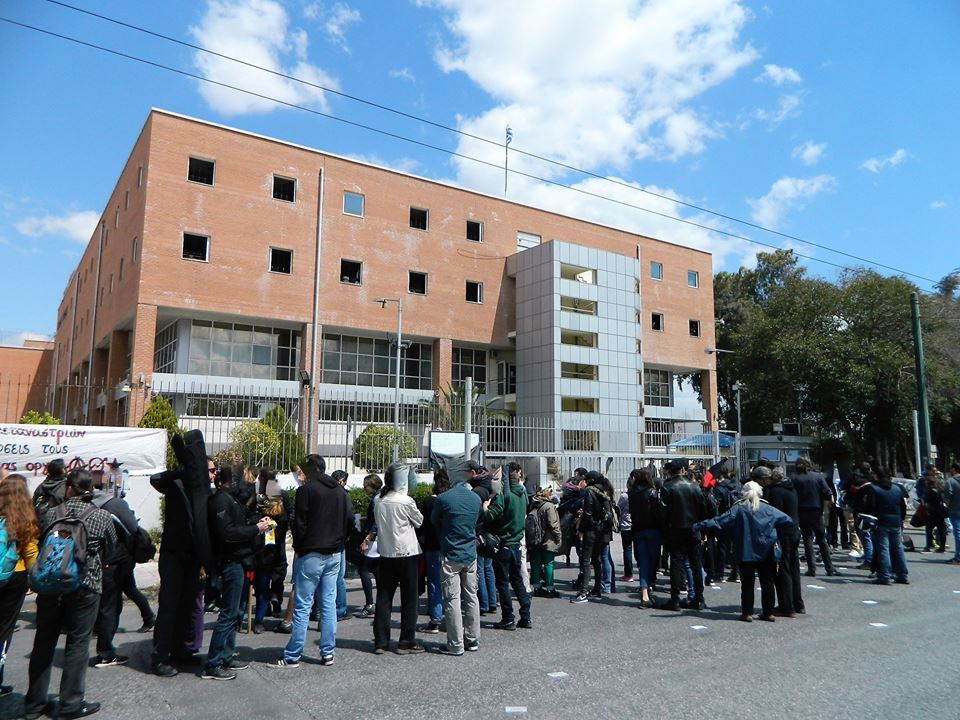
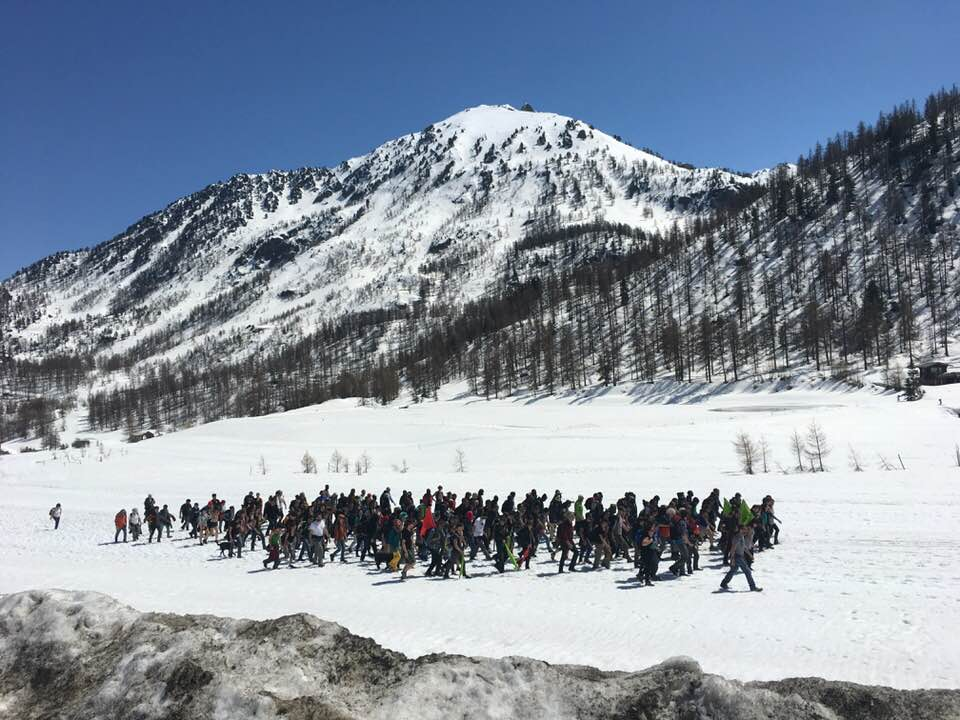
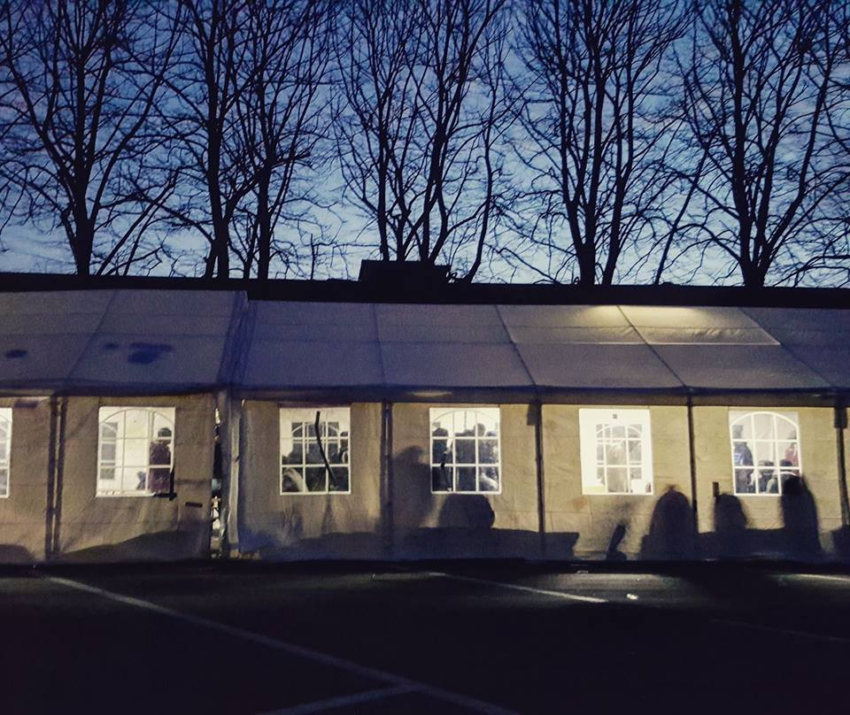

### AYS DAILY DIGEST 22/04/2018: Italian court to decide on release of rescue ship Iuventa

_Far\-right groups attack refugees on Lesvos//Génération Identitaire tries to obstruct border between Italy and France// More than 1,000 people have crossed Evros river since March//_

Solidarity with Jugend Rettet from Sea\-Eye
#### Feature

On Monday, the Supreme Court of Cassation in Rome, Italy’s highest court, will decide on the release of Jugend Rettet’s ship Iuventa\. The boat was seized after they were accused of colluding with smugglers during three different rescue operations\. An [analysis](https://blamingtherescuers.org/iuventa/) by Forensic Oceanography and Forensic Architecture shows, however, that the Iuventa crew did not return the empty boats for re\-use, nor did they communicate with anyone potentially connected with smuggling networks\. In an interview with [AYS](ays-interview-with-jugend-rettet-the-accusations-are-just-empty-claims-ba873e0f53f4) , Jugend Rettet’s Philipp Külker says the accusations leading to the seizure were fabricated\. He also notes a change in the public discourse, with more conservative and anti\-migrant views taking hold in Germany as well as in Italy\. A [petition](https://right2rescue.org/de/) has been launched by Jugend Rettet, calling for the immediate release of the Iuventa\. It has already been signed by a number of politicians and activists\.

The absolute need for rescue ships is evident every day\. Open Arms Pro Activa was able to rescue 137 people today\. SOS Méditerranée says 537 people were rescued from overloaded boats off Libya and are now safely on board the Aquarius\. Survivors escaping Libya tell of multiple interceptions by the Libyan coast guard\. The 537 include 79 people rescued yesterday by an Italian coast guard vessel as well as 458 people rescued by their own crew since 18 April\. The Libyan coast guard meanwhile says it rescued 263 people and recovered eleven bodies\. One can only imagine the number of deaths if the sea rescue groups had not been present or the potential number of additional lives that could have been saved had the Iuventa been allowed to leave port\.
#### Greece
### Far\-right attacks refugees on Lesvos

Photo by Philippa Kempson

Far\-right groups have violently attacked refugees on Sapphous Square, Lesvos, launching flares, bottles and stones at them\. Riot police have been forming a line between the two groups and the refugee men have formed a circle around the women and children to protect them from harm, using simple blankets to protect themselves from the objects hurled at them\.

Photo from Pikpa

Several people have been injured and activists say the attack was organized and planned in advance\. As a result of these attacks, it is the refugees who were forced to leave and were forcibly loaded onto buses by police\. There have been no reports of arrests of fascists so far\. The refugees have been protesting at Sapphous Square since Tuesday, criticizing their living conditions and demanding the right to move freely around the country\.

### Protest in front of the Petrou Ralli detention facility

A protest was held on Saturday in front of the detention facility Petrou Ralli, where a few hundred people remain detained under inhumane conditions, exposed to police violence and mistreatment\. The protest was another action in the campaign ahead of tomorrow’s trial in Chios against the Moria 35 and Friday’s trial in Athens against eight Algerian men detained inside Petrou Ralli\.

### IFRC warns against sharp rise in Evros crossings

The International Federation of Red Cross and Red Crescent Societies \(IFRC\) is warning that a sharp upsurge in the number of people arriving in Greece from Turkey could signal the start of a summer emergency\. More than 1,000 people have made the dangerous journey by foot from Turkey to Greece by crossing the Evros river since March\. More than 100 people have arrived every day this week\. The IFRC says the majority are women and children and notes the lack of support near the Evros river\.
#### Italy — France
### “Génération Identitaire” tries to obstruct border and anti\-fascists cross the border in return

Activists cross the border\. Photo by Rose Lecat

Around 100 members of the right\-wing organisation “Génération Identitaire” tried symbolically to obstruct a section of the Franco\-Italian border near the Col de L’Echelle on Saturday, unfurling banners with the words “Defend Europe”, installing small barriers and using two helicopters to “monitor” the border\. The show was mainly meant to impress journalists, according to [_Libération_](http://www.liberation.fr/france/2018/04/22/chasse-aux-migrants-dans-les-alpes-les-xenophobes-au-sommet_1645146) : the group was unable stop any refugees at the border, their banners and barriers were quickly dismantled and the 50 people who stayed overnight left the area hastily on Sunday\. The company that rented the helicopters also complained about Génération Identitaire’s actions, saying they had not been aware of their motives and are looking into filing a lawsuit against them\. Politicians, as well as activists, however, criticised the Government’s inaction, with the Préfécture simply stating it is “monitoring” the situation instead of actively taking action against them\. At 2 p\.m\. on Sunday, in response to the stunt by Génération Identitaire, around 300 anti\-fascists, along with 15 to 50 refugees, crossed the border from Italy to France and broke police lines to arrive in Briançon according to Calais Solidarity and the Hurriya Blog\.

Italian activists say

> “Our valleys belong to us and we can’t allow fascists to move freely a few days before the 25 April \(Italy’s liberation day\) \. The partisans gave their all on these mountains, including their lives, and would be turning in their graves” 

Hurriya says the situation remained tense in Briançon\. Five antifascists were arrested and three refugees who tried to cross independently by car were stopped together with their drivers\.
#### France
### Donations needed for Ramadan

Ramadan is starting in three weeks and Care4 Calais is preparing for the occasion\. Volunteers are needed during this time and particular donations are requested, including dates, dried fruit and nuts, bottled water and cakes to break the fast as well as tinned food and fruit juice for the pre\-sunrise meal\. Other items and a way to contribute financially are included at this [link](https://mydonate.bt.com/events/shareramadanwithrefugees/462380) \. Mobile Refugee Support is already making daily distributions of water, a need that will only increase with the rising temperatures\. You can support them financially [here](https://www.mobilerefugeesupport.org/monetary-donations) \.
#### Italy
### Baobab Experience needs donations

Baobab Experience in Rome says it is in urgent need of donations, in particular tea bags, sugar, instant coffee, blankets, brooms, dustpans, water bottles, and the disinfectant Amuchina\. Goods can be dropped off every day during food distribution, between 1–2 p\.m\. and 7–9:30 p\.m\.

> **We strive to echo correct news from the ground through collaboration and fairness\.** 

> **Every effort has been made to credit organisations and individuals with regard to the supply of information, video, and photo material \(in cases where the source wanted to be accredited\) \. Please notify us regarding corrections\.** 

> **If there’s anything you want to share or comment, contact us through Facebook or write to: areyousyrious@gmail\.com** 

_Converted [Medium Post](https://medium.com/are-you-syrious/ays-daily-digest-22-04-2018-italian-court-to-decide-over-release-of-rescue-ship-iuventa-d43005ed6ffa) by [ZMediumToMarkdown](https://github.com/ZhgChgLi/ZMediumToMarkdown)._
