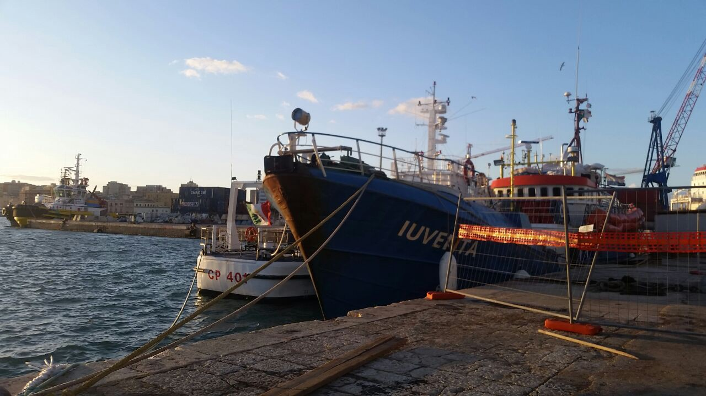
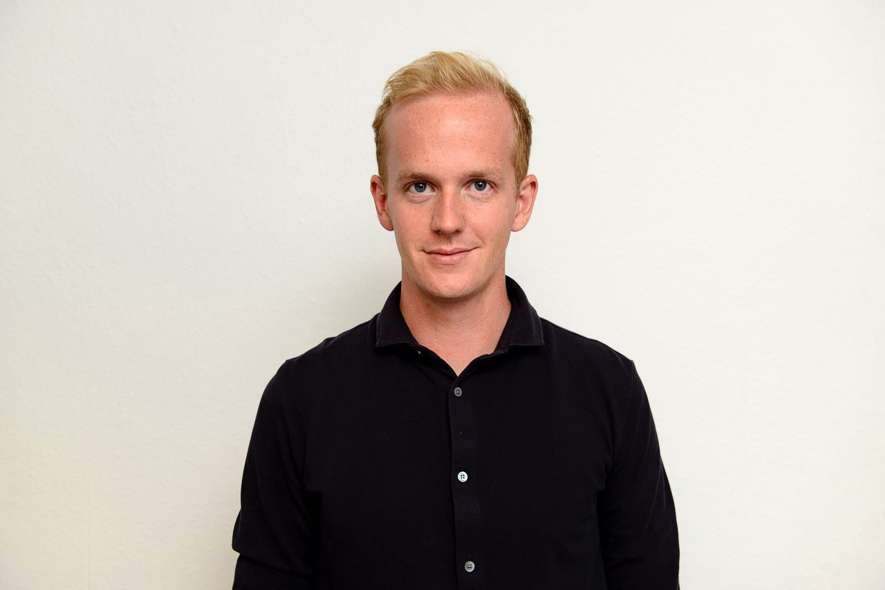
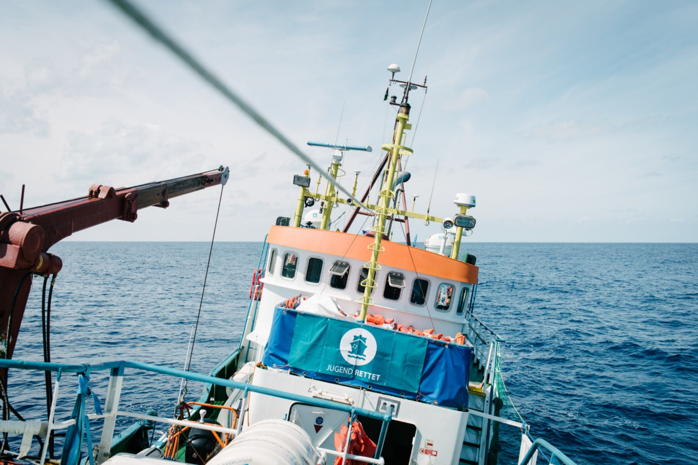
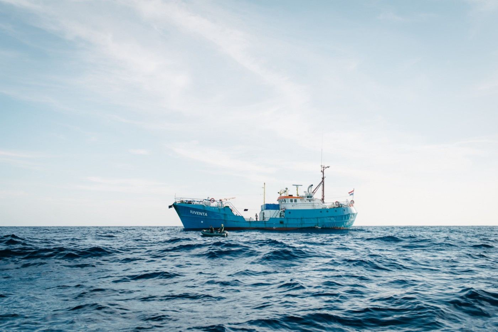

### AYS Interview mit Jugend Rettet: “Die Anschuldigungen sind nur leere Behauptungen\.”
#### Am Montag entscheidet das Kassationsgericht in Rom über die Beschlagnahmung der Iuventa\. AYS sprach mit Philipp Külker, Sprecher von Jugend Rettet über die Verhandlung, die Siutation im Mittelmeer und in Italien\.

> [Read the interview in English\.](ays-interview-with-jugend-rettet-the-accusations-are-just-empty-claims-ba873e0f53f4)

**Herr Külker, Jugend Rettet hat kürzlich ein Video veröffentlicht mit der Analyse zur Beschlagnahmung ihres Schiffs, Iuventa\. Was schlussfolgern Sie daraus?**

Philipp Külker, Sprecher von Jugend Rettet\. Credits: Jugend Rettet\.

Die Analyse wurde von den Forensic Oceanographists erstellt, sie gehören zum Recherchekollektiv Forensic Architecture mit Sitz in London\. Sie bestätigen, was wir seit der Beschlagnahmung immer wieder wiederholen: Dass die Vorwürfe konstruiert waren, die zur Beschlagnahmung geführt haben\. Sogar Beihilfe zum Menschenschmuggel und Waffenbesitz gehörten zu den Vorwürfen\. Italien wickelt den Fall über die Anti\-Mafia\-Behörde ab, um diese Präventivmaßnahme durchführen zu können\. Das ermöglicht eine Beschlagnahmung ohne konkrete Beweise\. Über eine ähnliche Methode wurde das auch bei der Open Arms gemacht\.

Die Analyse hat auf eine sehr anschauliche Weise gezeigt, dass an den Vorwürfen nichts dran ist\. Von einem aus dem Kontext gerissenen Foto wurde in italienischen und auch deutschen Medien behauptet, „da ziehen sie das Boot in Richtung libyscher Hoheitsgewässer“\. In dieser Situation auf dem Wasser trifft man allerdings nicht auf Menschenhändler\. Die wären schön blöd, wenn sie sich in dieses Risikogebiet begeben\. Es sind irgendwelche armen Personen, die vielleicht die Überfahrt ein bisschen billiger bekommen oder tatsächlich unter Androhung von Waffengewalt dazu gezwungen werden, dieses Boot zu führen\. In diesen Bildern tauchen auch immer mal wieder sogenannte „Engine Fisher“ auf\. Die bauen die Motoren in dem Moment ab, in dem die Menschen runter sind — teilweise auch schon während der Rettung\.

Wir hatten an unsere Crew immer die Ansage: An erster Stelle steht eure eigene Sicherheit\. Haltet euch auf Abstand zu diesen Leuten\. Wir wissen nicht, sind sie bewaffnet, wer ist das\. Die Lage in Libyen ist nach wie vor unübersichtlich; wir wissen nicht, wer welche Region am Meer kontrolliert, wer die Agitatoren tatsächlich sind und wie sie miteinander in Kontakt stehen\. Das heißt, alles was gemacht wird, soll erst einmal deeskalierend sein und auf die Sicherheit aller achten\.

Das Video hat anhand verschiedener Beispiele aufgearbeitet, dass allein aus technischer Sicht, beispielsweise bezogen auf den Sonnenstand, den Meeresspiegel oder den Kompass, das konstruierte Vorwürfe sind\. Für uns ist es eine gute Bestätigung, dass das auch jemand Externes sagt\. Gleichzeitig hat es auch nach außen eine Signalwirkung, dass Experten die Lage so einschätzen wie wir\. Keine der Handlungen, die uns vorgeworfen werden, haben wir in dieser Form ausgeführt\. Das sind schlicht leere Behauptungen\.

Man muss auch sehen: Seit mittlerweile fast acht Monaten ist diese Präventivmaßnahme das einzige, was passiert ist\. Es gibt keine Anklage gegen den Verein oder Einzelpersonen\. Es kann natürlich sein, dass ähnlich konstruiert noch einmal etwas kommt\. Aber wo sind die Beweise? Es ist auch eine ziemlich perfide Methode\. Denn es gibt nichts, wogegen wir juristisch vorgehen und unsere eigenen Materialien und die interne wie externe Aufarbeitung einbringen können\. Es gibt keine Basis, auf der verhandelt wird, weil es keine Anklage gibt\. Es ist eine Präventivmaßnahme und die können die italienischen Behörden — wie man sieht — über Monate durchziehen\.

Wir können gegen diese Maßnahme vorgehen\. Aber das juristische Konstrukt ist noch einmal ein anderes\. Um zu einer abschließenden gerichtlichen Entscheidung zu kommen, muss erst einmal eine Anklage erfolgen und das ist bis heute nicht passiert\. Das interpretieren wir als gutes Zeichen und fühlen uns in unserer Unschuldsbekundung bestätigt\.

**Am einfachsten für Jugend Rettet wäre es wohl, weitermachen zu können wir vorher…**

Man müsste sicherlich einiges anpassen\. Die Lage auf dem Wasser hat sich seit der Beschlagnahmung der Iuventa ganz schön verändert\. Die zwischenzeitliche Beschlagnahmung der Open Arms war ein zusätzlicher Schritt in Richtung der Kriminalisierung von Nichtregierungsorganisationen\. Aber natürlich hat sich auch das Bild in der Öffentlichkeit geändert und von Menschen, die sich engagieren\. Wir sind junge Menschen, die nicht mit angucken wollen, was da passiert, und die auf verschiedenen Ebenen versuchen, sich einzubringen, damit sich etwas verändert: Im Operativen holen wir Menschen aus dem Wasser, bevor sie ertrinken\.

Zu unserer Arbeit gehört aber auch, das Thema immer wieder in den öffentlichen Diskurs zu bringen und das wird ebenso immer schwieriger\. 2015 war „wir schaffen das“, seitdem ist eine Menge passiert\. Bei den Politiker\*innen hat sich ein Sprachgebrauch etabliert, der aus dem rechtskonservativen Spektrum geboren wurde\. Sowohl in Deutschland, aber natürlich auch in Ländern wie Italien\. Das ist ganz schön besorgniserregend, weil mal ein Funke davon zu spüren war, dass wir das Ganze begreifen: Das europäische Projekt, das sich auch öffnen und gemeinsam Aufgaben stemmen kann\. Doch dann sprang auf einmal ein Staat nach dem nächsten ab und machte dann doch wieder sein Ding\. Da muss man immer wieder den Finger in die Wunde legen und sagen: Das sind nicht die Werte, die wir als junge Europäer gerne sehen möchten\!

**Kommen wir noch einmal kurz zurück zur Beschlagnahmung der Iuventa: Was passiert bei dem Gerichtstermin am 23\. April?**

Es ist ein juristisches Vorgehen von uns, vertreten durch unsere Anwälte, gegen diese Präventivmaßnahme\. Die wurde vom ermittelnden Staatsanwalt eingeleitet und wir haben vor Ort beim Gericht in Trapani letztes Jahr im September Einspruch eingelegt\. Dem wurde nicht stattgegeben, weil es das gleiche Gericht war, das die Beschlagnahmung abgesegnet hat\. Daraufhin haben wir das Verfahren noch einmal genauer unter die Lupe genommen und geschaut, was ist gerade Gegenstand, dass diese Präventivmaßnahme bestehen bleibt? Wir haben gegen die Entscheidung des Gerichts, unseren Einspruch abzulehnen, Einspruch eingelegt\.

Das wird am 23\. April beim Kassationsgericht in Rom entschieden\. Dieses Gericht überprüft die Urteile der Unterinstanzen\. Es geht darum, ob das Gericht in Trapani anhand der Geschehnisse richtig vorgegangen ist\. Wenn am 23\. April entschieden wird, dass da Fehler gemacht wurden und nicht alles so gelaufen ist, wie es sollte, wird die Präventivmaßnahme — also die Beschlagnahmung — wieder aufgehoben\.

**Am Montag wurde die Beschlagnahmung der Open Arms nach nicht einmal einem Monat für ungültig erklärt\. Wie bewerten Sie den Fall angesichts dessen, dass die Iuventa seit nunmehr acht Monaten beschlagnahmt ist?**

Wir sehen das als ein durchaus positives Signal\. Allerdings bleiben die Anklagen gegen den Kapitän, den Head of Mission und Head of Operations weiterhin bestehen\. Da gilt es abzuwarten, wie sich der Fall weiterentwickelt\.

**Wäre im Falle einer Urteilsaufhebung geplant, sofort die nächste Mission in die Wege zu leiten?**

Wir müssten als Erstes den Zustand des Schiffs prüfen und sehen, ob durch diese Maßnahme Schäden entstanden sind\. Ein Schiff ist nicht dafür gemacht, acht Monate im Hafen zu liegen\. Dann müssten wir sehr genau prüfen, ob und in welcher Form wir ins Operative zurückkönnen\. In den acht Monaten hat sich viel verändert\. Die Lage auf dem Wasser ist noch unübersichtlicher geworden, die Zuständigkeiten sind nicht abschließend geklärt\. Da gibt es die Zwölf\-Meilen\-Zone libysches Hoheitsgewässer, die zwischendurch eigenmächtig auf 74 Meilen ausgeweitet worden ist\. Inzwischen wurde das zwar zurückgenommen, aber irgendwie scheinen diese Zuständigkeiten doch noch aktiv\. Es ist eine Grauzone\.

Die Beschlagnahmung der Open Arms hat gezeigt, dass, wenn Zweifel bestehen und die sogenannte libysche Küstenwache einer Nichtregierungsorganisation gegenübersteht, eine Anklage droht\. Der Kapitän vor Ort hat entschieden, dass die Menschen bei ihm bereits an Bord waren und er die Menschen nicht übergeben wird, weil er sonst an einem Pullback\-Verfahren teilnehmen würde\. Das ist höchst kritisch\. Wir möchten nicht mit ansehen, wie Menschen vor unseren Augen zurückgeholt werden\. Wir und andere NGOs gucken gerade ganz genau, wie man sich gegen diese aktuelle Grauzone absichern kann und wollen entsprechend unsere Handlungskonzepte anpassen\.

Wir werden aber auch nicht tatenlos am Rand stehen und uns das angucken\. Wir werden sehen, dass wir in diesem Tätigkeitsfeld unseren Platz wiederfinden\. Da sind eine Menge Aspekte, die noch geprüft werden müssen\. Wir tragen auch als Verein eine Verantwortung für die Crew\-Mitglieder\. Wir werden das Projekt aber selbstverständlich nicht begraben, wenn wir vor Gericht Recht bekommen\.

**Steht bei Jugend Rettet im Raum, vor die spanische oder griechische Küste zu gehen, wo die Zahl der Ankünfte wieder zunimmt?**

Wir haben in den vergangenen Monaten viel in andere Richtungen geschaut\. Die steigenden Zahlen sind eine relativ junge Entwicklung, das beobachten wir durchaus\. Vor ein paar Monaten, als wir diese Gedanken hatten, haben wir unter anderem mit Organisationen vor Ort gesprochen\. Aktuell sind diese Gebiete nicht unser Schwerpunkt\. Aber wenn es brennt, werden wir gucken, was wir machen\. Es ist also nicht ausgeschlossen, das Projekt mit einer anderen Fahrtrichtung weiterzudenken\. Erst einmal sind wir aber voll auf den 23\. April fokussiert und gucken, was von Italien für ein Signal gesendet wird\. Wenn wir das Schiff nicht zurückkriegen, werden wir trotzdem aktiv bleiben\. Die Überlegungen gehen in verschiedene Richtungen, da ist aber noch nichts final entschieden\.

Blick auf die Iuventa an Bord\. Credits: Jugend Rettet

**Was haben die Mitglieder in der Zeit gemacht, als die Organisation untätig bleiben musste?**

Die Seefahrer\*innen waren teilweise auch mit anderen Organisationen unterwegs\. Es ist ja eine enge Community\. Viele haben die Zeit auch genutzt, sich mal wieder um ihre Berufe und Ausbildungen zu kümmern\. Ansonsten hatten wir als Verein den klaren Fokus, dieses Juristische, das wie ein Brocken auf uns draufgeschmissen wurde, ein bisschen von uns runterzurollen\. Wir haben uns sortiert und strukturiert\. Es waren viele Themen, bei denen keiner damit gerechnet hatte, dass sie einmal so relevant und so vereinsdominierend sein werden\. Am 2\. August 2017, dem Tag der Beschlagnahmung, ging es in den italienischen und deutschen Medien richtig rund\. Das zog sich über Wochen, die ganzen Scherben aufzukehren und abzuwägen, was die nächsten Schritte sind, um das Schiff zurückzubekommen\.

Dies hat durchaus Umstrukturierungen mit sich gebracht, weil es für den Moment nichts Operatives mehr gab und der Fokus mehr auf den juristischen Belangen und der Öffentlichkeitsarbeit lag\. Auf der einen Seite mussten wir auf den Fall der Iuventa aufmerksam machen und gleichzeitig in Monitoring\-Funktion über unsere Vernetzungen über die aktuellen Themen kommunizieren\.

**Laut IOM ist die Zahl der von Libyen ablegenden Boote gesunken, gleichzeitig sterben proportional mehr Menschen auf der Überfahrt als im Vorjahr\. Wo sehen Sie die Ursache dafür?**

Dass weniger Menschen kommen, kann man unter anderem auf das Vorgehen der libyschen Küstenwache und auch die Situation auf dem Festland zurückführen\. Da ist auch Europa mit dran beteiligt, dass die Menschen gar nicht mehr bis aufs Wasser kommen und es schon vorher Abschottungsmechanismen gibt\. Diese fangen schon in südlicheren Ländern Afrikas an, etwa mit — sogenannter — Bildungsarbeit, dass es in Europa gar nicht so schön und toll ist\. Trotzdem sitzen noch immer viele Menschen in Libyen fest\.

■■■■■■■■■■■■■■ 
> **[Jugend RETTET - IUVENTA](https://twitter.com/jugendrettet) @ Twitter Says:** 

> > In January 2017, 254 people died on the central Med. By January 2018, there are 243 people who lost their lives. But instead of sending rescue ships, NGOs like us or @[openarms_fund](https://twitter.com/openarms_fund) are put on the chain! #FreeOpenArms #freeiuventa [missingmigrants.iom.int/region/mediter…](https://missingmigrants.iom.int/region/mediterranean) https://t.co/ge1n2xcdDt 

> **Tweeted at [2018-04-11 12:58:00](https://twitter.com/jugendrettet/status/984052948568330241).** 

■■■■■■■■■■■■■■ 

Aktuell sind nur drei Organisationen, Sea Watch, SOS Mediterranee und seit Kurzem Sea\-Eye, auf dem Meer\. Das ist die zivile Flotte und das Gebiet ist riesig\. Schon seit Längerem kommt keine vernünftige europäische Reaktion, die der Situation gerecht wird\. Das sieht man auch an eben diesen Todeszahlen\. Es ist heftig\. Das sind viel zu viele\. Es sind laut IOM in diesem Jahr 359 Menschen, die vor unseren Augen ertrinken oder vermisst werden \(Stand: 17\. April\) \. Es gibt ja auch eine Dunkelziffer, nicht die ganze Fläche ist abgedeckt\.

■■■■■■■■■■■■■■ 
> **[Missing Migrants Project](https://twitter.com/MissingMigrants) @ Twitter Says:** 

> > This year’s 500+ deaths recorded in the Mediterranean have occurred despite a steep drop in total arrivals. Already this year nearly 140 irregular migrants have died trying to reach Spain, or about 2/3 the 2017 total – yet with 3/4 of the year remaining.
[bit.ly/2GHPjjH](http://bit.ly/2GHPjjH) https://t.co/FmPJDUfSqD 

> **Tweeted at [2018-04-09 09:44:01](https://twitter.com/missingmigrants/status/983279354443649024).** 

■■■■■■■■■■■■■■ 

**In Italien wurde kürzlich gewählt, vermutlich wird sich eine rechtsgerichtete Regierung formen\. Wie beurteilen Sie die politische Lage?**

Wir sehen die Entwicklung in Italien, aber auch in Deutschland, mit Sorge\. Populistische, rechte Stimmen sind derzeit sehr laut an und unsere Stimme findet deswegen nicht immer das Gehör, das sie verdient\. Es ist auf jeden Fall nicht das Arbeitsumfeld, das man sich wünscht\. Gleichzeitig ist es vielleicht genau deswegen wichtig, dass sich Menschen für die Seenotrettung engagieren\. Es sind ja nicht nur externe Freiwillige, sondern auch Italiener\. Ich war vor zwei Jahren auf Sizilien und fand es sehr beeindruckend, wie die Insulaner mit der Situation umgegangen sind\. Damals sind wirklich noch jeden Tag Schiffe angekommen\. Die Sizilianer haben gesagt: Wir sind eine Einwandererinsel, das war schon immer so\.

■■■■■■■■■■■■■■ 
> **[UNHCR, the UN Refugee Agency](https://twitter.com/Refugees) @ Twitter Says:** 

> > Warm #welcome in Palermo, #Sicily on Friday as survivors of the latest #Mediterranean shipwreck disembarked. #Italy http://t.co/rbv8QYOQwX 

> **Tweeted at [2015-08-09 11:33:56](https://twitter.com/refugees/status/630341234154975232).** 

■■■■■■■■■■■■■■ 

Das Wahlergebnis lässt mich aber vermuten, dass die Menschen auch dort nicht mehr mit so offenen Armen empfangen werden\. Da müssen wir uns auch in Deutschland an die eigene Nase fassen\. Seit dem „wir schaffen das“ ist eine Menge passiert, bei den rechtspopulistischen Sprüchen dreht es mir den Magen um\. Dieses Bild ist so konträr zu den humanistischen Beweggründen, aus denen wir handeln\. Umso wichtiger ist, dass es gemacht wird\.

**Die gesellschaftliche Debatte hat sich in den vergangenen Monaten zweifelsohne verändert\. Davon waren auch die Seenotrettungs\-Organisationen betroffen\. Sie wurden etwa beschuldigt, einen Taxi\-Service auf dem Mittelmeer anzubieten und die Migration zu beschleunigen\. Wie hat das die Arbeit von Jugend Rettet beeinflusst?**

Seit es Jugend Rettet gibt, haben wir auf den verschiedenen Kanälen konstant mit rechtem Hass zu tun\. Wir haben dafür gute Filter und einen guten Umgang\. Da fährt jede Organisation ihre eigene Strategie, manche reagieren darauf, andere nicht\. In unserer alltäglichen Arbeit beeinflusst uns das eigentlich nicht\. Wenn mal eine E\-Mail durch unsere Filter durchkommt, ist es für uns eher belustigend, mit welchen verschrobenen Weltansichten die Menschen ihren Hass auf uns projizieren\. Aber wir unterschätzen es natürlich auch nicht, es ist ernst zu nehmen\. Hier sehe ich auch eine gewaltige Arbeit in den kommenden Jahren auf politischer Ebene, um diese Stimmung wieder in eine andere Richtung zu lenken und nicht dieses protektionistische und die „guten alten Werte vor dem fremden schützenden “ sich weiterentwickeln zu lassen\. Der Gedanke des Humanismus ist ein wichtiger, den ich an dieser Stelle gerne mehr sehen würde\.

**Hatten Sie den Eindruck, dass sich durch diese von rechten Strömungen dominierte Debatte die politische Lage verändert hat, die auch letztendlich zur Beschlagnahmung der Iuventa geführt hat?**

Ich weiß nicht, inwiefern die öffentliche Debatte tatsächlichen Einfluss auf politische Entscheidungen hat\. Ich denke, es beeinflusst sich gegenseitig, irgendjemand wählt ja auch diese Leute\. Es sind Meinungen, die in der Bevölkerung vorhanden sind\. Wenn ich mir anschaue, wie die Reaktionen auf das Projekt Jugend Rettet vor zwei oder anderthalb Jahren waren, ist es auf jeden Fall etwas anderes: Zum einen im Sinne der Aufmerksamkeit, die der Seenotrettung gegeben wird, zum anderen des Bildes der Öffentlichkeit von den Organisationen\. Der Vorwurf des Menschenschmuggels ist schnell und laut ausgesprochen\. Um dagegen anzugehen, muss man sich mit knallharten Fakten ganz schön lange wehren\. Da bleiben auf Vernunft basierte Argumente oder rechtliche Fakten in der Konversation meistens zu leise\.

Jugend Rettet war eine der Organisationen, die beschuldigt wurde, illegale Migration zu beschleunigen\.

**Hat sich diese Veränderung des Diskurses auf die Suche nach neuen Freiwilligen und Unterstützern ausgewirkt?**

Die Spenden sind relativ konstant unübersichtlich gewesen, eine richtige Regelmäßigkeit war darin selten zu erkennen\. Außer in den Sommermonaten, in denen das Thema wegen der hohen Zahl an Überfahrten medial präsenter war\.

Wir hatten immer eine sehr professionelle Crew\. Es waren beispielsweise Ärzte, die kurz nach der Ausbildung standen oder gerade dabei waren\. Auf jeden Fall waren sie der Aufgabe gewachsen\. Auch die Kapitäne und Kapitäninnen waren ausgebildet\. Wir haben sehr darauf geachtet, dass alle Zertifikate wie vorgeschrieben vorhanden sind\. Wir hatten nie Probleme, die Crews auf einer professionellen und guten zwischenmenschlichen Ebene zusammenzusetzen\. Zum Glück gibt es nach wie vor genug Menschen, die sich für dieses Thema interessieren\. Es kamen auch immer wieder Freiwillige zurück, die über die Jahre eine Expertise entwickelt haben\. Beim zweiten Mal hat man eine Menge Erfahrung, die man im wahrsten Sinne des Wortes mit an Bord bringt\. Die Balance war immer ziemlich gut\.

**Sie hatten zum einen das Problem, dass sie nicht operativ tätig sein konnten, zum anderen ist auch das juristische Verfahren wahrscheinlich kostenintensiv\. Wie sichern Sie die langfristige Arbeit?**

Wir haben keine größeren Ausgaben in den Monaten gehabt\. Da ging nicht das gleiche Geld raus wie zuvor, eine zweiwöchige Mission hat 20\.000 Euro gekostet\. Wir haben genauso wie andere Seenotrettungs\-Organisationen gesehen, dass die Spendenbereitschaft sinkt\. Nicht dramatisch, aber die Tendenz ist nicht mehr steigend\. Damit muss sich jede Organisation in der Seenotrettung auseinandersetzen\. Wir haben eine gute Basis an Dauerspender\*innen\. Das wird auch spannend, wie sich diese Tendenz im kommenden Jahr entwickelt\. Umso wichtiger ist es, die notwendige Aufmerksamkeit in der Öffentlichkeit zu generieren\. Was die Bevölkerung nicht weiß, macht sie nicht heiß\. Nur weil das Thema Mittelmeer nicht mehr in den Leitmedien zu finden ist, heißt es nicht, dass es vom Tisch ist\. Daran arbeiten wir\. Auch mit Politiker\*innen sprechen wir über dieses Thema, als Organisation aber auch im Zusammenschluss mit anderen NGOs\. Damit das Thema nach wie vor auf der Liste der Themen steht, die wir noch als Europa zu klären haben\.

**Welche Schritte sind als Nächstes geplant?**

Im Moment ist alles sehr stark auf den 23\. April fokussiert\. Wir sind aufgrund der Faktenlage und dem Zuspruch externer Experten sicher, dass sich das Gericht für eine Freigabe entscheiden muss\. Dementsprechend gehen auch die anderen Bemühungen und Überlegungen dahin, wie eine Rückkehr ins Operative aussehen könnte und welche Aspekte geklärt werden müssen\. Die Entscheidung ist der Dreh\- und Angelpunkt\. Wir wollen auch keine Arbeit verrichten, die ins Nichts läuft\. Dafür sind unsere Kapazitäten zu gering\. Wir sind eine Freiwilligenorganisation\.

Wir bereiten uns vor, verschiedene Optionen in der Hand zu haben\. Je nach dem wie das Gericht dann entscheidet, werden die nächsten Schritte eingeleitet\.

**Was wünschen Sie sich von der EU?**

Wir haben eine Menge Sachen, die wir uns nicht wünschen\. Die sich ändern müssen\. Ich persönlich wünsche mir, dass das Thema Migration mit einer größeren Ehrlichkeit und Aufrichtigkeit von den europäischen Staaten angegangen wird\. In der nicht einzelne Länder mit großen Geflüchtetenzahlen allein gelassen werden, sich andere aus der Verteilung rausnehmen\. Ich wünsche mir, dass sich die Tendenz, die ich meine zu erkennen, endet, das Problem immer weiter von den Augen der Europäischen Union wegzuschieben, weiter rein in die nord\- und zentralafrikanischen Länder\. Da werden schon entsprechende Sicherheitsbarrieren errichtet, um diese „Festung Europa“ weiter zu beschützen\.

Da wünsche ich mir eine realistische Auseinandersetzung, die den Menschenrechten entsprechend geführt wird\. Sie sind eindeutig und können nicht durch lokale Gesetze gebogen werden\. Trotzdem sehen wir, dass das immer wieder passiert\.

**\(Interview von Niklas Golitschek, AYS Volunteer\)**

> **We strive to echo correct news from the ground through collaboration and fairness\.** 

> **Every effort has been made to credit organisations and individuals with regard to the supply of information, video, and photo material \(in cases where the source wanted to be accredited\) \. Please notify us regarding corrections\.** 

> **If there’s anything you want to share or comment, contact us through Facebook or write to: areyousyrious@gmail\.com** 

_Converted [Medium Post](https://areyousyrious.medium.com/ays-interview-mit-jugend-rettet-die-anschuldigungen-sind-nur-leere-behauptungen-80850d927a3c) by [ZMediumToMarkdown](https://github.com/ZhgChgLi/ZMediumToMarkdown)._
