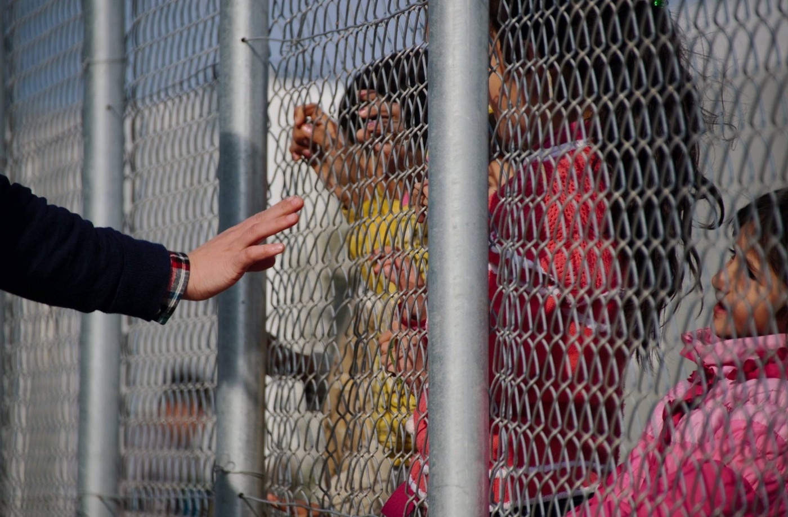

### AYS SPECIAL: A First\-Hand Account of Detention on the Aegean Islands

_This article is written by a refugee living on one of the Aegean islands who was detained for four months simply because his asylum case was rejected\. The author’s name and the island he was detained on are being kept anonymous\. Publicizing the author’s name would likely get him in trouble with the authorities, and complicate his ongoing case\. We are not naming the island because his identity could be exposed by his location_

](assets/6e2d7ad20a/1*BroXgAQJer4LEDIb8fk_BA.jpeg)

Refugee protesting on Lesvos, 24/04/17\. Photo Credit: [Arash Hampay](https://www.facebook.com/photo.php?fbid=455431924802899&set=p.455431924802899&type=1&opaqueCursor=AboLJmzscGOARGr-wOuqRNCgakMsDHllqnYoIhRUpIM59_un-x3UFvMAz2v4xnGFy436vJcvMetPfN6HmD4QxOlLAvSCCQRNvAGZ3_hIkW4s8z_yjKz0GWl5_t5cMCn3i8HhM_F0v8EoUFBcX2uhZdEaxxJXuE-TDkZEFpmlXNmwTWvrnsvgaveH1Yho1KY32LFSAkP-oSrjAttXuK5BLJe3qTZwDSGyiZ-Ue-j3bLaC6VSsLZHqG_TGvgOXiW_Bxy0-iU-Sn2XSAAIDMnJoGdUmYxdQtZiuU7X0D262MDzEhdRYlfvjH-wDE1WgmJSSNOEs3Q06bieuFq1JiiOA08N-KF3K95KpcmR7AWhCgCQXh0MgvC0UZfzlnnfTGok4-j5WyVDhxdJl_I1YBG34sNJjQPO3k45_9CgGVuMxv0mLC2MBNlA69bsBHK9WME6yR1R0i6Rbey2dRIJ_lLdbqi_Y&theater)

Hello\. My name is — — — \- \. I am from Syria and I am 24 years old\. My story on the Greek Island of — — — started on the 11th of October 2016 — that is the date I arrived on the island\. Immediately I felt like an object because of the way the police acted with us\. They started drawing numbers on our hands and at that moment you feel like you are not a human anymore — you are just a number in the hands of the authorities and the system… and that feeling has never changed\.

The police brought us to the camp where I saw so many different things\. I saw minors not being treated as minors and not being legally protected\. Their rights are not protected by Greece or EU representatives such as the “Asylum Services” on the island intentionally — treating them as if they are adults and making their cases as if they are adults\. They live in the same miserable and dangerous circumstances in the camp\.

Refugee children in the detention camp on Chios, 02/04/16\. Photo Credit: Benjamín Julian

Then what I saw was also very poor medical help\. There are people in the camp — old people, very young children, children with disabilities, people with mental health issues who are not taken care of sufficiently just because they don’t have the means; they don’t have the money necessary or they don’t care enough to do so\. There are no medical check ups\.

Always, I have the question: what if there were a bad infection going around that is contagious from mouth to mouth with the people living in the camp so close together and so crowded\. Like guys, everyone will get sick so easily…

Also I saw how gay rights are not really protected, and how they are discriminated against, how gay people get attacked in the camp, because of their sexual orientation\.

Then also on a more personal level I got attacked because I converted to Christianity which was very scary and a dangerous process\. I was not able to exercise my freedom of religion because I feared for my health and for my safety and for my life, really\. And I did report these attacks to the police, to the UN and the asylum service… and no action was taken\. So, all the responsible authorities, domestically and internationally, could not protect my rights to freedom of religion\.

And also while all this was going on there are people from Germany and from other EU countries and European institutions who are supposed to control the conditions in the camp and control the way the authorities work but they just stood aside and did nothing…

What I also saw was a lot of police violence so often, you had people fighting and the police breaking them up very heavily with heavy arms\. They would beat people — they would break people’s bones, sometimes they shot live bullets into the air to scare people even if the fight was between the unaccompanied minors\.

Which I saw more of when I got my second rejection and got into jail\. First of all let me say: I got my second rejection, yes, but it was not my final rejection so they did not have any reason to put me in jail\. They didn’t have justification to put me in jail because I still have my third rejection and one more appeal so my case is not closed yet\. Nevertheless they put me in jail with no explanation whatsoever and they also put me in jail with the same people that commit violent crimes\. So there’s no difference made between people who come because of paper issues and people that commit actual crimes, or people who have mental health issues which is bad for both sides\.

What’s more, I saw minors also in jail\. There is again no difference made between adults and minors\. So the minors are with grown men that have committed serious crimes — that could have a seriously bad impact on them mentally, and even maybe stimulate them to commit crimes later\.

Then the police basically treat you like an object\. You get woken up at night\. You don’t really get any food and you are always cold because they don’t give you enough blankets to sleep on\. They come they hit you they beat you they yell at you, they broke one guy’s leg, they took 300 euros from another guy because he was black and the police are so racist against the refugees and of course people with black skin… and all this without explanation whatsoever\. You couldn’t question or report it\.

Even when the UN came and we tried to report everything, no action was made\. Again the EU should’ve been there and the German police officers were there to control the conditions in the jail, but they came and they know what’s going on\.

We went into a hunger strike for a couple of days because we were always cold and didn’t have enough blankets and the German police did nothing\.

No one really cares if we will die or not… so clearly the regulation of the EU and these mechanisms does not work\.

](assets/6e2d7ad20a/1*JlxS9LQ8IaKcIf89nfzZfw.jpeg)

Photo Credit: [Art Against](https://www.facebook.com/artagainstproject/)

_The author of this article runs a Facebook page called “ [A Better World with Refugees](https://www.facebook.com/Better-world-with-refugees-222377378327792/) ”, where he posts information and his own op\-eds\._

> **We strive to echo correct news from the ground through collaboration and fairness\.** 

> **Every effort has been made to credit organisations and individuals with regard to the supply of information, video, and photo material \(in cases where the source wanted to be accredited\) \. Please notify us regarding corrections\.** 

> **If there’s anything you want to share or comment, contact us through Facebook or write to: areyousyrious@gmail\.com** 

_Converted [Medium Post](https://medium.com/are-you-syrious/ays-special-a-first-hand-account-about-detention-on-the-aegean-islands-6e2d7ad20a) by [ZMediumToMarkdown](https://github.com/ZhgChgLi/ZMediumToMarkdown)._
