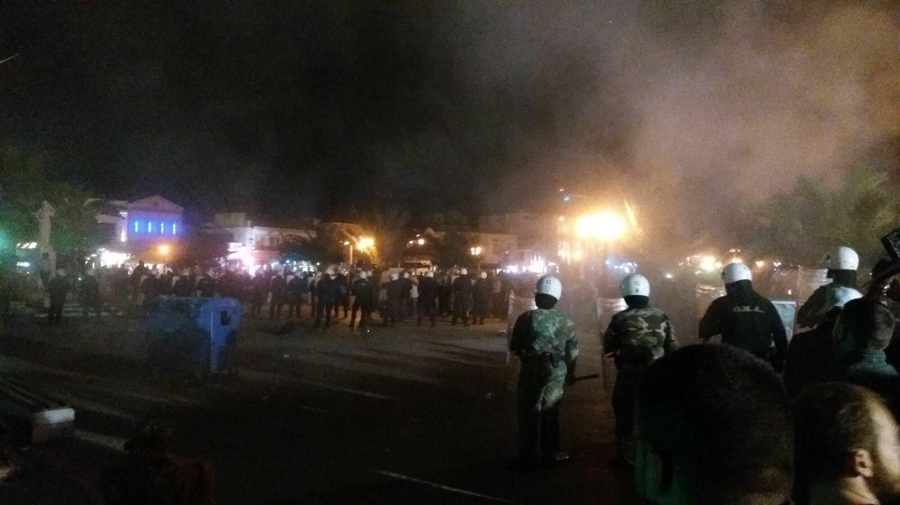
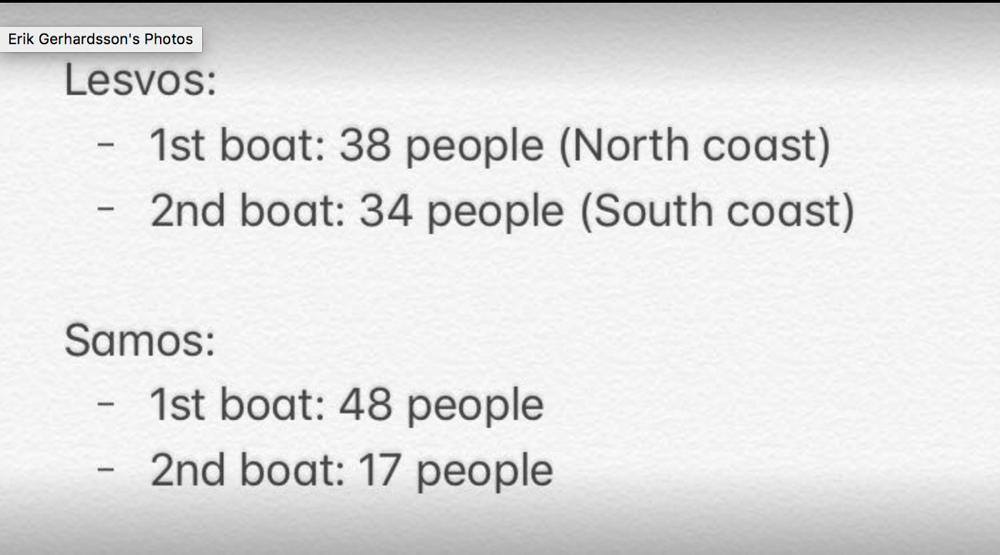
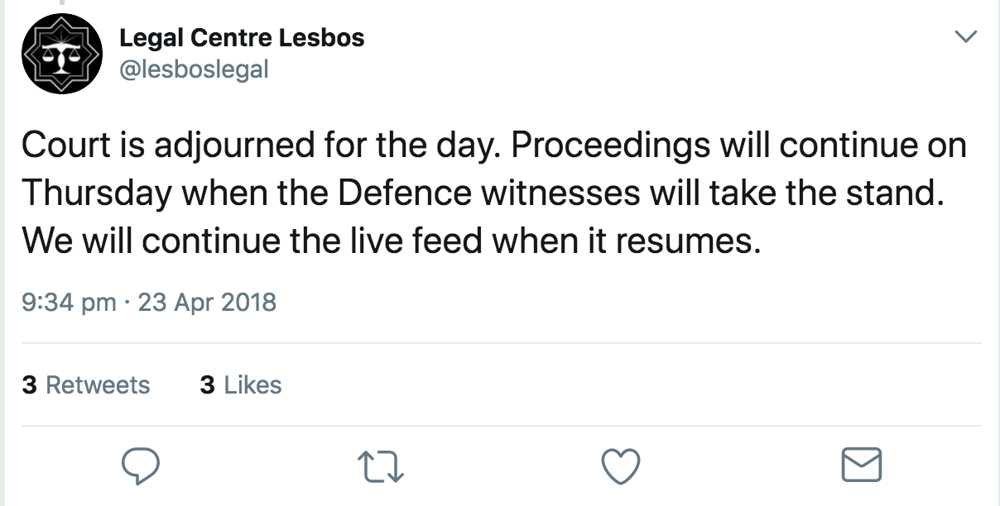
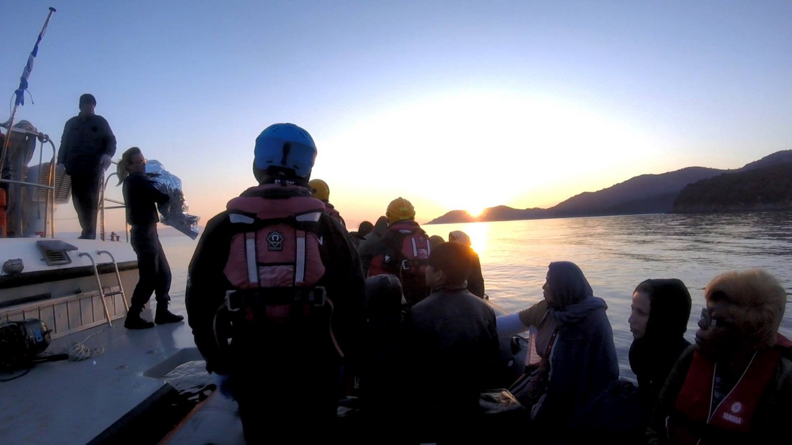
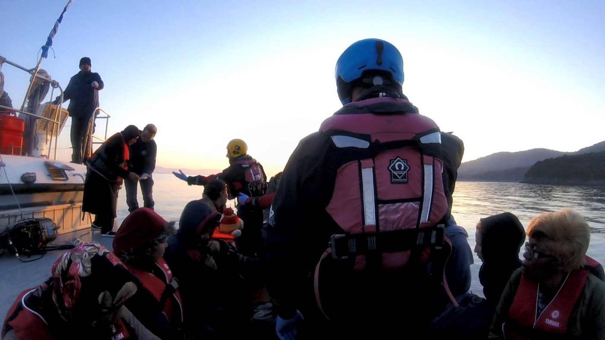
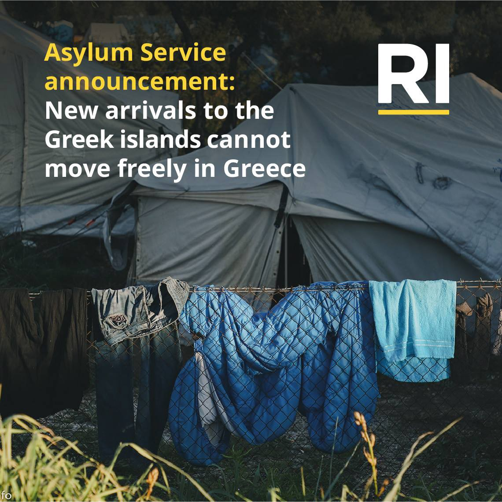
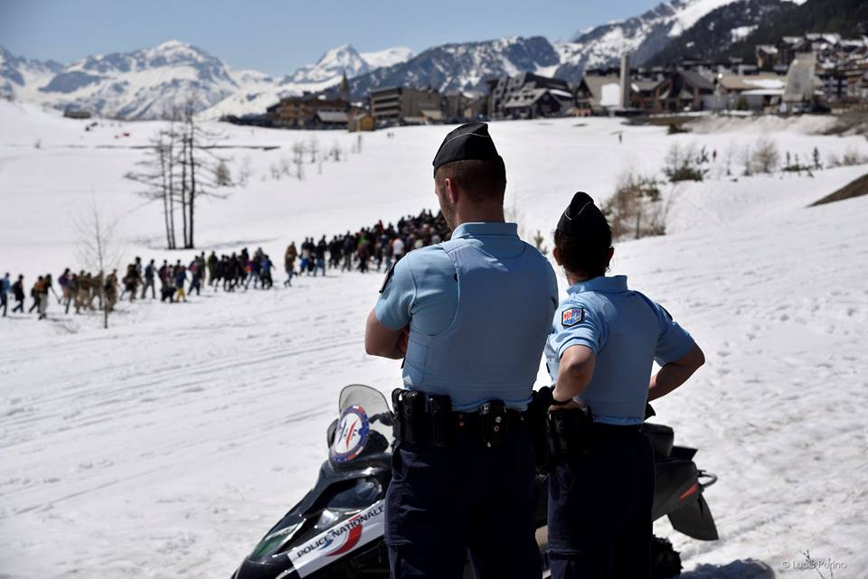
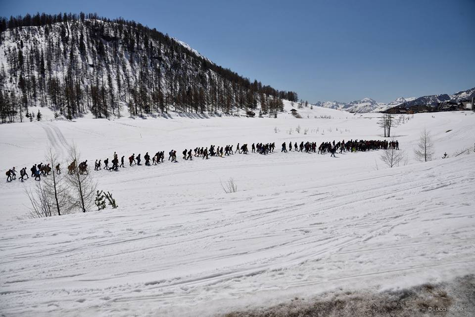
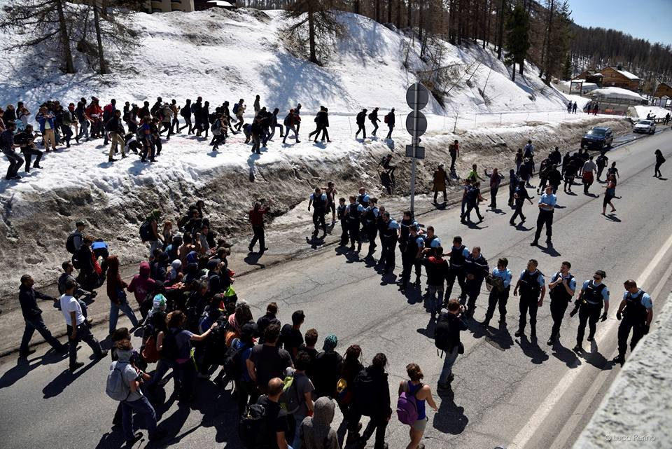
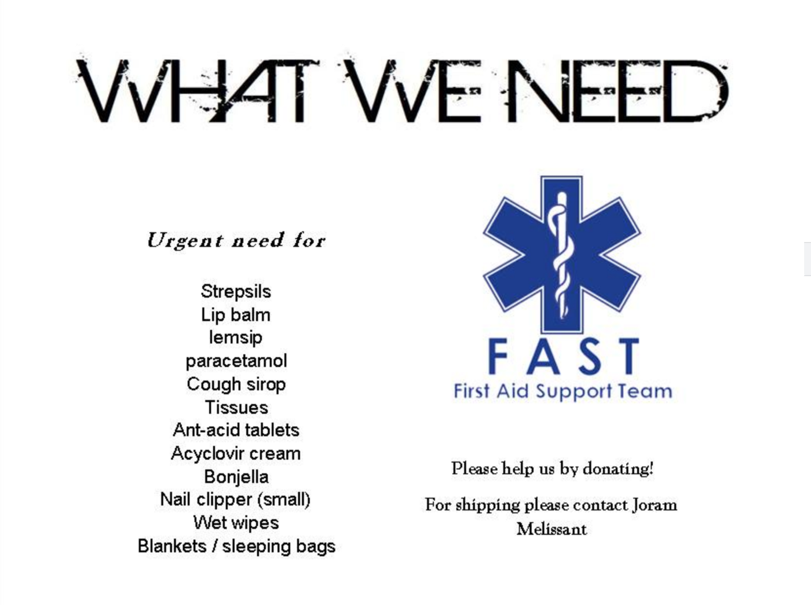

### AYS Daily Digest 23/04/18: Fascists attack Refugees on Lesvos

121 refugees arrested after being assaulted by fascists in organised attack// Multiple rescues at sea// 25 year old woman dies on the Mediterranean// Four boats arrive to Aegean Islands// Update on Moria 35 trial// More news from Greece// Geographical restrictions in Greece to continue// Caritas program provides housing in Bulgaria// Protesters cross from Italy to France// News from Germany// London// Norway

Photo by Cookie Arnone
#### FEATURE:

On Sunday night around 200 fascists viciously attacked a group of protesting refugees in Mytilene, Lesvos\. The protesters from the Moria camp have been in Sappho Square since an Afghani man died last week after failing to receive needed medical care\. The protestors are demanding access to basic human rights, adequate treatment in the camp, and an end to their detention\.

At around 8 PM, a large group of fascist people gathered near Sappho Square in Mytilene, ostensibly to hold a “flag ceremony”\. It seems likely that this “flag ceremony” was simply a pretext for the assault\.

The fascists decided to come to the area where refugees were protesting, and many had allegedly arrived from various locations on the mainland\. All of these details paint the picture of a calculated and pre\-planned attack, not a spontaneous one\. This would follow the pattern of other fascist attacks, such as the [one that occurred in Chios in 2016](https://www.theguardian.com/world/2016/nov/18/far-right-group-attacks-refugee-camp-greek-island-chios) \. To date, this is the most violent attack against refugees on Lesvos\.

During their “flag ceremony”, a large group of fascists split off and broke through a police cordon that was separating them from the protesting refugees\. The fascists surrounded the refugees and began to fire fireworks and flares at them\. The fact that they came armed with such weapons also strongly suggests that this crime was planned\.

The fascists continued to fire projectiles at the refugees, and began to pick up bricks from the square and hurl them at the people\. The fascist even threw molotov cocktails at the people while shouting “burn them alive\!”

The male refugees formed a circle to protect the women and children who remained in the centre, and also held out blankets to shield them\. **Those who witnessed the event stated that the fascists made a special effort to target the women and children in the crowd\.**

](assets/1e65534a5726/1*Edy1rFyfswMYUp_u-JE6VA.jpeg)

People holding out blankets to women and children underneath from being struck\. Photo Credit: [Walesa Porcellato](https://www.facebook.com/Walesa.Porcellato?hc_ref=ARTJfQEuwIYq0KPLwJ2kbgkydrDukBx0fN6XLX8wy--ZOQAvlDDO_UvXxqPFJnQF7rQ&fref=nf)

> I came to the square around 9 o'clock, and the Police had made 2 lines between the fascists and the refugees\. The men made a ring around the women and children\. From there it escalated and the fascists started throwing bottles, stones, flares, firecrackers, molotov cocktails and everything they could find\. Tear gas was also thrown into the refugee group, but it was unclear whether this was done by the fascists or the police\. A lot of the women and children were evacuated to a restaurant, while we evacuated and carried injured to the place were the ambulances were coming\. **There were a lot of head injuries, also lot of children with respiratory distress and panic attacks from the gas\.** The Police didn't do anything to stop or arrest the fascists, but when they started to set containers and chairs and other stuff on fire, the Police forced them towards the town hall\. But they continued to come back with more attacks\. There were a lot of volunteers, and local helpers and left winged Activist\. Many volunteer medics on the spot helping injured\. Also helpers were injured, and some allegedly beat up by the Police\. No breakdown as far as I know about numbers of injured\. One Happy family closed due to the security problems/safety for helpers and visitors — Lina Thingstad, volunteer witness 

As all this was going on, the police were standing between the refugees and the fascists, but did very little to protect people\. There was no police response as the fascist began to fire projectiles into the crowd\.

After their ineffective efforts to shield the refugees, the police transported most of the protestors to a police station in the early hours of Monday morning\. An estimate of 120 protestors were released late in the evening\. Whether they will be charged for accusations of impunity and illegal occupation of public space remains unclear\.

> **_The peaceful protesters that were arrested early hours of the morning for sitting in Sappho square, and having rocks and flares fired at them by fascists, have just been released from police custody and have to see lawyers in the morning to see what they have been changed with\. The only crime committed here is by fascist and the authorities for not implementing the rule of law — Eric Kempson, long\-term volunteer_** 

While the refugees who survived this night of torment were taken to the police station, the cowardly people who assaulted them, damaged State property and attempted arson are walking free and without charge\. During this entire event, no arrests were made, except that of two solidarity workers who were reportedly helping to shield the protestors\.

How can the Greek authorities possibly defend their response to this crime? On Lesvos, the police have continuously showed that they are on the sides of fascists\.

■■■■■■■■■■■■■■ 
> **[City Plaza Squat](https://twitter.com/sol2refugees) @ Twitter Says:** 

> > After the fascist attack to #refugees in protest in #Lesvos yesterday night. The police early today in the morning, evict the Sapfous sq. &amp; transferred 130 #refugees to the police station. The question is why the police didn’t arrest any fascist? Why refugees r in police station? https://t.co/UhA2tzHn7V 

> **Tweeted at [2018-04-23 10:37:07](https://twitter.com/sol2refugees/status/988366149296578561).** 

■■■■■■■■■■■■■■ 

A volunteer on the ground has posted a detailed hour by hour account of the attack, which you can read [here](https://www.facebook.com/notes/walesa-porcellato/chronicle-of-a-night-in-saphous/10155294637821338/) \.
#### **SEA:**

Numerous sea rescues in the Mediterranean yesterday\.

Sea\-Eye rescued 103 persons in close cooperation with MRCC in Rome\. They are currently searching for a second boat in distress\.

A Shipwreck occurred on the West of Tripoli was rescued by the Italian Coast Guard\. All were saved apart from a 25 year old woman who drowned\. Proactiva Open Arms praised the work of the Italian Coast Guard\.

■■■■■■■■■■■■■■ 
> **[SARwatchMED](https://twitter.com/SARwatchMED) @ Twitter Says:** 

> > 63 survivors from today's shipwreck off #Libya after a boat capsize. @[openarms_fund](https://twitter.com/openarms_fund) (also engaged in this #SAR) reported 1 missing person but acc. to @[guardiacostiera](https://twitter.com/guardiacostiera) (quoted by Italian media) there are no fatalities [rainews.it/dl/rainews/med…](http://www.rainews.it/dl/rainews/media/Naufragio-al-largo-della-Libia-Tutti-salvi-1bd5e7d9-cc9c-41c5-b3a3-c790512532e6.html#foto-1). Video: [drive.google.com/file/d/1AgXz7t…](https://drive.google.com/file/d/1AgXz7tlUhTzgjXpYEsJQrXp8BwuXf5AW/view) https://t.co/yovuCuxL0B 

> **Tweeted at [2018-04-23 19:24:45](https://twitter.com/sarwatchmed/status/988498930714456064).** 

■■■■■■■■■■■■■■ 

All 537 people who were rescued by the Aquarius were safely disembarked on the port of Trapani, Sicily\. On board were 125 unaccompanied minors, 13 young children and 4 pregnant women\.

■■■■■■■■■■■■■■ 
> **[MSF Sea](https://twitter.com/MSF_Sea) @ Twitter Says:** 

> > All 537 rescued people - including 125 unaccompanied minors, 13 young children &amp; 4 pregnant women - have been safely disembarked by the #Aquarius in the port of Trapani, Sicily. Photos: Anthony Jean https://t.co/ft8bmQoAGz 

> **Tweeted at [2018-04-23 10:57:56](https://twitter.com/msf_sea/status/988371388275810305).** 

■■■■■■■■■■■■■■ 

[Sea Watch condemns](https://www.facebook.com/seawatchprojekt/photos/a.1579563625595046.1073741828.1578640155687393/2014221915462546/?type=3&theater) the current practise of boat push backs by Italian Authorities and The Libyan Coast Guard\.

> While moonbird coordinated two search and rescue missions in international waters yesterday, our crew had to witness another repatriation by the so\-called Libyan coast The Case that was first handed over to sea\-eye by the MRCC Rome\. We condemn the current practice of push backs by the Italian authorities\! — Sea watch 

### The EU:
#### The European Commission is calling for border checks in the Schengen Zone to be lifted

In 2015 when over a million refugees flooded into Europe, [several countries in the Schengen zone set up border controls](http://www.infomigrants.net/en/post/8750/border-controls-in-europe-s-schengen-zone) , thus eliminating the system of passport free travel between countries\. These countries included Germany, Austria, France, Denmark, Sweden and Norway\. They stated that border control was created to ensure security and deal with migration flows\. Despite this Germany has announced that it will maintain border control measures with Austria for another 6 months\.
#### GREECE:
#### Arrivals:

After a quiet weekend of arrivals, four boats arrived to the shores of the Greek Islands of Lesvos and Samos yesterday\.

#### Samos Camp is hugely over capacity:

The Samos camp is hugely over capacity, with no over 2,000 people in a camp intended for 700\. There is absolutely no space for the newly arrived people in the camp, which is already crammed with pop up tents on uneven ground\. Greek authorities recently confirmed that there is no further space for accommodation on the mainland, and all the camps are full\. The authorities are hastily trying to re\-open closed camps which are in disrepair and not equipped to house people\.
#### An update and Summary of the Moria 35 trial:

The trial of the Moria 35 has begun\. Below is a summary from the court proceedings\. Today all 7 of the prosecution witnesses made their testimonies

> 1\) Today all the prosecution witnesses made their testimonies\. They were 7\. Also another 2 didn’t come\. All of them are cops and one is firefighter\. 

> 2\) All the prosecution witnesses didn’t recognize even one from the defendants\. Except : the firefighter who recognized three, which as he said, put the fire outside Moria \. The judge asked him to spot them\. He pointed with his finger to three people\. But the persons he pointed at were different from the persons he said in his affidavit\! \! \! All laughed, because he wasn’t able to spot the defendants\. Also one cop said that these three people were before the fire at the fights in Moria camp as well\.
 

> In simple words, it was obvious that these lunatics agreed before what to say, but they made a mess\. 

> 3\) All the prosecution witnesses said that the tensions begun around 12 and finished around 4:30, when the refugees arrested\. But in this period of time, each one said different things about how many policemen were present or if they were waiting for support\. Or how much violent was the incident\. But all cops said that they didn’t use excessive violence\. Even when they questioned about the pregnant or if there were people inside containers, they answered “definitely no”\. 

> 4\) When one prosecution witness asked if they arrested every person throwing stones, he said “we arrested the people on the front or whoever we could”\. 

> 5\) \- Which people took part in the protests?
 

> \- Africans
 

> \- Do you know if Dominican Republic is in Africa?
 

> \- ………\.
 

> \(one of the defendants is from Dominican Republic, but because of his color, the cops couldn’t recognize his ethnicity\) \. 

> 6\) A thing I remembered now :
 

> One of the defendants was at work at the time of riots\. But he arrested later as it seems\. Even his employer came to Chios to defend him\. 

> The trial will be continued on Thursday 9:00\. — **Eva Avdeliodi** 

The court will resume again on Thursday where defence witnesses will take the stand\. To follow live updates please refer to Legal Centre Lesbos Twitter page\.

#### DocMobile Schedule for the week ahead:

#### Mo Chara Rescue:

Mo Chara was able to safely transfer 8 children, 12 women and 18 men into Skala port and onto dry land\.

> [IsraAID](https://www.facebook.com/israaid/?fref=mentions) and the [Lighthouse Relief](https://www.facebook.com/lighthouserelief/?fref=mentions) landing team were ready to receive the people in the harbour, while the Refugee Rescue volunteers worked alongside to distribute dry clothing and hot tea at the transit camp\. 

photo: Giannis Skenderoglou
#### [Escalation of war in Syria causing more people to come to Greece](http://www.ekathimerini.com/227933/article/ekathimerini/news/erdogan-crackdown-syria-war-seen-fueling-migrant-flows-to-greece)

The humanitarian consequences of the war in Syria are once again intensifying migration pressure on Greece, with arrivals to the Aegean Islands spiking\. Just last week 1,500 people crossed the Evros River border\. Most people fleeing are Kurds from Syria and Iraq\.

Greek officials are concerned that these numbers will keep rising as the dry weather has resulted in lower water levels in the river that connects Turkey and Greece\.

Concerns have also been raised that Turkish authorities are less motivated than before to intercept inflows\.
#### MEPs will inspect the facilities in Greece for unaccompanied refugee minors

Two European lawmakers from the European People’s party are anticipated to visit Athens and Lesvos this week t [o inspect the facilities in which unaccompanied minors are being kept](http://www.ekathimerini.com/227927/article/ekathimerini/news/meps-to-inspect-facilities-for-unaccompanied-refugee-minors) \.

It is unclear whether the Sunday night attack by fascists on protesting refugees will affect the visit to Lesvos\.
#### Geographical restrictions between Aegean Islands and Greek Mainland to continue:

On April 17, a Greek court ruled that parts of the Asylum Service’s geographical restriction policy which keeps refugees landlocked on the Aegean Islands of Samos, Lesvos, Leros, Rhodes, Kos or Chios while their asylum applications are processed is illegal\.

This caused a frenzy on social media\. However, On Friday the 20th of April, the new director of the Greek Asylum Service signed a decision that enforces the geographical restrictions\. This is effective immediately\.

The Asylum Service announced that this measure is in place to ensure that asylum processes run efficiently, especially considering many asylum seekers who have their applications denied will be returned to Turkey under the EU\-TURKEY agreement\.

For information about the asylum procedure on the Greek islands, click here: [https://goo\.gl/oERQ7o](https://goo.gl/oERQ7o)

[Mobile Info Team has released this Statement:](https://www.facebook.com/mobileinfoteam/photos/a.1800063030222418.1073741830.1796286800600041/2159813370914047/?type=3&theater)

> We know that in Facebook articles and groups news has been spread that new arrivals to the islands will be able to move freely around Greece\. However, the issue is very complex and new things have happened over the weekend\. The geographical restriction is, for now, again in place\. We will try to explain it to you as well as we can: There was a ruling by the highest Greek court last Tuesday that overturned a decision of the Asylum Service to restrict movement of asylum seekers on the islands of Lesbos, Chios, Samos, Leros, Kos and Rhodes\. The ruling of the court stated that the geographical restriction for asylum seekers is in general possible, but that the reasons the Asylum Service had put forward to impose such a restriction were not sufficient\. As a result of the court ruling, the Asylum Service issued last Friday a new decision, with different reasoning, to restrict the movement of asylum seekers on the islands\. This means that in the end nothing has changed, and the geographical restriction is still in place\. 

#### BULGARIA:
#### Caritas has programs running to help with housing:

> If you urgently need accommodation for few days, or if your family wants to stay in Bulgaria after getting international protection, the organization Caritas has programs that might be able to help you 

> You’ll need to act fast, since the program will probably end in June 

You can read more about programs available [via this link](https://goo.gl/V1YC9a)
#### ITALY:
#### March against the Frontiers:

[Yesterday 300 people left from a small town in the Susa Valley in the Italian Alps, Claviere to cross the border into France\.](https://enoughisenough14.org/2018/04/23/italy-france-crossing-the-border-march-against-the-frontiers/) After a meeting the group consisting of refugees and people in solidarity attempted to cross the border together\. The group was responding to militarisation which caused the border between France and Italy to become completely blocked

> If the military and fascists want to block the borders, we will continue to fight to break them down\. 

With the end of the tourist season in the alps, the organisers stated that the ski resort has become a destination for the training of dozens of soldiers in ‘the war of hunting migrants’

The group walked for 19 kilometres across the mountain path and resisted attempts by the French police to interrupt the march\.

> We arrived in Briançon in the afternoon, 300 of us entering the city with choruses and slogans against borders, fascists and police checks\. For once, no one was forced to hide in the night and the snow, to walk many miles only to be turned back by the police\. 

Once the group arrived the police began hunting down individuals and arresting them\. Altogether 9 people were arrested\. Four have been released while the others remain in custody\.

### Germany:
#### Germany plans to facilitate repatriation of Iraqis

[A cooperation between Germany and Iraq may see up to 10,000 Iraqis returned home](http://m.dw.com/en/germany-wants-to-facilitate-repatriation-of-thousands-of-iraqis/a-43488332) \.

> “The aim is to support up to 10,000 Iraqis from Germany in re\-establishing themselves and building something new,” Müller said, following [talks with Iraqi officials in Baghdad\.](http://m.dw.com/en/german-development-minister-heads-to-iraq-for-reconstruction-talks/a-43480366) 

Müller added that this new plans seeks to create education and employment opportunities for those returned\.
#### Germany to accept 10,000 asylum seekers deemed by UNHCR to be most in need of protection:

Angela Merkel released a statement on Monday that [Germany would be accepting 10,000 asylum seekers assessed by UNHCR as being most in need for protection\.](http://m.dw.com/en/angela-merkel-defends-germany-accepting-10000-un-refugees/a-43499515) She stated that this would be an attempt minimise human trafficking and to open up ‘legal’ avenues for refugees to gain asylum in the State\.

> “Under the ongoing resettlement program, Germany will accept 10,000 people chosen by the UNHCR,” Merkel reiterated\. “That is the way we prefer to go\. That’s also why we signed a treaty with Turkey in order to either help refugees on the ground or give them a legal path to Germany\.” 

#### Family Reunification under Dublin Regulation III Handbook:

For Diakonie Germany wrote a booklet on family reunification under Dublin Regulation III\. The German version is online now, the English version is currently in the editing process and hopefully following soon\.

To view it please [follow this link\.](https://www.diakonie.de/diakonie-texte/022018-familienzusammenfuehrungen-im-rahmen-der-dublin-iii-verordnung-nach-deutschland/)
#### FRANCE
#### French Parliament has passed sweeping immigration law

[The major bill was approved by France’s lower house of parliament late on Sunday](http://m.dw.com/en/french-parliament-passes-sweeping-immigration-law/a-43490744) , despite a lot of controversy from both Left and Right wing parties\. The law is designed to speed up deportations while ‘promoting’ better integration and faster processing of applications\.

After 61 hours the bill was approved by the National Assembly\. 288 people were in favour, 139 against and 24 abstentions\. The law passed with large support from Macron’s Republic On The Move \(LREM\) party\.

> After 61 hours of debate, France’s lower house approved legislation on Sunday that would tighten the rules around asylum\. The bill seeks to shorten the time asylum\-seekers will have to file claims and to appeal negative decisions\. It would also double the time for which undocumented migrants or people whose asylum claims are rejected can be detained pending deportation, and introduce a one\-year prison sentence for entering France illegally\. The bill opened divisions within President Emanuel Macron’s governing LREM party, but passed by 228 votes to 139, with 24 abstentions\. Rights groups have warned that measures such as shortening asylum application deadlines will diminish access to protection\. The bill now moves to the upper house, where it will be debated in June\. — [Refugee Support Europe](https://www.facebook.com/RefugeeSupportEurope/) 

Richard Ferrand, the head of the LREM group in the assembly, said the law proved “our determination to regulate migration, to promote effective integration, to guarantee the right to asylum, in line with the commitments made by the president of the republic\.”

> “When we strengthen the effectiveness of how we regulate immigration, we are not being inhuman, nor anti\-freedom, nor lax” — Richard Ferrand, head of LREM group in assembly 

The new bill has been largely criticised by human Rights activists\. Below is a link to a [Joint Statement against the immigration law](https://helprefugees.org/news/joint-statement-french-immigration-bill/) that was signed by a number of Humanitarian Organisations, including [Help Refugees](http://helprefugees.org/) , [Refugee Rights Europe](http://refugeerights.org.uk/) , [L’Auberge des Migrants](http://www.laubergedesmigrants.fr/en/home/) , [Refugee Info Bus](https://www.refugeeinfobus.com/) and [The School Bus Project](https://www.schoolbusproject.org/) \.
#### [FAST \(First Aid Support Team\)](https://www.facebook.com/groups/www.fast.eu/?ref=group_header) needs volunteers for May

To find out more please follow [this link](https://www.facebook.com/photo.php?fbid=1627595417296396&set=gm.2080788085534364&type=3&theater&ifg=1) \.

In addition FAST is also in need of physical donations\. Donations needed are listed below:

#### THE UK

Below is a document released by refugee rights Europe which outlines the hostile living condition of refugees in London\. To read it please follow [this link\.](http://refugeerights.org.uk/wp-content/uploads/2018/02/RRE_A-Hostile-Environment.pdf)

#### NORWAY:
#### Norway has seen a record drop of immigration in 2017

In 2017 58,200 persons were registered as having immigrated to Norway\. This is nearly 9000 people less than 2016\. This represents the largest decrease ever recorded\. A primary reason for the large decrease is the drop in arrivals from Syria, news agency NTB reports\.

Out of the 58,200 people who moved to Norway last year, 49,800 were foreign nationals and 8,400 were Norwegian citizens\.

> “Much of the explanation for that is connected to the implementation of border controls in Schengen countries and the EU\-Turkey agreement that was implemented in spring 2016 to limit the flow of asylum seekers to Europe, in the wake of the refugee crisis that took place in 2015,” Ordemann told NTB\. 

> **We strive to echo correct news from the ground through collaboration and fairness\.** 

> **If there’s anything you want to share or comment, contact us through Facebook or write to: areyousyrious@gmail\.com** 

_Converted [Medium Post](https://medium.com/are-you-syrious/ays-daily-digest-23-04-18-fascists-attack-refugees-on-lesvos-1e65534a5726) by [ZMediumToMarkdown](https://github.com/ZhgChgLi/ZMediumToMarkdown)._
