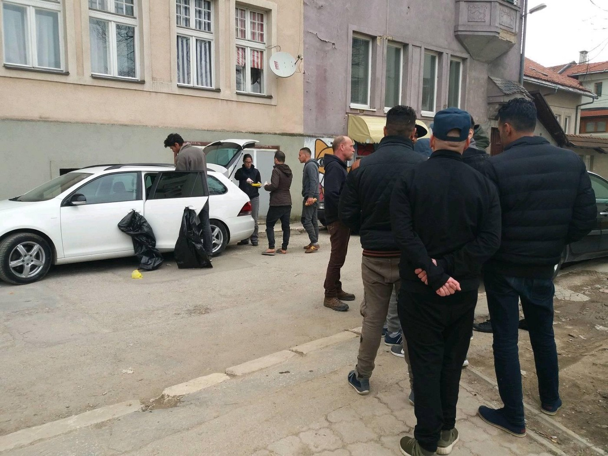
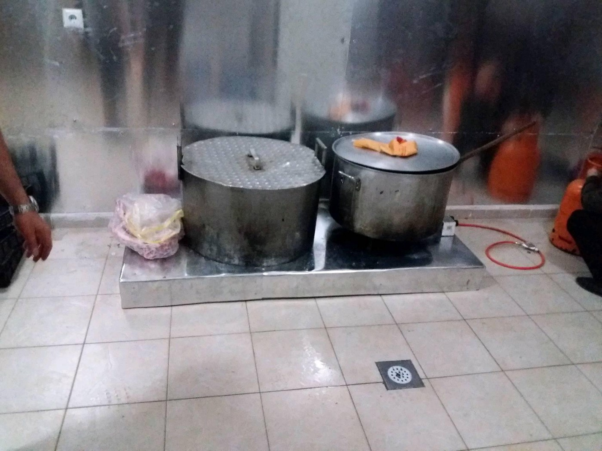
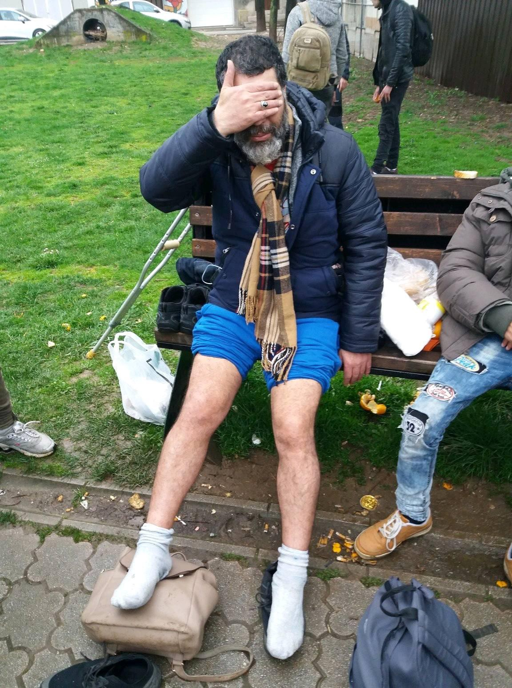

### AYS Daily Digest 24/04/18: Who is behind the politics that want to keep people from helping other people?
#### Volunteers accused of criminal activities, rescue vessels impounded, SAR professionals disabled from work, dubious documents issued and people still kept in dire conditions — a growing number of actions to support claims of a shaping of political decisions to stop people from coming and/or staying in Europe // news from the Mediterranean, Morocco, Libya, Turkey, Greece, Bosnia and Herzegovina & Croatia, Italy, France, Sweden, Norway and the UK

](assets/82310d88539f/1*PlFD5ieWBrKqysEPSo_CqA.jpeg)

Greetings to the French authors of the sign “Protect the people, not borders\!” — Photo: [Judith Gueyfier](https://www.facebook.com/judith.gueyfier?hc_ref=ART3MfD6Eqcfpxr_8yRnyo8Bw6W687HcxrkwrJ0g23awiA2MT3KqGN0ezVLl8-3wcIE&fref=nf)
#### FEATURE

■■■■■■■■■■■■■■ 
> **[Jugend RETTET - IUVENTA](https://twitter.com/jugendrettet) @ Twitter Says:** 

> > Today our appeal in Rome was rejected. We will not get back our #IUVENTA, today. A more detailed explanation of the courts decision is currently pending. https://t.co/g5QxuQ95sd 

> **Tweeted at [2018-04-24 13:34:23](https://twitter.com/jugendrettet/status/988773147632635909).** 

■■■■■■■■■■■■■■ 

#### The highest Italian court ruled that Iuventa boat will not return to saving lives in the Mediterranean\.

After the court order for the vessel to be impounded, relying on elements that were later disregarded by the outside parties as legal irregularities and gaping holes in the prosecutor’s narrative\.

> “It banalises what criminal behaviour means, if you call anything and everything migrant smuggling and human trafficking\.” 

■■■■■■■■■■■■■■ 
> **[Open Arms](https://twitter.com/openarms_fund) @ Twitter Says:** 

> > Because #SeaRescueIsNotACrime
All of our support @[jugendrettet](https://twitter.com/jugendrettet) 
#FreeIuventa https://t.co/5CEaK4Iufb 

> **Tweeted at [2018-04-24 10:24:56](https://twitter.com/openarms_fund/status/988725469632659457).** 

■■■■■■■■■■■■■■ 

This week, Forensic Architecture, a London\-based research organization, [released a new investigation](https://blamingtherescuers.org/iuventa) that calls into question the key evidence in the three events pivotal to the case\. Researchers with the organization, who shared their findings with [The Intercept](https://theintercept.com/2018/04/20/mediterranean-refugee-rescue-boat-italy-libya/) , argue that Italian police have withheld and distorted evidence in order to paint a picture of collusion\.
 The Italian and European governments, as well as Frontex, have long pushed the idea that the presence of NGO vessels increases migrant boat departures from Libya, a theory not supported by Frontex’s own data\.

■■■■■■■■■■■■■■ 
> **[Jugend RETTET - IUVENTA](https://twitter.com/jugendrettet) @ Twitter Says:** 

> > According to the figures from @[UNmigration](https://twitter.com/UNmigration) at least 1,026 people did not survive the crossing over the Central Mediterranean at the time our ship was set. We certainly would not have been able to help everyone, but there would simply have been a ship more to save lives. 

> **Tweeted at [2018-04-24 16:47:47](https://twitter.com/jugendrettet/status/988821819573534720).** 

■■■■■■■■■■■■■■ 

As it was said earlier, the crew of the Iuventa maintains that the case against them is part of a larger plan to remove humanitarian organizations from the central Mediterranean Sea — and in so doing, to stop migrants from reaching Europe\. if you are interested in all aspects of the story, please take time to read the text by Titus Molkenbur: [**The Iuventa will not return to rescue**](https://medium.com/@mol_ti/the-iuventa-will-not-return-to-rescue-593c5905abf9) \.
#### TURKEY
### [7,100](http://www.mynet.com/haber/politika/icisleri-bakani-suleyman-soylu-soylu-su-anda-7-bin-100-civarinda-afgan-geri-gonderildi-zannediyorum-bu-hafta-sonuna-kadar-bu-sayi-10-bini-bulacak-dedi-4065898-1) Afghans rounded up and returned to Afghanistan since early April

In recent weeks the Turkish authorities have escalated a ruthless deportation drive which has seen thousands of Afghans rounded up, packed onto planes and returned to a warzone, Amnesty International representative has [stated](https://www.amnesty.org/en/latest/news/2018/04/turkey-thousands-of-afghans-swept-up-in-ruthless-deportation-drive/?utm_source=twitter&utm_medium=quote&utm_term=VGhlIHNjYW&utm_campaign=social) \.

> “Afghans in Turkey have made hazardous journeys to escape even greater dangers at home, and forcing them back is both unconscionable and unlawful\. Indiscriminate violence routinely claims scores of lives in Afghanistan and no part of the country is safe\. There is no doubt that Turkey is under pressure — it has accepted huge numbers of refugees, mostly financed from its own budget — but these deportations will put lives at risk\.” 

For each of the past four years, more than 10,000 civilians have been killed or injured in Afghanistan, many in indiscriminate attacks by armed groups\. Still, the European countries regard Afghanistan as a “safe country” — only when returns of Afghans are concerned, of course\.
#### GREECE

> The interconnection of the rise of xenophobia and racist events with the situation of long\-term population in the islands, as a consequence of the implementation of the EU\-Turkey Joint Declaration, has already been underlined 

“ [The Greek Association for human rights](http://www.hlhr.gr/) expresses its particular concern about the incidents of racist violence that occurred yesterday in square square in mytilene\. In the square there were gathered refugees protesting the process of examining their asylum requests and their long\-term caging on the island\. The attacks carried out by extreme right\-wing groups, with the throwing of banger and other objects in the protestors refugees and the diction of racist slogans, such as “burn them alive”, are appalled\. The fact that, despite the presence of strong police forces at the point of attack, no arrest of the perpetrators of the attack is causing serious questions and needs immediate investigation\.
Eleda has repeatedly stressed that the obsession with the application of geographical restriction is in danger of irreparably damaging the social and political cohesion of island regions\.”
Therefore, they clearly state it is essential to ensure that there is no increase in right\-wing expression and activities and resulting further social destabilisation in Greece\.

![<“…burn them alive” …\. \.these words will haunt me forever……\.they were chanted by the fascists on Sunday night as they threw Molotov cocktails, fireworks and more \(amidst an array of missiles\) into our group of scared, peaceful people…\. \.and doing so knowing that there were many children there, with their families ……\. \.I have been walking around in a completely state of shock, wearing a cloak of mistrust as I look intensely at the faces of the people around me here, not knowing whose side they are on?> — [1951RefugeeConvention](https://www.facebook.com/1951RefugeeConvention/)](assets/82310d88539f/1*g4m79Y-W0zmw2VPVdg_FhA.jpeg)

<“…burn them alive” …\. \.these words will haunt me forever……\.they were chanted by the fascists on Sunday night as they threw Molotov cocktails, fireworks and more \(amidst an array of missiles\) into our group of scared, peaceful people…\. \.and doing so knowing that there were many children there, with their families ……\. \.I have been walking around in a completely state of shock, wearing a cloak of mistrust as I look intensely at the faces of the people around me here, not knowing whose side they are on?> — [1951RefugeeConvention](https://www.facebook.com/1951RefugeeConvention/)
### Islands

Six boats arrived with a total of 234 people during the night from Monday to Tuesday\. At the same time five boats was apprehended by TCG, with a total of 187 people ABR team reports\.

](assets/82310d88539f/1*iPIQe5kBAORTI_SsBEN2oQ.jpeg)

Photos: [Aegean Boat Report](https://www.facebook.com/AegeanBoatReport/)

Greece is concerned about the increase of refugees and migrants inflow especially through the natural border of Evros river in North\-East\.

The government’s proposed changes to asylum laws, with the aim to speed up the slow pace at which applications are processed, was discussed in the Greek Parliament\. Briefing the parliamentary committee, Mgration Minister, Dimitris Vitsas, said that that refugees and migrants arrivals from Turkey have dramatically increased\.
A total 7\.594 people crossed into to Greece through the Evros river and the islands, mainly Lesvos, in the time period from January to April, the minister said adding that 2,168 migrants came through the islands and 2,700 through Evros\. Read more statistical info [here](http://www.keeptalkinggreece.com/2018/04/24/greece-increase-refugees-evros-data-2018/) \.
#### Doctors needed on Chios

Salvamento Maritimo Humanitario is urgently looking for volunteer doctors to join the team on Chios\.
SMH is operating in many realities on the island and is the only association who can offer a good medical services to people stuck in Vial camp\.
If some of you is interested please contact Βασίλης Παχουνδάκης and, please, share the post and spread the voice\!
### Athens

On Friday 27th of April, at 9 am there will be a solidarity gathering for those accused [i](https://www.facebook.com/hashtag/refugeesgr?hc_location=ufi) n the case [\#freethepetrouralli8](https://www.facebook.com/hashtag/freethepetrouralli8?hc_location=ufi) 
Court: Loukareos street \(Alexandras avenue, Athens\)

### Khora is looking for English teachers

Their A1 women’s class urgently needs a teacher to taker over\.

> If you are motivated and interested to teach from Monday to Friday at 10 to 11, we would love to hear from you as soon as possible\!
 

> We take teachers with little or lots of experience, no certificate required\. We provide teachers with teaching resources and educational support\!
 

> We are based in central Athens, close to Exarchia\.
 

> Looking forward to hearing from you soon\! Please send an email to khora\.education@gmail\.com if you are interested or have any further questions\! 

#### BOSNIA AND HERZEGOVINA / CROATIA
### Arrested smugglers

More than 20 people were arrested on the territory of Bosnia and Herzegovina as well as Croatia, in a collaborative international action by the national police departments and by the INTERPOL\. The people apprehended were all a part of a larger group that smuggled people into the EU, mostly from Turkey\. The official report says the authorities have the evidence to support the claims that the people in question illegally acquired financial benefits rising up to tens of thousands KM per person in Bosnia and Herzegovina alone\.
### BiH — A rise in arrivals

According to the latest UN report, in January this year 157 people arrived in Bosnia and Herzegovina, of whom 38 asked for asylum and in February 315 arrived and 79 of them filed applications for international protection\. most arrivals were registered in March \(666\), when 136 people filed for asylum\.

The volunteers in Bosnia and Herzegovina still struggle to help and assist the refugees stuck there in order to provide them at least the basic amenities\.

](assets/82310d88539f/1*kbxCX2AI24prPh8VpVLYug.jpeg)

Photos: [Dylan Longman](https://www.facebook.com/dylan.longman?hc_ref=ARRdXJMoauSiqUkw6vjZwt_UqV7kiEzcFujE_aFq5pGUDuEpqV1ghPJBTDLgQIF7f2o)

> The situation regarding the escalating refugee crisis looming in Bosnia now… If it wasnt for the community and humane solidarity of the Bosnian people and a small group of international volunteers who are stepping up more and more and doing what the government and players in the NGO world should be doing we would be seeing a far worse situation than we already are… but this has only started here …\. as the snow melts on the mountain border passes, more are coming as Europes borders tighten…… refugees from the eastern world are literally being kettled into Bosnia…\. \. — [_Dylan Longman_](https://www.facebook.com/dylan.longman?hc_ref=ARRdXJMoauSiqUkw6vjZwt_UqV7kiEzcFujE_aFq5pGUDuEpqV1ghPJBTDLgQIF7f2o) 

#### SEA

■■■■■■■■■■■■■■ 
> **[Pino Finocchiaro](https://twitter.com/pinofinocchiaro) @ Twitter Says:** 

> > News da mininterni:
- Nave CP 941 Diciotti ha soccorso circa 300 migranti (3 eventi), rimane in area operativa;
- CP 312 ha soccorso un barchino con circa 65 migranti e li ha sbarcati a Lampedusa; 
- OPV Francesco de Almeida ha soccorso un barcone con 153 migr. Verso Messina. https://t.co/V9mkoPlIMl 

> **Tweeted at [2018-04-24 20:44:00](https://twitter.com/pinofinocchiaro/status/988881262873104384).** 

■■■■■■■■■■■■■■ 

#### MOROCCO
### More violence from the officials

](assets/82310d88539f/1*hQiBbylpQIgVlNerBUUU2w.jpeg)

Photo: [Association Marocaine des Droits Humains — Section Nador](https://www.facebook.com/AmdhNador/?hc_location=group_dialog)

Violence by the law enforcement officers against the migrants and refugees from Sub\-Saharan countries who are in Nador continues\.
Yesterday the officers used force and unjustified violence against a young man at the taxi station in Zeghanghane towards Bouyafar\. 
In front of the driver, the boy was hit with a glass bottle in the head\.

The second case of agression happened at the hospital Hassani in Nador\. A migrant who wanted to access the hospital to ask for care was violently stopped and subsequently arrested\.

**Who has the courage to stop the violations by the forces of order against the refugees? —** the volunteers in Nador ask
#### LIBYA

> Libya is hell for refugees\. 

■■■■■■■■■■■■■■ 
> **[Council of Europe](https://twitter.com/coe) @ Twitter Says:** 

> > .@[AmnestyEU](https://twitter.com/AmnestyEU) This afternoon, Guari van Gulik, #Amnesty Director for Europe told #CoE Parliamentary Assembly conf - "#Libya is hell for #migrants" - #torture &amp; collusion with traffickers 😲 @[CoESR_migration](https://twitter.com/CoESR_migration) Background [humanrightseurope.org/?s=migrants](http://www.humanrightseurope.org/?s=migrants) https://t.co/bnRP1E5vOx 

> **Tweeted at [2018-04-24 13:48:08](https://twitter.com/coe/status/988776607820247043).** 

■■■■■■■■■■■■■■ 

■■■■■■■■■■■■■■ 
> **[vincent cochetel](https://twitter.com/cochetel) @ Twitter Says:** 

> > #Libya, i can only confirm what the article says. Our team on the ground tries to respond to a situation west of Tripoli where 200 refugees &amp; migrants have been kept for weeks, months for some of them in the darkness. Survivors look like WWII prisoners. [unhcr.org/cgi-bin/texis/…](http://www.unhcr.org/cgi-bin/texis/vtx/refdaily?pass=52fc6fbd5&id=5adec4423) 

> **Tweeted at [2018-04-24 07:34:58](https://twitter.com/cochetel/status/988682698758684673).** 

■■■■■■■■■■■■■■ 

■■■■■■■■■■■■■■ 
> **[MSF Sea](https://twitter.com/MSF_Sea) @ Twitter Says:** 

> > “Every day there were girls that died amongst us. They raped us when they wanted, they did what they wanted.” One woman's harrowing story from Cameroon, to #Libya &amp; the #Mediterranean sea in part 2 of @[RFI_English](https://twitter.com/RFI_English) @[filipwarwick](https://twitter.com/filipwarwick)'s report from the #Aquarius. [en.rfi.fr/20180417-Aboar…](http://en.rfi.fr/20180417-Aboard-SOS-one-womans-story) 

> **Tweeted at [2018-04-24 15:54:51](https://twitter.com/msf_sea/status/988808497579069440).** 

■■■■■■■■■■■■■■ 

#### ITALY
### Minniti decree — what does it mean?

Minniti decree promulgated last year and the possibility to implement community/voluntary work, even though it was a practice even before\.

_“Migrants will not have the same rights as other citizens, and this by statute\. This is an unbearable, discriminatory approach” which limits “in a very clear and precise manner the right to asylum”\. Association for Legal Studies on Immigration \(Asgi\) president Lorenzo Trucco is worried and forebodes a “very dark horizon”\._

[**Read here**](https://www.asgi.it/english/lorenzo-trucco-asgi-minniti-orlando-decree-not-reform-but-wall-of-laws-that-limit-the-right-to-asylum/) what lies behind the “Minniti\-Orlando” immigration decree
#### FRANCE

Today in the French town of Gap there will be a court hearing for the arrested comrades Eleonora, Teo and Bastien\. They are accused of aiding illegal immigration in an organised band, for having participated in the solidarity march on Sunday\.

This prosecution is an attack against the solidarity of exploited people\.

](assets/82310d88539f/1*hr3ZoPTnzRn-X_kn5D3yLw.jpeg)

Via [Subversión \#1312](https://www.facebook.com/subanarchyshow/?hc_ref=ARQ-xQX_hd1H9mOjUDC81Igb133F0HDauJl-WaS53Z_ZCjsAgDvcIuJpqInTerRlqi0)
### Volunteers needed\!

“While the French deputies leave on holidays, after having voted the asylum\-immigration law project, the Utopia 56 volunteers are in Calais with the exiles\.
You too, join us in Calais and Paris, for a day, a week or more\. We lack volunteers now\!” [http://www\.utopia56\.com/fr](https://l.facebook.com/l.php?u=http%3A%2F%2Fwww.utopia56.com%2Ffr&h=ATMeU2neuxUSvC0lgU_AY-sBNrwcz20_4pAvfHERp5UhMNcv0SbJq56BEi-BgskLMx9UqifPi7X1so0ftAB0sFFMazkktxYMt0dYtAno3uFEZhhh9XKGbMQ5P0JNg7xC-gKQ2LM)

**First aAid** response team looking for volunteers in Calais during May\.
#### SWEDEN

The Social Democrats in Sweden have [released an electoral pledge](https://www.aftonbladet.se/nyheter/samhalle/a/yvn2nr/s-vallofte-infor-sprakplikt-for-alla-nyanlanda) , where the restrictions for newly arrived people and refugees will become stricter\. The financial contribution will be withdrawn in cases where the asylum seeker is not participating in the language training\.

“We have previously been a bit unclear about the fact that it is mandatory to learn Swedish for people living in Sweden”, a source from the party said\.

With this said, a lot of people are placed in the countryside far away from communications\. AYS volunteers have previously been talking with people who have problems with leaving their kids in kindergarten and combine this with being on time to the Swedish for Immigrant classes\.

It seems to be yet another promise or decision where punishments are used to increase “inclusion”\.
#### NORWAY

An 18\-year old boy took lis own life in an asylum reception centre in Norway\.

> Today he couldn’t\. He couldn’t stand the uncertainty, missing mom and dad, to wait for the answers to asylsøknaden, or the uncertainty of waiting for the police to take him out of the land that he came to, like the land of democracy, the stronghold of democracy, the country that swears to human rights… 

> So wrong after the journey he and 5,480 other unaccompanied minors undertook coming to Norway in 2015\. — _a local commented_ 

#### UK

![I am disgusted and appalled by the case I have just received\. My constituent arrived from Jamaica in 1964 aged 6\. He has shown me his letter from the Home Office telling him that he will be deported despite having a National Insurance card from 1974 & NHS documentation from 1964\.
 The Home Secretary and the Immigration Minister you must sort this today\. Why is my constituent being treated like an illegal immigrant despite providing documentation from 1964? This is an outrageous miscarriage of justice\. Grant him his citizenship and passport\.
 I have had 6 Windrush cases come in this morning already at it is only half past 11\. Each case is heartbreaking and an utterly shameful indictment of this government\. I am so angry at the way my constituents have been treated\. **The scale of this crisis is absolutely unfathomable\.** — [David Lammy](https://www.facebook.com/DavidLammyTottenham/?hc_location=group_dialog)](assets/82310d88539f/1*lGlf0NW3esvv9Z0lrCckpg.jpeg)

I am disgusted and appalled by the case I have just received\. My constituent arrived from Jamaica in 1964 aged 6\. He has shown me his letter from the Home Office telling him that he will be deported despite having a National Insurance card from 1974 & NHS documentation from 1964\.
 The Home Secretary and the Immigration Minister you must sort this today\. Why is my constituent being treated like an illegal immigrant despite providing documentation from 1964? This is an outrageous miscarriage of justice\. Grant him his citizenship and passport\.
 I have had 6 Windrush cases come in this morning already at it is only half past 11\. Each case is heartbreaking and an utterly shameful indictment of this government\. I am so angry at the way my constituents have been treated\. **The scale of this crisis is absolutely unfathomable\.** — [David Lammy](https://www.facebook.com/DavidLammyTottenham/?hc_location=group_dialog)

**We strive to echo correct news from the ground through collaboration and fairness\.**

**Every effort has been made to credit organizations and individuals with regard to the supply of information, video, and photo material \(in cases where the source wanted to be accredited\) \. Please notify us regarding corrections\.**

**If there’s anything you want to share or comment, contact us through Facebook or write to: areyousyrious@gmail\.com**

_Converted [Medium Post](https://medium.com/are-you-syrious/ays-daily-digest-24-04-18-who-is-behind-the-politics-that-want-to-keep-people-from-helping-other-82310d88539f) by [ZMediumToMarkdown](https://github.com/ZhgChgLi/ZMediumToMarkdown)._
