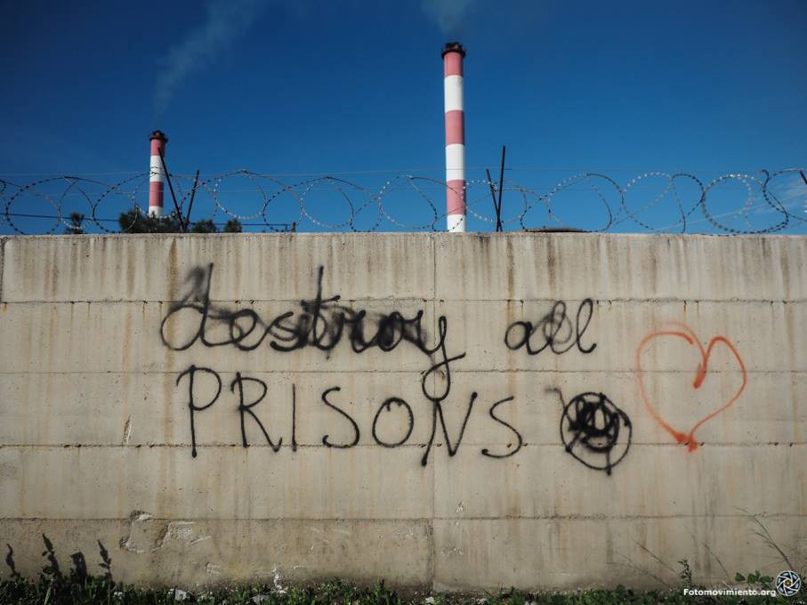
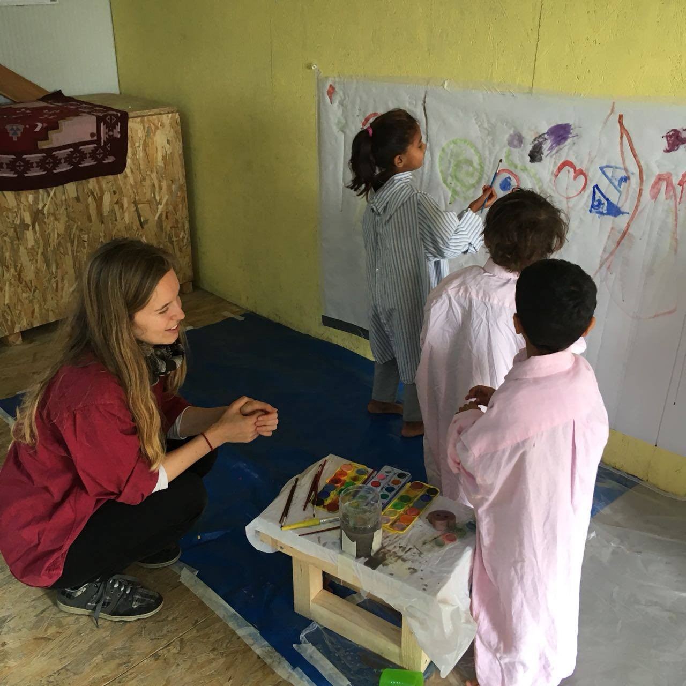
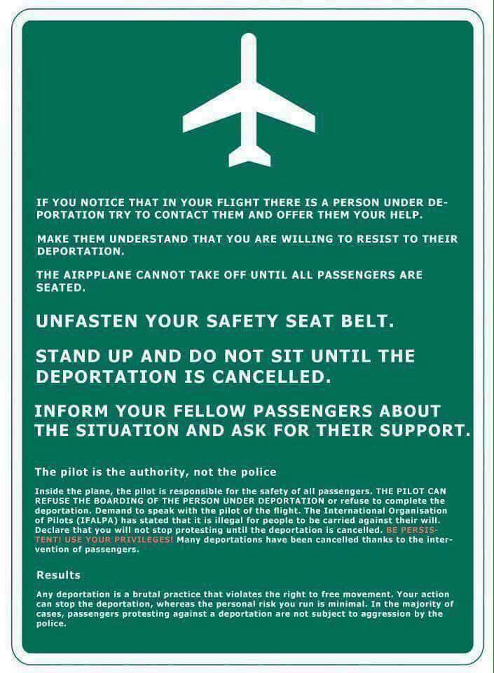
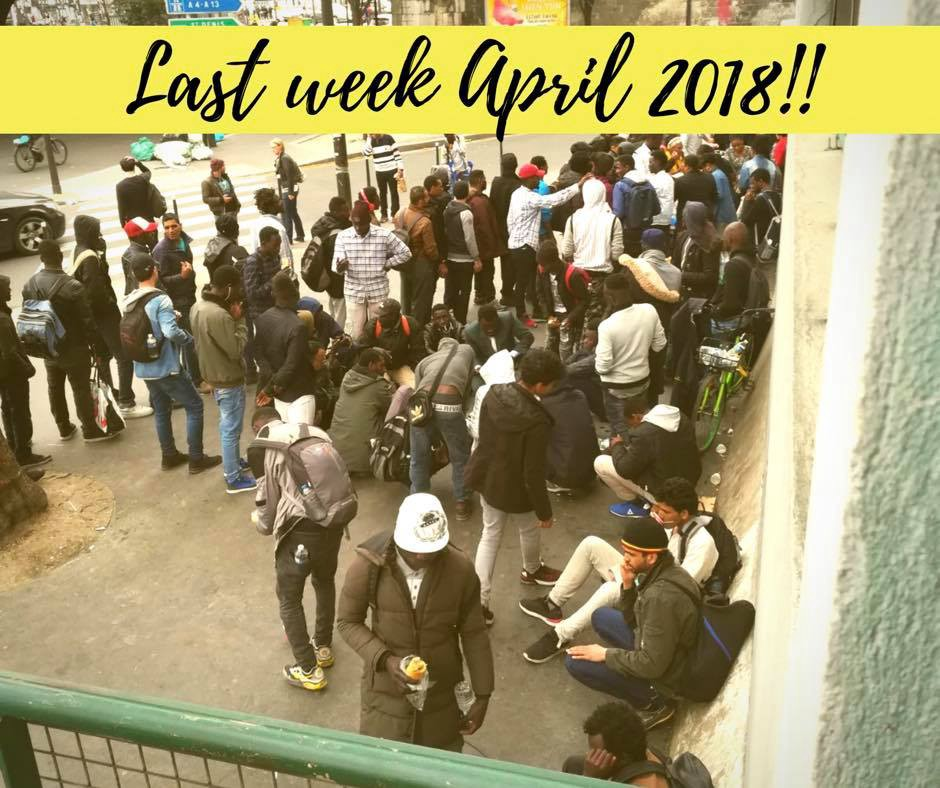

### AYS DAILY DIGEST 25/04/2018: Attack in Exarchia has Greater Symbolism

_Minor attack has great echoes in Greece // Updates on Greek government response and actions // Needs in Greece // Ways to resist deportation in Austria // French legislation may be in contravention to EU migration framework // More_

### **FEATURE**

There was a brazen attack on Steki, the migrants social center in Exarchia\. The attack was minimal and there was no human toll, however it only goes to show the extent to which people are being emboldened by the system which seems to show all the sympathy in the world to violent actors against solidarity actors and people on the move\. This attack coming within the same week that a mob of 200 people descended upon a group of helpless refugees on Lesvos does not seem unrelated in the least\.

Furthermore, we remind all of our readers that after the horrible attack on Lesvos, refugees THEMSELVES were arrested by police\. In a recent report, it has been confirmed that the radical far right group Golden Dawn has and makes use of extensive connections with the police in order to turn a blind eye to its violent behavior\. Whether they are responsible for this attack in Exarchia or not, the symbolism of the move is not lost on the people\. As one activist said regarding the attack in Exarchia: “\[Exarchia is\] like the heart of migrants and political rights in Greece for ages\. We don’t know how they approached area, its like, no one touches Exarchia…\.”

A great point of concern is the fact that the “respectable” faces of many of these violent groups leverages the term “dialogue”, placing all the blame for their unprovoked attacks on anyone who does not agree with them\. “You have pushed us to this point because you do not hear us\.” Yet it is clear from their behavior that they do not truly wish to dialogue\.

Indeed, they use this merely as a tactic to seem respectable \(truly an easy task when one has the support of police forces\) to the mainstream public\. The false narrative of the oppressed unheard “identitarian” who “only wants to stand up for their rights” is inextricably linked to an increase and acceptance of violence from these perverse people\. Many in the mainstream community simply will turn away as they are not the victim of the attacks yet\. Indeed, this only highlights the urgent need to show solidarity with individuals around the globe as we can only expect that this violence will not dissipate on its own\. Those without any protection will always bear the brunt of this violence\.
### GREECE

In response to increased reports of individuals crossing to Greece by land or by sea, the ICRC \(International Federation of Red Cross and Red Crescent\) issued a statement expressing concern over increased arrivals, and that this is a trend that may not stop, possibly precipitating a summer crisis\. Displacement continues to be a way of life for many across the globe, and the recent military actions in Syria have directly impacted the number of people trying to find a way out to safety\. Additionally, political strife between Greece and Turkey and strengthened ties between Turkey and Bulgaria means that the land border between Greece and Turkey is more porous\.

However, we see the cynicism and hypocrisy of governments as they spring to action in trying to “counter” and “manage” migration\. Where was this haste when it comes to respecting the needs of freezing people in winter? Whenever a complaint is voiced, the response is the same “sadly the system does not work fast\.” Well it certainly has a reinvigorated spring in its step when it comes to “reacting” to increased arrivals\. The Migration Minister of Greece has drafted a plan in response to these changes with lightning speed\!

> “Under pressure from the opposition over mistakes and omissions in the government’s current migration policy, \[the minister\] said that his ministry has prepared two plans to deal with the situation and pledged to outline their content to political party leaders in private\.” 

[Source](http://www.ekathimerini.com/228018/article/ekathimerini/news/minister-drafts-action-plans-amid-fears-over-migrant-influx) \.

This after the emergency stop\-gap measure that was thrown into place to prevent the enacting of the highest Greek court ruling of enabling freedom of movement from the islands to the land of new asylum seekers\. This overturning and thwarting of the rule of justice has been condemned by many human rights’ groups, yet it is clear the government has made its choice in who to protect\. For more about the overturn, go [here](https://www.hrw.org/news/2018/04/25/greece-government-defies-court-asylum-seekers) \.
### _Arrivals_

> 89 people arrived to Lesvos yesterday, 60 people reportedly to Kastellorizo\. 

### Needs\!

Nea Kavala, Northern Greece

[We Are Here — Community Centre](https://www.facebook.com/WeAreHereCentre/) has need of a long\-term helper for their children’s centre\. The space is child\-friendly and encourages creative play and social development\. The minimum time commitment is 6 weeks and the position starts in May\. To apply, go [here](http://goo.gl/forms/bJ6MhKEqopwDw9QA3) \.

Serres, Northern Greece

_WAREHOUSE COORDINATOR NEEDED: [Lifting Hands International](https://www.facebook.com/liftinghandsinternational/?ref=gs&fref=gs&dti=228469170832717&hc_location=group) is after someone to lead our distribution team in Serres, Northern Greece\. This role involves:_

_> documenting incoming donations_ 
_> preparing weekly food and hygiene aid parcels_ 
_> overseeing other volunteers in the warehouse_ 
_> maintaining an organised, clean warehouse space_ 
_> running our seasonal clothing shop_ 
_> distributing aid to new arrivals in the camp_

_WAREHOUSE COORDINATOR NEEDED: @Lifting Hands International is after someone to lead our distribution team in Serres, Northern Greece\. This role involves: [international\.org](http://international.org/) Contact them for more infomation\._

ISLANDS: Lesvos

The Kempsons need help\! See their post below

ERCI needs FARSI translators on Lesvos\! Please read the below description\.

### AUSTRIA

The organization [ECADA \- European Citizens Against Deportation to Afghanistan](https://www.facebook.com/ecada2017/?hc_ref=ARRF2vNq_0Rmxk2KnQdx3CqXhsG0Q430SDPsbFkUqAHwbsFbVdCaJpAtCvAUgekrXVg) provided useful information on how citizens can help to intercept and protest on a deportation flight\. They are encouraging action against the deportation of a man from Afghanistan \(via Turkish Airlines, which is a Star Alliance member\) back to Kabul\. Please follow their page for the latest in terms of social media activism and read the helpful brochure below to see how you can truly “Stand up and make a difference\.”

### ITALY

](assets/d9e9a1638355/1*5xi2LBALPQKc-v3EA1KLSQ.jpeg)

Protest on behalf of the liberation of activists from jail, credit: [Chez Jesus — Rifugio Autogestito](https://www.facebook.com/Chez-Jesus-Rifugio-Autogestito-362786637540072/?hc_ref=ARQlxxYIPM5UJm_5ou7GB3uLrX8HXxBKZl_qSCi6RR08NZNHmpppScIFTK0E5uGaZt8&fref=nf&hc_location=group)

In the fallout after the earlier protest in the Clavièr\-Briançon march, three individuals have been arrested on the charge of “facilitating illegal migration” \(sounds familiar by this point, doesn’t it?\) \. There are ongoing protests against their arrest and detention on the 26th and 27th\. Their next court hearing is on May 31st, so they can be kept in jail until that point\.

](assets/d9e9a1638355/1*SpH4PEkNOXThwLwJ-4J69w.jpeg)

Photo from the March\. Credit [Radio No Tav](https://www.facebook.com/radionotav/?hc_ref=ARS7EEIGdmeTieepzDorRBpEt8G_JfQq-3QVZmtd-4d5Ku45QMEsdplnocDAVpPAJn0&fref=nf)

Those who wish to correspond with one of those held \(Eleonora Laterza\) are encouraged to do so at this address\. \(Information courtesy of [Chez Jesus — Rifugio Autogestito](https://www.facebook.com/Chez-Jesus-Rifugio-Autogestito-362786637540072/?hc_ref=ARRUksDO8uS7JqrgR0lLWmVNVEPhNxl8YOv29GgxBZxEQjg3QJAS_exPtGneZRwFifA&fref=nf) \)

Eleonora Laterza,
 Correctional Centre of Marseille\-Baumettes, women’s detention centre\.
 Nut Number 188381\.
 239 Chemin road, 13009 Marseille
### SPAIN

According to [InfoMigrants](https://www.facebook.com/InfoMigrants/posts/1509944889127291?hc_location=ufi)

> In total there have been 233 sea arrivals on five boats so far this year, compared to 51 in the period from January\-April 2017\. 

### FRANCE

France’s new asylum draft law \(which was adopted with a vote of 228 to 139\) does little to help people and much more to help the state\. Additionally, there are features of the law which put it in questionable stance in comparison to European asylum law\. A major change is not only a reduction in the deadline between receiving a negative asylum decision and filing an appeal, but also in allowing France to waive the suspensive nature of an appeal on impending deportations, in the event a person is from a “safe country” and/or they are considered to “pose a threat to the public order\.” Normally, filing an appeal puts a halt to any deportation, but this allows French authorities to ignore it and carry out the deportation anyway, provided other \(quite loose\) criteria are fulfilled\.

[EURACTIV](https://www.euractiv.com/section/justice-home-affairs/news/frances-asylum-reform-at-odds-with-european-law/) reports: 
“The European Court of Human Rights \(ECHR\) had already issued France a warning in 2012, as it considered that the lack of a suspensive clause for certain categories of asylum seekers violated their right to an effective appeal\. Following this, France had introduced a suspensive appeal in its 2015 asylum right reform\.”

It is unclear whether this will have any effect on the legislation\.

[Solidarithe](https://www.facebook.com/solidarithe/photos/a.1768173616834086.1073741829.1751515661833215/1984245238560255/?type=3&permPage=1) looks back on one year of work, 200,000 cups of tea served\. Please take a moment to hear from them and support their work\.

Photo credit: Solidarithe
### THE NETHERLANDS

Opportunity to show support\! Show up for the “We are Here\!” Protest\!

> 1\. Undocumented people are being denied basic rights\. Even those who can’t go back to the country of origin are refused access to regular housing, health care, education and work\. 

> 2\. Extreme right wing groups are intimidating refugees and misusing the inhumane situation of We Are Here to spread their fascist and nazi ideas\. 

> 3\. The negotiations between local political parties for the new city coalition are happening right now\. Several of the negotiating political parties have already said that they want to find a sustainable solution for the situation of undocumented people\. 

> The more people march with us next Saturday, the louder our message will be: nobody is illegal\! Everybody in Amsterdam should have the same basic rights\! 

### GERMANY

Germany deported 21 men to Kabul two nights ago\. This is in spite of the recent horrific suicide bombings that have rocked the capital of over one million people\.
### SWEDEN

The liberal party announced that they will vote in favor of the newly proposed law which could let 9000 people stay in the country to finish high school and later also if they find a job\.

Fatemeh Khavari, who initiated the big protests last summer, say it is a step in the right direction and a victory for them but she is also stressing the fact that there is a lot that needs to be done for the network Ung i Sverige, which was founded in 2017\.

Translated from this [story](https://www.svt.se/nyheter/inrikes/ung-i-sverige-om-centerpartiets-besked-om-ensamkommande-en-seger-for-oss?cmpid=del%3Afb%3A20180424%3Aung-i-sverige-om-centerpartiets-besked-om-ensamkommande-en-seger-for-oss%3Anyh%3Alp) \.

We hope that other initiatives like this are able to gain traction as the disturbing trend of individuals who have comfortably established a new home in Europe being again displaced is continuing in prevalence\.

**We strive to echo correct news from the ground through collaboration and fairness\.**

**Every effort has been made to credit organizations and individuals with regard to the supply of information, video, and photo material \(in cases where the source wanted to be accredited\) \. Please notify us regarding corrections\.**

**If there’s anything you want to share or comment, contact us through Facebook or write to: areyousyrious@gmail\.com**

_Converted [Medium Post](https://medium.com/are-you-syrious/ays-digest-25-04-2018-attack-in-exarchia-has-greater-symbolism-d9e9a1638355) by [ZMediumToMarkdown](https://github.com/ZhgChgLi/ZMediumToMarkdown)._
