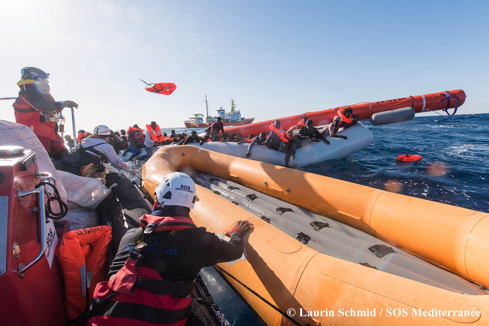
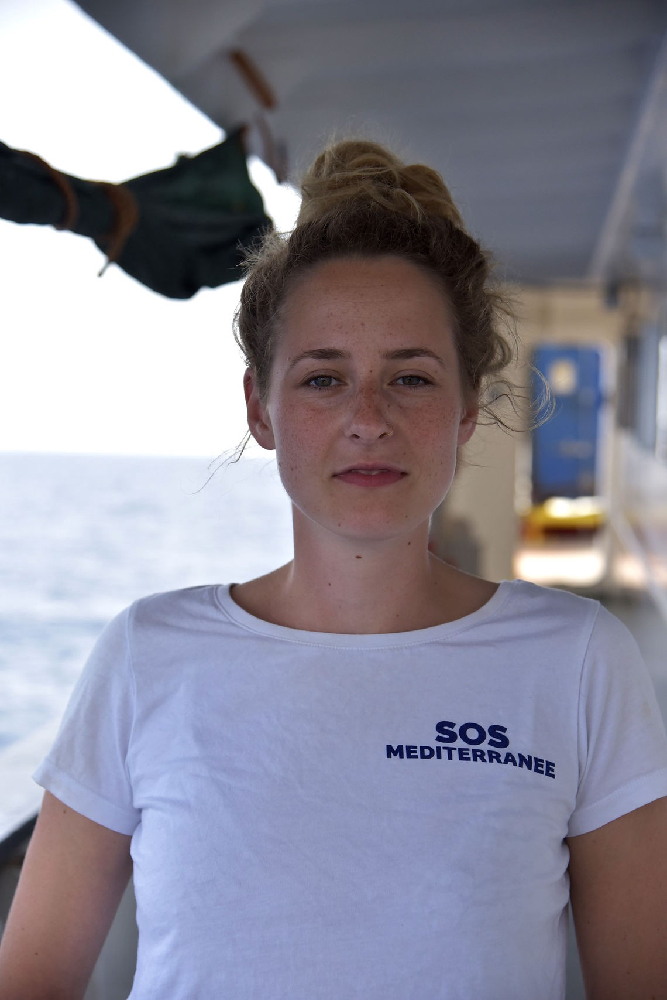
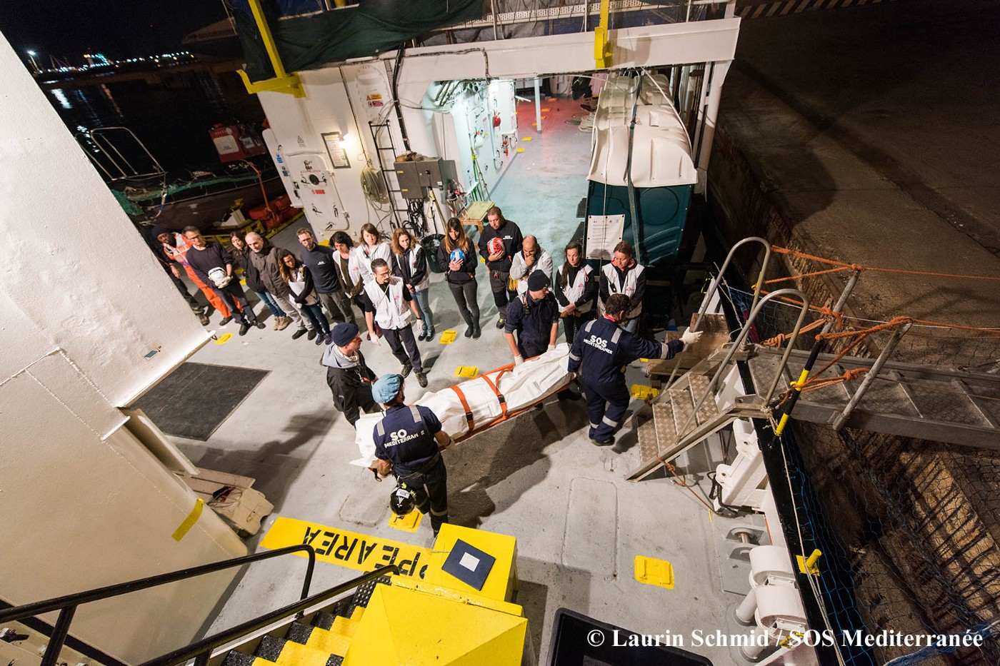
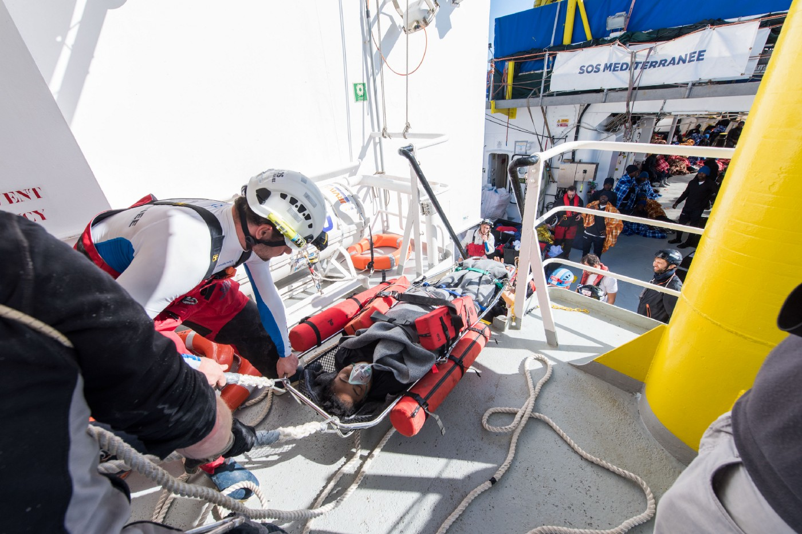

### AYS SPECIAL: The humanitarian crisis in the Mediterranean continues

_Almost three years ago, SOS Mediterranee was founded to rescue in the Mediterranean\. With AYS, Jana Ciernioch, spokesperson of the non\-profit organisation, talked about the developments in this time and explained the current situation in the central Mediterranean\._

Volunteers distribute life jackets during a rescue mission\. Credits: Laurin Schmid/SOS Mediterranee

>Das Interview ist auch auf [Deutsch verfügbar](ays-interview-mit-sos-mediterranee-die-humanitäre-krise-im-mittelmeer-geht-weiter-6656a039a5b5)

**Ms\. Ciernioch, SOS Mediterranee was founded on 9th May 2015\. Soon the organisation will celebrate its third birthday\. What is your feeling about the situation in the central Mediterranean lasting for so long now?**

Jana Ciernioch, spokesperson of SOS Mediterranee\. Credits: Susanne Friedel/SOS Mediterranee

We were founded when the Italian sea rescue program “Mare Nostrum” ended, after it became apparent that Europe was not willing to assist Italy with sea rescues\. We wanted to oppose the non\-action of Europe\. Since then we have achieved a lot: we have founded four organisations in four countries, set up a European network, gained thousands of supporters and started huge crowdfunding campaigns\. We have received the support of European civil society and hence managed to save almost 28,000 people from drowning\. That is a positive result\.

At the same time, almost nothing has changed in terms of sea rescue capacities in the Mediterranean\. It feels like we are further away than ever from a governmental sea rescue program\. It is a double\-edged conclusion\.

**In the aftermath of “Mare Nostrum”, the EU initiated EUNAVFOR MED and extended the Frontex mandate\. What does the collaboration with these programmes look like and what do you think about the successor programme?**

“Mare Nostrum” had a far bigger scope, it clearly was a sea rescue program\. The successor programmes of the EU were not anymore — they were primarily military operations, which aimed to fight the so\-called smugglers and to destroy the boats\. Of course, they are also rescuing people because they have a legal obligation to do so\. Our critique is that the rescue of human lives is not the priority of these programmes\. Lately, we have witnessed the withdrawal of European boats from the area off the Libyan coast\.

**Because of the seizure of two ships, the Iuventa and the Open Arms, the number of civil rescue ships in the central Mediterranean dropped\. Yet, the Open Arms has been released\. But there are more and more reports about confrontations of NGOs with the Libyan Coast Guard, also from SOS Mediterranee\. How does the crew on\-site experience this?**

We have been on mission non\-stop for two years now\. Hence, we can clearly say that, firstly, in the past several months we have witnessed an increase in the activities of the Libyan Coast Guard in international waters\. Even before the Libyan Coast Guard declared an own Search\-and\-Rescue zone, which officially does not exist\. De facto it exists in the sense that nowadays the Libyan Coast Guard is highly active in this declared area\. We had our first incident with the armed forces of the Libyan Coast Guard — at least they declared themselves as such — in 2017\. The people on the move were severely threatened in the boats, whereupon panic broke out\. The people jumped into the water\.

Secondly, in the past months we have been witnessing the Libyan Coast Guard intercepting people more and more in international waters — outside their territorial waters — and taking them back to Libya\.

Crew members watch out for boats in distress\. Credits: Hara Kaminara/SOS Mediterranee

**This situation led to the fact that SOS Mediterranee was the only civil rescue ship after the seizure of the Open Arms, before Sea\-Watch 3 started its current mission in the beginning of April\. How did your organisation react to this?**

We were already the only civil rescue ship operating without pause in the winter of 2016/2017\. Now we had the same situation temporarily\. For us, this was a huge challenge\. We are sailing under the coordination of the Italian search and rescue facility MRCC Rome\. Suddenly, we were confronted with distresses ranging from the West to the East of Tripoli\. We would get instructions to rescue and have to sail 250 maritime miles afterwards to get to the next mission\. We know we are the only ship, if we’re too late, that is it\. Then people will die\. This creates incredible pressure for our teams\. Fewer rescue ships on the sea means more deaths\.

**This has been observable since the beginning of the year: fewer people tried to cross the Mediterranean in comparison with the year before, but more people died proportionally\. Do you believe one of the reasons for this is that fewer rescue ships are operating?**

For us, the connection is obvious\. The drop in numbers is certainly connected with the political situation in Libya\. It also had to do with the fact that the European Union and especially Italy are outsourcing migration control\. All these are factors\. It is difficult for us to say what the reasons are, as we are at sea\. We are confronted with the fact that people come or not and that we have to rescue them\.

For the second time, the Aquarius was the only civil rescue ship operating\. Credits: Laurin Schmid/SOS Mediterranee

**Volunteers of your organisation have said in the past that smugglers send people across the sea with lies and rumours\. What is the situation at the moment in this respect?**

The people we rescue tell us on board with what message they were sent out to sea\. Also, sometimes they do not enter the boats voluntarily\.

In front of the Libyan coast, off Tripoli, there is an oil platform\. In the past, people have told us that when they departed at night, they were told to sail to these lights — this would be Italy\. This is not even half of the way to Italy\. When people are with us on board, they realize that we need two days to arrive in Italy with this big ship, the Aquarius\. Then they figure out that they would never have made it and they would have died if there had not been any ship\. For many, this is quite a terrible realisation\.

The smugglers always tell people any story as to why it is a good idea now to enter a rubber boat with more than 100 people\.

**Let us talk about the situation in Italy: the election is over, probably a right\-of\-centre government will be constituted\. How do you see the developments in Italy on a political level?**

As an organisation with a European network, we also have an organisation in Italy, based on Sicily\. We have always followed the nationwide mood in Italy and the public debates there very closely\. Especially since last summer, we have noticed that the mood has changed completely: it is now hostile to organisations which support people on the move\. Since the beginning of the humanitarian crisis in the Mediterranean, we have criticised the fact that Italy is being left completely alone by the European member states\. This is a lack of solidarity, which has also led to a shift in the mood of the domestic political situation\. For us it is important to point out that it is not about accusing Italy of being against migrants\. It is a question of missing European solidarity, which is evident in this example\. Nevertheless, we have seen these polemics, which were particularly aimed against SOS Mediterranee in the summer\. We had extreme right\-wing groups in Germany and Austria, but they were also very strong in Italy\. In the beginning, the debates took place in the extreme right\-wing spectre and then moved on up to Italian prosecutors and Frontex, who made the same accusations\. This led to a drop in private donations for all sea rescue organisations\.

I have now been with SOS Mediterranee for almost two years, and we also chartered the Aquarius\. Back then, there was no doubt about saving lives\. There were people who complained, “Why do you bring these people to Europe? Why don’t you take them back to their countries of origin or to North Africa?” Still, not saving lives was out of the question\. This has changed over the past two years: even this humanitarian duty, to rescue people from drowning, is being questioned\. This is what I see as the biggest backlash\.

Saving lives was out of the question once — today not anymore\. Credits: Laurin Schmid/SOS Mediterranee

**The development you are describing also caused Italy to demand that sea rescue NGOs sign a Code of Conduct\. How did this affect the work of your organisation?**

The whole public debate translated into concrete domestic actions of the Italian government such as the Code of Conduct for NGOs\. We participated in the negotiations and did not sign the Code of Conduct in its original version because many points were unacceptable\. We could not work with it\. These points would not have led to more efficient missions or more rescued lives\. On the contrary, they would have hindered our missions\. Then we renegotiated with the Interior Minister and signed a modified version of the Code of Conduct\. In an addendum it was clearly mentioned that this is not a legally binding document\. We also set down that we can hand over rescued people to other ships or take them from others, if the mission makes it necessary, and they will be transferred to a safe mainland\.

**Do you fear further political restrictions?**

The Code of Conduct is not a legally binding document but an agreement between individual rescue organisations and the Italian government\. International and maritime law are above this\. Since the beginning we have been sailing under the common maritime conventions, respecting the international law of the sea as well international law\. We will carry on doing so\. Especially as the Code of Conduct did not change our modus operandi\. So far, it has not impacted our mission\.

Actually, there is a permanent repetition of accusations\. They have never been proven, but have always been disproved\. Also by academic studies conducted by different universities\. But the claims persist\. This is the way things stand now\. We have seen this also with Jugend Rettet; the Iuventa has been seized for almost a year\.

We feel a clear social headwind\. In particular in Italy, but it is also very strong here in Germany\. A number of politicians have accused sea rescue organisations of encouraging people to cross with their presence alone\. De Maizière \[Thomas de Maizière, former German Interior Minister\] has repeated this without any basis in fact or evidence\.

On the other hand, we have experienced the incredible solidarity of our supporters and of people who say, “Now more than ever”\. At the same time, we note that not so many are donating any more — no matter why\. But for our missions, this is a huge problem, we are funded by donations\.

The topic is not so much on the agenda any more\. We do not talk about sea rescue any more\. A certain acceptance has begun of people drowning in the Mediterranean\. Apparently, meanwhile, it is also accepted that civil rescue organisations financed by donations must be on\-site and rescue people\. There is no outcry anymore\. This means there is no longer any attention on this situation\. Consequently, the accusations are not so pressing anymore\.

**In the past, there have already been threats that rescue ships could be refused entry into Italian harbours…**

We do not know what remains rhetorical, for example the threat of a harbour closure, and what will be translated into concrete actions of single states\. There were many debates in the run\-up to the elections which also have the be considered with regard to the election campaigns\. Now the elections are over and presumably there will be some sort of right\-wing to extreme right\-wing government\. We are worried that sea rescue organisations will be criminalised further\. For us, this has not been the case yet\. After the seizure of the Iuventa and recently the Open Arms, we cannot expect that this will end\.

**So, you would favour a governmental replacement for your activities?**

This has been our demand since the beginning: there must be a European sea rescue programme\. What we are doing is only a gap filler\. It is not a sustainable response to the humanitarian crisis in the Mediterranean\. It cannot be\. But we have not made any progress yet towards a European sea rescue programme\.

The paradox is that we have always said we would only be there as long as we are needed\. As soon as there is a European sea rescue programme, we will not be needed any more\. Now the individual sea rescue organisations are criminalised, boats are seized, individual members are being charged\. The idea was not for us not to exist any more, because we are being criminalised\.

**Are you still being heard on a European level?**

In the Parliament, yes\. We had an appointment there at the beginning of the year, when we talked about the criminalisation of sea rescue organisations\. We got quite a lot encouragement from individual European delegates\. Additionally, we had a panel and met with some delegates\. But clearly the European Commission is the counterpart in this case, and it holds completely different positions\.

**How do you assess the two seizures? All the charges against the Open Arms have been dismissed, but the accusations against the members still stand\.**

They mean two rescue ships fewer on the Mediterranean\. In terms of sea rescue, this is incredibly worrying\. Fewer rescue ships means more deaths, this is the hard reality we are witnessing daily on\-site\. Hence, we are really happy that the Open Arms has been released in the meantime and that it can continue its mission\.

Whereas, the criminalisation of humanitarian aid in the Mediterranean continues\. The investigations against two crew members of Proactiva Open Arms are still ongoing\.

**Have the threats you receive through social media intensified again in the past months?**

The number of direct accusations in the social media has fallen a bit again\. We have noticed this\. But it is only a question of time, depending on how the situation in Italy develops with the constitution of the new government, until this comes up again\.

**How did this affect you in terms of your volunteers? Did you struggle to find a crew?**

No, actually not at all\. The people who are on board with us fully support what they do\. Overall, we have had more than 120 volunteers who worked with us on board\. Many of them come back again and again and support us also on the mainland\. The social backlash was there, yes\. But many people also said: now more than ever\. We need to support you\. It is our role to show now as European society that we support these organisations\. That we do not “only” save lives in the Mediterranean, but also negotiate something like European identity and values\.

**Can you explain briefly how a mission usually works?**

We are continuously at sea for three weeks at a time\. Most of our people on board have primarily a professional background, for example in shipping or rescue aid\. In this respect, we also work with Doctors Without Borders/Médecins Sans Frontières\. They provide the medical team and ensure the medical\-humanitarian care on board\.

MSF provides the medical\-humanitarian care on board\. Credits: Yann Levy/SOS Mediterranee

The Aquarius is chartered by us; therefore, we have a so\-called marine crew\. It makes sure that our ship sails 24/7\. It is a really big ship, 77 meters in length\. We have a capacity of more than 500 people\. It is a giant operation that has to be kept at sea, and there is a lot of work involved\. We come back to Italy when we rescue people under the coordination of the Italian maritime Rescue Coordination Center and get instructions to bring the people to a safe harbour\. This is our routine\.

■■■■■■■■■■■■■■ 
> **[MSF Sea](https://twitter.com/MSF_Sea) @ Twitter Says:** 

> > Over the past few days the #Aquarius #MSF medical team did over 100 medical consultations. They typically see violence related injuries from people’s journey into #Libya, injuries &amp; conditions from their time in captivity &amp; chronic diseases worsened due to lack of medical care. https://t.co/xL9tmUSRIi 

> **Tweeted at [2018-04-23 15:08:12](https://twitter.com/msf_sea/status/988434370766700544).** 

■■■■■■■■■■■■■■ 

**Do you know what happens when the rescued people leave the Aquarius?**

In theory, yes\. Our mission in the Mediterranean begins at the moment we get an emergency call and ends at the point when we bring the rescued people to a safe harbour in Italy\. Our mandate ends there\. Then we hand over the people to organisations and the Italian authorities on\-site\. Sometimes we mange to stay in touch with some individuals\.

On board, we “register” injured people, pregnant women or women travelling alone, as well as unaccompanied minors\. We do not register their identity but only their vulnerability\. We present the data to the Italian authorities, so the people get adequate care on the mainland later\. We cannot trace stringently to what extent this happens\. The teams of Doctors Without Borders in Italy try to do it, but it is only possible in some cases\.

**Volunteers have said they are aware that men often end up in forced labour and women in forced prostitution, and that children are reportedly abused or disappear\. Additionally, there are the deportations\.**

This is a difficult topic\. We deal with the severe danger to life\. But we know that the people who arrive in Italy have poor chances of getting a regular residence permit\. Some are deported, some women end up in organised networks of forced prostitution or human trafficking\. We know this\. It is difficult for our teams to deal with it on an emotional level\. To know that the severe danger to life is over — but what comes afterwards for these people is not much better\.

■■■■■■■■■■■■■■ 
> **[Filip Warwick](https://twitter.com/filipwarwick) @ Twitter Says:** 

> > What happens when you finally arrive to a port of safety?
Indescribable joy among rescued women on the #Aquarius
#SOS #[MSF](https://twitter.com/MSF) disembarked all 292 men, women &amp; children in Italy
@[SOSMedFrance](https://twitter.com/SOSMedFrance) @[SOSMedGermany](https://twitter.com/SOSMedGermany) @[[MSF](https://twitter.com/MSF)_Sea](https://twitter.com/[MSF](https://twitter.com/MSF)_Sea) @[MSF](https://twitter.com/MSF) #LifesavingRescues #Europe #EU #FortressEurope #[MSF](https://twitter.com/MSF) #[MSF](https://twitter.com/MSF)Sea https://t.co/m4oaOoSXSN 

> **Tweeted at [2018-04-03 15:21:11](https://twitter.com/filipwarwick/status/981189879609679872).** 

■■■■■■■■■■■■■■ 

The arrival in Italy is a hard contrast for the people we take on board\. Most of them are on the Aquarius for up to 48 hours and there they can rest, sleep, talk to us, if they want\. Often, for the first time in months or years they have the feeling: okay, here I can take a deep breath, here I am safe now\. Then we sail into the harbour in Italy and the Italian authorities are already waiting there, and some are wearing white protective suits because they are afraid of being infected with infectious diseases\. The rescued people then often realise that they are now facing a totally different mood than on board, where we meet as equals\.

On board of the Aquarius, many rescued people feel safe for the first time since months\. Credits: Hara Kaminara/SOS Mediterranee

**In 2016 there was a total of 4500 deportations from Italy, and 1000 people returned voluntarily to their country of origin\. Presumably the number was higher in 2017\. During your mission, did you ever find people trying a second crossing to Europe?**

Not people who were deported from Italy\. When I was on board last year, I met many people who were trying to flee Libya for a second or third time\. In each case, they had been intercepted at sea by the Libyan Coast Guard, or other forces who masquerade as such, and taken back to Libya\. Since the beginning of the year we have had cases of people who tried four or five times\. We did not have this in previous years\. They say: better to die in the Mediterranean than stay in Libya\.

**The volunteers experience moments on their missions that are heard to deal with\. How are they prepared for spending three weeks on board?**

Most of the people who work with us on board have a background in shipping or rescue aid\. Many are used to dealing with extremely difficult or exceptional situations in some way\. But the context in which we are working is incredibly special\.

For all the people who work with us on board, we have pre\-mission training where they are prepared for what the missions look like in practice\. We also run through various scenarios\. Starting from a rescue that runs “well” and quite calmly, in which all the people can be rescued\. But we also practice how we operate during bad weather, if there is panic on board or the boat is about to sink when we arrive, and if there are lifeless people in the water\. These cases we practice with pictures and video material\.

It is always about the security context, too, which has changed due to the increased activity of the Libyan Coast Guard since last summer\. We talk openly with our crew and try to explain what the situation on\-site is like\. We assess the situation at the moment as secure\. As soon as we cannot guarantee this any more, we will not sail\.

Furthermore, we have a 24\-hour\-hotline with psychological care on board\. The teams on the Aquarius have a debriefing after every single rescue operation\. It sounds trivial, but I think it is the most important thing we can provide in these grim moments: an open exchange among the team\. Some of our people have already volunteered with people on the move in the Aegean in Greece\. They come from different contexts and all bring in their experiences\. To exchange experiences and give support and advice about how to deal with such situations is really important\.

When the people are back on the mainland, we additionally offer psychological aftercare\.

Volunteers face difficult experiences\. In 2018, 370 deaths were recorded in the Central Mediterranean\. Credits: Laurin Schmid/SOS Mediterranee

**Among the more experienced volunteers it is often said that new volunteers prepare to go in the field, but not to return to their old life\. What is the experience of OSS Mediterranee?**

For many it is incredibly difficult, indeed\. This gross contrast, to see people close to death or at least in mortal fear, is an existential experience\. For many it is hard to come back to their normal lives in Germany again, for example to Berlin\. But it is the reality\. It is difficult to deal with it\. But it is the world we are living in\. In it we have many different things, which coexist\. There are people fighting for survival, and there are people partying in Berlin\. It is hard to endure\.

But it is also important to participate in a dialogue, to talk to friends and family, who cannot understand things in the same way\. The risk is always that one will withdraw and not talk about it any more, not talk about what one has seen and experienced\. Hence, we always try to encourage our crew members to talk about it when they are back on the mainland\. They give presentations, talking about what they have seen and in some way carry the topic into the debate here in Europe\. We do not only rescue at sea\. One of our goals is also to bear witness and explain the situation in the Mediterranean, what is happening “out there”\. For most of the people in Germany it feels as if it is really far away\. We want to bring it here and show that this is happening on our doorstep\. And it concerns all of us\.

**Many organisations who are financed by donations are struggling to finance their activities in the long term\. Your missions are cost\-intensive at 11,000 Euros per day\. At one presentation it was said that SOS Mediterranee has three months planning security nowadays\. How does your organisation ensure operations in the Mediterranean in the long term?**

We have always been sailing hand to mouth, so to say\. We have to raise donations month by month\. We can only do this because we have such great support from the European civil society\. It helps that we are a European network and that we are not only present in Germany but also in Italy, France and Switzerland\. But it only works because we continue to mobilise people, also organisations and companies, who are willing to support life rescuing work and they do it consciously\. Meanwhile, it is increasingly difficult for many organisations and companies in the current political climate and they are holding back a bit\. But this is exactly what we need\. We need people who back us — also further down the road\. You do not collect 11,000 a day so easily, it is an enormous sum\.

**While the total number of boat crossings in the central Mediterranean has dropped in comparison to the previous year, it has risen in Spain and in Greece by almost 40 percent despite the Turkey deal\. How do you decide where to operate?**

We always evaluate where the need is\. We started in the central Mediterranean and still see that there is a need\. Especially for big ships like the Aquarius, which can take many people\. There have always been forecasts that fewer people would come and our mission would not be needed any more and we were asked why we were still there\. Then we had one, two days, in which thousands of people came\. It turned out that the situation is unpredictable, especially in Libya\. But it depends to a great extent on whether people are able to flee over the Mediterranean — or not\.

For volunteers there is a big contrast between the rescue mission and everyday life\. Credits: Laurin Schmid/SOS Mediterranee

The need is still there, the humanitarian crisis in the Mediterranean continues\. Fewer people are coming, but proportionally more are dying\. Most people are still crossing by the Mediterranean route — and it is the deadliest one\. It is necessary that we be on\-site and rescue lives\. But it is also necessary that we be on\-site as civil society to witness breaches of maritime or international law\.

**What should the EU do in your opinion, would it be enough for example to initiate “Mare Nostrum” again?**

From the beginning, our demand was a civil sea rescue programme\. It needs sufficient rescue capacities on\-site, so people do not have to die on their flight\.

We have been in existence for three years now, and for two years we have continuously been on mission\. Nothing has developed that would let us assume we are closer to a sea rescue programme\. Considering the developments we are witnessing on\-site now with the Libyan Coast Guard and the unclear coordination of rescue, we demand that the European member states clarify the current situation: who rescues people in the Mediterranean and how? We demand a protocol based on international and maritime law clarifying who is responsible for rescues\. So we do not have a case like the one previously, when we had to negotiate with the Libyan Coast Guard whether we could rescue the people in distress\.

**\(Interview and translation by Niklas Golitschek, prooreading by Sanja Matešić, AYS volunteers\)**

Note: The interview was made before the court ruling in the case of the Iuventa\.

> **We strive to echo correct news from the ground through collaboration and fairness\.** 

> **Every effort has been made to credit organizations and individuals with regard to the supply of information, video, and photo material \(in cases where the source wanted to be accredited\) \. Please notify us regarding corrections\.** 

> **If there’s anything you want to share or comment, contact us through Facebook or write to: areyousyrious@gmail\.com** 

_Converted [Medium Post](https://medium.com/are-you-syrious/ays-special-the-humanitarian-crisis-in-the-mediterranean-continues-b77f28e81d6e) by [ZMediumToMarkdown](https://github.com/ZhgChgLi/ZMediumToMarkdown)._
