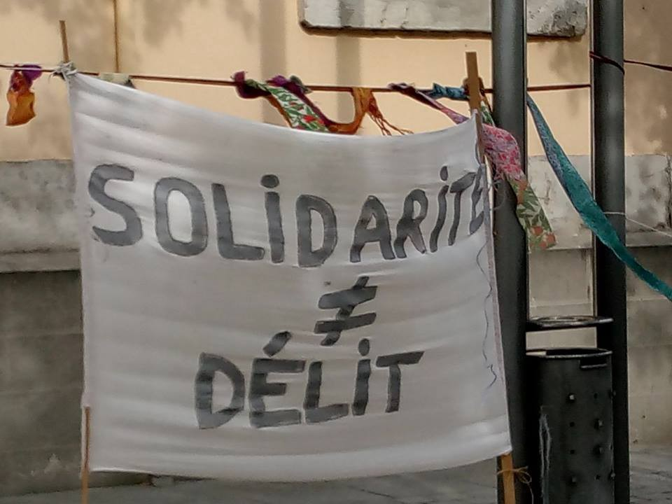
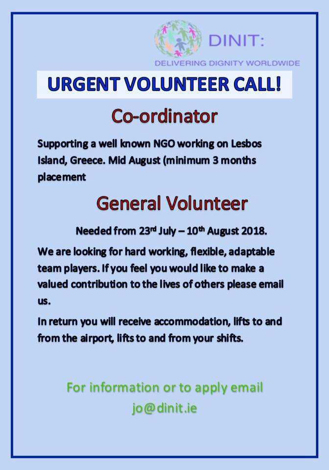

### AYS DAILY DIGEST 29/04/2018: Hungary to send Montenegro barbed wire to protect its borders

_Barbed wire being sent to Montenegro from Hungary—a worrisome gift//Number of people crossing the border from Turkey to Greece by land rises//11 people drowned off the coast of Algeria//Volunteers and funds needed in Calais and Dunkirk//A recent list was published with the disturbance actions conducted by the French police in Calais //More news from the UK, Greece…_

Credit: Defend Solidarity — smash the borders

**FEATURE**

Hungary seems to be [spreading the reach of their politics](http://www.vijesti.me/vijesti/orban-salje-bodljikavu-zicu-crnoj-gori-za-docek-migranata-986295) ; this would certainly not be possible without the approval \(however silent\) of the rest of Europe\. Following the agreements made during a meeting between the two ministries of interior held this month, the Hungarian government will reportedly donate Montenegro enough barbed wire to run along 25 kilometres of the state border, “ _to prepare for a possible influx of migrants_ ”\.

According to the media, the donation will be free of permits, import and export taxes, customs, VAT and any other possible expenses, otherwise unavoidable\.

This donation\-collaboration is based on the Police Cooperation Convention for South Eastern Europe, which made this loophole possible in the a country that currently occupies an important strategic position in more than one context\. “ _Montenegro strives to retain full responsibility in governing their own borders, this is in their own interest, as well the interest of the EU member states\. MoI is working in continuity to strengthen the capacities of the border police, directly resulting in a better operational result of the workforce, and ultimately, reflecting on the legal institutions and individuals_ \.”

However, there is still no information about whether Montenegro is planning to use the fence any time soon, nor answers as to where, along the 296 kilometres of the border with Serbia, Albania and Kosovo, the donated lethal wire fencing would be placed\.

**SEA**

Eleven people reportedly drowned off the coast of Algeria as their boat capsized\. They were on board the same boat that Salvamento Maritímo had been trying to localise since Friday, also alerting the Algerian Coast Guard\.

The other 20 passengers were rescued and taken to hospital, but more are feared missing, according to Helena Maleno Garzòn\.

■■■■■■■■■■■■■■ 
> **[Helena Maleno Garzón](https://twitter.com/HelenaMaleno) @ Twitter Says:** 

> > [#TRAGEDIA] Naufraga cerca de Argelia la patera de 38 personas que buscábamos desde hace dos días. El saldo: 20 supervivientes, 11 cadáveres y 7 desaparecidos. https://t.co/cFkudJ5dr1 

> **Tweeted at [2018-04-29 15:40:25](https://twitter.com/helenamaleno/status/990616802706280449).** 

■■■■■■■■■■■■■■ 

**GREECE**

Considering the latest developments in the way the people newly arriving to the Aegean islands are being treated, an upsurge in the number of people is expected; so far the crossings on land have increased far more than those by sea\.

About 2,900 people crossed the land border in April, surpassing by far the number who arrived by sea, reports UNHCR\. Hundreds of police officers who were sent as backup did not do much to change the situation, so they are calling for the support of Frontex authorities\.

As the [media](https://www.theguardian.com/world/2018/apr/29/greece-reinforces-land-border-with-turkey-to-stem-flow-of-migrants) reports, “ _in the absence of accommodation, authorities are placing newcomers, including children, in inappropriate police detention facilities where access to interpreters and other services is severely restricted_ \.” The local UNHCR reported that the “ _conditions there are dismal … the hundreds of people being held include pregnant women, very young children and people in need of medical and psycho\-social care\. It was imperative that mobile reception units be set up to expedite the process of identification, and unaccompanied minors should be transferred to safe shelters_ \.”

As the tensions rise for those who have been stranded on the islands for a long time, new fights broke out this Sunday in Moria camp, leading to police interventions, fires, and possible damage to some of the containers used for the medical workers on site, reports AYS collaborator\.

Credit: NoBorder

Credit: DINIT

**ITALY**

Support to Eleonora, Theo, Bastien, the 3 people in solidarity in prison in Marseille, is spreading\!

From Foggia \(Puglia\), in solidarity\!

On Saturday, a demo took place in Gap, to demand justice for the 3 “solidali”\.

**FRANCE**

_Calais_

There was distribution of the goods people need in Calais today, but walking boots are badly needed as “ _the refugees walk miles every day and, living outside, if their feet get wet they stay wet, leading to foot rot and infections_ ”\.

[Care4Calais](https://www.facebook.com/care4calais/posts/1904364999596448?hc_location=ufi) also reports harsher living conditions for the refugees in the area, not only because of the weather, but also because of the increasing involvement of the authorities\.

“ _Nightly raids sap strength and resilience, destruction of the most prized \(and irreplaceable\) possession — their mobile phones — is crushing, and beatings and arrests deny self esteem and dignity_ ”\.

Donations of boots, power banks, cellphones are, therefore, sorely needed\. Please, help if you can\.

Moreover, [Refugee Community Kitchen](https://www.facebook.com/groups/CalaisMigrantSolidarityActionFromUK/permalink/1928408700567201/?hc_location=ufi) is also in great need of volunteers and funds\! \! They are the only stable presence offering food to around 1400 people in Calais and Dunkirk\!

“ _The average price of a meal is just 50p and from that, we can create nourishing, wholesome, filling food that will keep refugees going\. Raising £1,000 will enable us to feed more than 600 people a day\. Simply put, you will be saving lives by donating to this most important of causes_ \.” \(reports Donate4Refugees\)

Salam Nord/Pas\-de\-Calais has published a list of the most recent disturbance actions conducted by the police to the disadvantage of the refugees living in the area\. Not only have they dismantled huts and tents, checked documents and impeded the work of volunteers, but they also arrested and took away asylum seekers with the presence of 10 riot vans at the time, and with the support of the local Prefecture\.

**UK**

Safe Passage has published a useful video of what the UK has done from 2015 until now in terms of reception of Syrians in its territory\.

> **We strive to echo correct news from the ground through collaboration and fairness\.** 

> **Every effort has been made to credit organizations and individuals with regard to the supply of information, video, and photo material \(in cases where the source wanted to be accredited\) \. Please notify us regarding corrections\.** 

> **If there’s anything you want to share or comment, contact us through Facebook or write to: areyousyrious@gmail\.com** 

_Converted [Medium Post](https://medium.com/are-you-syrious/ays-daily-digest-29-04-2018-hungary-to-send-montenegro-barbed-wire-to-protect-its-borders-1d737065ef21) by [ZMediumToMarkdown](https://github.com/ZhgChgLi/ZMediumToMarkdown)._
