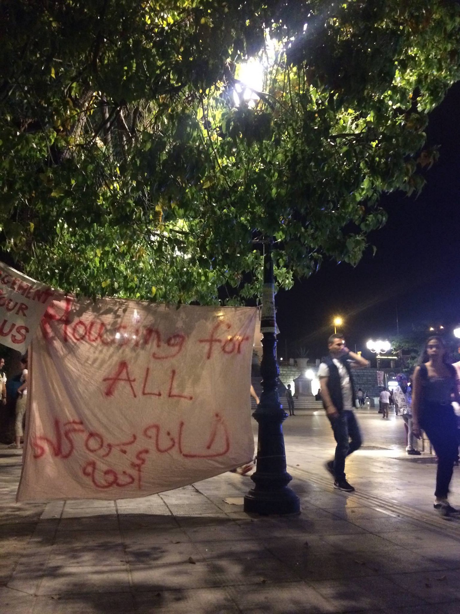
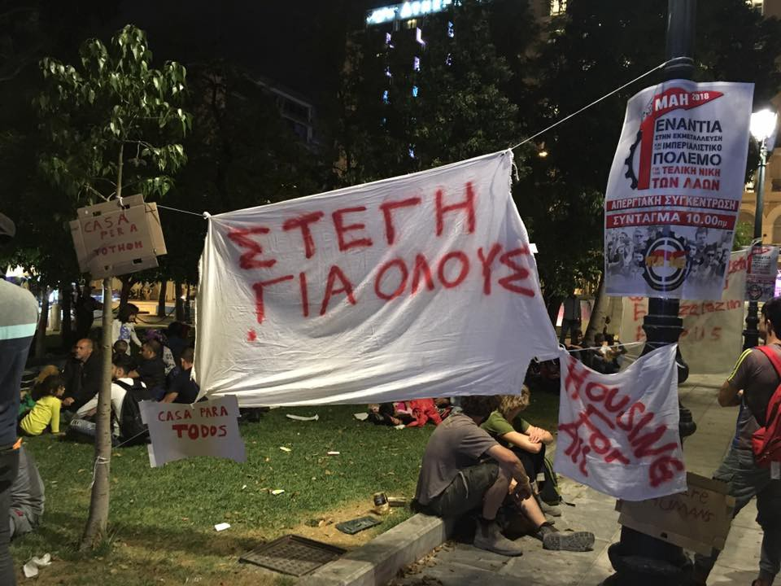

### AYS SPECIAL: Sleepless in Athens

I _n April, almost 3000 people crossed the river Evros and came to Greece\. Most of them aim to reach northern Europe, but for now, due to strict rules and closed borders, they are forced to stay in Greece where accommodation, again, is a massive issue\. Last night, an AYS volunteer joined a protest in Syntagma Square that was organized in order to draw attention to the issues facing people who have newly arrived to Athens\._

Photo AYS\. Syntagma Square, where over 200 people joined in protest last night\.

Last evening, April 30th, refugees and solidarians intended to sleep rough in Syntagma Square in order to draw attention to the accommodation crisis facing asylum seekers in Athens, and demand housing for all those who seek asylum in Greece\. Ultimately, nobody actually slept in the square\. After midnight, buses came and took most of the people to Skaramagas camp, where over 3000 people are currently living\.

At least 180 asylum\-seekers attended the sleep\-in, the vast majority of whom were Kurdish families who’d arrived in Athens between 10 and 40 days ago\. Over [2,900 people](http://www.unhcr.org/news/briefing/2018/4/5ae2dd764/unhcr-appeals-greece-situation-evros.html) have crossed the northern border into Greece in the last month, most of them fleeing Turkish [bombing in Afrin](https://www.theguardian.com/world/2018/mar/18/syrias-new-exiles-kurds-flee-afrin-after-turkish-assault) \.

These new arrivals have put tremendous pressure on the city’s squats, which are essentially the only housing option for asylum\-seekers who have not yet been able to fully registered and receive their “white card,” official documentation of their asylum claim\. The vast majority of asylum seekers have to preregister [through Skype](https://us1.campaign-archive.com/?u=8e3ebd297b1510becc6d6d690&id=caab8541c2#greece) ; once they finally get through, which can take a few weeks or 8 months, the average wait time for the full registration date is 81 days\.

“We cannot let people sleep in the streets, but it makes things chaotic in the squats,” said Samir, who has made room for hundreds of people at the squats he is involved with, but has also had to turn people away\. “Squats are supposed to be a temporary thing, not permanent\. In Athens they have become permanent\. Right now there is no other option \[beside the streets\], so life in the squats is without dignity\. This is why we’ve resorted to this\.”

Photo by Khora Community Center

Among the families in the crowd were Walid, Nasliyeh, and their 12 children, who were gathered around them on a few blankets\. Syrian Kurds who had traveled to Afrin when it was still a relatively safe enclave of Syria, they were forced to leave a few weeks ago, and finally made it Athens on April 17\. “I expected a safe place, shelter, when we arrived,” said Walid, shaking his head\. “Instead we found nothing\. We were left in the street\.”

“If the Greek government can’t find us housing or anything else, they should let us go on to another country,” their friend Ahmad interjected\. The entire possibility of an EU\-wide asylum mechanism \(the “Dublin” procedure, currently on its third iteration\) hinges on the notion that a person seeking asylum in Greece will be met with the same treatment as one seeking asylum in Germany or Norway\. In practice, this has proved over and over again to be far from the case\.

In the meantime, the squats have picked up the slack, with no support from the government or established organizations\. “Not only are the major NGOs not coming up with a solution \[to the accommodation crisis\] — they’re not even supporting the squats with food, with blankets,” said Amber, who works with a number of the city’s squats\. This has left the squats impossibly overcrowded and struggling to provide enough food for everyone\. Walid and his family are sleeping 19 people to a room of 12 square meters; others have pitched tents in the courtyard of one of the larger squats\.

Accommodation is not just a problem facing undocumented asylum seekers\. Once the achingly slow registration process is complete, people still struggle to access housing\. One man we spoke to at the sleep\-in obtained his white card over a month ago but has been unable to register for official accommodation\. In the meantime, he, his wife, and his two young sons are still living in a squat\. “And when I tried to apply for a cash card,” he explained, “they said, ‘you need an address\.’”

“The thing about accommodation,” said Amber,” is that it’s a barrier to so many other services\. Without an address you can’t get AMKA \(Greek insurance\), a cash card — you can’t even get a permanent metrocard\.”

Safe, dignified housing is one of the most essential components of rebuilding a normal life for people who have had to start over with nothing\. When we asked Walid what he wished to communicate to the Greek government with his presence in the square, he said, “We just want them to offer something to our children — to build a new future after a long destruction\.”

Arriving at the sleep\-in around 7, people hung makeshift banners with the words “housing for all” written in Greek, Arabic, Spanish, Farsi, French, and English\. As the night wore on, more and more blankets were produced and children started to drift off, but many parents kept a watchful eye on the police standing at the edge of the square\.

We spoke to Rahim and Jumana, a young Syrian couple with their 8 month old sleeping peacefully between them\. “People say that at any moment the police might come and kick us out of the square,” Jumana said\. “We are in the same situation in the squats \[which are under constant threat of eviction by the Greek authorities\] and here\. There is no difference\.”

Her prediction proved true: Around midnight, more police arrived on the scene and told the asylum\-seekers to come with them to be registered\. Understandably, many people were deeply skeptical, and refused the offer\. Towards 1:30 am, an employee of the Greek ministry arrived and gave the crowd an ultimatum: go to Skaramagas Camp to be registered \(which could take as long as the normal registration process, but people would be housed in camps and have better access to food and medical care\), or stay in the square and be arrested\. People were also given the option to walk away, which a few did\.

Ultimately, 155 asylum\-seekers chose to board the buses the government brought to the square and go to Skaramagas; 31 more were taken after the buses left\. The larger demands made by the protesters — a swifter, more efficient, and more humane registration process, more official accommodation options available to unregistered people — were not taken up by the ministry officials present\.

Last night, the Greek government offered another temporary solution to a permanent problem\.

**\(Piper French, AYS info team and Khora Community Center in Athens volunteer\)**

**We strive to echo correct news from the ground through collaboration and fairness\.**

**Every effort has been made to credit organizations and individuals with regard to the supply of information, video, and photo material \(in cases where the source wanted to be accredited\) \. Please notify us regarding corrections\.**

**If there’s anything you want to share or comment, contact us through Facebook or write to: areyousyrious@gmail\.com**

_Converted [Medium Post](https://medium.com/are-you-syrious/ays-special-sleeples-in-athens-a09468ec52cc) by [ZMediumToMarkdown](https://github.com/ZhgChgLi/ZMediumToMarkdown)._
