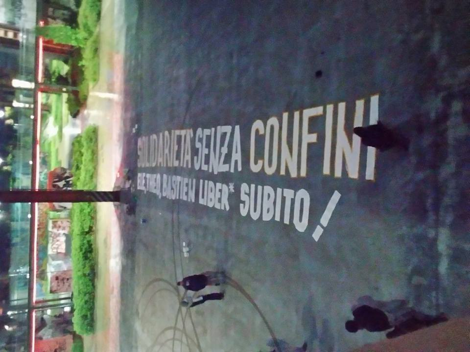
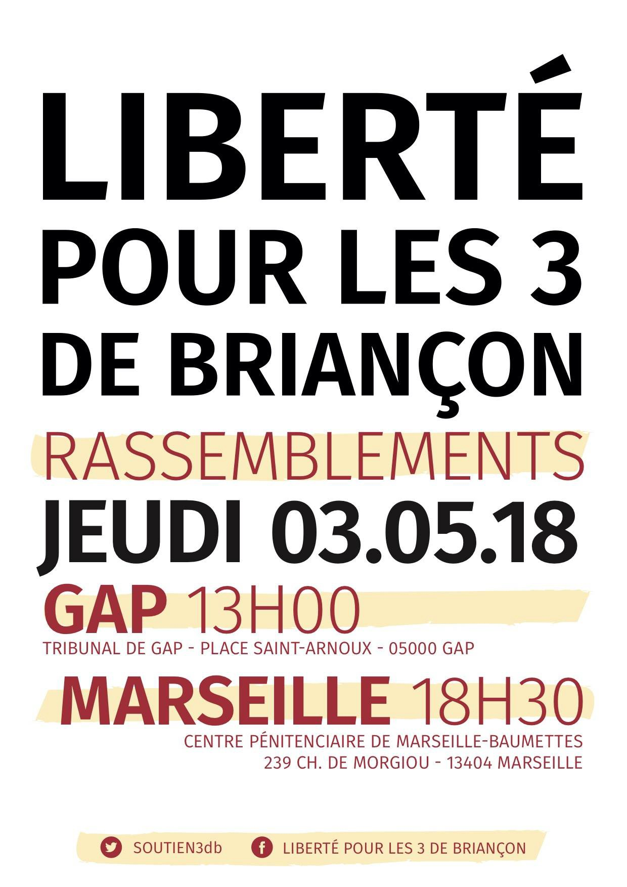
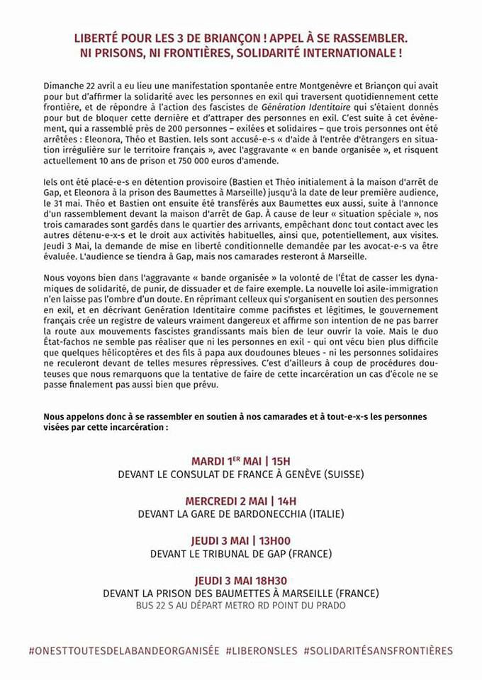

### AYS Daily Digest: 1/5/18: Active in solidarity
#### Indignation in protests and antifascist gatherings on the Greek islands, solidarity march from Italy to UK, protests in France / Medical staff needed on Lesvos / Intervention and changes in the bill on immigration in Greece / anti\-trafficking training in Macedonia / surge of newly arrived people in April, according to IOM / detention centres in Portugal / …

 \)](assets/e3f656972fb7/1*Ll3Ym9Ic6qYvYdk1mliWFA.png)

Protest announcement for the May 1 \(Photo: [Act Up\-Paris](https://www.facebook.com/actupparis/) \)
#### FEATURE

The dozens gathered in Ventimiglia to start the March in solidarity, organized by l’Auberge des Migrants alongside la Roya Citoyenne, and many other associations, both local to France and internationally, that assist in the providing of humanitarian aid to refugees\. They are heading to London and will pass through more than 60 French towns and cities, including Nice, Marseille, Lyon, Dijon, Paris and Lille\. They plan to reach Calais in early July and London by July 8\.

> “The objective is to ask ourselves: ‘How can we help people who are suffering today, whether they are men, women or children?’ You can’t be in a fortress situation, so how do we build bridges, rather than walls?” _— J\. Bove_ 

The march begins where normally migrants’ journey ends, at the entrance to France, they said\. Apart from the officials, in most transit and destination countries, refugees and migrants are met by increasing intolerance and xenophobia, fueled by populist discourse\.
While in some countries, like Bulgaria, volunteering in support of refugees seems like a suicide mission in some parts of the country and even some vital organizations admit they fear setting up a point there, in other countries it is done more silently through politically pervert practice that includes mobilizing the local population in order to “discourage” people on the move, pushbacks from the police \(even hundreds of kilometres away from the border\), concealed violence etc\. 
It is the citizens and young people, most of whom are today anyway migrants by the choice of life style, who should find ways to stand up for the rights of refugees and migrants and reject the “us vs\. them” mentality that feeds suspicion, mistrust and xenophobia across the continent\.

This march will be a chance for many to meet French locals, to educate and expose the ineffective and inhumane treatment of refugees by the authorities in France\.

> Supporting displaced and migrant children at home and globally is a shared responsibility, 

says the [UN Policy](https://www.unicef.org/emergencies/childrenonthemove/files/Refugees_Summit_policy_asks.pdf) ahead of the September Summit, but how come it the UN agencies who are among those being quiet many times after some people actually put in practice what they write, when their acts f solidarity — that went in accordance with the UN plea mentioned above — end up \(more and more\) with — criminal charges?

](assets/e3f656972fb7/1*xU20eSBeALbU2nkx_vXDdA.png)

Here are the planned stations of the March, join if you can: Please click here to register [https://www\.laubergedesmigrants\.fr/fr/la\-marche\-citoyenne/](https://www.laubergedesmigrants.fr/fr/la-marche-citoyenne/)
#### GREECE

According to [Aegean Boat Report](https://www.facebook.com/AegeanBoatReport/?hc_ref=ARSQ35z4obQkmV7uUASCOrnB-m69AhQlW97WV23ooy9MgPpMglYzcQQdTWZ1blzfChM&fref=nf&hc_location=group) , two boats arrived on Lesvos early Tuesday morning, carrying a total of 107 people\.

Apart from the 107 people, together with several members of his cabinet, the Greek Prime Minister is arriving to Lesvos on Wednesday and Thursday, “in a visit government critics say is little more than a stunt to appease public sentiment amid a fresh spike in migrant arrivals from Turkey”, the Greek [media](http://www.ekathimerini.com/228188/article/ekathimerini/news/pm-ministers-to-visit-lesvos-amid-spike-in-migrant-arrivals-tensions) says\. Only days after the far\-right extremists violently attacked a group of 200 migrants and asylum seekers who protested a court decision preventing them from being transferred to the mainland as they await processing\.
**A protest is planned as a reaction to the events of April 22, the shameful attack on Lesbos\.**

![“The pogrom of the 22nd of April took place after the collaboration between right\-wind and fascist groups, football hooligans, and the tolerance of the Police and the Coast\-guards\. Facing these criminal actions, and having in mind that silence, fear, or approval of such actions are complicity, we shall not stay passive or inactive\.
We call everyone who understands the vulgarity, the hate and the violence of this pogrom to vigorously react and resist against the fascist threat\.”
**Sapfous square** 
**Tuesday, 08 of May** 
**19:00**](assets/e3f656972fb7/1*MtBLaDYNv5rLB0MsFdoQkQ.jpeg)

“The pogrom of the 22nd of April took place after the collaboration between right\-wind and fascist groups, football hooligans, and the tolerance of the Police and the Coast\-guards\. Facing these criminal actions, and having in mind that silence, fear, or approval of such actions are complicity, we shall not stay passive or inactive\.
We call everyone who understands the vulgarity, the hate and the violence of this pogrom to vigorously react and resist against the fascist threat\.”
**Sapfous square** 
**Tuesday, 08 of May** 
**19:00**

Another trial is coming ahead, the one against the 3 SAR workers from Spain who are accused for their SAR activities of January 14 2016 on Lesvos\.
We support their fight and hope for a positive outcome of the legal battle\.

■■■■■■■■■■■■■■ 
> **[MSF Sea](https://twitter.com/MSF_Sea) @ Twitter Says:** 

> > Search and rescue is simple in principle, and its procedures are established in international law. If people are in distress at sea they must be rescued and ‘rescue’ includes being brought to a place of safety. https://t.co/wGKcw39emd 

> **Tweeted at [2018-05-01 09:50:15](https://twitter.com/msf_sea/status/991253458475999232).** 

■■■■■■■■■■■■■■ 

“Help us provide urgently needed medical care to the many residents of Moria Camp on Lesvos Island\. A minimum stay of 2 weeks is requested and we will provide accomodation and rides to and from shift\. “ — ERCI — Emergency Response Centre International
### Intervention on the bill on immigration

The President of the GFR, Yonous Muhammadi, representing the Refugee Communities, spoke of a set of problems that, despite the changes brought about by the bill, are not solved and he stressed out:
- that the geographical constraint is not a solution,
- the fact that decisions are issued by Asylum Service officers while the interview is usually conducted by EASO is particularly problematic
- the “vulnerability assessment” is most likely a tool for the effective implementation of the EU\-Turkey deal
- the access to asylum for unaccompanied children is currently done with dangerous delays
- the lack of health service
- read the rest of the points and in\-depth argumentation in [the official press release](http://refugees.gr/intervention-gfr-president-parliamentary-committee-bill-immigration/)

> Processing of asylum claims does not constitute legitimate ground for imposition of geo\-restriction, 

_— the Greek ombudsman says in [the comments](http://l.facebook.com/l.php?u=http%3A%2F%2Fwww.amna.gr%2Fhome%2Farticle%2F252775%2FParatiriseis-tou-Sunigorou-tou-Politi-gia-to-nomoschedio-tou-upourgeiou-Metanasteutikis-Politikis-gia-to-asulo&h=ATO1nHVuxxQo9_H5wAUMoPDnTD1vLsr8DzqtntSZXVXi3K3au_QEReTDCT48xXOBbhesq3vhqXlOLVSxEZRMgVCRbCXsvWIG2preEqshBJ8_nZQHDdXhILFHrUWz&s=1&hc_location=ufi) on the recent immigration bill\._
- With regard to Article 4, as stated in his communication, the Ombudsman’s proposal for using the text as a whole \(final sentence:”minors, accompanied or not”\) was adopted instead of “minors, and in particular unaccompanied” and similar formalities having the risk of restrictive interpretations\. It is important to accept the proposal for explicit and clear provision on law enforcement and for minors regardless of whether they have applied for international protection, subject to any more favorable provisions\(Article 4 \(1\) \) \. However, it is a matter of concern that, in articles where beneficiaries are explicitly referred to as applicants, there is a limitation on the scope of certain rights\. For this reason, it has been proposed to remove any misinterpretations by explicitly stating that, where it is mentioned Applicants, the beneficiary also means the minor regardless of his or her status\.
- Regarding Article 7 of the Law on the Restriction of freedom, geographical area, the Ombudsman observes: “The transposition into domestic law is made by merging part of the first two paragraphs of article 7 of the Directive into a single authorization, the authorization of a regulation of the Director of the Asylum Service which provides for the restriction to a specific geographical area \(Article 7, paragraph 1, of the Directive\), but using as a reason the need for rapid processing and effective monitoring of the application, ie using the reason for the individual exemption of paragraph 2 of the Directive\.
Paragraph 2 of the Directive refers to individual decisions requiring a personalized judgment, since it refers to serious restrictions on the free movement of each applicant that are linked to his or her individual behavior and case\. The reason behind the sphere of administration \(the need for rapid processing and effective monitoring of the application\) cannot be a legitimate basis for a general limitation of personal liberty\. The responsibility for the adoption by the Director of the Asylum Service of a regulatory administrative act restricting the free movement of applicants for international protection is incompatible with the powers of that Office\. According to the constitutional rule of the Ministries, such a serious regulatory restriction of personal liberty can only belong to the Ministry of the Interior Citizens Protection Sector\. The corresponding article of the draft law, which was consulted in October 2016, stipulated that the Decision would be issued by an organ of the Greek Police\.

Concerning the detention of vulnerable and disabled applicants, the Ombudsman notes that **he has consistently objected to the possibility of administrative detention of minors, even on last solution basis\. Administrative detention** , and any other form of deprivation of the freedom of children, which is exclusively linked to the legal status of their own or their parents as foreign citizens, **is a violation of their rights** , always goes against the principle of their best interests, is in principle, an unfavorable distinctive measure against children by reason of their origin and cannot be justified as a last solution, as in Article 37 of the Convention on the Rights of the Child\.

> **The detention and restriction of children’s freedom under unacceptable conditions, and often for long periods of time, in police detention centers, port authorities and pre\-removal centers, exacerbates the violation of their rights and constitutes inhuman and degrading treatment\. Therefore, it is proposed to delete the relevant paragraph\.** 

### Athens

At least 180 asylum\-seekers attended the sleep\-in, the vast majority of whom were Kurdish families who’d arrived in Athens between 10 and 40 days ago\. Over 2,900 people have crossed the northern border into Greece in the last month, most of them fleeing Turkish bombing in Afrin\.

These new arrivals have put tremendous pressure on the city squats, which are essentially the only housing option for asylum\-seekers who have not yet been able to fully registered and receive their white card, official documentation of their asylum claim\. The vast majority of asylum seekers have to preregister through Skype; once they finally get through, which can take a few weeks or 8 months, the average wait time for the full registration date is 81 days\.
Accommodation is not just a problem facing undocumented asylum seekers\. Once the achingly slow registration process is complete, people still struggle to access housing\. A man we spoke to at the sleep\-in obtained his white card over a month ago but has been unable to register for official accommodation\. In the meantime, he, his wife, and his two young sons are still living in a squat\. \(…\)
Read the entire report in our [**AYS SPECIAL: Sleepless in Athens**](ays-special-sleeples-in-athens-a09468ec52cc)
#### MACEDONIA
### **Human trafficking prevention training**

> Why are refugees a particularly vulnerable category when it comes to human trafficking? To what kind of risks are they exposed? What are the specific risks to which women refugees are exposed? How can human trafficking be prevented? 

[Legis](http://legis.mk/news/2553/human-trafficking-prevention-training) invites you to a one\-day training on human trafficking prevention\. At the training, we will make an overview of the concept of human trafficking, and look into the vulnerability of refugees in detail, with special focus on the gendered dimension in human trafficking\. The aim of the training is to strengthen the skills and knowledge of \(non\)governmental stakeholders who have worked or are working with refugees\.

All interested candidates should apply at [info@legis\.mk](mailto:info@legis.mk) , by May 5\.
#### HUNGARY

According to the available data from the UN organization for migration, in the period from 23 April to 29 April, 51 arrivals were registered in Hungary\. This represents a 920% increase from the previous period \(5 registered arrival, from 16 April to 22 April\) \.
#### ITALY
### Solidarity without borders

#### FRANCE

### Paris

[La cuisine des migrants](https://www.facebook.com/lacuisinedesmigrant/?hc_ref=ARSCwqwcrB0PArM4DC1tkUHsEcMfMYO9DiS0i2C7zujtPSrGDPfVWJAUJ728oBcgeCc&fref=nf&hc_location=group) distributes 300 meals per day, from Monday to Friday\.
They offer tea in the evenings from Monday to Thursday\.

In order to help them, they ask the following donations:

onions, oil, salt, spices, canned tomatoes, tomato concentrate, dry vegetables, all canned vegetables, potatoes, carrots and other fresh vegetables, fresh fruit, pasta, rice, cous cous, food boxes \(5dcl/6dcl\), big spoons and plastic cups, gas bottles \(they sppend 2 in five days\), etc\.

For the afternoon tea, they could use more of: tea, coffee, sugar, biscuits and cakes
If you can personally bring any of the requested food items, please come too: **73 rue Philippe de Girard, Paris 18e — telephone contact: 06 46 24 61 54** 
Or do it online: [https://www\.lepotcommun\.fr/pot/wigl23p3](https://l.facebook.com/l.php?u=https%3A%2F%2Fwww.lepotcommun.fr%2Fpot%2Fwigl23p3&h=ATNAsdxgGeRRJ7pSyLv5Ae2Mo2lOb9HmgC5XqrHE4xy2rbHuuMYXBgw0uz4ox_R5Vupv7cf6YrajnOKp3M2Z9dKq3dpqGTagbHNKehvigzpxCznnpioonrHr6othGSwEF2W1rXeC)
#### PORTUGAL

In Portugal, the practice of detaining people due to their miggration status is a relatively recent one\. The first detention centre was opeened in Porto in 2006\. Since ten, 5 other centres were opened, as temporary centres \(CIT\) at the five main airports: Porto, Lisbon, Faro, Funchal and Ponta Delgada\.
According to [a number of stories](https://www.elsaltodiario.com/mapas/cie-carceles-mujeres-portugal) by people who spent time in there, the situation is in no way favorable for those who want to ask for asylum for whatever reason\. Most were detained in prisons and afterwards a couple of months in detention centres, without having commited any crime in the country, simply by not having their residency permit or similar documents in order, and in spite the fact that upon encounter with the officers they had asked for international protection\. They could not contact their families, lawyers, anyone\.

The situation has gotten slightly worse since the last changes in the Immigration law, made towards the end of the 2017\.

Read more in [the story](https://www.elsaltodiario.com/mapas/cie-carceles-mujeres-portugal) on detention centres in Portugal\.
#### SEA

[IOM](http://migration.iom.int/europe/) latest data as of 29 April:

606 people are considered dead or missing in the Mediterranean since the beginning of 2018\.
25,954 people arrived to Europe during this year: 21,591 by sea and 4,363 by land\. The biggest surge in arrivals happened in Italy \(1,653 people have arrived during last week, as opposed to the week before when 319 people were registered arriving to the country, largely by sea\)

■■■■■■■■■■■■■■ 
> **[SALVAMENTO MARÍTIMO](https://twitter.com/salvamentogob) @ Twitter Says:** 

> > Esta noche la tripulación de la salvamar Atria ha localizado #patera #Estrecho y rescatado a 9 #personas que ha desembarcado en #Ceuta https://t.co/jTX1ZWfBxC 

> **Tweeted at [2018-05-01 11:38:23](https://twitter.com/salvamentogob/status/991280670650576897).** 

■■■■■■■■■■■■■■ 

**We strive to echo correct news from the ground through collaboration and fairness\.**

**Every effort has been made to credit organizations and individuals with regard to the supply of information, video, and photo material \(in cases where the source wanted to be accredited\) \. Please notify us regarding corrections\.**

**If there’s anything you want to share or comment, contact us through Facebook or write to: areyousyrious@gmail\.com**

_Converted [Medium Post](https://medium.com/are-you-syrious/ays-daily-digest-1-5-18-active-in-solidarity-e3f656972fb7) by [ZMediumToMarkdown](https://github.com/ZhgChgLi/ZMediumToMarkdown)._
