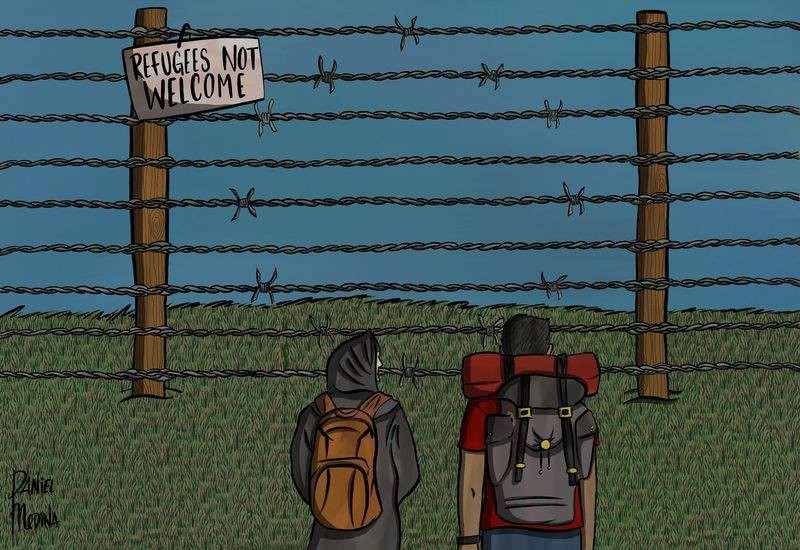

### AYS DAILY DIGEST 05/05/2018: Cyprus, Greece, Malta, Italy and Spain presented a Position paper on the new reform of the Dublin regulation

_The 5 Southern Member States have issued a joint document with their request to the European Council when dealing with the Dublin regulation//37 people rescued at sea//LCG harassing Proactiva’s and Sea Watch’s vessels//New data available on arrivals on the Greek islands and the situation of unaccompanied minors in Greece//Bomberos arrived on Lesvos to face trial//An Afghan man died presumably after a fight in Patras//More news from France, Germany…_

Credit: Daniel Medina

**FEATURE**

Cyprus, Greece, Italy, Malta and Spain have presented a [joint Position paper](https://www.ecre.org/position-paper-from-southern-member-states-on-dublin-reform/) on the new reform of the Dublin regulation, which will take place within the next European Council meeting, in June 2018\. The 5 countries have reflected their views relating them to responsibility and solidarity\.

Mainly, they argue that those countries at the Southern frontline of Europe are the very same who undergo an important migratory flux as well as engaging in SAR activities; both conditions should be recognised in the context of the Dublin regulation by applying a reduction of the “fair share” to the benefit of the above mentioned Member States \(MS\) \.

Moreover, they claim that a MS “under pressure” should not be obliged to respect strict and limiting procedures nor to respect very short deadlines\. Consequently, MS “ _should have the possibility to decide whether to apply the pre\-Dublin checks to applicants from safe countries of origin or safe third countries_ ”, be able to temporarily suspend push\-backs requests, unless the requesting MS is under challenging circumstances itself\.

The 5 MS also ask for a reduction of the duration of stable responsibility \(State responsibility\) for an asylum applicant to a maximum of 2 years \(instead of the actual 10\), which will imply that “ _any further application after the cessation of responsibility should be considered as a new application for the purposes of the Dublin Regulation, thus leading to a new procedure for the determination of the responsible Member State_ ”\.

Stricter criteria should be applied when dealing with minors, meaning that before requesting a take back of the minor, MS should ensure that no relatives or family members \(including siblings\) are present in their territory\.

Italy, Spain, Greece, Cyprus and Malta also agree on an extension of the discretionary clause, which includes the possibility for a MS to return the person asking for asylum directly to the safe country of origin or to a safe third country, instead of to the first country of entry\.

“ _The allocation mechanism should alleviate the burden of the Member States under pressure and for this purpose the allocation pool should not be too limited_ ”\.

This last statement is strictly related to the policies adopted by Hungary, Poland, Czech Republic and Slovakia \(the [Visegrad group](http://www.visegradgroup.eu/documents/2017-2018-hungarian/20172018-hungarian) \), which have, on multiple occasions, reiterated their opposition to any kind of relocation scheme within their territory\. Furthermore, the 4 States have committed theirselves to **“** _strongly oppose any proposal on introducing a mandatory and automatic distribution system in line with the corrective distribution system in the Dublin proposal_ ”, renewing their will to support the Western Balkan countries, by sending equipment and forces \(as AYS [reported](ays-daily-digest-29-04-2018-hungary-to-send-montenegro-barbed-wire-to-protect-its-borders-1d737065ef21) last week\) \.

**SEA**

[37 people were rescued](https://www.facebook.com/seawatchprojekt/posts/2019615724923165?hc_location=ufi) by Sea Watch off the Libyan coast, after being harassed by the Libyan CG, which also tried to intimidate Proactiva Open Arms’s vessel with the use of force in international waters\.

A similar episode happened yesterday morning, when Sea Watch crew was warned by the Libyan CG to back off and keep the distance from the rescue scene\. Eventually, the rubber boat with an unidentified number of people on board was brought back to Libya, where they’re going to face inhumane conditions in prison\.

[Salvamento Marítimo has rescued](https://twitter.com/salvamentogob/status/992798669484290049?s=21) 169 people from 7 boats off the Spanish coats\. One of the persons was sick and unconscious and transferred by helicopter to the closest hospital\.

**GREECE**

_Arrivals_

Lesvos\.

In the morning \(5/5\), 37 people landed on the shores, while other 220 people landed early in the morning of Sunday \(6/5\) \.

Chios\.

175 new arrivals on Chios in the last 4 days, including 62 children\.

■■■■■■■■■■■■■■ 
> **[RSA](https://twitter.com/rspaegean) @ Twitter Says:** 

> > 175 new arrivals on Chios in the last four days including 62 children - #VIAL Hot Spot overcrowded -  no space for the vulnerable #refugeesgr #atoxicdeal 
photo credit: Salvamento Maritimo Humanitario https://t.co/bJSiHBtA1a 

> **Tweeted at [2018-05-05 17:23:07](https://twitter.com/rspaegean/status/992816976782417920).** 

■■■■■■■■■■■■■■ 

Samos\.

In April, 418 people arrived on the island, according to [UNHCR](https://www.facebook.com/AegeanBoatReport/photos/a285312485325196.1073741828.285298881993223/341565733033204/?type=3&theater) , where now around 2\.189 people reside, mainly from Syria, Iraq, Afghanistan\. Women are around 21% of the people present on the island and children around 30%, 11% of whom are unaccompanied\.

_Islands_

Lesvos\.

8 people were deported from the island to Turkey on Friday, [according to Advocates Abroad](https://www.facebook.com/advocatesabroad/posts/588122428214829?hc_location=ufi) \. The number of people present on Lesvos is now 9\.008, 6\.938 just in Moria\.

The 3 Spanish rescuers from PROEM\-AID [arrived on Lesvos](https://www.facebook.com/SAOassociation/posts/2145225445698844?hc_location=ufi) to face their trial on Monday, after being charged of international human trafficking \(in 2016\) and a consequent sentence of 10 years of prison if found guilty\.

Proem\-Aid vice\-president, Manuel Blanco, assured that “ _we are not only a non profit organisation made by people with the willing of saving lives, as well as we are professional fireman, public employees that have dedicated all our professional career to save other peoples’ life\. Since its arrival to Lesvos, Proem\-Aid have helped more than 50\.000 persons \[…\] \. The fireman rescuers, who will be joined by a delegation made by Athens Spanish consul and other Spanish politicians, will face this trial with the conviction that the good sense will triumph since there is no purpose of arrest those who just want to save lives_ ”\.

Two members of Team Humanity are also facing the same trial\.

**\#solidarityisnotacrime**

[Updates on the Moria35](https://www.facebook.com/LesvosLegal/posts/1834244286614276?hc_location=ufi) : 26 people are still detained over one week after their releasing order, as “ _they are being held in “administrative” detention purportedly to assess their legal status in Greece_ ”\.

_Mainland_

[UNHCR](https://data2.unhcr.org/en/documents/download/63462) has published data regarding unaccompanied minors in Greece, estimating their number at 3\.150–2\.318 still awaiting for shelter and 123 in protective custody and 659 reported as homeless\.

Nearly 41% of these children come Pakistan and around 26% per Afghanistan\.

[11 migrants were detained](http://www.ekathimerini.com/228345/article/ekathimerini/news/afghan-man-killed-in-brawl-at-patra-port-in-western-greece) by the police in the port of Patra, after a 20\-year\-old Afghan man was found dead on Friday\. According to the police, the death was a consequence of a fight that took place when a group of around 70 people left the former factory where they sleep heading towards another dismissed factory where another 20 people also live\. The fight broke out for uncertain reasons, but police found also bullet shells at the site\.

_Volunteers needed_

**FRANCE**

Eleonora, Theo and Bastien \(the 3 people in solidarity arrested after the Briançon march and detained in Marseille\) [were released](https://www.facebook.com/permalink.php?story_fbid=370613233424079&id=362786637540072) on Thursday evening, but, since then, they are forced to stay in French territory, to report their presence to the police everyday and be under constant observation by the French police, meaning that they can’t connect online or release political statements\.

Their first hearing will be on the May 31st; meanwhile, France has recently approved a new Immigration Bill that strongly penalise the “sans papiers”, the border is more and more patrolled by armed forces and the other racists and fascists individuals who think they are serving their country by detecting those who try to cross\.

**GERMANY**

[Increasing number of suicide \(attempts\)](http://www.fr.de/rhein-main/landespolitik/linksfraktion-viele-versuchte-suizide-von-fluechtlingen-in-hessen-a-1499192) by refugees in Hesse, Germany\. In 2017,there were 4 suicides \(one of them in the transit area of the airport\) and 70 cases of suicide attempts or self inflicted injuries \(18 suicide attempts in the transit area of the airport\) among refugees\. The party “Die Linke”, who asked for the numbers in the parliament, calls these numbers alarming and has requested better psycho\-social care and dignified housing for refugees\.

**We strive to echo correct news from the ground through collaboration and fairness\.**

**Every effort has been made to credit organizations and individuals with regard to the supply of information, video, and photo material \(in cases where the source wanted to be accredited\) \. Please notify us regarding corrections\.**

**If there’s anything you want to share or comment, contact us through Facebook or write to: areyousyrious@gmail\.com**

_Converted [Medium Post](https://medium.com/are-you-syrious/ays-daily-digest-05-05-2018-cyprus-greece-malta-italy-and-spain-presented-a-position-paper-on-2a73cf6e2547) by [ZMediumToMarkdown](https://github.com/ZhgChgLi/ZMediumToMarkdown)._
