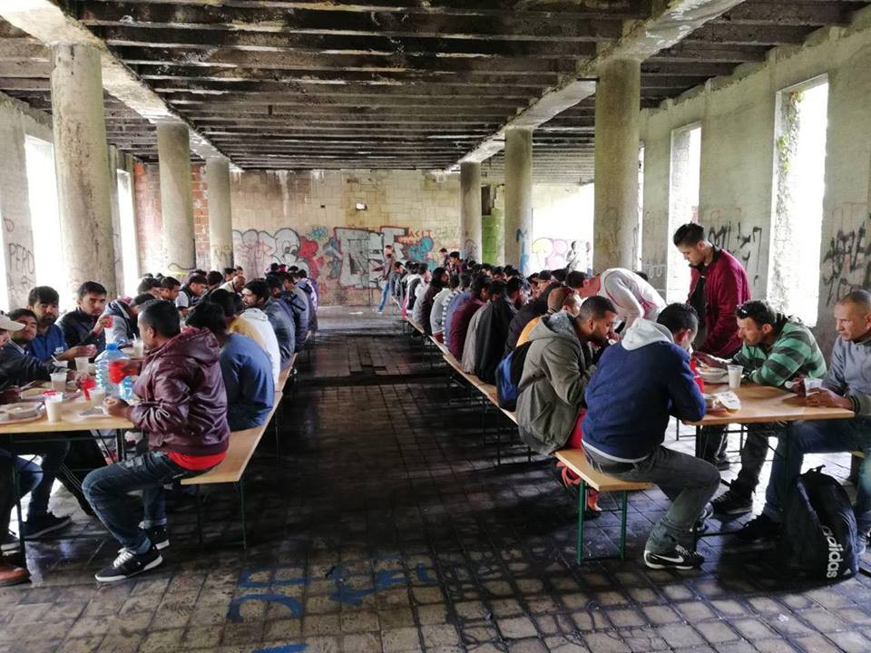

### AYS Daily Digest 06/05/2018: A Syrian man caught up in a racist attack is fighting for his life in Edinburgh

A Syrian refugee is in a critical condition after being stabbed six times in Scotland//Five search and rescue volunteers accused of ‘Human Trafficking’ go on trial today// 350 people arrive to Greek Island in one day\!// More news from Greece// Libyan Coast Guard intercepts another rescue operation// Rescues at Sea// Hungarian Prime Minister states no EU funding should be designated for ‘migrants’// More info from Romania// Austria// France

Source: The Welcome Tent
#### Feature: A Syrian refugee is in a critical condition after being stabbed six times in Scotland

[A twenty\-five\-year\-old Syrian refugee is fighting for his life](http://www.thenational.scot/news/16206793.Syrian_refugee_fighting_for_his_life_after_being_stabbed_in__racist_attack_/?ref=twtrec) after being stabbed in what is believe to be a racially motivated attack in Edinburgh, Scotland\.

Ali, the young Syrian man, was trying to protect his female cousin when he was stabbed six times, twice in the side and four times in the chest, by a group of two men and two women who knew he was staying at a hostel\.

Ali’s father was on the phone with him at the time of the attack and could hear the group shout “Why are you still here, why are you not back in your own country?” as they struck his son\.

[A fundraising effort](https://www.thescottishsun.co.uk/news/2603488/syrian-refugee-shahbaz-ali-racist-attack-edinburgh-crowdfund-campaign/) has been started by ‘Positive Action in Housing’ and ‘Unite Against Fascism’ for Ali’s recovery, and they claim that the governments are responsible for the increase in racism in the UK\.

> The organisers of the fundraising appeal for Ali have stated that the **‘attack is unsurprising given the constant hate speech against refugees, migrants and anyone who looks “foreign”\. The UK government has been drumming up racism for quite some time now with its hostile environment agenda\.’** 

**The governments and media agencies of European countries have a huge part to play in stirring fear and hatred in local populations toward refugees\.**

Today, the front page of a Bosnian newspaper has the headline **‘migrants are beating and robbing** \.’ With the Balkan route closed and more groups of people coming to Bosnia, public opinion towards refugees in the country is rapidly declining\. Fake headlines and news stories aimed to induce fear, such as this one are dangerous and divisive and to be blamed for these sorts of attacks on refugees\.

■■■■■■■■■■■■■■ 
> **[Nedad Memić 🇺🇦](https://twitter.com/NedadMemic) @ Twitter Says:** 

> > This is the headline of #Bosnia's largest tabloid daily Dnevni Avaz: "Migrants are beating and robbing around". More and more migrant groups have been coming to Bosnia-Herzegovina last months. The asylum centers are packed, the hysteria among media and population rising. https://t.co/fJYWinAJ4l 

> **Tweeted at [2018-05-06 09:51:42](https://twitter.com/nedadmemic/status/993065761831866368).** 

■■■■■■■■■■■■■■ 

The organisers of the appeal are calling on the police to find the attackers and bring them to justice\.
#### SEA
#### Another interception of a rescue operation by Libyan coast guard

The Aquarius was ordered to move away from a rubber boat in distress off the coast of Tripoli despite repeated calls to assist\. The boat was intercepted by the Libyan coast guard\.

■■■■■■■■■■■■■■ 
> **[MSF Sea](https://twitter.com/MSF_Sea) @ Twitter Says:** 

> > UPDATE: The #Aquarius continues to patrol the search & rescue zone, after a distressing day where we saw the Libyan coast guard pull people on a rubber boat back to an extremely dangerous #Libya, instead of a port of safety. Photo: Anthony Jean https://t.co/tN6BtWDrNY 

> **Tweeted at [2018-05-06 18:05:51](https://twitter.com/msf_sea/status/993190118553997313).** 

■■■■■■■■■■■■■■ 

#### The Astral volunteer team rescues 105 persons

Proactiva Open Arms announces that after months of tension with the Libyan coast guard, the Astral brought 105 people to safe shores\.

> We do not know what would have happened if their inflatable deflated, if we had not been nearby: saving human life in danger is a basic imperative — Proactiva Open Arms 

#### GREECE:
#### PROEM Trial:

On Monday five volunteers from part of Proem\-Aid, a Spanish search\-and\-rescue team, are facing trial in court for charges of attempted international human trafficking\.

The volunteers face up to 10 years in prison if they are found guilty\.

The charge comes after they were alerted on 16 January 2016 about a refugee boat on the verge of shipwreck in the Mediterranean Sea\. Despite the fact that they did not find any boat at sea, they were arrested and taken to the Police Station by the Greek coast guard\. Here they were charged\.

> “We are not only a non\-profit organisation made up of people willing to save lives, we are also professional fireman, public employees who have dedicated all our professional career to saving other peoples’ life — Proem\-Aid vice\-president 

Many organisations have publicised their solidarity with the volunteers on trial \.

■■■■■■■■■■■■■■ 
> **[Open Arms](https://twitter.com/openarms_fund) @ Twitter Says:** 

> > Toda nuestra solidaridad con las tres personas que mañana serán  juzgadas por salvar vidas en la isla de Lesbos. 
Proteger vidas en peligro no puede ser un crimen.
#SalvarVidasNoEsDelito #safelivesisnotacrime https://t.co/zYi6h3em6n 

> **Tweeted at [2018-05-06 12:52:03](https://twitter.com/openarms_fund/status/993111148185772033).** 

■■■■■■■■■■■■■■ 

> All our solidarity with the three people who will be judged tomorrow for saving lives on the island of Lesvos\.
 

> Protecting lives in danger can not be a crime \- Proactiva Open Arms 

> Solidarity with the five rescuers facing charges tomorrow in Mytilene, Lesvos\. 

> We stand in solidarity with the five rescuers who face a court case on Lesvos, Greece, tomorrow\. They have been saving lives at sea and for this, they are facing charges of human trafficking with long prison sentences, instead of being honoured for the tremendous work they have done\. 

> They appear before the court on Monday, May 7th, in Mytilene, Lesvos, and the proceedings will conclude on Wednesday\. Accused are three firefighters from Spain from the organisation Proem\-Aid, as well as Salam Aldeen and another person from Team Humanity\. All of them arrived in Lesvos in late 2015 to do sea rescue, a time when arrivals were at their highest, and they were arrested on 14 January 2016 after returning from a search mission at sea\. Salam Aldeen, one of the accused, has been prevented from leaving Greece for many months and during this time has continued his support for those who suffer from the EU borders on the shore\. The boat of Team Humanity remains confiscated\. 

> They were arrested while they did exactly what they had been doing for many weeks: rescuing people who were in danger of drowning\. They often closely cooperated with the Greek coast guard\. “If a pesron is a criminal who saves human lives, children’s’ lives — then I am a criminal\.” Salam told us\. 

> We witnessed another shipwreck, only recently, in front of Agathonisi\. Again 16 people died on the outer borders of the European Union\. Another day facing the deadliness of this border\-regime\. Another day we understand how crucial sea rescue still is\. It is certain, deaths will only increase as criminalisation of rescue increases\. 

> We stand in deep solidarity with the five of you\. You will be in our thoughts when you face the charges in court\. In the name of all the countless people who oppose these deadly borders, we want to thank you for your courageous work — Watch the MED — Alarm phone 

#### Arrivals:

Arrivals to Greek islands continue to be very high, with over 350 people arriving on Sunday morning to Lesvos and Chios, reports Ekathimerini\.

Since May 1st, 831 people have arrived from Turkey to the Greek islands of the Eastern Aegean\. Reception centres on the islands remain critically overcrowded as travel restrictions continue between the Greek islands and the mainland\.

Source: Philippa Kempson

The Aegean Boat Report provides a breakdown of the five boats, carrying 256 people that arrived on Lesvos on Sunday morning:

The first boat landed at Varia, Lesvos south at1:30 a\.m\. carrying 42 people\.

The second boat landed at St\. George, Lesvos south at 7:40 a\.m\. carrying 60 people\.

The third boat landed at Katia, Lesvos south at 8:00 a\.m\. carrying 61 people\.

The fourth boat landed outside Mytilíni Castle, Lesvos south at 8:30 a\.m\. carrying 59 people\.

The fifth boat landed at Tsipouri beach, Eftalou, Lesvos north at 1:20 p\.m\. carrying 34 people \(16 children, six women and 12 men\)
#### Greece to deploy 10,000 security guards to create standing corps at Evros River border with Turkey:

Six years after Greece created a barbed wire fence along the Evros River which borders with Turkey stretching 10 km, t [he European Commission has announced its plan to create a standing corps consisting of 10,000 border guards\. This aims to be up and running by 2027\.](https://euobserver.com/justice/141731)

This new endeavour would boost the overall EU budget on external borders, migration and refugee flows from the current €13 billion to over €34 billion for the period 2021 to 2027\.
#### The Hope Centre on Lesvos is in need of the following physical donations:

Hygiene, soap, shampoo, face cream, toothbrushes, toothpaste
Towels
Socks, 
underwear \(only new please\)
shoes & flipflops,
T\-shirts \(especially small mens\)
Trousers/shorts \(especially small mens\)
Diapers
Baby wipes
Female sanitary napkins \(no tampons\)
Strollers
Baby beds/baby boxes/bassinets
Blankets
Children’s toys
Sun block
sun hats
Tents
Mosquito repellent and nets for babies
#### Complications with applying for asylum in Greece summarised:

> To apply for asylum in Greece you need to call a Skype line that is open only a limited number of hours per week\. It is always busy\. You could call every day for months without getting an answer\. Meanwhile you have no papers, no documentation, no ID card\. this means no access to services including housing\. This means your only choice is to go to shelters which don’t discriminate between those with papers and those without—the squats\. This means the squats are overflowing and at a standstill because nobody is leaving, because they have no access to services, and more people are arriving by the day because they cannot access documentation\. For those thinking “why don’t they just register with the police”, if they go to the police and say they have no documents, they are not given the option to apply for asylum\. Instead they are simply given a police note which tells them they must leave the country under IOM “Voluntary Return” within 30 days\. If they don’t, they are illegally in the country, and this could compromise their asylum claim, or mean they would be deported\. 

#### Vial Hotspot in Chios After the Rain

](assets/a3969af7f825/1*LGL71P-69pm7A8GgU2WtkA.jpeg)

Source: [Mary Wenker](https://www.facebook.com/mary.wenker?hc_ref=ARRwCkQm7hdNHjj7NWtUbRiSWM7YFYAjBQi7dYCcyXKZES7Bm96mIISB2TezxUKd538)
#### DocMobile Volunteer warns medical support in Thessaloniki is still desperately needed as people continue to arrive:

> After January 2017 it was emotionally my most difficult stay\.
 

> After two days there, the situation changed within 24 hours\.
 

> Many families from the contested areas of northern Syria, who left only a few weeks before, appeared in Thessaloniki\. Put into buses, in the middle of the night “unloaded” at the bus station\. Supply by the government or UNHCR is zero\.
 

> Together with IHA — InterEuropean Human Aid Association we distributed food and blankets\. And then, of course, medical care\. Children with infections and skin problems, pregnant women, marked by exertions\.
 

> In the next weeks further bus transports are expected and we are prepared\.
 

> Then the mother from Afrin, who arrived on foot with three children aged 7, 10 and 11\. She and the children had spent three days at the Thessaloniki train station, threatened at the Turkish border, the eldest was kicked in the lower abdomen\. DocMobile provided first aid to the family and with the help of a Greek organisation, the family was taken to hospital\. The mother’s tears ran silently and more than stroking her cheek was not possible\.
 

> Another emergency call from Thessaloniki station\. 25 men from Afghanistan who crossed the Turkish border on foot were beaten and robbed there\. They had nothing but the clothes on their backs\. One of the men was knocked down with an iron rod, suffered a concussion, bruises to the face and bleeding in the inner ear\. After a ten\-hour stay in the emergency room, all\-clear\.
 

> Many people who fled continue to suffer from infected mosquito bites, scabies and sore feet, stomach problems and stress\-related headaches\.
 

> Mental problems are increasing, many of them are still not registered and have been living on the streets for months\.
 

> Above all, people do not receive dignified treatment\.
 

> Please donate so that we can continue to help these people medically\. 

Source: DocMobile
#### Lifting Hands International is looking for new coordinator:

TEAM COORDINATOR NEEDED: Lifting Hands International is after a coordinator ASAP to co\-lead our project in Serres, Northern Greece, with a minimum commitment of 100 days\. For more information contact greecevolunteer@liftinghandsinternational\.org

Responsibilities include: 
>manage the running of our warehouse, ensuring all aid distribution is timely and to budget
>oversee our recreational space, adapting to the evolving needs of camp residents
>run inductions and provide training to incoming volunteers
>ensure all other volunteers have the support they need
>help timetable classes for our educational programmes
>coordinate with other NGOs and organisations across Greece
#### BOSNIA:

Today, 140 meals were distributed by local volunteers and Red Cross in Bihać\. In Kladuša at just one distribution point almost 400 people came to eat\. Food is being prepared by the locals in a small restaurant and shared to everybody\.

photos by Red Cross Bihac and Adis Imamovic Pikxi
#### THE EU:
#### Hungarian Prime Minister Viktor Orban states that ‘No EU funding should go to migrants’

> [Viktor Orban stated on Friday](https://www.politico.eu/article/viktor-orban-budget-no-eu-money-should-go-to-migrants/) that he believes no cash from the EU’s long\-term budget should be allocated for migrants\. He also stated that Budapest would not approve the next multi\-annual Financial Framework if it is not happy with the allocation of funding\. 

> “We don’t think that even a single cent should be given to migrants,”

The final version of the proposal which was revealed by the Commission on Wednesday must be unanimously approved by all EU member countries\. Victor Orban also stated in a radio interview that other member states should pay out of their own national budgets for migration\-related costs\.

> “The Hungarians don’t need to worry\. As long as the Hungarians don’t give it the go\-ahead, there will be no budget\.”

#### ROMANIA:

15 young people took part in a public message of solidarity to refugees on the shores of Canalui Bega, Timișoara\. The young people were from Italy, Macedonia, Italy, Macedonia, Latvia, Colombia, Turkey, Syria, Spain, and Romania\. They each wore a message of solidarity on a white T\-shirt which encouraged passers\-by to leave a sign or words of support for refugees\.

> The result of the experience of contemporary street art will be presented under the exhibition “skin off” with [Regina Damian](https://www.facebook.com/regina.damian.50) on Friday, may 11, 2018, 20\.00 at the cap\. 

#### AUSTRIA:

[An insider source](https://www.facebook.com/ecada2017/posts/2054080201474642) has revealed that the Austrian Government has increased rates of deportations\. ECADA — European Citizens Against Deportation to Afghanistan have stated that if refugees are in school or in Ausbildung and have no protection status, they should go into hiding as soon as possible\.
#### FRANCE:

There are unconfirmed reports that three people have been killed in Paris last night in the Canal St\. Denis\. We are currently awaiting for verification of the information\.
#### Care4Calais update on keeping up morale:

> One of the toughest things in Calais is morale\. People can survive all kinds of things as long as they have hope; Calais drains it away, and watching that happen is painful\. 

> However today our volunteers decided to challenge the refugees to a race — I have no idea why\! Seeing them run in the sun made me smile\. Hearing them laugh was priceless\. 

#### L’Auberge des Migrants reports on a Walk of Solidarity that took place over the weekend:

Many people in cities big and small opened up their homes to those who joined in\.

Source: L’Auberge des Migrants
#### L’Auberge des Migrants are in need of volunteers:

> For one day, a month, or a year, join us\! We are looking for volunteers, in short, medium or long term, to participate in our actions at the warehouse and in the field\. 

For more information please [follow this link](http://www.laubergedesmigrants.fr/fr/volontariat/) \.

> **We strive to echo correct news from the ground through collaboration and fairness\.** 

> **If there’s anything you want to share or comment, contact us through Facebook or write to: areyousyrious@gmail\.com** 

_Converted [Medium Post](https://medium.com/are-you-syrious/ays-daily-digest-06-05-2018-a-syrian-man-caught-up-in-a-racist-attack-is-fighting-for-his-life-in-a3969af7f825) by [ZMediumToMarkdown](https://github.com/ZhgChgLi/ZMediumToMarkdown)._
