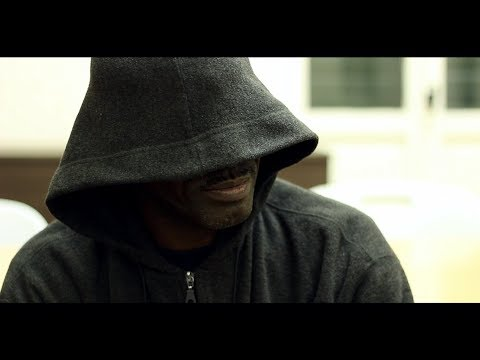

### AYS Daily Digest 07/05/2018: Seven of the Moria35 face deportation
#### Greek authorities refuse them aslyum / Ten\-Thousands newly displaced people in Afghanistan and Yemen, OCHA\-report states / Lifeguards found innocent / Apparently new deportation scheduled from Austria

](assets/b260ec073e5f/1*tDya-E2dtz_m1QyTHKfgCw.jpeg)

Even though some of them still have ongoing complaints against the police, seven of the Moria35 trial face deportation on Thursday\. Credits: [Refugee Accommodation and Solidarity Space City Plaza](https://www.facebook.com/sol2refugeesen/photos/p.1746733245619011/1746733245619011/?type=1&opaqueCursor=Abp2rbmldloNlVLV8q4DUcVVbp0AQP00LSXJ6WWVcxG0ntbS-32iSZRDNIaKKiEkiPaeOfoIFJjHA4Hqy0E-lSs0N6HltSBrBIqoNAzcqAq3CeMVxzQxdAOkqPgfB1kSKF6W8Qc7gJ3HZUtJ0F97DuJtd5-a0zEj5STomQ7KNw7PfckxkHNyK-1p2epUJ8uh1lOUy-IcVYuFYXLnG-N9GYOE1NObaTev4K2cS9cllvVfm77uKuk3wcXQ-mNAKDtw2G_tZYYDKLNQchGQF3hxkr6dZCcnsCj5qfwZJXtvS2Ffh5lqXDUJfvtFApi9yXDAItLiJVLMKKsj7tsE2wGugirmRfmZ_e0AzIW1sjnqjYQNE_Ugdgd09_TXewC6ETMZrEVHUXiOiAXUnxh1n-0fXGkg&theater)
### Feature: Seven of the Moria35 face deportation

The Legal Centre Lesbos [informs](https://www.facebook.com/LesvosLegal/posts/1836440213061350) , that seven people of the Moria35 trial face deportation on Thursday as their asylum applications were rejected by Greek authorities\. The Legal Centre criticizes:

> After over a year of dehumanizing treatment, from Moria Camp, to the viscous attack by the police, followed by nine months of unjust imprisonment, they now face being sent to Turkish prison, and likely deportation to the countries they fled\. 

Additionally, the group sees clear reasons to grant these people asylum in Greece, as all of them had witnessed crimes or been victims of it\. “There is an open ongoing investigation initiated by the public prosecutor against the police, for which all seven are important witnesses,” LCL remembers\. Three of the seven have themselves filed complaints against the police because of the attacks\.

The Moria35 case [was about](ays-daily-digest-26-04-2018-syrians-about-to-lose-their-property-by-law-c42cc47255be) arrests following clashes in the hotspot on 18th July 2017\. Witnesses and the defendants themselves criticized, that they were arbitrary arrested by police forces far after the riots, when everything was calm again— some even stated, that they were not involved in the fights or protests at all\. The police was criticized for the use of excessive violence, including tear gas\.

However, according to the Legal Centre Lesbos, 32 of the 35 defendants were found guilty of injury to public officals, but acquitted on all other charges\. They were eligible for a suspended prison sentence and therefore released soon after\. The three others were fround innocent of all charges\. “The trial in Chios was fraught with serious procedural problems, including an absence of interpretation for the majority of the trial and the severely limited time the defendants and defence witnesses were given to present their side of the story,” LCL [concluded](http://www.legalcentrelesbos.org/2018/04/28/the-moria-35-trial-results-in-conviction-of-32/) the judgement\.

Now the group criticizes, that the possible deportation will violate their rights to due process and further help the accused police officers to not be sentenced\.

■■■■■■■■■■■■■■ 
> **[ffm-online](https://twitter.com/ffm_online) @ Twitter Says:** 

> > Rassismus im Gerichtssaal – Urteil gegen die Moria 35 auf Chios [dlvr.it/QRTyjf](http://dlvr.it/QRTyjf) https://t.co/yzC7OqyXQL 

> **Tweeted at [2018-05-02 10:52:58](https://twitter.com/ffm_online/status/991631626474999808).** 

■■■■■■■■■■■■■■ 

### Afghanistan

Since the beginning of the year, the United Nations Office for the Coordination of Humanitarian Affairs \(OCHA\) [verified](https://reliefweb.int/sites/reliefweb.int/files/resources/20180507_afghanistan_weekly_field_report_30_april_-_6_may_2018_final.pdf) more than 83,000 Internally Displaced People \(IDP\) by conflicts\. In the last week alone, almost 20,000 new IDP’s were reported\. Especially in the North\-Western province Faryab at the border to Turkmenistan the fights seem to intensify at the moment, more than 9000 people had to leave their homes reportedly\. In a similar timeframe, more than 25,000 Afghan citizens returned or were returned from abroad —out of them, more than 11,000 people were deported back from Iran\.
### Yemen

Also in Yemen, the situation remains unstable and dangerous for many people\. OCHA states in [another report](https://reliefweb.int/sites/reliefweb.int/files/resources/20180507_Humanitarian_Update_Final_1.1.pdf) , that more than 100,000 people left into areas covered by the Aden hub during the last six monhts as the conflict in the Western part of the country intensified\.
### Greece

Sea rescue is not a crime, is what a Greek court ruled today in the case of three Spanish and two Danish volunteers\. The lifeguards were accused of rescueing without permisision back in 2016 and faced a sentence of up to several years in prison\. The court now said, they did not intend to smuggle people but acted on brotherly love\. “We’ll be back to save lives”, Proem\-Aid announced\.

■■■■■■■■■■■■■■ 
> **[RSA](https://twitter.com/rspaegean) @ Twitter Says:** 

> > Moment @[proemaid](https://twitter.com/proemaid) firefighters and @[teamhumanity](https://twitter.com/teamhumanity) volunteers were found innocent from charges of attempted smuggling #savinglivesisnotacrime https://t.co/0jJB5Y8cl3 

> **Tweeted at [2018-05-07 15:48:39](https://twitter.com/rspaegean/status/993517980783906818).** 

■■■■■■■■■■■■■■ 

45 people in a wodden boat were rescued south of Crete today by the Greek Coast Guard\. According to [Ekathimerini](http://www.ekathimerini.com/228384/article/ekathimerini/news/frontex-locates-migrant-boat-talks-underway-for-safe-transfer) \(referring to ANA\-MPA\), they firstly did not want to disembark in Greece and asked to be transferred to a safe place\. After negotiations, they finally agreed to disembark on Crete, volunteers report\.

While since Friday 594 people arrived in 13 boats in Greece, according to [Aegean Boat Report](https://www.facebook.com/AegeanBoatReport/posts/342570246266086) 16 more carrying 756 were apprehended by the Turkish Coast Guard and police the make their way\.

In a clash at Langadika outside of Thessaloniki, six people were injured last night, Ekathimerini [reports](http://www.ekathimerini.com/228370/article/ekathimerini/news/six-injured-in-clashes-at-refugee-center) \. The police estimated more than 200 people to be involved in the fights, four were arrested\. The injured persons were taken to the hospital\.

The shipping company Grimaldi Lines is [reportedly](http://www.keeptalkinggreece.com/2018/05/07/patras-shipping-company-ferries-migrants/) putting pressure on the port authorities to take measures at the port of Patras\. Dozens of people on the run try to make it via this route to Italy and then continue their way to North\-Western Europe\. In order to avoid delays, Grimaldi Lines in a letter demands more security controls and the implementation of international safety standards\. Reports, that the company would even change its harbor of operations have been denied from the company itself and the Patras Port authorities\.
### Bosnia

### Austria

An unconfirmed number of people is expected to be deported back to Afghanistan, the Afghanistan Migrants Advice & Support Org [said](https://www.facebook.com/195295217167437/photos/a.1419588361404777.1073741843.195295217167437/1931982553498686/?type=3&theater) \. “The returnees will be provided with 2 weeks of accommodation at a hotel in kabul\. They will also receive some sort in kind support \(not cash\) after they go through a series of paperwork\.”
### Sea

While the Greek court clearly emphasized in its ruling, that sea rescue is not a crime, NGOs in the central Mediterranean still struggle to fulfill their duties in accordance with maritime law\. The Aquarius \(SOS Mediterranee\) and the Astral \(ProActiva Open Arms\) had to be on stand\-by for around 15 hours waiting the maritime authority to transfer 105 rescued people\. “Confusion and delays are putting their health at risk,” SOS Mediterranee [criticized](https://twitter.com/SOSMedIntl/status/993466251484811264) in a statement\. After these hours of delay, the finally got the permission to disembark the people\.

AFP [reports](https://apnews.com/d2cf4d6b2195422e8faf0e10fd9e286f) about the incident, that the Italian Coast Guard asked the British authorities for authorization of the transfer as both ships are sailing under the British flag\. But they replied to not be the coordinator

](assets/b260ec073e5f/1*0RXPu5Ku7s5ZMvhAUJT-DQ.jpeg)

After 15 hours of waiting, the rescued people could finally leave the Aquarius\. Credits: [Anthony Jean/SOS Mediterranee](https://twitter.com/SOSMedIntl/status/993596844512088064)

On the other side at sea, the Moonbird crew of Sea\-Watch witnessed another two illegal pull\-backs of the Libyan Coast Guard in international waters off Tripoli\. IOM Libya additionally [reported](https://twitter.com/MissingMigrants/status/993485982237413378) , that during a rescue operation of the LCG three people were found dead at sea, while one could be recovered\. The number of dead and missing people is now estimated to be 619 in the current year\.

### France

AYS previously [reported](ays-daily-digest-2-5-18-more-than-3000-new-arrivals-in-greece-in-april-3684b8483114) about the changes in the French asylum system starting from 1st May\. “Faces Before Numbers” now published a detailed summary about the new procedure and the appointments via phone\. Further they explained, why this system makes asylum more inaccessible for the poeple: The biggest problems seem to be, that not all people on the run own a phone and hence struggle to call the hotline to make an appointment\. Secondly, not all needed languages are provided\. For example Eritreans, who only speak Tigrinya, cannot make appointpents on their own as they cannot communicate with the authority in charge\.

For the ones willing to learn French during their stay, [Réfugiés Bienvenue](https://www.facebook.com/refugiesbienvenue/?ref=gs&fref=gs&dti=1006253006128240&hc_location=group) hosts language courses in small groups from one to three people per teacher\. The lessons are provided every Wednesday from 1pm to 2pm at Reed Expositions, 52–54 quai de Dion\-Bouton à Puteaux \(Métro : Esplanade de la Défense, Exit \#3, then go right and down towards the Seine to arrive at the quais\) \. More classes can be arranged individually with the teachers\. Additional questions can be asked to info@refugiebienvenue\.com\.

](assets/b260ec073e5f/1*Rz4Jl3VtpLMqNIC8nA-InA.jpeg)

Map to Reed Expositions\. Credits: [David Durand\-Delacre](https://www.facebook.com/groups/P2PParis/permalink/1693574050729462/?hc_location=ufi)
### Ireland

The Irish Red Cross made another appeal for pledged of accomodation for some of the 1800 people, who are relocated from Lebanon and Greece\. According to [RTE News](https://www.rte.ie/news/2018/0506/960635-red-cross-refugees/) , a total of almost 670 pledges were made, almost 500 of them in 2015\. But for different reasons, only 44 of them remained — only a total of 47 people have been accomodated until now\. In its new call, the Irish Red Cross is asking for 47 people to accomodate\. The pledged accomodation is one form of accomodation and according to the Irish Red Cross especially a for single people a good way to find housing and helpful in terms of integration\.

**We strive to echo correct news from the ground through collaboration and fairness\.**

**Every effort has been made to credit organizations and individuals with regard to the supply of information, video, and photo material \(in cases where the source wanted to be accredited\) \. Please notify us regarding corrections\.**

**If there’s anything you want to share or comment, contact us through Facebook or write to: areyousyrious@gmail\.com**

_Converted [Medium Post](https://medium.com/are-you-syrious/ays-daily-digest-06-05-2018-seven-of-the-moria35-face-deportation-b260ec073e5f) by [ZMediumToMarkdown](https://github.com/ZhgChgLi/ZMediumToMarkdown)._
