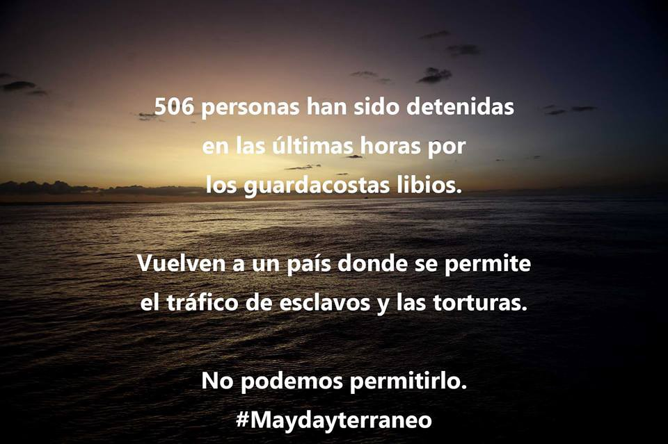
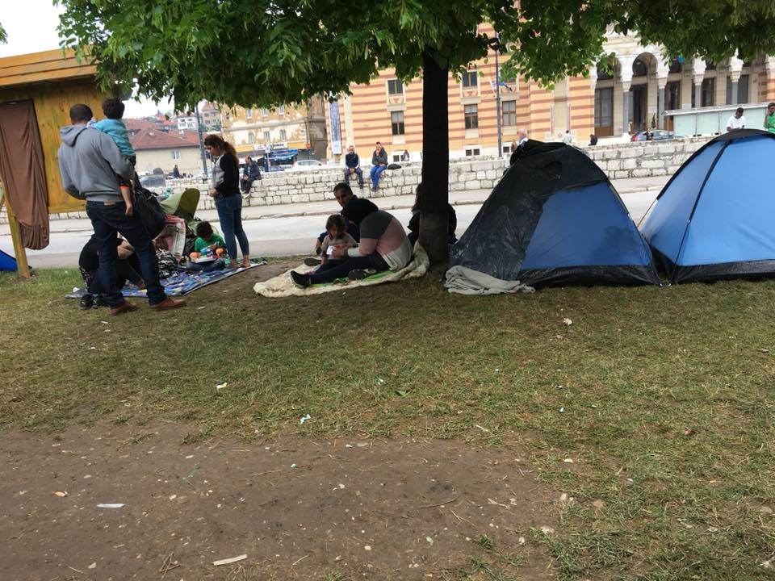

### AYS Daily Digest 08/05/2018 Concerns for human trafficking victims in Hungary

Updates from rescues in the Central and Western Mediterranean /// Legal case to start against Italy /// Deportation halted for 7 refugees of the \#Moria35 //// Updates from Sarajevo /// More info and news from Serbia, France and Germany…

 \)](assets/64ba2648d2e2/1*NV1agU5lgHQP17UyYyeQ5A.jpeg)

Saving lives and standing in solidarity with those fleeing war and misery cannot be a crime \#OpenArms \#Solidarity4all \(by [Mediterranean Hope](https://www.facebook.com/Mediterranean-hope-252231521632595/) \)
#### FEATURE: Concerns for human trafficking victims in Hungary

The Council of Europe’s Group of Experts on Action against Trafficking in Human Beings \(GRETA\) have released a [new report](https://rm.coe.int/greta-2018-13-upro-hun-en/16807bf672) regarding the situation of human trafficking victims in Hungary with particular attention to the border between Hungary and Serbia\.

Hungary suspended normal asylum procedure when a national ‘state of crisis due to mass migration’ was introduced in 2015 and this will currently run until September 2018\. This means all asylum seekers must apply for international protection in the transit zones\. These transit zones have been repeatedly [criticised by international actors](https://budapestbeacon.com/unhcr-chief-says-hungarys-transit-zones-are-really-just-detention-centers/) as being a form of [illegal detention](https://www.helsinki.hu/en/minimum-standards-required-in-the-transit-zones-on-the-hungarian-land-borders/) \.

Hungary is a signatory of [the Council of Europe Convention on Action against Trafficking in Human Beings](https://rm.coe.int/168008371d) , and is legally required to put in place suitable safeguards for the identification and protection of trafficking victims\. Yet this has clearly not been managed\.

> Most of the staff working in the transit zones who were interviewed by the GRETA delegation were unable to provide a clear explanation as to what procedures would be followed or who were the competent authorities to take decisions on victim identification and referral\. 

GRETA also expressed profound concern about children in the transit zones as the Hungarian authorities define those aged 14–17 as adults\. These children are often subject to examinations to determine their age which can in themselves be traumatic\.

> GRETA notes that both under the United Nations Convention on the Rights of the Child \(Article 1\) and under the Council of Europe Convention on Action against Trafficking in Human Beings \(Article 4, alinea d\) a “child” is any person under 18 years of age\. GRETA is deeply concerned that children aged 14–17 years may be particularly vulnerable because they are treated as adults, despite their minority 

They also noted that there were as many as 9136 cases of expulsions of irregular migrants to Serbia during 2017\.

> While a “crisis situation caused by mass immigration” is in force, any person found on Hungarian territory without regular residence status is immediately escorted to and removed across the HungarySerbian border without individual screening for vulnerabilities or any procedural safeguards\. 

This does not comply with Hungary’s obligations under the Convention, including the positive obligations to identify victims of trafficking and to refer them to assistance, and to conduct a pre\-removal risk assessment to ensure compliance with the obligation of non\-refoulement

In a continued anti\-migrant stance the Hungarian Government offered a symbolic gift of 25 kilometres of barbed wire to the government of Montenegro, to be placed along the state border ‘with the aim of better preparedness of Montenegro for the possible higher inflow of migrants through our territory,’ according to [ECRE](https://www.ecre.org/victims-of-trafficking-slip-through-the-net-in-hungarian-transit-zones/) \.

**SEA**

 \)](assets/64ba2648d2e2/1*xRgM5ZaWBo_-gdfSd-FUcQ.jpeg)

“In these months rescue operations also have been carried out by the Libyan Coast Guard, calculating that one out of three migrants departing from Libya this year is met by the Libyan Coast Guard and turned back” \( [Flavio di Giacomo, IOM](https://www.iom.int/news/mediterranean-migrant-arrivals-reach-23715-2018-deaths-reach-619) \)
#### **Updates from Aquarius**

■■■■■■■■■■■■■■ 
> **[MSF Sea](https://twitter.com/MSF_Sea) @ Twitter Says:** 

> > UPDATE: #Aquarius has been assigned a port of safety and is now heading north with 105 #refugees and #migrants rescued in #Mediterranean. Photo: @[lgouliam](https://twitter.com/lgouliam) #AFP https://t.co/c4Fk0uvgiy 

> **Tweeted at [2018-05-08 20:55:53](https://twitter.com/msf_sea/status/993957682490036225).** 

■■■■■■■■■■■■■■ 

Following what we reported [yesterday](ays-daily-digest-06-05-2018-seven-of-the-moria35-face-deportation-b260ec073e5f) about the [tug\-of\-war](http://www.ansa.it/english/news/politics/2018/05/08/migrant-tug-of-war-deplorable-eu_ee9d2b71-10dd-4b50-bc83-ebe95665b520.html) between Italian and British coast guards, Italian authorities gave the Aquarius a safe port to disembark the 105 people transferred from the Astral\.

The boat was finally able to set a course North\. After three days at sea the health of the survivors was quickly deteriorating\.
#### Salvamiento Maritimo rescues 186 people

■■■■■■■■■■■■■■ 
> **[SALVAMENTO MARÍTIMO](https://twitter.com/salvamentogob) @ Twitter Says:** 

> > Localizada la patera buscada a 16 millas al NW de la isla de Alborán. 56 varones a bordo de la Salvamar Hamal. Llegan a Motril a las 18:30h. Helimer 207, Sasemar 305 https://t.co/UuvZd4d8zJ 

> **Tweeted at [2018-05-08 14:52:31](https://twitter.com/salvamentogob/status/993866240937558016).** 

■■■■■■■■■■■■■■ 

■■■■■■■■■■■■■■ 
> **[SALVAMENTO MARÍTIMO](https://twitter.com/salvamentogob) @ Twitter Says:** 

> > Rescatadas 3 pateras en Mar de Alborán. Guardamar Polimnia lleva 75  personas a Almería de 2 pateras (32+43). Salvamar Alnitak con 55 hacia Málaga. Se busca otra más: Sasemar 305, Helimer 207, Salvamar Hamal https://t.co/EIkX3PtwY6 

> **Tweeted at [2018-05-08 14:04:25](https://twitter.com/salvamentogob/status/993854134364360705).** 

■■■■■■■■■■■■■■ 

#### Mission Lifeline is looking for a Machinist

#### Maydayterraneo — Proyecto AitaMari needs funding

> Without Witnesses, human rights are not respected in the central Mediterranean\. Without Human Rights Defenders, thousands of people are in danger in Libya\. 

In the last hours 508 people have been arrested by the Libyan coastguard\. They are going back to a country were torture and human slavery are permitted\. We can’t permit it\. \#Maydayterraneo

Support them [here](https://www.facebook.com/MAYDAYTERRANEO/?hc_ref=ARRRxIVLTocZao7ko1xa_aE8sRvM98FWlCjX49VdHgjYqOstDiOlj8KbKK5fEctEjco&fref=nf) \!

**Greek Islands**
#### Latest from Lesvos

Arash Hampay reports on the anti\-fascist demonstration in Mytilene, called in response to the attack on refugees on Sunday 22nd of April\.

Following what we [reported yesterday](ays-daily-digest-06-05-2018-seven-of-the-moria35-face-deportation-b260ec073e5f) , after a lot of pressure the deportation of 7 refugees from the \#Moria35 has been [halted](https://twitter.com/sol2refugees/status/993939249383821314)

In bizarre news, it is now possible to come on a 1 week [Christian volunteer holiday](https://servantgroup.org/Greece/) from the US for only $1800 to $2200 depending on trip location and activities\. Although this does not include airfare to Greece it’s still a complete bargain\!

And guess what? You get to volunteer with Eurorelief on Lesvos, a group that AYS and other outlets have reported many issues with, including providing assitance to the authorities with deportations\.

Refugees and migrants need genuine aid and human rights, not attempts at conversion\.
#### Latest from Chios

[Chios People’s Kitchen](https://www.facebook.com/chiospeopleskitchen/) currently supply one warm meal per day to the students of the refugee school, to the residents of the unaccompanied minors shelter and to the clients of the women’s centre, as well as dry food packs to residents in the camp and in apartments\. Each pack provides enough food to feed a family for several days\.

The number of refugees currently on Chios is officially close to 2000\. The camp capacity is 1014\. It is hard to describe the difficulties and chaos of the current situation\. They need support to continue feeding humans\.

You can see their Needslist [here](https://needslist.co/nlclaim/992/add/65) \.

**Mainland Greece**

Mobile info team have published details of [when to renew your Greek residence permit](https://www.facebook.com/mobileinfoteam/photos/a.1800063030222418.1073741830.1796286800600041/2167717423456975/?type=3&hc_location=ufi) \.

> If you have asylum in Greece, you will get a residence permit, which is normally valid for three years\. You can see one on the picture of the post\. The date of expiry of the residence permit is marked in our picture with a red circle\. Some months before your residence permit expires, you should submit an application to renew your residence permit\. The Asylum Service has recently announced, that if you have asylum in Greece and your residence permit expires by 30th of September, you should submit an application to renew your residence permit by latest 31st of July\. 

For more information about how to renew your residence permit, please click [here](https://www.mobileinfoteam.org/residence-permit) \.

Refugee\.info have published [information](https://blog.refugee.info/family-reunification-flights/) about how to book family reunification flights in May 2018\.

People who are eligible to book this month are:

> People in Greece who were approved for Family Reunification to Germany in May 2017 can book and buy their own flights now\. 

> People in Greece who were approved for Family Reunification to Germany in June 2017 will get permission to book and buy their own flights later this month, after May 20, 2018, the Asylum Service told us\. 

> People in Greece who were approved for Family Reunification to any other European country \(not Germany\) in December 2017 or January 2018 can book and buy their own flights now\. 

The Ministry of Digital Policy Telecommunications and Media has released a newsletter showing their ‘understanding’ of conditions for refugees in Greece over the last three years and states that there are currently approximately 55,000 asylum seekers in the country\. They hope that this will give international media a ‘clearer’ picture of what is happening in Greece, a very unlikely proposition\.

The newsletter contains a particularly interesting section on funding\.

> According to the Ministry of Economy and Development data, the financial support budget amounting to €561 million allocated to Greece under the national programs for 2014–2020 \(€322\.8 million from AMIF and €238\.2 million from ISF\) was increased by more than 20% following negotiations and successive amendments\. Note that, in April 2016 this budget amounted to €454 million Euros\. The sum of €115\.3 million, out of the total €561 million that has been allocated to Greece in the form of advance payments and annual instalments has already been absorbed by the Greek authorities\. 

Exactly how the Greek Government ‘absorbed’ €115\.3 million is not stated\.

You can read the full report [here](http://mindigital.gr/index.php/pliroforiaka-stoixeia/2259-newsletter-on-the-refugee-migration-issue-no1-2018) \.

According to [local media](http://www.keeptalkinggreece.com/2018/05/08/greece-grants-asylum-turkish-serviceman/) the Greek Asylum Committee has granted political asylum to a second Turkish serviceman, one of the 8 who fled to Greece on a helicopter, after the failed coup in summer 2016\. The man will soon be released from custody\. Three extradition requests have been submitted by Ankara but all have been turned down by the Greek court as they do not believe they will receive a fair trial in Turkey\. And yet, Greece still continues to deport people from the islands to Turkey\.

Hestia Hellas need volunteers to work with children\. More info [here](https://hestiahellas.org/get-involved/volunteer/) \.

**Italy**

Seventeen survivors of a fatal incident in which a boat carrying migrants found itself in distress off the coast of Libya have filed an application against Italy \(08\.05\.18\) with the European Court of Human Rights, as reported by [Statewatch](http://www.statewatch.org/news/2018/may/italy-lcg-legal-action-pr.htm) \. The applicants included the surviving parents of two children who died in the incident\. This important step will hopefully force the authorities to admit that those dying at sea are indeed humans to have rights under international law\.

Today [Forensic Ocenography](https://www.forensic-architecture.org/) presented the case in Rome:

**Read the whole story in this [Twitter thread](https://twitter.com/ForensicArchi/status/993784510906077185)**

**Bosnia**

According to Marijan Baotic, Assistant Minister of Security, the Foreign Affairs Service and the Border Police have so far registered 3,150 people while detecting irregular migration and they have been informing people that when they enter the territory of Bosnia, they should seek asylum\. Baotic stated that 383 migrants had applied for asylum by the end of April and that if this trend continues, more than a thousand will apply by the end of the year\. The government announced also that first camp could be open near city of Mostar\.
#### Updates from Sarajevo

More than 400 people are sleeping outside in Sarajevo city center at the moment\. Help is mostly provided by the local population and a small group of the international volunteers\. Bosnia currently has the capacity to house about 160 people\.
#### Souls of Sarajevo needs support

> For the last 2 months Souls of Sarajevo, a grassroots organisation consisting of seasoned local and international volunteers have been building up a street distribution system to cater for the spiralling refugee crisis in Bosnia and namely Sarajevo… we need a van to continue and expand our distribution operations on the ground in Bosnia\. With the increasing numbers of people arriving to the country the demand for help is steadily growing so we need a good sized vehicle to support the people on the ground distributing hot food cooked by refugees for refugees,cold food packs,raw food packs for people in houses and hostels, sanitaries, sleeping bags, blankets and also to transport people to shelter\. Please help us continue to help these people stuck in this awful situation\. 

> Thank you 

Support them [here](https://www.gofundme.com/distribution-van-for-sarajevo)

**Serbia**

UNHCR have published their [April 2018 ‘Snapshot’](https://l.facebook.com/l.php?u=https%3A%2F%2Fdata2.unhcr.org%2Fen%2Fdocuments%2Fdownload%2F63489&h=ATPqRa7g3eedNE_gtRcXyXM_7XIkffMVgQ1nOfICsCvyZQPNBKrBJi-XYKAtUkccX51xW5nRkghZ4lxOgrKoO8V2ARul64LslAW4N6WifToLjq7058TT8kzAfs84jwWj) of Serbia, which shows a rise in collective expulsions from both Hungary and Serbia and an increase in pushbacks from Serbia\.

**France**
#### Two men drowned in Canal Saint\-Denis

[Infomigrants](http://www.infomigrants.net/fr/post/9106/a-paris-un-corps-repeche-dans-le-canal-pres-du-camp-de-migrants-du-millenaire?ref=fb) report that the Police have confirmed that a body was retrieved from the Canal Saint\-Denis on Sunday\. The man was found in the north of Paris on the border with Aubervilliers, a few meters from the huge migrant camp named ‘the Millennium’\. According to residents of the camp, the victim was Somali\. There are currently approximately 1,500 living in this informal community\. The prosecutor’s office Aubervilliers has opened an investigation into this man’s death\.

The following day, Monday night at around 12\.30am, another person lost their life in the same stretch of water\. The man was Afghan and apparently under the influence\. [Local media](https://www.francebleu.fr/infos/faits-divers-justice/paris-un-jeune-homme-migrant-se-noie-dans-le-canal-saint-martin-1525781277) says it remains to be seen how and why he drowned\.
#### Three month of occupation of the buildings by the exilè\.e\.s\. in Paris

**Germany**
#### Refugees statement from Ellwagen

After the [resistance against deportation and the subsequent police raid](https://enoughisenough14.org/2018/05/07/a-very-big-salute-to-the-refugee-resistance-in-ellwangen-the-voice-refugee-forum/) in Ellwangen last week, a statement from the refugees living there was published, detailing the events, the violence of the police and the questionable reports by local and mainstream media\.

Read it [here](https://enoughisenough14.org/2018/05/08/statement-by-the-refugees-from-ellwangen-germany-on-police-raid/) \.

**General**

Italy Refugee Crisis Database have published a report on Humanitarian Corridors — legal ways to travel to Europe\.

You can read it [here](https://l.facebook.com/l.php?u=https%3A%2F%2Flookaside.fbsbx.com%2Ffile%2FIRCD%2520REPORT%2520III_HUMANITARIAN%2520CORRIDORS.pdf%3Ftoken%3DAWxK6qnKVudcAqcP-GV6HapoW10sYiGBUM1mJvNvuhBq0ogXHzNF8n7uzUitwyXrJquxX1EUss-eNkgYgqSUJQ0o3m0US5E18hHpRAapGe_rmY1A3qVuVZbzWPCpGImeGo4wMFX0ktLEwmObKdVRsUomntZfY8DPfHNbAsm_8D3u09jOarau3qi-RWHX7Pr16QBXTGtXKl28D_7IH2rYNpFh&h=ATPnUCySucgf2w2BU9-PaEBK_O-Ie943tmIyIuSqgNvfFmu-cMoi1Rim8ojx6EfKBItMvFGp1kH6IzAqErlFxo3r1G6hePSSmo2bEoACxcYIuqferzdmqclnLo4w_w_JKQCQ3stHLssXAQ) \.

A group called Coach Activism are offering support to people working with refugees:

For more info email: jeff@mindsightasia\.com

**We strive to echo correct news from the ground through collaboration and fairness\.**

**Every effort has been made to credit organizations and individuals with regard to the supply of information, video, and photo material \(in cases where the source wanted to be accredited\) \. Please notify us regarding corrections\.**

**If there’s anything you want to share or comment, contact us through Facebook or write to: areyousyrious@gmail\.com**

_Converted [Medium Post](https://medium.com/are-you-syrious/ays-daily-digest-08-05-2018-concerns-for-human-traffic-victims-in-hungary-64ba2648d2e2) by [ZMediumToMarkdown](https://github.com/ZhgChgLi/ZMediumToMarkdown)._
