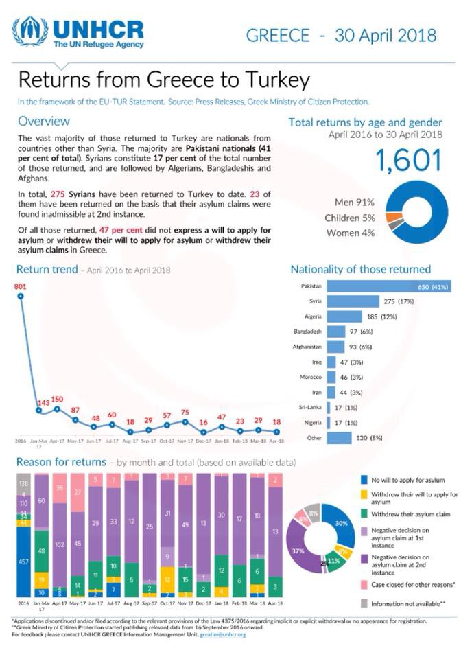
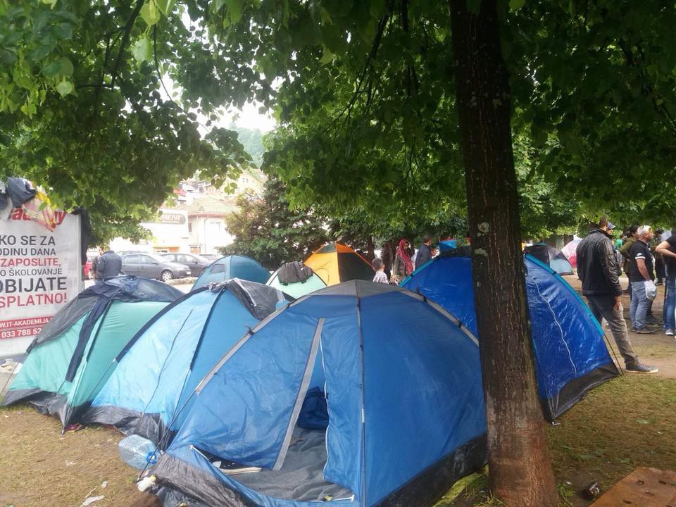
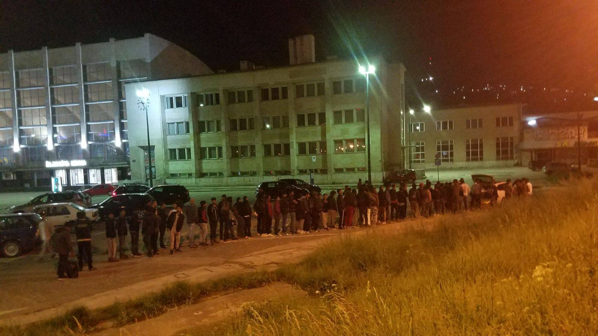
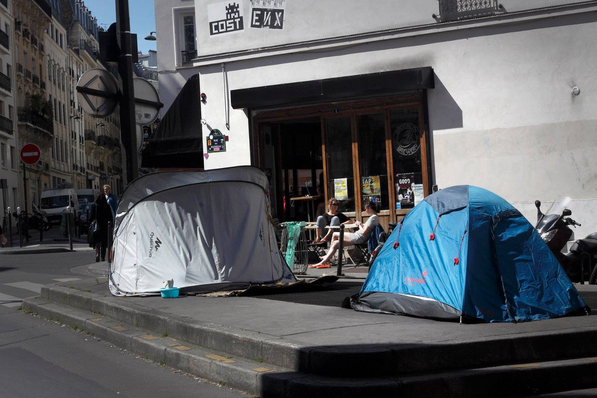
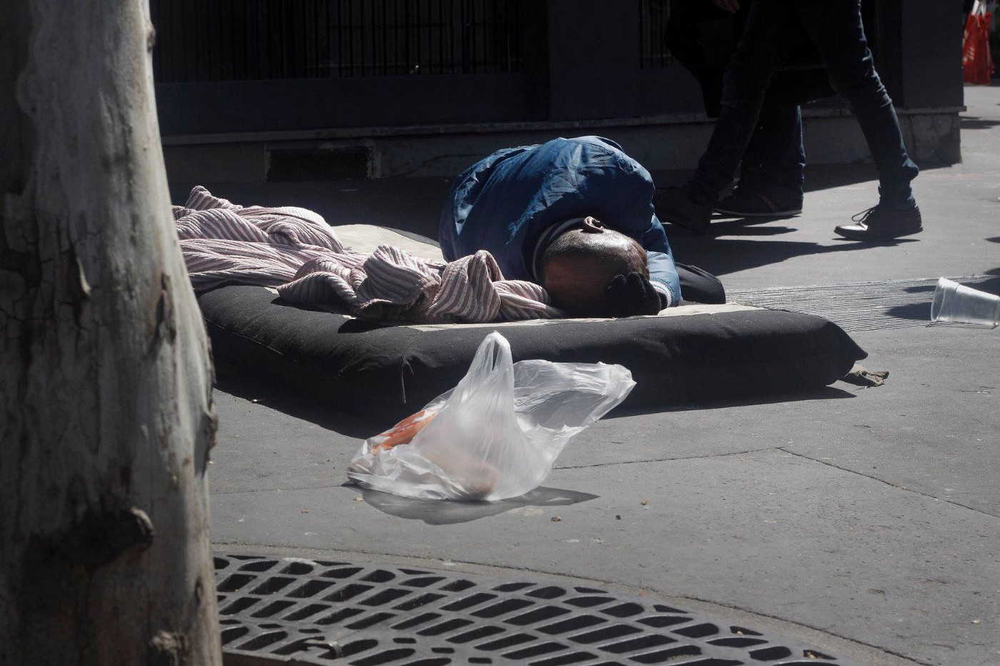
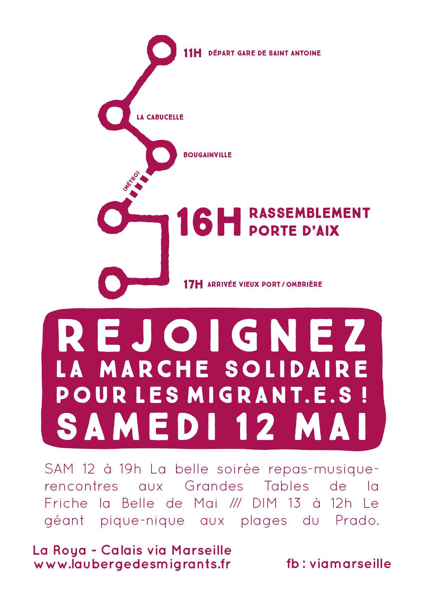

### AYS Daily Digest 10/05/18: Refugees are Prosecuted on Chios for Protesting

_Funds promised for refugees in Lebanon//Rescues at Sea//Account of atrocities in Libya// Container houses closed in Rome//New Arrivals and donation needs in Greece//Volunteers need support in Bosnia//and more…_

](assets/dda697a4641c/1*VzfH7W7DgbZsLBrkt3y_1A.jpeg)

“Life in Moria refugee camp, Lesbos, Greece, March 2018\. Photo Credit: [Orestis Seferoglou](http://Orestis Seferoglou)
#### Feature

Solidarity groups on the Aegean Islands [announced today](https://www.facebook.com/LesvosLegal/posts/1839137102791661?hc_location=ufi) the start of a trial for 10 refugees who were arrested on Lesvos for “rioting” last year\.

> After the Moria35 \[trial\] some weeks ago, tomorrow Friday 11th May another criminal trial starts in Chios for ten asylum seekers who have been charged with arson and other lesser crimes for riots in Moria camp on 10 July 2017\.
 

> One of the defendants is a well known advocate for the rights of the refugee communities in Moria camp\. 

Legal Center Lesbos commented on the trial, and connected it to other mass\-trails of refugees accused of rioting on the Aegean islands\. \(The Moria 35 are a group of refugees who were arrested and charged with rioting on Lesvos following a peaceful protest\. \)

> Similar to the case of the Moria 35, we believe this prosecution is part of an ongoing policy to criminalize and silence those who question their hostile containment in Moria and on Lesvos island\. 

The Legal Center also noted that one of the refugees who is being charged was known to the authorities as a community leader, and is accusing the arresting him under false charges in order to silence him\.

> We have witness this kind of counterinsurgency politics before, as state repression has been a tool against our struggles in everyday life\. Confronting these series of prosecutions we are going to stand in solidarity with the people that face the criminalization of their lives and make sure that they don’t stand alone against this machine that is called European migration Policy\. 

### Lebanon

[Last week the _Friends of Syria_](https://www.hrw.org/news/2018/05/08/what-brussels-conference-means-refugees-lebanon) conference took place\. During the gathering, donor countries together pledged a total of 4\.4 US dollars to support refugees living in the country\. The aim with the money is to make the living conditions better for the 1,5 million refugees living in the country\. The funds will mainly be used in educational options, but also to make sure that more refugees will be given legal status in the country\.

The number of 1,5 million refugees is only the official number\. It is very likely that the real number is more than 2 million, which is partly since the Lebanese government has not registered anyone since 2016\. People who arrived after that, are not officially registered as refugees in the country\.

Last week in Brussel, Lebanon said that they would make sure that “all eligible refugees can renew their residency free of charge” and process more applications\. The small country of about 4 million people, has due to its geographical location taking on a big burden the past couple of years, especially since the EU and its member states “cannot do more”\. But despite that, the well\-being of the refugees living here, should not be compromised\.

More info about what the conference in Brussels means to refugees in Lebanon [can be read here\.](https://www.hrw.org/news/2018/05/08/what-brussels-conference-means-refugees-lebanon)
### Sea

A [sea\-rescue group](http://SOS MEDITERRANEE) working in the Central Mediterranean released a video interview with a woman who was rescued from a boat this week\. She was among a group of 105 people who had to wait in a rescue boat for days because they were initially denied entry to Italy\.

■■■■■■■■■■■■■■ 
> **[MSF Sea](https://twitter.com/MSF_Sea) @ Twitter Says:** 

> > All 105 people on board the #Aquarius, including women and children, have been safely disembarked after days at sea in the port of Catania, Sicily. Photos: Anthony Jean https://t.co/QnJzNnh0cq 

> **Tweeted at [2018-05-10 10:13:39](https://twitter.com/msf_sea/status/994520838014734336).** 

■■■■■■■■■■■■■■ 

[In the video](https://www.facebook.com/SOSMEDITERRANEE/videos/1679918972115404/) the woman describes the inhuman conditions in the Libyan prison camps, where refugees are held and often ransomed by Italian funded gangs\. She describes being starved and denied water for weeks on end, and witnessing the murder of a child\.

For how long will Italy and the EU continue to turn their heads away from these crimes? While Italy funds torturers and kidnappers in Libya to “control” migration to the EU, they have launched a legal attack on multiple sea rescue groups\. While Proactiva Open Arms ship was released after being impounded by a Sicilian court last month, rescue volunteers are still facing charges that they have “aided illegal immigration”\.

The Portuguese navy frigate rescued approximately 54 people in the Mediterranean today\.

The SMH boat Marina Arcturus rescued 7 sub\-Saharan men 11 miles southwest of [\#Tarifa](https://www.facebook.com/hashtag/tarifa?hc_location=ufi) today\. A Moroccan naval ship took in 19 people from two dinghies\. \(People who are being forcibly returned to places they are trying to escape from cannot be called rescued\. \)
### Italy

An “accomodation center” made of container houses that the Red Cross had set up on Via Ramazzini in Rome was shut down this week\. The complex was housing an estimated 411 people\. While the Red Cross along with Italian authorities promised to find housing for the refugees after the closure, over 120 were left on the street afterwards, with absolutely no housing or support\.

[Baobab Experience](http://Baobab Experience) , the volunteer group which shared this news described the on\-going crisis of homelesness in Rome, and the complete lack of support from the authorities and international NGO’s\.

> The arrivals have been constant throughout the winter, and they are continuing to increase with the approach of the summer months\. We have been confronted not only with an increasing number of migrants in transit or deported to Italy by others European countries for the Dublin agreements, butalso to touch with a social and housing emergency which is the result of all the lack of answers from the institutions and politics of this city\. 

### Greece
#### Islands

[Aegean Boat Report](https://www.facebook.com/AegeanBoatReport/?hc_ref=ARRmw3b_qY_dll1K-AuQYz4dSI5sr0GRRNW8ZD5Y-lLpdtNFMvisaJaLfaJGnjYIuV4&fref=nf&hc_location=group) released information on two boats that landed on Lesvos today:

> Two boats arrived on Lesvos this morning, both around 06\.30\. 

> One boat picked up outside Korakas, Lesvos north, by HCG, 06\.30, transported to Skala\. 26 people, 4 children, 7 women, 15 men\. 

> One boat landed in Kalo Limani, Lesvos west, 06\.30, with 17 people, 
 

> 10 children, 5 women, 2 men\. 

The UNHCR released some statistics today on “returns” \(deportations\) from Greece to Turkey\. The phrasing they use is misleading, and it hides an ugly truth\. Their statistics cite that 47% of the people sent back either did not wish to apply to asylum, or “withdrew their claims”\. In the language of the UNHCR and IOM, this means these people are “voluntarily” returned\. However, the people who are sent back to Turkey often have the threat of prison in Greece looming over them once their asylum claims have been rejected\. Going back to Turkey is not a choice for most refugees, but something that is forced with threats of imprisonment\.

Announcement form the Greek Asylum Service, available in Farsi and Arabic [here](https://www.facebook.com/481351218685655/photos/a.578873295600113.1073741828.481351218685655/1010055935815178/?type=3&theater) \.

> On Sunday, 13 May 2018 the Regional Asylum Office of Attica will operate exclusively for the delivery of Residence Permits \(ID\) and Passports \(TDV\) to Arab\-speaking and Farsi\-speaking beneficiaries of international protection\. Those interested who will see on the Asylum Service’s website \( [www\.asylo\.gov\.gr](https://l.facebook.com/l.php?u=http%3A%2F%2Fwww.asylo.gov.gr%2F&h=ATO1A8WAlgrY_I9k2e8XSwTUYc9AGPZCUD65E0o1qsbgGGhrKwWjsuMEy1Ww9xNVEpLbLZUtKHV2gUMxqD7uyiW5Axwpgs1FklBQekj3zWOGC8ZhYVZanvnk5KvwfKmS8x8wLFMI5KDB) \) that the Residence Permits \(ID\) and Travel Documents \(TDV\) of the case have been posted can come to the Attica Regional Office of Asylum at 7\.30 the latest\. 

An organization that is fundraising for grassroots volunteer groups on Lesvos put out a call for donations today:

> It has been a really tough few weeks on Lesvos\. A couple of weeks ago, right winged nationalists came from Athens and attacked peaceful Afghan families protesting conditions at the camp\. Volunteers and refugees got hurt\. The latest estimate is that there are more than 9000 refugees stuck on Lesvos, with more refugees coming every day\. All the organizations we support are running out of funding\. So everyone is especially grateful that [Sea of Solidarity](https://www.facebook.com/SeaofSolidarity/?fref=mentions) continues to fund their operations with our monthly donations\. Every month, we are donating more than $5500 to the grassroots projects listed below\. We currently only have 2 months of funding left\. If you can, please consider making a donation at [www\.seaofsolidarity\.org](https://l.facebook.com/l.php?u=http%3A%2F%2Fwww.seaofsolidarity.org%2F&h=ATMDky3F3H1gkOtL1Nr81WIiMVpDSo4u5-k1mOCZrx_sTFmlXVq2xjmMW7Wr57avkZSAvrNrETO41504X-eaxRhpuFCPOCSN6rEw0VKSTQn68ekPqfWwpSMipP71Lwjn5lBqaMKTtq4aqg) or help us start a fundraiser\. 

#### Mainland

Organization Earth will be holding a 2 day professional development training program for refugees in Athens from 16 to 18 May\. Click [here](https://www.facebook.com/events/212803639337188/) for more info\.
### Serbia

An informal education center in Belgrade is looking for volunteer teachers for English, German, and computer classes\.

> If you are interested please email us at jana\.canovic\.ras@gmail\.com and we will start the application process\. Also, to find out more about The Workshop, check out the facebook page here: [https://www\.facebook\.com/theworkshopbelgrade/](https://www.facebook.com/theworkshopbelgrade/) 

#### Bosnia

Tents in Sarajevo, 5/10/18\. Photo Credit: AYS

Forwarding a much needed call for [donations](https://www.gofundme.com/distribution-van-for-sarajevo) from AYS team members in Sarajevo:

> For the last two months Souls of Sarajevo, a group formed of local and international volunteers, has been helping deal with the influx of refugees coming into Bosnia and namely Sarajevo\. In that time we have created a kitchen where refugees cook for refugees, and worked to help hundreds of people in the city\. The situation is escalating and we are trying to cope with more hot and cold meals everyday, more foodpacks to people living in hostels and squats\. We are also outgrowing our rental estate car and need a van to transport other goods\. Please DONATE, LIKE and SHARE [our gofundme campaign](https://www.gofundme.com/distribution-van-for-sarajevo) …\. we really need your help on this\. 

](assets/dda697a4641c/1*2xdQTtyoGhhZpaxMd-cDEA.jpeg)

“Our food lines are getting longer\.” Photos: [Souls of Sarajevo](https://www.facebook.com/soulsofsarajevo/)

### France

Thousands of refugees are still being left on the streets of Paris, denied their most basic human rights or almost any protections\. In this month, there have been two reported deaths of refugees in the city\. [One volunteer recently described the dire situation there](https://www.facebook.com/groups/1652972374920129/) :

](assets/dda697a4641c/1*EG-RCmz4APWLP77xHq3C2w.jpeg)

Photos: [Marc Melki](https://www.facebook.com/photo.php?fbid=10213678917340219&set=pcb.10213678933500623&type=3&theater)

> \[France is\] negligent state, resting its inhumanity on European laws, choosing to allow thousands of victims of war and violence to be piled up on the canal banks like so many dead cattle \. Except mostly they aren’t dead\. They are breathing, feeling, screaming humans\. Occasionally some do die — mostly from entirely preventable causes; falling into a river near where they store their meagre belongings\. I was going to say ‘live’ but this is no life… The people who live on the streets are caught up in a Kafkaesque maze\. They can’t apply for asylum here because they passed through a ‘safe’ country to get to France\. These safe countries are Italy — where they have been shot at or abused by the locals, CEE countries where they were chased by militia with dogs, Denmark where they were threatened with deportation\. So they come to France — the land of liberty, fraternity, equality — and wait on the streets surrounded by the stench of human excretion because they are denied sufficient toilets and washing facilities\. 

The Utopia 56 volunteer group is holding a [general assembly](https://www.facebook.com/asso.utopia56/posts/1891874490844334) in Paris on 20 may for volunteers and supporters of the group\.

The Solidarity Migrants Wilson group is collecting item donations for refugees on Sunday 13 May at the Place de la Republique\. [Click here](https://www.facebook.com/598228360377940/photos/a.599438026923640.1073741828.598228360377940/888794994654607/?type=3&theater) for more information and the items list\.

There will be a solidarity march in Marseilles this Saturday, starting at 11h from the Saint Antoine station\.

### UK

A [French volunteer group](https://www.facebook.com/calaisaction/posts/1935125886539907?hc_location=ufi) posted an update on efforts to move forward the “Dubs Amendment” in the UK, which is a motion to allow more family reunifications and refugee children to enter the country from France:

> On May 21st, the Commons will vote on whether to pass Lord Dubs’ amendment to the “Brexit Bill” to prevent the closure of the right of family reunion \(“the EU Dublin Regulation”\) from Europe after Brexit\. Please contact your MP as soon as possible to ask them to support Alf Dubs’s Amendment when it comes to vote\. 

**We strive to echo correct news from the ground through collaboration and fairness\.**

**Every effort has been made to credit organizations and individuals with regard to the supply of information, video, and photo material \(in cases where the source wanted to be accredited\) \. Please notify us regarding corrections\.**

**If there’s anything you want to share or comment, contact us through Facebook or write to: areyousyrious@gmail\.com**

_Converted [Medium Post](https://medium.com/are-you-syrious/ays-daily-digest-10-05-18-refugees-are-prosecuted-on-chios-for-protest-dda697a4641c) by [ZMediumToMarkdown](https://github.com/ZhgChgLi/ZMediumToMarkdown)._
