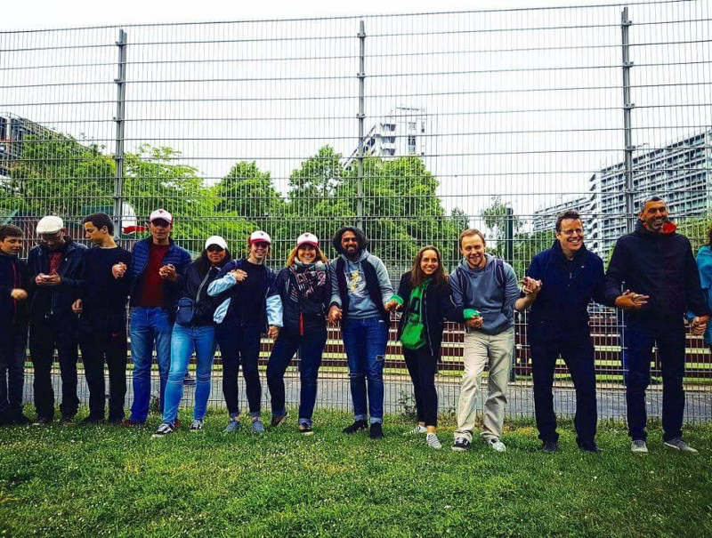
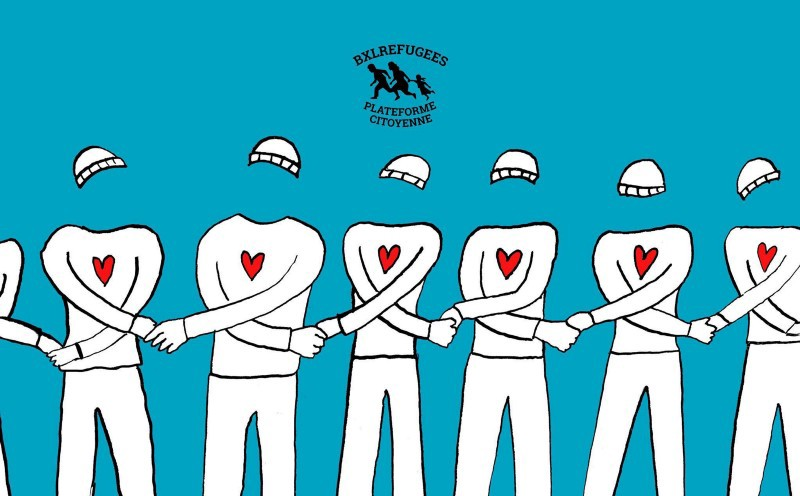
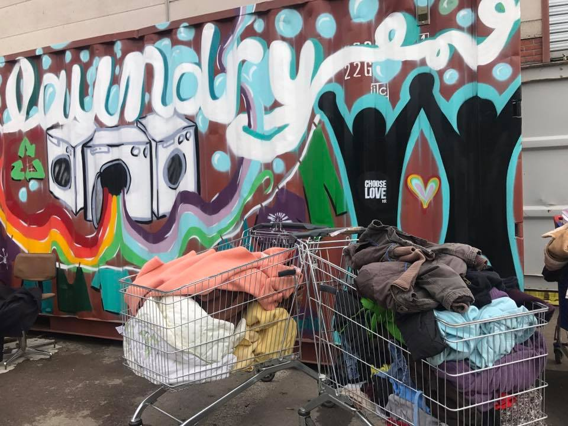

### AYS DAILY DIGEST 13/05/2018: Citizens form human chain in Brussels to protest against immigration policy

_Dismantlements persist in Calais//Solidarity march continues in France//73 people rescued by SOS Méditerannée//Legis presents report on migration at Macedonia’s northern border//_

#### Belgium

In Brussels, around 1,500 people participated in a protest against the Belgian government’s migration policy\. The protest targeted police repression, the lack of structural solution, and the lack of shelter for around 500 people living in the streets of Brussels\. In particular, the protest is meant to prevent police from arresting people—around 70 people near the train station and Parc Maximilien—and from bringing them to detention centres on Monday, according to organizers\.

#### Sea
### 73 people by SOS Méditerannée

SOS Méditerannée says 73 people were rescued by the Aquarius from an overloaded boat on Saturday\. They say that “despite indicating their willingness to continue their search and rescue activity”, authorities ordered the rescue boat to return to Italy without delay to deliver the 73 people who’d been rescued\. The Aquarius team was concerned that there would be further perilous departures from the Libyan coast and say they have the capacity to provide assistance to over 500 survivors on board\. The Libyan coast guard says they intercepted more than 330 people off the coast of Libya\.

Meanwhile, the EU continues to train and equip the Libyan coastguard\. A [report](http://www.eunpack.eu/sites/default/files/publications/2018-01-31%20D6.2%20Working%20paper%20on%20implementation%20of%20EU%20crisis%20response%20in%20Libya.pdf) on the EU crisis response in Libya says that “reports about the alleged misconduct of Libyan coastguard officers have raised doubts about the effectiveness of this strategy”, adding that the Libyan coast guards have been “accused of aggressive and abusive behaviour vis\-a\-vis migrants and international NGOs”: “ _The EU is subcontracting to crooks and thieves_ ”\.
#### Greece
### One boat picked up by the Greek coast guard

The Aegean Boat Report says one boat with 20 people was picked up by the Greek coast guard off the coast of northern Lesvos and were transported to Skala Sikamineas\.
#### Macedonia
### Annual report on “irregular migration” by Legis

The Legis “ [annual report on irregular migration](http://www.legis.mk/news/2568/annual-report-on-irregular-migration) ” on the northern border of Macedonia shows that the highest percentage of the population which the LEGIS teams reached in Lipkovo over the period of May 2017 — April 2018 is from Pakistan, 41% \(385 people\), followed by Afghanistan, 26% \(249 people\), Iran 7% \(66 people\) and Algeria 7% \(61 people\) \. Only 4% \(42 people\) of those encountered in Lipkovo were from Syria\.

The most common human rights violation in the area was illegal push\-backs from Serbia\. The team highlights that currently there is a lack of documentation on illegal push\-backs and other human rights violations towards refugees in the country\. They also found that people are being pushed back all the way to Greece by the local authorities\.
### Bosnia

The situation in Bosnia is not getting any better\. The government does not have any kind of respons to growing number of people who are arriving\. Make shift camps are appearing all over Sarajevo, Bihac and Velika Kladusa area\.

Dylan Longman, a volunteer in Sarajevo, wrote a [post](https://www.facebook.com/dylan.longman/posts/10155214936856249) expressing his concern about the situation\.

“Last night was horrible in the park as we found a single woman and a sick child who had walked 4 days with no sleep was stranded at 11pm at night…we took her immediately to our refugee family house…after this we found two families of 22 people again, with many very young children, worn out and with nothing at 12pm… we took them as well and managed to get basics together for them to sleep\. \. now our house is crammed and can no longer help…\. the police agreed with us that something will happen from wednesday onwards… what we are guessing is an early morning eviction…\.”

One of the residents of the make shift camp in Sarajevo city center, where about 250 people lives, filmed this on a rainy day\.

#### France
### Evictions continue in Calais

_Salam_ says there has not been a single work day in Calais without a dismantlement since April 26\. They add that since May 6 the “security perimeter” during dismantlements is expanding, preventing volunteers from observing whether refugees can at least take some of their possessions with them\.
### Volunteers needed for the Calais Laundry

The Calais Laundry isn’t able to work every day as there are not enough volunteers\. The laundry allows a reduction of waste and is currently the only source of items coming in to the warehouse, according to the Calais Laundry\. You can send them a message with your dates directly through their [Facebook page](https://web.facebook.com/Calais-Laundry-155985555055222/?_rdc=1&_rdr) \.
### Solidarity walk in Marseille

On Saturday, around 180 people walked from Saint\-Antoine to Marseille as part of a march from Ventimiglia to London, in solidarity with refugees, against the “délit de solidarité” and against the closure of the Franco\-Italian and British borders\. In total, as many as 2,000 participated in the solidarity march through Marseille\. On Monday, the march continues: At 9 a\.m\. the walkers will leave Marseille for Martigues\. In the evening, SOS Méditerannée will give a performance, reading a text of testimonies by survivors and sea rescuers\. The final walk will take place on July 8 from Calais to London\.

### New guide for asylum\-seekers published

A new [guide for asylum\-seekers in Paris](https://guideasile.wordpress.com/) has been published in French ,Arabic and English\. Translators are still needed for Pachto, Tigrinya, Somali, Urdu, Amharic, Oromo and Ourdou\.

**We strive to echo correct news from the ground through collaboration and fairness\.**

**Every effort has been made to credit organizations and individuals with regard to the supply of information, video, and photo material \(in cases where the source wanted to be accredited\) \. Please notify us regarding corrections\.**

**If there’s anything you want to share or comment, contact us through Facebook or write to: areyousyrious@gmail\.com**

_Converted [Medium Post](https://medium.com/are-you-syrious/ays-daily-digest-13-05-2018-citizens-form-human-chain-in-brussels-to-protest-against-immigration-53e3e00c8aaf) by [ZMediumToMarkdown](https://github.com/ZhgChgLi/ZMediumToMarkdown)._
