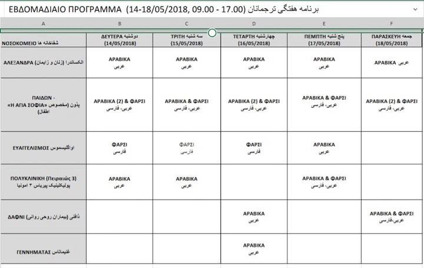

### **AYS DAILY DIGEST 14/05/18: Deaths in the Aegean, the Eastern Mediterranean and Palestine**

_Reports from Syria as more people are displaced//Continued evidence of torture in Libya//Dangerous new Immigration Bill to be voted on in Greek Parliament// New arrivals to Greek islands and Italy//Volunteer calls and needs lists for Greece and France//Reports from the ground in Italy, Bosnia, France, Austria and more…_

People fleeing from war, people fighting for their freedom, people desperate to live, do not deserve to die at the hands of Western ‘Democracies’ or due to EU’s willed blindness of their plight\.

Today 7 people have been [confirmed dead](http://m.ensonhaber.com/canakkalede-kacaklari-tasiyan-tekne-batti-7-olu.html) after a fibre boat, allegedly carrying 20 people sank on the coast of Babakale, Ayvacik county, Turkey at 23\.00\. 13 people where rescued, and 7 dead bodies, including two children,were picked up from the sea after a fisherman spotted the boat and alerted the Turkish Coast guard\.

The boat was heading towards the North of Lesvos\. Search and rescue operations continue as more people could still be in the area\. Vessels and a helicopter from TCG are involved in the search\.

In Northern Cyprus [Local media](https://cyprus-mail.com/2018/05/14/dead-bodies-washed-up-on-north-beach-believed-to-be-drowned-syrian-migrants/) and the [Missing Migrants Project report](https://twitter.com/MissingMigrants/status/996083968326950913) that the bodies of 9 people washed up on the shore on Sunday and Monday\. The death toll is expected to rise further\. This is the second shipwreck recorded this year in the Eastern Mediterranean\. The people who lost their lives are believed to be Syrian, the youngest, only 24 years old\.

■■■■■■■■■■■■■■ 
> **[Missing Migrants Project](https://twitter.com/MissingMigrants) @ Twitter Says:** 

> > According to #MissingMigrants data, May is the deadliest month of the year for migrants worldwide. Yet, most migrant deaths still go unnoticed. Today, we are launching a campaign to raise awareness of how widespread these deaths are. Follow us for daily updates @[UNmigration](https://twitter.com/UNmigration) https://t.co/hKv7UlCTiG 

> **Tweeted at [2018-05-01 08:04:52](https://twitter.com/missingmigrants/status/991226936226729984).** 

■■■■■■■■■■■■■■ 

And in Palestine during protests again the new US Embassy opening in Jerusalem and on the eve of al\-Nakba anniversary, the day on which over 700,000 Palestinians were forced to leave their on homes during the Palestinian war in 1948, 58 people have been c [onfirmed dead](https://twitter.com/MOH_PR/status/996133965802233856) , including at least 5 children under 18, and 2771 have been injured\.

During this time, Israeli authorities have [reportedly](http://www.mezan.org/en/post/22819/With+Thousands+Wounded%2C+Israeli+Authorities+Deny+Entry+of+Palestinian+Medical+Delegation+to+Gaza) prevented a Palestinian medical team from the Ministry of Health \(MoH\) in the West Bank from entering the Gaza Strip\.

■■■■■■■■■■■■■■ 
> **[UN Human Rights](https://twitter.com/UNHumanRights) @ Twitter Says:** 

> > “Shocking killing of dozens, injury of hundreds by Israeli live fire in #Gaza must stop now. The right to life must be respected. Those responsible for outrageous human rights violations must be held to account. The int'l community needs to ensure justice for victims” – #Zeid. https://t.co/hBb7825Sp8 

> **Tweeted at [2018-05-14 15:09:34](https://twitter.com/unhumanrights/status/996044858048557058).** 

■■■■■■■■■■■■■■ 

**Syria**

[MSF report](http://www.msf.org/en/article/syria-newly-displaced-syrians-face-multiple-challenges-idlib-and-northern-hama) that over 60,000 people have recently arrived to Idlib and Northern Hama having been displaced from their homes in other parts of the country\. Many are in need of medical attention and are undernourished\. Local healthcare facilities and MSF are struggling to cope with caring for the new arrivals\.

**Libya**

Reports of torture and detention in Libya continue\.

> After many months in the hands of the smugglers, we were intercepted at sea, sent back to Libya and put in detention again\. After few days, we ended up in the hands of the smugglers again\. Reported by [UNHCR Italia](https://twitter.com/unhcritalia/status/996037776444452866?s=21) \. 

■■■■■■■■■■■■■■ 
> **[Marco Rotunno](https://twitter.com/MarcoRotunno) @ Twitter Says:** 

> > We met an Eritrean refugee today at today’s landing in Augusta. He tried to escape numerous times from the smugglers in the last 1,5 years. The effects are still visible all over his body: burns, scars, electroshocks. And this broken finger. [twitter.com/unhcritalia/st…](https://twitter.com/unhcritalia/status/996071315609092097) 

> **Tweeted at [2018-05-14 17:03:46](https://twitter.com/marcorotunno/status/996073597121724416).** 

■■■■■■■■■■■■■■ 

And yet we see no positive action towards preventing returns to Libya, or active support by authorities for those who have survived\.

**Sea**

[Salvamento Maritimo](https://twitter.com/salvamentogob/status/996036459508445185) rescued 2 boats with 45 people in the Alboran Sea today\.

[Aegean Boat Report](https://www.facebook.com/AegeanBoatReport/posts/345842449272199?hc_location=ufi) states that 2 boats arrived on Lesvos this morning, carrying a total of 109 people\.

> First boat was picked up outside the airport, Lesvos south, 03\.30 by HCG\.
 

> 68 people\.
 

> No breakdown\. 

> Second boat was picked up outside Lepetimnos, Lesvos north, 11\.30 by HCG\.
 

> 41 people\. 
 

> 20 children 
 

> 8 women 
 

> 13 men 

A further two boats arriving in the evening and early morning\.

> One boat landed in Eftalou, Lesvos north, 23\.10\.
 

> 42 people\.
 

> 12 children
 

> 17 women 
 

> 13 men 

> One boat was picked up by HCG outside Varia, Lesvos south, 02\.45\.
 

> 55 people\.
 

> No breakdown so far\. 

For two days the search and rescue vessel Augusta [was no allowed to land](https://twitter.com/danilocampailla/status/995981576214319104?s=21) on Italian shores and was running out of drinkable water by the time they were finally allowed to dock with the 19 people they had rescued\.

**Greece**

**Islands**

The Migration policy Ministry is considering expanding the current centres on the islands in order to house new arrivals, according to [local media](http://www.ekathimerini.com/228595/article/ekathimerini/news/government-considers-boosting-capacity-of-refugee-centers) , which will put additional pressure on structures which are already dysfunctional and dangerous\.

6,632 refugees are believed to have crossed into Greece in April and 16,478 people in the first five months of the year\. 9,375 arrived on the islands and 7,103 from the Evros border in northeastern Greece\.

Request for support from the [Hope Project](https://www.facebook.com/HopeProjectKempsons/?ref=gs&fref=gs&dti=459777764229676&hc_location=group)

_Things are getting desperate now\!_ 
_In the last six days we have had over 600 new arrivals\! \! \! \!_ 
_As we go into the spring the numbers will rise_ 
_WE DESPERATELY NEED YOUR HELP TO CONTINUE\! \! \! \!_

More Doctors needed on Lesvos

■■■■■■■■■■■■■■ 
> **[Derek Gatopoulos](https://twitter.com/dgatopoulos) @ Twitter Says:** 

> > Volunteer doctors at refugee camp on Lesbos can't keep up with demand for children's treatment 

More at [apnews.com/5d166b178bd24a…](https://www.apnews.com/5d166b178bd24a4db90b2ce56195a9e0)
#Greece #Refugees
w/ @[arktouros](https://twitter.com/arktouros) @[PGiannakouris](https://twitter.com/PGiannakouris) https://t.co/smVqpaSWWR 

> **Tweeted at [2018-05-14 20:03:55](https://twitter.com/dgatopoulos/status/996118932619780097).** 

■■■■■■■■■■■■■■ 

**Mainland**

> I have seen many sad places but this is the worst\. 

People on the ground from the Refugee Biryani and Bananas Project [report](https://www.facebook.com/RefugeeBiriyaniAndBananas/posts/1038273086330757?hc_location=ufi) on the deteriorating situation in Northern Greece and ask for support\.

](assets/fc745982529c/1*fogeSNOgMyrxo9LGUbpSnA.jpeg)

[Refugee Biriyani and Bananas](https://www.facebook.com/RefugeeBiriyaniAndBananas/posts/1038273086330757?hc_location=ufi)

> People and Young children from Afrin came to Thessaloniki via land and ended up spending a night sleeping in the park until an UN bus took them to camp\. 

](assets/fc745982529c/1*g1TBL6W2MC1Rq2L3XukyIQ.jpeg)

[Refugee Biriyani and Bananas](https://www.facebook.com/RefugeeBiriyaniAndBananas/posts/1038273086330757?hc_location=ufi)

Dimitrios Vitsas’ Immigration Bill will be voted on tomorrow \(15\.05\.18\), only two days after the decision by the CoE, which annulled the decision to lift the geographical restriction of the refugees on the islands\. The Minister of Immigration Policy D\. Vitsas has tabled a new bill in Parliament entitled “Amending Asylum Procedures and Other Provisions”, trying to bypass the CoE’s decision and speed up the asylum procedure, which could enable the mass deportation of refugees\.

The new law will look at the EU\-Turkey deal and would include changes to asylum policy, such as a person losing their place in the asylum system if they cannot attend their asylum appointment or do not receive the answer on time\. It could also affect people’s ability to apply for a status of vulnerability\.

> In order to continue the implementation of the EU\-Turkey Joint Statement of Heads of State, the Greek Government overlooks the serious issues of legitimacy and violation of human rights recorded in particular in the Isle of Anatolia\. Of the Aegean Sea and emerged from its implementation 

You can read a full statement from Rhodes Solidarity and other groups [here\.](https://www.facebook.com/groups/OasisRhodes/permalink/1906972902927806/)

There will be a demonstration in Athens tomorrow \(15\.05\.18\) at 7pm, Syntagmatos Square, [called by solidarity groups](https://www.facebook.com/events/213828565874784/) of Athens\.

> The struggle for free movement and equal treatment of refugees and immigrants is the only answer\. 

[Local media](http://www.ekathimerini.com/228632/article/ekathimerini/news/greek-court-turns-down-appeal-against-asylum-decision) report that the Athens Administrative Appeals Court has once again decided in favour of a Turkish Serviceman whom the Migration Policy Ministry wish to deport\.

This is the second such decision relating to the eight servicemen that fled Turkey following the failed coup attempt in July 2016 and is continued proof that Turkey is not considered a safe country for those vulnerable to state persecution\.

He will remain in a securely guarded place and is prevented from travelling\.

[Velos Youth](https://www.facebook.com/permalink.php?story_fbid=1862672010697093&id=1705690253061937&hc_location=ufi) need volunteers in Athens\. Please email them at info@velosyouth\.org to express your interest in volunteering\.

CARITAS translation services in Athenian Hospitals \(14–18 May 2018\)

CARITAS Greece

**Italy**

The 4th caravan for the rights of migrants for dignity and justice has ended postitively; from the southern border of the Mediterranean to the interior of fortress Europe at the French border\.

_A Raging River of people who do not surrender…_

](assets/fc745982529c/1*nwmn2A9RPBUfLpDP74rWow.jpeg)

[CarovaneMigranti](https://www.facebook.com/carovanemigranti/posts/1272652179545109?hc_location=ufi)

There is a Campaign to prevent the opening of a new Expulsion Centre in Italy\.

> The Expulsion Centre \(CPR\) is not the solution for migrant people without residence title\. 

Called by:

Campaign [LasciateCIEntrare](https://www.facebook.com/LasciateCIEntrare/) 
[Melting Pot Europa](https://www.facebook.com/meltingpoteuropa/) 
[Centro Sociale Bruno](https://www.facebook.com/centro.bruno/) \(Trento\)

To Join write to sosbozen@gmail\.com

**Bosnia**

Reports from AYS comrades — It is raining heavily outside\. A few hundred people are in the streets with no shelter\. Amongst them there are women and kids\. They are sick and tired\. Many people are outside\.

**It is time to open our homes and our public buildings\!**

**France**

A [new guide](https://guideasile.wordpress.com/) has been published to help people applying for asylum in France\. It is available in French, English and Arabic\.

[Local media report](http://www.leparisien.fr/paris-75/paris-pas-d-evacuation-programmee-au-campement-du-millenaire-14-05-2018-7715664.php) that despite terrible conditions at the Millennium camp in Paris there are no plans to support people to find more suitable accommodation\.

Care4Calais have launched a [n appeal](https://www.facebook.com/care4calais/photos/a.1047087828657507.1073741832.1046117708754519/1919797818053166/?type=3&theater) so that they can continue to support people living on the streets of Calais and Dunkirk\.

Volunteer Call for FAST \(First Aid Response Team\) in Calais\.

> We are looking for:
 

> \* Nurses
 

> \* Paramedics
 

> \* First Aiders: Please be aware that a simple first\-aid course is NOT enough\. We therefore ask experienced first aiders who practice a lot in their home country and in the field\.
 

> \* Doctors \(Please note that due to legislations one is NOT allowed to prescribe\) 

More info and contact details [here](https://www.facebook.com/groups/FASTCalais/permalink/2091823471097492/) \.

**Austria**

**General**

A new online support platform for teachers and educators working in difficult environments has been created by [Team Up 2 Teach](https://sites.google.com/view/team-up-2-teach-refugees/home) , which will enable educators in the field to share lesson/project/activity ideas, inspiration, and provide on\-going peer support\.

**We strive to echo correct news from the ground through collaboration and fairness\.**

**Every effort has been made to credit organizations and individuals with regard to the supply of information, video, and photo material \(in cases where the source wanted to be accredited\) \. Please notify us regarding corrections\.**

**If there’s anything you want to share or comment, contact us through Facebook or write to: areyousyrious@gmail\.com**

_Converted [Medium Post](https://medium.com/are-you-syrious/ays-daily-digest-14-05-18-deaths-in-the-aegean-the-eastern-mediterranean-and-palestine-fc745982529c) by [ZMediumToMarkdown](https://github.com/ZhgChgLi/ZMediumToMarkdown)._
