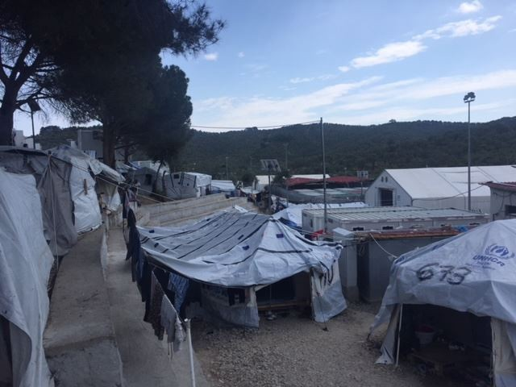
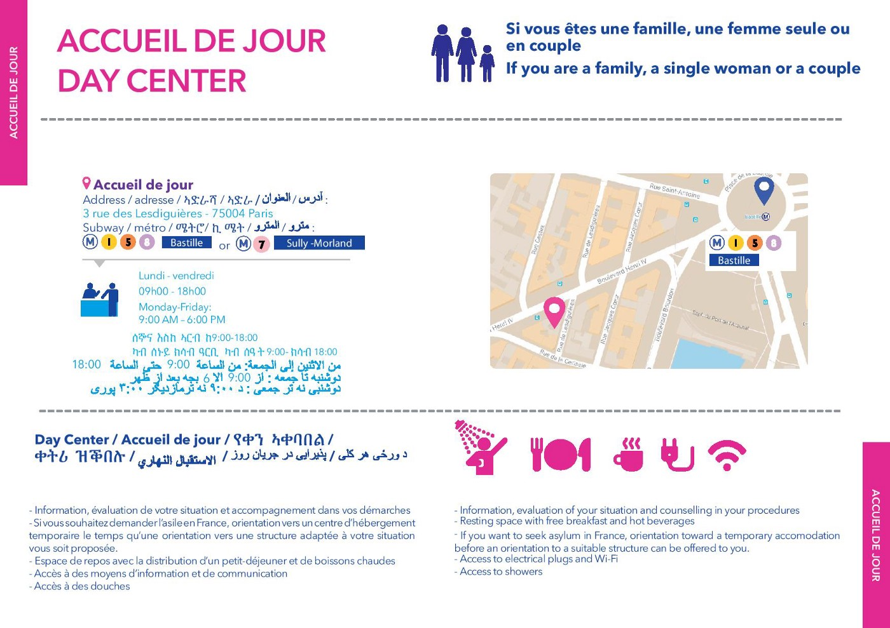
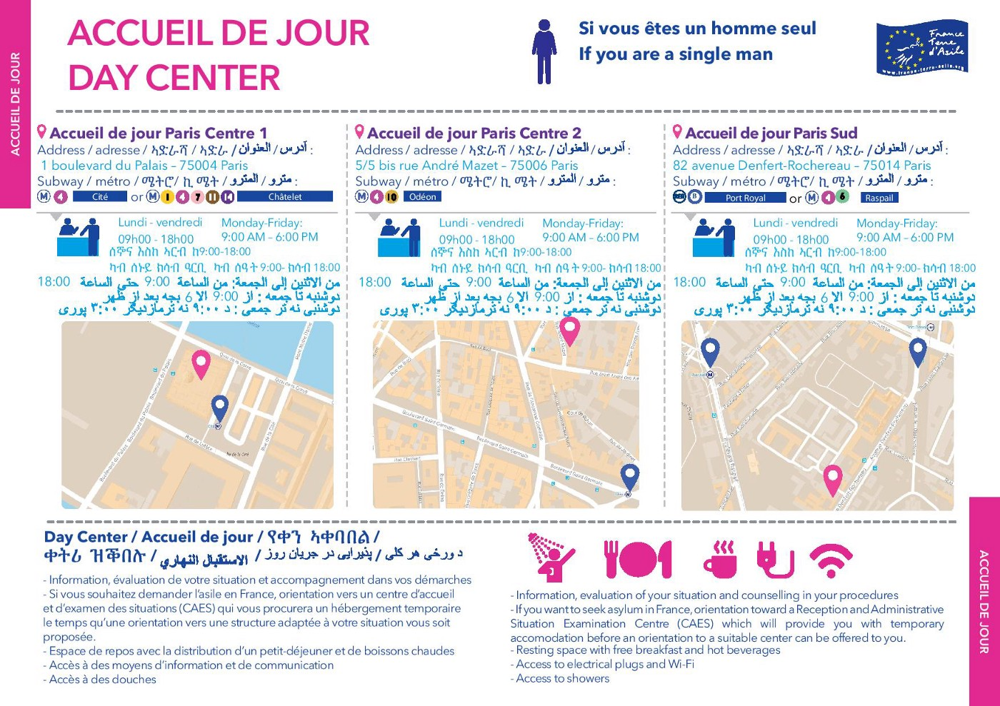

### AYS Daily Digest 15/5/18: Commissioner for Human Rights addresses authorities of Bosnia and Herzegovina
#### Commissioner Mijatović expresses concern over the situation in BiH / Cyprus unfit to accept refugees and welcome asylum seekers / New deaths in the Aegean / Greek forum of refugees: the law ignores the people on the islands / Information for refugees in Paris / Detailed info in 7 languages for asylum process in the UK / Aid and volunteers needed / more news and updates

![“Moria camp which is expanding every day\. Every day more and more people live there\. Every day more and more people are exposed to appalling conditions thanks to the EU and the Greek government\. Every day more and more vulnerable people will have to wait for months to visit the doctor\. Every day the situation is worsening\. Every day it is becoming more difficult to live there\. The already overcrowded facilities will have to face more and more arrivals and those people will be held there for an indefinite period of time\.” — Photo: [Greek Forum of Refugees](https://www.facebook.com/Greekforumofrefugees/)](assets/524789efccc8/1*8napgnONFJmcNR_cvamWZw.jpeg)

“Moria camp which is expanding every day\. Every day more and more people live there\. Every day more and more people are exposed to appalling conditions thanks to the EU and the Greek government\. Every day more and more vulnerable people will have to wait for months to visit the doctor\. Every day the situation is worsening\. Every day it is becoming more difficult to live there\. The already overcrowded facilities will have to face more and more arrivals and those people will be held there for an indefinite period of time\.” — Photo: [Greek Forum of Refugees](https://www.facebook.com/Greekforumofrefugees/)
#### FEATURE

Following the numerous reports on the worrying situation for migrants and refugees in Bosnia and Herzegovina, the [Commissioner for Human Rights](https://www.coe.int/en/web/commissioner/the-commissioner) Dunja Mijatović has addressed a letter to the responsible ministries, stating her concerns, understanding of the context of her home country’s own capacities, but nevertheless, requesting information and decisions to be taken and implemented regarding the matter\.

> In a letter addressed to the Ministers for Human Rights and Refugees and for Security of Bosnia and Herzegovina published today, Commissioner Mijatović urges the authorities to spare no efforts in order to improve their handling of migrants’ arrivals\. 

> Concerned by the lack of a systematic response to the situation of refugees and migrants who sleep rough on the streets and in the parks with irregular access to food and health assistance, the Commissioner urges the authorities to provide adequate accommodation by using all available refugee reception centres and to make sure that all asylum\-seekers and migrants receive adequate food, healthcare and administrative assistance\. 

> Furthermore, Commissioner recognizes that the situation with migration might presents social and economic challenges for Bosnia and Herzegovina but at the same she underscores the country’s obligation to ensure assistance and access to fair and effective asylum procedures and a need to address it in a human rights compliant way\. 

> The Commissioner requests information on the safeguards that the authorities intend to put in place in this regard\. 

[Read the Commissioner’s letter addressed to the authorities of Bosnia and Herzegovina](http://rm.coe.int/commdh-2018-12-letter-to-the-authorities-regarding-the-migration-situa/1680870e4d)
#### CYPRUS
### Growing destitution for people in Cyprus

Situation in Cyprus is far from being fit to accept and welcome people in search for international protection in the country\. 
With the Kofinou Centre presently hosting only 265 persons and another 130 unaccompanied asylum\-seeking children housed at the four special shelters in Nicosia, Larnaca and Limassol, the vast majority of asylum\-seekers therefore live outside collective centres and they no longer accept single male asylum seekers\. The Cypriot UNHCR and national civil society organisations have published a [Joint Statement on the growing problem of homelessness among asylum\-seekers in Cyprus](http://www.unhcr.org.cy/el/nea/article/82840797351ec5d6b8d7e56bf57dd4ab/joint-statement-on-the-growing-problem-of-homelessness-among-asylum-seek.html) , reporting a number of problems and stating:

> We are gravely concerned by the precarious living conditions of asylum\-seekers, which is essentially the result of the very restrictive employment policy preventing asylum\-seekers from becoming self\-reliant, and remains unchanged despite the longer waiting period for receiving an asylum decision\. Moreover, the material reception conditions are not adequate to ensure a dignified standard of living to protect their physical and mental health, especially given the increasing rent prices\. This also affects transition to the community from both the Kofinou Reception Centre and the children’s shelters\. 

Asylum\-seekers are excluded from the national Guaranteed Minimum Income scheme and are instead provided with a special ‘material reception assistance’, that is below the national risk\-of\-poverty threshold and does not meet the minimum standards of the EU Reception Conditions Directive\.

They ask from the Cypriot government:
1. To increase the level of subsistence assistance for asylum\-seekers — providing cash instead of vouchers — and to remove the cap on the assistance provided to families to ensure a dignified standard of living in accordance with Cyprus’ international and EU legal obligations;
2. To process applications for social assistance swiftly in order to prevent instances of destitution and homelessness;
3. To reduce the period of prohibition of access to the labour market and expand the economic sectors where asylum\-seekers are permitted to work so that they become self\-sufficient and further contribute to the society and the economy; it is further recommended to subsidize the income of employed asylum\-seekers on low wages in order to encourage access to the labour market;
4. To put in place appropriate structures and procedures for the early and systematic identification of asylum\-seekers with specific needs and to grant them access to tailored assistance, including special reception conditions and disability allowances;
5. To institute transitional measures to assist unaccompanied children with independent living once they attain the age of majority\.

Find the AIDA 2017 country report for Cyprus [**here**](http://www.asylumineurope.org/sites/default/files/report-download/aida_cy_2017update.pdf) \.
#### GREECE
### 7 deaths after another sunken boat in the Aegean

A boat carrying 20 people sank on the cost of Babakale, Ayvacik county around 23h on Monday\. 
According to the available information, 13 people where rescued, and 7 were deceased, two of whom children\. The Turkish Cost Guard said among the rescued people, they established that 12 were Afghans and one was alleged Iranian smuggler\.

■■■■■■■■■■■■■■ 
> **[Missing Migrants Project](https://twitter.com/MissingMigrants) @ Twitter Says:** 

> > Last night, 7 Afghan migrants, including 3 children, lost their lives when they drowned off the coast of Babakale, Çanakkale Province, Turkey. Now 16 lives have been lost in the Eastern #Mediterranean in the past 2 days. @IOMturkey #MissingMigrants [sahilguvenlik.gov.tr/haberdetay/201…](http://www.sahilguvenlik.gov.tr/haberdetay/2018/05Mayis/14_MAYIS_2018_BABAKALE.pdf) 

> **Tweeted at [2018-05-15 14:24:13](https://twitter.com/missingmigrants/status/996395833447866373).** 

■■■■■■■■■■■■■■ 

### Lesvos needs help

> The refugee CRISIS is not over \!
 

> For us we are in year four and we feel more alone than ever\!
 

> Daily arrivals are an average of 100
 

> Refugee population well over 9000 now\! \! \!
 

> Our warehouse is empty\! \!
 

> If we do not receive more help we will not be able to continue to supply 30 families a day with essential supplies, like diapers, feminine hygiene pads/towels, shampoo and soap\. clothes for the family, towels
 

> WE CAN NOT DO THIS ALONE\! \! 

> Please remember that even a small amount of help will make a difference
 

> If you feel you can help the refugees here in anyway please feel free to message us, or use the information below\. Remember please we can not accept parcels from outside the EU 

Support the Hope Project [https://mydonate\.bt\.com/fundraisers/thehopeproject](https://mydonate.bt.com/fundraisers/thehopeproject) or bring aid if you can\. 
The current needs are:

Hygiene,soap, shampoo,cream, toothbrush, toothpaste
Towels
Socks, 
underwear \(only new please\)
shoes & flipflops,
T\-shirts \(especially small mens\)
Trousers/shorts \(especially small mens\)
Diapers
Baby wipes
Female hygiene towels \(no tampons\)
Strollers
Baby beds/baby box’s/bassinets
Blankets
Children’s toys
Sun block
sun hats
Tents
Mosquito repellent and nets for babies
### Patras

“600 or so migrants who boarded buses and were transferred to state\-run facilities where officials were to check their documents”, the Greek media [reported](http://www.ekathimerini.com/228655/article/ekathimerini/news/police-relocate-600-migrants-from-disused-factories-in-patra-to-state-facilities) \. They were reportedly taken to Korinthos detention centre, where their status would be processed\. Among the people affected were 90 unaccompanied minors\.
Four unaccompanied minors who had been at the camps were to be sent to special hostels\.

■■■■■■■■■■■■■■ 
> **[City Plaza Squat](https://twitter.com/sol2refugees) @ Twitter Says:** 

> > Large police operation to evacuate Patras informal refugee camps taking place since early this morning
#refugeesgr 

[efsyn.gr/arthro/patra-e…](http://www.efsyn.gr/arthro/patra-epiheirisi-apomakrynsis-metanaston-apo-ergostasia) 

> **Tweeted at [2018-05-15 07:45:35](https://twitter.com/sol2refugees/status/996295512813920256).** 

■■■■■■■■■■■■■■ 

### Greek government overlooks the serious issues of legality and human rights violation

Greek forum of refugees calls on the government to not further speed up the asylum procedure, [saying](https://refugees.gr/el/%CF%8C%CF%87%CE%B9-%CE%AC%CE%BB%CE%BB%CE%B5%CF%82-%CF%80%CE%B1%CF%81%CE%B1%CE%B2%CE%B9%CE%AC%CF%83%CE%B5%CE%B9%CF%82-%CF%84%CF%89%CE%BD-%CE%B4%CE%B9%CE%BA%CE%B1%CE%B9%CF%89%CE%BC%CE%AC%CF%84%CF%89/) that the “Greek government, in order to continue the implementation of the EU\-Turkey Joint Statement of Heads of State, overlooks the serious issues of legality and human rights violation recorded especially in the islands of Anatolia”:

> Do not proceed to further acceleration of the asylum procedure\.
 

> To ensure access, residence and protection of asylum seekers in Greek territory until a fair examination of their requests and their right to effective action are completed, with the explicit provision of an automatic suspensive effect of the relevant remedies\.
 

> Direct ratification of the 4th additional protocol to the European convention on human rights, which prohibits group expulsions and provides for the freedom of movement of all those legally resident in the country, including asylum seekers\. 

“Today the new migration law is being voted in the Greek Parliament, one which will increase the restrictions and difficulties of the asylum procedure\. This law will maintain the geographical restriction on the islands, violating the right of freedom of movement for asylum seekers and disregarding the CoE’s annulment\. 
This unlawful law does not take into consideration people’s lives\. 
This unlawful law ignores the situation on the islands\.

Last week we went to Lesvos\. We visited the Moria camp which is expanding every day\. Every day more and more people live there\. Every day more and more people are exposed to appalling conditions thanks to the EU and the Greek government\. Every day more and more vulnerable people will have to wait for months to visit the doctor\. Every day the situation is worsening\. Every day it is becoming more difficult to live there\. The already overcrowded facilities will have to face more and more arrivals and those people will be held there for an indefinite period of time\. We spoke with people who have been living there for two years now\. This cannot be\. People cannot live in these conditions\. This law is not a solution\.

For this, today at 6:30 we will participate at the demonstration in Syntagma\. Join us to make them understand that we are talking about people’s lives, not just numbers\. No one should receive this degrading treatment\.”

](assets/524789efccc8/1*CgjnEF7Mw77e8soUrId_fA.jpeg)

Photos: [Greek Forum of Refugees](https://www.facebook.com/Greekforumofrefugees/)
### Volunteering

Skaramagas is one of the largest camps in Greece and in the past few weeks we have received several hundred new residents who have been transferred here from the Greek islands\.

> A Drop in the Ocean runs a variety of projects in the camp \(including clothing distribution, sewing room, kids’ activities, women&baby space, library, English lessons for adults, etc\. \) and we need volunteers to keep these much appreciated activities going\. The new arrivals to the camp mean that our services are in more demand than ever, so please consider coming to join us as a volunteer\. 

Register on our website [www\.drapenihavet\.no](http://www.drapenihavet.no/) or email us frivillig@drapenihavet\.no

[Mobile Info Team](https://www.facebook.com/mobileinfoteam/?hc_ref=ARRwXX_dzjrfKQKQFWj0Y0VVdoBKIpOqf23kZo4UINB_GCXZqCXtD68gJFdONBqaxlo&fref=nf) warns about recent fraud attempts: “keep in mind that all services that are offered by NGOs and community or social centers are for free\. That includes for example distribution of food or blankets, language classes, legal services or medical assistance\. Lately there some incidents where people were trying to sell access to services from NGOs to refugees\. This is illegal\! If you experience something like that, inform the concerned NGO or the police”\.
### Ahead of the EU\-Western Balkans Summit

This Thursday the EU Heads of State are meeting their counterparts from the Western Balkans \(Albania, Bosnia and Herzegovina, Serbia, Montenegro, the former Yugoslav Republic of Macedonia and Kosovo\) to discuss cooperation in several areas, including migration and security\. Following increased arrivals of refugees and migrants to both the Western Balkans and the EU, the issue of border control has gained prominence, resulting in more investments and cooperation agreements between the EU and Western Balkan countries\. At the same time refugees and migrants, including children and other vulnerable groups, are facing serious risks in the Western Balkans and in the EU including violence, [repeated pushbacks and collective expulsions](ays-daily-digest-13-3-18-croatia-continues-with-push-backs-of-children-while-tacitly-accepting-5937bf8b26f9) \. In November 2017 a [6\-year old girl lost her life after being pushed back from Croatia into Serbia](ays-daily-digest-17-4-18-going-public-about-the-croatian-police-pressure-and-false-charges-against-b4ac9af94009) \. The EU’s Fundamental Rights Agency mentioned access to the territory as a persistent challenge in its [February report](http://fra.europa.eu/en/publication/2018/migration-overviews-february-2018) on migration, reporting ill treatment by border officials, including physical violence in Bulgaria, Croatia and Hungary\. Repeated pushbacks were also reported at the Hungarian border\. Protecting borders should not come at the expense of protecting people\.

Ahead of the Western Balkan Summit ECRE published a joint [NGO statement](https://www.ecre.org/wp-content/uploads/2018/05/Protecting-people-across-borders-NGO-joint-statement.pdf) and a call on Heads of States in the EU and in the Western Balkans to address the following concerns and recommendations:
**\- Respect for the right to claim asylum** 
**\- Humane border management and support for victims of trafficking** 
**\- Safe and regular pathways** 
**\- Funding for humane and fair asylum systems and integration** 
**\- Protect civil society organisations working with refugees and migrants\.**
#### BOSNIA AND HERZEGOVINA

A local group of volunteers who has been active for a long time in their own context and needs of the post\-war BiH are today the backbone to many volunteer activities revolving around the refugee route in their country\. We encourage everyone to first contact the local organizations and people on the field in Bosnia and Herzegovina, rather than creating own interpretation on how things work and arriving with teams who perhaps have experience in volunteer work elsewhere but are not well informed about the particular context there\.
Here is what the volunteers on the field in Bosnia and Herzegovina lack \(everything\! \), so please see if you can help in any way, contact them ahead of coming and/or donate:

Funding for food, toilets, showers, clothes and blanket washing facilities which will all need to be built\.
Portaloos can be rented
Doctors and nurses\.
People who can work with mental health problems,
Experienced volunteers with knowledge and understanding of the Balkans and the problems facing Bosnia Herzegovina\.

Specific items of need:

These items are needed immediately and can be bought locally\. An advantage to buying locally is it supports the local economy and through doing so helps to build support for the refugees\.

Tents,
Sleeping Bags,
Blankets,
Medicine,
Sanitary products, especially for women,
Shoes and trainers, especially for babies and young children,

> Then we need plastic plates, spoons, bags for food distribution\. Presently plates and spoons are washed and re\-used but as numbers increase this will not become sustainable\. 

> In short we need everything\. Please help\. 

Read their newest update [**here**](https://bridgesacrossborders.net/blog/) \.
#### SEA

■■■■■■■■■■■■■■ 
> **[Missing Migrants Project](https://twitter.com/MissingMigrants) @ Twitter Says:** 

> > In the Central #Med the estimated rate of death between Jan-April 2017 was 2,44% (1 in 40 migrants who attempted the crossing died), while in the first 4 months of 2018, it has increased to 3,08% (1 in 32). These data include both arrivals to Italy &amp; migrants returned to Libya. https://t.co/Yg0hvPgrc6 

> **Tweeted at [2018-05-15 13:26:02](https://twitter.com/missingmigrants/status/996381191644286977).** 

■■■■■■■■■■■■■■ 

While the EU is systematically closing all the possible legal ways for people to flee misery and join their families in Europe or find their own safety and life in the old continent, together with Frontex and similar services, they have lately started making lives and professional activities \(duties\) of SAR teams across the Mediterranean even more difficult and complicated\. For a long time, the suffering and disaster of the Mediterranean crossings was a silent one, but now — especially after winning cases against the official accusations — the witnesses to what is happening and heroes in those situations where lives are saved need others to watch over what is being done to them\.

Starting with 13% of all sea rescues that the volunteer and SAR NGOs have done in the 2015, [it is estimated](https://elpais.com/internacional/2018/05/13/actualidad/1526242362_443394.html?platform=hootsuite) that they completed more than 40% of all sea rescues in 2017\. As much as the NGOs are in need — and asking for — a clear MO on how to approach rescues in the sea \(as it turned out, several were detained after following the maritime law to the letter\), the officials remain focused on their collaboration with Libya, shifting always more responsibility towards their end with the hope they would take over the major part of the operations in the Mediterranean\. Unfortunately, that shows the obvious preoccupation and priority \(just like the Triton, Sophia and Themis have\), which is to be vigilant over borders and movement, not to do everything in order to save lives\.

](assets/524789efccc8/1*tTmNmuspIWRY2iJLPz2GZA.jpeg)

Photo: [Sea\-Watch](https://www.facebook.com/seawatchprojekt/)

The **[Sea\-Watch](https://www.facebook.com/seawatchprojekt/)** crew is outraged by the fact that the Italian authorities continue to direct them to hand over refugees’ lives to the criminal Libyan Coast Guard, even when there are no LCG vessels on the scene:

> We’re outraged about MRCC Rome and others officially designating the so\-called Libyan Coast Guard a „SAR competent authority“\. Their competence is not Search and Rescue but pushback by proxy\. 
 

> Every rescue has to end in a safe place\. Stand with us for [\#right2rescue](https://www.facebook.com/hashtag/right2rescue?source=feed_text) \! 

■■■■■■■■■■■■■■ 
> **[SALVAMENTO MARÍTIMO](https://twitter.com/salvamentogob) @ Twitter Says:** 

> > Avión Sasemar 102 localiza y Guardamar Polimnia rescata a 91 personas (9 mujeres y un niño) de 2 pateras (36+55) al SW de la isla de Alborán. La segunda patera estaba en mal estado, a punto de hundirse. Llegan a Motril a las 16:20h https://t.co/ThUQjYZXdM 

> **Tweeted at [2018-05-15 11:18:57](https://twitter.com/salvamentogob/status/996349210692857857).** 

■■■■■■■■■■■■■■ 

[**LIFELINE**](https://www.facebook.com/seenotrettung/?hc_ref=ARTFDM9PGiqJcuqfHLVrJEV7YBYHomDB7wBwFL7nqUS5kG9zw3iiGmskex7-HHIIY5k&fref=nf) is looking for the following things:
- Ups Batteries
- Antirutschmatten
- Cartridges For Laserjet per MFP M125nw
- Reflector Foils
- Android phone or tablet with large display

> If you can contribute something, send us a message\!
 

> For the maintenance of our rafts we are still looking for donors\. We have two islands that need to be overhauled\. 

#### ITALY
### Cassibile \(Siracusa, Sicily\)

At least 79 people living in more than 50 shacks on a private land in the area close to Cassibile\. Living in a favela\-like surrounding with no water, no electricity and in horrible hygienic\-sanitary conditions, these people are mostly employed in surrounding fields as physical workers and have official permission to live in Italy, some have their asylum status, but nobody is illegal, yet — they are all nomads\. It is difficult for them to find another housing solution, even though local authorities guarantees they’re supported and that they would find a permanent solution, but for the time being, these Sudanese men are allowed to stay in other people’s properties and work without \(obviously\) having basic working rights respected, and it will continue to be so for the forseable future, as it [reads](https://www.borderlinesicilia.org/la-baraccopoli-di-cassibile-puntuale-emergenza-i-datori-di-lavoro-dovrebbero-garantire-alloggio/) out\.
### Messina

The city of Messina has opened [3 new reception facilities](https://www.borderlinesicilia.org/migranti-a-messina-tre-nuove-strutture-per-laccoglienza-dei-migranti/) , where 47 different professionals are engaged to help the newly welcomed people in the integration\. They are situated in 3 different parts of the city \(north, centre and south\),thus continuing their practice of disperse welcome centres in the town\. They are operated by Medihospes and OXFAM\-Utopia and accommodate unaccompanied minors\.
#### AUSTRIA
### New expulsions

Next charter from Austria will leave on May 29th 2018 with the Travel Service airlines from the Czech Republic and the Austrian activists invite everyone to warn their friends who might be affected by this\.
### Charges over hate speech and criminal activities

17individuals are facing criminal charges after the raids last month at the houses of several members of the extremist group in Graz, including one of its leaders\. Among them are 10 prominent members of the group and seven other “active sympathisers”\. They are, [reportedly](https://www.thelocal.at/20180514/austria-charges-17) , charged with various counts of hate speech, criminal association, damage to property and coercion\.
#### FRANCE
### Paris

Volunteers are sharing news from OFII that should help with arranging a meeting at the PADA\. 
It is necessary to have a telephone, preferably of a local network\.

For those who do not have a telephone themselves, it is difficult to arrange everything, since a telephone number as a contact is needed, so if nobody can provide them with a mobile phone, they should be directed straight to the host centres \(see the info leaflet below\) \. There are 3 for men and 1 for women and families\. There the people can try to get themselves sent to CAEs, followed by going to prefecture to start their asylum process\. The reception centres are quite full as it is and people are usually sleeping outside the centres as well\.

Find a link to the leaflet that can be printed and distributed: [**HERE** \.](https://www.lacimade.org/wp-content/uploads/2018/04/Fiche-maraude-migrants-75-accueils-de-jour.pdf)
#### Clothes donations needed

‘Le Vestiaire’ in Paris needs **donations** :
- trousers size 38 to 46, socks size 40 to 45, socks, boxer shorts, t\-shirts and shirts size S, season jackets, belts, caps, joggings, shorts, backpacks, sleeping bags\.
- diapers and milk for children
- HYGIENE PRODUCTS: shampoo, shower gel, toothpaste, toothbrushes, razors, shaving cream, body cream, deodorant, soaps, nail clippers, Dexeryl cream\.
- notebooks, pens/pencils

Bring the items to:

Solidarités St\. Bernard de la Chapelle\.
12, rue st\. Bruno 75018 Paris / angle rue St\. Luc;

on **Wednesdays from 15h to18h;** 
**Saturdays and Sundays from 9h to 14h\.** 
**Contact the group prior to arrival on: 0603028372** \.

They also need **volunteers** , forming teams on weekly basis\. Those interested can inscribe in the lists or by SMS on the contact number: 06 03 02 83 72 \.
#### UK
### Detailed information source for asylum process

[Refugee Info Bus](https://www.facebook.com/RefugeeInfoBus/?hc_ref=ARTIONK702uDqt_cPstfBAULyzyHKFVeEvjNU9k5SmjlQEOajIXFRqFNTOKLZPgeDFc&fref=nf&hc_location=group) team have paired up with the Right To Remain team to get essential parts of their extensively researched toolkit, on claiming asylum in the UK, [translated into 6 languages](https://www.refugeeinfobus.com/uk-asylum-information) \. Please, share this with your friends who need concrete information regarding their situation in the asylum process\.

[An introduction to claiming asylum — asking to be recognised as a refugee](https://docs.wixstatic.com/ugd/5eb73a_39956d17ac3e4a11b3f466f4c5bb3f52.pdf) 
Text in: [Arabic](https://docs.wixstatic.com/ugd/5eb73a_e696de370e444f3ab4c4a5cdaea627b0.pdf) [Farsi](https://docs.wixstatic.com/ugd/5eb73a_725bdd142f954cc3b76e8152fec099d2.pdf) [Pashto](https://docs.wixstatic.com/ugd/5eb73a_4aad8ae4090e4a56bbb06e4b38b4ddb8.pdf) [Tigrenya](https://docs.wixstatic.com/ugd/5eb73a_a4a16c12c2044573a853843bfff75447.pdf) [Amharic](https://docs.wixstatic.com/ugd/5eb73a_0b7035b718d9483e9eccd5b24faa95b1.pdf) [French](https://docs.wixstatic.com/ugd/5eb73a_73296d5db24f4d29b94050912a2f543b.pdf)

[Claiming asylum in the UK: the screening interview](https://docs.wixstatic.com/ugd/5eb73a_39956d17ac3e4a11b3f466f4c5bb3f52.pdf) 
Text in: [Arabic](https://docs.wixstatic.com/ugd/5eb73a_82650c221b904c33a8fe610d8f42428b.pdf) [Farsi](https://docs.wixstatic.com/ugd/5eb73a_3a657be411cc488a8cbd98cd1cf66135.pdf) Pashto Tigrenya [Amharic](https://docs.wixstatic.com/ugd/5eb73a_8d6428305f234122bdcb5832a1dc1fee.pdf) [French](https://docs.wixstatic.com/ugd/5eb73a_c4be732bde014d8f9644e12536fb2ee4.pdf)

[Claiming asylum in the UK: the asylum substantive interview](https://docs.wixstatic.com/ugd/5eb73a_ecea58abed92457f884e5cf266cb0c75.pdf) 
Text in: [Arabic](https://docs.wixstatic.com/ugd/5eb73a_9a53bd5670a146da9b2c6a46679691e4.pdf) [Farsi](https://docs.wixstatic.com/ugd/5eb73a_59d9de156d294d66be33ab9bfbbc38ac.pdf) [Pashto](https://docs.wixstatic.com/ugd/5eb73a_ff9049ac8217482fb4029e4a4b8edf8d.pdf) [French](https://docs.wixstatic.com/ugd/5eb73a_c0bdd64bd5af40759612f2297aa4254e.pdf) [Tigrenya](https://docs.wixstatic.com/ugd/5eb73a_98aa6992fb474f55a5ba860fb95dcd2c.pdf) [Amharic](https://docs.wixstatic.com/ugd/5eb73a_8519b1413e484146ae6d4f1b7c87632a.pdf)

[After a refusal of an asylum claim](https://www.refugeeinfobus.com/uk-asylum-information) 
Text in: [French](https://docs.wixstatic.com/ugd/5eb73a_2b89fe933fac4a43b3db063047b8ca26.pdf) [Arabic](https://docs.wixstatic.com/ugd/5eb73a_bd5bd439fa594115b4b8c58f7c5b3e18.pdf) [Farsi](https://docs.wixstatic.com/ugd/5eb73a_fe9747438e214313b946c5bf2985cca7.pdf) [Pashto](https://docs.wixstatic.com/ugd/5eb73a_f9260197bfb84ca0a94f1e09d0279e32.pdf) [Tigrenya](https://docs.wixstatic.com/ugd/5eb73a_fcc0350a50d245838e46a0301aca0e13.pdf) [Amharic](https://docs.wixstatic.com/ugd/5eb73a_c3bc3e996f3f40cbb71e0fbc2d9788d3.pdf)

**We strive to echo correct news from the ground through collaboration and fairness\.**

**Every effort has been made to credit organizations and individuals with regard to the supply of information, video, and photo material \(in cases where the source wanted to be accredited\) \. Please notify us regarding corrections\.**

**If there’s anything you want to share or comment, contact us through Facebook or write to: areyousyrious@gmail\.com**

_Converted [Medium Post](https://medium.com/are-you-syrious/ays-daily-digest-15-5-18-commissioner-for-human-rights-addresses-authorities-of-bosnia-and-524789efccc8) by [ZMediumToMarkdown](https://github.com/ZhgChgLi/ZMediumToMarkdown)._
