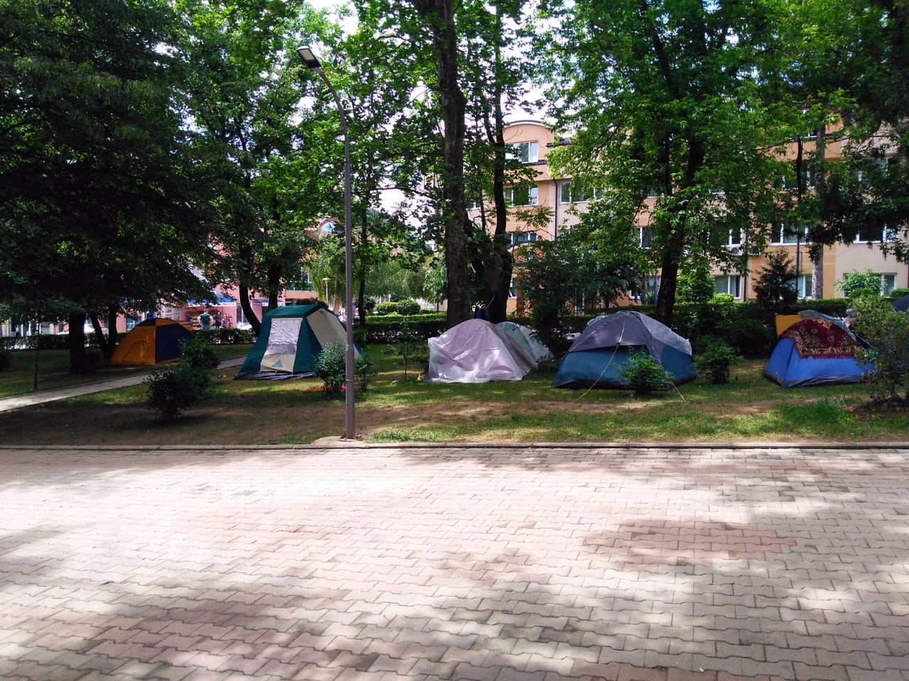
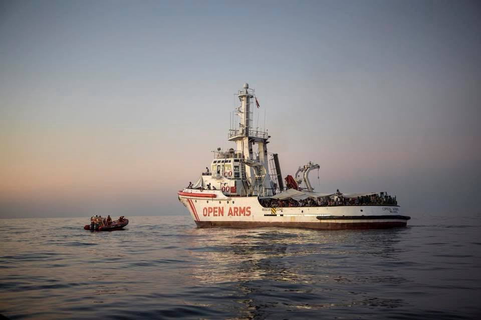
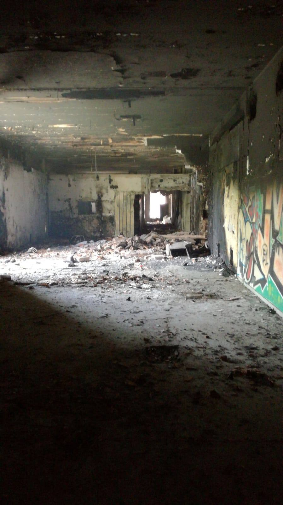
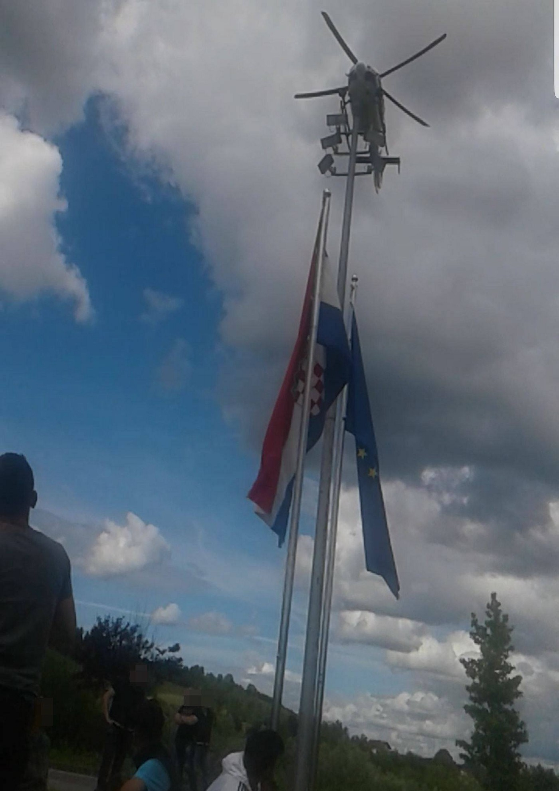
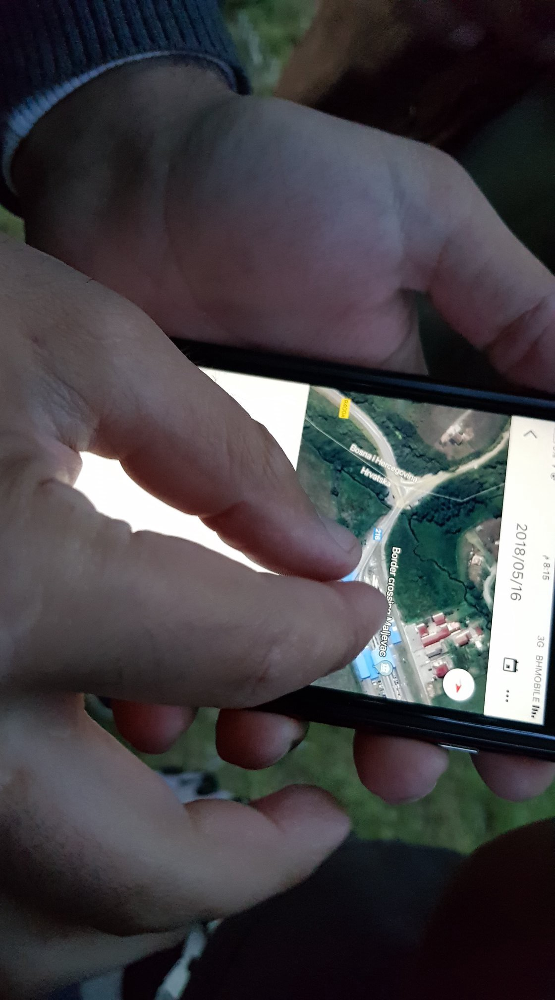

### AYS Daily Digest 16/05/2018: Mental health crisis in Moria

_About 14,200 refugees and migrants reside on the islands / Charges against the captain of Proactiva Open Arms dropped / Between 50 and 100 people pushed back from Croatia to Bosnia / Authorities set to open first camps in Bosnia / And more news…_

One of the make shift camps in Bosnia and Herzegovina\. Soon, the first camps should be open after more then 4,000 people came to the country in a five months period\. \(Photo taken in Velika Kladusa by Adis Imamović Piksi\)
### SEA

A total of **222 people were [rescued](https://www.facebook.com/smhumanitario/posts/1706711936087316) on Wednesday in the Alborán Strait between Spain and North Africa** \. Some of the boats were in serious danger of sinking\.

](assets/14dd886612a5/1*Oxc_feHBjpiBMUadkTMPnQ.jpeg)

Photo by [Salvamento Marítimo](https://www.facebook.com/salvamentomaritimo.es/)
### GREECE

Since the beginning of this year, **9,349 people came to Greece via the land border** , which is nine times more than during the same period in 2017\.

Today, [Aegean Boat Report](https://www.facebook.com/AegeanBoatReport/posts/346627949193649) records two boat pick ups outside Farmakonisi, with approximately 104 people\. All the people were transferred to Leros\.

On Wednesday morning, one boat landed on a cliff outside the port on Oinousses with 48 people\.

Only **this week, 415 people arrived on the Aegean islands** \. At the moment, some **14,200 refugees and migrants reside on the islands** , most of them from Syria \(32%\), Iraq \(27%\), and Afghanistan \(16%\) \.

They live in overcrowded camps, compared by different human rights activists to concentration camps\. Proof of the horrible living conditions is reflected in the research done by [Together for Better Days](https://www.facebook.com/betterdays.ngo/posts/1892674584130604) with a warning about the mental health crisis in Moria, Lesvos\.

“The mental health difficulties that affect them arise from war trauma, loss, isolation, violence, difficult asylum processes, poor living conditions, and general feelings of powerlessness, anxiety, and despair\. Currently Moria Camp is holding more than 7,000 displaced persons, while the capacity of the camp is approximately 1,800 people\. There is a staggering shortage of medical and psychological services available in the camp\.”

Living conditions are not much better on the mainland\. Residents of the camp Katsikas have been [protesting](https://www.facebook.com/RefugeeSupportEurope/posts/2012629125723222) for the last two days due to the conditions they are forced to live in\. They say that with 450 people in the camp, the need for a medical team is urgent and that over 200 children need some form of education\.

](assets/14dd886612a5/1*U9G1hS2te8JMI1zQ1SF-QA.jpeg)

Photo by [Refugee Support Europe](https://www.facebook.com/RefugeeSupportEurope/)

Meanwhile, Greek Parliament approved a bill that was supposed to simplify and accelerate asylum procedures and ease overcrowding in refugee camps on the islands\. It has been criticized by human rights groups who are claiming that it will endanger the rights of refugees as it will increase the number of rejected asylum\-seekers sent back to Turkey\.

The bill also supports a ban on asylum\-seekers travelling beyond the islands until their claims are processed — a ban which had last month been lifted by Greece’s top administrative court\.
#### Child refugees in Greece and the EU

According to official figures, **some 2,500 unaccompanied minors applied for asylum in Greece in 2017** , which is around 8 percent of the total **31,400 child refugees who sought asylum in EU** \. The biggest number is in Italy — more than 10,000, followed by Germany, with 9,100 applications\. The United Kingdom received 2,200 applications \(7 percent\), while Austria received 1,400 \(4 percent\), Sweden 1,300, and the Netherlands 1,200\.
#### Prosecutor recommends “not guilty” verdict in \#Moria10 trial

There is good news in Chios today from the trial of the **\#Moria10** who faced charges for riots and fires in Moria camp on 10 July 2017\. After hearing the witnesses and assessing the video evidence, the Public Prosecutor concluded that there was no evidence for the defendant’s involvement in the riot and recommended: **“not guilty”\.**

The \#Moria10 follows the well\-known \#Moria35 case and is part of a very worrying ongoing trend of arbitrarily arresting and charging asylum\-seekers without evidence\.
#### Brutal attack in Athens

Security cameras [captured a brutal attack](http://www.keeptalkinggreece.com/2018/05/16/racist-attack-pakistani-peristeri/) against one person from Pakistan in Athens\. He was attacked by a group of young people in the Peristeri suburb on Sunday night\.

The victim said the attackers, some 10 people, approached him and started to beat him for no reason\.
#### Help needed\!

EDUCATION FACILITATOR NEEDED for Lifting Hands International\. This person will lead their language programmes for Yazidi refugees in Serres\.

Minimum time commitment of 90 days\. Free housing available\. Please email [greecevolunteer@liftinghandsinternational\.org](mailto:greecevolunteer@liftinghandsinternational.org)

The same group is looking for volunteers to help with their psychosocial programmes\.
#### Donations needed\!

Khora Community Center in Athens have begun their Ramadan\-friendly food packages to ensure that those fasting can eat a nutritious meal at a time which meets their needs\.

If you have not done so already, please, [donate](https://chuffed.org/project/ramadan-for-refugees) \.
### ITALY

The [court in Sicily dropped charge](https://www.facebook.com/proactivaservice/photos/a.232810050083187.63417.111995985497928/1893922527305256/?type=3&theater) s against the captain of Proactiva Open Arms’ boat\. He was accused of encouraging illegal immigration\.

Saving lives is not a crime\.

Photo by Proactive Open Arms
#### Fire hits Rome squat

A fire hit an [informal occupation in Rome](https://m.facebook.com/story.php?story_fbid=1322862814524965&id=917394635071787) , where over 600 people live in total discomfort…

The fires developed due to the amount of garbage\. Nobody was hurt, but many people lost their documents in the fire\.
### BOSNIA & HERZEGOVINA
#### Pushbacks from Croatia continue

Between **50 and 100 people were pushed back from Croatia** to Bosnia on Wednesday\.

The group started out around 11pm or 12am and were returned around 5pm\.

The large group left after hearing rumours that the border would be opened today\. They were stopped by police and held for several hours at the border crossing of Maljevac\.

One attendant showing where they were before they were pushed back\. \(Photo by AYS\)

“It was a problem, the babies cried,” A\. told AYS after he was back in Velika Kladuša\. He already tried the border five times, but was always pushed back to BiH\. A helicopter was on site, apparently also to record this incident\.

Around 5pm, he and another attendant said the police drove the group in cars to the border and told them to go back to BiH, some 2km away from the village\. The police had dogs with them, but they were on a leash and wore a muzzle, they said\. The pushback happened without violence\. “Go back to Bosnia,” they reportedly said\.

The other attendant, S\., said he tried to contact the UN in Croatia to get help, informing them that the group is on Croatian soil now and wanted to send their location\. In response, he said he was told not to send the location and not to talk with them\. His conclusion: “No help\.”
#### First camps slated to open soon

Finally, four months since people started arriving into Bosnia on a daily basis, the government has decided to do something and announced that camps will be created soon\. Apparently one camp could be formed in Hadžići, the municipality near Sarajevo, as well as near Mostar\.

At the moment there are about 650 people in the Bihać and Velika Kladuša area, where another camp will be built soon, too\.

So far people have been left with no official care — with accommodation and help provided mainly by the locals and international volunteers\.

However, the government also announced “drastic measures of border protection” to prevent crossings in the south from Montenegro and east from Serbia\.

Minister of Security, Dragan Mektić, [announced](https://www.klix.ba/vijesti/bih/mektic-migranti-ce-boraviti-gdje-mi-kazemo-satorsko-naselje-u-sarajevu-cemo-rasformirati/180516110) that a makeshift camp in the Sarajevo city centre will be dismantled soon, not giving details about when this will be done nor where people will be moved\. At the moment there are around 300 people staying in one small park in the city\.

A minister announced that no more makeshift camps will be allowed, and that some of the squats in Bihac will be evicted soon\.

Apparently, over 4,500 people entered Bosnia so far this year\.

Meanwhile, on Thursday 17 May, EU Heads of State are meeting their counterparts from Albania, Bosnia and Herzegovina, Serbia, Montenegro, Macedonia, and Kosovo to discuss, among other topics, migration and security\. The [European Council on Refugees and Exiles \(ECRE\)](https://www.facebook.com/TheECRE/?hc_ref=ARRFFpBzv4j9DxVMAQoCgetZSItKGhWqJwYHVf0n4poHIZlKzy2sPkLeXF8eMr5D_a4&fref=nf) together with about 20 other organizations [called heads of states](https://bit.ly/2IiOMpy) to:

> Respect the right to claim asylum 

> Humane border management and support for victims of trafficking 

> Safe and regular pathways 

> Funding for humane and fair asylum systems and integration 

> Protect civil society organisations working with refugees and migrants 

### SLOVENIA

In the first four months of the year, the Slovenian Police apprehended 1,226 people for irregular border\-crossing, which is a substantial \(280%\) increase in comparison to last year\. Read more in the [latest report](http://www.asylumineurope.org/.../slovenia-increasing...) about Slovenia\.
### GERMANY

[European Citizens against Deportation to Afghanistan](https://www.facebook.com/ecada2017/photos/a.1881636765385654.1073741827.1880874508795213/2058379044378091/?type=3&notif_id=1526332659860360&notif_t=notify_me_page&ref=notif) are calling for support on May 22nd, when new deportations are announced to be carried out from Frankfurt airport\.

Follow their page for more information\.
### FRANCE

[Utopia 56](https://www.facebook.com/asso.utopia56/photos/a.1086224878075970.1073741829.1059730054058786/1898314330200350/?type=3&theater) identified a huge need for laundry for exiles who live on the streets of Paris\. They are willing to be active in this field but they also need your help\.

To find out more and join this project, visit their FB page\.

[Volunteers are needed](https://www.facebook.com/solidarithe/videos/1996650870653025/?notif_id=1526484658197731&notif_t=notify_me_page) in Paris to help distribution led by the [Solidarithé](https://www.facebook.com/solidarithe/?hc_ref=ARRMrZLQtWiBL1Xx79Vr6JcCtOhoyx-iYssmF0_JI6tFujsbJ_tMdQ3F_mQovXj6IAw&fref=nf) team\.
### SWEDEN

The following remains a strange, emerging story that we will try to follow:

Apparently, five Eritrean refugees [arrived](https://www.dn.se/ekonomi/flygbolaget-nextjet-i-konkurs/) at a Swedish airport on a resettlement from Niger with plans to change flights on their way to Jönköping city\. Just before they boarded their next flight, the airline declared bankruptcy\. No one, it is said, wanted to take responsibility for them over the coming 10 hours\.

**We strive to echo correct news from the ground through collaboration and fairness\.**

**Every effort has been made to credit organizations and individuals with regard to the supply of information, video, and photo material \(in cases where the source wanted to be accredited\) \. Please notify us regarding corrections\.**

**If there’s anything you want to share or comment, contact us through Facebook or write to: areyousyrious@gmail\.com**

_Converted [Medium Post](https://medium.com/are-you-syrious/ays-daily-digest-16-05-2018-mental-health-crisis-in-moria-14dd886612a5) by [ZMediumToMarkdown](https://github.com/ZhgChgLi/ZMediumToMarkdown)._
