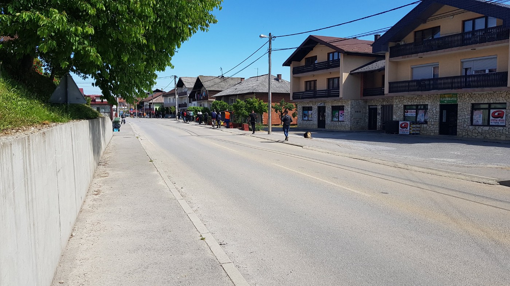

### AYS Daily Digest 17/05/2018: Fortress Europe claims life of 2 year old girl in Belgium following a police chase

LCG can’t cope with retrieving number of dead migrants in Seas//158 people arrive in Greece// Asylum Interviews scheduled as late as 2020 in Greece// Evictions in Bosnia//Bosnia to deploy more police officers to borders// News from Slovenia… France and more

Source: The enclosure, By Jean\-François Rochez
### Feature: A 2 year old Kurdish girl dies in Belgium after Police Car Chase

The [body of a lifeless baby girl with fatal injuries was found near Mons in Belgium\.](https://www.bbc.com/news/world-europe-44152854) The cause of death remains undetermined\. The death occurred during a one hour police chase, where Belgium officers chased a van full of 30 people including children believed to be of Kurdish origin\. They were trying to reach England\.

[Police have revealed](https://www.bbc.com/news/world-europe-44152854) that during the chase shot were fired\. The van attempted to evade police before eventually colliding with another vehicle near Mons\. Fifteen police cars and 30 officers were involved in the chase which came to an end around 03:00 \(01:00 GMT\) on Thursday\. Once the van vehicle stopped a struggle broke out and police fired shots\. The police stress that the girl was not hit by gunfire\.

Belgian media have reported that the girl was allegedly held out of the van window in an attempt to keep police at a distance, but **these claims have not been confirmed\.**

A group of around 60 people protested by blocking a motorway near Dunkirk on the border of Belgium and France\. Twenty people involved in the protest have been detained, some even searched by French CRS riot police\.

Organisations who worked with the girl and her family in Dunkirk have released statements of condolence and outrage following the incident\.

> This morning our friends in the Dunkirk gym told us of this horrific event in Belgium where a two year old girl died\. These people have lost so much and have just had their lives shattered again 

> Until appropriate safe and legal routes are established we fear that ordinary people will continue to take terrifying risks\. 

> We cannot continue to be a party to this treatment of people seeking sanctuary at our border\. Please share this post and join us in saying enough is enough — Care4Calais 

> How many times does this have to happen before Europe’s governments rethink the way they treat the most vulnerable people in society? 

> We were absolutely heartbroken to hear about the tragic news of this young child’s death this morning\. This is sadly yet another needless and cruel loss of an innocent life that has resulted from the hostile treatment of refugees across Europe\. 

> Our thoughts are with the family, the community, and the volunteers who have supported this family and many others living in inhumane conditions in Northern France and across Europe\. — Help Refugees 

### Libya
#### LCG complains of lack of resources to cope with numbers of dead migrants in Seas

[The central sector of the LCG has stated](https://www.libyaobserver.ly/inbrief/libyan-coast-guard-complains-lack-supplies-cope-numbers-dead-migrants) that they have had difficulties in recovering the bodies of people who have lost their lives trying to reach Italy\.

They have stated that deceased bodies who are pulled out of the sea spend days on thee shore before being delivered to relevant authorities\.
### Greece:
#### Arrivals:

Three boats arrived on the Greek islands so far this morning carrying 158 people\.

> **First boat landed in Kastellou, Chios, 04\.10\.** 
 

> 48 People 
 

> 20 children
 

> 11 women
 

> 17 Men 

> **Second boat landed in Komi, chios south, 08\.3** 0\.
 

> 46 People 
 

> 14 children 
 

> 13 women 
 

> 19 Men 

> **One boat picked up outside the airport, Lesvos south, 04\.15, by Frontex\.** 
 

> 64 people\.
 

> No breakdown so far\. 

#### Mobile Info Team on look out for a full time Arabic English Interpreter in Thessaloniki

> The Mobile Info Team is looking for a full time Arabic English interpreter in Thessaloniki\. We provide information and assist asylum seekers and refugees through asylum related procedures\. You should have excellent English and Arabic skills, be dedicated and be able to work under time pressure\. We can offer food, accommodation and a small stipend\. If you are interested please send an application to contact@mobileinfoteam\.org or send a message to our Facebook page \( [www\.facebook\.com/mobileinfoteam/](https://www.facebook.com/mobileinfoteam/) \) \. 

#### Asylum seekers receive notice of interview dates in scheduled for as late as 2019 and 2020 Mobile Info Team Reports

In this unfortunate development, Mobile Info Team states that in most cases there is no possibility to request an earlier date for an interview\. The reasons for the delay is due to the financial situation in Greece which has left the Greek Asylum service seriously understaffed\.

> Beear in mind that the situation of Asylum\-seekers in Greece is often better than that of asylum\. As an asylum student on the mainland, you are often entitled to financial assistance and a place in a camp or residence\. After giving you asylum, you will lose at some point your financial assistance and the possibility of staying in the house provided by the state and you will have to take care of So we fully understand that it’s very annoying to have a very late interview date\. But, until you get a decision, you will at least receive support for your life, which you may not get after you get asylum — Mobile Info Team 

#### SAMS are looking for Arabic/English translator to join their team in Chios

To find out more please [follow this link](https://www.facebook.com/.../permalink/641469356192488/)
### Bosnia:
#### Sarajevo Park was evicted today around 9am

Over 400 people who are sleeping in the park in about 50 tents, are to be evicted on Thursday morning and should be taken to Mostar in camp Salakovci\. Volunteers raise concerns that the camp has capacity of about 250\.

> **A volunteer warns local aid workers have to inform the residents of the park have 3 choices:** 
 

> 1\)leave today
 

> 2\)wake up 7am and pack all your belongings and be ready to be escorted onto bus and be taken to camp
 

> 3\)resist and expect forced eviction by police with incurrent violence and detention 

**Volunteers are needed to help on Thursday with the eviction** 
1\. To disinfect groundsheets and take down tents and pack NEATLY so they can be sent to border areas
Car and van owners/drivers needed to deliver tents ect to Pomozi\.ba

**If you want to help please meet at the park at 7\.30am\. Do not impeded eviction operation\.**

#### Evictions today in Kladusa

Evictions saw hundreds of adults and children again on the move at the border of Velika Kladusa between Bosnia and Croatia\.

#### [Bosnia to deploy more police to borders](https://l.facebook.com/l.php?u=http%3A%2F%2Fwww.balkaninsight.com%2Fen%2Farticle%2Fbosnia-pledges-to-crack-down-illegal-migration-05-17-2018&h=ATMDWPm6nuMVpy8OLxaTVTqYkZccNjk7WOoJuWtCdSRQf3Prd--dXyoyP78HaOpWW3GQdahwd5bh2L3t50y29zRT13dyIWj9cjZcwDp73Mw0aNdwtr_hOmE) with Serbia in attempt to prevent surge in illegal Migration over Summer months\.

Bosnia is currently believed to have 3,600 people seeking safety registered\. This number is believe to be lower in reality as large numbers of people attempt to cross the border with Croatia daily\.

**“If we observe the routes, we expect that by the end of summer we will see about 400 people arriving in Bosnia per week\. This is an estimate, but of course, not everyone will stay in Bosnia”** — IOM Coordinater, Van der Auweraert said\.

Since the typical ‘Balkan Route’ from Serbia to Croatia or Hungary to reach Western Europe was effectively closed in March 2016, people seeking safety have been forced to find alternate routes, Bosnia being one of them\. It is feared that Bosnia will not be able to cope with numbers\.

**“All those spotted entering Bosnia from Serbia and Montenegro, at every location that is not an official border point, will be stopped and returned\.” —** Zvizdic, Chairman of the Council of Minsiters Bosnia
### Slovenia/Austria
#### Slovenian and Austrian ‘cost\-sharing’ at the expense of human lives

It seems that [Slovenian and Austrian governments are cooperating in the forced deportations of people\.](https://www.facebook.com/RefugeesSpielfeld/photos/rpp.1631251033802046/2032966146963864/?type=3&theater) Today we were informed by the Slovenian and Austrian activists on the deportations of two people — one from Gambia and one from Nigeria, yet this time from Slovenia to Austria in order to deport them then to their countries of origin\. One of these men came to Slovenia several years ago and the other one was supposed to get married very soon in that country\. We are not sure what is the legal basis for this cynical cooperation, yet what some activists think that might be the case is the EU Return Directive from 2008\. As it is stated at the website of the EU commission, “The EU’s return policy would not be effective without operational cooperation between EU States\. This allows them to avoid duplicating work\.” We assume that the ‘work’ here stands for jeopardising human lives and taking their freedom away\.
### Belgium:
#### Arrests in Belgium

[Plateforme citoyenne de soutien aux réfugiés Bruxelles](https://www.facebook.com/plateformerefugiesbxl/) reports that police operations this morning at the park and station arrested a number of people\. Two unaccompanied Eritrean minors who have been assigned to do guardianship service, a Nigerian woman and her two children, as well as 8 others from Egypt, Sudan, Eritrea and South Africa\.

](assets/5e44cf93e565/1*N44p6zoGSCoYZ3c5dn25Dw.jpeg)

Source: [Plateforme citoyenne de soutien aux réfugiés Bruxelles](https://www.facebook.com/plateformerefugiesbxl/)
### France:
#### Refugee Community Kitchen Update:

> The mood is somber here in the kitchen after finding out that a two year old child who we have been supporting in Dunkirk was killed today\. 

> We are struggling to support the Kurdish community in Dunkirk with food, hoping to bring a little light into their Ramadan, while the local authorities carry out evictions that force families to make desperate bids for the safety they hope to find in the UK\. 

> Our team is struggling to stay positive today while witnessing on\-going crimes against humanity being carried out in northern France \(and Belgium\) \. 

> We are given hope by the people we serve, who showed grace and humility today while living in squalor and finding out that they had lost a young member of their community 

#### Solidarity March

](assets/5e44cf93e565/1*Pxz96ZWGg2PdIvdILL0r7Q.jpeg)

Source: [L’Auberge des Migrants](https://www.facebook.com/AubergeMigrants/)

**We strive to echo correct news from the ground through collaboration and fairness\.**

**Every effort has been made to credit organizations and individuals with regard to the supply of information, video, and photo material \(in cases where the source wanted to be accredited\) \. Please notify us regarding corrections\.**

**If there’s anything you want to share or comment, contact us through Facebook or write to: areyousyrious@gmail\.com**

_Converted [Medium Post](https://medium.com/are-you-syrious/ays-daily-digest-17-05-2018-fortress-europe-claims-life-of-2-year-old-girl-in-belgium-following-a-5e44cf93e565) by [ZMediumToMarkdown](https://github.com/ZhgChgLi/ZMediumToMarkdown)._
