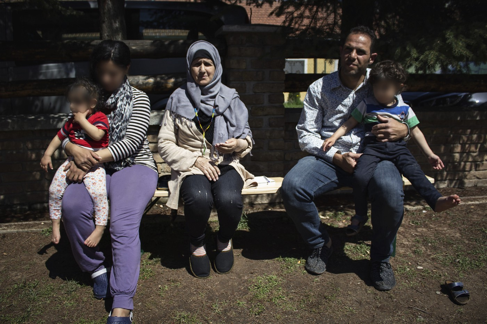
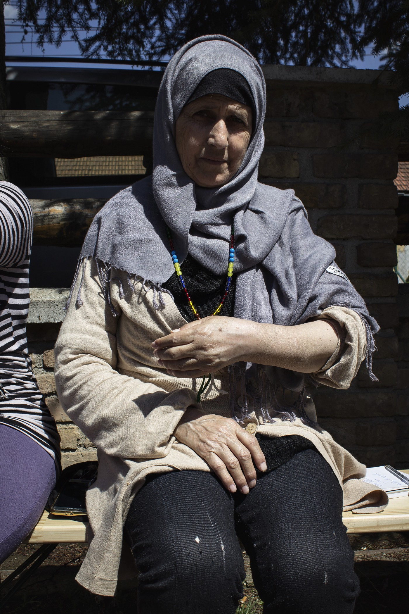
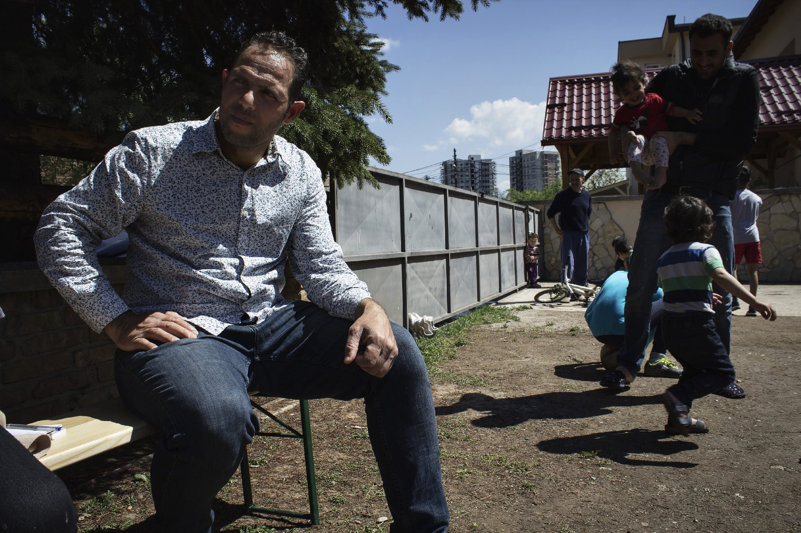
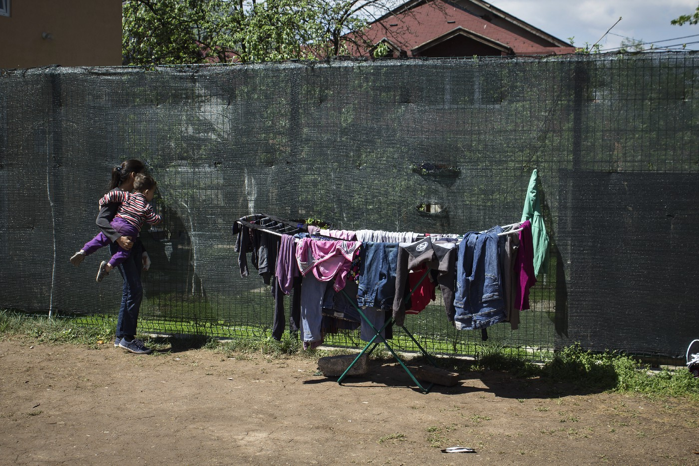
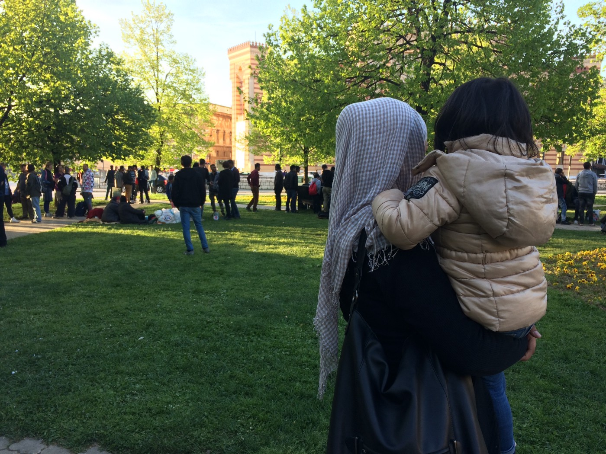

### AYS Special: Rough road from Serbia to Bosnia
#### **More and more people are arriving from Serbia to Bosnia saying that there was no help and no future to be found in that country\. People who are coming are broke as well as exhausted after years on the road\. At the same time as the EU borders are closed, Bosnia is called “a country of transit”\. But for Soad and Hassan, who are some of the 3500 people who have come here this year, staying not necessarily has to be an unimaginable scenario\. “People are kind in Bosnia\. It is a good country — it has peace\. That is all we want”, Hassan told AYS\.**

Soad and Hassan came to Bosnia together from Serbia\. No one of them know what the next step will be\. Photo: AYS

Soad’s arm is attatched in a sling and she is caressing it as try to make the pain go away\. It has healed badly as a result of no healthcare\. Without being given the context, her surroundings could have been described as quite relaxing\. Some children are playing ball in the courtyard and a group of men is watching them from afar, as they are sitting down in the shadow next to a green fence\. The summer has arrived in Bosnia, just as at least 4500 people fleeing war and persecution\. Soad is one of the around 80 people living in a big house in the outskirts of Sarajevo, looked after by volunteers\.

For Soad, who is sitting on a bench in the sun, the road here was not easy\. Nonetheless was life back in Daraa, the city where she was born 53 years ago and the place some claim was where the war in Syria started\.

“It was fighting all the time, and no one has a future there,” she said while speaking to AYS volunteer in Sarajevo\.

Her arm has been bothering her since the winter when she fell hard on the ground while trying to come to Bosnia\. At that point, the ground was still covered with snow\. She nods her head when she recalls the pain and the freezing cold when she was laying down\.

“I ran away from Macedonian people at the border with Serbia\. It was five or six of them, all young men\. Local people are sometimes hunting down and robbing refugees when we try to cross the border\. I got away, and the smuggler drove me to a hospital in Belgrade\. But the doctor did not do anything”, Soad says\.

Since Soad was chased down at the border between Macedonia and Serbia, she no longer can use her left arm as she used to\. It broke, and due to lack of healthcare it has healed badly\. Photo: AYS
#### **The road to Bosnia**

Soad came to Bosnia with Hassan, who is the same age as her son\. Before reaching Bosnia, they tried to cross the border with Croatia three times from two different locations\. As they both are sitting in the sun in the garden in the outskirts of Sarajevo, all attempts obviously failed\. One of the times, the restaurant owners called the police\. Hassan felt that something was wrong but did not know what until it was too late\.

“They saw that we were refugees and called the police while we were eating,” he says\.

After three failed attempts, they decided to try and move on to Bosnia\. After arriving in Sarajevo early in the morning, the smuggler who brought them over the border in two cars demanded more money\. They had already paid him 500 euro per person\.

“He became violent and pushed the men\. \(The\) children started crying and were afraid\. My wife Tahani did not want to give \(the smuggler\) more money as we do not have much left, but we had to\. So I gave him 150 euro more”, Hassan explains\.

Hassan, from Damascus, never expected to end up in Bosnia\. But he could imagine staying here, if he got the chance\. The most important thing for him is a safe future for his wife and their three children\. Photo: AYS

The house in which they were kept by the smuggler is located in central Sarajevo\. If Hassan wanted, he could find it again easily\. The smuggler was from Morocco and cooperated with a Serbian smuggler\. In the house, he estimates that around 15 people live, most of them paying 10 euro a night in rent, as the official accommodation places are limited\. Especially for young men\.
#### **Memories from Serbia**

During the incident in the smuggler’s house, Soad was not afraid\. She sat down with the children during the turmoil, hoping that everything would calm down\.

What is worse, she says, is her hand\. She has been to the doctor in Bosnia now, and she is taking painkillers to cope\. If she had gotten help at first, when the smuggler dropped her off at a hospital in Belgrade, it would not have gotten this bad\. Instead, the doctor at the emergency room put gips on her hand, and she cannot recall that anyone did an x\-ray\. As it is now, she can no longer move her fingers\.

“They did not do anything in Serbia\. I was to the doctor in the camp, but she said that I needed to go to a hospital and see a specialist,” Soad says\.

But no one could take her there, the doctor in the camp had no car and yelled “out, out\!” when she tried to ask again\. Hassan, who often went with her to help translate from Arabic, is quiet for a while\. Thinking about how to phrase it\.

“I am very sorry to say this\. But it was very bad in Serbia,” he says politely\.

UNHCR told Hassan that they could not help or do something since the Serbian government did not give them an allowance to do more than provide with food and a place to sleep\. During the winter they had no hot water for 20 days, also this due to lack of resources, according to the staff Hassan asked\.

A courtyard, a sunny day, laundry is drying and people are doing their best to make the best out of a situation they never expected\. Photo: AYS
#### Giving birth to a child

In the same house where Soad and Hassan lives, another woman tells the story of giving birth in Serbia\. Her daughter was born in March last year, and before that, she had to ask several times to be taken to the hospital\.

“It was 12 hours of pain\. Too much pain,” she says, shaking her head\.

The nurses at the hospital did not speak English and there was no translator present\. After the baby was delivered, she stayed alone at the hospital for three days\. No one spoke to her or asked if she needed anything\.

“I did not understand anything of what they said\. They did not ask if I needed anything after\. You know what you have in your panties when it bleeds? I did not get anything,” she says\.

Instead, she says at the same time as she looks down with tearful eyes, she used her headscarf to stop the bleeding\.

The young woman had another daughter from before they left Afghanistan\. Photo: AYS
#### **Locals helping out**

Despite the in many ways eventful road here, both Soad and Hassan are happy to have left Serbia\. In Bosnia, they have experienced a better welcoming, even though none of them have seen any staff from IOM, UNHCR or the government\. After being released from the smuggler’s house that morning days ago, they had nowhere to sleep\. Neither Hassan nor Soad knew who to call, or saw anyone that could help\. They slept on the ground from 5 am in the morning, exhausted after the night\.

“Local people stopped and gave \(us\) blankets and food,” Hassan says\.

It is different from how it was in Serbia\. Like when the restaurant owner called the police since they saw that they were refugees in a city at the border\.

“\(It is\) much different\. People here are very kind,” Hassan says\.

At the same time, volunteers are worried that the lack of response can push forward a shift in mentality among the Bosnians, too\. As AYS reported about earlier this week, [the Commissioner for Human rights](https://www.coe.int/en/web/commissioner/-/the-commissioner-calls-on-bosnia-and-herzegovina-to-improve-assistance-to-asylum-seekers-and-migrants) urged the authorities to immediately respond to the crisis, regardless of lack of resources\.
#### **The children’s future in focus**

For Hassan and his family, Bosnia not necessarily has to be a transit country, as it is phrased in as well local as international media and by IOM and UNHCR\. The problem is that he does not know if it is possible to stay either\. He finds himself in yet another limbo\. The EU borders are closed and no legal paths to safety work as they are supposed to\.

IOM has said that people soon will be able to re\-register and apply for asylum\. At the same time, the state and local authorities in Bosnia have their own agendas that not necessarily reflect one another\. In the middle of the political games, as well as from the EU, it’s member states and Bosnia, are the refugees, as in Hassan, Soad, and their families\.

Hassan is tired as well as constantly worried\. His main concern is his children and their access to education\. For him, education is the same thing as having possibilities and power\. His son will soon turn seven\. Hassan has no idea when he will be able to start school\. Just as Soad and her family, they lived as internally displaced for years\. Moving around like that in a war\-torn country has its limitations\.

“No one of my three children have \(any formal\) education\. That is what I am most worried about\. People are kind in Bosnia\. It is a good country — it has peace\. That is all we want,” he says\.

**_\(By Hanna Strid, AYS Info Team volunteer\)_**

**We strive to echo correct news from the ground through collaboration and fairness\.**

**Every effort has been made to credit organizations and individuals with regard to the supply of information, video, and photo material \(in cases where the source wanted to be accredited\) \. Please notify us regarding corrections\.**

**If there’s anything you want to share or comment, contact us through Facebook or write to: areyousyrious@gmail\.com**

_Converted [Medium Post](https://medium.com/are-you-syrious/ays-special-rough-road-from-serbia-to-bosnia-f18b106d8e5d) by [ZMediumToMarkdown](https://github.com/ZhgChgLi/ZMediumToMarkdown)._
