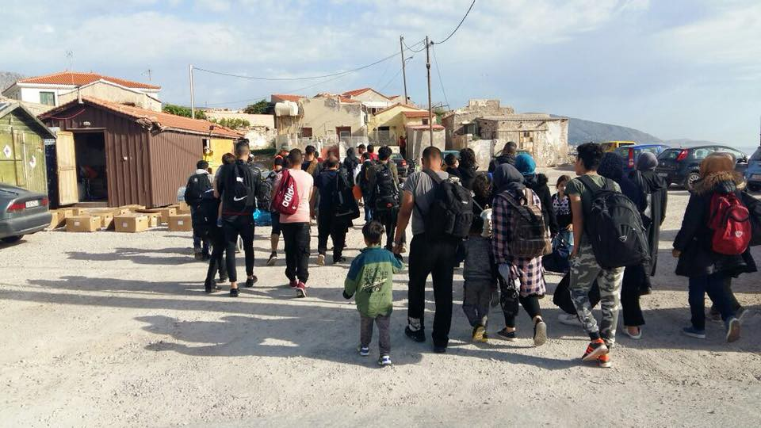

### AYS DAILY DIGEST 19/05/2018: New statistics of Greek Asylum Service report extremely low number of unaccompanied minors granted protection

_New data published by GAS for the period 2013–2018//Arrivals in Chios//New data published by UNHCR in regards to the increased number of arrivals in BiH and issues with asylum applications//Deportation from Austria to take place on Wednesday//Protest in Switzerland against deportation plan//Another death on the French\-Italian border//More news from Belgium\. \._

Credit: Salvamento Marítimo Humanitario

**FEATURE**

Greek asylum service \(GAS\) has posted statistics, including the numbers of unaccompanied minors who reportedly asked for asylum in the country, from 7th June 2013 to 30th April 2018\.

**2013** : out of 4,814 asylum applications, 189 were from unaccompanied minors, mainly registered in the Attica region\. Afghanistan, Pakistan and Albania were the top three countries of origin with the highest number of applications\. Out of the 4,814 total requests, only 2,580 were examined\. Out of these 2,580, only 322 got accepted either as refugees or were granted subsidiary protection, while the other 2,258 received negative decisions\. Just 12 out of 96 requests from unaccompanied minors got some kind of protection\!

**2014** : Out of 9,431 asylum applications, 420 were from unaccompanied minors, again mainly in the region around Athens\. Afghanistan, Pakistan and Syria are recorded as the major countries of origin, along with with an increased number of requests of people from Iraq as well\. 8\.498 requests were examined, just 1\.710 got a positive response\. Out of the 390 requests examined from unaccompanied minors, only 75 got refugee status or subsidiary protection\.

**2015** : 13,188 asylum applications were made that year, 383 from unaccompanied minors\. Increased number of application from the islands, but Attica and Thessaloniki were the areas with the highest number of applications\. Apart from Syria, Afghanistan, Pakistan and Iraq, applications from Albanians rose during the year, almost doubling the number of the previous year\. 12,827 requests were examined, of which 3,994 received a positive decision\. Out of the 387 requests from unaccompanied minors only 95 got a positive outcome\.

**2016** : 51,059 requests were lodged that year \(287\.2% more than the previous year\) \. 1,977 of these were from unaccompanied minors\. Attica, Thessaloniki and Lesvos were the main areas where the applications were made, but high numbers were recorded also Thrace, Chios, Samos and the Piraeus\. 26,929 requests were examined, and 2,700 received a positive outcome\. 795 requests from unaccompanied minors were examined, but just 82 were granted asylum or subsidiary protection\.

**2017** : 58,659 asylum applications were made, 2,458 from unaccompanied minors\. Lesvos registered the highest number of applications this year\. An increased number of applications from Bangladesh, Iran, Turkey and Palestine were noted\. 51,737 requests were examined, and 10,357 obtained refugee status or subsidiary protection\. 1,675 requests were lodged by unaccompanied minors, and only 188 had a positive outcome\.

**2018** \(up to 30th April\): 18,625 requests were made, 625 from unaccompanied minors\. Lesvos still takes in the highest number of applications\. 12,876 requests are under examination so far this year, and 3,959 obtained refugee status or subsidiary protection; 499 requests were made by unaccompanied minors this year, 100 have received protection\.

What is extremely worrying is the fact that **out of the 3,842 requests from unaccompanied minors, in the period from 2013 to 2018, just 552 were recognised either as refugees or with subsidiary protection** \.

Find more information [here](http://asylo.gov.gr/en/wp-content/uploads/2018/05/Greek_Asylum_Service_Statistical_Data_EN.pdf) \.

**GREECE**

_Arrivals_

A total of [47 people landed](https://www.facebook.com/chiosesrt/posts/1667799343289243?hc_location=ufi) on Oinousses Island at 4 AM, then transported to Chios \(14 children, 11 women and 22 men\) \. They reported coming from Syria, Iran, Iraq, Somalia and Egypt\.

_Volunteering and donations_

[Warehouse coordinator](https://www.facebook.com/chiosesrt/posts/1668248689910975?hc_location=ufi) in Chios needed\.

[Donations](https://www.facebook.com/pikpalesvos/posts/2085254781749942?hc_location=ufi) for Pikpa — Lesvos\.

**BOSNIA AND HERZEGOVINA**

The number of refugees and migrants continues to increase rapidly throughout the country: arrivals have increased from 237 in January to 1\.448 in April, making it a total of 2\.762 people from the beginning of the year, 53 of them, unaccompanied minors\.

The number of asylum applications made so far is 384, but “ _many asylum seekers continue to face obstacles accessing the asylum system, namely reaching the MoS, Sector for Asylum registration mechanisms within the timeframe envisaged by the Attestation of the Intention to seek asylum issued by the Service for Foreigners’ Affairs \(up\-to 14 days\) \. Failure to comply may lead into irregularity of stay in the country_ \.”

A shortage of trained staff within the Sector for Asylum leads to an insufficient number of interviews for registration of asylum seekers\. 
 
 “ _Identification, referral of and support to unaccompanied and separated children \(UASC\) continues to be challenging for BiH authorities, especially the appointment of legal guardians authorised to make decisions in UASC’s best interest, as required by law_ ”\.

Read more [here](https://data2.unhcr.org/en/documents/download/63630) \.

**AUSTRIA**

Another deportation from Austria will be happening next Wednesday 23/5 to Algeria\. Please, reach out to AIR Algerie in order to prevent the deportation\.

**SWITZERLAND**

On Friday, [about 1500 Eritreans demonstrated](http://www.rts.ch/info/regions/berne/9580143-plus-de-1500-erythreens-manifestent-contre-la-politique-d-asile-suisse.html) against deportation plans of the Swiss government in Berne\. A petition has raised 12\.000 signatures and was handed over\.

**FRANCE**

A 20 year old Nigerian [migrant was found dead](https://www.dici.fr/actu/2018/05/19/hautes-alpes-un-migrant-retrouve-decede-col-montgenevre-cote-francais-1138392) on Friday afternoon in the region of Hautes\-Alpes, close to the Italian border \(above Briançon\) \. The cause of death is still unknown\.

Updated list of needs for the summer includes:

\- Dates \(for Ramadam\)

\- Mens and boys jeans and joggers

\- Boxer shorts and socks

\- Spray deodorant and wet wipes

\- Sleeping bags

**BELGIUM**

Important update regarding the tragic death of the two\-year\-old Mawda on Thursday\.

[Media](https://amp.theguardian.com/global-development/2018/may/18/belgian-authorities-admit-two-year-old-girl-was-shot-after-police-chase?CMP=share_btn_tw&__twitter_impression=true) reports that Belgian authorities confirmed that the little girl died after a bullet hit her in the face, contradicting the version issued few days ago “ _suggesting instead that she had been taken ill or died as a result of erratic driving_ ”\.

Investigations are ongoing to assess the circumstances of Mawda’s death\.

**We strive to echo correct news from the ground through collaboration and fairness\.**

**Every effort has been made to credit organizations and individuals with regard to the supply of information, video, and photo material \(in cases where the source wanted to be accredited\) \. Please notify us regarding corrections\.**

**If there’s anything you want to share or comment, contact us through Facebook or write to: areyousyrious@gmail\.com**

_Converted [Medium Post](https://medium.com/are-you-syrious/ays-daily-digest-19-05-2018-new-statistics-of-greek-asylum-service-report-extremely-low-number-of-4f53a55b0cf2) by [ZMediumToMarkdown](https://github.com/ZhgChgLi/ZMediumToMarkdown)._
