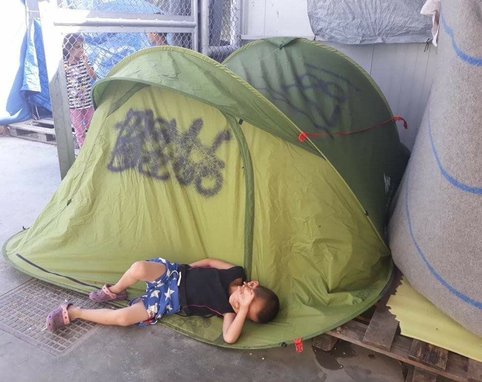
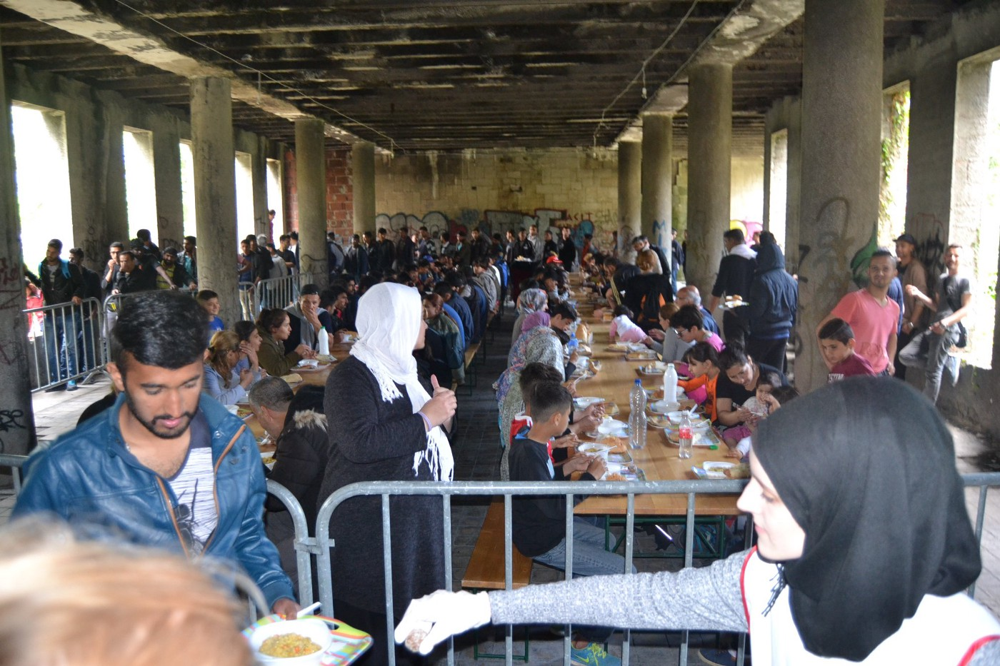

### AYS Daily Digest 20/05/2018: Hollow “victories” serve only Publicity

_UNHCR congratulates itself on marginal victory in “rescuing” people from Libyan detention // New arrivals in Spain // Conditions remain detestable in Greece // Bulgarian Prime Minister compares border fence lengths // Montenegro considers border fence with Albania // Mourning of the death of a Mawda in France as well as continued abandonment of refugees in Paris // Protest on Manus is ongoing\._

](assets/8d204897c984/1*8mXcXEfoBc1X2K1_N2kYYA.jpeg)

Small tent city in St\. Denis, Paris\. Photo Credit: [VZWGent4Humanity refugee support\.](https://www.facebook.com/BelgiumGent4Humanity/?hc_ref=ARTEnQaI_CQuODQSL4j1hR22XMHayJU-Ko9DQVo2fayRoI7oM2MkuY0k2GytJjlF6Xc&hc_location=group)
### FEATURE: UNHCR congratulates itself on marginal victory in Libya — what’s the cost?

IOM and UNHCR celebrated the liberation of 132 people from detention in Libya to be returned to Niger\. The story only needs to take but a marginal amount of digging to find many sources for a stink\. IRIN reported on several cases in which Niger actually returns refugees back to Libya \(stating that they are a security threat and part of Libyan militias — interestingly enough the most recent returning was also 132 people\), meaning that these people could possibly be facing only a table tennis game of one detention facility for another\. The extent to which UNHCR and IOM crow about the barest hint of success \(success that rings hollow in the context of these counter deportations\), cynically opting to replace the word “refugees” with their own twitter handle \(a move that is already disgusting and problematic and presents UNHCR as the de\-facto representatives of refugees\) remains deeply problematic, yet unsurprising\.

■■■■■■■■■■■■■■ 
> **[UNHCR Niger](https://twitter.com/UNHCRNiger) @ Twitter Says:** 

> > Evacuations recommence! Another 132 @[Refugees](https://twitter.com/Refugees) were saved from  detention in Libya and arrived safely this morning to Niamey. The next step will be long term #solutions. https://t.co/6mzQFXceEd 

> **Tweeted at [2018-05-10 10:02:44](https://twitter.com/unhcrniger/status/994518089894162432).** 

■■■■■■■■■■■■■■ 

The Libyan Coast Guard has apprehended 19,000 people, many of whom, presumably remain in the horrific detention facilities in the country\. Of course, these horrible conditions are tacitly supported by the EU in spite of extensive criticism by human rights organizations and condemnation by official bodies as, at the end of the day, money talks\. However, the ECHR has launched a lawsuit that may lead to the end of the practice — the lawsuit is based on cases involving the slavery and electrical torture of several of those apprehended by the Libyan authorities\.

According to the ECHR, Berlusconi and then\-leader of Libya Muammer Gaddafi also [had brokered a similar deal](https://www.theguardian.com/world/2018/may/08/italy-deal-with-libya-pull-back-migrants-faces-legal-challenge-human-rights-violations) that was later suspended following the ECHR lawsuit\. We hope that this deal will meet with similar success\. However, the situation remains sour with UNHCR essentially being able to salvage publicity from what is, essentially, a glorified case of violation of non\-refoulement\. Nobody should be staying in Libya, but rescuing people by giving them no option but to go back is a cheap tactic\. Indeed, the general push seems to be to redeem and undercut criticism of EU border practices simply by placing obstacles for people further and further away from EU borders\. If people cannot even reach EU borders, EU borders are not responsible for their suffering, right?
### SEA

Frontex picked up 41 people in Spanish waters who disembarked at Barbate\. Additionally 55 people were transferred to a port after being rescued from an unsafe sea vessel\.

■■■■■■■■■■■■■■ 
> **[SALVAMENTO MARÍTIMO](https://twitter.com/salvamentogob) @ Twitter Says:** 

> > Avión Condor II @[Frontex](https://twitter.com/Frontex) localiza #patera #Estrecho y tripulación guardamar Concepción Arenal rescata 41 #personas que desembarca en #Barbate https://t.co/UGedCAb4Nk 

> **Tweeted at [2018-05-20 12:42:04](https://twitter.com/salvamentogob/status/998182066490617856).** 

■■■■■■■■■■■■■■ 

### GREECE

According to Aegean Boat Report, 29 people arrived to Chios on Sunday morning at 4:30\. They will be registered and join the already painfully\-overcrowded conditions\. The majority of these were comprised of children \(12\) and women \(10\) \.

[_Source\._](https://www.facebook.com/AegeanBoatReport/photos/a.285312485325196.1073741828.285298881993223/349177515605359/?type=3&ifg=1)

It is of vital importance to not let the relative peace and calm trick us into thinking that conditions have noticeably improved\. Again, human rights activist Arash Hampay shared a photo from a resident of Moria, reminding everyone that a lack of news does not mean a lack of suffering\.

Photo: Iraj Baloch

[Hampay](https://www.facebook.com/photo.php?fbid=635108980168525&set=a.543629595983131.1073741843.100010082855510&type=3) writes: “Single mothers, children, babies, and families are forced to sleep in small tents on hard surfaces in crowded areas and horrible situations with no relief from the burning sun\.”

An additional indignity people are suffering is a lack of access to education\. The endless “pause button” this has pressed on their lives only sets back many attempts to move forward with some semblance of a normal life\. The Echo Mobile Library Project is respecting the diginity of individuals by giving more access to books\. This project stems boredom — the greatest killer of the soul, but they need your help\!

Echo mobile library is currently desperately in need of funds and donations\.

Kurdish and Farsi\-language books are in great demand\! Additionally the project itself is in great need of funding\. If you have some extra funding to share, please consider sending it [here](https://chuffed.org/project/echorefugeelibrary) \.

For book donations people can get in touch with the project via contact@echo\-greece\.org
### BULGARIA

Bulgarian Prime Minister Boyko Borisov met with Journalists on May 18th in order to discuss a variety of hot topics affecting the EU\-Western Balkans summit hosted on th 17th\. Among these, of course, was migration — specifically the further normalization of violence against refugees by placing blame for non\-adherence to the Dublin and other agreements \(specifically in the context of Visegrad countries being hesitant to comply with mandatory relocation\) on countries not securing their borders sufficiently — specifically Italy and Greece\.

It should be known that the Bulgarian Prime Minister praised notorious vigilante “migrant hunter” Dinko Valev in 2016, stating that protection of Bulgaria’s border would be a “group effort\.” Under international backlash and criticism, he later took a step back, stating that the man would be prosecuted, however in 2017, [a notorious member of the group was acquitted of any wrongdoing](https://sofiaglobe.com/2017/08/03/bulgaria-court-acquits-migrant-hunter-over-detention-of-afghan-migrants/) \.

Borisov has since taken a more EU\-friendly approach and strengthened Bulgaria’s border fence with Turkey, suggesting it’s even “bigger than that of Orban’s\.”

The increase of people crossing via Greece’s land border also is related to Bulgaria strengthening ties with Turkey, and Turkey then diverting its tactics to prevent the crossing of people towards the Bulgarian border, away from the Greek border\.
### **MONTENEGRO**

According to Reuters, Albania and Montenegro remain at a stalemate as Albania is refusing to accept readmission of people who crossed from Albania to Montenegro\. In response, the head of Montenegrin border monitoring and security proposed, take a guess, a fence between Albania and Montenegro\. It remains unclear the extent to which people are travelling through Albania and Montenegro as both countries have been unwilling to monitor or disseminate relevant information, in the “tried and true” “ignore it until we can build a fence” strategy\.
### SERBIA

The Workshop in Belgrade is continuing a fundraiser to continue its education and development projects in the heart of Belgrade\. If you are interested in contributing to the campaign to keep the space open and operational, please go [here](https://www.gofundme.com/educating-refugees-at-the-workshop) \!
### BOSNIA

Red Cross Bosnia posted a photo detailing the number of people who are currently present there\. Bihac is fast becoming another hot spot in BiH\. The government entities are slowly working to accommodate some more people in a formal way, but the majority of response is still coming from ordinary citizens and volunteers\.

Photo Credit: Red Cross City of Bihac
### **FRANCE**

The community who knew of the two\-year\-old girl named Mawda who was killed last week in an altercation with Belgian border police mourned her\. The Belgian government denies the allegation that Mawda died as a result of gunfire on the part of the Belgian police, but a full autopsy will be carried out on Thursday to determine the cause of death\. According to witnesses, Mawda died of a gunshot wound to the head as Belgian authorities pursued the van that she and her family were traveling in, [source](https://www.theguardian.com/world/2018/may/18/two-year-old-girl-dies-after-incident-involving-armed-police-in-belgium) \.

](assets/8d204897c984/1*hkoqbRDX5Cq_tBaffYZHsQ.jpeg)

Photo credit: [Dunkirk / Dunkerque Refugee Women’s Centre](https://www.facebook.com/refugeewomenscentre/)

Volunteers on a trip to Paris, St\. Denis bear the following report of the horrible, dehumanizing conditions and the lack of sufficient support:

> Paris\. St\. Denis yesterday…\.This was a day of very mixed emotions\. We found hundreds of refugees living in terrible conditions under bridges while a short walk away there a beautiful shopping center stands majestic complete with waterfalls\. Many of the refugees we spoke to want to stay in France and have either or about to claim asylum, but it’s a very slow and complicated process\! \! The stench of urine was eveywhere, and in first aid we saw endless cases of scabies, four of lice, and two of possible TB\. Our mental health team reached out and spoke with the refugees about their situation\. Some had just arrived and were hopeful\. Others had been there way to long and were down and desperate\. But they were relieved we’d come to help, and there were moments shared with smiles and laughter despite the sadness\. What was hard? Seeing tourist boats go up and down the canal every five minutes with people taking photos as if the refugees are animals in a zoo\. A curiousity piece\. \.Apart from a couple of wonderfully kind hearted local people who came to offer some food or important phone numbers for legal help we saw no other organsiations all day\. Has the world forgotten there are refugees here who badly need help?? The young girl who is now addicted to crack and no longer knows what day it is\. 

> The Eritrian couple walking around with a four week old baby wrapped in an old blanket\. The sweet young Palestian who spoke 5 languages and who’s parents were killed instantly when their house was bombed, and the Sudanese teenager who had arrived just three days ago having walked from Italy across the mountains to Paris\. His feet were so damaged we doubt he’d ever recover full use of them\. There are now over 1,500 refugees scattered in different locations around the city who would not survive without the help of a few dedicated volunteers and small groups who tell us that less and less help is arriving and that most people are unaware this is still happening\. 

Solidarity Migrants Wilson posted the following volunteer call: 
“Need volunteers tomorrow and the following days at 9 pm at 56 Boulevard Ney Porte de la chapelle\. It’s with everyone’s involvement,that we succeed this crazy bet of solidarity

Register on the schedule [https://docs\.google\.com/spreadsheets/d/1CDTu2aZcuhldwhfPfrch75FxfsIFTbe97SN17bq2MQc/edit?ts=5849bb00\#gid=0](https://docs.google.com/spreadsheets/d/1CDTu2aZcuhldwhfPfrch75FxfsIFTbe97SN17bq2MQc/edit?ts=5849bb00#gid=0) as long as possible in advance and leave your full details\. Thanks\!”

Although our focus is primarily on the European Sphere of the refugee crisis, we take the moment to remind you of the ongoing protests on Manus, which are against the detention of refugees and asylum seekers by the Australian authorities:

■■■■■■■■■■■■■■ 
> **[RAC Victoria](https://twitter.com/racvictoria) @ Twitter Says:** 

> > Day 292 of peaceful protests on #Manus. Telling #refugees they cannot resettle in #Australia when so many people from the same boats are settled here is unfair. This #injustice was created by a sick bureaucratic game of eeny meeny miny mo played out 5 years ago. #BringThemHere https://t.co/LLHns5W04z 

> **Tweeted at [2018-05-21 09:27:55](https://twitter.com/racvictoria/status/998495595907072000).** 

■■■■■■■■■■■■■■ 

**We strive to echo correct news from the ground through collaboration and fairness\.**

**Every effort has been made to credit organizations and individuals with regard to the supply of information, video, and photo material \(in cases where the source wanted to be accredited\) \. Please notify us regarding corrections\.**

**If there’s anything you want to share or comment, contact us through Facebook or write to: areyousyrious@gmail\.com**

_Converted [Medium Post](https://medium.com/are-you-syrious/ays-daily-digest-20-05-2018-hollow-victories-serve-only-publicity-8d204897c984) by [ZMediumToMarkdown](https://github.com/ZhgChgLi/ZMediumToMarkdown)._
