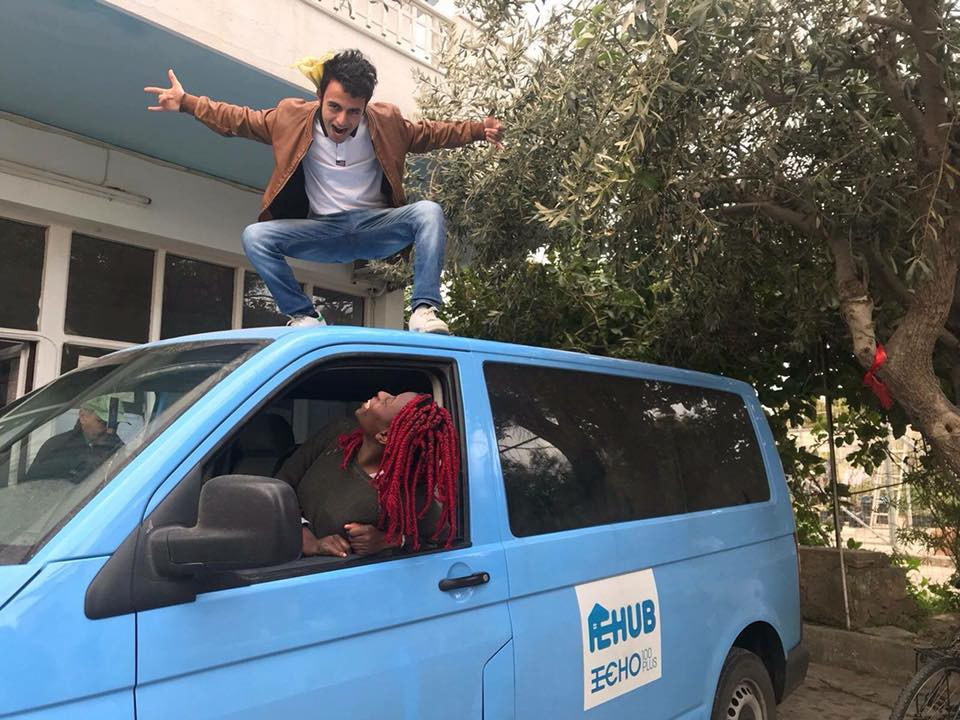
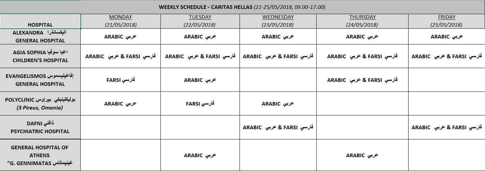

### AYS Daily Digest 21\.05\.18: “See no Evil” is the EU Border Policy

Border Externalization Continues//Death in Morocco//Arrivals in Spain//New Arrivals in Greece// Asylum System separates families//Fascist attack in Italy//Deportation flights from UK//And more…

 , showing the export of EU weapons \(shown by blue missiles\) and troops \(blue men\), to third countries\.](assets/3ee5d4060880/1*Yh6GsFbc39zjE4II0A-yRg.jpeg)

Infographic by [TNI](https://www.tni.org/en/publication/expanding-the-fortress) , showing the export of EU weapons \(shown by blue missiles\) and troops \(blue men\), to third countries\.

The EU began the policy of externalizing its borders in 1992\. The funding of non\-EU countries to patrol its borders increased dramatically in 2005 and has only gone up since then\. By paying police and security forces in “third countries,” the EU prevents many refugees from ever reaching their shores\. In following this policy, the EU has taken money earmarked for development and humanitarian aid and used it to further militarize borders in autocratic countries\. In order to detain refugees in outside countries, EU authorities have shown themselves willing to turn a blind to eye to outrageous human rights abuses\. The EU backed down on criticisms of government repression and violence in Turkey, Libya, Egypt, Sudan, Niger, Mauritania and Mali in order to make border policing deals\.

It is hard to come across exact figures for these EU payments, and this is deliberate\. The funds to police external borders come from no single source, and are disguised as aid and development funds\. It is estimated that approximately 80% of the money sent to militarize non\-EU borders comes from the European Development Fund\. These funds meant to create economic opportunities are sending more walls and weapons to governments in Africa and the Middle East\.

The money that the EU is spending to “aid” refugees is only causing more people to flee from their homes\. The disastrous effects of these EU policies are shown in a [report released this week](https://www.tni.org/files/publication-downloads/expanding_the_fortress_-_1.6_may_11.pdf) by human rights research institute TNI\. Among their conclusions:

**“The vast majority of the 35 countries that the EU prioritises for border externalisation efforts are authoritarian, known for human rights abuses and with poor human development indicators\.​**

**European nations continue to sell arms to these countries even though they fuel further conflicts, violence and repression and thereby contribute to the creation of more refugees\.**

**There’s an increasing presence of European military and security forces in third countries for border security\.**

**Frontex, the European Border and Coast Guard Agency, increasingly works together with third countries\.**

**The boosting and militarization of border security has led to a higher death toll for forcibly displaced persons\.** In general, measures to block one migration route force people to take more dangerous routes\. In 2017, 1 out of every 57 migrants crossing the Mediterranean died, compared to 1 out of every 267 migrants in 2015\.”

](assets/3ee5d4060880/1*4VBUWBRDwdp4CRGhQeskWw.jpeg)

A woman who had just been rescued from an overpacked dinghy off the Ivory Coast\. Photo Credit: [MSF](https://www.facebook.com/MSFTurkiye/)

The EU spent an estimated 15\.3 billion euros funding non\-EU countries to prevent migration in 2014–2106 alone\.

The EU is turning a blind eye to serious human rights abuses as it funds regimes in countries such as Niger, Turkey, Libya, and Sudan\. The policy of border externalization is a see no evil approach — if the EU stops people from reaching its borders, they will not have to recognize their status as refugees\. When people remain trapped in Libya and Sudan, the EU can pretend that the majority they are merely “economic migrants” undeserving of international protection\.

Today the EU made another step in this direction, as the European Commission [announced a plan today](http://statewatch.org/news/2018/may/eu-com-ilo-proposal.htm) to set up an EU\-coordination network with over 500 national officials working in non\-EU countries\. The aim of this new network would be to “prevent and combat illegal immigration, and facilitate the return of illegal immigrants and managing legal migration”, according to the EC\.

](assets/3ee5d4060880/1*9YI6fnKCCnatL33N6iGwUg.jpeg)

People trapped in a detention center, Libya 16/05/17\. Photo Credit: [MSF](https://www.msf-me.org/article/libya-providing-healthcare-detained-refugees-and-migrants)

The white\-washed language of the EU, also used by the UNHCR and IOM, hides the violent reality of their policies\. Describing refugees and migrants as “illegal immigrants”, these state actors hide their own criminality, and put it on those they are supposed to protect\. “Managing” migration means funding brutal regimes to repress and detain refugees\. “Management” is EU funding the murderous Libyan Coast Guard, and the refugee slave trade in Libya\. It is the bankrolling of Erdogan’s brutal regime under the flag of humanitarian aid\.

The EU uses such strange and backwards language to describe its policies because it can’t admit what they really are\.
### General

Today, the fifth annual report of the “Safeguarding Health in Conflict Coalition” was released\. The coalition warned that attacks on medical centers around the world are on the rise\. this year’s report documented over 700 attacks on hospitals, health care workers, patients, and ambulances in 23 countries\.

[According to the report](https://www.safeguardinghealth.org/impunity-reigns-medical-personnel-and-facilities-across-23-conflict-torn-countries-remain-under) : “The ten countries which experienced the most attacks on health in 2017 are Afghanistan, the Central African Republic \(CAR\), The Democratic Republic of Congo \(DRC\), Iraq, Nigeria, the occupied Palestinian territory, Pakistan, South Sudan, Syria, and Yemen\. Syria continues to experience the highest number, with 252 documented acts of violence against health facilities, transport, and personnel in 2017, amid sustained airstrikes and shelling on hospitals there\.”

An organization that assists refugees with legal issues recently published a guide to preparing for your asylum interview for Afghani people\. While the guide was published by a UK organization, the information is relevant for Afghani refugees across the EU\. See more [here](http://www.righttoremain.org.uk/legal/recent-country-guidance-on-afghanistan/) \.
### Morocco

A Moroccan Human Rights organization reported the death of a migrant woman this week\. Her body was found in a well, along a route that is frequented by people who are trying to reach the Spanish enclave of Melilla\. The woman had been missing since 10 May, and the circumstances and cause of her death are still unknown, although the placement of her body suggests foul play\.
### Spain

According to a [researcher](https://twitter.com/alzoubeidi/status/998482049186004992) on migration routes, approximately 250 people arrived in Spain from Morocco in the past 24 hours\.
### Sea

The SMH sea rescue vessel Marina Arcturus rescued 23 people from three dinghies in Agua de El Strait\. They are being transferred to the port of Tarifa\. Another SMH rescue ship, the Guardamar Concepción Arenal, saved a total of 81 people from another three dinghies\.
### Greece
#### Islands

[Aegean Boat Report](https://www.facebook.com/AegeanBoatReport/) released new arrivals information from today:

> One boat picked up outside Mytilíni, Lesvos south, 02\.30 by HCG\.
 

> 40 people\. No breakdown so far\. 

> One boat landed in Agios Konstantinos, Samos north, 07\.40\.
 

> 48 people\. No breakdown\. 

Aegean Boat Report noted that while only 8 boats arrived on the Greek islands this week, carrying a total of 361 people, 19 boats have been intercepted by the Turkish Coast Guard, carrying a total of 925 people\. It is easy to focus on the new arrivals numbers and forget how many people are being forcibly returned to Turkey each week\.

](assets/3ee5d4060880/1*qq78WKGYsXBA54kppHXjvQ.jpeg)

A boat being intercepted by the Turkish Coast Guard\. Photo Credit: [Aegean Boat Report](https://www.facebook.com/AegeanBoatReport/)

The volunteer\-run [Hope Project](https://www.facebook.com/HopeProjectKempsons/?hc_ref=ARQWKUt2-a0Lkj6Wa_etyJCafuhBG3kYspzio95eAQPrz6cX4xPaqk-d7hL3Cdcxksg&fref=nf) on Lesvos is running low on funds, and is asking their supporters to make a contribution\. Donate [here](https://mydonate.bt.com/fundraisers/thehopeproject) \. You can also see their list of needed clothing and hygiene items [here](https://www.facebook.com/HopeProjectKempsons/?hc_ref=ARQWKUt2-a0Lkj6Wa_etyJCafuhBG3kYspzio95eAQPrz6cX4xPaqk-d7hL3Cdcxksg&fref=nf) \.

](assets/3ee5d4060880/1*BxPvqxOwYtsrY_cOMcj6GA.jpeg)

Lesvos 21\.05\.18\. Photo Credit: [Hope Project](https://www.facebook.com/HopeProjectKempsons/?hc_ref=ARQWKUt2-a0Lkj6Wa_etyJCafuhBG3kYspzio95eAQPrz6cX4xPaqk-d7hL3Cdcxksg&fref=nf)

> The situation in Lesvos grows more dire and desperate everyday\! \!
 

> We are now out of diapers, women’s hygiene pads and shampoo/soap these are items that are essential to the more than 9000 people trapped on Lesvos, many of which are living in horrific conditions\! \! 

Today AYS friend [Arash Hampay](https://www.facebook.com/arashampay?hc_ref=ARTQgLr38Q3_E9eKuQhG6p8EvVwao6i3_9oHD3-SP95KjBsHXAU5oufeol5uOExknYQ) announced that his brother had been rejected for asylum a second time, and is now in prison facing the threat of deportation\. As Hampay points out, despite having the same asylum case, he was accepted while his brother was denied\. His story is an example of the arbitrary and brutal asylum process on the Aegean islands\.

](assets/3ee5d4060880/1*mJQ6HHVfLv_tQGBB9CaXOQ.jpeg)

Hampay \(left\) and his brother\. Photo Credit: [Arash Hampay](https://www.facebook.com/arashampay)

> 2 years ago my brother and I arrived to [\#europe](https://www.facebook.com/hashtag/europe?source=feed_text) together\. Both same case and from one family\. We both left Iran after sepah Pasdaran \(IRGC\) killed my father and brother when we released from prison\. 

> My case after many months waiting accepted and I got even my ID card and passport, but my little brother rejected again after 3 months has been in the prison… We protested, cried and asked people to help us\. But after 2 years in \#Europe we are still separate from each other\. Why? Really why?? Let my brother come or [\#deport](https://www.facebook.com/hashtag/deport?source=feed_text) both of us to Iran\. 

The Action for Education group is lookng for a youth worker to join their team, to work with 14–22 year olds\.

> Livings expenses are covered including a travel subsidy\. This role is for a min\. 3–6 months\. If you are interested in applying, please contact nicholas@actionforeducation\.co\.uk for more information\. 

Forwarding a call for donations from The Hub education group:

> Every day we use our Vans to drive to and from Leros Hotspot to pick up and drop off students attending classes at The Hub\. This service is vital to the education and activities our students are partaking in\. It may not be all that glamorous, but driving is easily one of the most important jobs we have on team\! We love our vans, but it takes a lot of fuel & support to run them\. Fuel a student’s transportation to & from class for a week with €10 @ [echo100plus\.com/en/donate](http://echo100plus.com/en/donate) 

Funds to fix a mysteriously dented roof are also needed\. Photo Credit: The Hub Leros
#### Mainland

Caritas released their schedule for free translation services in Athenian hospitals\. See below\.

### Italy

A fascist attack occured in the Italian town of Appian, in South Tyrol, sometime between Saturday night and early Sunday morning\. A home\-made explosive device was set outside the doors of a reception center for refugees, which is home to 39 people\. A wooden board was left on the street, carved with fascist symbols and the words “refugees not welcome”\.
### Austria / Belgium

Photo Credit: Help Refugees\. “A child in Northern France drew this yesterday after Belgian police shot and killed their friend, two\-year old Mawda\. It says it all\. Utterly heartbreaking to see European authorities acting with such disregard for human life\. Something has to change to stop tragedies like this from happening again and again\.”

Today a group of protestors gathered at the Belgian embassy in Vienna, to protest the killing of a two year old girl by Belgian police\. Mawda was a Kurdish child who was killed following a police chase, and while police initially denied that she had died by their bullets, a public prosecutor later admitted this was true\.

The group spoke to representatives at the embassy, who said that the Belgian PM had spoken to the family, but that they had no plan yet to help or compensate them\. An investigation into the killing has not yet been announced\.
### UK

The SOAS Detainee Support Network in England is holding a rally on 22 May outside the UK Home office \(at 2 Marsham St\. \), in order to stop a planned deportation flight to Pakistan\. From the [group’s public statement](https://twitter.com/sdetsup) :

> The government has already stopped a planned deportation charter flight to Jamaica as a result of public outrage over the Windrush scandal\. The scandal has shown that this government’s hostile environment policy is unjust, immoral and illegal\. It is time to bring an immediate halt to all deportation charter flights\. Join us this Tuesday and help us bring an end to racist deportations\. 

The Dubs Amendment, which is a plan to allow more family reunifications and child refugees in England, was supposed to be up for vote in the House of Commons this week\. The vote has been delayed, but this gives more time for supporters to write to their MP’s\!

**We strive to echo correct news from the ground through collaboration and fairness\.**

**Every effort has been made to credit organizations and individuals with regard to the supply of information, video, and photo material \(in cases where the source wanted to be accredited\) \. Please notify us regarding corrections\.**

**If there’s anything you want to share or comment, contact us through Facebook or write to: areyousyrious@gmail\.com**

_Converted [Medium Post](https://medium.com/are-you-syrious/ays-daily-digest-21-05-18-see-no-evil-is-eu-border-policy-3ee5d4060880) by [ZMediumToMarkdown](https://github.com/ZhgChgLi/ZMediumToMarkdown)._
