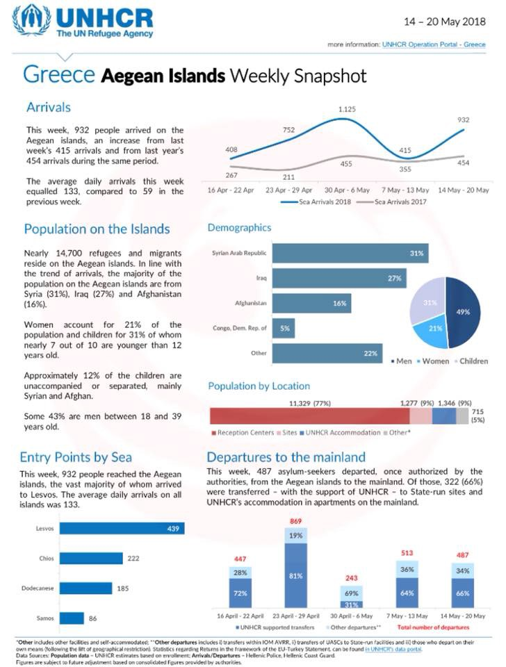
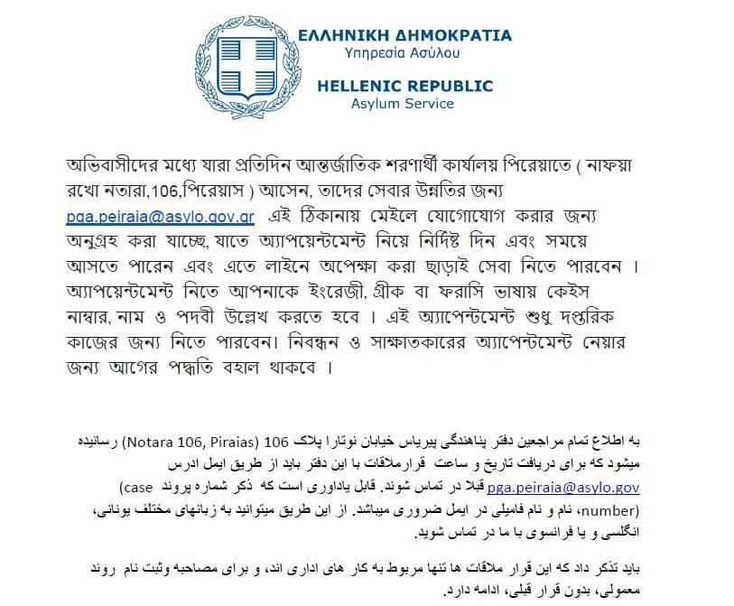
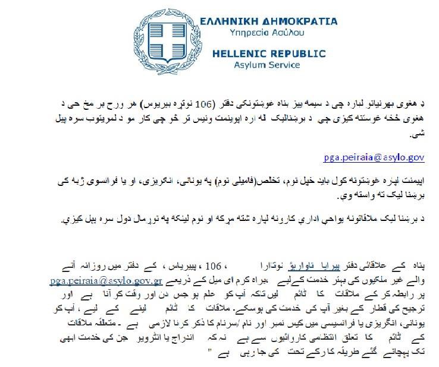
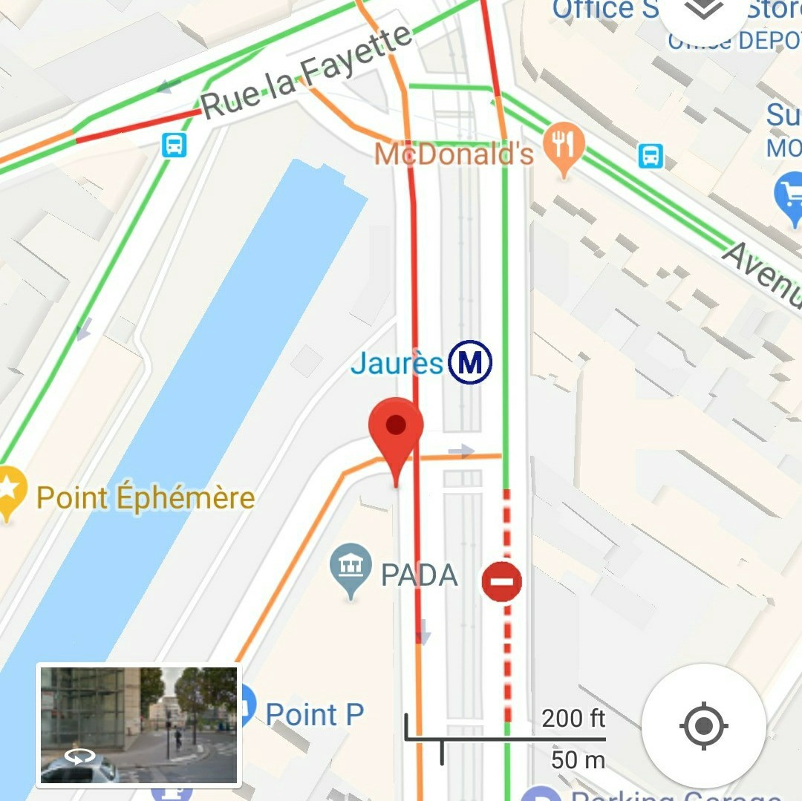

### AYS Daily Digest 22/5/18: The number of victims of bad policies pile up
#### High number of suicides among the young Afghans, who are still deported back to the “safe” country of ongoing conflict and growing number of displaced people / Surge in arrivals to Greece / Nigerian children kidnapped in Libya among the “good stats” of fewer arrivals observed by the EU / Sarajevo’s refugees left to be fed by the citizens of one of the poorest nations on the continent / more news

](assets/cf74626952c9/1*WKYbzfnpFWkYrp5p-SupzQ.jpeg)

CHIOS: The woman who was in one of the boats that landed on the island on May 17 has died at the hospital\. “She arrived in this rubber boat\. She had respiratory problems and at the island’s health centre they had decided to move her urgently to Samos\. Finally, we have been notified of his death today\.” — [Salvamento Marítimo Humanitario](https://www.facebook.com/smhumanitario/)
### Feature
### A rising number of suicides among refugee children

Almost one forth of the young unaccompanied Afghans who have been rejected have tried to commit suicide\.

This is worrying and high statistic, but not surprising, according to Ellenor Mittendorfer\-Rutz, a researcher leading a team [researching about suicidal behaviors](https://www.blankspot.se/nastan-alla-har-funderat-pa-att-ta-sitt-liv/) in this group at Karolinska Institutet in Stockholm\. She continued saying that globally, hardly any other specific group are so highly frequent in the suicidal statistic\.

> 12 suicides among young Afghans were reported in 2017\. 
 

> In comparison with Swedish born youth, the suicidal rate in the group comprising of the rejected Afghan asylum seekers are nine times as high\. 
 

> That means that 51,2 Swedish young people out of every 100 000 would have committed suicide last year if the frequency would have been the same\. Of Swedish youths, the number in reality is 5,2 out of every 100 000\. 

**The researchers estimate that the number is higher in reality\.** A lot of people eligible for the study she conducted, and the research Blank Spot Project has done, have either disappeared after the rejection, when they were granted protection or when they were deported\. She also denounces that the perspective often used by media, saying that Afghans are economic migrants\. As a scientist, she is absolutely sure that if that was true, the suicidal rate wouldn’t be this high within the group\.

On the other hand, Sweden has this Tuesday, May 22, sent a number of young Afghans from Sweden, Arlanda, to Frankfurt to join the German deportation charter that would later in the evening head towards Afghanistan\.

Fights have temporarily **displaced 20 000 people** in Ghazni region of Afghanistan\. Also, in two districts of Uruzgan health facilities have been closed for two weeks due to an ongoing conflict\.

New victims were reported on Tuesday after a blast in the southern Afghan city of Kandahar\. **16 dead and 38 wounded** people, including several children, had been brought in the local hospital, but the final total could be higher as ambulances were still at the scene, it is [reported](https://www.humanitarianresponse.info/en/operations/afghanistan/document/afghanistan-weekly-field-report-14-20-may-2018) \.
#### LIBYA / SEA

> Up to 77% of migrants face abuse, exploitation and trafficking 

More than 100 Nigerian children have been kidnapped in Libya over the past four months, the official in charge of the anti\-human trafficking file in Nigeria has said\.
### GREECE
#### Arrivals

This month land arrivals surpassed sea arrivals for the first time since 2013 when 3,600 people arrived in Evros, and 3,000 by sea\. The increased arrivals in 2018 exceeded the capacity of State\-run sites and apartments to accommodate them\.
#### Chios

There was a police raid in the Vial camp on Tuesday morning, ostensibly to count number of residents, but many people \(no number as yet\) with second rejections were arrested\. “1,468 refugees and immigrants are housed in the four zones of the settlement, of which 201 reside in tents, as evidenced by official police figures”, the Greek media [report](https://astraparis.gr/194-oi-epipleon-prosfiges-stin-vial-kato-apo-1500-o-sinolikos-arithmos/) \.

> The Director of the Asylum Service also provided answers to the discrepancy between the number of guests and the food portions, as there are always additional portions of possible arrivals of refugees, in addition to being housed in structures other than BIAL\. 

The number of people there is well above official capacity of the facility, so it might have possibly been a way to force the hand of authorities to send more people to the mainland & deport the rest, as the the manager of the identification service, Andreas Iliopoulos, also pledged that the number would return to 1274 \.

The trial for the [**Petrou Ralli 8**](ays-special-tragic-story-of-8-algerian-men-from-petrou-ralli-719eea82340) continues on Wednesday\. 
Some activists and volunteers said they would be in the Court of Appeal in Aleksandras & Loukareos street, to show solidarity and demand justice for those in trial\.
### Asylum seekers info

The Greek Asylum Service calls for their clients to schedule appointments by email in order to avoid waiting on their scheduled date of appointment\.

“These appointments concern administrative actions and not the registration of asylum claims or the holding of asylum interviews, which are still served by the already existing procedure”, they say\.

#### BOSNIA AND HERZEGOVINA
### Sarajevo — help needed

Several hundreds of people on the move are currently in Sarajevo, including families and vulnerable people\. Some are accommodated in several hostels, where they get only one meal per day, breakfast, made available by the UNHCR and IOM, who claim they do not have enough resources to provide more than a breakfast for those stuck there\.

As it seems, once again, volunteers and local civil society will have to take a bigger part\. Volunteers are distributing 3 meals a day in the streets in Sarajevo, and the number of people who arrive for these meals increases daily\.

If you can help, please get in touch or donate to local charity pomozi\.ba\. 
Bank: Intesa Sanpaolo Banka BiH; 
SWIFT CODE: UPBKBA22; 
IBAN: BA39 1541802008533048 
Udruženje “Pomozi” 
Address: Dr\. Fetaha Bećirbegovića br\. 8, 71000 Sarajevo; 
Purpose: For refugees 
Paypal: paypal1@POMOZI\.BA
#### BELGIUM

A press conference was held on Tuesday afternoon with the grieving parents of Mawda, the 2\-year\-old toddler who was shot in a chase near Bergen, the story [we reported about previoussly](ays-daily-digest-17-05-2018-fortress-europe-claims-life-of-2-year-old-girl-in-belgium-following-a-5e44cf93e565) \.

[VZWGent4Humanity refugee support](https://www.facebook.com/BelgiumGent4Humanity/?hc_ref=ARSQvUHOHNKnw2NM4nYIJ66ZI_1XXuWHeI6b4ELS0xxZw4Dp2L_GnMLbvTcWzFa9fck&fref=nf&hc_location=group) reports:

> Apparently Mawda’s father had already told his version of the harrowing story yesterday via an interpreter\. He claimed the van was being chased by four police cars, one on each side, and two behind\. The Mawda family were sitting in the front next to the driver,with another family in the back\. 

> During the chase they broke the windows in the back to show the police there were children in the vehicle\. It appears the fatal shot came from the police car driving to the left of the vehicle\. This shot missed the driver and hit Mawda instead\. A police officer attempted to give first aid, but it wasnt enough and to add more misery an ambulance didn’t arrive for another 20 or 30 minutes\! Her parents said they were not allowed to join their child in the ambulance and only found out two days later, after being held in a police cell, that their daughter had died\. 

> According to their lawyer Olivier Stein, **the parents, version of the facts does not match the version of the prosecution service\.** He’s asked that an independent parliamentary committee of inquiry looks into this case\. 

“An investigation into Mawda’s death is taking place, and the deceitful attempts to cover up the truth have been exposed\.

Once again, Belgian authorities have much to answer for, with this being far from the first time we have heard accounts of excessive force and violence from Belgian police”, the Mobile Refugee Support says\.

In Brussels people are requested to hang 2 year old’s clothes at their window on Wednesday, in protest at the killing of the child\. There will then be a mass laying of these clothes outside the Palais de Justice at 5\.30 pm
#### FRANCE

 in Grande Synthe working alongside the [Refugee Community Kitchen](https://www.facebook.com/refugeeCkitchen/?fref=mentions) \.
“Although it is a warm and sunny afternoon, the mood on\-site amongst the Kurdish community is still heavily subdued by the events of last week\.” \(Photo: [Mobile Refugee Support](https://www.facebook.com/MobileRefugeeSupport/?hc_ref=ARTBoUba7qHQOPBsZQ9uCkAMXZ9LuEo4Hzr7FvLFPXAXt2WqIpL_p_zUhR5vesoJvx8&fref=nf) \)](assets/cf74626952c9/1*EESb7lE2d42d--AVT_Cy4w.jpeg)

[Mobile Refugee Support](https://www.facebook.com/MobileRefugeeSupport/?hc_ref=ARTBoUba7qHQOPBsZQ9uCkAMXZ9LuEo4Hzr7FvLFPXAXt2WqIpL_p_zUhR5vesoJvx8&fref=nf) in Grande Synthe working alongside the [Refugee Community Kitchen](https://www.facebook.com/refugeeCkitchen/?fref=mentions) \.
“Although it is a warm and sunny afternoon, the mood on\-site amongst the Kurdish community is still heavily subdued by the events of last week\.” \(Photo: [Mobile Refugee Support](https://www.facebook.com/MobileRefugeeSupport/?hc_ref=ARTBoUba7qHQOPBsZQ9uCkAMXZ9LuEo4Hzr7FvLFPXAXt2WqIpL_p_zUhR5vesoJvx8&fref=nf) \)
### Paris

[Photos for asylum seekers — refugees](https://www.facebook.com/photos4refugees/) is a volunteer group that would like to help the refugees gathered around Paris in the process of getting documents\.
They have professionals and photographers provide free photos for people’s asylum requests\.

The Photographic program has been arranged once a week\.
Time and location: every Saturday from 10:00 to 12:00 in Turin de la villette
And from 14:00 to 16:00 in jaures\.

They guarantee all photos will be used exclusively and only for those purposes, and in any of the social networking networks or someone else will not be given except to the person photographed\.

![Pashto:
په فرانسه کی هغه ټولو مهاجرو او پناه غوۺتونکو دپام وړ\!
محترمو دوستانو، 
مونږ د رضاکارانو یو گروپ یواو غواړو چی تاسی سره داسنادو لپاره دعکسونو اخیستلو کی مرسته وکړو ، مونږ ددی لپاره مسلکی کسان او وسایل لرو چی ستاسی عکسونه دپناه غوۺتنی لپاره په مفته توگه واخلو چی دا کړنه به دهری شنبی ورز د 10 نه تر12 بجوپوری په پخت دی لا ولیت \(porte de la villette\)او د 2 نه تر 4 بجوپوری په جوغیس\(Jaures\) ساحه کی ترسره کیږی ،
که تاسو عکسونوته ضرورت لری نو کولای شی چی زمونږسره د پخت دی لا ولیت\(porte de la villette\) او یا په جوغیس\(Jaures\) کی په ذکرشوو وختونو کی وگوری \.
ټول عکسونه به فقط ستاسی دضرورت لپاره استعمالیږی او دابه میدیا او یابل چاته نه ورکول کیږی \.
Dari:
به تمام مهاجران و پناهجویان 
دوستان عزیز 
ما گروهی داوطلب هستیم که دوست داریم شما را برای عکسهای مورد نیاز برای اسناد تان کمک کنیم\. 
ما امکانات و عکاسان حرفه ای داریم و می توانیم عکسهای لازم
برای درخواست پناهندگی تان را به طور رایگان فراهم کنیم\. 
برنامه عکاسی ترتیب داده شده هفته ای یک بار می باشد 
زمان و مکان : هر شنبه از ساعت 10:00 الی 12:00 در porte de la Villette 
و از ساعت 14:00 الی 16:00 در Jaures\. 
اگر نیاز به عکس دارید می توانید مارا در ایستگاه مترو porte de la Villette \( map\. 1\) و یا در Jaures \(map\.2\) در ساعت های ذکر شده ملاقات کنید\.
تمامی عکسها منحصراً و تنها برای اهداف شما استفاده می شوند و در هیچ یک از شبکه های اجتماعی نشر و یا به شخص دیگری داده نمی شود مگر به شخص خودتان\. 
ما رعایت حریم خصوصی تان را کاملاً ضمانت میکنیم، به ما اعتماد کنید\.
Arabic: 
الى كل اللاجئين و طالبي اللجوء:
اصدقائي الأعزاء،
نحن مجموعة من المتطوعين و نريد أن نساعدكم بالنسبة للصور المحتاجة لموضوع الوثائق\.
لدينا مصور احترافي و ما يحتاجه من عدة، يمكننا تصويرك الصورة اللازمة لطلب لجوءك مجانا \. لدينا جلسة تصوير مرة كل اسبوع\. كل سبت من الساعة العاشرة ١٠ الى الساعة الثانية عشر ١٢ في العنوان الآتي porte de la Villette\. ومن الساعة ال الثانية بعد الضهر ١٤ الى الساعة الرابعة ١٤ في العنوان التالي Jaures\.
اذا كنت محتاجا لصورة، يمكننا لقاءك في محطة قطار porte de la Villette \(الخريطة الاولى\)
او في Jaures \( الخريطة الثانية\) قي الاوقات المذكورة مسبقا\.
Tigrinya:
ንኩላትኩም ስደተኛታትን ሓተቲ ዑቅባን 
ዝከበርኩም ኣሕዋት
ንሕና ጉጅለ ገበርቲ ሰናይ አና፡ንሰነዳትኩም ዝከውን ስእሊ ንክትሰኣሉ ክንሕግዘኩም ዱሉዋት ኢና። ብቁዓት ዝኮኑ ሰኣልትን መስኣሊ ካሜራታትን ኣሎና።
ነቲ እትሓትዎ ዑቅባ ዝከውን ስእሊ ብነጻ ከነዳልወልኩም ንክእል።እዚ ድማ ኣብ ሰሙን ሓንቲ መዓልቲ ናይ ስእሊ ምውሳድ ኣዳሊና ኣለና፡ ወትሩ ቀዳም ካብ ሰዓት 10፡00 ቅ\.ቀ ክሳብ ሰዓት12፡00ቅ\.ቀ ኣብ ported lavillette ከምኡ’ውን ካብ ሰዓት 14፡00ድ\.ቀ ክሳብ 16፡00ድ\.ቀ ኣብ jaures\.
እንድሕሪ ስእሊ ክትሰኣሉ ደሊኩም ኣብ Metro station ported lavillette\(map 1\) ወይ ድማ ኣብ jaures\(map 2\) በዚ ዝተጠቅሰ ሰዓታት ክትረክቡና ትክእሉ ኢኩም።
ኩሉ ስእልታት ድማ ንሰነዳትኩም ጥራይ እዩ ዘገልግል ከምኡ’ውን ኣብ ዝኮነ መራከቢ ቡዙሃን\(social media\) ኣይዝርጋሕን እዩ፡ ብዘካ ንዋኑኡ ንካልእ ሰብ ውን ኣይወሃብን እዩ። 
ምሉእ ብምሉእ ዉሑስ ዝኮነ ኣገልግሎት ክንህበኩም ሙካና ከነረጋግጽልኩም ንፈቱ፡ ክትኣሙኑና ንላቦ።](assets/cf74626952c9/1*uk2dXY1YOxbGeqypHHnW5A.jpeg)

Pashto:
په فرانسه کی هغه ټولو مهاجرو او پناه غوۺتونکو دپام وړ\!
محترمو دوستانو، 
مونږ د رضاکارانو یو گروپ یواو غواړو چی تاسی سره داسنادو لپاره دعکسونو اخیستلو کی مرسته وکړو ، مونږ ددی لپاره مسلکی کسان او وسایل لرو چی ستاسی عکسونه دپناه غوۺتنی لپاره په مفته توگه واخلو چی دا کړنه به دهری شنبی ورز د 10 نه تر12 بجوپوری په پخت دی لا ولیت \(porte de la villette\)او د 2 نه تر 4 بجوپوری په جوغیس\(Jaures\) ساحه کی ترسره کیږی ،
که تاسو عکسونوته ضرورت لری نو کولای شی چی زمونږسره د پخت دی لا ولیت\(porte de la villette\) او یا په جوغیس\(Jaures\) کی په ذکرشوو وختونو کی وگوری \.
ټول عکسونه به فقط ستاسی دضرورت لپاره استعمالیږی او دابه میدیا او یابل چاته نه ورکول کیږی \.
Dari:
به تمام مهاجران و پناهجویان 
دوستان عزیز 
ما گروهی داوطلب هستیم که دوست داریم شما را برای عکسهای مورد نیاز برای اسناد تان کمک کنیم\. 
ما امکانات و عکاسان حرفه ای داریم و می توانیم عکسهای لازم
برای درخواست پناهندگی تان را به طور رایگان فراهم کنیم\. 
برنامه عکاسی ترتیب داده شده هفته ای یک بار می باشد 
زمان و مکان : هر شنبه از ساعت 10:00 الی 12:00 در porte de la Villette 
و از ساعت 14:00 الی 16:00 در Jaures\. 
اگر نیاز به عکس دارید می توانید مارا در ایستگاه مترو porte de la Villette \( map\. 1\) و یا در Jaures \(map\.2\) در ساعت های ذکر شده ملاقات کنید\.
تمامی عکسها منحصراً و تنها برای اهداف شما استفاده می شوند و در هیچ یک از شبکه های اجتماعی نشر و یا به شخص دیگری داده نمی شود مگر به شخص خودتان\. 
ما رعایت حریم خصوصی تان را کاملاً ضمانت میکنیم، به ما اعتماد کنید\.
Arabic: 
الى كل اللاجئين و طالبي اللجوء:
اصدقائي الأعزاء،
نحن مجموعة من المتطوعين و نريد أن نساعدكم بالنسبة للصور المحتاجة لموضوع الوثائق\.
لدينا مصور احترافي و ما يحتاجه من عدة، يمكننا تصويرك الصورة اللازمة لطلب لجوءك مجانا \. لدينا جلسة تصوير مرة كل اسبوع\. كل سبت من الساعة العاشرة ١٠ الى الساعة الثانية عشر ١٢ في العنوان الآتي porte de la Villette\. ومن الساعة ال الثانية بعد الضهر ١٤ الى الساعة الرابعة ١٤ في العنوان التالي Jaures\.
اذا كنت محتاجا لصورة، يمكننا لقاءك في محطة قطار porte de la Villette \(الخريطة الاولى\)
او في Jaures \( الخريطة الثانية\) قي الاوقات المذكورة مسبقا\.
Tigrinya:
ንኩላትኩም ስደተኛታትን ሓተቲ ዑቅባን 
ዝከበርኩም ኣሕዋት
ንሕና ጉጅለ ገበርቲ ሰናይ አና፡ንሰነዳትኩም ዝከውን ስእሊ ንክትሰኣሉ ክንሕግዘኩም ዱሉዋት ኢና። ብቁዓት ዝኮኑ ሰኣልትን መስኣሊ ካሜራታትን ኣሎና።
ነቲ እትሓትዎ ዑቅባ ዝከውን ስእሊ ብነጻ ከነዳልወልኩም ንክእል።እዚ ድማ ኣብ ሰሙን ሓንቲ መዓልቲ ናይ ስእሊ ምውሳድ ኣዳሊና ኣለና፡ ወትሩ ቀዳም ካብ ሰዓት 10፡00 ቅ\.ቀ ክሳብ ሰዓት12፡00ቅ\.ቀ ኣብ ported lavillette ከምኡ’ውን ካብ ሰዓት 14፡00ድ\.ቀ ክሳብ 16፡00ድ\.ቀ ኣብ jaures\.
እንድሕሪ ስእሊ ክትሰኣሉ ደሊኩም ኣብ Metro station ported lavillette\(map 1\) ወይ ድማ ኣብ jaures\(map 2\) በዚ ዝተጠቅሰ ሰዓታት ክትረክቡና ትክእሉ ኢኩም።
ኩሉ ስእልታት ድማ ንሰነዳትኩም ጥራይ እዩ ዘገልግል ከምኡ’ውን ኣብ ዝኮነ መራከቢ ቡዙሃን\(social media\) ኣይዝርጋሕን እዩ፡ ብዘካ ንዋኑኡ ንካልእ ሰብ ውን ኣይወሃብን እዩ። 
ምሉእ ብምሉእ ዉሑስ ዝኮነ ኣገልግሎት ክንህበኩም ሙካና ከነረጋግጽልኩም ንፈቱ፡ ክትኣሙኑና ንላቦ።

Vestiare needs help and donations\.

They currently lack: shampoos, shower gel, soaps, toothpaste, tooth brushes, déodorant, shaving rasors, shaving gel/cream, creme, Dexeryl, baby food and milk, sanitary pads\.

They also need clothes: shoes size 40 to 45, trousers size 38 to42, socks, boxer shorts, hats, backpacks, sleeping bags, belts, pens and notebooks\.

If you want to join their volunteers, text them via SMS to the number 06 03 02 83 72 or inscribe on their list\.
### Join the tandem learning

[Réseau des Exilés en France](https://www.facebook.com/refasso/?hc_ref=ARTEbxhGFkNcLtrILL0mbGsaArzJas8fBCuwvBE5wQgyPPZVZAwSPMM5C-iurEiKX00&fref=nf) invites the French citizens to use their free time and knowledge of the French language and culture to help people who are in need of those competences and take part in t [heir project](https://www.ref-asso.org/cours-de-francais-2/?lang=fr) \. Everyone interested can contact them directly\.
#### DENMARK

Danish right wing populist political party wants to make it harder for foreigners to work in Denmark, the country that has already lowered the ceiling for incomes among non\-citizens\. The party currently works on a new proposition, saying that companies shouldn’t be allowed to hire people from abroad unless they first tried, and failed, to find a Danish employee\. Their representative [said](https://politiken.dk/indland/art6527340/DF-takker-nej-til-minister-om-flere-udl%C3%A6ndinge-i-job) that they shouldn’t import labor from the Middle East, Africa or China\.

This move indirectly target migrants, since it creates an even more hostile environment toward non\-Danes in the country and fuels the narrative saying that people come here to steal jobs\.

**We strive to echo correct news from the ground through collaboration and fairness\.**

**Every effort has been made to credit organizations and individuals with regard to the supply of information, video, and photo material \(in cases where the source wanted to be accredited\) \. Please notify us regarding corrections\.**

**If there’s anything you want to share or comment, contact us through Facebook or write to: areyousyrious@gmail\.com**

_Converted [Medium Post](https://medium.com/are-you-syrious/ays-daily-digest-22-5-18-the-number-of-victims-of-bad-policies-pile-up-cf74626952c9) by [ZMediumToMarkdown](https://github.com/ZhgChgLi/ZMediumToMarkdown)._
