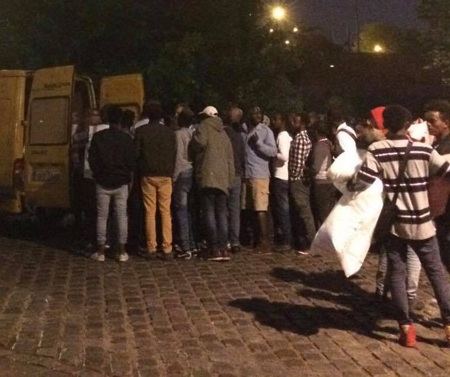

### AYS Daily Digest 23/05/2018 The many faces of the UN

50 people arrested in Morocco /// Protests in Northern Greece /// One person drowned on the Croatian\-Slovenian border /// Eviction threats for Parisian Camps /// Police abuse in Germany

 \)](assets/690e37408a52/1*CIhBMKc_4v5efltG4rr1nQ.jpeg)

Same shit different island\. “The future depends on our ability to come together across painful divides, and to take leadership from those who traditionally have been most excluded\. We have reached the limits of siloed politics, where everyone fights in their own corner without mapping the connections between our various struggles, and without a clear idea of the concepts and values that must form the moral foundation of the future we need”\. Naomi Klein, No is not enough \(by [The Welcome Tent](https://www.facebook.com/thewelcometent/) \)
#### Feature — The many faces of the UN

Just three days after [AYS reported](ays-daily-digest-20-05-2018-hollow-victories-serve-only-publicity-8d204897c984) on UNHCR’s hollow celebration of the organisation’s joint effort with IOM to return 132 people to Niger from Libya the OHCHR \(Office of the United Nations High Commissioner for Human Rights\) have published a [press release](http://www.ohchr.org/SP/NewsEvents/Pages/DisplayNews.aspx?NewsID=23114&LangID=E) condemning collective expulsions to Niger by Algeria\.

Having visited Niger OHCHR interviewed people who had been forced to return there from Algeria, they reported that:

> What is particularly worrying is that most of the people we spoke to said that they were not subjected to individualised assessments, and were not informed of the reasons for their detention, nor were they allowed to pick up their belongings, passports or money before they were expelled\. Many had to leave behind everything they had\. 

Some then faced a period of detention in the military bases in Blida and Zeralda on the outskirts of the city of Algiers or in a compound in Oran before being transferred to Tamanrasset in southern Algeria\.

> Conditions of detention are reported to be inhuman and degrading\. From Tamanrasset, Nigeriens are transferred by bus to Agadez in Niger, while the others are crammed into big trucks to be transferred to the Nigerien border where they are abandoned and left to walk hours in the desert heat to cross the border into Niger\. 

With the Algerian Government, UNHCR and IOM all so set on returning people to Niger, you would think it must be a thriving and safe country, right?

Unfortunately this does not seem to be the case, Amnesty International’s [latest report](https://www.amnesty.org/en/countries/africa/niger/report-niger/) on Human Rights in Niger regarding migrant rights states that:

> Over 60,000 refugees and migrants transited Niger on the way to Libya and Algeria \[during2017/2018\] where many suffered serious abuses including rape, unlawful detention in harsh conditions, ill\-treatment and extortion, and unknown numbers died\. Operations to arrest perpetrators pushed smugglers to use more dangerous routes to Libya or Algeria\. 

> In May, eight migrants from Niger, including five children, died of thirst after they were abandoned on the way to Algeria; and 92 migrants were found close to death by the Niger Army after being beaten and abandoned by their driver in the desert near Bilma in the north\. In June, 44 migrants, including babies, were found dead in the desert near Agadez, central Niger, after their vehicle broke down on the way to Libya\. 

Niger is a country where 82% of the population live in extreme poverty, in which 2\.2 million citizens are in need of humanitarian support, and which is in the middle of an armed conflict with, among other groups, Boko Haram, who have repeatedly kidnapped young women and girls\.

We understand that the UN is a large and multi\-armed agency, and that it is time consuming to read country reports by human rights groups, especially if this messes up your plans to return perfectly decent humans to places with terrible living conditions, against their will and against the law\. But if all of this is absolutely necessary, then at least try and cover it up a little better\.

**Syria**
#### MSF reiterates their request to access and provide care in government areas

■■■■■■■■■■■■■■ 
> **[MSF International](https://twitter.com/MSF) @ Twitter Says:** 

> > #Syria: Needs for medical care do not change when frontlines do! 

After 7 years of being denied access, we again request the Syrian government to grant us access to all areas to provide medical treatment to people in dire need. [bit.ly/2IG9KKR](http://bit.ly/2IG9KKR) https://t.co/nDTK5x010D 

> **Tweeted at [2018-05-23 09:04:30](https://twitter.com/msf/status/999214475030028288).** 

■■■■■■■■■■■■■■ 

**Morocco**

A researcher [report](https://twitter.com/alzoubeidi) s that 50 people from Sub\-Saharan Africa were arrested by Moroccan authorities while attempting to reach Spain\.

**Greece**

**Islands**

[Aegean Boat Report](https://www.facebook.com/AegeanBoatReport/?hc_ref=ARSqJJ5nWBQ3vaXQ7MgiYDdgFKKGTxvzPyx77XogXBP1JJc3nP-zRE8xzj7UOi8ZHXE&fref=nf) informed that a boat ended up in trouble while attempting to cross towards the south of Lesvos last night\.

> Information from the boat was received at 01\.40am, the boats engine had stopped, and the boat was taking in water\. The Turkish Coast Guard was informed at 01\.44, boat was detected 02\.10\. 

> 31 people was picked up by TCG, amongst them 10 children\. 

**Mainland Greece**
#### Protest in Diavata Camp

Local media [report](http://www.ekathimerini.com/228954/article/ekathimerini/news/migrants-protest-conditions-at-diavata-facility?utm_source=ECRE+Newsletters&utm_campaign=0a18457b6b-EMAIL_CAMPAIGN_2018_05_23&utm_medium=email&utm_term=0_3ec9497afd-0a18457b6b-422318649) that refugees living in the camp in the Diavata area, in northern Greece, were staging a protest over conditions at the camp yesterday\.

Allegedly, around 100 people took part in the protest\.
#### Dublin Approvals from June 2017 can finally book their ticket

From the [Mobile Info Team for Refugees](https://www.facebook.com/mobileinfoteam/) :

> If you are doing reunification to a family member in Germany and your reunification request got accepted in June 2017, you can book your tickets now\. The same applies to approved family reunification applicants to all other countries than Germany, that were approved in December 2017 and January 2018\. At the moment you can book your ticket at any travel agency and you have to book the ticket on your own\. If you go to the travel agency, you need to bring the white cards of all approved family members and your approval paper for the family reunification\. 

> You have to make sure, that the travel agency speaks with the Dublin Unit, to confirm that you are allowed to travel and confirms your travel date\. Always make sure, that this has happened before you pay for your tickets\! We have seen people that were refused in the airport because their transfer wasn’t validated with the Dublin Unit\. 

> If you have a lawyer or social worker, it would be best to get support with booking your ticket from them\. If you don’t have anybody to help you, we have prepared a letter you can bring to the travel agency\. The letter explains to the travel agency what you want and how to get in contact with the Dublin Unit\. 

> You can find the letter under the following link: [www\.mobileinfoteam\.org/fr1](http://www.mobileinfoteam.org/fr1) 

Check [their post](https://www.facebook.com/mobileinfoteam/posts/2175573082671409:0) for Arabic and Farsi translations

**Support needed and volunteers opportunities**
#### [Project Elea](https://www.facebook.com/projectelea.volunteers/) is looking for educators

> _‘Education is a form of protection\.’_ 

> Since May 2017 Project Elea Education has provided Language support to over 500 refugees from Eleonas Refugee camp, 

> The international teaching team has worked to provide the residents with language skills ranging from basic literacy to B2 English and Furthermore, TEFL Training, CV writing workshops, German, French and Spanish classes\. It is because of this powerful teaching team that the residents of Eleonas now have the ability to communicate, express themselves, protect themselves and look to a better future for them and their loved ones\. 

> If you think that you have the skills to empower through education and language support, please contact Education@projectelea\.org\. 

#### Ice Distribution Project

From [Refugee4Refugees](https://www.facebook.com/Refugee4Refugees/posts/667296243614054?hc_location=ufi) :

> Ramadan has arrived, and a hot Lesvos summer has arrived with it\! The residents of the Kara Tepe have very few ways to cool down on these cloudless days, with temperatures in their shelters reaching up to 40℃ \(104℉\) \. With the majority of residents fasting, this can be very dangerous\! 

> Refugee4Refugees is collecting donations for a project to deliver ice to every child, family, and vulnerable individual in Kara Tepe, daily\. 100% of every donation will go to making and delivering ice to the people\. 

> Please donate what you can to help keep them cool\! Go to [https://refugee4refugees\.org/donate/](https://refugee4refugees.org/donate/) 

**Bosnia**
#### Updates from local volunteers

After the first camp was open in Mostar, where about 260 people were accommodated, nothing else was done to respond to the growing number of people arriving in Bosnia\.

In Sarajevo, several hundred people are sleeping in the streets, and around 200 are in different hostels and hotels funded by the IOM and UNHCR\. Nevertheless, both of these big organizations recently decided to stop paying for 3 meals a day for people living in their hostels, and now offer only breakfast\. Apparently, the reason for this is a lack of funding for IOM and UNHCR\.

The Red Cross, who are working in the camps in Mostar and Bihac, call for help with food donations\. Apparently, even the Red Cross has no money\.

The state continues to be very passive in all this and there is no clear information about what is actually provided by the state at the moment\.

Volunteers and locals continue to help\.

If you are considering helping, you can do that via the local charity [Pomozi\.ba](https://www.facebook.com/pomozi.ba/) Paypal: paypal1@pomozi\.ba

**Slovenia**
#### One person drowned in the Kupa river between Croatia and Slovenia

Slovenian police arrested two people after they crossed the river to enter Slovenia, while a third person didn’t make it and drowned, Infomigrants [report](http://www.infomigrants.net/en/post/9419/82-migrants-blocked-in-slovenia-one-drowns-in-river?utm_source=ECRE+Newsletters&utm_campaign=0a18457b6b-EMAIL_CAMPAIGN_2018_05_23&utm_medium=email&utm_term=0_3ec9497afd-0a18457b6b-422318649) \. This is the fifth person to die in the same area this year\.

Already last week Slovenian authorities blocked 82 people who were trying to reach the country from Croatia\. All of them applied for international protection and are now housed in a reception centre\. They come from: Afghanistan, Pakistan, Morocco, Algeria, India, Libya, and Egypt\. Three more people were found on a truck at the Bregana crossing between the two countries\.

**France**
#### Paris camps face eviction

Yesterday French Interior minister Gertard Collomb stated that makeshift camps around Paris will be dismantled, media [report](https://abcnews.go.com/International/wireStory/french-government-orders-evacuation-paris-migrant-camp-55373652) \.

Collomb brought together the prefect of Paris police and the prefect of the ile\-de\-France region, to ask them to design the procedures for an evacuation operation, to be carried out at short notice\.

Media are highlighting the contrast between the minister — promoter of harsher immigration policies and of the immigration bill being voted on in these weeks — and Anne Hidalgo, mayor of Paris, who opposed the camps’ eviction during the last weeks\. But as of today, still no solution has been implemented for the 2,500 people living in inhuman conditions throughout the city\.

The present condition is a direct consequence of the deterrence policies of the Macron government, which aimed to “make life impossible” for men, women and children claiming asylum in the country\.
#### Demonstration launched in Paris for the 2nd of June

A coalition of collectives and associations [launched](https://blogs.mediapart.fr/marche-des-solidarites/blog/230518/manifestation-contre-la-loi-asile-immigration-le-2-juin?utm_source=facebook&utm_medium=social&utm_campaign=Sharing&xtor=CS3-66) a demonstration in Paris against the new immigration bill\.

](assets/690e37408a52/1*jaMayDMQxrZpxqkbuDvENg.jpeg)

[Marche des solidarites](https://blogs.mediapart.fr/marche-des-solidarites/blog/230518/manifestation-contre-la-loi-asile-immigration-le-2-juin?utm_source=facebook&utm_medium=social&utm_campaign=Sharing&xtor=CS3-66)
#### Update from Paris

From a Volunteer of Care4Calais:

Care4Calais

> On Monday, I went to Paris with Care4Calais to give out donations\. Even though I had heard that the situation there is just as bad as Calais, I still wasn’t prepared for what I saw\. As the volunteer team drove into the city we saw dozens of refugees on the streets and as we distributed donations at night, it became clear how serious the situation is\. 

> At our first stop, we met two boys who had been living in a park and I don’t think I will ever forget how scared and vulnerable they looked\. Next, we went to the millennium camp and found hundreds of people desperate for donations\. Due to the limited number of sleeping bags we currently have at the warehouse, we had to hand out duvets\. Despite them being bulky and far less practical than a sleeping bag, the refugees were happy to take them so they at least had something for warmth at night\. 

> We then delivered clothing and bags to refugees by a canal\. Hundreds of tents line the canal and the conditions are incredibly poor\. I met many teenage boys and young men who gratefully accepted whatever we had however there are so many things they need that we just don’t have enough of, especially trousers and shoes\. When someone shows you the holes in their shoes and you have to tell them that you can’t help, it really is a heart breaking moment\. 

> Our team worked with two amazing volunteers from Paris, Danika and Houda\. Their energy was incredible as they guided us through the city to where donations were most needed\. They also told us that the authorities will again be evicting many soon, forcing them to move elsewhere\. We gave out many backpacks that night but our donations were tiny compared to the number of people in need\. I worry that many of these refugees will soon be travelling again, many with broken shoes, no bags to carry their few belongings, and unsure of when they will next receive aid\. 

Please help, either by volunteering or donating, at [www\.care4calais\.org](http://www.care4calais.org/) ; especially, Care4Calais is in need of trousers:

**Germany**

[Reports from the ground](https://www.facebook.com/permalink.php?story_fbid=579140639124687&id=100010862675397) state that a young African refugee woman was injected and drugged before being transferred to a camp\.

The maltreatment of this woman took place in the refugee camp near Munich: the SST building in the background of the video is at Emmy\-Noether\-Straße 2 82216 Maisach\.

_This is a crime that should not be tolerated\._

**General**

A [press release](https://frontex.europa.eu/media-centre/news-release/migratory-flows-in-april-overall-drop-but-more-detections-in-greece-and-spain-OGO6LA) from FRONTEX states that in April of this year, 10,500 irregular border crossings were detected on the main migratory routes into the EU, which is a third less when compared to the same month last year\.

> In the first four months of 2018, the total number of irregular border crossings dropped 44% compared to a year ago to about 29 700, mainly because of lower migratory pressure on the Central Mediterranean route\. 

In response to this Jugend Rettet have pointed out that decreased numbers of those detected does not necessarily mean that less people are making the journey but are instead being held back or returned due to the EUs externalisation of its borders, and thus being put at further danger\.

■■■■■■■■■■■■■■ 
> **[Jugend RETTET - IUVENTA](https://twitter.com/jugendrettet) @ Twitter Says:** 

> > Decreasing numbers are not a sign of decreasing crossings and less people seeking safety. It is a sign of migration control and pull-back actions by proxy by part of the Libyan Coast Guard, promoted by the EU. It’s a securitization of borders and access to asylum! #safepassage [twitter.com/frontex/status…](https://twitter.com/frontex/status/998554953068228608) 

> **Tweeted at [2018-05-22 07:50:58](https://twitter.com/jugendrettet/status/998833585170927617).** 

■■■■■■■■■■■■■■ 

Furthermore, [Rigardu e V\.](https://www.facebook.com/rigardu/) managed to question FRONTEX during a meeting of the Committee on Civil Liberties, Justice and Home Affairs \(LIBE\) \) about their role in systematic police violence at European borders, as documented at [Borderviolence](http://www.borderviolence.eu/) \.

Read more and access the recordings of the meeting [https://www\.facebook\.com/rigardu/posts/1834826343483908](https://www.facebook.com/rigardu/posts/1834826343483908)

**We strive to echo correct news from the ground through collaboration and fairness\.**

**Every effort has been made to credit organizations and individuals with regard to the supply of information, video, and photo material \(in cases where the source wanted to be accredited\) \. Please notify us regarding corrections\.**

**If there’s anything you want to share or comment, contact us through Facebook or write to: areyousyrious@gmail\.com**

_Converted [Medium Post](https://medium.com/are-you-syrious/ays-daily-digest-23-05-2018-the-many-faces-of-the-un-690e37408a52) by [ZMediumToMarkdown](https://github.com/ZhgChgLi/ZMediumToMarkdown)._
