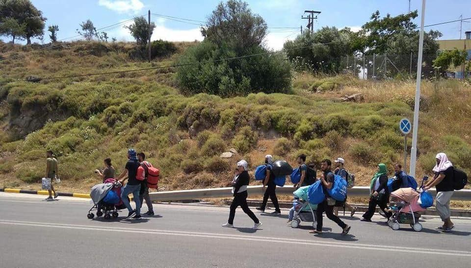
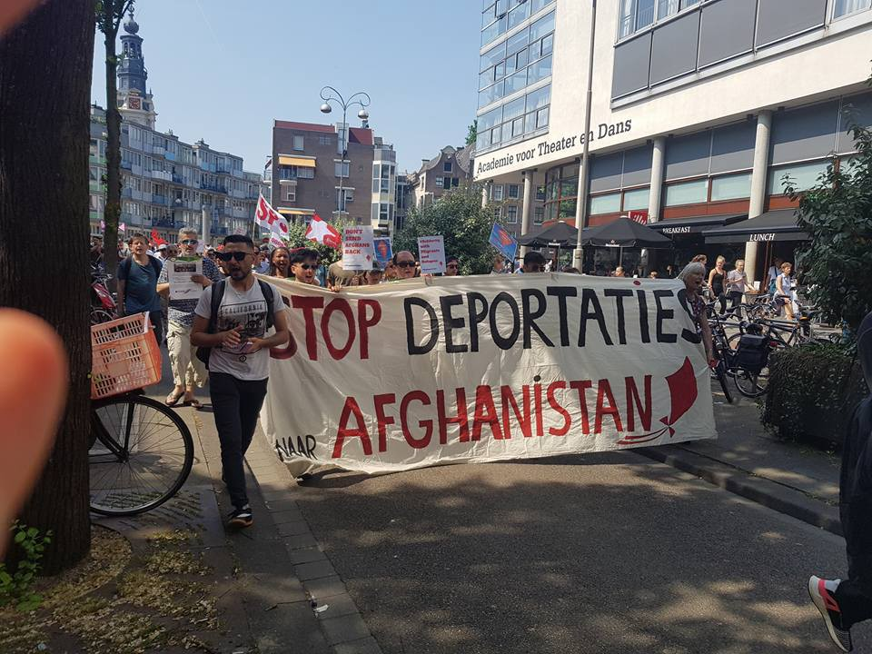

### AYS DAILY DIGEST 26/05/2018: Updates on the situation of the Syrian Kurds who left Moria

_Hundreds of Kurds left Moria after clashes in the camp//News of more deaths in Afghanistan//15 people are reported dead after fleeing from captivity in Libya//Around 2000 people reached Italian shores in the past 48 hours//More news from Greece, Bulgaria, Croatia, Sweden\. \._

Credit: Humans 4 Humanity

**UPDATES**

In yesterday’s [digest](ays-daily-digest-25-05-2018-another-absurd-deal-to-stop-people-from-coming-to-the-eu-1038f888da52) , AYS reported about the fight among Iraqis, Syrians, Afghans and Syrians Kurds in Moria with the consequence of hundreds of people leaving the camp, seeking refugee at Pikpa, Kara Tepe and at the football stadium\.

On Saturday evening, 368 people were hosted by Humans 4 Humanity, while more than 300 \(including residents\) found a safe place in Pikpa, among them injured people, children and pregnant women\.

The number of casualties is yet to be defined and it’s unclear whether there were any at all\. What is sure is that [6 people were taken to the hospital](https://www.facebook.com/pikpalesvos/posts/2089101051365315?hc_location=ufi) to get treatments\.

Support is needed to keep assisting those injured and affected by the horrible situation on the island\.

**AFGHANISTAN**

[Three people died](https://thefrontierpost.com/roadside-bomb-blast-leaves-3-dead/) on Friday and four others were wounded due to the explosion of a landmine\. The incident happened in the Logar province, East side of the country and South of Kabul\. The victims were all adults, but a child is among those wounded\.

Police held Taliban militants responsible for the explosion\.

**LEBANON**

[Media source](https://www.reuters.com/article/us-mideast-crisis-lebanon-law/lebanon-tells-syria-development-law-could-hinder-refugees-return-idUSKCN1IR09O?il=0) reports that the Lebanese Foreign Minister, Gebran Bassil, expressed concern over the “Law 10” issued by the Syrian government and aimed at redeveloping areas of the war torn country\. This regulation could be negative and make it difficult for Syrians to return to their home country as they would have to prove ownership of a specific property before being allowed to return or claim compensation\.

“ _The inability of the refugees to practically present what proves their possession \(of their properties\) during the given time limit might lead to them losing their properties and their sense of national identity”_ stated the Lebanese Foreign Minister, who is also concerned with the fact that the around 1\.5 million of Syrians living in Lebanon would not be able to return easily to their homeland\.

**LIBYA**

MSF reports that at least 15 people were killed, an unclear number was wounded and around 40, mostly women, were “left behind”, when trying to escape from smugglers holding them as prisoners in the town of Bani Walid, 145 km south of Tripoli, on Wednesday evening\.

■■■■■■■■■■■■■■ 
> **[MSF Sea](https://twitter.com/MSF_Sea) @ Twitter Says:** 

> > #LIBYA: Dramatic events in Bani Walid as more than 100 #refugees and #migrants kidnapped and held captive by traffickers managed to escape on Wednesday evening. https://t.co/kcE898OKFU 

> **Tweeted at [2018-05-25 13:37:06](https://twitter.com/msf_sea/status/1000007854600937472).** 

■■■■■■■■■■■■■■ 

MSF treated 25 of the around 140 migrants who tried to escape, some reporting severe gunshot wounds and multiple fractures\. They were mainly young men and teenagers from Eritrea, Ethiopia and Somalia, who were trying to reach European soil and who were sold multiple times\.

“ _Migrant community representatives have said smugglers are now operating further inland, especially around Bani Walid where they run clandestine prisons, and that migrants who are frequently tortured or raped in order to extort money from them or their families are being held for longer”\._

_“Kidnapping for ransom remains a thriving business, boosted by European Union\-sponsored policies aimed at criminalizing migrants and refugees and preventing them from reaching European shores at all cost”_ MSF said\.

**SEA**

[Around 2000 people were rescued](http://www.repubblica.it/cronaca/2018/05/26/news/migranti_duemila_arrivi_in_48_ore_e_a_bordo_della_aquarius_nasce_miracle-197423638/) in the Mediterranean in the past 48 hours by the ICG, Sea\-Watch, Sea\-Eye and MSF; among those rescued, a newborn, Miracle, who was given birth on board of the Aquarius on Saturday\.

■■■■■■■■■■■■■■ 
> **[Craig Spencer MD MPH](https://twitter.com/Craig_A_Spencer) @ Twitter Says:** 

> > So happy that our #MSF medical team onboard #Aquarius just assisted in the delivery of a beautiful &amp; healthy baby boy, Miracle! 

No woman should have to deliver a baby @ sea in a flimsy rubber boat, w/o access to medical care! THIS is why @[MSF_Sea](https://twitter.com/MSF_Sea) is needed in the Mediterranean! https://t.co/vNx3Gkm0oV 

> **Tweeted at [2018-05-26 17:47:41](https://twitter.com/craig_a_spencer/status/1000433303600746496).** 

■■■■■■■■■■■■■■ 

752 reached Italian shores today, including the corpse of a person who could not survive the journey, while other 400 are still on board of Sea Watch’s vessel\.

In Pozzallo, Sicily, after yesterday’s arrival of 296 migrants, a new riot had started inside the hotspot, hosting mainly Tunisians to the maximum limit of capacity\. The authorities are concerned about the increasing number of arrivals from Tunisia, after the EU\-Libya deal\.

In the Alboran sea, 282 people were rescued from 9 different rubber boats today by Salvamento Marítimo\.

■■■■■■■■■■■■■■ 
> **[SALVAMENTO MARÍTIMO](https://twitter.com/salvamentogob) @ Twitter Says:** 

> > Primero... rescatado junto 49 personas más por la salvamar Gadir y luego... evacuado con su tobillo roto a #Jerez por el helimer 220. Sucedió ayer… en el Estrecho. Hoy: 282 #personas rescatadas de 9 #pateras en #Estrecho y #Alboran  [youtu.be/3uSGS5PPZ4k](https://youtu.be/3uSGS5PPZ4k) vía @[YouTube](https://twitter.com/YouTube) 

> **Tweeted at [2018-05-26 17:40:31](https://twitter.com/salvamentogob/status/1000431501626966017).** 

■■■■■■■■■■■■■■ 

**GREECE**

_Arrivals_

34 people landed on Samos early in the morning\.

47 people were rescued off the Northern shore of Lesvos in the evening of Saturday\.

_Mainland_

Greece has asked the EU for [more fundings](http://www.ekathimerini.com/229053/article/ekathimerini/news/eu-funds-sought-for-migrants) , in order to create more accommodations facilities or expand the existing ones for migrants reaching the territory\. A response from the European authorities is due in mid\-June; the fundings received so far were directed to house 60\.000 asylum seekers, according to the Greek sources\.

[Khora is moving](https://www.facebook.com/KhoraAthens/photos/a.534472740058672.1073741829.531581440347802/893115194194423/?type=3&theater) at the end of the month to a new building, the last day of activity will be Friday 1st June\.

They need volunteers to help with the moving and to keep offering the range of services they have been presenting so far\.

**BULGARIA**

No Borders is calling for a week of solidarity actions, from Monday 28th May to Tuesday 5th June, in support of the migrants in detention in the Harmanli centre, where 21 people are detained with the charge of participation in a violent riot\.

“ _The riot broke out when the camp was put under unlawful quarantine after pressure from the far right’s anti\-immigrant propaganda\. 21 Afghani people were sent to court despite clear evidence of police brutality and of random mass beatings after the riot\. No police was investigated_ ”\.

See more [here](http://bulgaria.bordermonitoring.eu/2018/04/26/the-start-of-the-trial-against-the-harmanli-21/) \.

Job opportunities through a job fair\.

**CROATIA**

Today a court decision came, affecting Madina’s family: they will stay in detention, just one person will be released\. The lawyer did not get an explanation of the court decision yet, but this sentence can be considered as a violation of the rule that families cannot be separated, especially after such a huge loss as the death of a child\.

The family and the legal representatives call on the Ministry of the Interior to take any action necessary to keep the family together\.

Previously this week, AYS had already reported about the court decision:

“ _The Administrative Court in Osijek has suspended detention for three members of Madina Hussiny family\. The other two verdicts related to other members of Hussiny family will be delivered by the end of this week\. We, however, cannot be satisfied with this situation seen that there are minimum two families still detained in the center, one of whom is there since March 15th_ ”\.

**AUSTRIA**

A protest to be held in Wien on Tuesday to stop a deportation flight to Kabul\.

**FRANCE**

Appeals for donations for Ramadan\.

**BELGIUM**

[Support is needed](https://www.facebook.com/plateformerefugiesbxl/posts/622989364706696) for Mawda’s little brother and her parents\. The donations will be directed to cover the funeral expenses and help the family to start their life over\.

**THE NETHERLANDS**

Demo against deportations to Afghanistan was held in Amsterdam\.

Credit: Stand up for Afghans — Amsterdam

**SWEDEN**

[Local media reports](http://www.unt.se/ledare/tank-om-staten-ljuger-4988732.aspx) about a new study carried out by 2 specialists in forensic medicine that will prove the fact techniques to establish a migrant’s age are wrongful in half of the cases, especially in regards to dental X\-rays and knees magnetic resonance\.

Despite the fact that many professors and professionals of the medical sector, as well as paediatricians, have expressed their disagreement on the practice of body measurement to determine age, the Minister of Justice, Morgan Johansson, is willing to carry on, not even considering international treaties on the rights of the child nor European regulations that state that it is better to give the benefit of the doubt if the age of the child is unclear\.

**We strive to echo correct news from the ground through collaboration and fairness\.**

**Every effort has been made to credit organizations and individuals with regard to the supply of information, video, and photo material \(in cases where the source wanted to be accredited\) \. Please notify us regarding corrections\.**

**If there’s anything you want to share or comment, contact us through Facebook or write to: areyousyrious@gmail\.com**

_Converted [Medium Post](https://medium.com/are-you-syrious/ays-daily-digest-26-05-2018-updates-on-the-situation-of-the-syrian-kurds-who-left-moria-272aafe46299) by [ZMediumToMarkdown](https://github.com/ZhgChgLi/ZMediumToMarkdown)._
